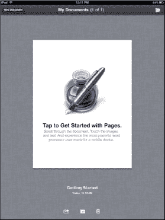
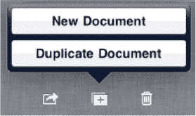
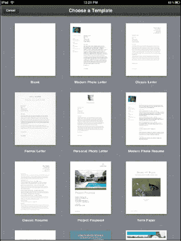
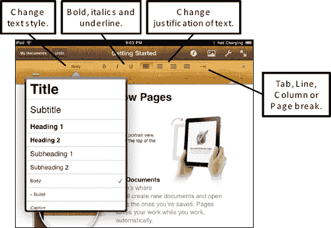
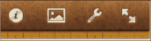
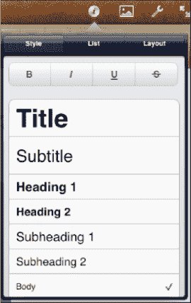

# 使用 Pages

`Pages` 是 Apple 的文字处理程序。如果你使用 Mac，你会熟悉 Pages 程序的布局和功能。虽然它并非旨在完全替代桌面文字处理器，但 `Pages` 功能相当强大，可以让你编辑和创建出非常专业的文档。

使用 `Pages`，你不仅可以创建文档；还可以通过电子邮件发送它们，或将其上传到在线账户，以便轻松查看、共享和打印。

## 首次使用 Pages

当你首次启动 `Pages` 时，你会看到一个名为“Getting Started”的示例文档。这是了解 `Pages` 许多功能的一个很好的教程。我们建议你通读此文档，了解与 `Pages` 相关的各种样式、对象和工具栏。

要开始一个新文档，请触摸底部的 `New Document`（新建文档）按钮。当你触摸 `New Document` 按钮时，你可以选择从头开始创建新文档，或者复制当前显示的文档。

**提示：** 如果你想把现有文档用作模板，选择 `Duplicate Document`（复制文档）会很有用。否则，请选择 `New Document` 来创建新文档。

## 选择新文档模板

当你选择 `New Document` 时，有 16 个可用的模板供你选择。这些模板都是通用型的，比如 `Poster`（海报）、`Proposal`（提案）或 `Term Paper`（学期论文）。你可以选择从一个模板开始（这可能会使格式设置更容易），或者直接选择 `Blank`（空白）（位于左上角）从空白页开始（参见 图 19–3）。

模板中的所有内容都可以更改或调整，所以请大胆尝试。

**注意：** 对于需要特定格式和外观的文档（如简历和信函），模板非常有用。

一旦做出选择，你就可以开始编写和编辑，将模板变成完美的文档。

**图 19–3.** *`Pages` 中的页面布局*

## 使用工具和样式

与大多数文字处理器一样，`Pages` 为你提供了许多为文档添加各种样式的选项。内置工具栏让你可以轻松访问自定义文档的大部分功能。

右上角工具栏上有四个特定的按钮，它们在你的写作中会非常有用：`Information`（信息）、`Picture/Object`（图片/对象）、`Tools`（工具）和 `Full Screen`（全屏）。

### 信息按钮

只有在选中文本或其他项目（如图形）后，`信息`按钮才会生效。

此按钮可让您完成以下操作：

- 设置特定样式，例如标题、副标题或说明文字
- 更改字体、字号或颜色
- 更改带有项目符号和编号的列表的设置
- 更改对齐方式/两端对齐和行间距

请按照以下步骤调整文档中的样式：

1. 在文档中选择文本。
2. 轻点`信息`按钮。
3. 轻点`样式`按钮。
4. 滚动列表以选择合适的样式，然后触摸该样式。此时，您选择的样式旁边会出现一个`对勾`图标。

您还可以通过触摸相应的按钮来添加**粗体**、*斜体*、下划线或`删除线`。

