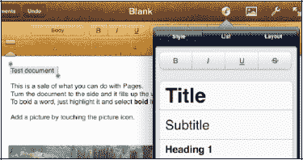
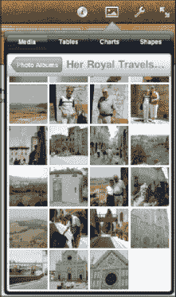
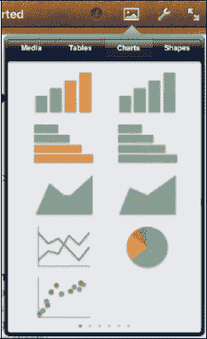
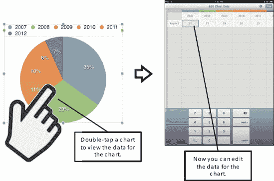
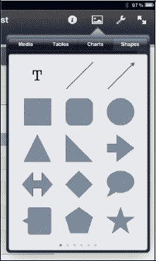
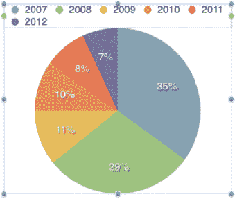
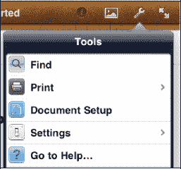
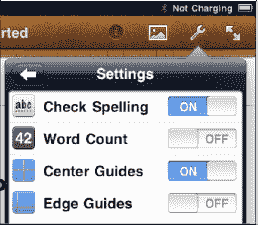
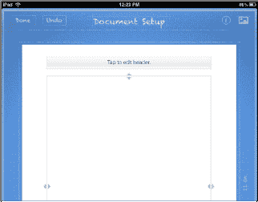
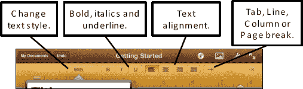

# 选择文本以应用样式或剪切/复制

您选择的样式可以应用于接下来要输入的文本，也可以应用于文档中已有的选定文本。

请按以下步骤选择已输入的文本：

1. 双击以选择一个单词。
2. 三击以选择一个段落。

请按以下步骤选择`Pages`模板中的文本：

1. 按住一个单词以将其选中。
2. 双击以选择一个段落。

选定文本后，使用工具栏或`信息`（`i`）按钮选择要应用于所选文本的样式，如图所示。

#### 图片/对象按钮

在`信息`按钮旁边，您会找到`图片/对象`按钮。触摸此按钮可将媒体、表格、图表或形状插入到文档中。

首次触摸此按钮时，您将看到`媒体`选项卡高亮显示，并且您的所有相册都可见。

要选择照片，请浏览可用的相册，然后选择要使用的照片。

要向文档添加表格，请触摸`表格`选项卡，并从显示的多种表格格式中进行选择。

**注意：** 表格共有六个屏幕；请从右向左滑动以浏览这些屏幕。

请按照以下步骤插入图表：

1. 触摸`图表`选项卡并滑动浏览屏幕。
2. 轻点您想要插入的图表。

请按照以下步骤编辑图表背后的数据（参见图 19–4）：

1. 双击图表，使其翻转过来，显示一个数据表。
2. 输入创建图表所需的数据。
3. 完成后按右上角的`完成`，即可看到更新后的图表。

**图 19–4.** *如何在`Pages`中编辑图表数据*

请按以下步骤插入形状：

1. 触摸`形状`选项卡并滑动浏览屏幕。
2. 轻点您想要插入的形状。

请按以下步骤移动或调整形状大小：

1. 按住形状以在页面上拖动。
2. 触摸两个角点，捏合或张开以使其变小或变大。
3. 将两根手指放在形状内部并旋转，以旋转该形状。

要移动或调整图片、图表或对象的大小，只需轻点一次以调出蓝色圆点。按住该对象并在页面上将其移动到任意位置。您会注意到，当您移动对象时，文本会围绕对象重新排列。

**提示：** 要更改或调整文本绕排，只需在图片或对象高亮显示时触摸`信息`按钮，然后选择`排列`。触摸`绕排`按钮，并为文本绕排选择一种样式。

## 工具按钮（打印、查找、设置和帮助）

在`图片/对象`按钮旁边是`工具`按钮。触摸此按钮可访问`查找`、`打印`、`文稿设置`、`设置`和`前往帮助`工具。

`设置`选项允许您打开或关闭`拼写检查`选项，并选择是否显示各种功能：`字数统计`、`中心参考线`和`边缘参考线`。

触摸`文稿设置`工具，您将看到一个类似蓝图的界面。要添加或编辑页眉或页脚，请触摸`轻点以编辑页眉/页脚`按钮。

要调整页边距，只需从页面侧面或顶部和底部拖动三角形即可。

调整完毕后，只需触摸左上角的`完成`按钮即可。

要隐藏所有工具栏，专注于空白的书写屏幕，请触摸右上角的`全屏`图标。要再次启用工具栏，只需轻点屏幕即可。

## 样式按钮和标尺

`样式`按钮和标尺仅在您处于可编辑文本的字段中时可见。只需触摸屏幕上任何可以输入或编辑文本的位置，您就会在顶部看到标尺（参见图 19–5）。

**注意：** 如果将 iPad 切换到`横向`模式，菜单和样式栏会消失。要恢复菜单和样式栏，请将 iPad 旋转回`纵向`模式。

在标尺的两端，都有用于制表符和缩进的滑动导轨。只需滑动即可调整文档的页边距和制表位。

**图 19–5.** *`样式`按钮*

在标尺上方，您会找到许多与触摸`信息`按钮时看到的相同的按钮。您可以通过触摸相应的按钮来调整段落和字符样式；对齐或两端对齐文本；以及设置制表位、分页符和分栏符。

