# Numbers 电子表格

`Numbers` 是一个强大的电子表格程序，非常类似于 Mac 上的 `Numbers` 或 Windows 上的 `Microsoft Excel`。

`Numbers` 允许您创建、编辑和读取复杂的电子表格；输入和计算公式；以及在电子表格内设置多个工作表。这些工作表在每个文件的顶部显示为文件标签，称为*工作表标签*。

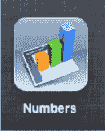

## 首次使用 Numbers

就像 `Pages` 一样，`Numbers` 也附带一个“开始使用”文件，以帮助您了解该程序的一些各种功能。在您开始创建自己的电子表格之前，通读本指南是一个非常好的主意。

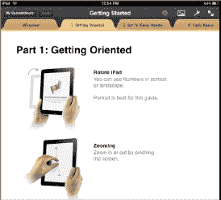

#### 选择模板

与 `Pages` 中一样，`Numbers` 的`新建文稿`按钮为您提供了创建新电子表格或使用重复电子表格的选项。

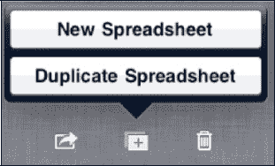

**注意**：要使用`复制表格`，您需要将要复制的电子表格放在主窗口中。

请按照以下步骤在 `Numbers` 中创建新文稿：

1. 触摸`新建文稿`按钮，系统会要求您选择一个模板。
2. 选择`空白`从头开始，或选择提供的模板之一开始使用。

在以下示例中，我们选择了`预算`模板进行操作。

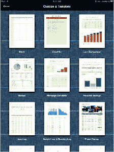

## 使用 Numbers 中的工具栏

在右上角，与 `Pages` 中一样，您会找到 `Numbers` 工具栏。这些图标与 `Pages` 中的图标相同，但功能略有不同（参见图 19–6）。

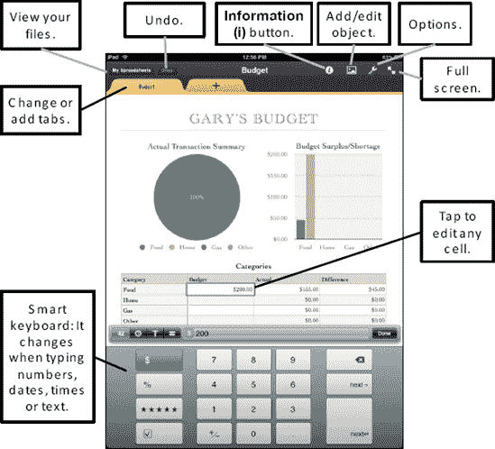

**图 19–6.** *`Numbers` 中的页面布局*

好的，这是根据您的要求，将给定的英文文本翻译成中文的 Markdown 文档。

### 信息按钮

在 `Numbers` 中，`信息` 按钮  的图标和位置与 `Pages` 中的完全相同。要使用 `信息` 按钮，您需要先选中文本、图表、图形或对象。如果选中了图表，则会显示图表选项。如果选中了表格，则会显示表格选项。

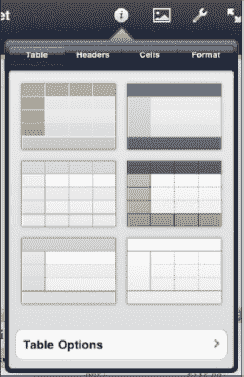

在此示例中，我们点选了一个图表，然后点击了 `信息` 按钮。接着点击了 `图表选项`，现在就可以调整从文本大小、字体到图表类型的所有选项。这些选项着实令人惊叹。

花点时间浏览 `Numbers` 的“快速入门”指南，了解所有可用的选项。

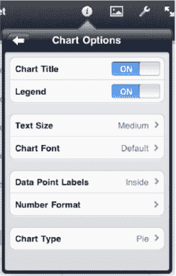

**提示：** 我们可以为这些程序中的每一个都写一整本书。花点时间点击图标和选项，亲自看看当您进行单独选择时，事物是如何变化的。尽情享受吧——这是一款非常强大且富有创造性的软件，既可用于工作也可用于娱乐！

#### 图片/对象按钮

在 `信息` 按钮旁边，您会找到 `图片/对象` 按钮。点击此按钮可将媒体、表格、图表或形状插入到文档中。在 `Numbers` 中，此按钮的功能与 `Pages` 中的完全相同。

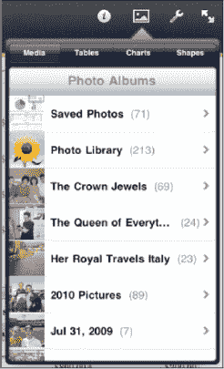

#### 工具按钮

在 `图片/对象` 按钮旁边的是 `工具` 按钮。点击它可以访问 `查找`、`打印`、`设置` 和 `前往帮助` 工具。

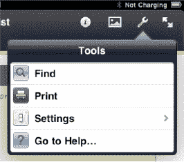

使用 `查找` 按钮可以在 `Numbers` 文档中搜索任何单词或短语——就像 `Pages` 一样。

找到单词后，文本将被高亮显示。

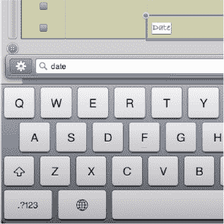

使用 `前往帮助` 可跳转到 Apple 网站以获取 `Numbers` 的支持。

#### 编辑单元格、图表和图形

`Numbers` 是一个非常强大的电子表格程序。就像您计算机上的传统电子表格程序一样，它可以用来编辑每个单元格、输入公式以及自定义图表和图形。

##### 使用图表和图形

第一次使用 `Numbers` 时，我们建议您打开一个模板。在此示例中，我们使用了 `预算` 模板。请注意这个基于四个条件的饼图：

1.  双击图表以选中它，用于创建图表的单元格将被高亮显示。
2.  双击某个单元格，公式计算器会弹出。

`Numbers` 会感知您尝试输入的是哪种类型的字段。在 `预算` 模板中，`Numbers` 知道我们需要输入金额。我们可以直接输入一个新金额，然后按下 `完成` 按钮；之前显示的图表中的更改会实时反映出来。

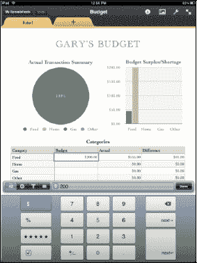

#### 使用表格

如果您花过一些时间处理电子表格，就会知道表格是构建电子表格的中流砥柱。

轻点电子表格中的任意表格以将其选中。

您可以按住列柄并左右拖动来向表格添加列（参见图 19–7）。

类似地，您可以按住行柄并上下拖动来添加或删除行。

要整体移动表格，只需按住顶部栏并将表格重新定位到您想要的位置。

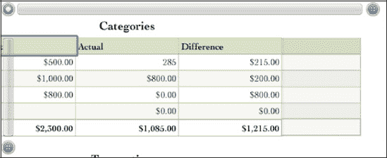

**图 19–7.** *在表格中添加和删除行列*

**提示：** 使用 `Numbers` 时很容易出错。如果某些内容看起来不对，只需点击 `撤销` 按钮即可撤消上次的编辑或添加。多次点击 `撤销` 以继续撤消您可能不想做的操作。

`Numbers` 能做的事情还有很多——再次强调，我们鼓励您阅读“快速入门”指南以了解其他功能！

### Keynote 演示文稿

`Keynote` 是 `iWork` 三件套中的第三款。`Keynote` 可与 Mac 上的 `Keynote` 或 PC 上的 `Microsoft PowerPoint` 相媲美。与 `Pages` 和 `Numbers` 一样，`Keynote` 也是一款非常强大且功能丰富的演示文稿软件。我们无法涵盖该软件的所有方面，但我们可以帮助您开始使用 `Keynote` 创建和操作演示文稿。

#### 首次使用 Keynote

与 `Pages` 和 `Numbers` 一样，`Keynote` 附带一个“快速入门”文件，可帮助您了解该程序的各种功能。在开始创建您自己的电子表格之前，最好先翻阅一下这本指南。

**注意：** 与 `Pages` 和 `Numbers` 不同，`Keynote` 仅在 `横向` 模式下工作，因为它是演示文稿软件。

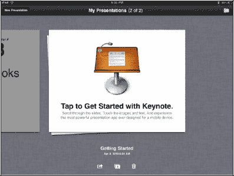

#### 选择模板

与 `Pages` 一样，`新建演示文稿` 按钮为您提供了开始新演示文稿或使用重复演示文稿的选项。

**注意：** 您需要让想要“复制”的演示文稿在主窗口中可见。

点击 `新建演示文稿` 按钮，系统会要求您选择一个模板。

您可以从几个空白演示文稿（“白色”、“黑色”或“渐变”）中选择从头开始，也可以选择提供的模板或主题来入门。

在以下示例中，我们选择了 `羊皮纸` 模板进行操作。

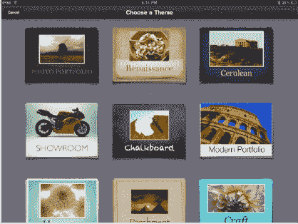

#### 在 Keynote 中使用工具栏

在右上角，与 `Pages` 和 `Numbers` 中一样，您会找到 `Keynote` 工具栏。图标与 `Pages` 和 `Numbers` 中的类似，但功能略有不同，如图 19–8 所示。

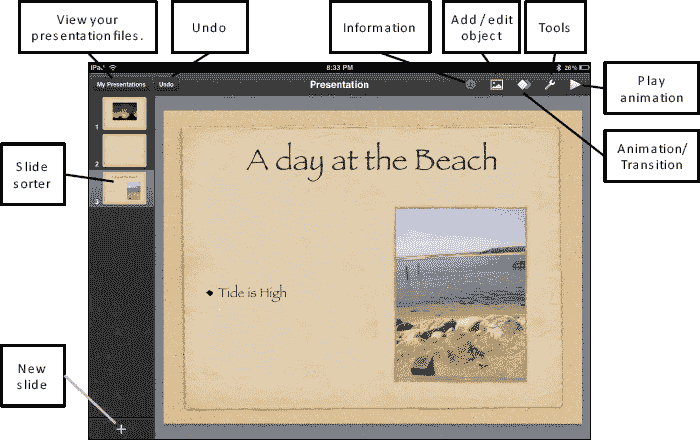

**图 19–8.** *`Keynote` 中的页面布局*

### 信息按钮

`信息` 按钮的图标和位置与 `Pages` 中的完全相同。要使用 `信息` 按钮，您需要先高亮显示一个文本框、图片、图表或对象。只需点击任意位置以激活对象，然后点击 `信息` 按钮。

点击文本框，将显示文本选项。点击图片，将显示图片选项。

在此示例中，我们点选了一个文本框，然后点击了 `信息` 按钮。

接着点击了 `文本选项`，现在就可以调整从文本大小、字体到文本样式的所有选项。

这些选项着实令人惊叹。花点时间浏览“快速入门”指南，了解所有可用的选项。

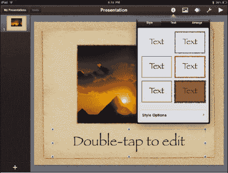

**提示：** 我们可以为这些应用程序中的每一个都写一整本书。花点时间点击图标和选项，亲自看看当您进行单独选择时，事物是如何变化的。尽情享受吧——这是一款非常强大且富有创造性的软件，既可用于工作也可用于娱乐！

#### 图片/对象按钮

在 `Keynote` 的 `信息` 按钮旁边，您会找到 `图片/对象` 按钮。点击此按钮可将媒体、表格、图表或形状插入到文档中。此按钮的功能与 `Pages` 和 `Numbers` 中的完全相同。

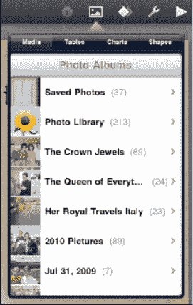

**提示：** 在所有三个程序中，只需用两根手指按住图片并旋转手指即可旋转图片——非常酷！

#### 工具按钮

在 `图片/对象` 按钮旁边的是 `工具` 按钮。点击它可以访问 `查找`、`前往帮助`、`边缘对齐`、`幻灯片编号` 和 `拼写检查` 工具。

使用 `查找` 按钮可以在文档中搜索任何单词或短语——就像 `Pages` 和 `Numbers` 一样。找到单词后，文本将以黄色高亮显示。只需点击即可编辑。

使用 `前往帮助` 可跳转到 Apple 网站以获取此应用程序的支持。

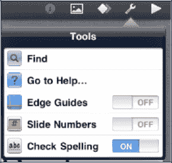

`边缘对齐`、`幻灯片编号` 和 `拼写检查` 的开关与 `Pages` 中的完全相同。

