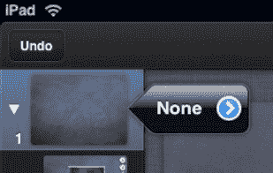
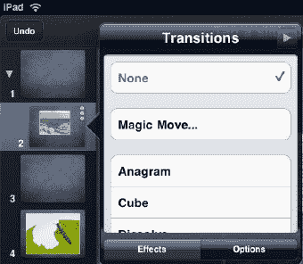

# 动画按钮

在 `Keynote` 中，你可以自定义幻灯片之间的过渡动画：

4.  轻点`动画`按钮 ，演示文稿中每张幻灯片的旁边就会出现一个`动画`标签。

**注意：** 你还可以添加`神奇移动`，它会复制幻灯片，然后让你更改其外观并让这些更改动起来。

5.  轻点该标签以查看`过渡`菜单。
6.  选择一个效果，然后轻点底部的`选项`按钮，调整过渡的时长，以及过渡是在轻点屏幕时发生还是在上一个过渡之后发生。
7.  完成过渡设置后，轻点右上角的`完成`。

