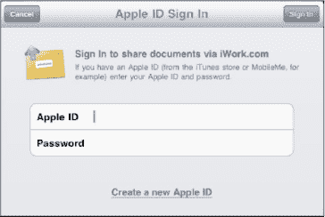
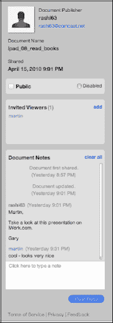

# 通过 iWork 共享

当你轻点`通过 iWork.com 共享`时，会弹出一个窗口，要求你输入 Apple ID 或 MobileMe ID 及密码。输入正确的信息后，你的文件将存储到网上，以便从任何电脑轻松取用。这是一种共享和协作处理工作的绝佳方式。

当你首次尝试使用 `iWork.com` 服务时，系统会要求你发送一封验证电子邮件。

查看验证电子邮件并按照指示开始在线共享你的作品。

登录 [`www.iwork.com`](http://www.iwork.com)，用你的 Apple ID 和密码登录，你的`共享文稿`就会显示出来。

**提示：** 这是一种协作处理工作的好方法，也可以将 iPad 上可能过大而无法通过电子邮件发送的内容发送给别人查看和打印。

