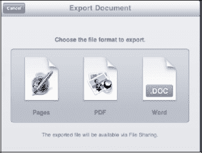

# 导出文件

按照以下步骤导出 `iWork` 文件：

1.  在任何 `iWork` 应用中，选择`共享` `导出`。
2.  选择你希望文档传输到电脑时的文件类型。
3.  下次将 iPad 连接到电脑时，传输将通过 iTunes 进行。通常的格式是该特定应用的默认格式。你也可以选择导出为 PDF 格式。

**注意：** `Pages` 可以导出为适用于 Mac 或 PC 的 `Word` 格式，但 `Keynote` 和 `Numbers` 尚不能导出为对应的微软 PC 格式（`PowerPoint` 和 `Excel`）。你始终可以从 `Pages`、`Numbers` 和 `Keynote` 中选择导出为 PDF 文件。

在下一节中，我们将介绍如何使用文件共享将文稿导入到你的 iPad。

