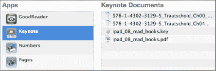
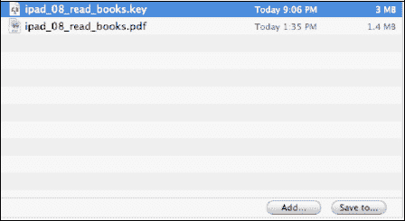
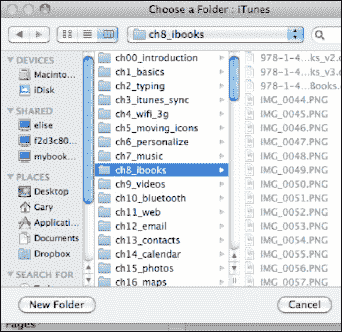

# 文件共享

文件共享是指将你在 `iWork` 中创建的文稿通过 iTunes 进行共享。文件共享在 iTunes 中通过屏幕顶部的`应用`标签进行。点击`应用`，然后向下滚动到屏幕底部的`文件共享`部分。

**提示：** 我们还在第 3 章：“与 iTunes 同步”的“文件共享”部分介绍了如何使用文件共享。

iPad 上安装的每个能够进行文件共享的程序都会显示在底部。按照以下步骤将共享的文件取回到你的 iPad：

1.  点击你从中共享文件的应用（本例中为 `Keynote`）。你在 iPad 上共享的所有文稿都会显示出来。

   

2.  勾选要保存的文稿，然后轻点右下角的`存储到`按钮。

   

3.  接着，只需导航到你想要保存该文稿的文件夹即可。
4.  现在，该文件已在你的电脑上，可以方便地查看、编辑和打印。

**提示：** `Pages`、`Keynote` 和 `Numbers` 的不错替代品是 `Documents to Go` 和 `QuickOffice`。这两款替代品都整合在单个应用中，而不是作为三个独立的应用提供。

