# 第 20 章

## 在 iPad 上使用 iTunes

在本章中，你将学习如何使用 iPad 上的 `iTunes` 应用来查找、购买和下载媒体。通过 `iTunes` 应用，你将能够下载音乐、电影、电视节目、播客和有声读物。你还可以通过 `iTunes U` 服务下载来自顶尖大学的免费教育内容。你还将学习如何兑换 iTunes 礼品卡。

我们有些人还记得为了购买新单曲或专辑而去唱片店的日子。翻阅着那些黑胶唱片（或者后来的磁带和 CD），看着我们想要的所有音乐，那种感觉令人兴奋。

随着 iPad 的出现，那些日子已经一去不复返了。所有的音乐、电影、电视节目等等，都可以直接从 iPad 上获取。

iTunes 是一个音乐、视频、电视、播客等内容的商店——几乎你可以在 iPad 上消费的所有媒体类型，都可以直接从 iTunes Store 购买或租借（而且通常可以免费获取）。

iTunes 最新推出了一种名为 Ping 的新型音乐社交网络功能。你可以使用这项服务关注艺人，查看你的朋友在听什么，等等。

### iPad 版 iTunes 入门

在本书的前面部分，我们向您展示了如何将电脑 iTunes 中的音乐传输到 iPad 上（请参阅第 3 章：“将 iPad 与 iTunes 同步”）。您还将在第 26 章：“新媒体：阅读报纸、杂志等”中了解有关在电脑上使用 iTunes 的更多信息。iTunes 的一大优点是，您可以非常轻松地购买或获取音乐、视频、播客和有声读物，然后在几分钟内即可在 iPad 上使用它们。

iPad 允许您直接在设备上访问 iTunes 的移动版本。当您购买或索取免费内容后，它们将下载到您 iPad 上的 `iPod` 应用或 `Videos` 应用中。在下一次执行同步时，它们还会自动传输到您电脑上的 iTunes 资料库中，因此您也可以在电脑上欣赏相同的内容。

### 需要网络连接

您需要有效的互联网连接（Wi-Fi 或 3G/蜂窝网络）才能访问 iTunes Store。请查阅第 4 章：“其他同步方法”以了解更多关于网络连接的信息。

#### 启动 iTunes

当您首次拿到 iPad 时，`iTunes` 是第一个 `Home` 主屏幕页面上的图标之一。触摸 `iTunes` 图标，您将进入移动版 iTunes Store。

**注意：** `iTunes` 应用会频繁更新。由于 `iTunes` 应用本质上是一个网站，因此在本书撰写完成与您在 iPad 上查看它之间，它可能发生一些变化。某些屏幕图像或按钮看起来可能与本书中展示的略有不同。

#### 浏览 iTunes

`iTunes` 应用使用的图标与 iPad 上的其他程序类似，因此在该应用中导航非常容易。顶部有三个按钮，底部有七个图标（*软键*）可帮助您导航应用。请查看图 20–1 以了解这些软键和功能。滚动操作与其他任何程序相同；上下移动手指即可查看可用的选项。

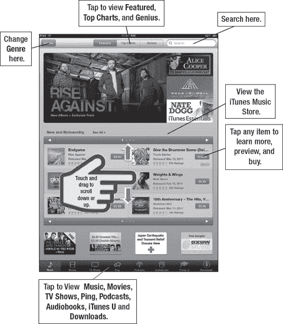

**图 20–1.** *iTunes 布局*

### 使用“精选”、“排行榜”和“天才”寻找音乐

在 iTunes 音乐商店屏幕的顶部有三个按钮：`Featured`、`Top Charts` 和 `Genius`。默认情况下，启动 `iTunes` 应用时会显示 `Featured` 精选内容。

#### 排行榜——热门内容

如果您想查看某个特定类别中的热门内容，可以浏览 `Top Charts` 类别。点击顶部的 `Top Charts`，然后点击一个类别或流派，查看该类别中的热门内容。

**警告：** 这些歌曲或视频销量很好，但这并不意味着它们一定会吸引您。在付费之前，务必先预览一下内容并查看用户评价。

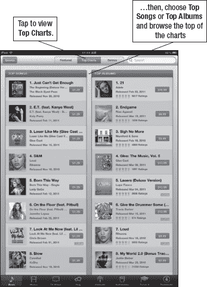

点击左上角的 `Genre` 按钮以选择特定流派。例如，如果您点击 `Singer Songwriter`（歌手兼词曲作者），您将只会看到该类别中的前十首歌曲或前十张专辑。

初始视图会在左侧显示 `Top Songs`（热门歌曲），右侧显示 `Top Albums`（热门专辑）。

您可以像在 iPad 上的任何其他程序中一样，直接滚动浏览列表。

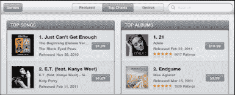

#### 流派——音乐类型

点击 `Genres` 按钮，根据流派浏览音乐。如果您有喜欢的音乐类型并想只浏览该类别，这一功能尤其有用。

这里有大量可供浏览的流派；同样，只需像在 iPad 其他程序中那样向下滚动列表即可。

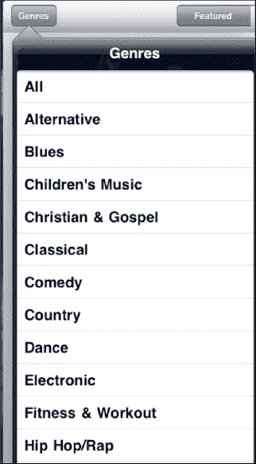

您可以随意浏览音乐，直到找到想要预览或购买的内容。

#### 浏览视频（影片）

点击底部的 `Movies` 或 `TV Shows` 按钮，浏览所有与视频相关的内容（请参阅图 20–2）。

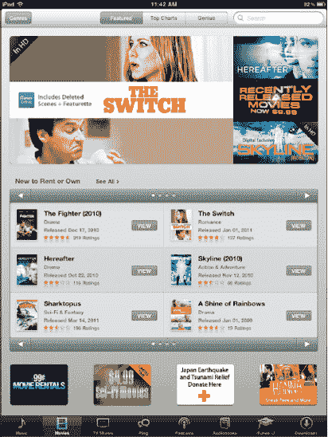

**图 20–2.** *在 iPad 上的 iTunes 中浏览 `Movies` 类别*

您还可以用手指一直滚动到页面底部，查看那里的链接，特别是以下链接：

*   `New to Rent or Own`（新片租赁或购买）
*   `Highlights by Genre`（按流派精选）
*   `All HD Movies`（所有高清影片）

点击任何一部影片或视频以查看更多详情或预览该内容。您可以选择租赁或购买某些影片和电视节目。

**租赁：** 某些影片可以提供在规定天数内的租赁服务。

**注意：** 美国的租赁期限是 24 小时，而加拿大的租赁期限是 48 小时。其他国家可能略有不同；许多国家根本不提供租赁服务。

**购买：** 此选项允许您永久购买并拥有该影片或电视节目。

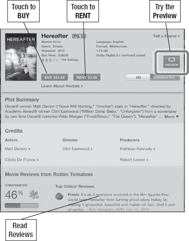

#### 寻找电视节目

浏览完影片后，点击底部的 `TV Shows` 按钮，查看您喜欢的节目有哪些可看（请参阅图 20–3）。

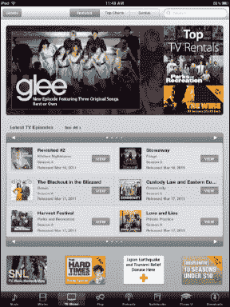

当您点击一个电视剧集时，您将看到可用的单集。点击任意一集可以观看 30 秒的预告片。更多关于观看视频的信息，请参阅第 10 章：“观看视频、电视节目等”。预览结束后，点击 `Done` 按钮。

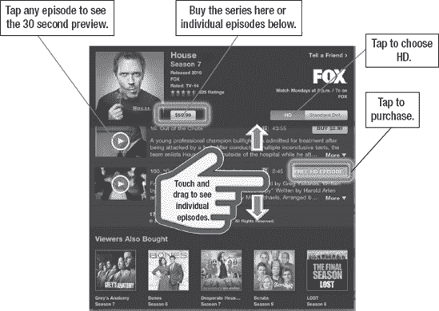

**图 20–3.** *购买和浏览电视剧集或季度*

当您准备好购买时，您可以选择购买单集或整个电视剧集。许多（但并非所有）电视剧允许您单独购买单集。

例如，也许您想重温一下 *House（豪斯医生）* 并观看您错过的那一集试播集。在 iPad 上可以轻松快速地完成这一点。

**注意：** 还有一个 `Free TV Episode`（免费电视剧集）类别，您可以在其中获取样片和附加内容。

#### iTunes 中的有声读物

有声读物是无需阅读即可享受书籍的绝佳方式。有些朗读者非常有趣，几乎就像看电影一样。例如，《哈利·波特》系列的朗读者能够出色地演绎几十种不同的声音。我们建议您在 iPad 上尝试一下有声读物；当您在飞机上想远离其他乘客，但又不想开灯时，有声读物尤其棒。

**提示：** 如果您是一位重度有声读物听众，订阅 `Audible.com` 可以以更便宜的价格获得相同的内容。

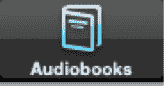

如果您是有声读物爱好者，请务必查看 iTunes 中的有声读物。

您可以使用顶部的三个按钮来浏览 iTunes 中的有声读物：

*   `Featured`（精选）
*   `Top Charts`（排行榜）
*   `Categories`（分类）

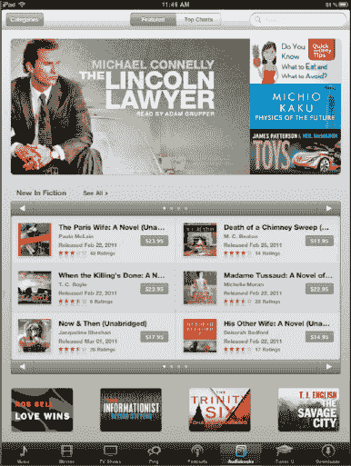

### iTunes U——优质教育内容

如果您喜欢教育内容，请查看 `iTunes U`。您可以浏览您的大学、学院或学校是否拥有自己的专属版块。

例如，我们查找了哈佛大学（请参阅图 20–4）。仅浏览了几分钟，我们就发现了一个名为 *Harvard Thinks Big 2* 的系列校园范围内的讨论，内容涉及哈佛最著名的教师。

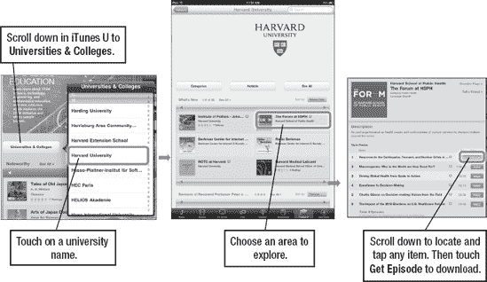

**图 20–4.** *您可以搜索特定大学，然后按该大学浏览 iTunes U。*

如果您所在的位置无线信号良好，您可以点击音频或视频内容的标题，然后以流媒体形式收听或观看。但是，如果信号中断，您将丢失视频的播放位置。如果可以的话，实际下载文件以便稍后观看有很多好处，其中最重要的就是您能对视频观看体验拥有更多控制权。

### 下载以供离线查看

如果你知道将要离开无线网络覆盖范围一段时间，例如在飞机上或地铁里，你可能会希望下载内容以便稍后离线查看或收听。点击 `Free` 按钮，它会变为 `Download` 按钮，然后再点击一次。接着，你可以通过点击屏幕右下角的 `Downloads` 按钮来监控下载进度（一些较大的视频可能需要十分钟或更长时间才能完成）。下载完成后，该内容将出现在你的 `iPad` 图标中的相应区域。

**注意：** 任何大于 20MB 的文件都无法通过 3G 网络下载；较大文件必须使用 Wi-Fi。

### 在 iTunes 中搜索

有时你很清楚自己想要什么，但不确定它在哪里，或者你不想浏览或翻阅所有菜单。`Search` 工具正是为你准备的。

在 `iTunes` 应用的右上角，与几乎所有其他 iPad 应用一样，都有一个 `Search` 窗口。

触摸 `Search`，`Search` 窗口和设备键盘会弹出。一旦你开始输入，iPad 就会尝试将你的输入与可能的匹配项进行匹配。

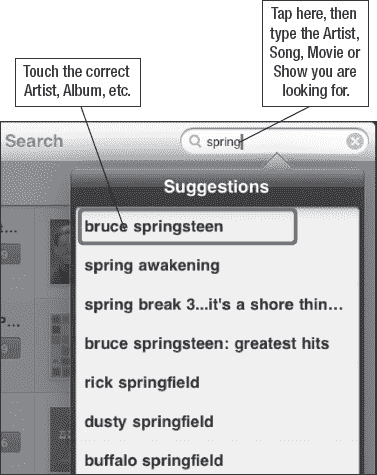

输入你正在搜索的艺术家、歌曲名称、视频名称、播客名称或专辑，iPad 会显示详细的匹配结果。你可以根据需要提供概括或具体的信息。如果你只是想浏览某个艺术家的所有特定歌曲，请输入艺术家的名字。如果你想要某首特定的歌曲或专辑，请输入歌曲或专辑的全名。

当你找到歌曲或专辑名称时，只需触摸它，你就会进入购买页面。

### 购买或租赁音乐、视频、播客等

一旦你找到歌曲、视频、电视节目或专辑，你可以触摸 `Buy` 或（如果出现）`Rent` 按钮。这将使你的媒体开始下载。（如果内容是免费的，你会看到一个 `Free` 按钮，点击后变为 `Download` 按钮。）

除非你完全确定想要购买该内容，否则我们建议你先预览或收听试听片段，并查看客户评论。

#### 预览音乐

触摸歌曲标题或其左侧的音轨编号；专辑封面会翻转并启动 `Preview` 窗口。

你将听到该歌曲 30 秒的代表性片段。

触摸 `Stop` 按钮，音轨编号将再次显示。

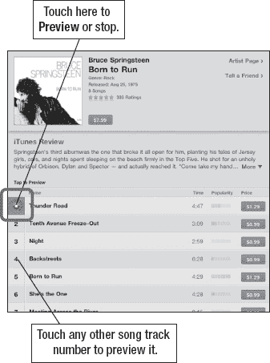

#### 查看客户评论

iTunes 中的许多内容都提供客户评论。评论范围从低的一星到高的五星。

**警告：** 你需要注意，虽然很多评论是干净的，但有些可能包含露骨的语言。iTunes 商店可能不会立即发现这些内容。

阅读评论可以让你相当清楚地了解自己是否愿意购买该商品。

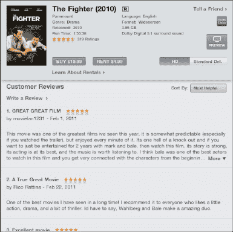

#### 预览视频、电视节目或音乐视频

iTunes 上的几乎所有内容都提供预览。有时你会看到一个 `Preview` 按钮，就像音乐视频和电影那样。电视节目略有不同；你需要点击剧集标题来查看 30 秒的预览。

大多数电影和电视节目也会提供一个 `HD` 或 `Standard Def` 按钮。请记住，高清电影和剧集通常稍微贵一些。

我们强烈建议在 iTunes 上购买内容之前，先查看评论并尝试预览。

典型的电影预览或预告片会超过 30 秒——有些会长达 2 分 30 秒或更长。

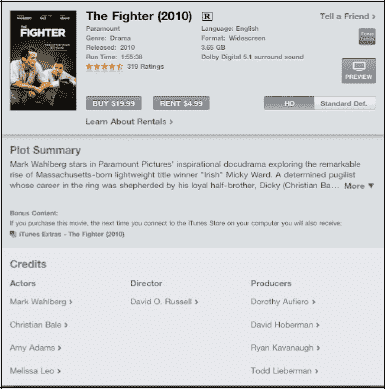

#### 购买歌曲、视频或其他项目

一旦你确定要购买一首歌曲、视频或其他项目，请按照以下步骤操作：

1.  触摸歌曲的 `Price` 按钮或 `Buy` 按钮。
2.  该按钮会发生变化，变成一个绿色的 `Buy Now`、`Buy Song`、`Buy Single` 或 `Buy Album` 按钮。
3.  点击 `Buy` 按钮。

    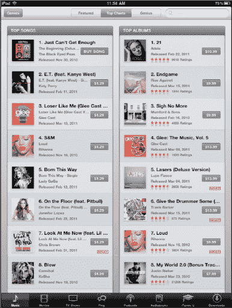

4.  你会看到一个动画图标跳入购物车。输入你的 iTunes 密码并触摸 `OK` 以完成购买。

    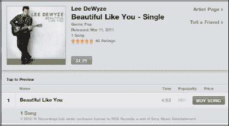

你可以通过触摸右下角的 `Downloads` 按钮来检查下载进度。

然后，这首歌将成为你音乐库的一部分，下次你将 iPad 连接到电脑上的 iTunes 时，它将被同步。

下载完成后，你将看到新的歌曲、有声读物、播客或 iTunes U 播客出现在你的 `iPod` 应用中的相应类别下。

**注意：** 购买的视频和 iTunes U 视频会进入 `Videos` 应用，而不是 iPad 上的 `iPod` 应用。

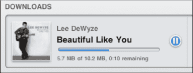

#### iTunes 中的播客

播客通常是一系列音频片段；这些片段可能会经常更新（例如来自国家公共广播电台的整点新闻广播），或者根本不更新（例如某个特定主题的一次性讲座录音）。

你可以使用顶部的三个按钮浏览 iTunes 中的播客：

*   `Featured`（精选）
*   `Top Charts`（排行榜）
*   `Categories`（分类）

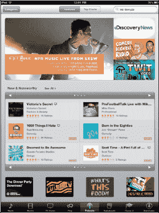

#### 下载播客

播客有 `Video` 和 `Audio` 两种类型。当你找到播客时，只需触摸播客的标题（参见图 20-5）。幸运的是，大多数播客都是免费的。如果是免费的，你会看到一个 `Free` 按钮，而不是通常的 `Buy` 按钮。

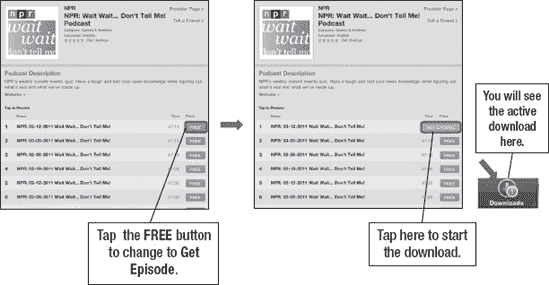

**图 20-5.** *下载播客*

当你触摸按钮时，它会变成一个显示 `Download` 的绿色按钮。触摸 `Download`，一个动画图标会跳到底部软键栏中的 `Downloads` 图标。显示为红色的小数字反映了正在下载的文件数量。

#### 下载图标——停止和删除下载

当你下载项目时，它们会出现在你的 `Downloads` 界面中。这种行为与你电脑上 iTunes 的行为类似。

你可以触摸底行的 `Downloads` 图标来查看所有下载的进度。

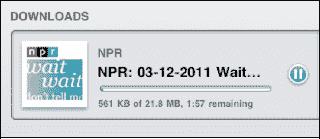

#### 下载内容的存放位置

你所有的下载内容都会显示在你的 `iPod` 应用或 `Videos` 应用中，并按类别整理。换句话说，如果你下载了一个播客，你需要进入你的 `iPod` 应用，触摸侧边栏上的 `Podcasts` 图标来查看下载好的播客。

**注意：** 如果你在 iPad 上没有完成下载，并且在下载队列中找不到它，你可以尝试进入桌面版 `iTunes` 应用，点击 `Check for Available Downloads`。

有时，你可能决定不想要你选择的所有下载内容。如果你想停止下载并删除它，请用手指在下载项上滑动以调出 `Delete` 按钮，然后点击 `Delete`（参见图 20-6）。

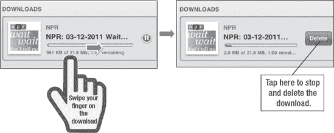

**图 20-6.** *在下载文件时将其删除*

### 兑换 iTunes 礼品卡

iPad 上 iTunes 的酷功能之一是，就像你电脑上的 iTunes 一样，你可以兑换礼品卡，并在你的 iTunes 账户中获得用于购买的信用额度。

在 `iTunes` 屏幕的底部，你应该会看到 `Redeem` 按钮（参见图 20-7）。

点击 `Redeem` 按钮，开始输入你的礼品卡号以获取 iTunes 商店信用额度的流程。

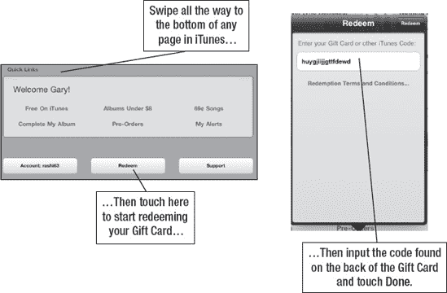

**图 20-7.** *兑换 iTunes 礼品卡*

然后，系统会提示你在框中输入你的 iTunes 礼品卡信息或礼品券信息。完成此操作后，你将拥有在 iTunes 商店下载的信用额度——就是这么简单！

**注意：** 如果你有多个 iTunes 账户，你也可以直接在 `iTunes` 应用中登录或登出。

