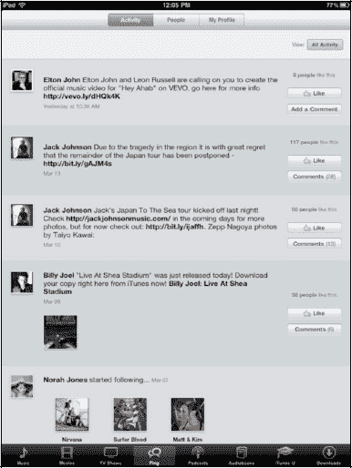
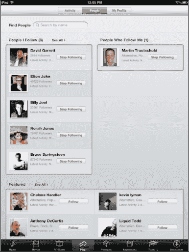
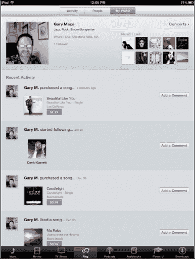

# Ping：苹果的音乐社交网络应用

最近，苹果在`iTunes 10`中推出了`Ping`服务。你可以在第 30 章“你的 iTunes 用户指南”中了解更多关于桌面版的信息。`Ping`也内置于 iPad 的`iTunes`应用中。

`Ping`让你有机会关注你喜欢的音乐艺术家，并查看他们可能选择发布的视频、图片或内容。`Ping`还允许你关注好友，查看他们在听什么，并对他们的帖子发表评论。

**注意**：如果你的`Ping`账户是公开的，关注你的每个人都会看到你购买的内容。如果你同时设置了 Twitter，且购买了大量音乐，它可能会刷屏你的时间线。

## 在 iPad 上使用 Ping

`Ping`位于`iTunes`应用底部的虚拟按键中。如果你已从桌面版的`iTunes`应用（更多信息请参见第 30 章）设置了`Ping`，那么你会发现它已经在你的 iPad（或你拥有的任何其他 iOS 设备）上设置好了。

**注**：如果在桌面版`iTunes`上启用`Ping`后，它没有出现在你的 iPad 上，你可能需要先同步一次 iPad，它才会出现在`iTunes`应用中。

你会注意到顶部有三个虚拟按键：`动态`、`人`和`我的资料`。`Ping`启动时，会显示`动态`界面，其中显示了你正在关注的艺术家和好友，以及他们的近期活动。

点击顶部的`人`虚拟按键，将显示你正在关注的人，以及关注你的人。

点击`我的资料`虚拟按键，你也可以查看你关注了谁，并添加评论，让关注你的人看到。

点击底部的`我的信息`按钮，你可以看到你的照片和你喜欢的音乐——这些是在`iTunes 10`中设置`Ping`账户时选择的。

`Ping`目前还处于起步阶段，但它有望在不久的将来发展成为一个功能更全面、专攻音乐的社交网站。

