# 令人惊叹的 App Store

你已经了解到从 iTunes 直接下载音乐、视频和播客到 iPad 是多么容易。你还学会了如何从 iBooks 商店下载 iBooks。

从苹果令人惊叹的 App Store 下载新应用也同样简单。应用几乎涵盖了你所能想到的任何功能——游戏、生产力工具、社交网络——一切你能想象的。正如广告所说：“总有对应的应用。”

在本章中，你将学习如何浏览 App Store，如何搜索应用以及如何下载它们。你还会学习如何在应用下载到 iPad 后进行维护和更新。

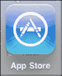

**注：** 如果你在旅行途中购买了新的 iPad Wi-Fi 版或解锁版 iPad 3G，并将其带回到尚未销售该设备的国家，你的 iTunes ID 很可能无法用于购买应用。解决方法是，在桌面版 iTunes 上购买 iPad 应用（此方法可行），然后同步过去。

### 了解更多关于应用和 App Store 的信息

在极短的时间内，App Store 的容量已呈爆炸式增长。应用几乎涵盖了你所能想象的一切。应用价格各异；在很多情况下，它们甚至是免费的。

### 一些很酷的应用

由于商店中拥有超过 35 万个应用，以及 7 万个 iPad 专用应用，我们无法为你列出一个前十名的应用清单。相反，我们列出了一些我们喜欢或听说过的非常酷的应用。表 20–1 列出了许多有趣、酷炫、实用或单纯娱乐性的应用。此表也显示了应用是否免费；但由于 App Store 中的价格频繁变动，因此未包含其他定价信息。

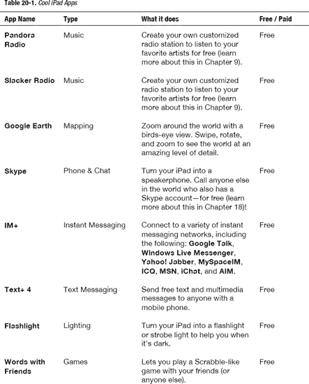

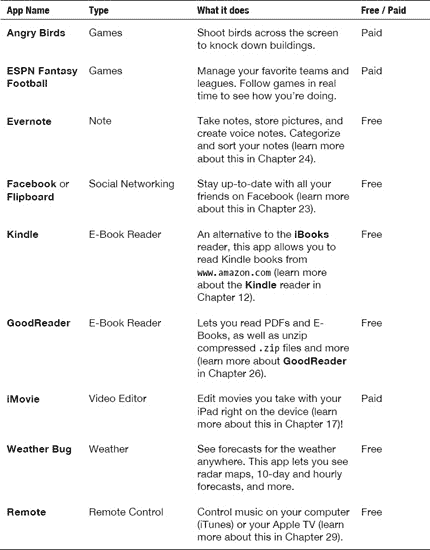

#### 在哪里找到应用新闻和评测

你可以在 App Store 本身找到评测，我们建议你查看 App Store 的评测。然而，有时你可能希望从一些专家那里获取更多信息。博客是查找新闻和评测的好地方。

以下是与苹果 iPad/iPhone/iPod touch 相关的博客列表，其中包含应用评测：

*   The iPhone Blog：[`www.tipb.co`](http://www.tipb.co)
*   Touch Reviews：[`www.touchreviews.net`](http://www.touchreviews.net)
*   Touch My Apps：[`www.touchmyapps.com`](http://www.touchmyapps.com)
*   The Unofficial Apple Weblog：[www.tuaw.com](http://www.tuaw.com)
*   Cult of Mac：[`www.cultofmac.com`](http://www.cultofmac.com)
*   App Smile：[`www.appsmile.com`](http://www.appsmile.com)

## App Store 基础知识

只需在网站上稍作浏览，你就会发现 App Store 的导航非常直观。然而，有一些基础知识需要熟悉，这会使 App Store 的使用体验更加愉快。

### 需要网络连接

设置好你的 App Store (iTunes)账户后，你仍然需要具备正确的网络连接（Wi-Fi 或 3G/蜂窝网络）才能访问 App Store 并下载应用。查看第 4 章：“Wi-Fi 和 3G 连接”以了解如何判断是否已连接。

### 启动 App Store

`App Store`图标应该位于`主屏幕`的第一页图标上。点击该图标启动`App Store`。

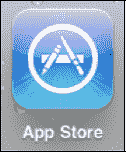

### App Store 主页

与 iTunes 类似，`App Store`应用的顶部有按钮，底部有虚拟按键，帮助你指导购买（参见图 21–1）。

顶部有`新`应用和`热门`的按钮，以及一个`发布日期`应用列表。底部是`精选`、`Genius`、`排行榜`、`类别`和`更新`的图标。

滚动操作与 iTunes 和其他程序相同——只需上下移动手指即可滚动页面。

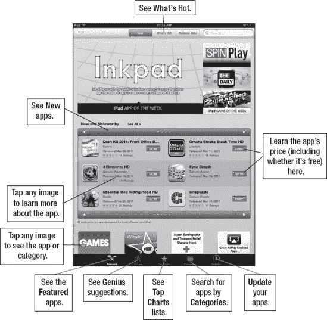

**图 21–1.** *App Store`主页`的布局*

你会注意到 App Store 的`主页`上有两个主要部分：`新品推荐`和`编辑推荐`。每个部分都有几页。点击箭头浏览后续页面，或点击`查看全部`标签。

**注：** 由于 App Store 本质上是一个网站，它会频繁更新。本书印刷后，App Store 的某些细节和细微差别可能会略有不同。

### 查看应用详情

一旦找到你感兴趣的应用，你可以探索许多选项来帮助判断某个应用是否适合你。图 21–2 展示了一些可用选项。

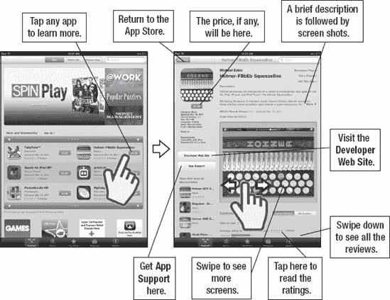

**图 21–2.** *查看应用详情*

## 查找要下载的应用

首先浏览默认视图，其中显示了`精选`应用。App Store 加载后，页面中央显示`新品推荐`应用供你浏览。点击标题栏中的箭头以浏览后续应用页面。

你还可以在顶部以“图形”视图方式看到高亮的新应用。只需点击页面顶部的图片之一，即可查看该应用的信息。

**注：** 与 iTunes 一样，在 3G 网络下，你只能下载小于 21MB 的应用。更大的应用需要 Wi-Fi 连接。

### 查看热门应用

点击顶部的`热门`按钮，商店中最热门的应用将显示在屏幕上。同样，只需滚动浏览这些“热门”应用，看看是否有吸引你的东西。

**注：** 某个应用属于`热门`类别，并不一定意味着你也会觉得它有用或有趣。在购买任何东西之前，请仔细查看应用描述和评测。

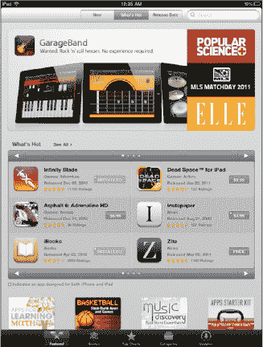

#### 使用类别

有时所有选项会让人应接不暇。如果你对自己想要的应用类型有所了解，可以点击底部图标栏中的“**类别**”按钮。

现在应用会按“**类别**”标签页排列，从“**游戏**”到“**财务**”、“**医疗**”、“**摄影**”——以及各种其他可能的类别。

**注意：** 当你阅读本书时，可能还会新增更多类别；这部分内容在 App Store 中会频繁更新。

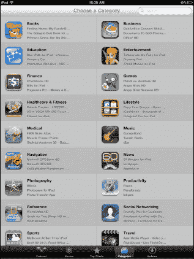

找到你要查找的类别并点击对应的标签页。例如，如果你想找一款与天气相关的应用，只需点击“**天气**”标签页。

随后你可以浏览该类别中精选的“**天气**”应用，或者点击“**排序方式**”按钮，查看按“**名称**”、“**最受欢迎**”或“**发布日期**”排序的所有天气应用。

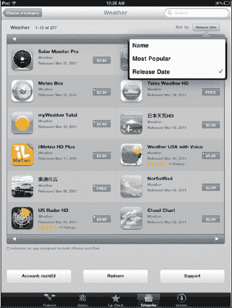

#### 查看排行榜

点击底部图标栏中的“**排行榜**”图标，“**App Store**”程序会再次切换视图。这次它会显示前十名付费应用和前十名免费应用。左侧一栏显示“**热门付费**”应用，右侧一栏显示“**热门免费**”应用。

向下滚动到“**排行榜**”页面底部，你会看到第二个类别：“**收入最高**”。对某些人来说，了解一款应用的收入情况很重要。要查看任一类别热门应用的更完整列表，请点击“**显示更多**”标签页。

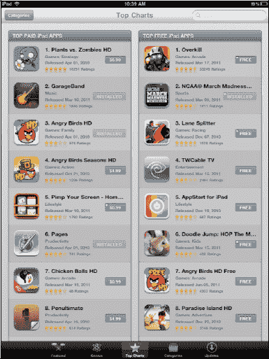

## 第 22 章

## 游戏与娱乐

你的 iPad 在许多方面都表现出色。它是一台多媒体工作利器，也能记录你的繁忙生活。iPad 真正擅长的两个领域是作为游戏设备，以及承载充分利用其大尺寸高分辨率触摸屏的 iPad 专属应用。你甚至能在这里找到你可能以为只有在专用游戏主机上才会出现的流行游戏版本。

iPad 为便携游戏带来了诸多优势：高清屏幕呈现逼真画面，高品质音频提供出色音效，而加速计则让你能与游戏真实互动。例如，在赛车游戏中，你可以通过手持 iPad 时转动设备来“操控”你的汽车。

**注意：** 我们写过十几本关于黑莓设备和其他智能手机的书，家里也摆着许多黑莓、WebOS、iOS 和安卓设备。智能手机并不会被孩子们拿进房间；相反，正是 iPad —— 我们的孩子（以及我们的配偶）认为它足够有趣，会争相去拿。我们经常发现 iPad 从充电器上不翼而飞，然后不得不大喊：“我的 iPad 呢？我需要用它完成这本书！”

### iPad 作为游戏设备

得益于内置的加速计——本质上是一种检测运动（加速度）的设备，并包含检测倾斜度的内置陀螺仪——iPad 能够实现大多数便携游戏系统无法做到的事情。

有成千上万款游戏可供选择，你几乎可以在 iPad 上玩任何你想玩的游戏类型。

**注意：** 有些游戏确实需要你拥有活跃的网络连接（Wi-Fi 或 3G）才能进行多人游戏。

| 有了 iPad，你可以玩驾驶游戏，并用 iPad 本身来操控方向——只需转动设备即可。你还可以触摸 iPad 来刹车，或向前倾斜设备来加速。 | 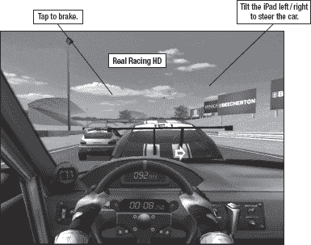 |
| 这款游戏逼真到可能会让人晕车！ | |
| 或者，你可以尝试一款第一人称战斗游戏。借助 iPad 的新图形引擎，像 Chair 公司的《`无尽之剑`》这样的游戏画面惊艳，运行也非常流畅。 | |
| 《`无尽之剑`》中的图形、战斗场景和 3D 环境与 iPad 上其他任何可用内容都截然不同，其质量足以与更昂贵的游戏主机游戏相媲美。 | 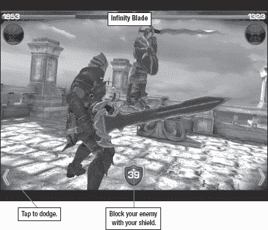 |

#### 如何获取游戏和娱乐应用

与所有 iPad 应用一样，游戏可在 App Store 中找到（参见图 22–1）。你可以通过电脑上的 iTunes 或使用设备上的“**App Store**”程序来获取它们。

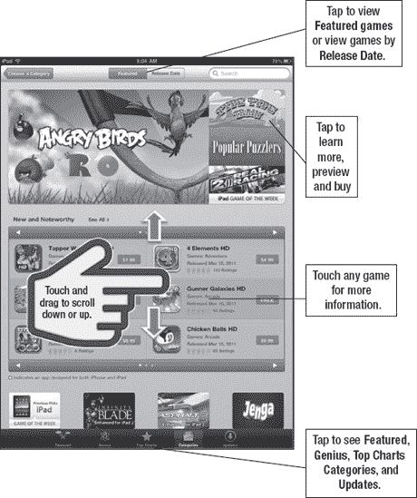

**图 22–1.** *App Store “`游戏`” 部分的布局*

| 要获取游戏，请像上一章那样启动“**App Store**”程序，然后使用“**类别**”图标进入“**游戏**”标签页。你还会在 App Store 的“**精选**”部分以及“**新鲜推荐**”部分找到许多游戏。图 22–2 展示了一款 iPad 游戏的应用购买页面。 | 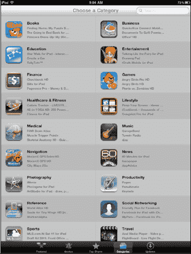 |

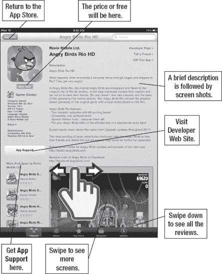

**图 22–2.** *应用购买页面的布局*

#### 购买前阅读评论

| 许多游戏都有用户评论，值得一读。有时，你可以在购买前对游戏有个不错的了解。如果你发现一款看起来很有趣的游戏，不妨在电脑上简单地用`Google`搜索一下，看看是否有主流媒体做过完整评测。**注意：** 请注意，一些评论可能包含不雅用语。 | 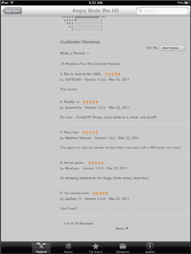 |

#### 寻找免费试用版或精简版

| 游戏开发者越来越频繁地提供游戏的免费试用版，让用户在购买前看看是否喜欢。你会发现 App Store 中许多游戏同时提供精简版/免费版和完整版。 | 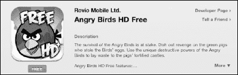 |
| 有些游戏是“免费”的，通过应用内包含广告来维持运营。其他一些应用则免费开始，但需要应用内购买才能继续游玩或解锁更多功能。 | |

#### 游戏时注意安全

考虑到 iPad 的尺寸，一些游戏已从 iPhone/iPod touch 版本进行了修改。你不需要像 iPhone 版那样用 iPad 来“甩”钓鱼游戏的鱼线；但是，在驾驶游戏和第一人称射击游戏中，你可以稍微移动一下——所以要注意你周围的环境！例如，确保你牢牢握紧设备，以免从手中滑落——我们推荐使用一个好的硅胶保护套来帮助解决这个问题。

**注意：** 像《`愤怒的小鸟`》这样的游戏可能会让人上瘾并影响工作效率！

#### 双人游戏

| iPad 确实为双人游戏提供了可能性。在这个例子中，我们正用 iPad 作为棋盘，与对方玩国际跳棋。其他棋盘游戏，如国际象棋、拼字游戏等，也能找到类似的双人应用。 | 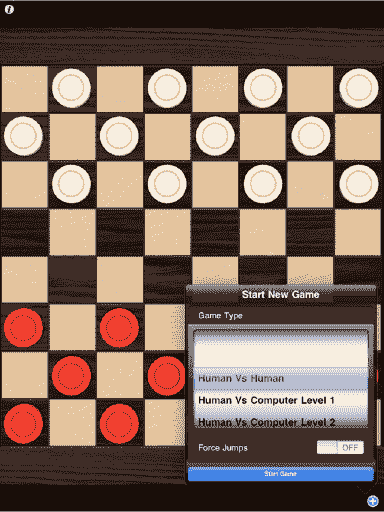 |

**提示：** 在玩双人游戏（如下棋）时，请像读书时一样，务必*锁定*屏幕方向。通过将“**方向锁定**”开关拨到“**锁定**”位置来实现（参见第 8 章）。

#### 在线与无线游戏

| 如果游戏支持，iPad 还允许在线和无线点对点游戏。许多新游戏都采用了这项技术。例如，在《`拼字游戏`》中，你可以让多名玩家各自使用自己的设备。你甚至可以将 iPad 作为棋盘，并使用最多四部独立的 iPhone 作为无线“字母架”来存放你的字母牌。只需轻轻把字母牌从架上拨出，它们就会飞到棋盘上——非常酷！你还可以在线与 Facebook 好友对战。你可以通过本地网络进行，或者作为多人形式的*传屏接力*游戏。 | 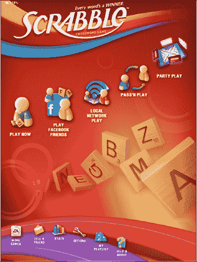 |

**注意：** 如果你只想与身边的朋友对战，请在多人游戏中选择 Wi-Fi 模式。如果你只是想和陌生人玩，可以尝试在线模式或与 Facebook 好友对战！

