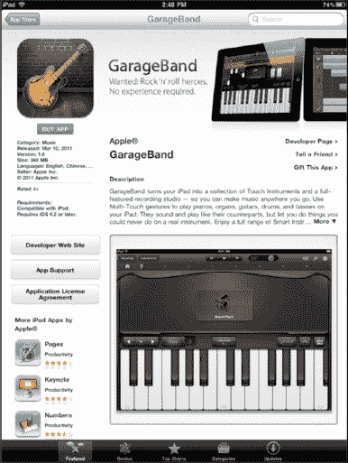
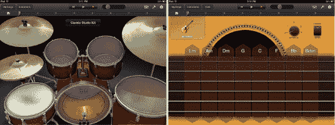
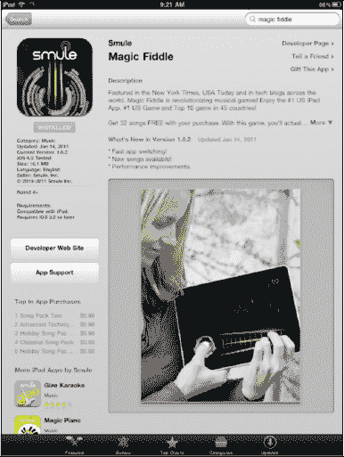
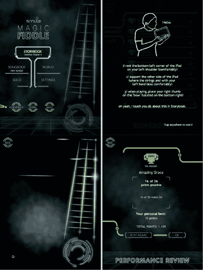
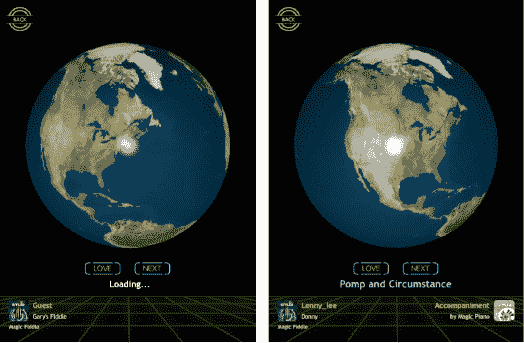

# 用 iPad 玩音乐

iPad 上有很多音乐游戏和应用。其屏幕尺寸和设备技术让你几乎可以用 iPad 演奏任何乐器。

| 多年来，Mac 用户一直能够通过电脑上的 `GarageBand` 应用学习音乐。最近，苹果推出了首个适用于 iPad 的 `GarageBand` 应用，堪称惊艳。`GarageBand` 让你可以选择演奏架子鼓、键盘、吉他或贝司 — 全部通过 iPad 的触屏操作（参见图 22–3）。 |  |

`GarageBand` 还包含一个录音机，让你可以在 iPad 上创作和录制配乐。你甚至可以插入电吉他（使用第三方适配器），并利用内置的吉他音箱来调整乐器的音色、音量和音调。

**图 22–3**. *在 `GarageBand` 上演奏架子鼓、吉他或键盘。*

| 全新一批音乐应用让你能够真正把 iPad 当作乐器来使用。其中一款令人惊叹的新应用叫做 `Magic Fiddle`。这款由 Smule 开发的应用能让你真的去拨弄小提琴的琴弦。`Magic Fiddle` 仅售 2.99 美元。下载这款应用，尽情享受吧！如果你有孩子，他们可能也会喜欢。**注意：** 此应用并非要取代你那把价值连城的斯特拉迪瓦里小提琴；不过，它确实为学习小提琴提供了一个有趣的入门方式。 |  |

## 演奏 Magic Fiddle

你可以在 `StoryBook` 模式下演奏 `Magic Fiddle`，可以是在 `Solo` 模式下作为独奏乐器，也可以使用内置的 `Songbook` 功能演奏流行乐曲（参见图 22–4）。

要更改琴弦颜色或调性，请点击 `Main` 屏幕上的 `Settings` 图标。

要在 `Solo` 模式下演奏，请像拿小提琴一样握着 iPad，将其搁在肩上弹奏。

**图 22–4.** *`Magic Fiddle` 的屏幕与控制界面*

## 世界视图

点击 `Back` 按钮并选择 `World`（参见图 22–5）。这会显示一个地球仪，上面有世界各地的人们在愉快地演奏小提琴。有时你还会看到二重奏。

如果你喜欢某个人的演奏方式，请点击 `Love` 图标。

如果你不喜欢正在听的音乐，请点击 `Next` 图标（两个向右的箭头）。

**图 22–5.** *`Magic Fiddle` 的世界视图——观看他人演奏小提琴*

