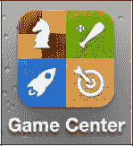
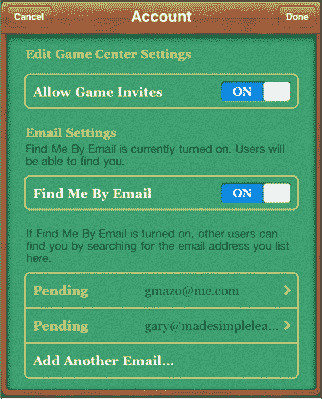
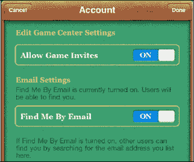
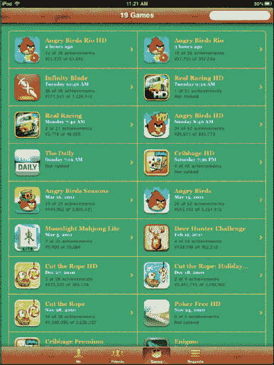
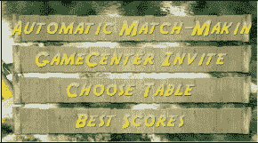

# 游戏中心

| 去年，苹果为便携游戏引入了一个新概念：`Game Center`。`Game Center` 是一个让你与朋友见面、邀请朋友玩游戏，或分享你与朋友共同玩的游戏成就的地方。 |  |

## 设置游戏中心

| 当你首次从 iPad 上启动 `Game Center` 时，系统会要求你使用 `Apple ID` 和密码或 `MobileMe ID` 和密码登录。输入你的个人信息，然后输入一个电子邮件地址（或多个电子邮件地址）以验证 `Game Center` 的使用权限。 |  |

**提示**：如果你注册并验证了多个电子邮件地址，你的朋友将更容易在 `Game Center` 上找到你，并邀请你加入他们的 `Game Center` 网络。

| 请确保 `Allow Game Invites` 和 `Find me By Email` 按钮处于**开启**状态，这样你的朋友才能邀请你一起玩。 |  |

## 使用游戏中心

一旦你设置好 `Game Center`，乐趣就开始了。启动 `Game Center`，你会看到你有多少位朋友、安装了多少款 `Game Center` 游戏，以及获得了多少成就。所有这些信息都可以在底部的 `Me` 标签页  中查看。

触摸 `Friends` 标签页 ，你会看到你有多少位 `Game Center` 好友。这个数量上限似乎是 500 位好友。

触摸 `Games` 标签页 ，你会看到你的设备上安装了多少款 `Game Center` 游戏。

**注意**：一旦你拥有了 `Game Center` 账户，你可以从任何 iOS 设备登录，查看你的游戏、好友和成就。

触摸 `Requests` 标签页 ，可以查看待处理的请求，或者触摸 **+** 号按钮，通过电子邮件地址邀请联系人成为你的 `Game Center` 好友。

## 进行多人游戏

某些 `Game Center` 游戏允许你与一位 `Game Center` 好友进行（并邀请其参加）一对一的游戏。有些游戏会为你匹配在线玩家，而其他游戏则只允许你与朋友分享成就。

| 右侧的截图显示了启用了几款游戏的 `Game Center`：有些游戏只允许用户分享成就，而另一些则允许用户与朋友对战或进行在线匹配。 |  |

在一款多人游戏中（例如 `Adrenaline Golf`），你可以从 `Game Center` 内部启动游戏，也可以从 iPad 上的游戏图标启动。

| 右侧的截图显示了用户在 `Adrenaline Golf` 中选择 `Play Multiplayer` 时的选项。这样做会弹出 `Automatic Match Making` 或 `GameCenter Invite` 选项。选择 `Automatic Match Making` 会提示 iPad 寻找对手与用户对战。 |  |

