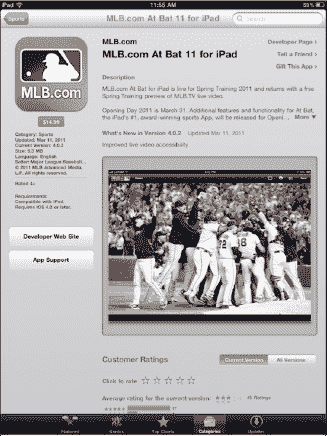
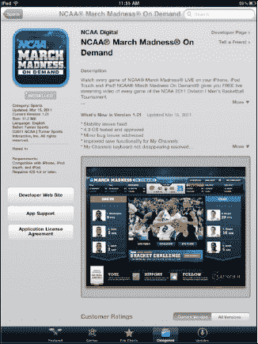
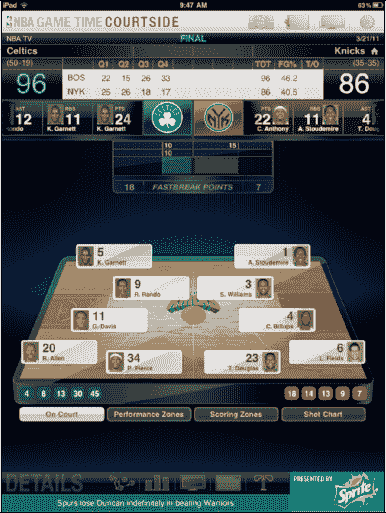

# 其他趣玩：iPad 上的体育赛事

| 有大量优秀的应用可以为用户在 iPad 上提供无尽的娱乐时光。自 2011 年春季 iPad 2 发布以来，`March Madness`、`NBA Basketball`、`MLB Spring Training` 等众多应用便应运而生。`At Bat 2011 for iPad` 是一款售价 14.99 美元的应用，对于任何棒球迷来说都物超所值。它也很好地体现了 iPad 的能力。 |  |
| `NCAA March Madness On Demand` 应用让用户能够追踪今年大学篮球锦标赛的每一场比赛。`March Madness` 应用实际上提供了实时电视信号，因此每场赛事转播都可以在 iPad 上播放。这似乎是其他应用正朝着发展的方向，不仅提供比赛统计数据与新闻，还允许用户在 iPad 上观看体育赛事直播。这非常酷！ |  |

| `NBA Game Time Courtside` 应用让我能够跟随我的凯尔特人队，走过常规赛，进入季后赛。在每场常规赛期间，我都可以在我的 iPad 上实时看到谁在场上，并跟踪得分情况！ |  |

