# 第 23 章

### 社交网络

你的 iPad 可以通过许多超越传统电子邮件和网页功能的创新方式，让你与他人保持联系。

如今，一些最受欢迎的“连接”场所是那些常被称为*社交网站*的地方——这些站点允许你创建自己的页面，并与朋友和家人联系，了解他们的生活动态。一些最流行的社交网站包括 Facebook、Twitter 和 LinkedIn。

在本章中，我们将向你展示如何访问这些不同的站点。你将学习如何更新状态、*发推文*，以及跟踪那些对你重要或你感兴趣的人。

我们还将向你推荐一些优秀的第三方应用，它们能以新颖、创新的方式让你使用某些社交网络功能。

好的，作为一名高级文档工程师和翻译员，我将严格遵循您提供的注意事项和示例格式，对给定的英文文本进行翻译。

### Facebook

Facebook 创立于 2004 年 2 月。自那时起，它一直是用户与朋友、同事和家人联系、重新建立联系以及分享信息的主要网站。如今，超过 4 亿人使用 Facebook 作为他们与最重要的人“保持联系”的主要方式。

**注意：** 你无法在 iPad 上玩 Facebook 游戏。如果你是 Facebook 游戏的忠实玩家，这可能会让你失望。不过，你可以在 Scrabble 等游戏中与 Facebook 好友对战（参见第 22 章：“游戏与娱乐”）。

在你的 iPad 上，在本书出版时，主要有三种方式访问你的 Facebook 页面：

*   使用 `Safari` 访问标准（完整）网站：[`www.facebook.com`](http://www.facebook.com)。
*   使用像 `Flipboard` 这样的第三方应用（本章后面会介绍）。
*   使用官方的 iPhone/iPad touch `Facebook` 应用。

**注意**：作者建议目前使用 `Flipboard` 或 `Friendly Facebook for iPad` 作为在 iPad 上访问 Facebook 的最佳方案。iPhone/iPad touch 应用的功能比完整网站版本更有限，但更容易导航。请记住，这个应用最初是为 iPhone/iPod touch 设计的，所以它不会填满整个屏幕。你可以随时点击 `2x` 按钮使其变大——但放大后的屏幕不会像基于桌面的 Facebook 网页那样清晰锐利。

#### 从 Safari 登录 facebook.com

| 要登录基于网页的应用，请启动 `Safari` 浏览器并访问 [`www.facebook.com`](http://www.facebook.com)。就像在电脑上一样登录。**小贴士：** 如果完整网站看起来过于复杂，可以登录 [`touch.facebook.com`](http://touch.facebook.com) 或 [`m.facebook.com`](http://m.facebook.com) 来访问移动版网站。 | 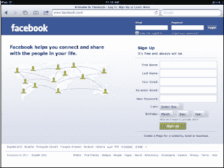 |

#### 浏览 facebook.com

facebook.com 的好处在于，如果你曾在电脑上使用过 Facebook，你就已经知道如何浏览这个网站了。它的工作方式基本相同。

点击`左侧导航栏`中的任意链接，即可进入你的`新鲜事`、`消息`、`活动`、`照片`、`好友`等页面（参见图 23–1）。

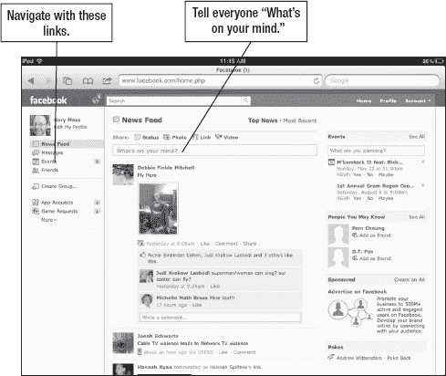

**图 23–1.** *`Safari` 浏览器中的 facebook.com 网页*

#### 状态更新/新鲜事

| 一旦你用 `Safari` 登录 Facebook 网站，你将可以选择写下“你在想什么”，并看到来自好友的`新鲜事`。 | 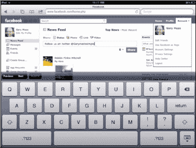 |

#### 查找 Facebook 好友

| 在基于网页的 Facebook 页面中，你可以通过点击`搜索`字段并开始输入你要找的好友姓名来查找好友。你也可以点击`首页`上的`帐户`下拉框，然后点击左侧的`所有联系人`来查看你的好友。你的好友也会列在左侧边栏的`列表`下。**注意：** 如果你使用的是 [`touch.facebook.com`](http://touch.facebook.com) 或 [`m.facebook.com`](http://m.facebook.com)，顶部会有一个`好友`标签；只需点击此标签即可查看你的好友列表。 | 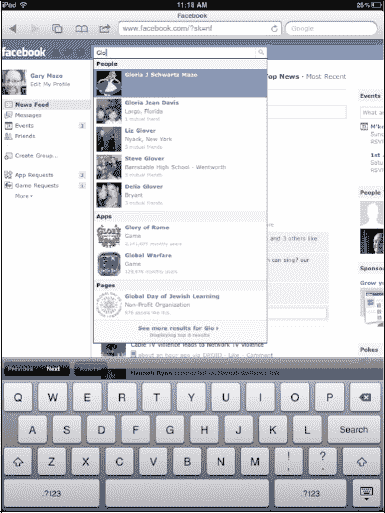 |

#### 向 facebook.com 上传照片

不幸的是，在本书出版时，向 Facebook 上传照片存在一个问题：你在台式电脑上使用的简单`上传照片`功能在 `Safari` 浏览器中无法使用。相反，系统会要求你向一个独特的、在你点击`上传照片`后出现在 Facebook 中的电子邮件地址发送一封邮件。你邮件的主题行将成为上传照片的文字描述。通过电子邮件向 Facebook 上传照片的一个好处是，你可以一次发送一堆照片，让它们在后台上传。这与 `Facebook` 应用不同，后者要求你等待每张照片上传完成后才能进行下一张。

我们不会向您展示通过电子邮件将照片上传到 Facebook 的详细步骤；相反，我们建议您安装 `Facebook` 应用并使用它来上传照片。使用这种方法要容易得多。请参阅本章后面的“使用 Facebook 应用上传图片”部分了解上传步骤。

#### 下载并安装 Facebook 应用

| 要找到该应用，请使用 App Store 中的`搜索`功能并输入 `Facebook`。你也可以进入 App Store 的“社交网络”分类，找到官方的 `Facebook` 应用，以及许多其他与 Facebook 相关的应用。**注意**：有些应用可能看起来像官方的 Facebook 应用，并且需要付费。然而，唯一官方的应用是前面提到的 iPhone/iPod touch 应用。 | 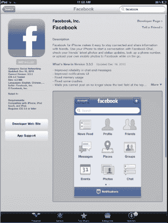 |

| 要连接到你的 Facebook 帐户，你需要找到刚刚安装的图标并点击它。我们这里以 `Facebook` 应用为例，但这个过程对于其他应用也非常相似。一旦 `Facebook` 应用成功下载，你应该会看到此处显示的图标。 |  |

#### Facebook 应用基础

| 一旦 `Facebook` 应用下载并安装完成，你首先会看到`登录`屏幕。输入你的账户信息——你的电子邮件地址和密码。 | 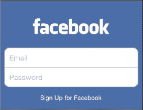 |

| 首次登录后，你会看到一个`推送通知`警告消息。如果你希望允许这些消息，请点击`确定`，这些消息可能包括其他 Facebook 好友的“戳一下”、备忘、状态更新通知等。登录后，你将看到图 23–2 所示的 `Facebook` 屏幕。点击 `Facebook` 标志可以在应用内导航。 | 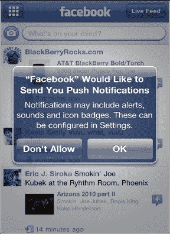 |

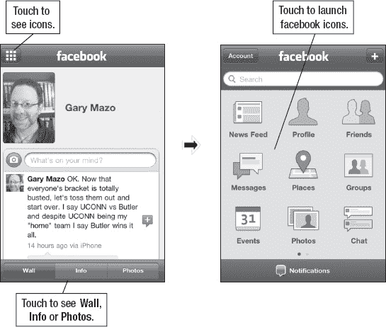

**图 23–2.** *使用 `Facebook` 应用*

#### 在 Facebook 中导航

| 通过点击页面顶部的 `Facebook` 字样，可以在`导航`图标和当前位置之间切换。例如，如果你在`新鲜事`中，点击 `Facebook`，你将看到所有图标。再次点击 `Facebook`，你将返回到`新鲜事`。从图标页面，你可以访问你的`新鲜事`、`个人资料`、`好友`、`通知`、`地点`、`请求`、`活动`、`照片`或`聊天`。 | 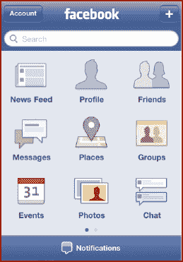 |

#### 与好友交流

按照以下步骤与你的 Facebook 好友交流：

1.  点击顶部的 `Facebook` 以查看所有图标。
2.  点击`好友`图标以查看显示的好友列表。
3.  点击你想要交流的好友，你将进入她的 Facebook 页面。在这里，你可以在`留言板`上留言，并查看好友的`信息`和`照片`。

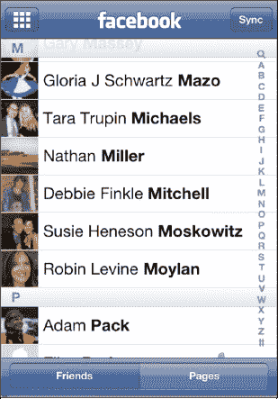

#### 使用 Facebook 应用上传图片

用 Facebook 做一件简单又有趣的事情就是上传图片。请按照以下步骤在 `Facebook` 应用中上传图片：

1.  从 `Facebook` 的主图标中，点击`照片`。
2.  选择一个相册，例如`手机上传`。
3.  点击“你在想什么？”框旁边的`相机`图标。接下来，点击`拍摄照片或视频`来拍照或录像并上传。或者，你可以点击`从图库选取`来浏览 iPad 上的照片，直到找到你想要上传的照片。

    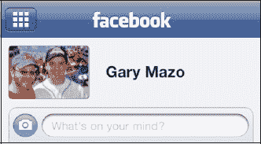

4.  接下来，如果愿意，点击`写说明……`来编写说明文字。

    

5.  要完成上传，请点击蓝色的`上传`按钮。照片将进入你的`手机上传`文件夹。

**注意**：当你上传照片时，图像质量将不会与 iPad 上的原始照片相同。

##### Facebook 通知

根据您对 Facebook 推送通知的设置，您可能会被各种更新、留言墙帖子和邀请淹没。如果你的 Facebook 好友不多，并且希望知道何时有人在你的留言墙上留言或评论你的帖子或照片，只需将推送通知设置为`开启`。

| 当通知到达时，它会显示在屏幕上——即使你的 iPad 已锁定。在这个例子中，Gary 的朋友在他的留言墙上留言了，并且他的收件箱里有一条待处理的消息。`Facebook`图标告诉他有一条待回复或查看的通知。 | 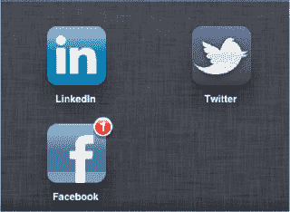 |

| 点击该图标会启动`Facebook`应用，Gary 可以查看并回复消息。他可以在`消息`部分看到一个通知图标，由`红色 (1)`圆圈标示。他还能在屏幕底部看到一条新的`留言墙帖子`通知。 | 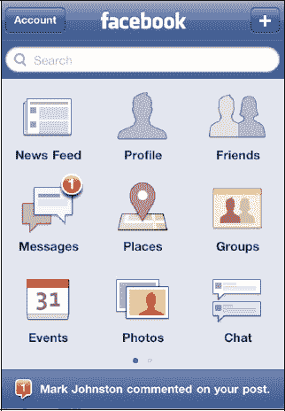 |

###### 放大或缩小应用

由于这个`Facebook`应用是为 iPhone 或 iPod touch 的较小屏幕设计的，你会注意到它会在屏幕中央作为一个较小的应用打开。要查看较大尺寸的应用，请点击屏幕右下角的`2x`按钮，如图 23-3 所示。

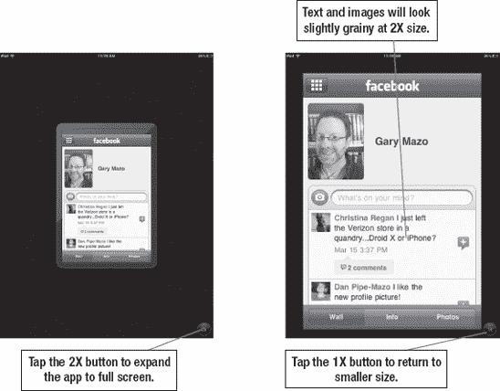

**图 23-3.** *使用`2x`按钮将应用扩展至全屏。*

###### 自定义 Facebook 应用的设置

按照以下步骤调整`Facebook`应用的设置：

1.  点击`设置`图标。
2.  在左侧栏中点击`Facebook`。
3.  现在您可以调整各种选项：
    *   `摇动以重新加载`：此功能可在您摇晃 iPad 时重新加载或更新页面。
    *   `震动`：此功能允许您指定收到通知时所需的震动设置。
    *   `推送通知`：这些功能有简单的`开启`/`关闭`开关。触摸`推送通知`可在下一个屏幕上查看详细的开关选项。

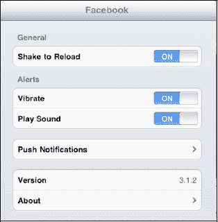

您可以在右侧看到`Facebook`应用的`推送通知`设置屏幕。

触摸每个开关以将其打开`开启`或关闭`关闭`。

对于每个处于`开启`位置的开关，当有变化发生时，您将收到推送通知。例如，当您收到有人确认您为好友、在照片中标记您或在您的留言墙上评论的消息时，您的 iPad 会通知您。

**提示：** 最新版本的`Facebook`应用将允许您使用`Facebook  Places`查看附近的好友。它还具备`新样式`消息和`群组`功能。

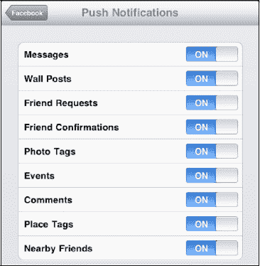

#### 使用 Flipboard 和 Friendly Facebook 应用

虽然令人沮丧的是没有“官方”的 iPad Facebook 应用，但 App Store 中有两个非常好的替代品（均为免费）。这两款应用都能让 Facebook 在 iPad 的大屏幕上体验更佳。

| `Friendly Facebook for iPad`在 App Store 中有免费版本。只需在 App Store 中搜索“Facebook”，您应该就能找到该应用。 | 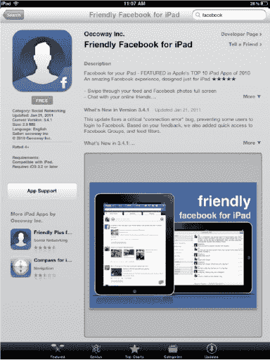 |

一旦安装了该应用，您可以在应用顶部看到`实时动态`、`活动`和`地点`被标记为按钮（参见图 23-4）。只需触摸其中一个按钮即可跳转到相应部分。

在最顶部，您可以找到您的`个人资料`或`好友`的按钮，以及一个`首页`按钮，用于跳转到实时`新闻动态`。

顶部还有一些较小的图标，用于`消息`、`通知`、`请求`，以及一个指向您`Facebook 游戏`页面的便捷链接。

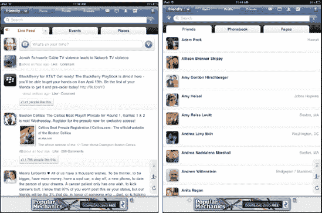

**图 23-4.** *Friendly Facebook for iPad* *屏幕*

##### iPad 版 Flipboard

作者最喜欢的应用之一是`Flipboard`，它被描述为 iPad 上的个人社交杂志。

| 基本上，您可以从众多内容提供商中的任何一个向`Flipboard`应用添加版块。从那里，您可以以杂志风格（翻页）浏览任何网站或内容提供商。您可以使用`Flipboard`设置 Facebook、Twitter 和 Flickr（以及其他账户）的账户。此功能在 Facebook 方面表现非常出色。首先从 App Store 下载`Flipboard`。 | 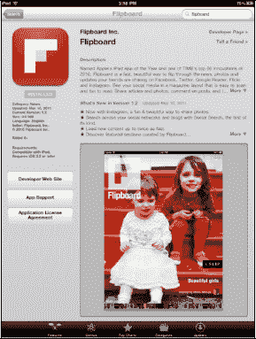 |

| 当您首次启动`Flipboard`时，您可以在添加版块时设置账户。设置 Facebook 很简单，只需触摸`添加版块`，然后输入您的 Facebook 登录信息即可。 | 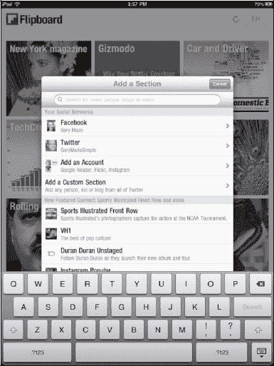 |

然后，您将看到您的 Facebook 页面以杂志形式呈现。您可以触摸某个项目将其全屏显示，或者可以“翻页”浏览所有 Facebook 帖子。

触摸页面顶部的`Facebook`按钮，您可以跳转到`您的留言墙`、`您的照片`、`新闻动态照片`、`新闻动态链接`、`群组`、`页面`、`好友列表`或`好友`（参见图 23-5）。

触摸某位好友的按钮即可跳转到他的页面。

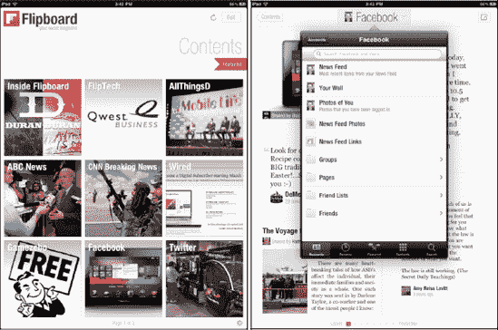

**图 23-5. Flipboard** 的 Facebook 屏幕

### LinkedIn

LinkedIn 与 Facebook 的核心功能非常相似，但它更侧重于商务和职业方向。相比之下，Facebook 则更侧重于个人好友和游戏。通过 LinkedIn，您可以与当前和过去的商业伙伴建立联系或重新取得联系。该服务允许您发送消息、了解他人的动态、进行讨论等等。

截至本书出版时，LinkedIn 的状态与 Facebook 非常相似。您可以在`Safari`浏览器上访问常规 LinkedIn 网站，或下载 iPhone 版`LinkedIn`应用。

哪个更好？我们觉得 iPhone 版`LinkedIn`应用比在`Safari`中浏览完整的 LinkedIn.com 网站略胜一筹。使用`LinkedIn`应用，凭借其大按钮，导航更为便捷，但您在`Safari`版本中可以在屏幕上看到更多内容。我们建议您两种方式都尝试一下，看看自己喜欢哪种——这其实是个人的偏好问题。

#### 在 Safari 浏览器上使用 LinkedIn.com

要在浏览器上访问 LinkedIn，请遵循以下步骤：

1.  点击`Safari`图标。
2.  点击浏览器顶部的`地址`栏。
3.  输入此地址：[`www.linkedin.com`](http://www.linkedin.com)。如果在输入时，[`www.linkedin.com`](http://www.linkedin.com) 出现在下拉框中，则只需触摸该链接即可跳转。
4.  输入您的 LinkedIn 用户名和密码登录，即可看到 LinkedIn 的`首页`页面，如图 23-6 所示。

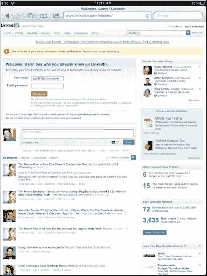

**图 23-6.** *在您的`Safari`网页浏览器上的 LinkedIn `首页`页面*

**提示：** 请记住通过双击或捏合缩放来查看更多网页内容。

您可以在 LinkedIn.com 上像在电脑上一样导航和交互。唯一的区别是您用手指代替鼠标点击链接。

#### 下载 LinkedIn 应用

获取 `LinkedIn` 应用十分简单。在 iPad 上启动 `App Store` 应用，在 `Search` 窗口中输入“LinkedIn”，即可找到该应用。它是免费的，因此点击 `FREE` 按钮即可安装。

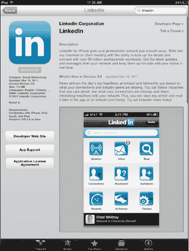

##### 登录 LinkedIn 应用

安装好 `LinkedIn` 应用后，点击 `LinkedIn` 图标，输入你的登录信息。

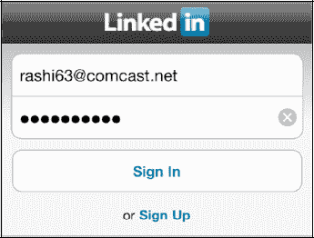

##### 浏览 LinkedIn 应用

`LinkedIn` 应用采用了与 Facebook 类似的基于图标的导航风格。点击任意图标即可跳转至相应功能，然后点击左上角的 `Home` 图标即可返回 `Home` 屏幕（见图 23–7）。

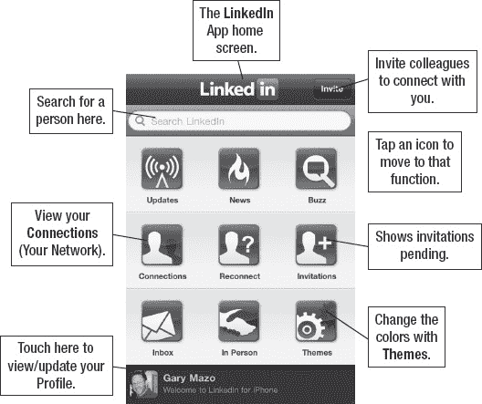

**图 23–7.** *`LinkedIn` 应用的 `Home` 屏幕*

##### 与 LinkedIn 联系人沟通

你在使用 `LinkedIn` 应用时最常做的事之一就是与联系人沟通。操作方法很简单：

1.  点击 `Connections` 图标。
2.  滚动浏览联系人列表，或在 `Search` 框中输入联系人名称。
3.  点击你想寻找的联系人。
4.  点击右上角的 `Send` 图标 ，然后选择 `Send Message`。

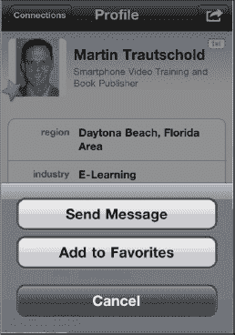

### Twitter

Twitter 始于 2006 年。它本质上是一个基于短信（SMS）的社交网站，常被称为*微型博客网站*，名人和普通人都可以在上面分享自己的想法。关键在于，你只有 140 个字符来表达你的观点。

在 Twitter 上，你可以订阅（*follow*）那些发布推文（*tweets*）的人。你也会发现有人开始关注你。如果你想关注我们，我们在 Twitter 上的账号是 `@mtrautschold`。

### 创建 Twitter 账户

创建 Twitter 账户非常简单。我们建议你首先在 Twitter 网站 [`www.twitter.com`](http://www.twitter.com) 上建立你的 Twitter 账户。建立账户时，你需要选择一个唯一的用户名（我们用的是 `@garymadesimple`）和密码。

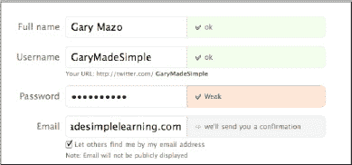

随后你会收到一封确认邮件。点击邮件中的链接，你将被带回 Twitter 网站。你可以在网站上发布推文或选择关注的人，也可以阅读好友的推文。

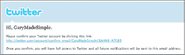

### iPad 上的 Twitter 选项

在 iPad 上使用 Twitter 有很多选择。关注他人和发布推文最简单的方法是使用 App Store 中的 Twitter 应用。

可供选择的 Twitter 应用很多。本书将重点介绍两款：`TweetDeck` 和官方的 `Twitter` 应用。这两款应用设计都非常出色且易于使用。

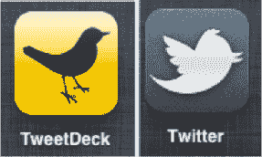

**注：** 这两款应用都能让你在 Twitter 上完成几乎相同的操作——这实际上只是个人偏好的问题！

#### 下载 Twitter 应用

前往 App Store，点击 `Categories`，选择 `Social Networking`。你应该会在 `Social Networking` 区域看到 `TweetDeck` 和 `Twitter`。如果没有，只需点击 `Search` 窗口并输入应用名称。像下载其他应用到 iPad 一样下载这些应用即可。

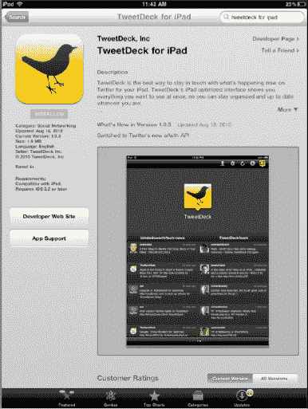

#### 首次启动 Twitter 应用

点击任意应用图标，程序将启动。首次使用任一应用都需要你登录 Twitter。你的用户名就是你最初注册 Twitter 时选择的那个。

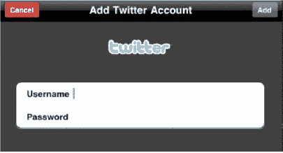

#### 使用 TweetDeck

`TweetDeck` 应用提供了一个非常简洁的 `Home` 屏幕。你可以在屏幕左下角 `All Friends` 标签下看到你关注的人的推文。

在右侧，你通常会看到 `Mentions`，即对你自己推文的回复。这些回复的操作方式类似于短信对话。

`TweetDeck` 的控制按钮位于右上角。共有五个图标供你使用（见图 23–8）。

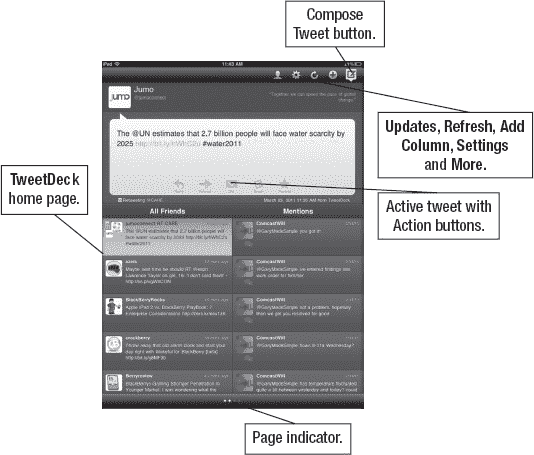

**图 23–8.** *`TweetDeck` 的 `Home` 页面布局*

##### 查找用户

点击 `Profile` 图标（人物图标）即可看到 `Search` 框，输入你想关注的人的姓名或用户名。

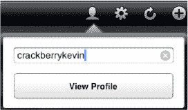

在此示例中，我搜索了我的朋友 Kevin，他的用户名为“CrackBerryKevin”。找到目标用户后，点击 `View Profile` 按钮即可查看他的 Twitter 资料。

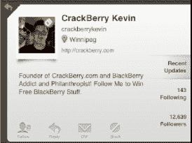

##### 账户与设置

该应用的 `Accounts and Settings` 部分有多个可调整的字段。点击 `Manage Accounts` 标签可以添加或编辑 Twitter 账户。点击 `Sign into an Account` 可以登录你可能拥有的另一个 Twitter 账户。操作方法是，点击该标签并输入你的用户名和密码。点击 `Settings` 标签可以调整自动更正、自动大写和声音选项。如果你有专门用于将图片上传到 Twitter 的服务，也可以在此选择你的图片服务。

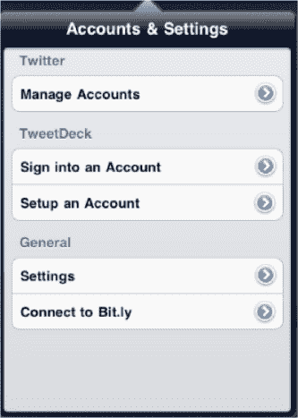

##### 刷新

点击 `Refresh` 按钮即可刷新你的推文。

#### 添加列

`Add Column` 按钮可以为你的 Twitter `Home` 屏幕添加另一列。只需从右向左滑动，即可在不同列之间切换。底部的圆点表示你需要滑动浏览多少个屏幕。你可以为 `Search`、`Direct Messages`、`Mentions`、`Favorites`、`Twitter Trends`、`Twitter Lists`、`Twitter Search` 和 `All Friends` 添加列。

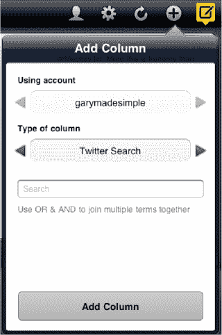

##### 撰写推文

点击 `Compose Tweet` 图标 ，`Tweet composition` 屏幕便会显示。你的 Twitter ID 显示在 `From:` 行，你有 140 个字符来表达你的想法。完成后，点击右上角的 `Send` 按钮。

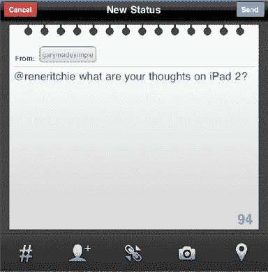

##### 阅读与回复

点击一条推文可将其显示在 `Main` 屏幕上。这会使推文变得很大且清晰，你可以点击推文中的链接来启动 `Web` 视图。如果你想在 `Safari` 中查看链接，请点击 `View in Safari` 按钮。

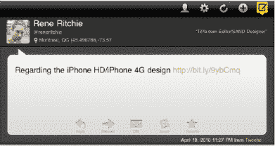

**注：** 在 `Safari` 中查看链接后，你需要关闭 `Safari` 并重启 `TweetDeck`。

在 `Tweet` 窗口的底部，你会看到五个图标：`Reply`、`Forward`、`DM`、`Email` 和 `Favorite`。

每个图标都会弹出一个附加窗口和屏幕键盘，供你输入 `Reply`、`Forward` 推文，向作者发送 `Direct Message`，`Email` 该推文，或将其设置为 `Favorite`。

#### 使用 Twitter

官方的 `Twitter` 应用采用了一种精简的方式来使用 Twitter。`Home` 屏幕会显示你关注的人的推文。点击完整信息，右侧会出现一个新列。此列显示完整的推文和作者信息，以及 `Reply`、`Favorite`、`Retweet` 和 `Send` 图标。

你可以在左侧看到五个图标。第一个图标是主要的 `Twitter` `Timeline` 信息流。其他图标分别是 `Mentions`、`Direct Messages`、`Links`、`Profile` 和 `Search`。

`Compose Tweet` 图标位于左下角（见图 23–9）。

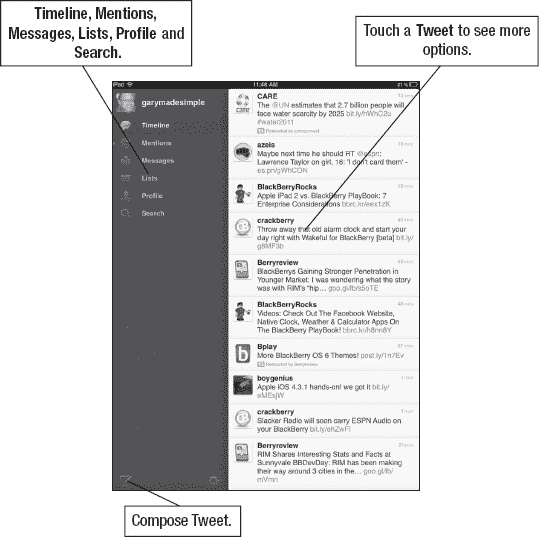

**图 23–9.** *`Twitter` 应用的 `Home` 页面布局*

### 刷新你的推文列表

| 要刷新你的推文列表，请下拉**主页**页面，页面顶部会显示**下拉以刷新**通知。将页面下拉后，你会看到**释放以刷新**提示。松开页面即可刷新推文。 | 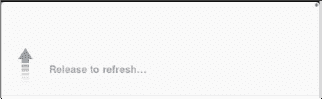 |

### 你的 Twitter 个人资料

| 点击**个人资料**即可显示你的 Twitter 个人资料。要查看你的推文，只需点击**推文**。要查看你标记为收藏的推文，请点击**收藏**按钮。要查看你关注的人，请点击**正在关注**按钮。**注意**：与你粉丝数、关注数、收藏数和推文数对应的数字会显示在相应按钮标题的下方。 | 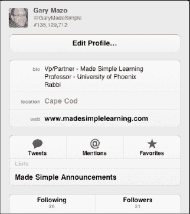 |

### 撰写按钮

| 点击**撰写**按钮 ，会弹出**新推文**屏幕。输入信息时，字符计数器会从 140 开始倒计时。在**撰写推文**屏幕底部，你会看到**直接提及**、**话题标签** (`#`)、**图片上传**以及**地理标记**的图标。 当你点击某个图标时，建议内容会弹出一个单独的窗口显示。 | 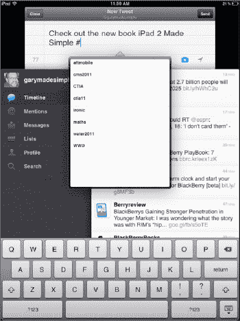 |

### 推文内的选项

| 在 **Twitter** 应用的**主页**屏幕上，点击你的一条推文会弹出一个选项列表。你可以对该推文进行**回复**、**设为收藏**、**转推**和**翻译**/**发送**/**电子邮件**。只需点击相应的按钮即可执行操作。你可以在图 23–10 中查看**链接**和**邮件**选项的详细信息。 | 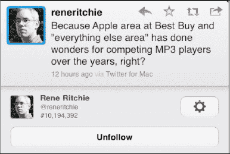 |

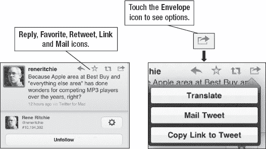

**图 23–10.**  **Twitter** 应用中推文内的选项

## 第 24 章

## 告别纸质笔记

在本章中，我们将向你概述**备忘录**应用以及一个名为**印象笔记**的流行替代应用，你可以使用它们来写笔记、制作购物清单，以及列出你想看的电影或想读的书籍清单。我们还将向你展示如何整理甚至通过电子邮件将笔记发送给自己或他人。理想情况下，我们希望**备忘录**在 iPad 上能变得非常易用，以至于你最终可以摆脱大部分——即使不是全部——纸质便利贴！

### 探索更多备忘录应用

在本章后面部分，我们将深入介绍一个名为**印象笔记**的优秀且免费的**备忘录**应用替代品。App Store 中还有各种其他免费或低成本的备忘录应用，但目前**印象笔记**脱颖而出。使用**印象笔记**，你可以为笔记添加标签并进行整理、向笔记添加图片、添加语音笔记，并显示你最初撰写笔记的位置。**印象笔记**的另一个优点是可以将你的笔记与印象笔记网站（以便你可以在电脑上管理笔记）以及你可能拥有的许多其他移动设备自动同步。

| **提示：** iPad 自带的**备忘录**应用非常基础和实用。如果你需要一个更强大的笔记应用，能够排序、分类、导入项目（如 PDF、Word 等）、拥有文件夹、支持搜索等功能，那么你应该看看 iPad 上的 App Store。搜索“笔记”，你会找到至少十多个与笔记相关的应用，价格从 0.99 美元起。 |  |

#### 备忘录应用

如果你和许多人一样，你的办公桌或墙上可能贴满了黄色的小便利贴——记录着各种能想到的待办事项。即使有了电脑，我们仍然倾向于留下这些小纸条作为提醒。iPad 的一大优点是，你可以在熟悉的黄色便签纸上书写笔记，然后将它们整齐地整理排序。你甚至可以将它们通过电子邮件发送给自己或他人，以确保信息不被遗忘。

| iPad 上的**备忘录**应用为你提供了一个便利的地方来保存笔记和简单的“待办事项”列表。你还可以保存简单的列表，例如购物清单，或其他商店（如五金店或宠物店）的清单。如果你随身带着 iPad，一旦想到需要添加的项目，就可以立即添加到这些列表中，并且可以随时访问和编辑。 | 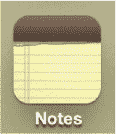 |

#### 同步备忘录

你可以使用我们在第 3 章：“将你的 iPad 与 iTunes 同步”和第 4 章：“其他同步方法”中展示的方法，将备忘录与你的电脑或其他网站同步。图 24–1 展示了一个使用 **iTunes** 将** Microsoft Outlook **中的笔记同步到 iPad 上**备忘录**应用的示例。同步笔记的好处在于，你可以在电脑上添加一条笔记，然后它就会“出现”在你的 iPad 上。之后，当你外出时，你可以编辑那条笔记，并将其同步回你的电脑。你不再需要重新输入或记住事情。你总是随身带着 iPad，因此随时随地做笔记是永不遗忘重要事项的好方法。

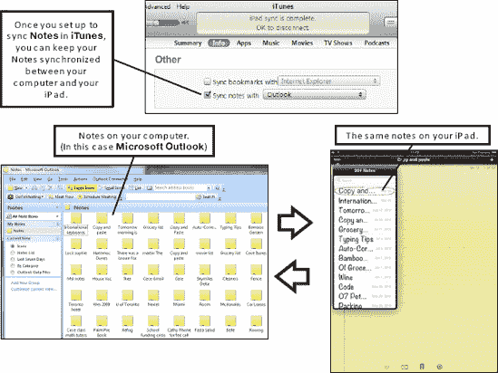

**图 24–1**.  使用 **iTunes** 在 **Microsoft Outlook** 和 iPad **备忘录**应用之间同步笔记

#### 开始使用备忘录

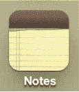

与其他任何应用一样，只需轻点**备忘录**图标即可启动它。

启动**备忘录**应用后，你会看到一个典型的黄色记事本。

你的**备忘录**会以标签的形式显示在列表中，可供点击。点击你想要查看或编辑的备忘录名称（参见图 24–2）。然后就会显示该备忘录的内容。

你可以像在任何程序中一样在**备忘录**中滚动。你会注意到备忘录最后编辑的日期和时间显示在左上角。

阅读完备忘录后，只需点击左上角的**备忘录**按钮即可返回**备忘录**主屏幕。

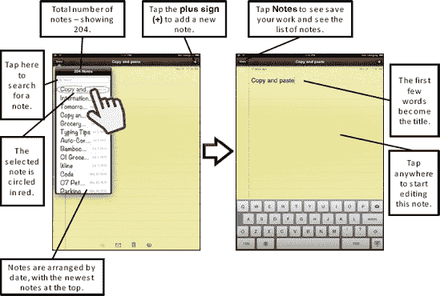

**图 24–2**.  在**备忘录**应用中导航

##### 多个备忘录账户

如果你恰好同时通过 **iTunes** 同步至少一个 IMAP 电子邮件账户和你的电脑，那么你会看到来自每个账户的备忘录是分开存放的。这与你按电子邮件账户将联系人分到不同组，以及按电子邮件账户将日历分开存放的方式非常相似。

| 要查看多个备忘录账户，你需要在**账户** **设置**屏幕中设置一个开关。当你在**设置**  **邮件、通讯录、日历**中设置你的 IMAP 电子邮件账户时，你会看到将**备忘录**同步设为**开**或**关**的选项。要查看这些备忘录账户，你需要将**备忘录**开关设为**开**，如此处 Gmail 账户所示。 | 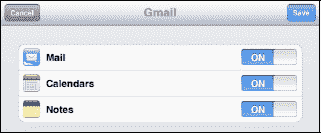 |
| 要查看不同的备忘录账户，请点击**备忘录**应用左上角的**账户**按钮。 | 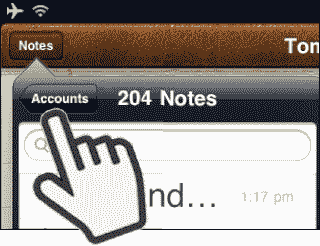 |
| 然后，在下一个屏幕上，你可以点击选项来查看**所有备忘录**或每个账户的备忘录。在此图像中，选项为** Gmail **或**来自我的 PC**（本例中是通过 **iTunes** 从 **Microsoft Outlook** 同步的笔记）。你添加到某个账户的备忘录将保留在该账户下。例如，如果你向 **Gmail** 添加了备忘录，那么这些备忘录只会显示在你的** Gmail **账户中。 |  |

#### 我的笔记是如何排序的？

你会看到所有笔记按时间倒序排列，最近编辑的笔记排在最前面，最旧的排在底部。显示的是该笔记**最后编辑**的日期和时间，而非最初创建的时间。因此你会注意到笔记的顺序在屏幕上会发生变化。这种排序是个好设计，因为你最近（或频繁编辑的）的笔记会始终位于顶部。

**提示：** 如果你想要一款好用的待办事项应用，不妨试试 **Appigo Todo**。目前在 App Store 中的售价为 4.99 美元。

|  |     |
| ----------------------------- | --- |

#### 添加新笔记

要新建笔记，请点击右上角的 **加号 (+)**。

此时记事本为空白状态，键盘会自动弹出供你开始输入。如果你希望隐藏键盘，只需点击右下角的 **隐藏键盘** 键即可。

**提示：** 你可以在 **设置** 应用中更改 **备忘录** 的字体。Apple 已经更改过一次字体选项，但在本书写作时，可选的三种字体分别是 Noteworthy、Helvetica 和最初的 Marker Felt。

#### 为笔记添加标题

在按下 **回车** 键之前输入的前几个字将成为笔记的标题。因此，请先想好标题内容再输入。在右侧显示的图片中，“**购物清单**”成为了笔记的标题。每行输入一个新项目，然后按 **回车** 键换行。

**注意：关于保存笔记**  
好在你不必点击 **“保存”** 按钮，因为当你完成输入后，笔记会自动保存。

|  |     |
| ----------------------------- | --- |

编辑完笔记后，你可以执行以下任一操作：

- 若要退出应用，请按下 **主屏幕** 按钮退出 **备忘录** 应用。
- 如果你处于 **竖屏** 模式，请点击左上角的 **备忘录** 按钮  以查看笔记列表。
- 如果你处于 **横屏** 模式，请点击其他笔记来查看。

#### 搜索笔记

当笔记数量增多时，你会希望知道如何快速找到某条笔记。在笔记列表顶部的 **搜索** 栏中点击并输入一个或多个词语。所有标题或正文中包含这些词语的笔记会立即显示出来。

|  |     |
| ----------------------------- | --- |

#### 编辑笔记

你可以轻松编辑或修改笔记内容。例如，你可以保留一张“待办事项”笔记，并在想到要添加其他项目时快速编辑（或者当家人提醒你需要从商店买某样东西时！）。

从笔记列表中点击“待办事项”笔记，或者点击 **搜索** 窗口并输入“待办事项”以快速找到它。

要开始编辑，请点击屏幕上的任意位置；光标会移动到该位置供你编辑。

如果你双击一个词，将会出现用于复制和粘贴的蓝色手柄。（详见 第 2 章：“打字技巧、复制/粘贴和搜索”，了解更多关于复制与粘贴的内容。）

**提示：** 使用蓝色选择手柄是选择大量文本的最佳方式；它既快捷又精准。

请记住：你可以长按某个单词来显示 **放大镜** 图标，从而将光标精确插入到你想要的位置。当你松开手指时，会看到一个包含 **选择**、**全选** 的弹出菜单——如果你最近复制过文本，还会出现 **粘贴** 选项。

|  |     |
| ----------------------------- | --- |

编辑完成后，点击 **主屏幕** 按钮退出；如果你处于 **竖屏** 视图，请点击 **备忘录** 按钮以调出笔记列表。如果你处于 **横屏** 模式，则可以点击其他笔记来查看。

#### 通过电子邮件发送笔记

**备忘录** 应用的一项便捷功能是能够通过电子邮件发送笔记（见图 24–3）。假设我们写好了一张购物清单，想通过电子邮件发给某人，让其在回家路上顺便采购。在编辑或查看笔记时，我们可以点击屏幕底部的 **信封** 图标。

**图 24–3.** *通过电子邮件发送笔记*

##### 查看上一篇或下一篇笔记

要浏览多篇笔记，只需点击屏幕底部的 **箭头** 图标。如果点击 **向前**  箭头，页面会翻转，显示下一则笔记。要返回，只需点击 **向后**  箭头即可。

|  |     |
| ----------------------------- | --- |

##### 删除笔记

要删除笔记，请先在主 **备忘录** 屏幕中点击打开该笔记，然后点击底部的 **垃圾桶** 图标。iPad 会提示你 **删除笔记**。点击此按钮即可删除。若要取消，请点击屏幕上 **删除笔记** 按钮之外的任意位置。

|  |     |
| ----------------------------- | --- |

#### 从带有下划线的日期和时间创建新的日历事件

尝试在笔记中输入“明天早上”或“明天晚上 9:30”等词语，然后保存。下次打开该笔记时，你会发现这些词语已被添加下划线。如果你长按带有下划线的词语，会出现一个按钮询问是否要 **创建事件**。点击该按钮即可为带下划线的日期和时间新建一个 **日历** 事件。

|  |     |
| ----------------------------- | --- |

**提示：** 每当日期和时间词语带有下划线时，iPad 都会将其识别为潜在的 **日历** 事件。此功能适用于笔记、电子邮件以及 iPad 上的其他应用。

### 另一款笔记应用：印象笔记（基础版免费）

在 App Store 中，你会看到许多专为 iPad 设计的笔记应用。

要了解一些最受欢迎的笔记相关应用，可以查看 TiPb.com 上列出的五款热门应用清单：

`www.tipb.com/2010/03/05/tipb-top-5-iphone-note-apps-2/`

| **印象笔记** 是较为热门的免费基础版笔记应用之一。如果你需要更多存储空间，可以按月或按年付费购买服务计划。请在 App Store 或 [`www.evernote.com`](http://www.evernote.com) 上查看最新价格和功能。**印象笔记**的强大之处在于，当你在 **印象笔记** 中输入笔记时，你可以将其与你的 Mac、iPhone、黑莓或 PC 进行*自动同步*。所有文本均可搜索，你甚至可以使用 **印象笔记** 进行*地理定位*（让你的 iPad 跟踪你的位置，并将其与特定笔记关联）。 |  |

**提示**：你甚至可以使用 **印象笔记** 录制语音笔记。

### 开始使用印象笔记

| 首先前往 App Store 下载 **印象笔记**。下载并安装完成后，你需要点击 **印象笔记** 图标启动应用。第一次使用 **印象笔记** 时，系统会提示你注册一个免费账户。输入你的电子邮件地址并设置密码，即可开始使用。 |  |

### 添加笔记与添加标签

| **主页** 屏幕会显示你的所有笔记。要添加新笔记，只需点击左下角的 **新笔记** 按钮，然后输入你的笔记内容。 |  |
| 为你的笔记取一个独特的标题，然后添加一些标签。这些标签有助于整理笔记，在搜索笔记时也很有用。在此示例中，我们设置了几个标签，包括“书籍”、“待办事项”和“工作”。如果我们将这些标签添加到相应的笔记中，那么笔记就可以按这些标签进行分类。 |  |

一旦你输入了几个用逗号分隔的标签，它们就会被添加到一个下拉列表中，方便以后选择。这也有助于避免输错任何标签（请参见图 24–4）。

**图 24–4.** *在 **印象笔记** 中为笔记添加标签*

### 在印象笔记中添加语音录音

| 在添加或编辑笔记时，点击顶部栏中的 **麦克风** 图标，你可以录制你的声音（或周围其他声音）并将其添加到当前笔记中（请参见图 24–5）。 |  |

**图 24–5.** *在 **印象笔记** 中为笔记添加语音录音*

### 从照片库添加图片到笔记

| 你可以通过点击 **编辑笔记** 窗口顶部的 **照片** 图标（位于 **保存** 按钮旁边，请参见图 24–6），轻松地将照片库中的任意图片添加到 **印象笔记** 的笔记中。**印象笔记** 甚至能识别图片中的文字，并使这些文字变得可搜索。 |  |

**图 24–6.** *从照片库添加照片到笔记*

### 通过电子邮件发送、打印、删除或编辑笔记

| 你可以通过点击屏幕底部的 **发送** 图标，然后像在 **备忘录** 应用中那样进行选择，从而通过电子邮件发送或打印你的笔记。 |  |
| 要删除笔记，请点击底部栏的 **垃圾桶** 图标。 |  |
| 有时，你需要确保看到笔记的最新信息，或者你刚添加的信息已同步到印象笔记服务器。为此，点击 **刷新** 图标即可。 |  |
| 要编辑笔记，只需点击屏幕底部的 **铅笔** 图标。这会调出 **编辑** 屏幕。 |  |

### 印象笔记中的笔记查看方式

你有多种选项可以自定义在 **印象笔记** 中查看笔记的方式。选择主屏幕顶部列出的任意视图：**所有笔记**、**笔记本**、**标签**、**地点** 或 **搜索**。

点击 **所有笔记** 查看所有笔记。

点击 **笔记本** 查看所有笔记本（请参见图 24–7）。

**图 24–7.** ***印象笔记** 的 **笔记本**、**标签** 和 **所有笔记** 视图*

### 印象笔记的地点视图

**印象笔记** 的一个很酷的视图是 **地点** 视图。你可以让 **印象笔记** 根据你创建笔记的地点来标记笔记。例如，如果你旅行到了另一个州、省或国家，**印象笔记** 会记录你在该特定区域记过笔记。

图 24–8 显示了一条在加利福尼亚州创建的笔记，以及几条在佛罗里达州创建的笔记。

**图 24–8.** ***印象笔记地点** 视图*

### 印象笔记视图选项

你有多种选项可以自定义 **印象笔记** 中的笔记视图。点击右上角 **搜索** 框下的 **视图选项** 标签，即可自定义当前视图。在图 24–9 中，我们通过为 **排序方式** 选择 **标题**，为 **查看方式** 选择 **缩略图** 来自定义了视图。

**图 24–9.** ***印象笔记** 的 **所有笔记** 视图及其显示的视图选项*

### 印象笔记同步与设置

要将你的笔记与 **印象笔记** 服务器同步，以便在你的 Mac、PC 或其他连接印象笔记的设备（如黑莓或 iPhone）上检索，你需要点击屏幕右下角的 **雷达碟** 图标以调出 **设置** 屏幕（请参见图 24–10）。

向下滚动 **设置** 屏幕，你可以查看免费（或付费）账户的总使用量。

免费账户提供 40 MB 的数据，这可以存储超过 100,000 条文本笔记。点击 **近似剩余笔记数** 选项，可以大致了解这相当于多少图片或语音笔记。

如果你的空间不足，可以通过点击 **同步** 窗口顶部的 **升级为高级版** 选项进行升级。

**图 24–10.** ***印象笔记** 的 **设置** 屏幕*

### 在电脑或其他移动设备上查看或更新印象笔记中的笔记

**印象笔记** 的一个很酷之处在于，它可以通过无线方式与你在印象笔记服务器上的账户同步或共享笔记。然后，你可以从你的 PC、Mac、iPhone 或黑莓登录你的账户，查看或更新笔记。如果你拥有多个设备，并希望随时保持最新状态或从任何设备添加笔记，这是一个非常棒的功能。在图 24–11 中，我们登录了 [`www.evernote.com`](http://www.evernote.com) 网站，看到了与我们之前在 iPad 上创建和查看的相同的笔记。

**图 24–11. *印象笔记** *会自动将笔记同步到你网络账户中。*

## 第 25 章

