# iPad 上的蓝牙

在本章中，我们将向您展示如何将 iPad 与任何蓝牙设备配对，无论是另一台电脑、立体声音箱，还是无线键盘配件。许多 iPad 用户惊讶地发现，iPad 实际上标配了蓝牙 2.1 及其增强数据速率（EDR）技术。得益于名为 A2DP（立体声蓝牙）的技术，您还可以将音乐流式传输到兼容的蓝牙立体声设备。

**注意：** 您必须拥有兼容的第三方蓝牙适配器或蓝牙立体声设备，才能通过蓝牙技术流式传输音乐。此外，现在支持 AVRCP 配置文件，因此蓝牙设备上的许多音乐控制功能（包括 `Play`、`Pause` 或 `Skip`）都能正常工作。

您可以将蓝牙视为一种短距离无线技术，它能让 iPad 无需线缆即可连接到各种外围设备。常见的设备包括耳机、电脑和车载音响系统。

蓝牙据信是以丹麦维京国王哈拉尔·蓝牙（Harald Blåtand）命名的，他的名字被翻译为 *Bluetooth*。蓝牙国王生活在十世纪，以统一丹麦和挪威而闻名。同样，蓝牙技术也统一了计算机和电信领域。根据传说，他的名字源于他非常黑的头发，这在维京人中并不常见。Blåtand 意为深色肤色。还有一个更流行的故事，说这位国王非常喜欢吃蓝莓，以至于他的牙齿被染成了蓝色。

我们使用以下链接作为此信息的来源；这些链接也是进一步了解蓝牙国王的好去处：

*   [`http://cp.literature.agilent.com/litweb/pdf/5980-3032EN.pdf`](http://cp.literature.agilent.com/litweb/pdf/5980-3032EN.pdf)
*   [`http://www.cs.utk.edu/~dasgupta/bluetooth/history.htm`](http://www.cs.utk.edu/~dasgupta/bluetooth/history.htm)
*   [`http://www.britannica.com/eb/topic-254809/Harald-I`](http://www.britannica.com/eb/topic-254809/Harald-I)

### 了解蓝牙

| 蓝牙让您的 iPad 能够与设备进行无线通信。蓝牙是一种小型无线电，从每个设备中发射信号。在使用外围设备与 iPad 搭配之前，您需要先将其与设备进行*配对*以建立连接。许多蓝牙设备可以在距离 iPad 最远 30 英尺的范围内使用。 |  |

#### 可与 iPad 配合使用的蓝牙设备

除其他外，iPad 可与蓝牙耳机、蓝牙立体声系统及适配器、蓝牙车载音响系统和蓝牙无线键盘配合使用。iPad 支持 A2DP，也就是*立体声蓝牙*。

**注意**：搭载 iOS 4.3 的 iPad 2 还可以与 iPhone 3GS 或 iPhone 4 配对，用于蓝牙网络共享。

### 与蓝牙设备配对

您使用蓝牙的主要用途可能是蓝牙耳机、蓝牙立体声适配器或蓝牙键盘。任何蓝牙耳机都应能与您的 iPad 良好配合。要开始使用任何蓝牙设备，您需要先将其与 iPad 配对（连接）。

#### 开启蓝牙

使用蓝牙的第一步是打开蓝牙无线电开关 `ON`。请按照以下步骤操作：

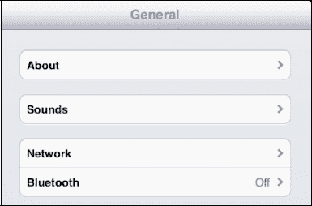

1.  轻点 `Settings`（设置）图标。

    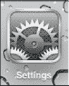

2.  接着，在左栏中触摸 `General`（通用）标签。

    

3.  您会在右栏中看到 `Bluetooth`（蓝牙）标签。默认情况下，iPad 上的蓝牙初始状态为 `OFF`（关闭）。轻点开关将其切换到 `ON`（开启）位置。

**提示：** 蓝牙会额外消耗电池电量。如果您计划在一段时间内不使用蓝牙，请考虑将开关重新设置为 `OFF`（关闭）。

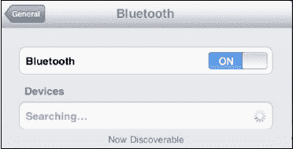

#### 将 iPad 与耳机或任何蓝牙设备配对

一旦您将蓝牙设置为 `ON`（开启），iPad 就会开始搜索附近的蓝牙设备，例如蓝牙耳机或键盘（请参见[图 25–1]）要使 iPad 找到您的蓝牙设备，您需要将该设备置于*配对模式*。请仔细阅读耳机附带的说明书——通常需要按下某种组合按钮才能实现此操作。

**提示：** 有些耳机要求您按住一个按钮五秒钟，直到看到一系列闪烁的蓝色或红/蓝色灯光。某些配件，例如 Apple 无线蓝牙键盘，会自动以配对模式启动。

一旦 iPad 检测到蓝牙设备，它会尝试自动与之配对。如果配对自动完成，您就无需进行任何额外操作。

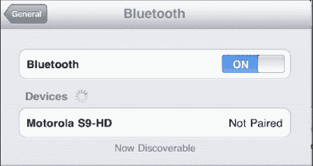

**图 25–1.** *已发现但尚未配对的蓝牙设备*

如果[图 25–2]中的图像保持不变，请轻点该设备（例如 Motorola 立体声蓝牙耳机），以弹出一个要求输入配对 ID 的弹出窗口。

**注意：** 对于键盘等蓝牙设备，您可能需要在键盘上输入一组随机生成的数字（通行码）。其他设备可能根本不需要 PIN 码——只需轻点设备名称，状态就会变为 `Connected`（已连接）（参见[图 25–2]）。

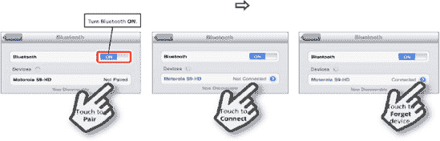

**图 25–2.** *要配对蓝牙设备，请轻点列出的设备以输入通行码（如果需要），或直接将设备连接到 iPad。*

| 如果 iPad 要求输入 PIN 码或通行码，键盘将会显示，您需要输入耳机制造商提供的四位通行码。大多数设备使用 0000 或 1234，这就是为什么 iPad 可以尝试自动与大多数设备配对。请查看您的耳机文档，以了解您设备的正确通行码或 PIN 码。 | 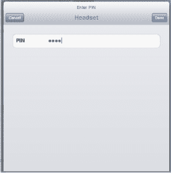 |

## 蓝牙立体声（A2DP）

|  | 当今先进蓝牙技术的一大特色是能够通过蓝牙无线传输音乐。这项技术的专业名称是 A2DP，但通常被称为*立体声蓝牙*。 |

### 连接到立体声蓝牙设备

使用立体声蓝牙的第一步是连接到兼容的立体声蓝牙设备。这可以是内置此技术的车载音响系统，也可以是一副蓝牙耳机或音箱。

按照制造商的说明将蓝牙设备置于配对模式，然后按照本章前面演示的方法，从 `Settings`（设置）图标进入蓝牙设置页面。

| 连接后，您将看到新的立体声蓝牙设备列在您的蓝牙设备下。有时它会简单地显示为“Headset”（耳机）。只需轻点该设备，您会在下一个屏幕中 `Bluetooth`（蓝牙）标签旁边看到实际设备名称，如下所示。 | 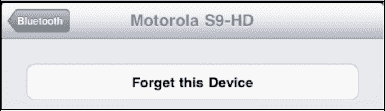 |
| 接下来，轻点您的 `iPod` 图标，开始播放任何歌曲、播放列表、播客或视频音乐库。您会注意到屏幕左上角的 `AirPlay` 图标（有关 `AirPlay` 的更多信息，请参见第 9 章和第 10 章）。`AirPlay` 图标也控制着将音乐发送到蓝牙设备。轻点 `AirPlay` 图标，即可查看可用于流式传输音乐的蓝牙设备。**注意**：在 `Now Playing`（正在播放）视图和 `Current`（当前）歌曲视图中，`Bluetooth` 图标都会显示在顶部，靠近 `Volume`（音量）栏的右侧。 | 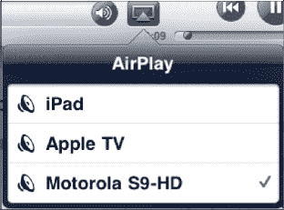 |

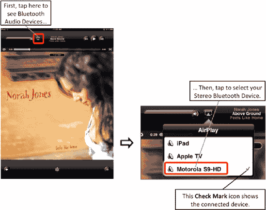

**图 25–3.** *选择蓝牙设备。*

在前面的屏幕中，您学习了如何通过轻点来选择 `Motorola Bluetooth Headset`（摩托罗拉蓝牙耳机）。您的音乐现在将开始从选定的蓝牙设备播放。您可以通过再次触摸屏幕上的 `Bluetooth` 图标来确认这一点。您应该会在新的立体声蓝牙设备旁边看到 `Speaker`（扬声器）图标，并且您应该能够听到音乐从该音源发出。

### 断开或忘记蓝牙设备

有时，你可能想断开 iPad 上某个蓝牙设备的连接。

操作很简单。按本章前文所述进入蓝牙设置。轻点你想断开的设备以进入下一屏幕，然后轻点**忘记此设备**按钮并确认你的选择。

**注意：** 蓝牙的有效范围只有约 30 英尺；如果你附近没有蓝牙设备或未使用蓝牙，应关闭 `Bluetooth`。当你实际需要使用时，可随时重新开启。

执行此操作将删除 iPad 上的蓝牙配置文件（参见图 25–4）。

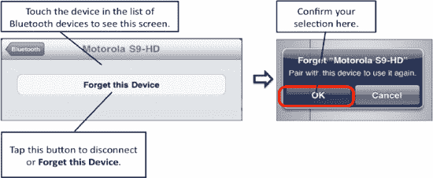

**图 25–4.** *忘记或断开蓝牙设备。*

## 第 26 章

## 新媒体：阅读报纸、杂志等

在第 12 章中，我们讨论了 iPad 如何革新了阅读世界。iPad 不仅是在电子书阅读领域无与伦比，在处理在线报纸、杂志、PDF 文件等新媒体方面同样无可匹敌。

在本章中，我们将探讨如何利用 iPad 鲜艳的屏幕和出色的触控界面来享受新媒体。iPad 甚至凭借精美且互动性极强的漫画书，让漫画行业重焕生机。

### iPad 上的报纸

还记得报纸被送到家里的日子吗？总是如此，如果人行道上有一个水坑，那准是报纸掉落的地方！你从塑料袋里取出报纸，抖掉水珠，努力辨认第二版的内容——那个被浸湿的版面。

#### 进入 iPad 互动报纸时代

好吧，那些日子可能一去不复返了。用户现在有机会与新闻互动，甚至每天都能收到报纸——不过是送到他们的 iPad 上，而不是车道上。

今年新推出的是新闻集团专为 iPad 打造的报纸：**《每日新闻》**。`The Daily` 是一款高度互动的新闻应用，每天早晨（目前仅限美国）直接推送至你的 iPad。

许多报纸都在为 iPad 开发应用，几乎每天都有新的应用出现。我们还将快速浏览美国几家大报纸为 iPad 开发的应用，看看它们如何革新新闻阅读方式（参见图 26–1）。

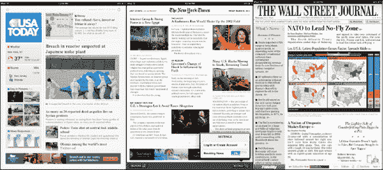

**图 26–1.** *各种报纸应用的首页*

#### 《每日新闻》

`The Daily` 值得特别提及，因为它是首款（很可能也是众多同类应用中的先驱）iPad 专属日报。该应用在 App Store 免费下载，并提供两周到一个月左右的免费试用期。

免费试用期结束后，`The Daily` 会转为订阅模式——与传统报纸类似。不过，其收费标准目前比传统报纸更优惠——每周仅需 0.99 美元，全年订阅只需 39.99 美元。

当你轻点 `The Daily` 应用图标时，首先会看到当天的新闻正在被检索并传输到 iPad。

新闻传输完成后，`The Daily` 的导航非常直观。体验从典型的 `Front Page` 版块开始，显示当日的主要报道。

然而，在页面顶部，你可以快速跳转到 `News`、`Gossip`、`Opinion`、`Arts and Life`、`Apps and Games` 或 `Sports` 版块。只需轻点 `Front Page` 顶部所需的版块即可跳转。

顶部有一个 `Visual Browser`。轻点任意文章的顶部，即可查看 `The Daily` 所有页面的小缩略图。滚动浏览并找到你感兴趣的页面。

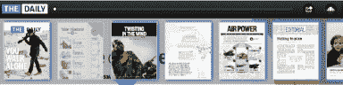

轻点右上角的按钮，打开 `The Carousel` 视图，允许你以大型`逐页`图像的方式浏览 `The Daily`。

右下角有一个`控制面板`按钮。你可以在此观看每日视频、收听文章朗读，或自动播放 `The Carousel` 以找到你感兴趣的故事。

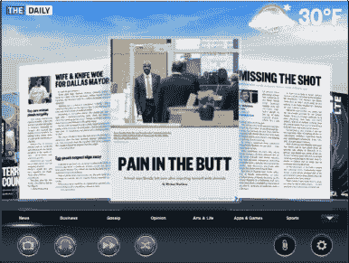

轻点`分享`图标  ，即可轻松将故事的网络友好版分享给电子邮件联系人、Facebook 好友或 Twitter。

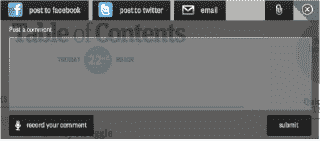

#### 热门选择：《纽约时报》、《华尔街日报》和《今日美国》

这三家报纸的发行量都达数百万读者，每家都采用了不同的方式在 iPad 上为你呈现新闻。

**注意：** 你随时可以访问任何新闻源的专属网站。部分网站针对 iPad 进行了优化，而其他网站则提供完整的网页体验。还有部分网站需要注册和/或付费订阅才能查看报纸的全部内容。

你首先需要在 App Store 中按照几个步骤在 iPad 上查找、下载并安装一个新闻应用：

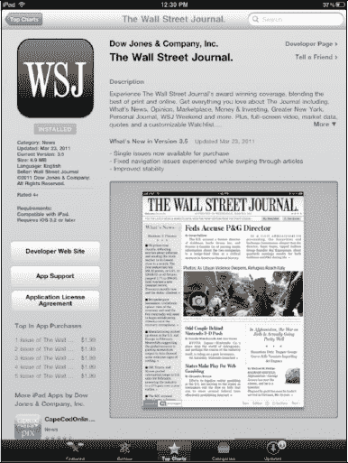

1.  第一步是在 App Store 中找到你想要的新闻应用。你可以在`精选`版块中找到一款或多款新闻应用。
2.  接着，轻点页面底部的`类别`按钮，然后轻点`新闻`图标。这将带你进入 App Store 中的所有新闻应用。像搜索其他应用一样，浏览或搜索你想要的新闻应用。
3.  找到想要的新闻应用后，像下载其他应用一样下载它。

    **注意：** 许多新闻应用是免费的。其他一些应用可免费试用，但需要购买才能继续接收。还有一些应用提供有限的免费内容，但你需要订阅才能访问全部内容。

4.  应用下载完成后，轻点其图标即可启动。

