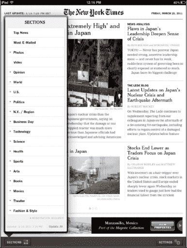
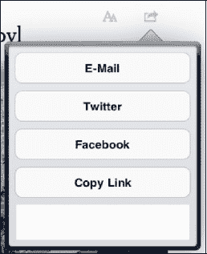

# 《纽约时报》应用

*《纽约时报》*在其免费的 iPad 应用中提供了一个精简版的报纸。

左下角有一个标有**版块**的按钮。点击**版块**按钮，所有可用的版块就会显示出来。

需要注意的一点是，大多数版块旁边都有一个蓝点，这表示需要注册（订阅）才能查看。

**要闻**和**最多邮件分享**版块始终可以查看。

**注意**：*《纽约时报》*最近转向了订阅模式。点击任何带有蓝点的版块，您将看到最新的定价。

浏览**《纽约时报》**应用就像从右向左滑动屏幕一样简单。您可以通过点击一个版块，然后将屏幕向左滑动来查看该版块中的更多页面。再次点击一篇文章，然后再将屏幕向左滑动，即可继续阅读该文章的其余页面。

要返回**主页**，请点击左下角的**要闻**按钮。

要通过电子邮件发送文章，只需点击右上角的**邮件文章**按钮 。此按钮仅在您阅读文章时可用，在**主页**上不可用。

## 浏览与欣赏内容

在体验了各种不同的**新闻**应用一段时间后，您会意识到，浏览这些应用并没有一个真正的统一标准。这意味着您需要熟悉每个应用及其独特的文章导航方式，以及如何返回**主**屏幕。以下是浏览这类应用的一般性指南：

**显示或隐藏控制按钮或说明文字：** 轻点屏幕一次通常会显示隐藏的控制按钮或图片说明。再次轻点即可重新隐藏它们。

**查看文章详情：** 通常，您需要点按文章或其标题才能进入下一个屏幕。

**翻到文章下一页：** 通常，您向右滑动可以阅读更多内容。有时需要向上滑动。

**观看视频：** 点按视频即可开始播放。通常，视频会在屏幕的同一区域内播放，不会扩展开。

**放大视频或图片尺寸：** 您可以尝试在视频或图片内做张开手势，然后双击视频或图片。寻找**展开**按钮；您也可以尝试旋转至**横屏**模式。

**缩小视频或图片尺寸：** 您可以尝试在视频或图片内做捏合手势。寻找**关闭**或**最小化**按钮；您也可以尝试旋转回**竖屏**模式。

