# 《华尔街日报》应用

**《华尔街日报》**应用则采用了不同的方式来提供新闻。应用启动后，系统会提示您创建一个在线账户。

账户创建完成后，您可以查看*《华尔街日报》*的部分内容。

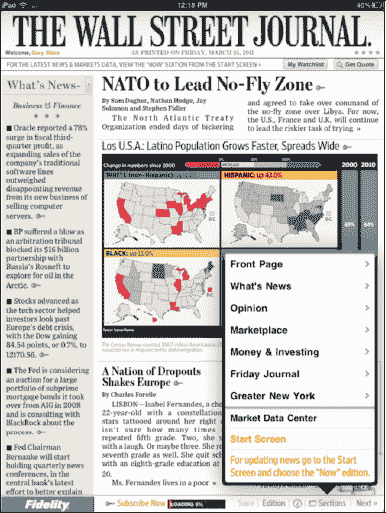

免费账户用户无法访问的内容会标记有一个小的**钥匙** 图标，表示该内容被锁定。

如果您完全订阅了**《华尔街日报》**应用，所有文章和工具都可使用。

点击底部的**版块**按钮，可以查看当前报纸的所有版块。

该应用的**主页**顶部显示本周的报纸；在报纸下方，显示**已保存文章、已保存选项**和**我的关注列表**。

在应用的免费版本中，只有最上面一行新闻中的**此刻**版块可以查看。本周的其他所有报纸旁都有**钥匙**图标；如前所述，这表示它们被锁定，只有付费订阅用户才能查看。

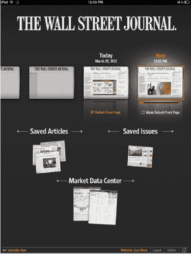

没有**钥匙**图标标记的文章供您阅读。点击一篇文章，它就会加载到 iPad 上。

与**《纽约时报》**应用类似，**《华尔街日报》**应用也允许您将屏幕向左滑动以继续阅读文章。

您会注意到，有些文章在通常出现照片的位置嵌入了视频片段。点击视频，它就会直接在报纸内开始播放——这是一个非常酷且富有互动性的功能。

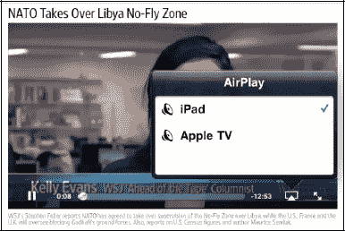

**注意：** 某些应用——比如**《华尔街日报》**应用——兼容**AirPlay**，因此您可以将视频直接发送到电视上（请参阅第 10 章：“观看视频、电视节目及更多内容”）。

## 调整选项：字体大小以及分享、电邮或保存文章

在各种用于阅读报纸和其他内容的应用中，您通常会找到一个更改字体大小的按钮或图标。同一个或附近的按钮也可能允许您分享、保存或将文章电邮给朋友。有些应用允许您将文章分享到社交网络，例如 Facebook 或 Twitter。

**提示：** 几乎所有报纸或杂志应用都允许您更改字体大小以及电邮或以其他方式分享文章。请寻找标有**工具、选项、设置**或类似字样的按钮或图标。在某些应用中，字体大小调整选项会显示**小写 A**和**大写 A**图标。

在**《华尔街日报》**应用中，点击右下角的**分享**按钮来分享一篇文章。该应用为您提供了保存或电邮文章的选项：

**电邮文章：** 此选项可将此文章通过电子邮件发送。

**Facebook：** 将文章分享到您的**Facebook**页面。

**Twitter：** 将文章链接发布到您的**Twitter**账户。

**《华尔街日报》**应用还为您提供了三种文本大小选择：

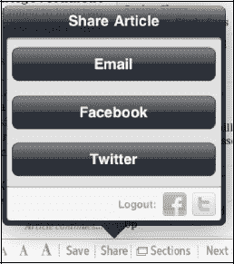

* **小号文本**
* **标准文本**
* **大号文本**

在**《今日美国》**应用中，**字体大小**和**分享**图标是分开的，如右图所示。

点击**分享**图标可以电邮一篇文章或将其分享到社交网络。

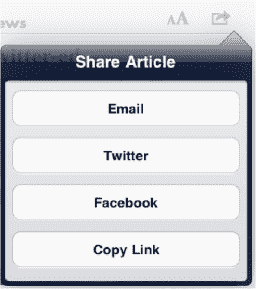

同样，您可以点击**小写 A/大写 A**图标来调整字体大小。

这样做会弹出一个**滑块**控件，让您可以在小号和大号字体大小之间滑动选择。

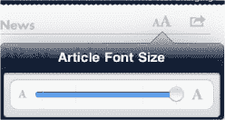

点击屏幕上**滑块**控件之外的任意位置即可隐藏该控件。

在**《纽约时报》**应用中，文章屏幕的右下角有一个按钮，允许您调整**设置**。

在此应用及其他应用中，您经常会看到**突发新闻**提示的选项。一旦有重要事件发生并发布到网站，它们会立即向您发送**提醒**通知。

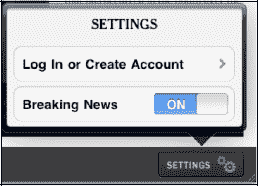

#### 《今日美国》应用

`USA Today` 应用的外观和感觉与其实体日报非常相似。点击 `USA Today` 图标，你将进入报纸的`首页`。首先映入眼帘的是屏幕顶部一组轮播的报道。

主要报道列在右侧。你可以滚动浏览这些报道；找到想看的报道时，只需点击标题即可。

进入`文章视图`模式后，你可以通过点击右上角的`字体大小`图标来调整字号。你也可以通过点击`分享`图标，然后从下拉列表中选择`电子邮件`来通过邮件发送文章。

如果一篇文章超过一页，你可以向上滚动以继续阅读。从右向左滑动屏幕将跳转到下一篇文章。

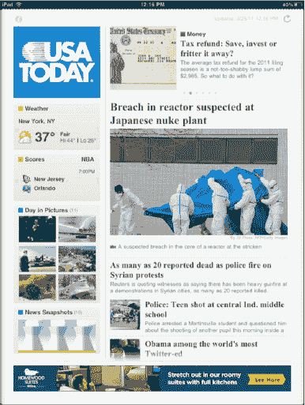

**提示：** 如果你点击`天气`框，可以通过输入城市名称或邮政编码，将其自定义为本地天气。

要返回`首页`屏幕，请点击左上角的`报纸`图标。

要进入报纸的其他板块，请点击`首页`左上角的`今日美国`图标，然后选择`财经`、`体育`、`生活`、`科技`或`旅游`，即可进入该板块。要返回，请再次点击左上角的同一个图标。

目前使用 `USA Today` 应用无需锁定文章或订阅，但这在未来可能会有所改变。

### iPad 上的杂志

众所周知，报纸和杂志的读者数量在过去几年里都有所下降。iPad 提供了一种全新的阅读杂志方式，或许能为这个行业注入所需的活力。

**注意：** 很快，所有现有的杂志应用都需要切换到新的（iOS 4.3）订阅模式。因此，应用内单期购买可能会保留，但很可能会增加订阅选项（有些出版商可能会撤下他们的应用并退出商店）。

在 iPad 上，杂志的图片异常清晰和绚丽。导航通常很简单，报道仿佛跃然纸上——比实体杂志生动得多。想象一下，将视频和声音整合到杂志中，你就会明白 iPad 如何真正提升了阅读杂志的体验。

有些杂志，比如《*时代周刊*》，还包含指向实时或频繁更新内容的链接。这些可能被称为`新闻源`、`实时版`或`更新`。请在购买的杂志中留意它们——这些功能将为你提供最新的信息。

**提示：** 在购买杂志或其他应用之前，务必查看用户评分。这样做可以帮你省去一些烦恼和/或金钱！

App Store 中既有可购买的单独杂志（或可免费查看的有限内容），也有提供多种杂志样张的杂志阅读器，允许你从 iPad 订阅指定杂志的每周或每月递送。

越来越多的杂志在 App Store 中提供数字版。《*时代周刊*》、《*新闻周刊*》、《*连线*》、《*户外*》、《*GQ*》都有此类版本，而且每天似乎还有更多杂志涌现。

一款广受好评的杂志是 `iPad 版时代周刊`，可免费下载。它包含样本内容以及可按期购买的应用内购买项目。在撰写本文时，大多数单期零售价为 4.99 美元。

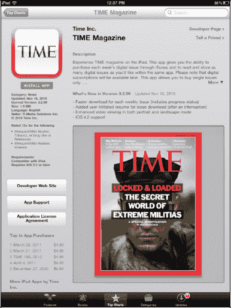

与其他媒体不同，你无需点击文章即可阅读杂志；相反，你只需在屏幕之间滑动，逐页翻阅杂志。

为了使文本更易读，`捏合`和`缩放`功能在多数杂志应用中均可使用。

App Store 中有许多杂志在售，包括《*大众科学*》、《*男士健康*》、《*连线*》、《*户外*》、《*GQ*》、《*时代周刊*》等。大多数单期售价在 2.99 美元到 4.99 美元之间。

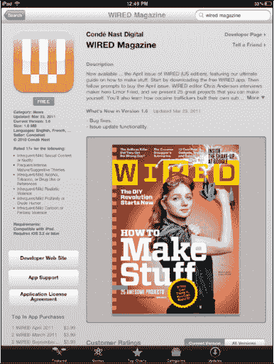

#### 浏览杂志

如图 26–2 所示，根据杂志的不同，其首页有多种类型。此示例并排展示了 `Time Magazine` 应用和 `Newsweek` 应用。

`Newsweek` 应用提供一些免费内容供你浏览，而 `Time Magazine` 应用则让你*预览*各期杂志，然后购买内容。

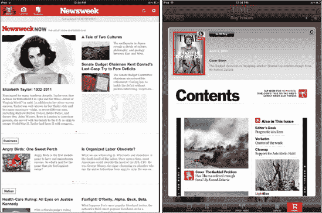

**图 26–2.** *来自 `Time Magazine` 和 `Newsweek` 应用的页面*

#### Zinio 杂志应用——一个样张合集

有一款名为 `Zinio` 的应用采用了独特的方法。`Zinio` 应用在 App Store 中是免费的，为你提供超过 20 种杂志的样张。每个样张都有几篇完整的文章可供阅读。在 `Zinio` 中阅读文章需要遵循以下几个简单步骤：

1. 首先，点击你想阅读的杂志封面。
2. 接着，触摸屏幕，你会看到底部出现一个滑动条，显示免费文章的截图。
3. 要翻页，请从右向左滑动屏幕，或点击底部滑动条上的图片直接跳转到该页。
4. 有些杂志会免费赠送整期内容。只需点击底部的`精选`按钮，即可查看本周提供的免费内容。点击杂志封面即可下载该期。
5. 点击`资料库`按钮，可查看已存储在资料库中供阅读的期数。

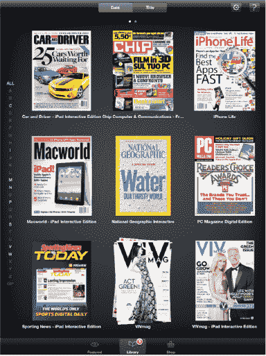

这张图片来自一期免费的《*汽车与驾驶员*》杂志；它是在我们撰写本章的那一周可供下载的。

要订阅 `Zinio` 中展示的任何杂志，请点击屏幕右下角的`商店`按钮。

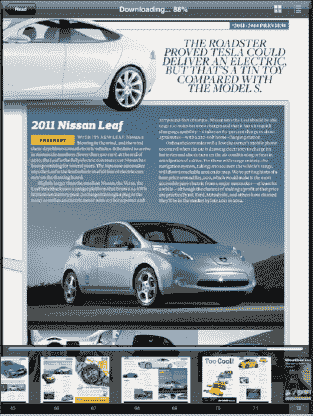

你可以通过左侧的分类浏览杂志，也可以滑动底部的图标查看可用的杂志。

你可以从众多热门杂志中进行选择。分类涵盖了从艺术到体育等方方面面。价格各不相同，但通常会提供单期价格和年度订阅价格。

例如，在撰写本文时，《*大众机械*》的最新一期在 `Zinio` 上的售价为 1.99 美元，年度订阅价格为 7.99 美元。

有些订阅非常划算。*Bike Magazine*（我最喜欢的杂志之一）的单期价格在撰写时为 5.99 美元，但年度订阅仅需 9.00 美元。

仔细一看，我发现可供订阅的自行车杂志超过 16 种。

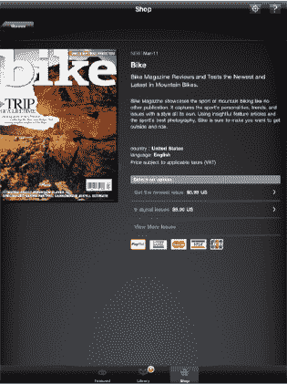

### iPad 上的漫画书

随着 iPad 的出现，*新媒体*中一种有望复兴的题材是漫画书。iPad 凭借其相对较大的高清屏幕和强大的处理器，让漫画书的页面栩栩如生。

在我们撰写本书时，已经有一些不同的漫画书应用可供使用，但没有一家公司比漫威漫画公司更著名。

在 App Store 中找到 `Marvel Comics` 应用。进入 `Categories`，然后进入 `Books`。该应用是免费的，漫画书可以从应用内部购买。

在 `Home` 屏幕底部有三个按钮：`My Comics`、`Store` 和 `Settings`。你购买的内容将出现在 `My Comics` 标题下。

App Store 让你有机会下载免费漫画和单独出售的期刊。大多数每期售价 1.99 美元。

你可以看到顶部的四个标签：

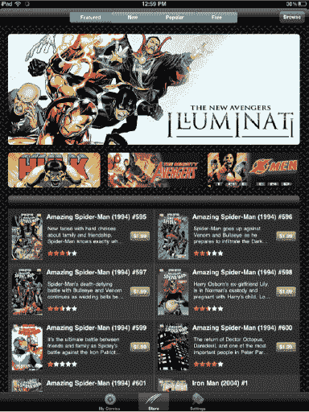

- `Featured`
- `New`
- `Popular`
- `Free`

每个标签都会带你进入一个新的漫画列表供你浏览，很像 iTunes 商店。

触摸 `Browse` 按钮，可以按 `Genre`、`Creator`、`Storylines/Arcs` 或 `Series` 浏览。或者你也可以输入搜索词来查找特定的漫画。

你可以通过两种方式阅读漫画书。第一种，你可以滑动页面，一页一页地阅读。第二种，你可以双击一个画面进行`Zoom`放大，然后点击屏幕前进到连环漫画中的下一个画面。之后，你只需从右向左滑动即可前进一个画面；或者，如果你想后退，从左向右滑动。

要返回 `Home` 屏幕或查看屏幕选项，只需在屏幕上的任意位置触摸并保持大约一秒钟，然后松开。你会在右上角看到一个 `Settings` 按钮，底部有一个页面`Thumbnail`视图（就像 `Photos` 一样），左上角有一个 `Close` 按钮，可以将你带到 `Home` 屏幕。

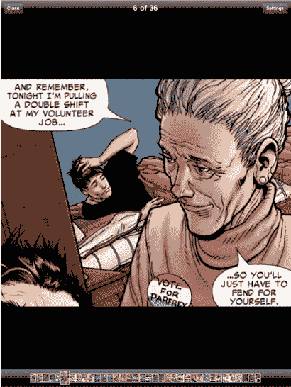

**注意：** 此应用的开发者 `ComiXology` 也制作了包含漫威漫画的 `Comics` 应用，以及许多其他漫画，包括阿奇漫画、映像漫画和 Top Cow。你还会在 App Store 中看到 DC 漫画和其他供应商。

### 作为 PDF 阅读器的 iPad

在第 12 章中，我们向你展示了如何在电子邮件中打开附件，包括 PDF 文件。虽然你可以阅读几乎任何类型的附件，但你无法选择将 PDF 文件保存到 iPad 上以供将来查看。

幸运的是，有一些程序可以将 iPad 变成一个功能强大的 PDF 查看程序。其中一个具有多种用途的程序是 `GoodReader`。

`GoodReader` 应用在 App Store 的 `Productivity` 部分。在出版时，该应用仅售 4.99 美元。

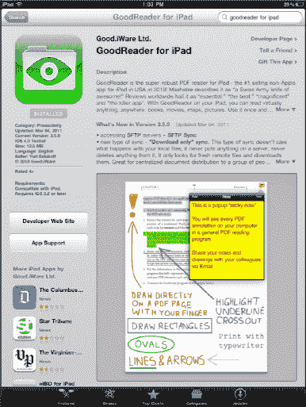

#### 将文件传输到你的 iPad

`GoodReader` 应用的一大优点是，你可以使用它将大型文件从你的 Mac 或 PC 无线传输到 iPad，以便在 `GoodReader` 应用中查看。你也可以像我们在第 3 章：“将 iPad 与 iTunes 同步”中讨论的那样，使用 `GoodReader` 在 iTunes 中进行文档共享。按照以下步骤使用 `GoodReader` 传输文件：

1.  触摸底部的 `Wi-Fi` 图标，调出 `Wi-Fi Transfer Utility`。然后系统会提示你在浏览器中输入 IP 地址，如果你使用 `Bonjour` 服务，则输入 Bonjour 地址。

    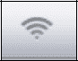

    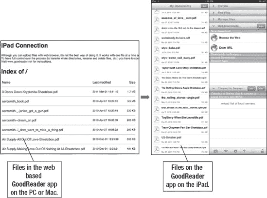

    **图 26–3**. *链接 iPad 和电脑以上传文件*

2.  将 `GoodReader` 弹出窗口中显示的地址输入到电脑的网页浏览器中。现在，你可以让你的电脑充当服务器。你会看到你的电脑和 iPad 现在已连接（参见图 26–3）。
3.  在电脑的网页浏览器中点击 `Choose File` 按钮，找到要上传到 iPad 的文件。
4.  选择文件后，点击 `Upload Selected File`，文件将自动传输到 `GoodReader` 中的 iPad 上（参见图 26–4）。

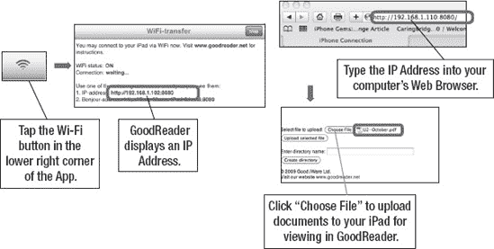

**图 26–4.** *将文件上传到你的 iPad*

为什么这很有用？嗯，对其中一位作者（加里）来说，iPad 已经成为存放超过 300 首钢琴乐谱的存储库。这意味着不再需要下载 PDF 文件、打印出来、装进活页夹，然后试图记住哪首歌在哪个活页夹里。现在，他所有的音乐都编录在 iPad 上。他只需把 iPad 放在钢琴上，就可以在一个地方访问他所有的音乐。

**注意：** 你也可以用同样的方式传输 `Word`、`Excel` 和 `PowerPoint` 文件。我们认为，使用 iTunes 中的文档传输工具可能会让这件事更简单一些（更多信息请参见第 19 章：“生产力与文件传输”）。

浏览 `GoodReader` 应用的 PDF 阅读器相当容易。快速点击屏幕中央以调出屏幕控制。然后你可以进入你的资料库，或触摸 `Turn Page` 图标来翻页。

浏览页面最简单的方式就是直接在屏幕上从右向左滑动。

你也可以向上或向下轻拂来翻页。

要转到另一个 PDF 文件或另一份乐谱，只需快速点击 iPad 屏幕中央，然后触摸左上角的 `My Documents` 按钮即可。

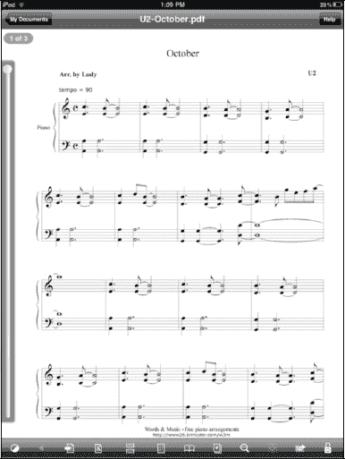

#### 使用 GoodReader 连接到 Google Docs 和其他服务器

你还可以使用 `GoodReader` 连接到 `Google Docs` 和其他服务器。请按照以下步骤操作：

1.  在 `GoodReader` 屏幕右侧的 `Connect to Servers` 标签中，点击 `Add` 按钮（参见图 26–5）。
2.  选择 `Google Docs`。你可以从多个不同的服务器中选择，包括邮件服务器、MobileMe iDisk、Public iDisk、Dropbox、box.net、FilesAnywhere.com、MyDisk.se、WebDAV 服务器和 FTP 服务器。
3.  输入你的 `Google Docs` 用户名和密码进行登录。
4.  连接成功后，一个新的 `GoogleDocs Server` 图标将出现在页面右侧的 `Connect to Server` 标签下。
5.  点击新的 `Google` 标签以连接到服务器。（需要互联网连接才能连接。）
6.  现在你将看到存储在你 `Google Docs` 中的所有文档列表。点击任意文档并选择要下载的文件类型。通常 PDF 格式效果很好。
7.  文件下载完成后，它将出现在 `GoodReader` 的左侧。只需点击该文件即可打开它。

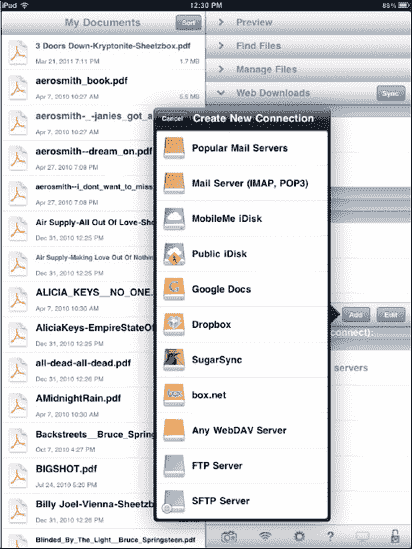

**图 26–5.** *将 `GoodReader` 连接到其他文档服务器*

## 第 27 章

## 地图

在你的 iPad 上使用地图，无论你拥有的是 3G+Wi-Fi 还是仅 Wi-Fi 型号，都非常出色。在本章中，当我们探索 `Maps` 应用的功能时，你将看到如何在地图上找到你的位置——即使你只是使用 Wi-Fi。你将学习如何在 `Classic`、`Satellite`、`Hybrid` 和 `Terrain` 视图之间切换。你还将看到，如果需要找出最佳路线，如何使用 `Maps` 查看交通和施工视图。如果你想找到离目的地最近的披萨餐厅、高尔夫球场或酒店，那也很容易。而且你可以直接从你的 iPad 使用谷歌的 `Street View` 来帮助你到达目的地。将已在地图上标记的地址添加到你的通讯录中也很容易。还有一个数字罗盘功能，非常方便，也很有趣。

