# 地图使用入门

iPad 的魅力在于其应用程序能够相互协作。您已经看到**通讯录**是如何与**地图**应用关联的。

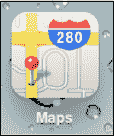

**地图**应用由移动地图技术领域的领导者——谷歌地图提供技术支持。通过**地图**，您可以定位当前位置、获取路线指引、搜索附近地点、查看实时路况等。只需轻点**地图**图标即可开始使用。

## 定位当前位置（蓝色圆点）

启动**地图**程序后，可按以下步骤将其定位至您当前的位置：

1.  轻点顶部导航栏中央的**箭头**图标。

    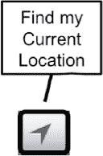

    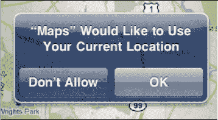

2.  地图会请求使用您当前的位置——轻触**允许**或**不允许**。我们建议选择**允许**，这样能更轻松地获取从当前位置出发或前往当前位置的路线指引。

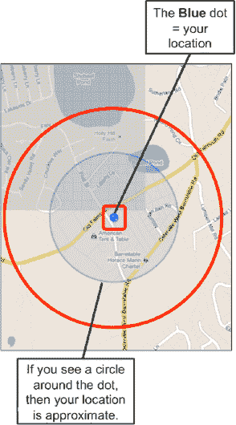

**注意：** 即使您只有支持 Wi-Fi 的 iPad，它也能找到您的近似位置。Wi-Fi 版 iPad 基于路由器位置进行定位。这通常较为准确，但如果有人将旧路由器带到了新的州，iPad 可能会认为您仍在旧位置。

## 不同地图视图

**地图**的默认视图是**经典**视图，这是一种基础地图，具有通用背景并显示街道名称。**地图**还可以显示**卫星**视图，或**卫星**与**经典**视图相结合的**混合**视图。此外，还有全新的**地形**视图，看起来像一张地形图。最后，还有一种**列表**视图，仅在您执行搜索并生成逐向路线列表时出现。您可以使用下一节中描述的步骤在所有视图之间切换。

### 切换地图视图

请按照以下步骤从一种地图视图切换到另一种：

1.  轻触地图右下角的翻起边缘。
2.  地图的一角会翻起，显示视图选项按钮，包括**交通**、**放置图钉**等（请参见图 27–1）。轻点您要切换到的视图：
    *   **经典：** 显示街道名称的常规地图（请参见图 27–2）。
    *   **卫星：** 不显示街道名称的卫星图片（请参见图 27–1）。
    *   **混合：** **卫星**与**经典**视图的组合，即带有街道名称的**卫星**视图（图 27–2）。
    *   **地形：** 显示地形（如山脉）的地形图（请参见图 27–3）。

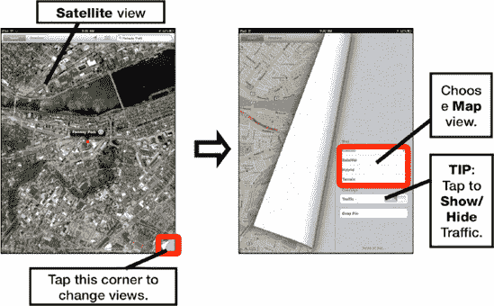

**图 27–1. *卫星* 视图以及如何切换到其他地图视图**

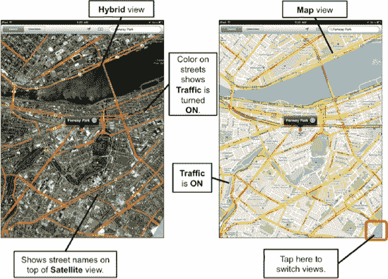

**图 27–2. 启用了交通信息的 *混合* 视图和 *经典* 视图**

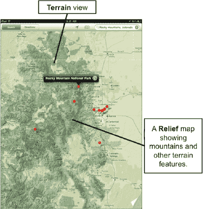

**图 27–3. *地形* 视图——科罗拉多州丹佛以西落基山脉的地形图**

如前所述，**列表**视图仅在搜索产生多个结果（如 `"pizza 32174"`）或您请求路线指引时可用，如图 27–4 所示。

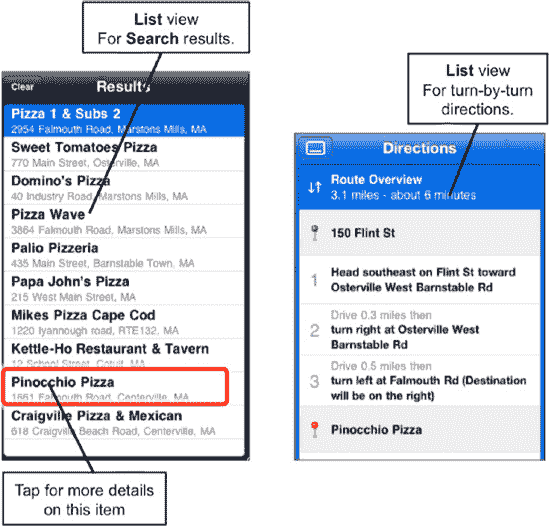

**图 27–4. 路线和搜索结果的 *列表* 视图**

### 查看交通状况

**地图**程序不仅能告诉您如何到达某地，还能沿途检查交通状况。此功能目前仅在美国提供支持。请按照以下步骤查看当地交通状况：

1.  轻触地图右下角以查看选项。
2.  将**交通**开关打开。

**提示：** 您也可以像翻书一样“翻动”页面来进入此视图。其动画效果与 **iBooks** 应用中的完全相同。

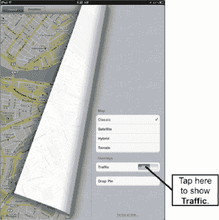

如果高速公路上出现交通状况，您通常会看到黄色灯标而非绿色灯标；有时黄色灯标可能会闪烁以提醒您交通延误。您甚至可能看到**施工工人**图标来指示施工区域。

**地图**在主要街道和高速公路上使用以下颜色来指示车辆行驶速度：

绿色 = 时速 50 英里或以上  
黄色 = 时速 25 – 50 英里  
红色 = 时速低于 25 英里  
灰色（或无颜色）= 当前无交通数据可用

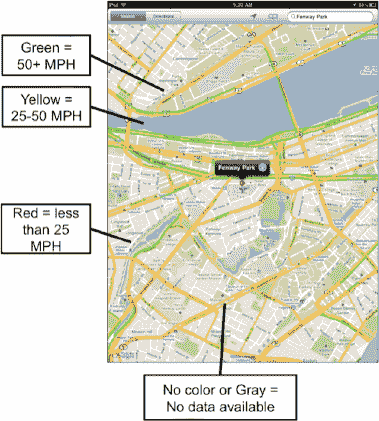

## 搜索任何内容

由于**地图**与谷歌地图相关联，您可以搜索并找到几乎任何内容：具体地址、商业类型、城市或其他兴趣点，如图 27–5 所示。请按照以下步骤查找位置：

1.  轻触屏幕右上角的**搜索**栏。
2.  输入您的地址、兴趣点，或您想在 iPad 上显示地图的城镇和州。

**谷歌地图搜索技巧**

您几乎可以在搜索栏中输入任何内容：

*   名字、姓氏或公司名称（匹配您的通讯录）
*   主街 123 号，城市（街道地址的部分或全部）
*   奥兰多机场（查找机场）
*   水管工、油漆工或屋顶工（商业名称或行业的任何部分）
*   高尔夫球场 + 城市（查找当地高尔夫球场）
*   电影院 + 城市或邮政编码（查找当地影院）
*   Pizza 32174（搜索邮政编码 32174 附近的披萨餐厅）
*   95014（美国加州苹果公司总部的邮政编码）
*   Apress Publishing

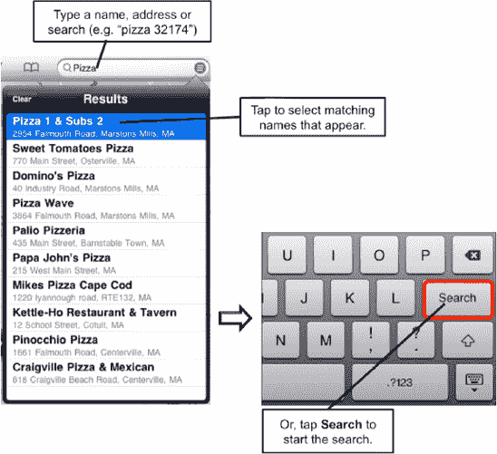

**图 27–5. *在地图应用中搜索**

要输入数字，请轻点键盘上的 **123** 键。要输入字母，请轻触 **ABC** 键切换回字母键盘。

## 地图选项

当地址显示在**地图**屏幕上后，您会看到一系列可用选项。轻触地址旁边的**蓝色信息**图标  以查看部分选项。如果您已映射了某个特定地点或联系人，您将看到图 27–6 所示的详细信息。您还可以获取路线、共享位置或添加为书签。

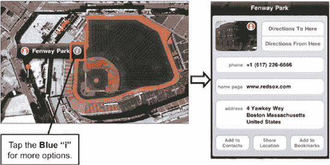

**图 27–6. *轻触蓝色信息按钮查看映射位置或联系人详情**

如果您已映射了某个地址或兴趣点，轻触**蓝色信息**按钮后会看到不同的屏幕。您会发现一个小的街景图像，以及用于获取**路线**、**添加到通讯录**、**共享位置**或**添加到书签**的按钮，如右图所示。

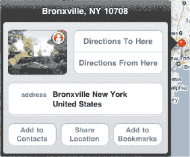

### 使用书签

在**地图**中，书签的使用方式与在 **Safari** 网页浏览器应用中非常相似。书签只是记录您访问过或映射过、并希望将来记住的地点。查看书签总是比执行新的搜索更容易。

#### 添加新书签

为某个位置添加书签是方便再次找到该地点的好方法。请按以下步骤操作：

1.  映射一个位置，如图 27–7 所示。
2.  轻触地址旁边的**蓝色信息**图标。
3.  轻触**添加到书签**。

    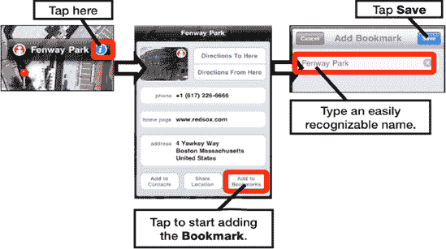

    **图 27–7. *添加书签**

4.  编辑书签名称，使其简短且易于识别——在此例中，我们将地址编辑为 *Fenway Park*。
5.  完成后，轻触右上角的**存储**。

**提示：** 您可以像在通讯录中搜索姓名一样搜索书签名称。

