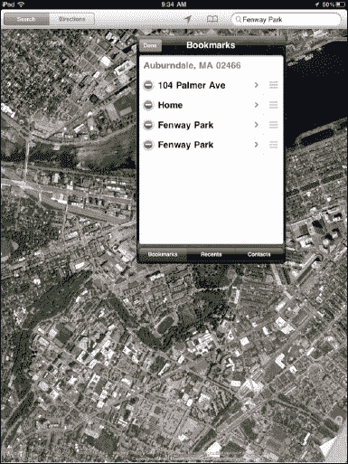
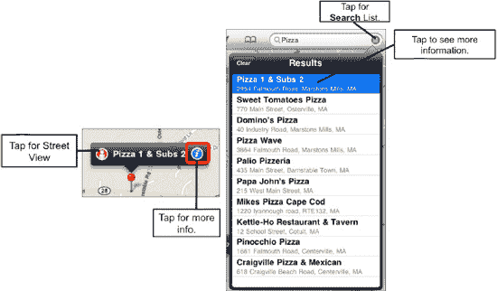
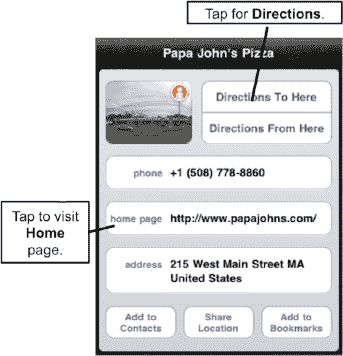
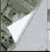
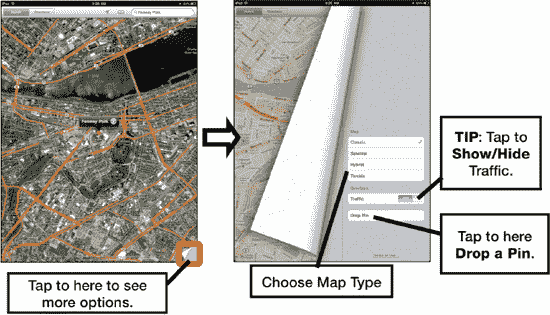
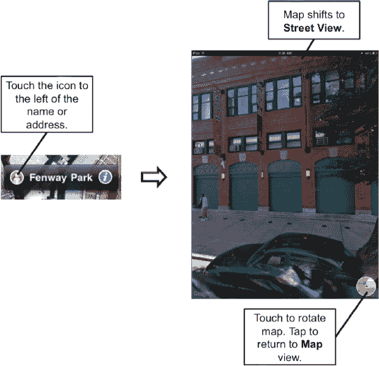

# 访问和编辑书签

要查看书签，请按以下步骤操作：

1.  轻点顶行中`搜索`窗口旁的`书签`图标。
2.  轻点任意书签即可立即跳转。
3.  轻点头部的`编辑`按钮来编辑或删除书签：
    -   要重新排列书签，请触摸并拖动每个书签的右边缘向上或向下移动。
    -   要编辑书签名称，请触摸它并重新输入名称。编辑名称后，轻点左上角的`书签`按钮返回书签列表。
    -   要删除书签，请在书签上向左或向右滑动，然后轻点`删除`按钮。
4.  完成书签编辑后，轻点`完成`按钮。

## 将地图位置添加到通讯录

将您已定位到地图上的位置添加到通讯录非常简单：

1.  在地图上定位一个地址。
2.  轻点`蓝色信息`按钮。
3.  轻点`添加到通讯录`。 
4.  轻点`创建新联系人`或`添加到现有联系人`。
5.  如果您选择`添加到现有联系人`，则可以滚动或搜索您的联系人并选择一个名字。该地址将自动添加到该联系人中。

## 搜索您周围的事物（商店、餐厅、酒店、电影及其他）

按以下步骤搜索您当前位置附近的事物：

1.  在地图上定位一个位置，或使用`蓝点`图标标记您当前的位置。
2.  轻点`搜索`窗口。假设我们想搜索最近的披萨店。输入“pizza”即可在地图上定位所有当地的披萨店。

    

3.  请注意，每个定位到的地点左侧可能有一个`街景`图标，右侧有一个`蓝色信息`图标。

    

4.  如果您想放大或缩小，您可以张开或捏合屏幕，或者双击屏幕。
5.  与任何已定位的地点一样，当您触摸`蓝色信息`图标时，可以查看所有详细信息，例如披萨店的电话号码、地址和网站。
6.  如果您想要前往该餐厅的路线，只需触摸`路线到这里`，系统会立即计算出一条路线。

**注意：** 如果您触摸`主页`链接，您将退出`地图`应用并启动`Safari`。之后，您需要在完成浏览后重新启动`地图`应用。

## 放大和缩小

您可以通过双击和捏合这两种熟悉的方式来放大和缩小。要双击放大，只需像在网页或图片上那样双击屏幕即可。

## 放置大头针

假设您正在查看地图，并且发现了某个位置，希望将其设为书签或目的地。

在本例中，我们正在放大查看波士顿市区。我们偶然发现了芬威公园，并决定将其添加到书签中会很好，因此我们在它上面放置了一个大头针，如图 27-8 所示：

1.  定位一个地点或将地图移动到你想要放置大头针的位置。
2.  轻点地图的右下角。 
3.  轻点`放置大头针`。
4.  现在，触摸并按住大头针在地图上拖动。在本示例中，我们将其直接移动到芬威公园上。

**图 27-8.** *如何放置大头针*

**提示：** 如何找到地图上任何位置的街道地址？

当您`放置大头针`时，谷歌地图会显示实际的街道地址。如果您通过查看`卫星`、`混合`或`地形`视图找到了某个位置，但需要获取实际街道地址，这会非常方便。

放置大头针也是记录您停车位置的好方法——在陌生地点（尤其是使用 iPad 3G 时）非常有用。

## 使用街景

在 iPad 的`地图`应用中，谷歌的`街景`（图 27-9）真的很有趣。谷歌一直在努力拍摄美国及其他地区几乎每个地址的照片。这些照片随后被输入其数据库，当您想要查看目的地或航点图片时，显示的就是这些内容。

**注意：** 谷歌的`街景`正在走出美国国门。全球多个主要城市现在已被绘制在地图上。

如果有可用的街景，您会在地图上的地址或书签左侧看到一个小的图标——一个`橙色小人`图标。

在本例中，加里想查看他的红袜队圣地——芬威公园的街景：

1.  在此场景下，为地址定位时，我们轻点了通讯录列表中芬威公园下的工作地址。我们也可以通过在海搜窗口中输入地址、搜索某种类型的商家或触摸`通讯录`应用中的地址来实现定位。
2.  名称左侧是`街景`图标。
3.  我们轻点该图标，立即切换到该地址的街景视图。
4.  非常酷的一点是，我们可以通过向左、向右甚至向上或向下滑动，在屏幕上以 360 度旋转导航——这让我们能够查看目的地旁边和街对面的地方。

要返回地图，只需触摸屏幕的右下角。

**图 27-9.** *使用谷歌的`街景`*

