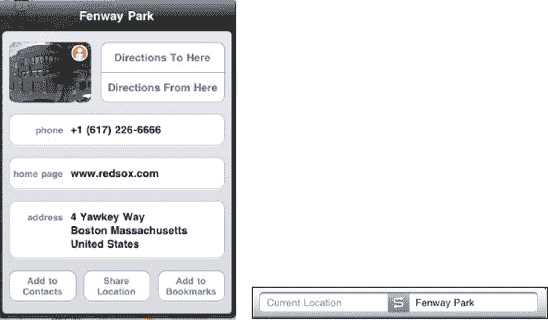
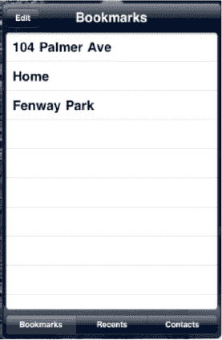
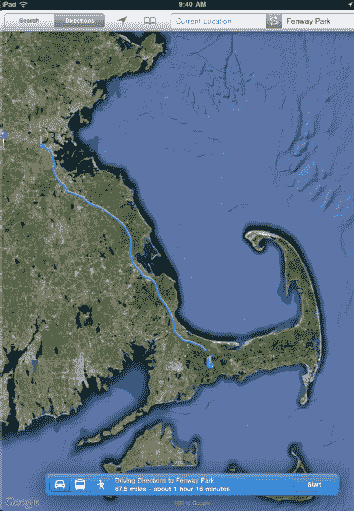

# 获取路线

`地图`程序最有用的功能之一是，我们可以轻松找到前往或来自任何地点的路线。假设我们想使用当前位置，获取从格洛丽亚的商店到波士顿芬威公园的路线。

## 先轻点“当前位置”按钮

要查找前往或来自您当前位置的路线，您无需浪费时间输入当前地址——只需轻点顶部信息栏中央的“当前位置”按钮  来定位自己即可。您可能需要重复此步骤几次，直到屏幕上出现`蓝点`图标。

现在，您可以执行以下两项操作之一：

-   轻点顶部信息栏左端的`路线`按钮。
-   或者，您可以像之前讨论的那样触摸`蓝色信息`图标，然后选择`路线到这里`（参见图 27-10）。除非您另行指定，否则`地图`将根据您当前的位置计算到目的地的路线。

**图 27-10.** *选择`路线到这里`，`地图`将为您规划行程。*

## 选择起点或终点

我们可以按照以下步骤为给定路线选择起点或终点：

1.  如果目的地在我们的`书签`中，我们可以触摸`书签`图标。
2.  接着，我们选择已添加书签的位置。
3.  我们可以轻点`书签`、`最近查找`或`通讯录`来查找目的地。
4.  在此情况下，我们轻点`书签`。
5.  最后，我们轻点`芬威公园`。

    

    **注意：** 一旦您触摸`从此处出发`按钮，您最近的搜索将被自动显示，如图 27-10 所示。您也可以触摸`目的地`框  并输入一个目的地。

6.  从`书签`中选择芬威公园后，路线规划屏幕会将我们带到一个概览屏幕。
7.  在起点位置放置一个`绿色图钉`图标，在终点位置（本例中为芬威公园）放置一个`红色图钉`图标。

