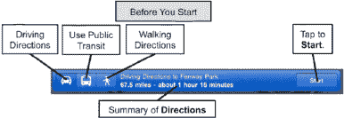
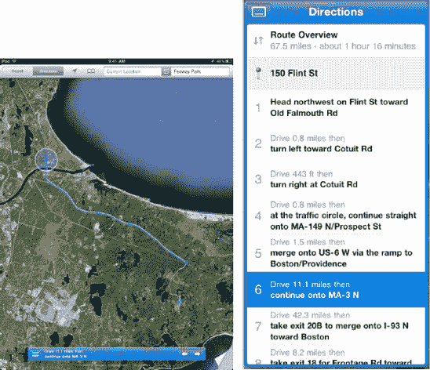

# 查看路线

在开始行程之前，您会在屏幕右下角看到一个`开始`按钮。轻点`开始`按钮，路线导航就会开始。`开始`按钮会变为`箭头`按钮，让您能够在行程中的各个步骤之间切换。

如图 27–11 所示，您既可以将路线视为地图上的一条路径，也可以将其视为一个列表。

**图 27–11.** *查看路线的两种方式*

您可以用手指移动屏幕来查看路线，或者只需点击底部的`箭头`图标 ，即可逐步查看路线快照。

您也可以轻点`列表`  按钮，它会显示详细的分步路线。

