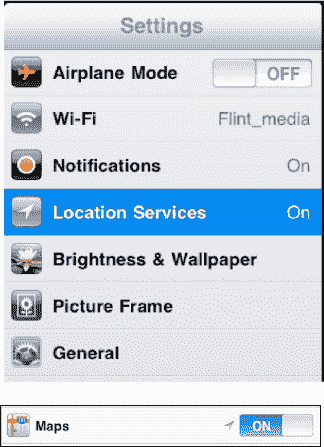

# 地图设置

目前，唯一影响`地图`应用的设置是`定位服务`，它对确定您的当前位置至关重要。请按照以下步骤调整这些设置：

1.  轻点`设置`图标。

    

2.  现在找到`定位服务`选项卡并轻点它。将`定位服务`开关拨到`开`位置。
3.  确保`地图`旁边的开关也设置为`开`位置，这样`地图`就能估算您的位置。

**注意：** 将`定位服务`开关保持为`开`会略微缩短电池续航时间。如果您从不使用`地图`应用或不关心您的位置，请将其设置为`关`以节省电池电量。

