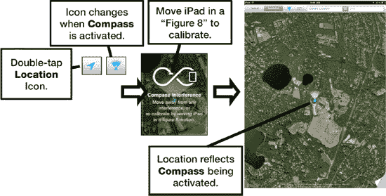

# 使用数字指南针

iPad 内置了一个非常酷的数字指南针功能。当您需要确定方位并找出哪边是北时，它会很有帮助。

## 校准和使用数字指南针

在使用数字指南针之前，您需要对其进行校准。通常仅在首次使用时需要校准。请按照以下步骤操作：

1.  像平时一样启动`地图`。
2.  轻点`当前位置`箭头两次——它会从  变为 。
3.  您会看到屏幕上出现一个小的数字指南针，如图 图 27–13 所示。
4.  首次使用数字指南针时，屏幕上会出现校准符号。 
5.  按照屏幕上的提示，以“8”字形移动您的 iPad。

    **注意：** 在校准过程中，iPad 可能会要求您远离任何干扰源。

6.  将 iPad 与地面保持水平。如果校准成功，指南针将会旋转并指向北方。

**图 27–13.** *使用数字指南针*

