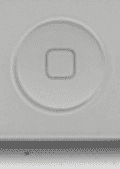
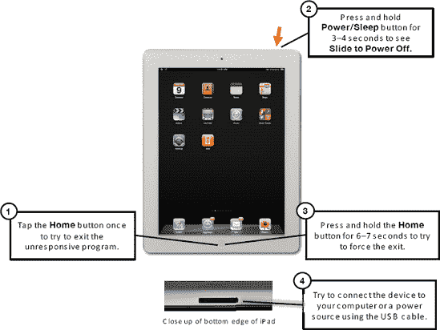
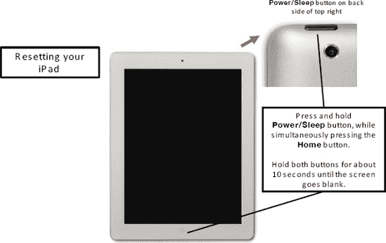

# 第 28 章

## 故障排除

iPad 通常高度可靠。但偶尔，就像您的电脑或任何复杂的电子设备一样，您可能需要重置设备或解决某个问题。在本章中，我们将为您提供一些有用的工具，帮助您尽快让 iPad 恢复正常运行。我们从一些基本的快速故障排除开始，然后在后面的“高级故障排除”部分深入介绍更复杂的问题和解决方法。

我们还会涉及一些与 iPad 相关的其他零散问题，并为您提供一个资源列表，您可以在其中找到有关 iPad 的更多帮助。

### 基本故障排除

我们首先介绍一些让您的 iPad 恢复正常运行的基本技巧与窍门。

#### 如果 iPad 停止响应该怎么办

有时，您的 iPad 会对触摸没有反应——它会在某个程序中卡住。如果发生这种情况，请按顺序尝试以下步骤，看看 iPad 是否会开始响应（参见 图 28–1）。

1.  按下`主屏幕`按钮，看看是否能退出到`主屏幕`。

    

2.  如果某个特定应用导致了问题，请尝试双击`主屏幕`按钮以打开`应用切换器`栏。然后按住`应用切换器`栏中的*任意*图标，直到它们都开始晃动并且图标左上角出现一个带有减号的红色圆圈。轻点`红色圆圈`图标以关闭该应用。
3.  如果 iPad 仍然没有响应，请尝试按下`睡眠/唤醒`键，直到看到`滑动来关机`。然后按住`主屏幕`按钮，直到您返回到`主屏幕`——这应该会退出程序。
4.  确保您的 iPad 电量没有耗尽。尝试为其充电或连接到电脑（如果已连接），看看它是否会开始响应。
5.  如果按住`主屏幕`按钮不起作用，您需要尝试按住`电源/睡眠`按钮三到四秒钟来关闭 iPad。然后，滑动屏幕顶部的`滑动来关机`滑块。如果您无法关闭 iPad，请参阅下方关于如何重置 iPad 的说明。
6.  关闭 iPad 后，等待大约一分钟，然后按住同一个`电源`按钮几秒钟以开启 iPad。
7.  您应该会看到屏幕上出现 Apple 标志。等待 iPad 启动完成，您应该就能访问您的程序和数据了。

**图 28–1.** *基本故障排除步骤*

如果这些步骤不起作用，您将需要重置您的 iPad。

#### 如何强制重启您的 iPad

在 iPad 没有响应时，重置是您的最后选择。这是完全安全的，而且通常能解决许多类型的问题（参见 图 28–2）。

**图 28–2.** *重置您的 iPad*

请按照以下步骤强制重启您的 iPad：

1.  用双手同时按住`主屏幕`按钮和`电源/睡眠`按钮。
2.  同时按住这两个按钮大约八到十秒钟。您会看到`滑动来关机`滑块。忽略它，并继续按住两个按钮，直到屏幕变黑。
3.  再过几秒钟，您应该会看到 Apple 标志出现。看到标志后，松开按钮，您的 iPad 就会重置。

