# 如何软重置你的 iPad

你可以在**“设置”**应用中重置多项内容，从**主屏幕**布局、网络设置，到设备上的所有数据。请按照以下步骤执行软重置操作：

1.  轻点**“设置”**图标。
2.  轻点左栏中的**“通用”**。
3.  轻点右栏底部的**“传输或还原 iPad”**。
4.  轻点**“还原所有设置”**，可重置网络、键盘、主屏幕布局和定位提醒。在弹出窗口中轻点**“还原”**进行确认。
5.  轻点**“抹掉所有内容和设置”**，可将 iPad 上的所有内容彻底抹除。然后在弹出窗口中轻点**“抹掉”**以确认此操作。

    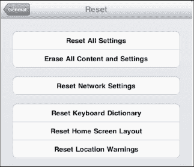

6.  轻点**“还原网络设置”**，以清除所有 Wi-Fi（及 3G）网络设置。
7.  轻点**“还原键盘词典”**，以还原拼写词典。
8.  轻点**“还原主屏幕布局”**，以恢复出厂布局；即你第一次拿到 iPad 时设备的状态。
9.  轻点**“还原定位提醒”**，以重置你收到的关于允许应用使用你当前位置的警告信息。

**注意：** 如果仍然无法让你的 iPad 正常工作，请尝试使用本章后面“设备固件更新（DFU）模式”部分中描述的步骤。

## 播放音乐或视频时没有声音

没有什么比满心期待地听音乐或看视频，却发现 iPad 发不出任何声音更令人沮丧的了。通常，这个问题有一个简单的解决方法：

1.  使用 iPad 右上边缘的**“音量+”**键检查音量。你可能不小心把音量调到了最低或开启了静音。
2.  如果你使用的是有线耳机，请拔下耳机再重新插入。有时候，耳机插孔可能没有连接好。
3.  如果你使用的是无线蓝牙耳机或蓝牙音响系统，请尝试以下步骤：

    1.  检查音量设置（如果耳机或音响上可用）。
    2.  检查确认蓝牙设备已连接。进入**“设置”**图标。轻点左栏中的**“通用”**和右栏中的**“蓝牙”**。确认能看到你的设备已列出，并且其状态为**“已连接”**。如果未连接，则轻点它并按照说明与 iPad 配对。

    **注意：** 有时候你可能实际上连接到了一个蓝牙设备却不自知。如果连接到了蓝牙音响设备，iPad 本身就不会发出声音。

4.  确保歌曲或视频没有处于**“暂停”**模式。
5.  双击**主屏幕**按钮调出音乐或视频控制项，然后向右滑动以查看底部的音乐或视频控制项（如右图所示）。调出控制项后，确认歌曲没有暂停，并且音量没有调到最低，如此处所示。
6.  查看**“设置”**图标，检查你是否（或其他人）在 iPad 上设置了**“音量限制”**：

    1.  轻点**“设置”**图标。
    2.  轻点左栏中的**“iPod”**。
    3.  查看**“音量限制”**是否为**“开启”**。轻点**“音量限制”**以检查设置级别。如果限制是解锁状态，直接滑动滑块将音量调高即可。如果已锁定，你需要先轻点**“解锁音量限制”**按钮并输入四位数字密码才能解锁（请参见图 28-3）。

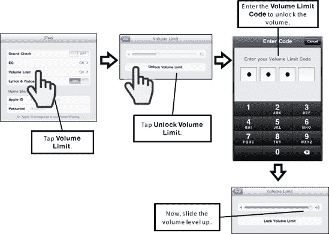

**图 28-3.** *在**设置**中检查音量限制*

如果以上步骤均无效，请查看本章后面的“其他故障排除和帮助资源”部分。如果仍然无效，请尝试使用本章“从备份恢复 iPad”部分中描述的步骤，从备份文件恢复你的 iPad。最后，如果还是不行，请联系销售你 iPad 的商店或企业寻求帮助。

## 无法从 iTunes 或 App Store 购买项目

你刚入手了这款炫酷的新设备，于是前往 iTunes Store 或 App Store 购物，却收到了错误信息或发现不允许购买。请按照以下步骤尝试解决此问题：

1.  两个商店都需要有效的互联网连接。确保你有 Wi-Fi 连接或蜂窝数据连接。关于连接设置请参见第 4 章：“Wi-Fi 与 3G 连接”。
2.  确认你拥有有效的 iTunes 账户。我们在第 26 章：“iTunes 用户附加指南”的“创建 iTunes 账户”部分中，介绍了如何设置一个新的 iTunes 账户。

**注意：** 如果你正在 iPad 尚未销售的国家/地区旅行，那么你的设备上可能没有 App Store 或**iTunes**应用。如果是这种情况，你需要使用电脑上的**iTunes**购买项目，然后再同步到 iPad 上。

## 高级故障排除

现在，我们将深入探讨一些更高级的故障排除步骤。

### 设备固件更新（DFU）模式

当先前描述的所有其他步骤都无法让 iPad 重新正常工作时，最后的手段是让 iPad 进入**设备固件更新（DFU）**模式，并使用 iTunes 恢复你的数据。这些步骤来源于 iPhone、iPad 和 iPod touch 博客（`www.tipb.com`）。

让 iPad 进入**DFU**模式可能需要尝试几次；这相当有难度。完成此操作后，你需要使用**iTunes**从最近的 iPad 备份中恢复你的数据：

1.  将你的 iPad 连接到 Mac 或 Windows PC，并确保**iTunes**正在运行。
2.  同时按住**电源/睡眠**按钮（设备顶部）和**主屏幕**按钮（屏幕正下方的前部）。
3.  按住这两个按钮大约 10 秒。（如果你看到了 Apple 标志，说明你按的时间太长了，需要重新开始。）
4.  松开**电源/睡眠**按钮，但继续按住**主屏幕**按钮大约 5 秒。（如果你看到了**“连接到 iTunes”**屏幕，说明你按的时间太长了，需要重新开始。）
5.  如果屏幕保持黑屏，那就对了！你的 iPad 现在应该处于**DFU**模式。
6.  现在，**iTunes**应该会提示它已检测到你的设备处于**恢复**模式，并且需要恢复。
7.  按照说明恢复你的设备。我们在本章后面的“恢复 iPad 操作系统”部分提供了更多详细信息。

### iPad 物理损坏（Apple Care 与替代方案）

如果你不小心损坏了 iPad——比如进水、摔落、屏幕破裂、外壳凹陷或其他损坏——你可能会认为 Apple Care 延保计划能够覆盖此类损失。但事实并非如此。

**警告：** Apple Care 延保计划不覆盖意外损坏（例如，进水、屏幕破碎、摔落、凹陷等）。

有一些可用的替代保修方案。如果你从百思买这样的主要零售商处购买 iPad，可以购买覆盖意外损坏的延保计划。然而，这些零售商的保修可能相当昂贵。我们找到了一个价格更实惠且仍覆盖意外损坏的保修计划。这个计划来自 SquareTrade（`www.squaretrade.com`）；在本书出版时，两年保修的售价约为 95 美元。

如果你不想购买延保计划，那么可以通过网络搜索寻找 iPad 维修店。网上有多种选择，并且它们经常变化。在网上做一些研究，找到一家看起来信誉良好且拥有可靠客户评价的维修店。

**提示：** 致电 iPad 维修店，详细咨询他们针对你具体损坏情况的保修政策，以及由谁承担运费。同时询问如果他们无法修复 iPad 会如何处理。

#### 使用您的 iTunes 账户重新注册

每台 iPad 都与一个 iTunes 账户相关联或绑定。这种关联使您能够使用 iPad 购买 iTunes 音乐、视频以及应用程序。也正是这种关联，让您能够从计算机上播放 `iTunes` 账户中的音乐并在 iPad 上收听。

有时，您的 iPad 可能会“丢失”与 `iTunes` 服务的注册信息和连接。通常，这个问题很容易解决。只需通过 USB 线将 iPad 连接到计算机，`iTunes` 应用就会引导您完成将 iPad 与 `iTunes` 账户重新关联的流程。我们将在第 1 章：“入门指南”中展示如何执行此操作的详细步骤。

如果您在通过 iTunes 注册 iPad 时遇到问题，苹果公司提供了一个在线资源，您可以通过计算机或 iPad 的网络浏览器访问。

您可以通过以下网址访问该站点：

[`https://register.apple.com/cgi-bin/WebObjects/GlobaliReg.woa`](https://register.apple.com/cgi-bin/webobjects/globalireg.woa)

您应该会看到一个类似于图 28–4 所示的屏幕。

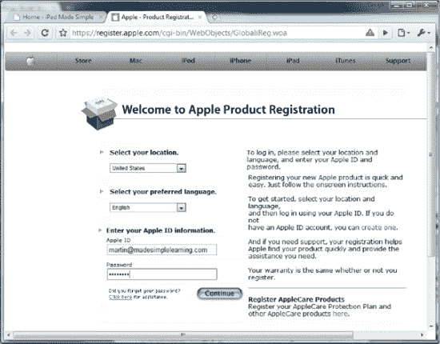

**图 28–4.** *来自苹果登录页面的在线注册网站*

访问苹果在线注册网站后，请遵循以下步骤：

1.  填写信息，输入您的 Apple ID 和密码，然后点击**继续**。
2.  选择您要注册**一件产品**还是**多件产品**。在本例中，我们选择了**一件产品**（参见图 28–5）。

    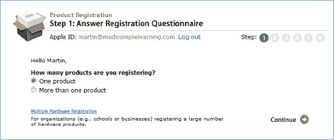

    **图 28–5.** *苹果在线注册网站上的步骤 1*

3.  现在，选择类别、产品系列和产品。在本例中，我们选择了 **iPad** 类别、**iPad** 产品系列和 **iPad Wi-Fi**。这使我们一次性完成了步骤 2-4（参见图 28–6）。

    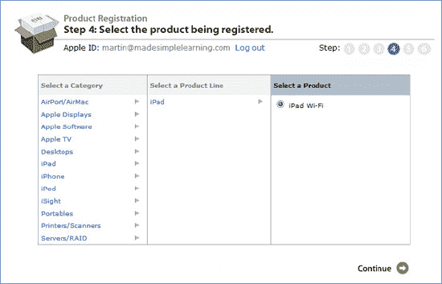

    **图 28–6.** *苹果在线注册网站上的步骤 2-4*

4.  现在，您需要输入 iPad 序列号以及其他有关您将如何使用 iPad 的信息。

    **提示：** 要查找序列号，请将 iPad 连接到计算机并加载 `iTunes` 应用。在左侧导航栏中点击您的 iPad，然后在顶部导航栏中点击**摘要**。序列号位于**摘要**屏幕的顶部（参见图 28–7）。

    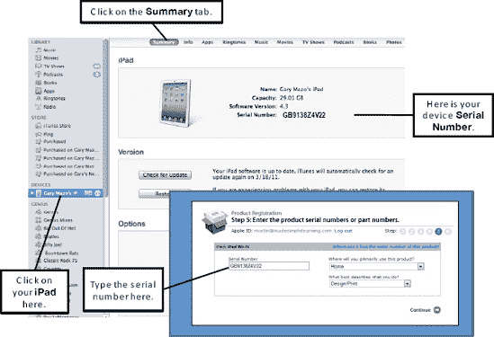

    **图 28–7.** *在 `iTunes` 中定位您的 iPad 序列号及苹果在线注册网站上的步骤 5*

5.  现在点击**继续**，您应该已成功注册 iPad。

### iPad 未显示在 iTunes 中

有时，当您将 iPad 连接到 PC 或 Mac 时，您的 iPad 可能无法在 `iTunes` 屏幕中被识别。

在第一个屏幕中——这是您应该看到的——您的 iPad 会列在“设备”下（参见图 28–8）。在第二个屏幕截图中，您会注意到即使 iPad 已连接到计算机，也没有显示任何设备。

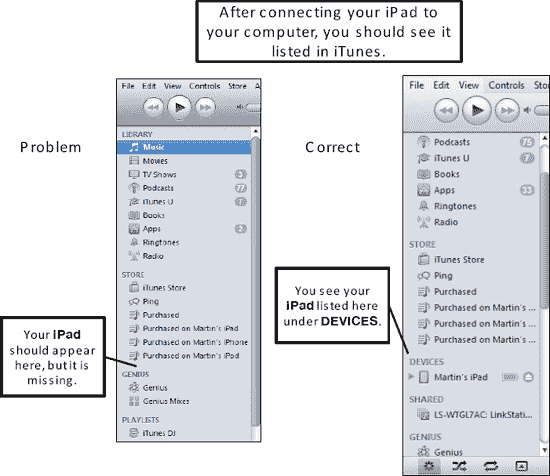

**图 28–8.** *验证您的 iPad 在连接到计算机时是否列于 `iTunes` 的左侧导航栏中*

如果未看到您的设备列出，请遵循以下步骤：

1.  通过查看**主屏幕**右上角的电池电量来检查 iPad 的电池电量。如果电池电量耗尽太多，`iTunes` 需要等到电池电量稍微回升后才能检测到它。
2.  如果电池已充电，请尝试将 iPad 连接到计算机上的另一个 USB 端口。有时，如果您一直使用某个 USB 端口连接 iPad，而换到另一个端口，计算机可能无法识别。
3.  如果这仍然无法解决问题，请尝试断开 iPad 并重新启动计算机。然后，将 iPad 重新连接到 USB 端口。
4.  如果这仍然不起作用，请下载 `iTunes` 的最新更新，或者完全卸载并重新在计算机上安装 `iTunes`。如果您选择此选项，请确保备份 `iTunes` 中的所有信息。
5.  我们在第 26 章：“附赠 iTunes 用户指南”的“升级 iTunes”部分中，包含了如何升级到最新版本 `iTunes` 的详细步骤。

### 同步问题

有时，您在将 iPad 与计算机（PC 或 Mac）同步时可能会遇到错误。请遵循以下步骤尝试解决此类问题：

1.  首先，请遵循我们在“iPad 未显示在 iTunes 中”部分中概述的所有步骤。
2.  如果 iPad 仍然无法同步，但您能在 `iTunes` 的左侧导航栏中看到它，请返回第 3 章：“将 iPad 与 iTunes 同步”并非常仔细地检查您的同步设置。

#### 解决 Apple Mobile Me 或 Microsoft Exchange 问题

Microsoft Exchange 是通常由企业管理员设置的推送式电子邮件和内容服务器。`Mobile Me` 是苹果公司自己的无线同步程序（需付费）供您设置。此程序将保持您的信息无线同步。但是，如果您使用 `Mobile Me` 或 Exchange 同步个人信息，则无法通过 `iTunes` 同步这些信息。

在您的 iPad 上，前往**设置**图标，然后在左侧栏中点击**邮件、通讯录、日历**。

如果设置了 `Mobile Me` 或 Exchange，它将显示在右侧栏顶部的**账户**列表中。如果在列表中未看到其中任何一个，则说明您未使用它们同步 iPad。

如果您确实看到了这些项目之一，请点击该账户，然后取消勾选您希望改为通过 `iTunes` 同步的任何类别或项目。

现在，当您返回 `iTunes` 时，这些类别应会作为 Microsoft 同步选项显示。

**注意：** 如果您在 Mobile Me 或 Exchange 账户中取消勾选或取消选择**日历**或**通讯录**，则在通过 `iTunes` 从计算机设置同步之前，您将无法在 iPad 上看到这些信息（参见第 3 章：“将 iPad 与 iTunes 同步”）。

### 重新安装 iPad 操作系统（可选择是否恢复数据）

有时，你需要对 iPad 操作系统执行一次全新安装，才能让 iPad 恢复正常并顺畅运行。

**提示**：此过程与使用新版本操作系统更新 iPad 的过程基本相同。

在此过程中，你将面临三个选择：

1.  如果你想将 iPad 恢复到包含所有数据的正常状态，则必须使用 `iTunes` 的“恢复”功能。
2.  如果你打算从零开始，并将 iPad 绑定到一个 `iTunes` 账户，则应在该过程结束时使用“设置新的 iPad”功能。
3.  如果你打算赠送或出售你的 iPad，那么在该过程结束时（在执行恢复或新设置之前），只需从 `iTunes` 中弹出 iPad 即可。

**注意：** 此“恢复过程”将完全清除你的 iPad。你需要重新同步并重新安装所有应用程序，并重新输入你的账户信息，例如电子邮件账户的详细信息。此过程可能需要 30 分钟或更长时间，具体取决于你同步到 iPad 的信息量。

按照以下步骤重新安装 iPad 操作系统软件，并可以选择从以前的备份中恢复数据到你的 iPad：

1.  将 iPad 连接到电脑并启动 `iTunes`。
2.  在左侧导航栏的 `DEVICES`（设备）类别中，点击你的 **iPad**。
3.  点击顶部导航栏中的 **Summary**（摘要）。
4.  现在你将看到 iPad 的 **Information**（信息）屏幕。点击屏幕中间的 **Restore**（恢复）按钮（参见图 28-9）。

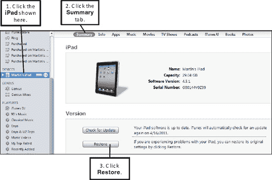

**图 28-9.** *连接你的 iPad 并在 `iTunes` 的 **Summary**（摘要）屏幕中点击 **Restore**（恢复）按钮*

5.  系统可能会询问你是否要备份你的 iPad。为安全起见，请点击 **Backup**（备份）。
6.  随后你可能会收到警告，提示所有数据将被擦除。点击 **Restore**（恢复）继续（参见图 28-10）。

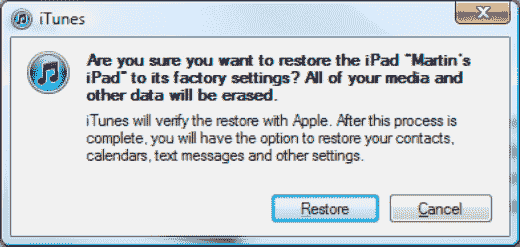

**图 28-10.** *在 `iTunes` 中恢复之前进行备份*

7.  现在你将看到一个 **iPad Software Update**（iPad 软件更新）屏幕。点击 **Next** （下一步）继续。
8.  接下来，你将看到 **Software License Agreement**（软件许可协议）屏幕。点击 **Agree**（同意）继续并启动该过程。
9.  现在，`iTunes` 将下载最新的 iPad 软件，备份并同步你的 iPad，然后完全重新安装 iPad 软件。此过程将擦除所有数据，并将你的 iPad 恢复到原始“干净”状态。你将在 `iTunes` 顶部看到状态消息，类似于图 28-11 所示。

**图 28-11.** *软件更新/恢复过程：`iTunes` 顶部的状态窗口*

10. 在备份并同步你的 iPad 后，其屏幕将变黑。苹果标志会出现，你会在标志下方看到一个进度条。最后，`iTunes` 中会弹出一个小的弹出窗口，告知你更新过程已完成。点击 **OK**（确定）即可进入 **Set Up your iPad**（设置你的 iPad）屏幕（参见图 28-13）：

    -   如果你想保持 iPad 干净（即不含任何个人数据），请选择第一个选项 **Setup as a new iPad**（设置为新的 iPad）。如果你正在为其他人设置此 iPad（你需要此人的 Apple ID 和密码），可能会用到此选项。
    -   如果你要赠送或出售你的 iPad，只需点击 iPad 旁边的 **Eject**（弹出）图标即可完成（参见图 28-12）。

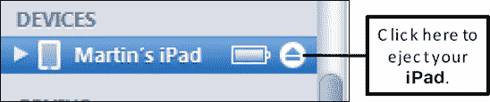

**图 28-12.** *如果赠送或出售 iPad，则将其弹出*

    -   选择 **Restore from the backup of:**（从...的备份中恢复：）并确认下拉选项设置为正确的设备。

11. 最后，点击 **Continue**（继续）（参见图 28-13）。

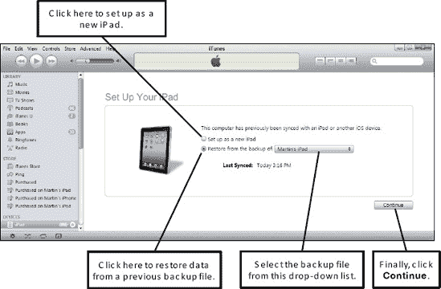

**图 28-13.** *将设备设置为新的 iPad 或从备份文件恢复*

12. 如果选择恢复，稍后你将在 iPad 上看到一个 **Restore in Progress**（恢复进行中）屏幕，并在 `iTunes` 中看到一个状态窗口，显示“正在从备份恢复 iPad...”。此屏幕还会显示预计时间。
13. 接下来，你将看到一个小弹出窗口，显示“你的 iPad 设置已恢复”。几秒钟后，你将看到你的 iPad 出现在 `iTunes` 中 `DEVICES`（设备）下方的左侧导航栏里：

    -   如果你与 `iTunes` 同步信息，所有数据现在都将同步。
    -   如果你使用 `MobileMe`、Exchange 或其他同步过程，你可能需要在 iPad 上重新输入密码才能让这些同步过程重新启动并运行。

### 其他故障排除和帮助资源

有时，你可能会遇到本书中找不到答案的特定问题或疑问。在接下来的部分中，我们提供了一些你可以从 iPad 本身以及电脑的网页浏览器访问的好资源。iPad 设备上的用户指南易于浏览，可能能为你快速提供所需信息。如果你面临一个特别难以解决的故障排除问题，苹果知识库会很有帮助。与 iPhone/iPad 相关的网络博客和论坛也是寻找答案甚至提出你遇到的独特问题的好地方。

#### iPad 设备上的用户指南

打开你的 `Safari` 网页浏览器以查看 iPad 的在线用户指南：

1.  在输入网址的地方旁边，点击 **Bookmarks**（书签）按钮。
2.  选择 **iPad User Guide**（iPad 用户指南）。

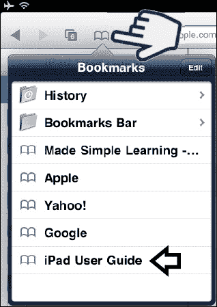

如果你没有看到该书签，请在你的 iPad 上的 `Safari` 地址栏中输入：

`help.apple.com/ipad`

**提示：** 要查看电脑上的 PDF 格式手册，请访问 [`http://help.apple.com/ipad/4/interface/`](http://help.apple.com/ipad/4/interface/)。

进入 iPad 上的指南后，你应该会看到一个类似于图 28-14 所示的屏幕。

好处是你已经知道如何在指南中导航。点击左侧栏中的任何主题，即可在右侧栏中显示该主题。

阅读该主题或点击右侧栏中的另一个链接以了解更多信息。

点击右侧栏顶部的按钮可返回上一级。

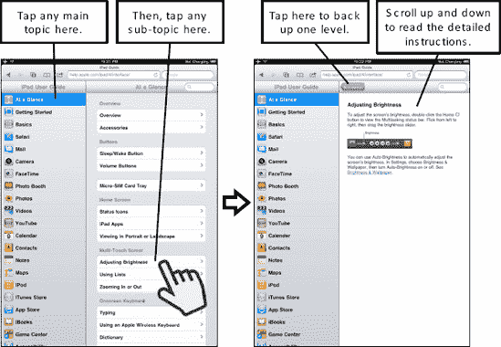

**图 28-14.** *在你的 iPad 上通过 `Safari` 使用 iPad 手册*

#### 查阅苹果知识库以获取有用的文章

在你的 iPad 或电脑的网页浏览器中，访问以下网页：

[`http://www.apple.com/support/ipad/`](http://www.apple.com/support/ipad/)

接下来，点击左侧导航栏中的一个主题（参见图 25-15）。

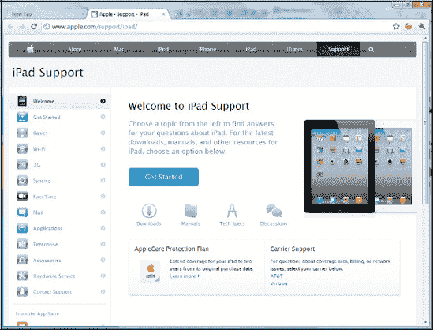

**图 28-15.** *iPad 的苹果知识库网站*

#### iPad 相关博客

拥有 `iPad` 的一大好处是，您会立刻成为全球 `iPad` 用户大家庭的一员。

许多 `iPad` 用户可归类为“发烧友”，并且是众多 `iPad` 用户群组中的一员。这些用户群组，连同各种论坛和网站，为 `iPad` 用户提供了极好的资源。

其中许多资源可以直接在您的 `iPad` 上获取，而另一些则是您可能想在电脑上访问的网站。

有时，您可能想与其他 `iPad` 爱好者交流、提出技术问题，或者了解最新、最劲爆的传言。博客是进行这些活动的好地方。

以下是一些流行的 `iPad`（以及 `iPhone` 或 `iPod touch`）博客：

*   [`www.tipb.com`](http://www.tipb.com)
*   [`www.iphonefreak.com`](http://www.iphonefreak.com)
*   [`www.gizmodo.com`](http://www.gizmodo.com)（`iPad` 专区）

**提示：** 在上述任何博客上发布新问题之前，请先在博客中搜索，确保您的问题尚未被提问和回答过。同时，请确保您将问题发布在博客的合适板块（例如，`iPad`）。否则，您可能会因不事先“做功课”而招致社区成员的愤怒！

此外，您也可以在网上搜索“iPad 博客”或“iPad 新闻与评论”，以找到更多博客。

## 第四部分

## iPad 2 的灵魂伴侣：iTunes…

您的 `iPad 2` 与 Apple 的电子商务中心 `iTunes` 密不可分。`iTunes` 不仅是您购买音乐、视频和应用程序的地方，也是您整理可在 `iPad 2` 上使用的所有精彩内容的地方。使用 `iTunes` 中全新的 `Ping` 社交网络功能，随时了解您最喜爱的艺术家和朋友们的音乐品味。您甚至可以使用 `Ping` 与朋友会面，并为即将到来的音乐会购买门票。学习如何购买激动人心的新内容——甚至如何免费找到它们。通过 `iTunes U` 学习新知识，或者使用 `Genius 混曲` 功能为您的音乐库带来全新感受。我们甚至会教您如何利用 `iTunes` 的“家庭共享”功能省钱，该功能现在也适用于您的 `iPad`！

## 第 29 章

## 您的 iTunes 用户指南

在本章中，我们将向您展示如何使用 `iTunes` 进行几乎所有您可能想要进行的操作。我们涵盖了带有名为 `Ping` 的新酷社交网络功能的 `iTunes` 10 版本（参见图 29–1）。我们将帮助您安装和更新 `iTunes`，然后带您进行一次导览。我们还将描述用于整理和查看您的音乐与视频的所有绝佳方法，以及如何为您将它们传输到 `iPad` 做好准备。

在出版时，`iTunes` 应用程序的最新版本是 10.2.1.1。当您阅读本书时，您的版本可能会稍高，但绝大部分内容将是相似的。

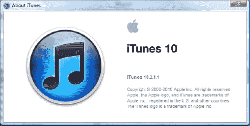

除了 `Ping`，我们还将介绍 `iTunes DJ`、`Genius` 功能以及省钱的 `家庭共享` 功能。我们还将向您展示如何导入音乐 CD、DVD、PDF 和电子书文件，以及如何为您所有的音乐获取专辑封面。我们甚至会教您如何授权电脑通过 `iTunes` 共享内容。最后，我们将为 `iTunes` 提供一些有用的故障排除技巧。

**注：** 如果您是初次设置 `iPad`，请查看第 1 章：“开始使用。”如果您正尝试使用 `iTunes` 将电脑与 `iPad` 同步，请查看第 3 章：“将您的 iPad 与 iTunes 同步。”

如果您需要在电脑上安装 `iTunes` 软件，请直接跳转到本章稍后的“下载和安装 iTunes 软件”部分。如果您已经安装了 `iTunes` 软件，则请转到“更新 iTunes 软件”部分，以确保您拥有最新版本。

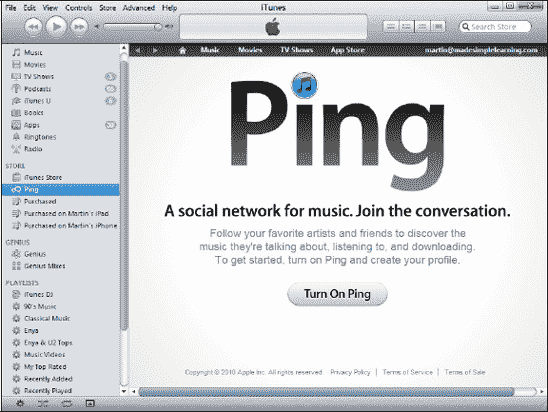

**图 29–1.** *显示了 `iTunes` 10.0 版新增的 `Ping` 功能的屏幕*

### 检查 iTunes 是否已安装

如果您是 Windows PC 用户，请首先在桌面上寻找 `iTunes` 图标并双击它。如果找不到，请单击左下角的 `Windows` 徽标或 `开始` 按钮，然后输入“iTunes”。如果在搜索结果中没有看到 `iTunes` 应用程序，那么您可能没有安装 `iTunes`。如果是这种情况，请按照下一节“下载和安装 iTunes 软件”中的步骤操作。如果 `iTunes` 已安装，您会看到它出现——只需单击其图标启动它，然后跳到“iTunes 导览”部分。

如果您是 Mac 用户，`iTunes` 默认安装在您的电脑上。检查 `iTunes` 图标是否在您的桌面或桌面 Dock 上。如果看到了，请双击它并跳到“iTunes 导览”部分。如果您没有看到 `iTunes` 图标，请启动 `Finder`，单击 `应用程序`，然后在按字母顺序排列的应用程序列表中找到 `iTunes`。

### 下载和安装 iTunes 软件

如果您以前从未在电脑上安装过 `iTunes`，可以通过以下步骤直接从 Apple 网站下载软件：

1.  在电脑上打开一个网页浏览器，例如 Apple 的 `Safari`、Microsoft 的 `Internet Explorer`、Google 的 `Chrome` 或 Mozilla 的 `Firefox`。
2.  在浏览器顶部的地址栏中输入网址 [`www.itunes.com/download`](http://www.itunes.com/download)，然后按 `Enter` 键。该网址同时适用于 Windows PC 和 Mac 用户。
3.  接下来，如果有选择，请选择匹配您电脑操作系统的软件。
4.  如果有“运行”或“保存”的选项，请选择 `运行`，以便下载完成后自动开始安装。
5.  如果安装没有立即开始，请找到您下载的文件（Windows 用户应查找名称类似 `iTunes.exe` 的文件，Mac 用户应查找类似 `iTunes_Install.dmg` 的文件）。双击安装文件以开始安装。
6.  按照屏幕上的提示安装 `iTunes`。

### 更新 iTunes 软件

更新您的 `iTunes` 软件很容易，因为该程序默认会检查其版本状态，如果有更新的版本可供下载，它会自动通知您。启动 `iTunes` 后，如果存在更新的 `iTunes` 版本，您会看到一个弹出窗口。如前所述，版本号将高于图 29–2 中所示的 10.0。

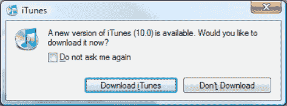

**图 29–2.** *Apple `软件更新` 屏幕*

**提示：** 如果您想确保使用的是最新版本，请从 `iTunes` 菜单中选择 `帮助`  `检查更新`。

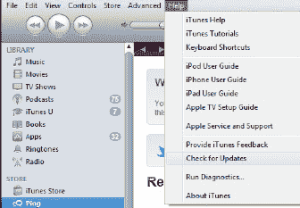

点击 `下载 iTunes` 后，您将被带到 `iTunes` 网站。为您的电脑选择相应的软件，然后点击 `立即下载` 按钮。

您也可以通过访问 [`www.iTunes.com`](http://www.itunes.com) 并点击 `下载 iTunes` 按钮来进入此下载页面。

按照屏幕上的说明在您的电脑上安装更新的 `iTunes`。

**提示：** 要确定您在 Windows 上的电脑操作系统，请单击左下角的 `开始` 按钮或 `Windows` 徽标。然后，右键单击 `计算机` 并选择 `属性`。在 Mac 上，单击左上角的 `Apple` 徽标，然后从菜单中选择 `关于本机`。

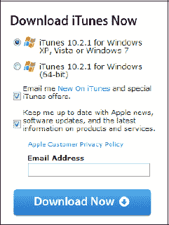

### iTunes 能为你做什么

你电脑上的 `iTunes` 软件能让你做很多事情，包括以下内容：

- **购买应用、音乐、视频、电视节目等（或免费下载）：** 你可以购买或免费下载应用、音乐、电影、电视节目、播客、`iBooks`、PDF 文件和有声读物。你甚至可以从 `iTunes U`（`iTunes` 中一个专门提供大学和其他学习机构教育内容的特殊区域）下载教育内容。最棒的一点是：其中大部分内容都是免费的！
- **整理你的媒体资料：** 你可以使用各种视图和自动播放列表，并设置你自己的自定义播放列表。
- **参与社交网络：** 使用 `iTunes` 中新的 `Ping` 功能，你可以关注你最喜欢的艺人，了解他们正在谈论什么音乐。你也可以与朋友分享你最喜欢的音乐，甚至可以看到谁要去参加下周末的音乐会。
- **将你的音乐、视频、通讯录等内容同步到 iPad：** 你想把所有的好音乐和视频都带到 iPod 上——使用 `iTunes` 同步你的内容，然后出发（请参见第 3 章：“将你的 iPad 与 iTunes 同步”）。
- **播放你的音乐、视频和音频内容：** `iTunes` 应用是你电脑上一款出色的媒体播放器，可以播放你所有的媒体内容，包括音乐、视频、电视节目和播客。
- **备份和恢复你的 iPad：** 此选项让你可以备份和恢复你的 iPad 数据。

### 关于 iTunes 的常见问题

以下是一些关于 `iTunes` 的 iPad 常见问题，以及针对每个问题核心或要点的简短回答。

*我电脑上的 `iTunes` 软件和我 iPad 上的 `iTunes` 应用是一样的吗？*

> 你电脑上的 `iTunes` 软件与你 iPad 上的多个应用功能相同。你需要在 iPad 上安装以下应用，才能完成 `iTunes` 在你的电脑上所能做的一切：`iPod`、`视频`、`iTunes`、`iBooks` 和 `App Store`。
> 
> 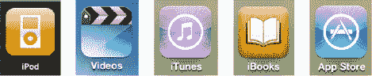

*我有一部 iPhone 或另一款 iPod；我能和我的新 iPad 共享音乐和视频吗？*

> 可以！你绝对可以在你所有的 Apple 设备（包括你的新 iPad）上继续收听你所有的音乐并分享你所有的视频。

*我可以使用我现有的 `iTunes` 软件和帐户吗？*

> 可以！你可以使用已安装在电脑上的同一款 `iTunes` 软件，以及你现有的 iTunes 帐户，来设置你的 iPad。

*我可以使用我在 iPhone 或 iPod touch 上购买的应用吗？*

> 可以，但有局限性。iPhone 和 iPod touch 的应用可以运行；但是，专为 iPhone/iPod touch 设计的应用会在屏幕中间的一个小窗口中显示，并且通常当你将 iPad 侧向倾斜时不会旋转（`横向`模式）。你可以按下一个小小的 `2×` 按钮来将应用扩展到全屏，但图像看起来会有点颗粒感。

### iTunes 导览

在安装了最新版本的 `iTunes` 之后（在编写本书时版本是 10），你就可以开始对电脑上的 `iTunes` 界面进行一次快速导览了。好在它在 PC 和 Mac 上的界面看起来非常相似。

当你首次启动 `iTunes` 时，你会看到主窗口，顶部有用于播放音乐或视频的控件（请参见图 29–3）。你还会看到**左侧导航栏**，你可以通过它选择你的资料库、iTunes Store、你的 iPad（已连接时）、共享媒体、Genius 播放列表以及你自己的播放列表。**顶部导航栏**会根据你在左侧导航栏中的选择而调整。同样地，中央主窗口也会根据你在左侧和顶部导航栏中的选择，以及主窗口本身的内容而调整。

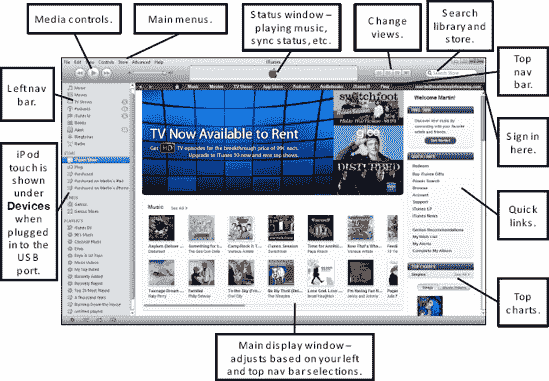

**图 29–3.** *`iTunes` 主窗口*

从主窗口的左上角开始，你可以看到以下菜单、控件、窗口和其他视觉元素：

- **主菜单：** 位于媒体控件正上方，它们通过一套逻辑清晰且便捷的菜单，提供对 `iTunes` 所有可执行操作的访问。虽然这些菜单中的许多功能也可以通过按钮和工具栏访问，但在这里，你可以通过逻辑列表找到你需要的功能。
- **媒体控件：** 这些按钮让你可以播放、暂停或跳转到下一首歌曲或下一个视频，以及调节音量。
- **状态窗口：** 位于 `iTunes` 的中上部区域，这个窗口显示当前操作的状态（同步状态、是否正在播放歌曲/视频，或其他相关信息）。
- **视图调整按钮：** 这些按钮允许你在`列表`、`网格`或`封面流`视图之间切换。（这些按钮仅在你处于自己的媒体资料库中时才会激活。）
- **搜索框：** 此框允许你根据输入的文本，在你的资料库或 iTunes Store 中搜索特定的歌曲、视频、电视节目或其他任何内容。
- **登录链接：** 位于右上角`搜索`框的正下方，此按钮允许你登录 iTunes Store 或创建一个新的 Apple ID。请注意，右侧的图中显示的是 `martin@madesimplelearning.com`，而不是`登录`。这是因为 Martin 已经用他的 `Apple ID` 登录了。

  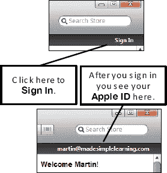

- **顶部导航栏：** 这组位于状态窗口下方的按钮，会根据你在左侧导航栏中的选择而变化。有时按钮很少；有时则会横跨整个屏幕。点击其中任何一个按钮，都可以更改主窗口中显示的内容。
- **左侧导航栏：** 此栏允许你查看你的资料库（例如，音乐、视频、电视节目和播客）、iTunes Store 和 Ping、你已购买的内容、任何当前连接的设备（你的 iPad、iPod、iPhone 等）、共享资料库、Genius 混曲以及你自己的播放列表。
- **主窗口：** 在这里，你可以根据你在左侧和顶部导航栏中的选择看到所有内容。例如，如果你在左侧导航栏中选择了你的 iPad，并在顶部导航栏中选择了`应用`，你将会看到类似于图 29–3 所示的界面。

#### Apple 的 iTunes 视频教程

除了本书提供的所有信息之外，你还可以找到一些来自 Apple 的优秀视频教程，帮助你开始使用 `iTunes` 应用。你可以直接在 `iTunes` 应用中点击`帮助`菜单并选择`iTunes 教程`来查看这些教程。

### 在 iTunes 中使用 Ping

正如我们所提到的，Ping 是一项专注于音乐的新型社交网络功能；它在 `iTunes` 10 及更高版本中可用。它允许你关注你最喜欢的艺人，以及你朋友的喜好。该功能还让你可以与人们分享你的好恶，了解当地的音乐会信息，等等。

#### 开始使用并创建个人资料

首先，点击 `iTunes` 左侧导航栏的“商店”板块中的 `Ping` 选项。

**注意：** 如果你已经注册并启用了 `Ping`，但尚未使用你的 `Apple ID` 登录 `iTunes` 账户，那么你将在主窗口中看到一条“开启 Ping”的消息。只需点击该链接并登录，即可查看你的 `Ping` 账户。

现在，点击主窗口中的 `开启 Ping` 按钮  。你需要重新登录 `iTunes` 服务才能开始使用 `Ping`。接下来，你需要为 `Ping` 创建个人资料。输入你的名和姓，选择性别，添加可选的头像，注明居住地，提供简短的个人简介，最后选择最多三种你喜欢的音乐类型。

点击 `继续` 以选择音乐在你的个人资料中的显示方式。默认设置是“自动显示我喜欢、评分、评论或购买的所有音乐”。当然，你也可以根据自己的偏好进行调整。点击 `继续`。

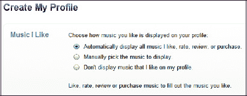

最后，你可以选择允许他人关注你时是否需要经过你的批准（默认设置是无需批准），或者完全不允许他人关注你。做出选择后，点击 `完成` 以结束 `Ping` 个人资料的设置。

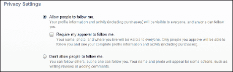

完成设置后，你会看到一个类似下图的页面，其中包含基于你在 `iTunes Store` 中购买的音乐的推荐。要开始关注艺人，请点击底部的 `关注` 按钮，或输入搜索词来关注朋友或艺人。

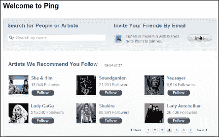

你也可以点击 `邀请` 按钮，邀请你的朋友加入 `Ping`。

如果你愿意，可以通过点击 `邀请` 按钮并输入朋友的电子邮件地址来邀请他们。

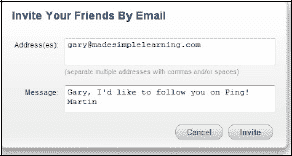

#### 关注你喜欢的艺人

要寻找想关注的艺人，只需在 `Ping` 界面的 `搜索` 窗口中输入他们的名字。当看到艺人出现时，点击 `关注` 按钮。我们搜索并找到了“滚石乐队”，但请注意，这并非那个摇滚乐队——而是一个使用了该乐队名称的个人用户。

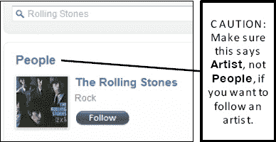

**警告：** 有些人拥有（或曾经使用过）与艺人相同的名字，因此请务必点击搜索窗口右侧的 `显示艺人` 链接。否则，你最终关注的可能会是喜欢另类、电子和摇滚音乐的德国啤酒爱好者彼得·盖布瑞尔（Peter Gabriel），而不是真正的艺人彼得·盖布瑞尔。

#### 关注你的朋友和其他人

使用相同的“查找”功能来定位和关注你的朋友及其他用户。在下一个示例中，马丁决定关注加里·马佐，因此马丁搜索了加里的名字。点击 `关注` 后，会弹出一个窗口，告知马丁 `Ping` 需要向加里发送姓名、照片和电子邮件地址，以便加里批准请求。请注意，当马丁请求关注加里时，加里在他的 iPad 上会看到什么（参见图 29–4）。

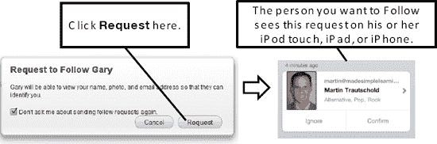

**图 29–4.** *来自 **iTunes** 中 Ping 功能的关注请求，显示在移动设备上的效果*

#### 近期活动动态

Ping 的核心是你从所关注的艺人和朋友那里收到的所有更新。启动 Ping 时的默认视图显示在右侧；不过，如果你在其他视图中，则需要点击右上角 `PING` 框中的 `近期活动` 链接。

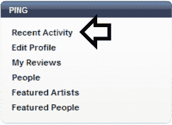

**注意：** 你或你的家人在同一“家庭共享”账户中购买的所有内容，都会作为已购买项目显示在你的 `Ping` 账户上。嘿，至少你可以把那首无聊的情歌归咎于你的配偶，或者把那种匪帮说唱归咎于你十几岁的孩子。

`近期活动` 视图会显示你以及你所关注的朋友和艺人的所有近期动态（参见图 29–5）。这与 Facebook 上的“个人主页”非常相似。你可以发表评论，*喜欢*你看到的帖子，并阅读其他关注者的评论。尽情享受吧，让你的意见被听到，并参与到对话中来！

如果你所关注的朋友允许你查看他们的购买记录，你也可以对这些购买进行评论。当然，`iTunes` 应用通过在所列项目旁边提供便捷的 `购买` 按钮，让你可以轻松购买朋友购买的专辑或歌曲。

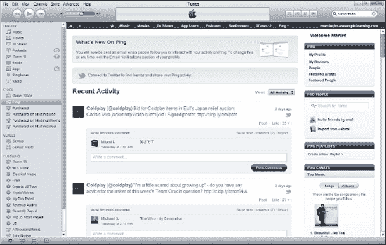

**图 29–5.** *Ping 的 **近期活动** 页面让你能够添加评论或表示喜欢某样东西。*

#### 在 iTunes 中前后导航

有时，你只是想简单地返回到刚才点击链接离开的页面。可能不太明显，但在主 `iTunes` 窗口的左上角有小的 `三角形` 图标，可以让你在 Ping 和 `iTunes` 应用的其他部分之间前后翻页。

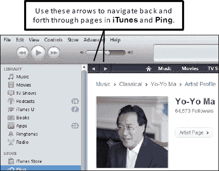

#### 音乐会：了解并和朋友分享

当你在 `Ping` 中点击某位艺人的页面时，可以通过寻找页面右下角的 `音乐会` 框来查看他们是否有已安排的即将到来的演出。附图中显示的是 U2 乐队的即将到来演出。点击该框标题栏中的 `查看全部` 链接，可以查看所有详细信息，并告诉别人你是否要参加这些音乐会。

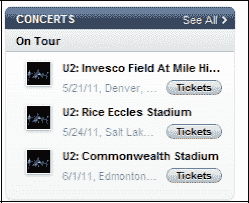

点击 `查看全部` 链接后，你将看到所有演出的详细信息。你可以点击 `我要去` 按钮告诉其他人你正在参加，以及点击 `门票` 按钮尝试购票。如果你点击了 `我要去`，还可以为你的帖子添加评论供朋友们查看——例如，你可能会告诉他们你的座位号，以便他们能找到你。

#### 查看艺人在 Ping 中喜欢的内容

如果你在 Ping 中访问某些艺人的页面，可以在右上角看到他们喜欢的音乐。在这张图片中，我们可以看到 U2 乐队喜欢 Elbow、TV on the Radio、The National 等乐队。点击任何一张专辑封面，即可试听甚至购买该专辑中的歌曲。

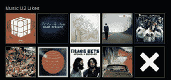

#### 使用歌曲的 Ping 下拉菜单

在大多数 `iTunes` 视图中，你所有歌曲的旁边都会有一个小的 `Ping` 下拉菜单。点击 `Ping` 菜单可以“喜欢”、“发布”或“显示艺人简介”。你还可以查看 iTunes 商店，以浏览该艺人更多的歌曲、更多专辑，甚至同类型的其他歌曲，如下方所示。

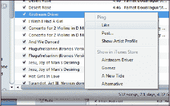

#### 在右侧栏中查看 Ping

当你在音乐库中的项目之间切换时，你会很快注意到 Ping 会显示在右侧栏的顶部。你可以从这个栏目表示你`喜欢`这首歌，或者`发布`对这首歌的评论。

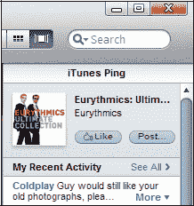

#### Ping 移动版

你可以直接从 iPad 上的 `iTunes` 应用访问 Ping。要查看 Ping，请在 iPad 上启动 `iTunes` 应用，然后点击底部一行的 `Ping` 快捷键。

请注意，你可以通过点击顶部的那些按钮，在“动态”、“用户”和“我的资料”之间切换。

右侧的图片显示的是“动态”标签。

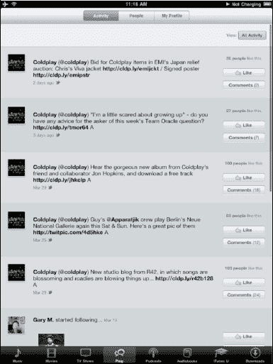

### 更改 iTunes 中的视图

在电脑上的 `iTunes` 中，有多种方式查看你的音乐、视频和其他媒体。熟悉电脑上的这些视图也有助于你理解 iPad，因为你的 iPad 上有许多相同的视图。`iTunes` 中有四种可自定义的视图：`歌曲列表`、`专辑列表`、`网格` 和 `封面流`。

**注意：** `专辑列表` 视图是 `iTunes` 10.0 版本中的新功能。这是一个很好的视图，因为它按专辑对你的歌曲进行分组，并在 `专辑` 列中显示专辑封面。

#### `Song List` 视图

点击视图图标最左侧可查看`Song List`视图（请参见图 29–6）。您可以通过点击任意列的标题来重新对列表进行排序。例如，要按名称排序，请点击`Name`列标题。要反转排序顺序，只需再次点击同一列标题即可。`Song List`视图在查找特定艺术家或特定专辑的所有歌曲时特别有用。

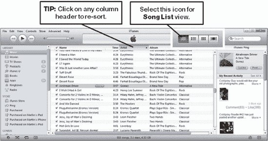

**图 29–6.** *`Song List`视图*

#### `Album List` 视图

如前所述，这是`iTunes` 10.0 版本中的一个新视图。点击第二个视图图标可查看`Album List`视图（请参见图 29–7）。您可以通过点击任意列的标题来重新对列表进行排序。例如，要按名称排序，请点击`Name`列标题。要反转排序顺序，只需再次点击同一列标题即可。`Album List`视图在查找特定艺术家或特定专辑的所有歌曲时特别有用。

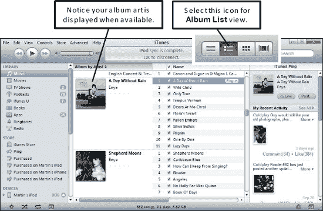

**图 29–7.** *`Album List`视图*

#### `Grid` 视图

点击第三个图标可显示`Grid`视图（请参见图 29–8）。这是一个非常图形化的视图，如果您想快速找到专辑封面或海报艺术，它会很有帮助。

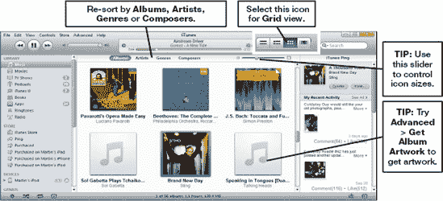

**图 29–8.** *`Grid`视图*

#### `Cover Flow` 视图

点击最右侧的图标可查看`Cover Flow`视图（请参见图 29–9）。这是一个有趣的视图，因为它非常直观，您可以使用滑块快速翻看图片，浏览专辑封面。与`Grid`视图和`Album List`视图一样，当您知道封面长什么样时，该视图提供了一种查找专辑的简便方法。

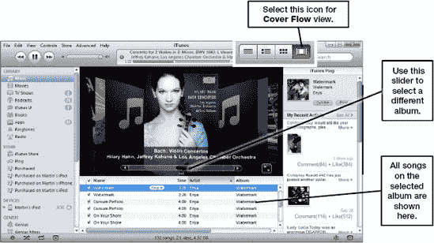

**图 29–9.** *`Cover Flow`视图*

### 播放歌曲、视频等

如果您是`iTunes`新手，以下基本提示可以帮助您熟悉该应用（请参见图 29–10）：

- **播放歌曲、视频或播客：** 双击某个项目即可开始播放。
- **控制歌曲或视频：** 使用`Rewind`、`Pause`和`Fast Forward`按钮，以及左上角的`Volume`滑块来控制播放。
- **跳转到歌曲或视频的不同部分：** 只需点击窗口顶部歌曲名称下方滑块条中的`Diamond`图标，然后根据需要向左或向右拖动即可。

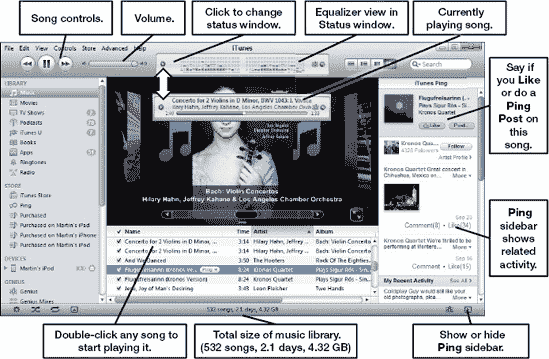

**图 29–10.** *在`iTunes`中播放您的歌曲、视频等*

### `iTunes` 可视化效果

`iTunes`中有一个非常有趣的视觉功能，相当有娱乐性。它看起来像一个屏幕保护程序，会随着您正在播放的音乐做出反应。有两个版本：iTunes 经典可视化效果和新的 iTunes 可视化效果。要查看可视化效果，请从菜单中选择**视图  显示可视化效果**（或者在 Windows 上按`Ctrl+T`，在 Mac 上按`Command+T`）。要在经典和新可视化效果版本之间切换，请从菜单中选择**视图  iTunes 可视化效果**或**iTunes 经典可视化效果**。图 29–11 展示了两种可视化效果的示例。

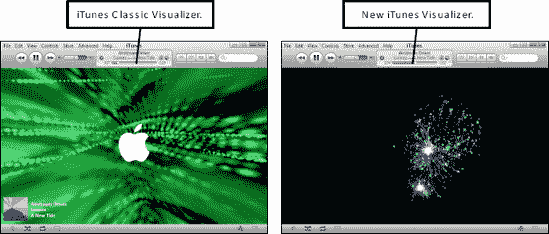

**图 29–11.** *iTunes 经典和新可视化效果*

#### 使用`iTunes`均衡器

您可以通过将内置均衡器与您正在聆听的音乐类型相匹配来增强音乐的音效。要查看 iTunes 均衡器，请从菜单中选择**视图  显示均衡器**（或者在 Windows 上按`Ctrl+Shift+2`，在 Mac 上按`Command+J`并勾选**均衡器**）。您可以从超过 20 种预设设置中进行选择，包括`Classical`、`Rock`、`Pop`和`R&B`，并且可以修改这些设置以符合您的个人品味。

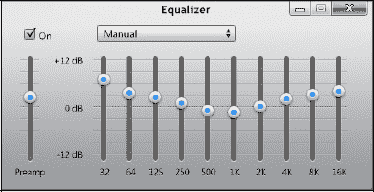

#### `iTunes` 迷你播放器

有时您希望让`iTunes`在电脑上继续播放，但又不希望它占用太多屏幕空间。幸运的是，`iTunes`内置了一个名为迷你播放器的精简版本。

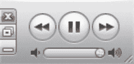

要显示迷你播放器，请从菜单中选择**视图  切换到迷你播放器**（或者在 Windows 上按`Ctrl+M`，在 Mac 上按`Shift+Command+M`）。要切换回常规视图，请按下相同的快捷键。

拖动右下角可查看`Status`窗口。

#### `iTunes` DJ

如果您想以新的顺序聆听音乐，而又不想让歌曲中断，可以试试 iTunes DJ 功能。要启动它，请点击左侧导航栏中`Playlists`部分顶部的`iTunes DJ`。

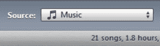

iTunes DJ 会根据您的整个音乐库或单个播放列表，连续混合播放音乐。要调整来源，请点击屏幕底部`Source`旁边的下拉菜单。

您可以在`iTunes DJ`主窗口中看到 DJ 即将播放的歌曲列表。要更改歌曲的播放顺序，您只需在列表中将歌曲拖放到更高或更低的位置即可（请参见图 29–12）。

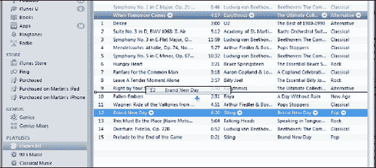

**图 29–12.** *iTunes DJ 及更改待播放歌曲的顺序*

您还可以通过在资料库中右键点击歌曲，然后选择**添加到 iTunes DJ** 或**在 iTunes DJ 中下一首播放**，将歌曲添加到 iTunes DJ 列表中或使其下一首播放。

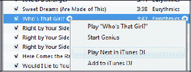

#### `Apple Remote` 应用

一件有趣的事情是在您的 iPad 或其他 Apple 设备上使用`Remote`应用。要开始使用，请打开 iPad 上的 App Store 并搜索“Remote”。来自 Apple 的`Remote`应用是免费的，所以请注意不要购买那些出现的付费应用。请确保您下载的是由 Apple 制作的`Remote`应用。

在您的 iPad 上安装该应用后，点击它启动。接下来，您需要通过输入一个四位数的密码将应用连接到您电脑上的`iTunes`：

1.  在您的 iPad 上，点击`Remote`应用启动它（请参见图 29–13）。
2.  如果您是第一次启动`Remote`应用，请点击**添加 iTunes 资料库**。如果您已经添加了家庭共享或其他资料库，则需要点击`Remote`应用右上角的**设置**（**齿轮**图标）。然后，点击**添加 iTunes 资料库**，您应该会看到一个四位数的密码。
3.  在您的电脑上，启动`iTunes`。在`Devices`部分，您的 iPad 现在应该会显示出来，旁边带有`Remote`图标。点击它以开始使用。

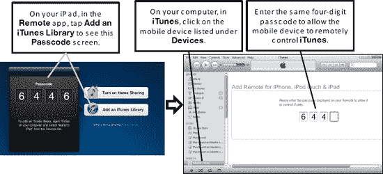

**图 29–13.** *使用 Apple 的`Remote`应用将移动设备 (iPad, iPhone 或 iPod touch) 连接到`iTunes`*

成功连接您的 iPad（或其他 Apple 设备）后，您现在可以远程控制`iTunes`。例如，您可以播放、暂停、跳过一首歌曲，甚至更改播放列表——几乎您在电脑前操作时与播放音乐相关的任何操作都可以实现！

#### AirPlay：通过无线方式将 iTunes 音乐传输至家中各处

苹果公司推出 `AirTunes` 应用已有一段时间。该应用可让你将 `iTunes` 音乐流式传输到家中的特殊无线音箱。近期，苹果将其更名为 `AirPlay`，并扩大了采用此新标准的制造商范围，这些制造商将 `AirPlay` 集成到其音箱、基座及立体声音响系统中。`AirPlay` 甚至能传输 `iTunes` 中当前播放歌曲的信息，包括歌曲名、歌手名、已播放时间和剩余时间。`AirPlay` 可配合 `Airport Express` 实现纯音频传输，也能配合 `Apple TV` 传输视频。

为确保你接下来购买的音箱、基座或立体声音响兼容，请在产品描述或包装上寻找诸如“兼容 Apple AirPlay”之类的字样。许多制造商已推出支持此新标准的产品，包括 `iHome`、`Sony`、`Denon`、`Marantz`、`B&W` 和 `JBL`。

**提示：** 当音乐通过无线音箱流式播放时，即使你远离电脑，也可以使用 `Apple Remote` 应用（在本章“Apple Remote App”部分介绍）来控制 `iTunes`！这是一个很棒的功能，可帮助你通过 iPad 在家中各处享受并控制你的音乐。

### 使用 iTunes 搜索

即使你的资料库目前尚未包含成百上千首歌曲或其他媒体，它很快也会达到这个规模！如何快速找到此刻你想听的那首特定歌曲？定位单首歌曲或视频的最快方法是使用 `iTunes` 应用右上角的搜索字段。

首先，在左侧导航栏中，点击你要查找的内容类型。例如，点击 `Music` 查找歌曲，点击 `Podcasts` 查找播客，点击 `Apps` 查找应用，以此类推。

在左侧导航栏中选择了媒体类别后，点击 `Search` 字段，开始输入歌曲、歌手、作曲家、专辑、播客、电视节目、应用或有声书的名称的任何部分。

你会注意到，一旦输入第一个字母，`iTunes` 就会根据该字母缩小搜索结果（显示在主窗口中）。在这种情况下，`iTunes` 会找出所有匹配的歌曲/视频，这些歌曲/视频的名称、歌手、专辑或作曲家中的任何部分都包含该字母（或连续的字母序列）。

在图 29-14 所示的示例中，我们点击了 `Podcasts`，并在 `Search` 窗口中输入了“Marketplace”，以查找 NPR 广播节目 *Marketplace* 的播客（见图 29-14）。

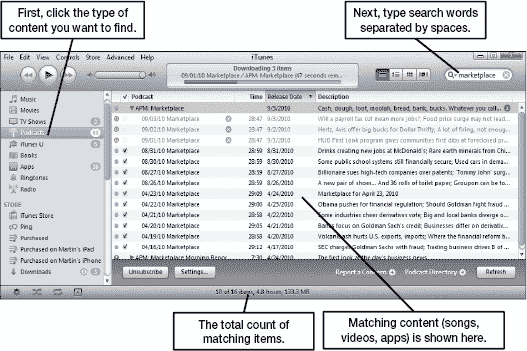

**图 29-14.** *在 `iTunes` 中搜索媒体*

**提示：** 如果想按特定类别（如歌手、作曲家、歌曲名或标题）缩小搜索范围，请点击 `Search` 字段中的小`放大镜`图标，查看下拉列表。点击下拉列表中的任意项，即可使用该项缩小搜索范围。

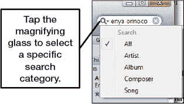

#### 在 iTunes 中搜索的方法

你可以输入任意单词组合来匹配要查找的项目。例如，假设你知道想要的那首歌标题中包含“love”一词，并且是 `U2` 乐队的歌曲。你可以直接输入这两个单词，用空格隔开——例如“Love U2”——然后所有匹配的项目将立即显示出来（见图 29-15）。在这个例子中，只有两首歌曲匹配，因此你可以快速双击想要收听的歌曲。搜索也是上下文相关的。这意味着，如果你在音乐资料库中，搜索功能将搜索音乐；如果你在应用资料库中，搜索将只查找应用。每次搜索时，都会在你的个人资料库和 `App Store`（如果处于联网状态）中进行搜索。

**图 29-15.** *使用两个或更多由空格分隔的单词快速缩小搜索结果范围*

完成搜索后，点击搜索词旁边圆圈内的小 `×`，清除搜索并重新查看所有歌曲和视频。

### 创建新播放列表

你可能习惯于收听某张专辑中的所有音乐，但很快你就会发现创建自定义播放列表的好处。这些列表是你将特定歌曲组合在一起而形成的列表。你可以创建普通播放列表或智能播放列表。

你可以随心所欲地对播放列表进行分组，例如：

- 健身音乐
- 最喜欢的 U2 歌曲
- 旅行音乐

**提示：** 你可以直接在 `iTunes` 资料库中创建播放列表，也可以直接在 `iPad` 上创建。要在电脑上创建播放列表，请点击左侧导航栏中 `Playlists` 标题下的任意现有播放列表。要直接在 `iPad` 上创建新播放列表，请点击左侧导航栏中 `Devices` 下列出的你的 `iPad`。根据你在左侧导航栏中高亮选中的内容，你的新播放列表将在电脑上或 `iPad` 上创建。

#### 创建普通播放列表

普通播放列表是指你可以手动将歌曲拖放到新播放列表中的列表。

确定是在 `iPad` 上还是在电脑上创建播放列表后，就可以开始操作了。请按照以下步骤创建新的普通播放列表：

1.  按下 `Ctrl+N`（在 Mac 上为 `Command+N`），从 `File` 菜单中选择新建播放列表。或者，你也可以直接点击 `iTunes` 左下角的 `New Playlist` 按钮，如右图所示。
2.  在左侧导航栏中出现的条目内，输入播放列表的名称。

    **提示：** 如果你想创建一个与另一个播放列表歌曲非常相似的新播放列表，可以右键点击该播放列表，然后选择 `Duplicate`。

创建并命名播放列表后，就可以向新播放列表中添加歌曲了（见图 29-16）。要从整个资料库中选择，请点击 `Library` 选项卡上的 `Music`。

要从现有播放列表中选择歌曲，请点击该播放列表。

**图 29-16.** *定位要添加到播放列表的歌曲*

##### 添加单首歌曲

你可以轻松地将单首歌曲添加到新播放列表：

1.  点击任意一首歌曲以将其选中，然后按住鼠标左键，将歌曲拖到你的新播放列表上。
2.  当拖动的歌曲名称位于播放列表名称上方时，松开鼠标按钮，即可将歌曲放入播放列表。

    

##### 添加多首歌曲或视频（不在列表中）

你可以通过两个简单步骤添加多个项目：

1.  要添加并非连续排列的选中歌曲，请按住 `Ctrl` 键（Windows）或 `Command` 键（Mac），然后依次点击单个歌曲/视频。选择完所有歌曲/视频后，松开 `Ctrl`/`Command` 键。
2.  选中（高亮显示）所有歌曲/视频后，点击其中一个选中的歌曲，然后将整个选中组拖放到你的播放列表中。

    

##### 添加歌曲或视频列表

你也可以通过以下两步操作来添加歌曲/视频列表：

1.  要一次性将歌曲/视频列表添加到播放列表，请按住 `Shift` 键。在按住 `Shift` 键的同时，点击列表中的第一个项目，然后点击最后一个项目。点击的两个项目及其之间的所有项目都将被选中。
2.  选中（高亮显示）所有歌曲/视频后，点击其中一个选中的歌曲，然后将整个选中组拖放到你的普通播放列表中。

### 创建智能播放列表

智能播放列表是由 `iTunes` 根据您的选择自动创建的播放列表。例如，您可以创建一个包含播放次数最多的十首歌曲、特定艺人或特定流派的智能播放列表，甚至可以限制播放列表的大小（基于歌曲数量或其文件大小）。

要开始创建智能播放列表，请选择 `文件` `` `新建智能播放列表`（或者，在 Windows 上您可以按 `Ctrl+Alt+N`，然后从 `文件` 菜单中选择 `新建智能播放列表`；在 Mac 上您可以按 `Command+Option+N`，然后直接输入搜索参数）。

`图 29–17` 展示了您在创建智能播放列表时拥有的众多选项。您在 `iTunes` 中看到的所有默认播放列表都是智能播放列表。默认类别包括 `90 年代音乐`、`古典音乐`、`音乐视频`、`我的最爱`、`最近添加`、`最近播放` 和 `播放次数最多的前 25 名`。

**图 29–17.** *`智能播放列表` 设置界面*

#### 编辑智能播放列表

了解智能播放列表功能工作原理的最佳方式可能是查看一些预设的智能播放列表。要编辑智能播放列表，请从 `文件` 菜单中选择 `编辑智能播放列表`。在 `图 29–18` 中，您可以看到 `90 年代音乐` 的智能播放列表；您还可以看到它将提取 1990 年至 1999 年的所有音乐和音乐视频。查看其他一些默认的智能播放列表，开始了解众多选项如何相互作用，从而创建一个非常强大的播放列表功能。

**图 29–18.** *`90 年代音乐` 的 `智能播放列表` 设置界面*

**注意：** 智能播放列表的 `动态更新` 功能允许它们在您播放任何歌曲或向资料库添加任何新媒体（例如歌曲和视频）时进行扫描；然后，它将收录其认为符合智能播放列表条件的任何新歌曲。这使播放列表真正具有动态性。

### iTunes“天才”功能

iTunes“天才”功能可以执行各种有趣的操作，帮助您在 `iTunes` 中优化您的音乐和视频资料库。您可以通过以下步骤利用此功能：

1.  单击左侧导航栏中的 `“天才”`，然后单击 `开启“天才”` 按钮。如果您看不到 `“天才”` 项目，请单击 `Store`，然后从 `iTunes` 菜单中选择 `开启“天才”`。
2.  如果您尚未登录 iTunes Store，系统将要求您登录。如果您还没有 Apple ID，请跳转到本章后面的“创建 iTunes 帐户”部分，了解如何创建一个。
3.  阅读并同意“天才”许可协议以继续。
4.  接下来，您的屏幕上将出现一个窗口（如果您的资料库很大，则时间会更长），显示“天才”功能正在启动。
5.  为了使“天才”功能正常工作，`iTunes` 需要了解您资料库中拥有的音乐和视频的类型。它将利用这些信息来帮助推荐您尚未拥有、但可能想要购买的类似音乐或视频。当此步骤完成时，您将看到一个最终的成功界面，告知您“天才”现已设置完毕。现在您可以开始使用“天才”功能了！

**提示：** 您可以在 iPad 上使用“天才”功能，但前提是您已在电脑上启用它（如上所述）。

您可以将“天才”功能视为您的私人购物顾问，他了解您的品味并提出很好的推荐（“天才”建议）。您也可以将“天才”功能视为您的私人 DJ，他了解哪些音乐可以完美搭配，并会为您创建出色的播放列表（“天才”播放列表）。

#### 创建“天才”混合曲目和播放列表

按照以下步骤创建“天才”混合曲目和播放列表：

1.  在您的资料库中右键单击一首您想用于“天才”播放列表的歌曲，然后选择 `启动“天才”`。

    

2.  单击 `启动“天才”` 下拉项后，屏幕将立即更改为显示 `“天才”` 混合曲目，其中包含 `iTunes` 认为与您选择的歌曲类型匹配的所有歌曲（参见 `图 29–19`）；这些建议基于计算机算法和其他 `iTunes` 用户的反馈。您可能会对列表中的音乐甚至艺人感到惊讶，这些内容通常您不会放到同一个播放列表中。

    **提示：** “天才”混合曲目和播放列表提供了一种很好的方式来保持您的音乐资料库的新鲜感，帮助您将搭配良好的歌曲组合在一起——这些组合通常是您自己可能没有想到的。

    

    **图 29–19.** *`“天才”混合曲目` 界面的选项*

3.  在 `“天才”混合曲目` 界面上，您可以选择 25、50、75 或 100 首歌曲。单击 `刷新` 按钮可以查看新的（通常略有不同的）混合曲目/播放列表。
4.  如果您喜欢该混合曲目并想将其保存为播放列表，请单击右上角的 `保存播放列表` 按钮。请注意，该播放列表将保存在左侧列 `“天才”` 部分下。播放列表的默认名称是您最初单击的那首歌的名称。您可以通过双击播放列表名称来更改此名称。您将看到它变为可编辑文本；在此处，您可以输入新名称。

    

#### 关闭“天才”功能

要关闭“天才”功能并移除所有“天才”混合曲目和播放列表，请从 `iTunes` 菜单中选择 `Store`，然后选择 `关闭“天才”`。

#### 更新“天才”功能

如果您向 iTunes 资料库添加了大量音乐、视频或其他内容，您应定期向 `iTunes` 中的“天才”功能发送更新。要发送此更新，请从 `iTunes` 菜单中选择 `Store`，然后选择 `更新“天才”`。

### 如何备份和恢复您的 iTunes 资料库

为了保护您在 iTunes 音乐、视频等方面的大量投资，您应定期备份您的资料库。您可以使用电脑内置的 CD 或 DVD 刻录机备份资料库，但如果您的媒体资料库很大，此过程会变得繁琐。当您拥有较大的 iTunes 资料库时，应将资料库备份到外部硬盘。

#### 使用 CD 或 DVD 备份（适用于较小资料库）

对于较小的 iTunes 资料库，您可以使用 CD 或 DVD 来备份您的媒体。为此，请从 `iTunes` 菜单中选择 `文件` `` `资料库` `` `备份到光盘`。您将看到一个包含多个选项的窗口（参见 `图 29–20`）。我们建议选择默认选项并备份所有内容；但是，您也可以选择仅备份从 iTunes Store 购买的内容。插入备份所需的所有光盘后，您将看到一条备份完成消息。如果您最近备份过到光盘，则可以通过选中 `仅备份上次备份后添加或更改的项目` 框来节省时间和空间。

**提示：** 如果您需要备份到 DVD 或 CD，我们强烈建议选择使用 DVD 方法进行备份，因为它可以容纳 CD 四到八倍的内容。

**图 29–20.** *`iTunes` 备份选项*

#### 从 CD 或 DVD 恢复

您只需插入第一张备份 CD 或 DVD 即可开始恢复资料库，然后 `iTunes` 会询问您是否要从备份光盘进行恢复。

**提示：** 您也可以通过单击左侧导航栏 `设备` 部分下列出的备份光盘，然后将文件从备份拖放到您的资料库中来恢复单个文件。但是，恢复的文件中会丢失少量项目，例如上次播放内容的书签。

