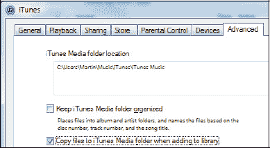
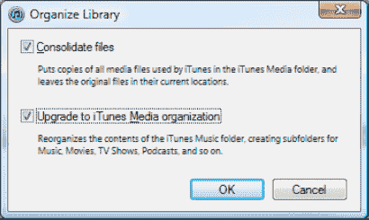

# 备份到外部硬盘（适用于大型资料库）

随着 iTunes 资料库不断增大，完成备份可能需要数十张甚至上百张 DVD 或 CD，因此建议改用外部硬盘。此方法仅在 iTunes 资料库位于单个文件夹时效果最佳。

## 步骤 1：确保所有媒体位于单个文件夹

可按照以下步骤使用 `iTunes` 将所有媒体移至单个文件夹：

1. 从 `iTunes` 菜单中，选择 `编辑`  `偏好设置` (Windows) 或 `iTunes`  `偏好设置` (Mac)。
2. 点击 `高级` 选项卡，勾选页面中部 `添加到资料库时拷贝文件到 iTunes Media 文件夹` 旁边的复选框。
3. 点击 `确定`。
4. 从 `iTunes` 菜单中，选择 `文件`  `资料库`  `整理资料库`，即可看到右侧窗口。
5. 如图所示勾选两个复选框，然后点击 `确定`。
6. 这样所有媒体都会被复制到单个 iTunes 媒体文件夹中。

## 步骤 2：将资料库拖放到外部硬盘

此步骤假设您已购买并连接了外部硬盘。若尚未购买，可前往当地电脑商店或通过网络搜索适用于您电脑操作系统（Windows 或 Mac）的 “外部硬盘”。请按以下步骤将资料库复制到外部硬盘：

1. 在电脑上打开一个窗口，找到您的 iTunes 资料库。iTunes 资料库的默认媒体位置为：
   - **Windows XP：**`\Documents and Settings\username\My Documents\My Music\`
   - **Windows Vista 或 Windows 7：**`\Users\username\music\iTunes\iTunes music\`
   - **Mac OS X：**`/Users/username/Music/`
2. 为外部硬盘打开另一个窗口。
3. 将 iTunes 资料库文件夹拖放到外部硬盘窗口中，以复制所有文件。若资料库非常大，此过程将耗时较长，但至少无需每隔几分钟更换一次光盘！

