# 家庭共享功能

如果家中有多人使用 iTunes，且所有设备都连接在同一家庭网络中，那么家庭共享功能将帮助您在电脑之间共享内容（音乐、视频等），并且首次支持在 iPad 或其他 Apple 移动设备上共享。请按以下步骤使用家庭共享功能：

1. 选择用于家庭共享功能的账户。所有通过家庭共享功能连接的电脑和移动设备必须使用相同的 iTunes 账户和密码登录并建立连接。通常应选择拥有最多已购内容或您希望在多台电脑间共享内容的账户。

**注意：** iOS 4.3 新增功能：您现在可以在 iPad 或其他 iOS 移动设备（iPhone 或 iPod touch）上使用家庭共享功能。

2. 设置家庭共享功能并授权每台其他电脑。您可以像启用 Genius 功能一样开始使用家庭共享。在电脑的 iTunes 中，点击 `iTunes` 应用左侧导航栏中 `共享` 标题下的 `家庭共享`（参见图 29-21）。如果在左侧导航栏中看不到 `家庭共享`，请从菜单中依次选择 `高级`  `关闭家庭共享`，然后选择 `高级`  `开启家庭共享`。这应能解决问题。

**注意：** 从 iTunes Store 购买或租赁的所有版本视频和电影均受 FairPlay 数字版权管理（DRM）保护。但此类受 DRM 保护的内容最多可在五台已授权的电脑（PC 或 Mac）上播放。租赁的 DRM 内容（如租借的电影）必须每次物理传输到一台设备。受保护的音乐可在最多五台电脑上授权，并且可以同步到大量移动设备，前提是这些移动设备仅与一台电脑同步。

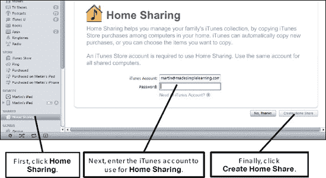

**图 29-21.** *启动家庭共享功能*

**提示：** 请参阅第 9 章：“播放音乐”，了解如何在 iPad 的 `iPod` 应用中启用家庭共享。

3. 您可以通过以下步骤在 iPad 或其他移动设备上控制家庭共享资料库：
   1. 从 iPad 的 iTunes Store 下载并安装 Apple 免费的 `Remote` 应用。
   2. 点击 `Remote` 启动它。

   

   3. 点击 `开启家庭共享`。
   4. 输入用于创建原始家庭共享的 Apple ID 进行登录。
   5. 登录后，您将看到类似这样的屏幕，其中包含控制 `iTunes` 的说明。
   6. 点击 `完成` 关闭窗口。

   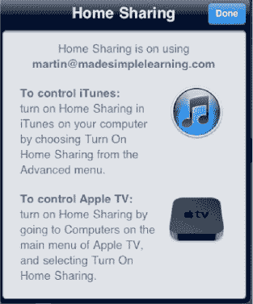

   7. 现在您将在下一个屏幕上看到所有资料库。本例中仅显示 `Martin 的资料库`。点击该资料库即可打开并直接在运行 `iTunes` 的 Martin 电脑上播放内容。

   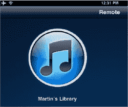

4. 在您希望授权访问家庭共享内容的每台电脑和移动设备上重复步骤 2 和 3。确保每台电脑使用相同的 iTunes 账户；一开始可能会有些混淆，但使用相同账户至关重要。在其他电脑上，您可能需要授权该电脑才能播放 iTunes 资料库中的内容。`iTunes` 应用会通过弹出窗口通知您是否需要授权电脑。

**注意：** 最多可授权五台电脑和移动设备作为家庭共享设备。

5. 点击 `是` 继续。授权完成后，您将看到一个屏幕，显示总共有五次授权机会，目前已使用几次。有关授权或取消授权电脑的更多信息，请参阅本章后面的 “授权和取消授权电脑” 部分。
6. 开始享受共享内容。一旦家庭共享功能在至少两台电脑上启用，第二台电脑将在 `iTunes` 的 `左侧导航栏` 的 `共享` 标题下看到共享内容。要开始查看、播放和导入这些共享内容，请点击共享资料库（参见图 29-22）。

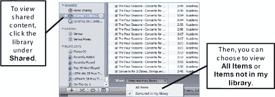

**图 29-22.** *查看家庭共享资料库并过滤以显示所有项目或不在自己资料库中的项目*

### 过滤家庭共享资料库，仅显示您资料库中没有的项目

使用家庭共享资料库后，您会注意到屏幕底部有一个开关，可以只显示那些您资料库中没有的项目（参见图 29–22）。这是快速评估您可能需要从共享资料库中添加（即导入）哪些内容的好方法。

### 两种类型的共享资料库

您会在 `iTunes` 左侧导航栏的 `共享` 类别中看到两个图标。每种图标指示资料库是完全共享型（`房屋` 图标）还是仅供收听型（`文件堆` 图标）。表 29–1 描述了其区别。

**表 29–1**. *完全共享与仅供收听资料库*

| 共享资料库类型 | 含义 |
| --- | --- |
|  完全共享资料库（`房屋` 图标） | Martin 的资料库已完全开启家庭共享——您可以查看、收听和导入（添加）此资料库中的项目。 |
|  仅供收听资料库（`文件堆` 图标） | `LS-WTGL7AC` 是仅限收听和查看的资料库。您无法从此资料库向您自己的资料库导入任何歌曲。 |

### 将共享内容导入您的资料库

当您查看家庭共享资料库时，只要您的电脑已获得授权，就可以收听该资料库中的任何内容。如果遇到任何授权问题，请参考第 3 章：“将 iPad 与 iTunes 同步”。在该章节中，我们介绍了如何为 iTunes 授权您的电脑。

您可以手动拖放内容到您的资料库中，也可以设置家庭共享功能，自动从家庭共享的 iTunes 帐户导入所有新购买项目。

#### 通过手动拖放导入

如果您想从共享资料库中抓取几首歌曲或几个视频，拖放导入法非常有效。只需点击歌曲或视频以高亮显示，然后将它们拖到您的资料库中即可。

您也可以点击歌曲/视频以高亮显示，然后点击右下角的 `导入` 按钮来执行相同操作。

#### 自动导入新购买项目

如果您希望将家庭共享 iTunes 帐户的所有新购买项目自动共享到其他设备或电脑上的资料库中，请按照以下步骤操作：

1.  在左侧导航栏中，点击您要从中导入内容的家庭共享资料库。
2.  点击 `iTunes` 屏幕右下角的 `设置` 按钮。
3.  此时会弹出一个与右侧所示类似的小窗口。勾选那些要从家庭共享资料库自动传输到您资料库中的项目。

    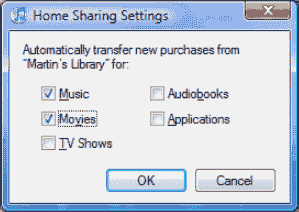

4.  点击 `好` 保存您的家庭共享设置。

### 开关家庭共享功能

启用家庭共享功能后，您可能希望在某些时候将其关闭。为此，请前往 `iTunes` 的 `高级` 菜单，选择 `关闭家庭共享`。要重新开启，请重复之前描述的步骤，进入同一个 `高级` 菜单并选择 `开启家庭共享`。

### 家庭共享故障排除

有时，即使您的电脑已在家庭共享帐户上获得授权，也可能会看到“电脑未授权”错误。通常这是因为您试图从家庭共享帐户查看或收听的内容（例如歌曲或视频）是由非家庭共享 iTunes 帐户的其他帐户购买的。要解决此问题，请按照以下步骤操作：

1.  在家中找出最初购买该歌曲的人。
2.  请他授权您的电脑。（如果您遇到任何授权问题，那么请查阅第 3 章：“将 iPad 与 iTunes 同步”；该章节解释了如何为 iTunes 服务授权您的电脑。）
3.  一旦您的电脑获得授权，您应该就可以欣赏该音乐或视频了。

### 创建 iTunes 帐户

如果您已使用 Apple ID 或 AOL 用户名注册了 iTunes 帐户，那么您需要进行登录（有关如何执行此操作的信息，请参阅本章后面的“登录 iTunes Store”部分）。

如果您想购买或下载免费的歌曲、图书、应用、视频、电视节目等，您需要从 iTunes Store 获取它们。您可以按照以下步骤进行操作：

1.  点击右上角的 `登录` 按钮（参见图 29–23）。如果您还没有 iTunes 帐户，请点击`创建新帐户`按钮并按照说明创建您的新帐户。如果您已有帐户，请输入您的 Apple ID 或 AOL 用户名和密码，点击`登录`按钮，然后直接跳转到“登录 iTunes Store”部分。如果您已有 Apple ID 或 AOL 帐户详细信息，您将在此处输入它们。

    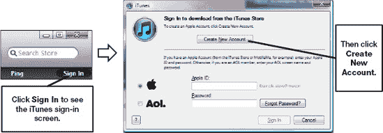

    **图 29–23.** *iTunes Store 的 `登录` 界面，您可以在此开始创建新帐户*

2.  当您点击`创建新帐户`按钮时，您将看到一个新的帐户`欢迎`界面；点击`继续`以进行下一步。
3.  阅读并接受条款和条件，勾选屏幕底部的复选框，然后点击`继续`以进行下一步。
4.  在下一个屏幕上，您需要设置您的 Apple ID（您的 iTunes Store 登录名）、密码、安全问题以及电子邮件偏好。如果您不希望接收电子邮件通知，请务必取消勾选页面底部的复选框。点击`继续`以进行下一步。
5.  在下一个屏幕上，系统会要求您输入账单信息。请注意，您可以创建一个美国地区帐户而无需输入账单信息。此外，您可以输入一张 iTunes 礼品卡来充值金额，因此无需输入信用卡或 PayPal 帐户信息。此屏幕包含您的首选账单信息，当您购买音乐、视频和 iPad 应用（通过 iPad 上的 App Store 应用）时将使用该信息。点击`继续`以进行下一步。请注意，此屏幕的内容可能因您所在的国家或地区而略有不同。
6.  根据您所在的地区，您可能需要验证您的县、省或其他地方税务机构。点击`完成`。
7.  现在您应该会看到一个确认您已成功设置 iTunes 帐户的界面。点击`完成`以结束操作。

### 登录 iTunes Store

如果您已成功创建了 iTunes 帐户或您已拥有一个帐户，那么 iTunes Store 的精彩内容就等您探索了！以下部分将向您展示登录后可以执行的大部分操作。但首先您需要登录。

为此，请首先点击 iTunes 的 `登录` 按钮，进入 `登录` 界面，然后系统会要求您输入 Apple ID 和密码。或者，您可以输入您的 AOL 用户名和密码。

#### 进入 iTunes Store

您随时可以通过点击左侧导航栏中 `Store` 下的 `iTunes Store` 链接返回 iTunes Store。

### 从 iTunes Store 购买或获取免费媒体

登录或创建新帐户后，你将能够搜索商店中的任何艺术家、专辑、作曲家或曲目标题。

要查找某位特定艺术家的所有歌曲，请将该艺术家的名字输入到右上角的`搜索`框中。你也可以通过输入某首歌曲的部分或完整名称进行搜索。按下`回车`键后，你将看到 iTunes Store 中所有匹配的项目（参见图 29–24）。

**提示：** 使用主`iTunes`窗口左上角显示的`强力搜索`功能可以进一步缩小搜索范围。另请注意，你可以使用`强力搜索`正下方的`按媒体类型筛选`框来优化搜索。你可以按音乐、影片、电视节目、App、有声读物、播客、iTunes U 或 Ping 来筛选搜索。

然后你可以浏览并使用底部的`购买`按钮购买单首歌曲。

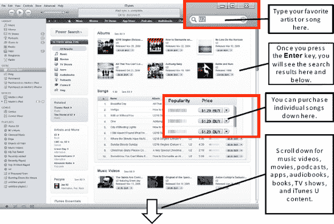

**图 29–24.** *在 iTunes Store 中搜索和购买歌曲*

点击`购买`按钮后，你需要登录，除非你之前已经指示`iTunes`保持登录状态以便购买。

**警告：** 如果你在使用公共计算机，或者担心他人可能未经你允许访问你的计算机并购买商品，那么请不要勾选`记住购买密码`复选框！

登录后，如果你刚刚点击了`购买`按钮，将会看到一个弹出窗口。

如果你不想每次购买时都看到此对话框，请勾选底部弹出窗口中显示`不再询问购买歌曲事宜`的复选框，然后点击`购买`按钮。

现在，你购买的歌曲、视频或其他项目将会被排队下载到你计算机上的`iTunes`应用本地资料库中。

#### 确保所有项目均已下载

从 App Store 购买歌曲、视频、App 或其他项目后——或者如果你刚刚在此计算机上对你的帐户进行了授权——你应该点击左侧导航栏中`商店`类别标题下出现的`下载`链接。

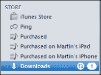

任何正在下载的项目都会在主`下载`窗口中显示一个`状态`栏。当项目完全下载到你的计算机时，你将看到一条`完成`状态消息。

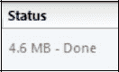

在你可以将购买的项目放入你的 iPad 之前，你需要看到状态为`完成`。如果你看到一个弹出窗口询问是否希望`iTunes`下载你所有已购买的项目，请点击`是`。

### 兑换 iTunes 礼品卡或应用推广码

在某些时候，你可能会收到 iTunes 礼品卡或免费应用的推广码。请按照以下步骤了解如何将卡内金额兑换到你的 iTunes 帐户：

**注：** iTunes 礼品卡是特定于国家/地区的。换句话说，美国礼品卡仅适用于美国 iTunes 帐户。

1. 如果你尚未登录，请点击`iTunes`右上角的`登录`链接登录到你的 iTunes 帐户。
2. 点击你之前看到`登录`链接处的 iTunes Apple ID 右侧的小`下拉箭头`，然后从下拉列表中选择`兑换`。
   
   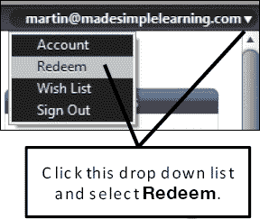

3. 在`兑换`界面，你需要输入礼品卡背面或推广码上的代码（参见图 29–25）。你可能需要刮掉银/灰色的覆盖层才能看到卡片代码。
4. 点击`兑换`按钮。
   
   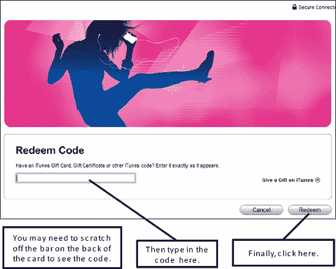
   
   **图 29–25.** *iTunes 兑换界面*

5. 要验证礼品卡是否已应用于正确的 iTunes 帐户，你需要登录或重新输入密码。
6. 点击`登录`按钮或`查看帐户`按钮（如果你已登录）。
7. 当礼品卡成功应用到你的帐户后，你将在`iTunes`屏幕的右上角、登录名旁边看到卡的总金额。现在你可以使用此礼品卡信用额度从 iTunes Store 购买商品。

### 将内容导入 iTunes

如果你有想在 iPad 上欣赏的音乐 CD、DVD、电子书和 PDF 文件，你首先需要将它们导入到计算机上的 iTunes 资料库中。在接下来的小节中，我们将向你展示如何操作。

#### 导入音乐 CD

如果你已达到法定饮酒年龄，那么你的家庭资料库中很可能有几张音乐 CD。如果你超过 40 岁，这个概率会上升到 100%。那么，如何将所有你最喜欢的 CD 加载到 iPad 上呢？完成此操作需要两个步骤：

1. 首先，你必须将 CD 加载到`iTunes`中。
2. 其次，你必须同步或手动将这些 CD 歌曲传输到你的 iPhone。（我们将在第 3 章：“将你的 iPhone 与 iTunes 同步”中向你展示如何同步或手动传输内容。）

为了从 CD 导入音乐，请将 CD 插入计算机的 CD 驱动器。你可能会在`iTunes`内看到一个弹出窗口，询问你是否要如图所示导入 CD。点击`是`导入 CD。

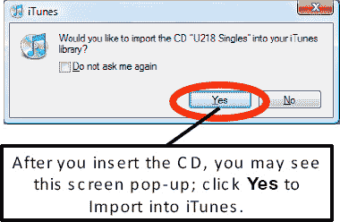

如果你没有收到此弹出窗口，你可以通过点击右下角的`导入 CD`按钮手动开始在`iTunes`中导入 CD。另请注意，该 CD 会出现在左侧列中的`设备`列表下（参见图 29–26）。

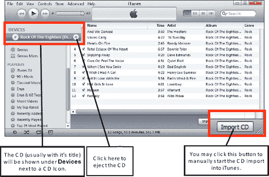

**图 29–26.** *在`iTunes`中处理音乐 CD*

#### 从 DVD 导入影片

你购买的一些较新的 DVD 和蓝光光盘可能有两个版本的影片：一个用于你的 DVD 或蓝光播放器，另一个是可以自动加载到`iTunes`中的额外数字副本。

通常，DVD 包装盒上会印有文字说明存在供计算机使用的额外数字副本。你可以通过将 DVD 插入计算机的 DVD 驱动器并打开`iTunes`来检查是否存在此副本。如果存在数字副本，`iTunes`将自动检测到它并询问你是否要导入该影片。

**警告：** 大多数 DVD 或蓝光光盘并不提供这种额外的数字版本，该版本旨在加载到你的计算机和移动设备上观看。标准 DVD 或蓝光光盘受复制保护，通常无法加载到`iTunes`中。但是，如果你在网上搜索“将 DVD 加载到 iTunes”，你可能会找到一些软件产品（例如`Handbrake`；参见[`http://handbrake.fr`](http://handbrake.fr)），它们允许你将你的 DVD *翻录*或*刻录*到`iTunes`中。我们强烈敦促你遵守版权法；如果你使用此类软件，则只应在自己的计算机或 iPad 上使用该 DVD，切勿分享影片或以其他方式违反版权协议。

#### 导入电子书（PDF 和 iBook 格式）文件

如果你想在 iPad 上阅读 PDF 文件或电子书（国际数字出版论坛制定的行业标准 ePub 格式），你首先需要将该文件导入 `iTunes`，以便同步到你的 iPad。有几种方法可以将电子书导入 `iTunes`。你可以使用拖放方法或菜单命令将文件或文件夹添加到资料库。

##### 拖放方法

这是添加单个文件或少量文件的绝佳方式。请按照以下步骤操作：

1.  在你的电脑上找到该文件。
2.  点击该文件并将其拖到你的 iTunes 资料库中。松开鼠标将该文件放入资料库。你的资料库周围会出现一个方框，如右图所示。看到方框后，即可松开鼠标按钮。
3.  由于 `iBooks` 应用可以读取此文件，你应该会看到该文件出现在资料库的 `图书` 部分。

    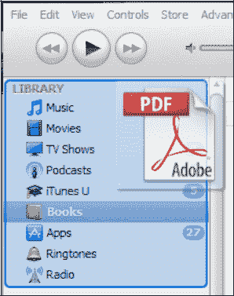

##### 使用菜单命令

如果你有一个完整的文件夹或多个文件夹的文件需要移入 `iTunes`，使用菜单命令会很方便。

**提示：** 此方法适用于电子书，也适用于音乐等其他内容。

1.  从 `iTunes` 菜单中，选择 `文件`，然后选择 `将文件夹添加到资料库` 以添加整个文件夹的内容，或者如果只有一个文件要添加，则选择 `将文件添加到资料库`。
2.  现在导航到你想要添加的文件夹或文件，点击 `选择文件夹`（或对于单个文件点击 `打开`）。
3.  所有 iBooks 可读的文件都将被添加到 `iTunes`。

    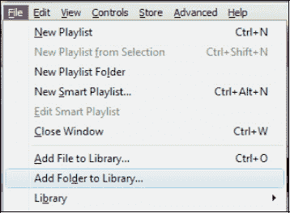

#### 获取专辑封面

`iTunes` 可以自动获取大多数歌曲和视频的专辑封面；但是，如果你需要手动获取这些封面，请按照以下步骤操作：

1.  启动 `iTunes`。
2.  进入 `高级` 菜单。
3.  选择 `获取专辑封面`。

    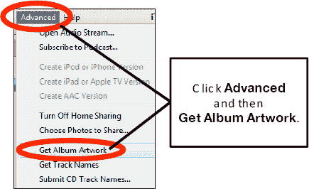

**注意：** 你需要拥有一个 iTunes 帐户并已登录，此功能才能正常工作。

### 授权和取消授权计算机

如前所述，你可以授权最多五台不同的电脑来播放你的 iTunes 媒体（例如音乐和电影）。

**警告：** 一旦达到授权五台电脑的上限，你可以取消所有电脑的授权，但每年只能执行一次。

以下是一个你可能经常听到的问题：*其他人已授权她的电脑播放她的歌曲；我现在可以在我的 iPad 上加载并收听这些“授权歌曲”吗？*

简短的回答是：可能可以。对于 2009 年 1 月之前在 iTunes 上购买的所有歌曲，答案是否定的。对于所有带有 DRM 保护的歌曲，答案也是否定的。这些歌曲与特定个人的移动设备（即 iPad、iPhone 或 iPad）绑定。

对于未启用 DRM 保护购买的所有歌曲，答案是肯定的。2009 年初，iTunes 宣布将开始销售一些没有 DRM 保护的歌曲和视频，这意味着它们可以在多部 iPhone 和 iPad 上播放。请按照以下步骤授权或取消授权你的电脑，以便在你的电脑上，以及可能在你的 iPad 上播放来自他人 iTunes 资料库的歌曲：

1.  启动 `iTunes`。
2.  要授权一台电脑，请进入 `商店` 菜单并选择 `授权此电脑…` 要取消授权一台电脑，请进入 `商店` 菜单并选择 `取消授权此电脑…`

    **注意：** 你需要知道你的 iTunes 或 AOL 用户名和密码，此操作才能成功。

    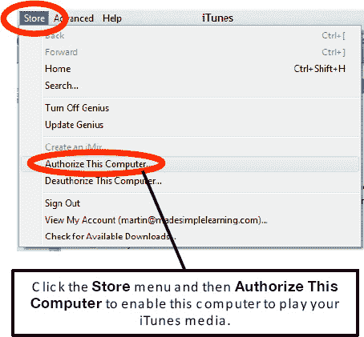

3.  输入你的 Apple ID，或者如果你愿意，点击 AOL 旁边的单选按钮，然后输入你的 AOL 用户名和密码。
4.  接下来，点击 `授权` 或 `取消授权` 按钮。

### iTunes 故障排除

在本节中，我们将提供一些提示和技巧，以帮助你处理在使用 `iTunes` 时可能遇到的一些常见问题。如果你在本节中找不到所遇到问题的答案，我们还有整整一章专门讨论故障排除（请参阅第 28 章：“故障排除”）。

#### 如果 iTunes 自动更新失败怎么办

如果你打开了 `About iTunes.rtf` 文本文件，或者打开了其他安装程序无法自动关闭的相关文件，则自动更新可能会失败。如果你找到并关闭了有问题的文件，应该可以重试自动更新。

如果你看到一条类似于右侧所示的消息，那么你将需要手动安装更新。请按照以下步骤操作：

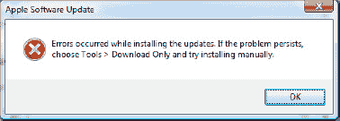

1.  在 `Apple 软件更新` 屏幕上，选择 `工具` 菜单，然后选择 `仅下载`。

    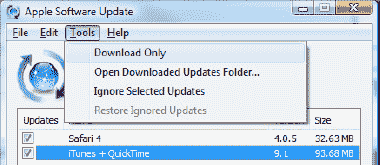

2.  你将看到 `下载` 状态屏幕（如步骤 1 右侧图片所示）。下载完成后，应会弹出一个新窗口，显示已下载的文件，供你手动安装（请参阅图 29–27）。

    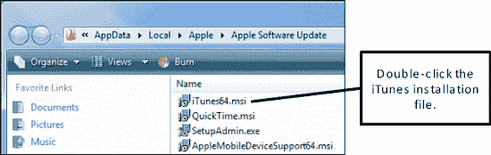

    **图 29–27.** *Apple 软件更新手动安装文件夹（Windows PC）*

3.  要手动开始安装，请双击 `iTunes` 安装文件（请参阅图 29–27）。根据你电脑的操作系统，该文件可能与图中所示略有不同（例如 `iTunes.msi` 或 `iTunes64.msi`）。
4.  从这一步开始，你需要按照 `iTunes` 安装屏幕的提示进行操作。

#### 修复 Apple ID 安全错误

如果你尝试使用你的 Apple ID 登录，屏幕顶部可能会收到一条类似这样的错误消息：

如果发生这种情况，你将需要登录 Apple Store 网站，输入一个安全问题/答案，然后添加你的出生月份和日期。

要更正此错误，请按照以下步骤操作：

1.  在你的电脑上打开一个网页浏览器，访问 [`www.apple.com`](http://www.apple.com)。
2.  点击顶部导航栏左侧的 `商店` 链接，然后将鼠标悬停在右上角的 `帐户` 链接上，查看下拉列表。从该列表中选择 `帐户信息`（请参阅图 29–28）。

    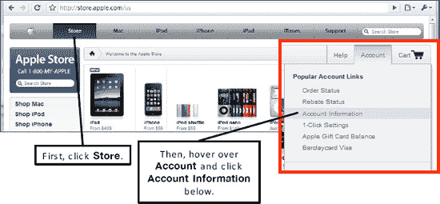

    **图 29–28.** *访问你的帐户信息以更正你的安全信息*

3.  如果你点击了 `帐户`，则需要在下一个屏幕上选择 `更改帐户信息` 链接。
4.  使用你的 Apple ID 和密码登录（即导致错误的那个密码）。
5.  很可能你的安全问题与答案，或者你的出生月份与日期是空白的。你需要添加此信息，输入两次密码，滚动到屏幕底部，然后点击 `继续` 按钮。

你现在应该能够使用你的 Apple ID 和密码注册你的 iPad。

**警告：** Apple 绝不会向你发送电子邮件询问你的密码，或要求你登录并输入密码。如果你收到此类电子邮件，这很可能是一个骗局。不要点击此类电子邮件中的任何链接。如果你担心你的 iTunes 帐户，请通过 `iTunes` 应用登录进行管理。

#### 电脑崩溃后如何找回音乐

好消息是，你的大部分甚至全部音乐可能都还在 iPad 上。如果电脑初次重启不成功，我们无法在这本书中帮助你让电脑恢复正常。不过，我们可以告诉你，一旦电脑重新运行，如何将音乐从 iPad 恢复到你的 `iTunes` 应用中。

因此，如果你的音乐、视频和其他内容的唯一副本保存在 iPad、iPod、iPhone 或 iPod touch 上，那么你需要在电脑重新正常运行后，使用第三方工具将这些内容从移动设备复制回电脑的 `iTunes` 应用中。

在网络上搜索 "copy iPad or iPod to iTunes"，你会找到许多免费或付费的软件工具来完成这项任务。我们建议在购买任何软件之前先试用免费版，以确保它能满足你的需求。

如果你遇到在 `iTunes` 中查看时所有 iPad 音乐都显示为灰色的问题，这个解决方案也同样适用。在这种情况下，你需要将所有 iPad 音乐复制到 `iTunes`，然后按照第 3 章：“将 iPad 与 iTunes 同步”中描述的同步或手动传输步骤重新开始。

**警告：** 请勿使用此第三方软件创建你未合法购买的音乐、视频或其他内容的未授权副本。

