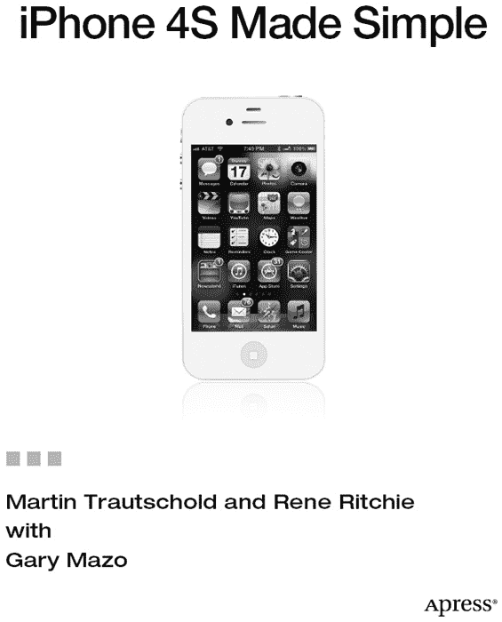

**iPhone 4S 简明教程**

版权所有 © 2012 Martin Trautschold 与 Rene Ritchie

保留所有权利。未经版权所有者及出版人事先书面许可，不得以任何形式或通过任何方式（电子或机械，包括影印、录制，或任何信息存储及检索系统）复制或传播本作品中的任何部分。

ISBN-13（平装）：978-1-4302-3587-3

ISBN-13（电子版）：978-1-4302-3588-0

本书中可能包含已注册商标的商品名称、徽标及图片。对于每次出现的商标名称、徽标或图片，我们并未使用商标符号，而是仅以编辑方式使用这些名称、徽标和图片，以维护商标所有者的权益，且无意侵犯该商标。

本书中使用的商品名、商标、服务标记及相似术语，即使未明确标识，也不应被视为对其是否受所有权保护的表述。

总裁与发行人：Paul Manning
主编：Steve Anglin
开发编辑：James Markham
编辑委员会：Steve Anglin, Mark Beckner, Ewan Buckingham, Gary Cornell, Morgan Engel, Jonathan Gennick, Jonathan Hassell, Robert Hutchinson, Michelle Lowman, James Markham, Matthew Moodie, Jeff Olson, Jeffrey Pepper, Douglas Pundick, Ben Renow-Clarke, Dominic Shakeshaft, Gwenan Spearing, Matt Wade, Tom Welsh
统筹编辑：Laurin Becker
文字编辑：Mary Behr, Mary Ann Fugate, Heather Lang, Patrick Meader, Ralph Moore, Kim Wimpsett
技术审校：Leanna Lofte
排版：MacPS, LLC
索引制作：BIM Indexing & Proofreading Services
插图制作：MacPS, LLC 及 Rod Hernandez
封面设计：Anna Ishchenko

本书通过 Springer Science+Business Media, LLC. 向全球图书贸易渠道发行，地址：233 Spring Street, 6th Floor, New York, NY 10013。电话：1-800-SPRINGER，传真：(201) 348-4505，电子邮件：`orders-ny@springer-sbm.com`，或访问 [`www.springeronline.com`](http://www.springeronline.com)。

如需了解翻译事宜，请发送电子邮件至 `rights@apress.com`，或访问 [`www.apress.com`](http://www.apress.com)。

Apress 及 friends of ED 书籍可批量购买，用于学术、公司或推广用途。大多数图书也提供电子版及许可证。如需更多信息，请参阅我们的批量销售与电子书许可网页，网址为 [`www.apress.com/info/bulksales`](http://www.apress.com/info/bulksales)。

本书中的信息按“原样”提供，不附任何担保。尽管在编写本书时已采取一切预防措施，但作者及 Apress 均不对因使用本书所含信息而直接或间接导致的任何损失或损害承担任何责任。

*谨以此书献给我的家人们。没有他们的爱、支持与理解，我们永远无法承担像这样的项目。如今书已完稿，我们很乐意与他们分享我们的 iPhone——不过只有一小会儿！*

## 目录速览

目录

作者简介

技术审校简介

致谢

第一部分：快速入门指南

快速上手

第二部分：介绍

介绍

第三部分：你与你的 iPhone 4S ……

第 1 章：入门

第 2 章：打字、复制与搜索

第 3 章：通过 iCloud、iTunes 及更多方式同步

第 4 章：连接网络

第 5 章：AirPlay 与蓝牙

第 6 章：图标与文件夹

第 7 章：多任务处理与 Siri

第 8 章：个性化与安全设置

第 9 章：使用你的手机

第 10 章：短信、彩信与 iMessage

第 11 章：视频消息与 Skype

第 12 章：播放音乐

第 13 章：iBooks 与电子书

第 14 章：书报亭与更多功能

第 15 章：观看视频

第 16 章：Safari 网络浏览器

第 17 章：电子邮件通信

第 18 章：通讯录与备忘录

第 19 章：日历与提醒事项

第 20 章：处理照片

第 21 章：地图

第 22 章：设备上的 iTunes

第 23 章：神奇的 App Store

第 24 章：游戏与乐趣

第 25 章：社交网络

第 26 章：故障排除

索引

## 目录

目录概览

关于作者

关于技术审校者

致谢

