# 第一部分

## 快速入门指南

您手中拿着的，是近期市场上最令人兴奋的设备之一：iPhone 4S。本快速入门指南将帮助您和您的新 iPhone 4S 迅速启动并运行起来。您将了解所有的按键、开关和接口，学习如何使用灵敏的触摸屏、实现多任务处理，并认识 Siri —— 这位令人惊叹的语音激活个人助理。我们的应用参考表格将向您介绍 iPhone 上的应用，并作为一个快速指南，帮您找到完成某项任务的方法。

#### 快速上手

本快速入门指南旨在成为一款工具，帮助您直接上手，在本书中找到所需信息，同时学习基本操作，让您立即使用并享受您的 iPhone。

我们将从“熟悉您的设备”部分的基础知识开始，涵盖 iPhone 上所有按键、按钮、开关和符号的含义及功能。在本部分中，您将看到一些便捷功能，例如通过双击 `Home` 按钮实现多任务处理。我们还将向您介绍 Siri —— 您 iPhone 上令人惊叹的全新个人助理功能。您还将学习如何与菜单、子菜单交互以及设置开关 —— 这些操作在 iPhone 上的几乎所有应用中都是必需的。您还会了解如何读取连接状态以及乘坐飞机时的注意事项。

**提示：** 查阅第 2 章：“打字、复制与搜索”，获取更多出色的打字技巧等内容。

在“触摸屏基础”部分，我们将帮助您学习如何触摸、滑动、轻扫、缩放等操作。

稍后，在“应用参考表格”部分，我们将应用图标按常规类别进行组织，以便您可以快速浏览图标，并跳转到书中的相应章节，以了解更多关于该图标所代表的应用的信息。本指南还包含几个方便的表格，旨在帮助您快速上手并运行您的 iPhone：

*   起步 (表 2)
*   有条不紊 (表 3)
*   娱乐消遣 (表 4)
*   信息通达 (表 5)
*   社交网络 (表 6)
*   高效工作 (表 7)

让我们开始吧！

### 熟悉您的设备

为了帮助您熟悉 iPhone，我们将从基础知识开始 —— 包括按键、按钮和开关的功能 —— 然后介绍如何启动应用和浏览菜单。在您的 iPhone 上，除了电池之外，最重要的状态指示器可能就是左上角显示网络状态的指示器了。理解这些状态图标的作用对于充分利用您的 iPhone 至关重要。

#### 按键、按钮和开关

图 1 展示了您可以使用 iPhone 上的按钮、按键、开关和接口进行的所有操作。请继续尝试一些操作，看看会发生什么。向左滑动进行搜索，向右滑动查看更多图标，尝试双击 `Home` 按钮以调出多任务 `App Switcher`（应用切换器）栏，然后按住 `Power/Sleep`（电源/睡眠）键以开启或关闭手机电源。尽情享受熟悉您设备的过程吧。

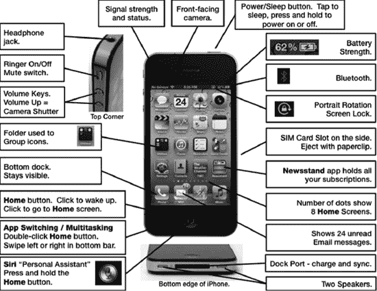

**图 1.** *iPhone 的按钮、接口、开关和按键*

#### 切换应用（即多任务处理）

iPhone 4 引入的出色新功能之一是多任务处理或在应用之间切换的能力（参见图 2）。

双击 `Home` 按钮，在屏幕底部调出 `App Switcher`（应用切换器）栏。接着，向右滑动查看更多图标，然后轻点您想要启动的任何应用的图标。如果您没有看到想要的图标，请单击 `Home` 按钮以查看整个 `Home`（主屏幕）屏幕。重复这些步骤即可跳转回您刚离开的应用。好的一点是，您刚刚跳转离开的应用始终显示在 `App Switcher`（应用切换器）栏的第一个位置。

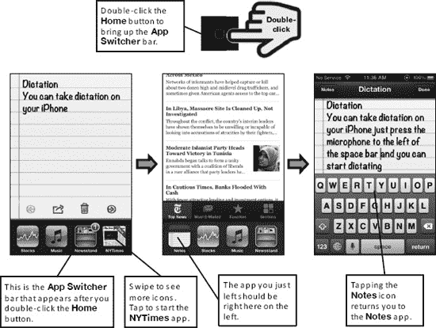

**图 2.** *通过双击 `Home` 按钮进行多任务处理（切换应用）。*

### 使用 Siri（你的个人助理）

有两种方式可以启动你的个人数字助理 `Siri`。首先，你可以长按 **主屏幕** 按钮。或者，如果你的 `iPhone` 已开机，并且在“设置”中启用了该功能（请参阅第 7 章：“多任务处理与 Siri”），只需将设备举到耳边即可。

你的 **主屏幕** 会向上滑动，露出一个银色的 **麦克风** 图标。在开始说话前，请等待 `Siri` 发出提示音，然后用清晰的声音、适中的语速说话，就像你与另一个人交谈一样。说完后，等待 `Siri` 再次发出提示音，乐趣便由此开始。

Apple 建议你像与人交谈那样与 `Siri` 对话。不必刻意记忆一套固定的指令或查询列表——其种类和变化实在太多。只需说出你想要什么即可。以下是 `Siri` 能为你做的一些示例：

*   设置提醒事项、日历约会、时钟闹钟和计时器。
*   发送短信、iMessage 和电子邮件。
*   播放音乐。
*   搜索基于位置的信息，例如餐厅和商家列表，然后搜索前往这些（及其他）地点的路线。
*   回答诸如让 iPhone 嫁给你之类的愚蠢问题！

当你将这些功能整合到交互中时，真正的乐趣才开始。`Siri` 可以读取邀请晚餐约会的消息、搜索餐厅、获取路线、发回确认信息，并添加晚餐约会——所有这些都作为交互式确认的一部分。请参阅第 7 章：“多任务处理与 Siri”了解详情。

### 使用语音听写

`iPhone` 键盘新增了一个小巧的 **麦克风** 按钮，位于 **空格键** 的左侧。

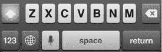

轻点它，你的屏幕会向上滑动，露出一个发光的紫色麦克风。像对 `Siri` 说话一样对它说话；完成后，轻点 **完成** 按钮。你所说的一切都会被转写并作为文本输入。

虽然没有完美的文本转语音引擎，但 `Siri` 在转写你所说内容方面做得相当不错。如果出现任何错误，只需像编辑键盘输入的文本那样进行编辑。了解更多信息，请参阅第 7 章：“多任务处理与 Siri”。

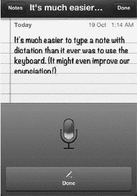

### 音乐控制与竖排屏幕旋转锁定

如果你在 **应用切换器** 栏中从左向右滑动，还会看到几个图标。你可以通过轻点最左侧的图标来锁定屏幕旋转，中间的按钮用于控制当前播放的音乐或视频。最右侧的最后一个图标将启动你的 **音乐** 应用（请参阅图 3）。

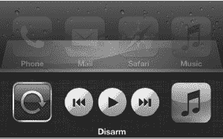

**图 3.** *位于 **应用切换器** 栏中的 **屏幕旋转锁定** 按钮、**音乐** 应用控件以及 **音乐** 图标*

### 启动应用与使用软键

某些应用在屏幕底部设有软键，例如图 4 中显示的 **音乐** 应用。

要查看并使用 **音乐** 应用中的软键，你的 iPhone 上必须有一些内容（例如音乐、视频和播客）。请参阅第 3 章：“使用 iCloud、iTunes 等进行同步”，了解如何将音乐、视频等同步到 iPhone。按照以下步骤启动 **音乐** 应用并熟悉使用软键进行操作：

1.  轻点 **音乐** 图标以启动 **音乐** 应用。
2.  触摸底部的 **歌曲** 软键以查看你的专辑。
3.  触摸 **播放列表** 软键以查看你的艺人列表。
4.  尝试 **音乐** 应用中的所有软键。
5.  在某些应用中，例如 **音乐** 应用，你会在右下角看到 **更多** 软键。轻点此键可查看其他软键，甚至重新排列你的软键。

**提示：** 你可以通过软键是否高亮显示（通常带有颜色）来判断哪个被选中。其他软键为灰色，但依然可以触摸。

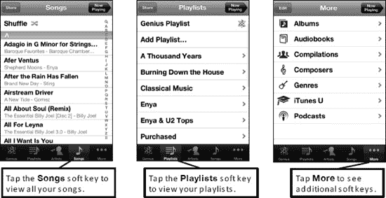

**图 4.** *在应用中操作软键*

### 菜单、子菜单与开关

进入应用后，你可以通过简单触摸来选择任何菜单项。以 **设置** 应用为例，轻点 **声音与触感**，然后轻点 **电话铃声**，如图 5 所示。

子菜单是主菜单下的任何菜单。

**提示：** 如果你在菜单项旁边看到 **大于号** 符号（`>`），则表示存在子菜单或另一个屏幕。

如何返回上一个屏幕或菜单？轻点菜单顶部的按钮即可。例如，如果你在 **电话铃声** 屏幕，只需触摸 **声音与触感** 按钮。

你会在 iPhone 上看到许多开关，例如图 5 中 **飞行模式** 旁边的开关。要设置开关（例如，将开关从 **关** 更改为 **开**），只需触摸它即可。

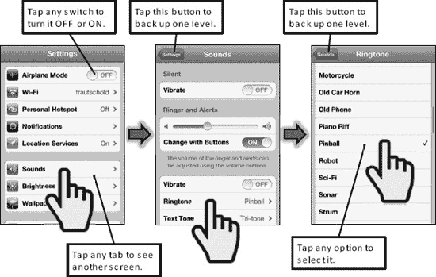

**图 5.** *选择菜单项、导航子菜单以及设置开关*

### 解读连接状态图标

iPhone 上的大多数功能仅在连接到互联网时才能工作（例如电子邮件、浏览器、App Store 和 **iTunes** 应用），因此你需要知道何时已连接。理解如何读取状态栏可以节省你的时间并减少挫折感：

**蜂窝数据信号强度（1-5 格）：**

强  弱  无线电关闭 – 飞行模式 

**Wi-Fi 网络信号强度（1-3 个符号）：**

**强  弱  关 **

通过查看 iPhone **顶部** 状态栏的左端，你可以判断是否连接到网络以及连接的大致速度。表 1 显示了此状态栏上可能看到的典型示例。

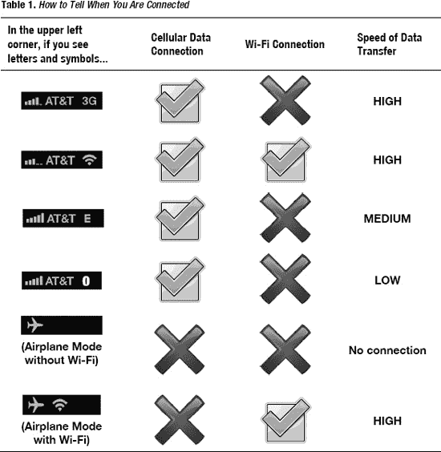

第 4 章：“连接网络”介绍了如何将 iPhone 连接到 Wi-Fi 或 3G 蜂窝数据网络。

## 在飞机上飞行——飞行模式

通常，当你在飞机上飞行时，机组人员会要求你在起飞和降落时关闭所有便携式电子设备。然后，当飞机升入高空时，他们会说“所有经批准的电子设备”可以重新开启。

**提示：** 请参阅第 4 章：“连接网络”中的“国际旅行”部分，了解你携带 iPhone 出国旅行时可以使用的许多省钱技巧。

如果你需要完全关闭 iPhone，请按住右上角的 **电源** 按钮，然后用手指 **滑动来关机**。

按照以下步骤启用 **飞行模式**：

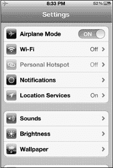

1.  轻点 **设置** 图标。
2.  将左栏顶部 **飞行模式** 旁边的开关设置为 **开**。
3.  注意，Wi-Fi 会自动关闭，并且 **电话** 将无法使用。

**提示：** 一些航空公司提供机上 Wi-Fi 网络。在这些航班上，你可能会想在适当的时候重新开启 Wi-Fi。

按照以下步骤，你可以关闭或开启 Wi-Fi 连接：

1.  轻点 **设置** 图标。
2.  轻点屏幕顶部的 **无线局域网**。
3.  要启用 Wi-Fi 连接，将页面顶部 **无线局域网** 旁边的开关设置为 **开**。
4.  要禁用 Wi-Fi，将同一开关设置为 **关**。
5.  选择 Wi-Fi 网络，并按照空乘人员提供的步骤连接机上 Wi-Fi。

## 触控屏基础

在本节中，我们将介绍如何与 iPhone 的触控屏进行交互。

#### 触屏手势

iPhone 配备了一块极为灵敏且直观的触控屏。以设计易于使用的 iPad、iPod touch 和 iPod 设备而闻名的苹果公司，这次带来了一块分辨率更高、响应更灵敏的出色触控屏。

如果你习惯了实体键盘和轨迹球或触控板，甚至是 iPod 上直观的滚轮，那么这块触控屏可能需要花些功夫才能掌握。不过，稍加练习，你很快就能熟练地与你的 iPhone 进行交互体验了。

你可以通过组合使用以下操作，在 iPhone 上完成几乎所有任务：

- 触屏“手势”
- 点击屏幕上的图标或软按键
- 点击底部的`主屏幕`按钮

以下各部分将介绍你可以在 iPhone 4 上使用的各种手势。

### 轻点与轻拂

要启动应用、确认选择、选择菜单项或选择答案，只需轻点屏幕。要在通讯录、列表和`列表`模式下的音乐资料库中快速浏览，可以向侧面或上下轻拂以滚动浏览项目。图 6 展示了这两种手势。

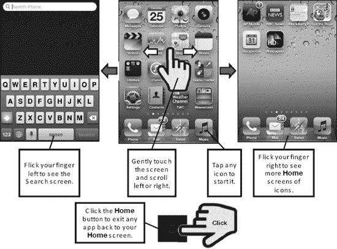

**图 6.** *基本触屏手势*

### 轻扫

要执行轻扫操作，请如图 7 所示，轻轻触摸并移动手指。你也可以用此操作在打开的`Safari`浏览器网页和图片之间切换。在列表（例如`通讯录`列表）中，轻扫同样有效。

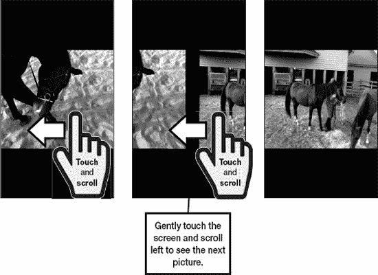

**图 7.** *触摸并轻扫以在图片和网页之间切换。*

#### 滚动

滚动操作非常简单，只需触摸屏幕，然后朝你想滚动的方向滑动手指即可（参见图 8）。你可以在邮件、报刊杂志应用、`Safari`网页浏览器、菜单等许多地方使用此技巧。

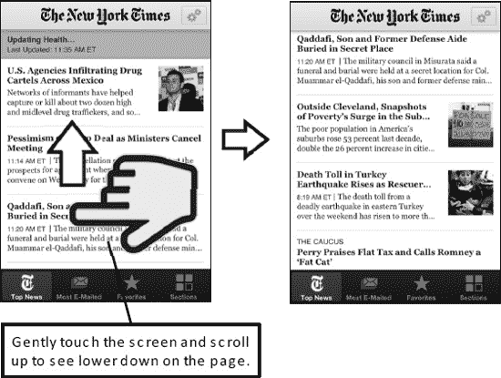

**图 8.** *触摸并滑动手指，即可在网页、放大后的图片等区域中滚动浏览。*

#### 双击

你可以双击屏幕来放大视图，然后再双击以缩小复原。此操作在网页、邮件和图片等许多地方都适用（参见图 9）。

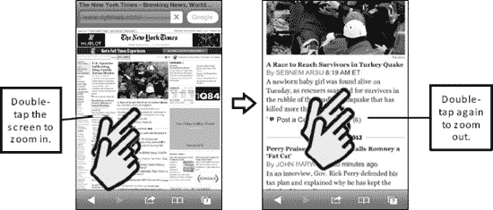

**图 9.** *双击放大或缩小*

## 捏合

你也可以通过双指捏合或张开来进行放大或缩小。此操作在网页、邮件和图片等许多地方都适用（参见图 10）。请按照以下步骤使用*捏合*功能进行放大：

1. 要放大，请将两根手指并拢放在屏幕上：
2. 逐渐张开手指。屏幕随之放大。

请按照以下步骤使用捏合功能进行缩小：

1. 要缩小，请将两根手指分开一定距离放在屏幕上。
2. 逐渐合拢手指，直至它们接触。屏幕随之缩小。

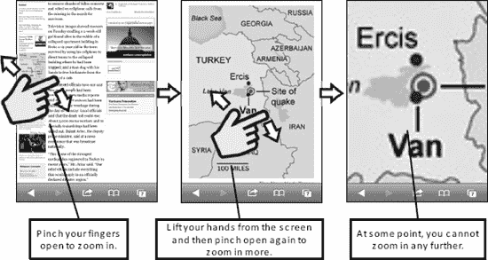

**图 10.** *双指张开以放大，双指合拢以缩小。*

### 应用程序参考表

本部分提供了一系列便捷的参考表，根据功能对 iPhone 上预装的各种应用程序进行了分类。表中还包含了您可以从 App Store 下载的其他实用应用程序。每个表格都提供了相应应用程序的简要描述，并说明了您可以在本书的何处找到关于它的更多信息。

#### 快速上手

表 2 提供了一些快速链接，可帮助您将 iPhone 连接到网络（使用 Wi-Fi 或 3G）；购买和欣赏歌曲或视频（使用`iTunes`、`音乐`和`视频`应用）；让 iPhone 进入睡眠或关机；解锁 iPhone；使用电子`相框`；以及更多功能。

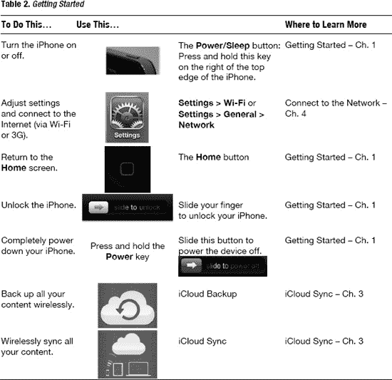

#### 保持连接与井然有序

表 3 提供了从整理和查找联系人，到管理日历、处理邮件、发送信息、获取驾车路线、拨打电话等一切相关操作的链接。

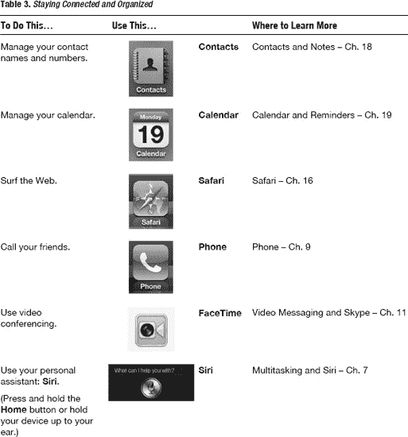

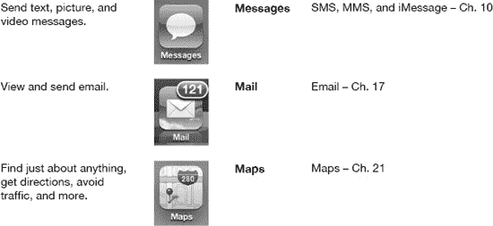

#### 尽情娱乐

您可以用 iPhone 获得许多乐趣；表 4 向您展示了具体方法。例如，您可以使用 iPhone 购买或租赁电影，通过`Pandora`收听免费网络电台，或使用`iBooks`以全新的方式购买和阅读一本书。如果您已经在使用 Kindle，可以将所有 Kindle 书籍同步到 iPhone 上并立即阅读。您还可以从 App Store 的数十万款应用中进行选择，让您的 iPhone 更出色、更有趣、更实用。您也可以从 Netflix 或 iTunes 租赁电影，立即下载以供日后观看（例如在飞机或火车上）。

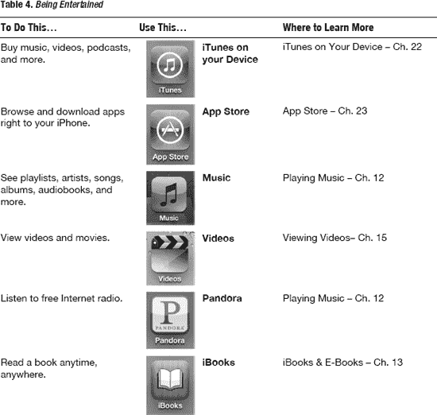

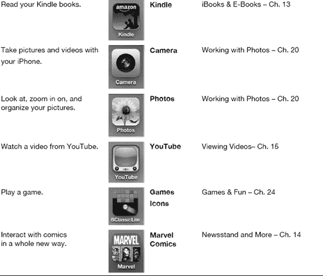

#### 掌握资讯

您还可以使用 iPhone 阅读最喜爱的杂志或报纸，享受配有最新鲜生动图片和视频的内容（参见表 5）。或者，您可以用它来查看最新的天气预报。

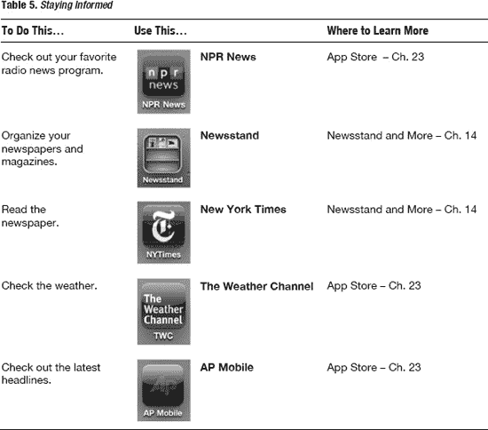

## 社交网络

您还可以使用 iPhone 上的社交网络工具与朋友、同事及专业网络保持联系并获取最新动态（参见表 6）。

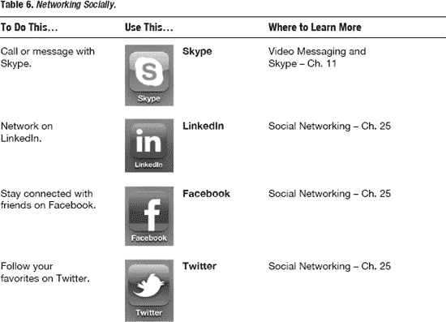

#### 高效工作

iPhone 还能帮助您提高工作效率。您可以使用`GoodReader`应用访问和阅读几乎任何 PDF 文件或其他文档。您可以使用基础的`备忘录`应用做笔记，或升级到功能强大的`印象笔记`高级应用，它拥有集成音频、图片和文本笔记的惊人能力，并能将所有内容同步到网站。您还可以使用 iPhone 设置闹钟、计算小费、查看行走方向以及录制语音备忘录（参见表 7）。

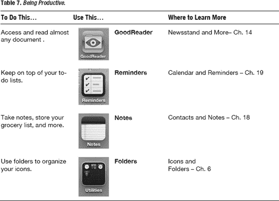

