# 第 1 章

## 开始使用

在本章中，我们将带您逐步了解您的新 iPhone 以及包装盒中的所有物品。我们还将研究充电的方方面面以及如何让电池续航更持久。要开始使用您的 iPhone，您需要将其连接到 iTunes 进行激活和注册。在本章末尾的“iPhone 基础”部分，我们将向您展示如何在 iPhone 上进行基本操作，以便您能快速上手并使用。

### 了解您的 iPhone

在本节中，我们将向您展示如何使用 iPhone 包装盒中的所有物品。我们还会给您一些关于 iPhone 电池和充电的技巧，讨论如何判断您的 iPhone 是否已经激活，并探讨 `Slide to Unlock` 功能。

#### 包装盒内包含的物品

如果你初次接触`iPhone`，包装盒里可能看起来内容不多。不过，它确实包含了开始使用和享受你的`iPhone`所需的一切——除了一本详尽的使用手册，而这正是我们撰写本书的原因！以下是包装盒内的物品：

* **`iPhone`**：打开盒子后，最顶层就会看到你的新`iPhone`。
* **纸质文件夹**：在`iPhone`的塑料托架下方，你会找到一个包含以下物品的纸质文件夹：
    * **使用技巧**：一本 4.5 英寸×2.5 英寸的小型折叠手册，共有 19 页，介绍`iPhone`的基本信息。
    * **`iPhone 产品信息指南`**：一本 4.5 英寸×2.5 英寸的小册子，字体太小难以阅读。这本书包含了与你的`iPhone`相关的所有法律条款、条件、警告和免责声明。
    * **苹果标志贴纸**：两张漂亮的白色苹果标志贴纸，有时你会看到它们出现在汽车车窗上。尽情享用吧！

在包装盒底部，你会找到如图 1–1 所示的物品：一副耳机、一根`USB`数据线和一个电源插头适配器。

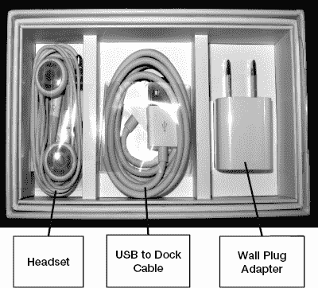

**图 1–1.** *手机包装盒底部的耳机、USB 数据线和电源插头适配器*

##### `iPhone` 耳机

耳机包含两个白色耳塞，用于收听音乐、视频或通话，以及一个附着在右耳塞线上小型控制器。将它插入你`iPhone`左上边缘的孔中。确保完全插入——按下时可能会有点紧。

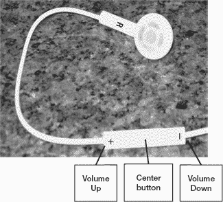

如下图所示，控制器上有**加号**（**`+`**）和**减号**（**`-`**）按键，以及一个**中央**按钮。你可以使用（**`+`**）和（**`-`**）键来调高或调低音量，并使用**中央**按钮来接听或挂断电话。

**注意：** 你可以通过单击两次或三次**中央**按钮来切换歌曲。双击切换至下一曲。三击返回上一曲。

随附的耳机还包含一个用于通话的小型麦克风。

##### `USB` 转底座数据线

`USB`转底座数据线用于将你的`iPhone`连接到电脑；它也可以兼作电源线使用。

##### 电源插头适配器

电源插头适配器的一端是`USB`插口，另一端是插入电源插座的插头。只需将`USB`数据线连接到`iPhone`，再将另一端连接到电源适配器，即可通过墙插为`iPhone`充电。

#### 取出或安装`SIM`卡

为了能够在 AT&T/GSM 网络的`iPhone`（目前除 Verizon 版`iPhone`外的所有`iPhone`）上拨打或接听电话，你需要有一张`SIM`卡（用户身份识别卡）。每部新的 GSM 版`iPhone`出厂时都应已预装一张`SIM`卡。

**注意：** 与`iPad`和`iPhone 4`一样，`iPhone 4S`使用的是新型 MicroSIM 标准——而非多数其他手机上常见的 MiniSIM。

在某些情况下，你可能需要取出并更换`SIM`卡。例如，当你在国际旅行时，或者刚收到一部替换的`iPhone`并想使用旧手机中的`SIM`卡时。

请按照以下步骤弹出并取出你`iPhone`的`SIM`卡：

1. 将回形针插入`iPhone`右侧的小孔中。将回形针笔直插入，直到`SIM`卡托盘弹出。
2. 取出托盘，以便取出或更换`SIM`卡。
3. 插入`SIM`卡时，确保`SIM`卡的缺口朝向托盘的右上角。它应与托盘齐平放置，金属触点朝向托盘底部。
4. 将`SIM`卡托盘滑回`iPhone`中，直至其卡入到位。

#### 为`iPhone`充电及电池使用提示

你的`iPhone`可能已有一些电量，但你或许希望将其完全充满，这样在完成设置后就能享受数小时不间断的使用。充电的时间正好让你有机会阅读本章的其余内容、安装或更新`iTunes`应用，或者了解所有酷炫的`iPhone`应用（参见第 23 章：“神奇的 App Store”）。

##### 通过电源插座充电

为`iPhone`充电最快的方式是将其直接插入墙上的电源插座。你使用的是连接`iPhone`和电脑的同一根`USB`数据线。如下图所示，将数据线较宽的一端插入`iPhone`底部的端口（靠近**主屏幕**按钮），将`USB`数据线的另一端插入电源插头适配器。最后，将适配器插入任何墙上的电源插座。

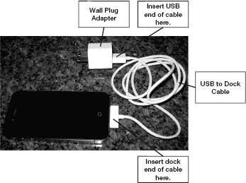

你可以通过查看屏幕来判断`iPhone`是否正在充电。在屏幕右上角的电池电量指示器中，你会看到一个闪电或插头图标。

**主电池**图标会显示你的充电状态。右侧的图片显示了一部正在充电且电池几乎充满的`iPhone`。

**提示：** 一些新型汽车内置有电源插座（就像你家中一样），可以用来插上`iPhone`的电源线。有些车型还提供了底座选项，让你可以从汽车音响控制器上操作`iPod`应用。这些插座有时隐藏在前排座椅后方的中央扶手箱内。

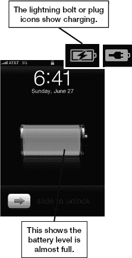

##### 通过电脑充电

你也可以将`iPhone`连接到电脑进行充电，不过速度会比直接连接墙式充电器稍慢一些。

**提示：** 尝试使用电脑上不同的`USB`端口。一些`USB`端口共享总线，消耗的功率较小，而另一些则拥有独立总线，可提供更大的功率。

为了获得最佳充电效果，你的电脑应插入墙上的电源插座。如果电脑未连接电源插座，你的`iPhone`仍然可以充电，但速度会更慢。请记住，如果笔记本电脑进入睡眠状态或你合上屏幕，`iPhone`将会停止充电。

**提示：** 你可以显示剩余电量的具体百分比。操作方法如下：点击`设置`图标`通用``用量`。最后将`电池百分比`设置为`开`。

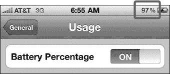

##### 通过其他配件充电

某些专为`iPhone`设计的配件也可以为其充电。最常见的是 iPhone/iPod 音乐底座。这些是插入`iPhone`后可以听音乐的扬声器系统。只有当屏幕上出现以下警告信息时，`iPhone`才不会充电：“此配件不支持充电”。这种情况通常出现在较旧的配件或并非专为你的`iPhone`设计的配件上。

**提示：带外置电池的保护壳**

有些保护壳本身就集成了外置电池。市面上有多个制造商提供此类产品。其中一家供应商 mophie（[`www.mophie.com`](http://www.mophie.com)）就为`iPhone 4`和`iPhone 4S`型号提供了名为*juice pack air*和*juice pack plus*的保护壳。

##### 预期电池续航时间

苹果公司表示，配备更大容量电池和先进技术的`iPhone`，其续航时间应比`iPhone 3Gs`更长（参见表 1–1）。

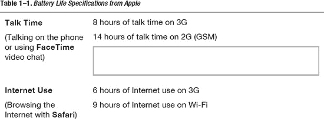

这些电池续航时间是在理想条件下，使用全新的、完全充满电的电池测得的。你会注意到，随着时间的推移，实际电池续航时间会逐渐缩短。

##### 电池与充电提示

关键问题在于：如何最大限度地利用电池续航时间，并确保你的`iPhone`在你需要时已充满电并准备就绪？在本节中，我们将介绍一些技巧来帮助你实现这一点。

###### 让每次充电更持久

要延长电池续航时间，请尝试以下建议：

-   **降低屏幕亮度**：轻点**设置**  **亮度**，然后使用滑块将亮度降低到仍能正常使用、且不到一半的位置。
-   **关闭定位服务**：如果你不需要将实际位置信息发送给应用，可以将其关闭。轻点**设置**  **通用**  **定位服务**，然后将**定位服务**设置为**关闭**。如果你进入需要你位置信息的应用，系统会提醒你重新开启。
-   **设置更短的自动锁定**：此功能可缩短 iPhone 在闲置时进入睡眠模式（即关闭屏幕）的时间。缩短此时间有助于节省电池电量。操作方法：轻点**设置**  **通用**  **自动锁定**，然后将**自动锁定**设置为尽可能短的时间——如果你愿意，可以将其设置为**1 分钟**。
-   **关闭推送邮件和推送通知。**
-   **关闭 Siri 的“抬起说话”功能**。轻点**设置**  **通用**  **Siri**，然后将**抬起说话**设置为**关闭**。

你可以访问 Apple 网站 [`www.apple.com/batteries/iphone.html`](http://www.apple.com/batteries/iphone.html) 了解更多关于延长电池续航时间的提示。

###### 让电池更耐用

iPhone 使用可充电电池，其使用寿命内充电次数有限；换句话说，随着时间的推移，电池保持电量的能力会逐渐下降。确保每个月至少将电池完全耗尽一次，可以延长 iPhone 电池的寿命。这样做有助于可充电电池更持久耐用。

###### 寻找更多充电地点

无论如何，如果你真的经常使用 iPhone，你会想找到更多地方和方式来为它充电。除了使用电源线或连接电脑，你还可以利用表 1–2 中描述的充电技巧。

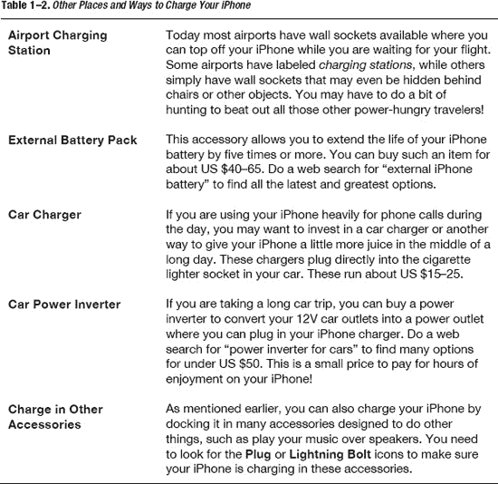

### 设置你的 iPhone

至此，你已经了解了 iPhone 的一些基本知识以及如何充分利用电池。现在，你可以开始享受它了！下一步就是设置你的 iPhone。

#### 判断是否需要设置 iPhone

如果你看到类似于这里显示的**欢迎**屏幕，则需要先设置 iPhone 才能使用。通过 iOS 5，你可以通过几种方式设置 iPhone。首先，你可以利用 Wi-Fi 网络和 iCloud 进行空中（OTA）设置。或者，你可以使用 USB 底座连接线将手机连接到电脑，并通过 iTunes 服务激活。

如果这是你的第一部 iPhone，或者你想将其设置为全新 iPhone，你可能希望使用 iCloud OTA。

如果你是从 iPhone 4 或更早型号升级，你可能希望使用 iTunes 服务从备份中恢复。

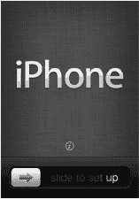

### 使用 iCloud 通过无线方式设置 iPhone

借助 iOS 5，Apple 终于摆脱了 iTunes 的束缚。这意味着你不再需要将 iPhone 连接到电脑来激活或设置它。相反，你可以使用 Apple 的全新 `iCloud` 服务，直接从 iPhone 通过 OTA 进行激活。

**注意：** 在初始设置过程中，你将能够连接到任何可用的 Wi-Fi 网络，这是使用 iCloud 通过 OTA 设置 iPhone 所必需的。如果你家里、工作单位或学校的 Wi-Fi 网络不可用，并且身边没有像星巴克这样的公共接入点，那么你需要稍后再激活 iPhone。（你也可以选择通过电脑上的 iTunes 来设置 iPhone；但是，你仍然需要互联网连接来连接到 Apple 的激活服务器。）

按照以下步骤使用 iCloud 设置你的 iPhone，如之前显示的**欢迎**屏幕所示：

1.  触摸**箭头**按钮，并按指示方向在屏幕上滑动来进行设置。
2.  选择你想在 iPhone 上使用的语言。Apple 会根据你购买 iPhone 的地点提供最常用的选项；不过，你也可以轻点**向下箭头**以获取更多语言选项。
3.  选好首选语言后，轻点屏幕右上角的蓝色**下一步**按钮。

   

4.  选择你的国家或地区。同样，Apple 会根据你购买 iPhone 的地点提供默认选项；不过，你可以轻点**显示更多...** 来展开列表。轻点蓝色**下一步**按钮继续。
5.  决定是否要启用或禁用定位服务，然后轻点蓝色**下一步**按钮继续。

   **注意：** `定位服务`使用 GPS、基站三角定位和 Wi-Fi 路由器映射来确定你 iPhone 的大致位置。此功能用于逐向导航（如 TomTom）、签到游戏（如 Foursquare）、社交网络（如 Facebook）、地理标记（在**相机**应用中）以及实用工具（如“查找我的 iPhone”）。除非你有特殊需要全局禁用所有定位服务，否则你可能希望现在就开启定位服务功能。稍后你可以在**设置**应用中有选择地禁用或启用这些服务（例如，关闭**相机**应用的地理标记，但保留 TomTom 的逐向导航）。

6.  选择你的 Wi-Fi 网络，输入网络密码，然后轻点蓝色**下一步**按钮继续。
7.  你的 iPhone 现在将连接到 Apple 进行激活。根据你的连接速度和 Apple 服务器的繁忙程度，这可能需要几秒钟到几分钟的时间。
8.  激活完成后，你将看到设置手机为新 iPhone、从 iCloud 备份恢复或从 iTunes 恢复的选项。

### 使用 iCloud 设置新 iPhone

如果这是你的第一部 iPhone，或者你只想有个干净的新开始，请选择**设置为新 iPhone**。

**提示：** 从备份恢复——尤其是从不同设备的备份恢复（例如，从 iPad 备份恢复 iPhone）——有时会导致问题，例如应用崩溃更频繁或电池续航下降。如果你在从之前的备份恢复后遇到问题，可以尝试将手机设置为新 iPhone。你需要从头重新设置所有账户和偏好，并且会丢失所有已保存的应用和游戏数据；然而，如果你的 iPhone 已不稳定到无法日常使用，这有时是你唯一的选择。

要将手机设置为新 iPhone，你需要登录已有的 Apple ID，或者创建一个新的免费 Apple ID。Apple ID 可以是以下任意一种：

- **iTunes ID**：这是你用于登录 iTunes 并购买音乐、电视节目、电影、App Store 应用和游戏以及 iBooks 的电子邮件地址和密码。
- **免费 Apple ID**：这是你用于登录“查找我的 iPhone”、FaceTime、Game Center、iCloud 或任何其他近期免费 Apple 服务的电子邮件地址和密码。它也可以是你用于在线 Apple Store 购物的同一个 ID。

**注意：** 如果你使用 Apple 产品和服务已有一段时间，一个人拥有多个 Apple ID 的情况并不少见。例如，你可能有一个 iTunes ID、一个旧的 MobileMe 账户以及一个 Apple Store ID。遗憾的是，截至撰写本文时，Apple 不允许合并这些 ID，因此你必须选择其中一个用于 iCloud。

如果你有旧的 MobileMe 账户，Apple 会将其迁移到 iCloud。请访问 [`http://www.me.com/move`](http://www.me.com/move) 开始此流程。

否则，作者建议你使用你的 iTunes ID，因为它会关联你所有的音乐、媒体、应用和游戏购买记录，并且你将能够利用 iCloud 的重新下载功能，现在和将来都能轻松地将这些购买内容恢复到你的新设备上。

如果你已有 Apple ID，请立即登录，接受条款与条件，然后跳转到“配置 iCloud 选项”部分。如果你没有 Apple ID，请立即创建一个。

### 创建免费 Apple ID

如果你从未使用过 iTunes，也没有 Apple ID，则需要创建一个。你可以在 iPhone 上快速完成此操作：

1.  轻点**创建新 Apple ID**。
2.  滚动**年**、**月**和**日**滚轮输入你的生日以设置正确日期，然后轻点蓝色**下一步**按钮。
3.  在相应字段中输入你的名字和姓氏，然后轻点蓝色**下一步**按钮。

    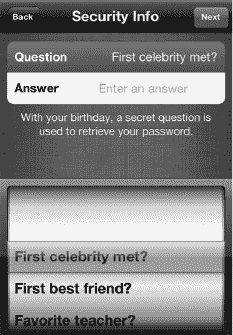

4.  选择是使用现有电子邮件地址（例如 Gmail、Hotmail、Yahoo! 或个人电子邮件地址），还是创建一个新的 iCloud 电子邮件地址（`@me.com`）。如果你不想费心记忆新的电子邮件地址，可能更愿意使用现有地址。如果你希望将电子邮件分开管理，那么可能更愿意创建一个新地址。
5.  如果你要创建新的 iCloud `@me.com` 地址，请输入密码并点击**验证**。你的密码必须“强”，即必须包含大写和小写字母、至少一个数字，并且长度至少为八个字符。
6.  选择一个**安全信息**问题。这应该是你容易记住，但别人很难轻易猜到的信息（意味着其他人无法仅通过查看你的博客、Facebook、Google、Yahoo! 或其他在线个人资料页面来找到答案）。
7.  选择是否希望从此新地址接收来自 Apple 的电子邮件更新。如果不想，请将此选项设置为**关闭**。
8.  你需要接受条款与条件两次：首先轻点左下角的蓝色**同意**按钮，然后在弹出确认框出现时轻点半透明的**同意**按钮。同样，验证可能需要几秒钟。
9.  随后，Apple 将设置你的新 Apple ID。这可能需要几秒钟。

### 配置 iCloud 选项

使用你的 Apple ID 登录后，即可配置你的 iCloud 设置：

1.  如果你想使用**设置 iCloud**功能（我们建议你这样做，因为它是免费的，并提供大量有用的备份和同步功能），则保持 **iCloud** 选项设置为**开启**，然后轻点蓝色**下一步**按钮。
2.  选择是使用 iCloud 备份服务通过无线方式将你的 iPhone 备份到 Apple 的数据中心，还是通过 USB 使用 iTunes 备份到你的电脑。我们再次建议将 **iCloud** 设置为**开启**，因为它是自动的，你无需记住手动操作。

    

3.  **查找我的 iPhone** 服务是 iCloud 的免费组成部分，它可以显示你手机的大致位置（你能知道它是在家里还是在办公室，但无法知道具体房间），可以让它响铃以便你在手机掉到汽车座椅下或沙发后面时找到它，甚至在手机丢失或被盗时擦除所有个人数据。如果你想使用此功能，请将此选项保持设置为**开启**。
4.  大功告成！你的 iPhone 现已设置完毕，可以开始使用了。

### 使用 iCloud 恢复你的 iPhone

如果你之前曾使用 iCloud 备份过 iPhone，现在可以直接从你的设备通过无线方式从这个备份恢复：

1.  轻点**从 iCloud 备份恢复**。
2.  输入你的 iCloud Apple ID 电子邮件地址和密码。
3.  选择你想从中恢复的备份。通常，这将是最新的可用备份。
4.  你的 iPhone 将重新启动、下载备份并再次重启。此过程可能需要几分钟，特别是当你有大量数据需要恢复时。
5.  一旦你的 iPhone 恢复完成，你的应用将开始下载和安装。iCloud 可以同时下载和安装多个应用，你可以在恢复过程中继续使用你的 iPhone。

### 使用 iTunes 设置你的 iPhone

如果你不想使用 iCloud，或者想要从之前的 iTunes 备份中恢复数据，那么你仍然可以通过 USB 数据线在 PC 上设置你的 iPhone。

如果你尚未在电脑上安装 iTunes，请打开网页浏览器并访问 [`www.itunes.com/download`](http://www.itunes.com/download)。从提供的链接下载该软件。

如果你已安装 iTunes，则应检查是否有更新版本可用。截至本书出版时，最新版本为 10.5 版。请按以下步骤更新你的 iTunes 版本：

1.  启动 `iTunes` 应用。
2.  如果你使用的是 Windows 系统，请从菜单中选择 `帮助`，然后选择 `检查更新`。
3.  如果你使用的是 Mac 系统，请从菜单中选择 `iTunes`，然后选择 `检查更新`。
4.  如果有可用更新，请按照指示更新 iTunes。

#### 从之前的备份中恢复你的 iPhone

第一次将新 iPhone 连接到 iTunes 时，你将看到如 图 1–2 所示的画面。

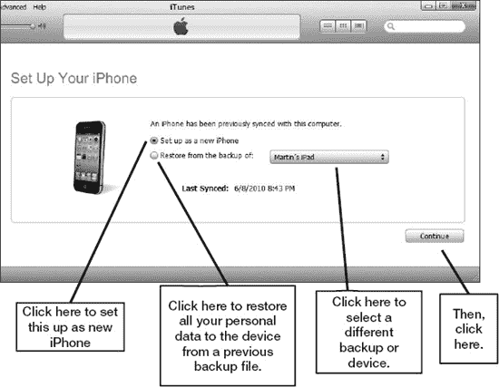

**图 1–2.** *设置你的 iPhone 画面*

**注意：** 我们听闻有些用户在将非 iPhone 设备（例如 iPad 或 iPod touch）的备份恢复到 iPhone 时遇到了问题（例如死机和电池续航缩短）。另外，选择 `恢复` 的前提是你已经为旧设备创建了备份；否则，将没有任何数据可以恢复到你的新 iPhone 上。

请按以下步骤从其他 iPhone 或设备的备份中恢复数据：

1.  点击 `从以下备份恢复：` 左侧的圆形单选按钮。
2.  从下拉菜单中选择特定的备份文件。
3.  点击 `继续` 按钮，将备份文件中的数据恢复到你的 iPhone 上。至此，你的 iPhone 初始设置已完成。

**注意：** 你仍需同步任何你想在新 iPhone 上使用的 App、游戏、音乐和其他媒体内容。

### 维护你的 iPhone

既然你已经使用 iTunes 完成了 iPhone 的设置，接下来你会想知道如何安全地清洁屏幕，以及如何用各种保护壳来保护它。

#### 清洁你的 iPhone 屏幕

使用 iPhone 一段时间后，你会发现你的手指（或别人的手指）在原本光洁的屏幕上留下了污迹和油渍。你需要知道如何安全地清洁屏幕。一种让屏幕在一天中保持更洁净的方法是给 iPhone 贴上屏幕保护膜，这样做还有一个额外的好处，就是可以减少眩光（下一节将讨论）。

我们还建议采取以下步骤：

1.  按住顶部的 `睡眠/电源` 键关闭 iPhone，然后使用滑动滑块将其关闭。
2.  拔下所有线缆，例如 USB 同步线。
3.  用柔软、不起毛的干布（比如清洁眼镜时用的那种布或类似材料）擦拭屏幕。
4.  如果干布效果不佳，可尝试在布上加一点点水使其微湿。如果使用湿布，请尽量防止水进入任何开口处。
5.  另一种选择是使用 Klear Screen 公司生产的 `iKlear` 屏幕清洁剂。该产品适用于你的 iPhone 以及其他设备，比如电脑、笔记本电脑或 iPad 屏幕。

**注意：** 切勿使用家用清洁剂、研磨性清洁剂（如 Soft Scrub）、含氨清洁剂（如 Windex）、酒精、喷雾剂或溶剂。

#### 你的 iPhone 保护壳和保护套

当你将 iPhone 握在手中时，你会注意到它的做工是多么精美。你同时也会发现，它可能相当滑，容易轻微晃动，或者在你打字时，它的背面可能会被刮花。

我们建议为你的 iPhone 购买一个保护壳。普通的保护壳大约售价 10 到 40 美元，而高档皮革保护壳的价格可能达到 100 美元甚至更高。花费少量资金来保护你价值 200 美元或以上的 iPhone，是非常明智的。

#### 在哪里购买保护壳

你可以在以下任何地方购买 iPhone 保护壳：

*   Amazon.com ([`www.amazon.com`](http://www.amazon.com))
*   Apple 配件商店 ([`http://store.apple.com`](http://store.apple.com))
*   iLounge ([`http://ilounge.pricegrabber.com`](http://ilounge.pricegrabber.com))
*   TiPB – iPhone + iPad 博客商店 ([`http://store.tipb.com/`](http://store.tipb.com/))

你也可以通过网络搜索“iPhone 保护壳”或“iPhone 保护套”来寻找。

**提示：** 你*或许*可以将为其他类型智能手机设计的保护壳用在你的 iPhone 上。如果为了省钱而选择此途径，请务必确保你的 iPhone 能牢固地放入你选择的保护壳或保护套中。

#### 购买什么...

以下部分列出了适用于 iPhone 的几种保护壳类型及其预期价格范围。

##### 橡胶/硅胶保护壳（10–30 美元）

橡胶和硅胶保护壳提供缓冲握持感，能吸收 iPhone 受到的撞击和磕碰，并将手机边缘（天线）与你的手指隔离开来。

**优点**：这类保护壳价格低廉、颜色鲜艳且握持舒适。它们还能防止你的手指干扰 iPhone 的天线，也就是手机的金属边缘。

**缺点**：不如皮革保护壳显得专业。

##### 带外置电池组的组合保护壳（50–80 美元）

与外部电池组组合的保护壳有双重用途：它们将硬壳保护壳的保护特性与可充电的外部电池组结合在一起。诸如 Mophie 和 Case-Mate 等制造商正忙于开发其 iPhone 版本的此类保护壳；幸运的话，当你读到这本书时，这些产品可能已经上市了。

**优点：** 这些保护壳既能保护你的 iPhone，又能大大提升电池续航——在某些情况下，它们能将电池续航时间延长 50% 以上。

**缺点：** 它们会增加手机的重量和体积。

##### 防水保护壳（10–40 美元）

防水保护壳能保护你的 iPhone 免受水的侵害，让你可以在雨中、泳池边、海滩上、船上等环境中安全地使用设备。

**提示：** 如果你喜欢划船或划桨，那么你会需要一个防水保护壳。可以查看一下 `SpeedCoach Mobile` 这款应用，你可以在 App Store 上以大约 65 美元的价格购买它。

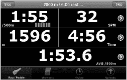

**优点**：这类保护壳能有效抵御各种水源的侵害。

**缺点**：它们可能会使触摸屏更难操作，并且通常不能防止跌落或碰撞。

##### 硬塑料/金属保护壳（20–40 美元）

硬塑料和金属保护壳能提供坚实的保护，防止刮擦、磕碰和短距离跌落。

**优点**：这类保护壳为你的手机提供了出色的保护。

**缺点**：它们会增加一些体积和重量。此外，在为 iPhone 充电时，你可能需要取下此类保护壳，否则手机可能会过热。

##### 皮革或特殊保护壳（50–100+ 美元）

皮革和其他特殊保护壳能提供更奢华的质感，并保护 iPhone。

**优点**：这类保护壳为你的手机增添了一抹奢华感，同时保护了设备的前部和后部。

**缺点**：它们价格更高，并且会增加体积和重量。

##### 屏幕保护膜（5–40 美元）

屏幕和后盖玻璃保护膜可以帮助你保护 iPhone 的屏幕和背部免受刮擦。

**优点**：这类保护膜通过防止刮擦来延长 iPhone 的使用寿命；大多数此类保护膜还能减少屏幕眩光。

**缺点**：某些保护膜可能会增加眩光或影响屏幕的触摸灵敏度。

### iPhone 基础入门

现在，你的 iPhone 已经充好电，屏幕干净整洁，并且配备了新的保护壳——接下来，让我们来看看操作其软件的一些基础知识。

#### 开机/关机与睡眠/唤醒

要开启你的 iPhone，请按住 iPhone 顶部边缘的 `电源/睡眠` 按钮几秒钟。如果 iPhone 完全关机，仅快速点击此按钮是无法开机的——在这种情况下，你需要按住按钮直到看到 iPhone 启动。

当你不再使用 iPhone 时，有两个选项：你可以将其置于睡眠模式，或完全关闭它。

睡眠模式的优势在于：当你想要再次使用 iPhone 时，只需轻点 `电源/睡眠` 按钮或 `主屏幕` 按钮即可唤醒 iPhone。如果你想最大限度地节省电量，或者知道将有很长一段时间不会使用 iPhone（例如睡觉时），则应将其完全关闭。操作方法是：按住 `电源/睡眠` 按钮，直到出现 `滑动来关机` 滑块。只需向右滑动滑块，iPhone 便会关机。

#### 辅助触控功能

作为其出色的辅助功能的一部分，苹果为有特殊身体或运动技能需求的人士提供了辅助触控功能。这些功能包括硬件按钮的触摸屏版本，以及常见和自定义手势。

请按照以下步骤启用辅助触控功能：

1.  轻点 `设置` 图标。
2.  轻点 `通用`。
3.  轻点页面底部的 `辅助功能`。
4.  轻点 `辅助触控`。
5.  将 `辅助触控` 开关设置为 `开`。
6.  当屏幕右下角出现 `辅助触控` 悬浮图标时，轻点该图标。
7.  轻点 `主屏幕` 以模拟物理按压硬件 `主屏幕` 按钮。
8.  轻点 `设备` 以访问其他硬件按钮模拟器，包括 `旋转屏幕`、`锁定屏幕`、`静音`/`取消静音`、`调高音量`、`调低音量` 和 `摇晃`。
9.  轻点 `手势` 或 `收藏`（收藏手势）以访问捏合、轻扫以及任何已设置的自定义手势。
10. 轻点悬浮菜单的中心以返回上一级菜单或退出辅助触控。

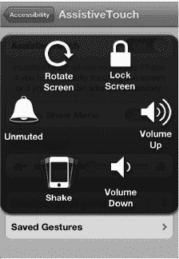

**注意：** 辅助触控还支持复杂的手势，包括自定义手势。

#### 滑动来解锁以及快速相机与媒体访问

你的 iPhone 激活后，你将看到 `滑动来解锁` 屏幕，如图 1–3 所示。

当有音乐播放时，双击 `主屏幕` 按钮可查看媒体控制，更重要的是，在你想要快速抓拍照片时，可以即时访问相机。轻点底部滑块旁边的相机图标。

要进入你的 iPhone，请将手指放在屏幕上，并沿着箭头路径向右移动 `滑动来解锁` 按钮。完成此操作后，你将看到 `主屏幕` 屏幕。

请注意底部 Dock 栏中的四个图标。此 Dock 栏中的项目不会移动，而其余图标可以在 *页面* 之间来回移动。你可以在 第 6 章：“图标与文件夹” 的“移动图标”部分中了解如何将你喜欢的图标移入底部 Dock 栏。

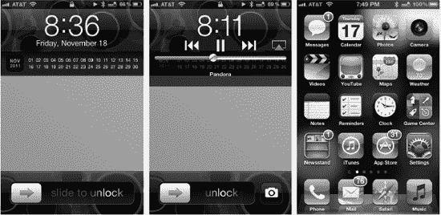

**图 1–3.** *滑动来解锁*、*快速相机与媒体访问* 以及你的主屏幕。

#### 在应用程序和设置屏幕内部导航

在 iPhone 应用程序的各屏幕之间导航非常简单，只需轻点屏幕即可：

1.  轻点 `设置` 图标以启动 `设置` 应用。
2.  轻点 `通用` 以查看通用设置。
3.  轻点 `网络` 以查看网络设置。
4.  你可以通过轻点任何开关来切换它。例如，轻点 `数据漫游` 旁边的 `关闭` 开关会将其切换为 `开启`。
5.  要返回上一级屏幕，请轻点左上角的按钮。在此例中，你应轻点 `通用` 按钮以离开 `网络设置` 屏幕。

#### 主屏幕按钮

你最常使用的按钮是 `主屏幕` 按钮。此按钮将启动你在 iPhone 上执行的所有操作。如果你的 iPhone 处于休眠状态，请按一次 `主屏幕` 按钮以唤醒你的 iPhone（假设它处于睡眠模式）。

按下 `主屏幕` 按钮也会使你退出任何应用程序并返回 `主屏幕` 屏幕。

#### 按住主屏幕按钮启动 Siri

按住主屏幕按钮即可启动你的个人助理。然后只需对着你的 iPhone 说话即可。如果你已启用 `抬起唤醒`，你也可以简单地将 iPhone 举到耳边并开始对 Siri 说话。我们将在 第 7 章 中向你全面介绍 Siri。

#### 双击主屏幕按钮访问快速应用切换器

访问快速应用切换器只需双击 `主屏幕` 按钮。

1.  在任何应用程序中或从 `主屏幕` 屏幕，双击 `主屏幕` 按钮。
2.  屏幕将向上滑动，你将在底部行看到一栏小图标。这些代表你自启动 iPhone 以来已启动的应用程序。
3.  轻点任意图标即可切换回该应用。
4.  向左滑动手指可查看更多应用。
5.  向右滑动手指可查看屏幕旋转锁定和媒体控制。
6.  再次向右滑动手指可查看音量和 AirPlay 按钮。

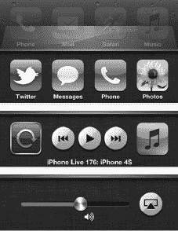

按照以下步骤从特定应用访问快速应用切换器：

#### 用于铃声和音频/视频播放的音量键

在 iPhone 的上左侧（见图 1–4），你可以看到一些简单的 `调高音量`/`调低音量` 键，你会发现它们非常实用。

##### 铃声音量

如果你没有播放歌曲、视频或其他内容，按下这些 `音量` 键将会调整手机铃声的音量。

**提示：** 当你在 `相机` 应用中时，`调高音量` 按钮会变成相机快门，让你可以快速拍照。

##### 静音手机铃声

在 iPhone 左侧 `音量` 键上方有一个开关。将 `铃声静音` 开关滑向 iPhone 背面可将其设置为 `开启`。当声音静音时，开关旁边会亮起一小块橙色指示灯。要关闭静音，只需将开关滑回 iPhone 正面方向即可（见图 1–4）。

##### 调整播放或通话音量

你可以使用 `音量` 键在听音乐、看视频、享受其他内容甚至打电话时调高或调低手机音量。听音乐或看视频时，你也可以使用屏幕上的滑块来调整音量（见图 1–4）。

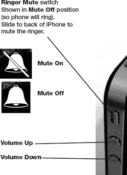

**图 1–4.** *在你的 iPhone 上调整音量或静音手机铃声*

#### 在竖屏（垂直）方向上锁定屏幕

如果你将 iPhone 侧向倾斜，你会注意到在某些应用程序中屏幕会旋转到横屏（水平）方向。你可能需要这种行为，以便使用更大的 `横屏` 键盘进行输入。然而，有时你可能不希望在你侧放 iPhone 时屏幕从竖屏方向旋转。针对这些情况，你可以将屏幕锁定在竖屏方向。

1.  双击 `主屏幕` 按钮。
2.  从左向右滑动以查看媒体和屏幕锁定控制。
3.  轻点左侧图标中的 `竖排方向锁定` 按钮。
4.  要禁用锁定，请再次轻点同一按钮。

**提示：** 方向锁定功能是在床上阅读 iBooks 的好方法。如果你更喜欢竖屏模式下较大的页面视图，请启用竖屏方向锁定功能。这样，当你将 iPhone 放在腿上或近乎水平地拿着它时，屏幕不会意外地旋转到横屏模式。更多信息，请参阅 第 13 章：“iBooks 与电子书”。

### 调整或禁用自动锁定超时功能

你会注意到，你的 iPhone 会在短时间后自动锁定并进入睡眠模式（即屏幕变黑）。你可以调整手机进入睡眠模式所需的时间，甚至完全禁用此功能，这些操作都在`设置`应用内完成。请按照以下步骤操作：

1. 在`主屏幕`上轻点`设置`图标。
2. 轻点`通用`。
3. 轻点`自动锁定`。
4. 你会在本页`自动锁定`选项旁边看到当前的睡眠间隔设置。默认设置是 iPhone 闲置三分钟后锁定（以节省电池电量）。你可以将此间隔设置为`1 分钟`、`2 分钟`、`3 分钟`、`4 分钟`、`5 分钟`或`永不`。
5. 轻点所需的设置以选中它——当你看到其旁边出现对勾时，即表示已选中。
6. 最后，轻点左上角的`通用`按钮，返回到`通用`屏幕。现在，你应该会看到你的更改已反映在“自动锁定”设置旁边。

**省电提示：** 将自动锁定功能设置为较短的时间间隔（例如`1 分钟`）将有助于节省电池电量。

### 调整日期、时间、时区和 24 小时制

通常，日期和时间要么会自动为你设置，要么会在你连接 iPhone 到电脑时进行调整；你可以在第 3 章：“与 iCloud、iPhone 等同步”中了解更多相关信息。不过，你也可以非常轻松地手动调整日期和时间。当您携带 iPhone 旅行并需要在降落后调整时区时，可能需要进行此操作。请按照以下步骤操作：

1. 轻点`设置`图标。
2. 轻点`通用`。
3. 向下滚动并轻点`日期与时间`，以查看`日期与时间`设置屏幕。
4. 如果你希望看到`09:30`和`14:30`，而不是`上午 9:30`和`下午 2:30`，则轻点`24 小时制`选项，将其开关设置为`开`。
5. 要手动设置日期和时间，你需要关闭自动时间设置功能。轻点`自动设置`旁边的开关，将此选项设置为`关`。

    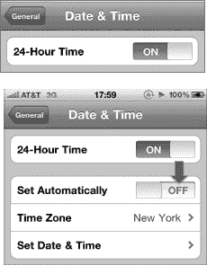

6. 要设置你的时区，请轻点`时区`并输入你所在时区的一个主要城市名称。输入时，iPhone 会显示匹配的城市名称。
7. 当你看到所在时区的正确城市时，轻点它以将其选中。在下面的图片中，我们输入了“Chicago”的前几个字母，直到它出现。接着，我们轻点了`美国，芝加哥`以将其选中。
8. 选择城市后，你将返回到主`日期与时间`屏幕，你选择的城市会显示在`时区`选项旁边。
9. 轻点`设定日期与时间`以调整你的日期和时间。

    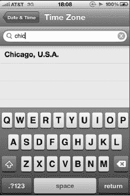

    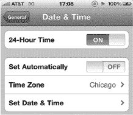

    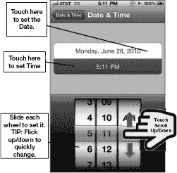

10. 在此屏幕上，你可以设置日期和时间。要调整日期，请轻点屏幕顶部显示的`日期`按钮。
11. 要调整时间，请轻点屏幕顶部显示的`时间`按钮。
12. 然后，你可以通过上下触摸并滑动`日期`和`时间`滚轮来调整日期和时间，如下方图片所示。
13. 完成后，轻点左上角的`日期与时间`按钮。

### 调整亮度

你的 iPhone 配备有自动亮度控制功能；此功能默认处于开启状态。此功能使用内置光线传感器来调节屏幕亮度。当室外较暗或夜晚时，自动亮度控制会调暗屏幕。当天气晴朗明亮时，屏幕会自动变亮，以便于阅读。通常，我们建议你将此功能保持为`开`状态。

如果你想调整亮度，请使用`设置`应用中的控制项。请按照以下步骤操作：

1. 从`主屏幕`轻点`设置`图标。
2. 轻点`亮度`并移动滑块控件以调整亮度。
3. 轻点`自动亮度`旁边的开关，将其切换为`开`或`关`。

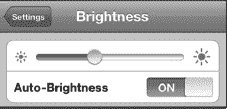

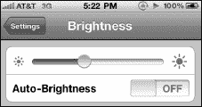

**提示：** 将`亮度`选项设置为较低的值有助于节省电池电量。亮度滑块位置略低于中间位置似乎效果不错。

### 通知

作为 iOS 5 的新功能，通知中心引入了一种更好、干扰更少、打扰更少的方式来组织和处理您在一天中收到的所有电话、电子邮件、短信、Twitter、Facebook、日历和其他提醒消息。

通知可以通过以下几种方式显示：

* 作为`锁定`屏幕信息，这样你无需解锁手机即可快速浏览重要提醒。（此选项会牺牲一些隐私。）
* 作为应用内通知，每当收到新消息时，会以简短、轮转的提醒形式显示在屏幕顶部。
* 在`通知中心`下拉菜单中，当您的 iPhone 解锁后，您可以随时随地向下一扫即可访问。

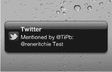

如果你以前使用过 iPhone，或者在 iOS 5 之前使用过 iPad 或 iPod touch，那么通知中心会在原有的声音/振动、数字标记和弹出式提醒等选项基础上增加新功能。由于它们不会中断操作，提醒不会中断你正在进行的`愤怒的小鸟`游戏或正在撰写的电子邮件，迫使你在继续游戏或写作之前必须关闭或打开它们。但你仍然可以选择处理那些你绝不能错过的事情，比如闹钟。

#### 锁定屏幕信息

**锁定**屏幕上的通知以两种不同方式显示：作为弹出窗口显示单条最新通知，以及作为下拉列表显示所有近期通知。

如果在 iPhone 锁定时收到单条通知，屏幕会亮起，该通知将出现在**锁定**屏幕中央的黑色方框中。同时，通知左侧会显示一个与该类型通知关联的应用图标。例如，电子邮件会显示**邮件**应用图标；短信会显示**信息**图标；未接来电会显示**电话**图标；Facebook 通知会显示**Facebook**图标，以此类推。此时，你可以执行以下几种操作：

* 忽略该通知。这会使你的提醒消失，iPhone 屏幕将重新进入待机状态。

  

* 抓住滑块（时间与日期正下方的三条灰色横线）并向下拖动，即可查看自上次解锁 iPhone 以来收到的所有通知列表。列表按通知类型排序，因此所有电子邮件会归为一组，所有日历事件、所有未接来电等亦如此。每条通知左侧，你还会看到相应的图标。

  **注意：** 如果你没有看到滑块，那是因为你没有近期通知。

* 无论是在单条通知框还是列表中，点击通知左侧的图标，然后**滑动以查看**（或收听）该通知，就像你通常**滑动以解锁** iPhone 一样。大多数情况下，你会被直接带到相应的应用，并显示完整的通知内容。例如，点击**邮件**应用图标并滑动，将解锁 iPhone、切换到**邮件**应用，并加载你刚刚收到的电子邮件。

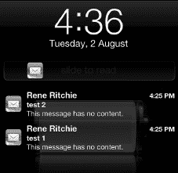

**注意：** 少数通知（如闹钟和系统消息，例如 iTunes 同步失败）可能还会在通知左侧显示一个按钮，例如闹钟的**稍后提醒**或同步失败的**确定**。点击按钮可延迟或解除通知。

**提示：** 如果你担心隐私问题，不想让任何人看到**锁定**屏幕上的个人电子邮件、短信或其他消息或提醒，可以在**设置**应用中将其关闭（请参阅本章后面的“配置通知中心”部分）。

#### 应用内通知

当 iPhone 解锁且你正在使用时，新收到的通知会短暂地在屏幕顶部以动画形式出现，然后旋转向下显示通知。无论你处于**主屏幕**、内置**电话**应用还是心爱的视频游戏中，都会如此。通知仅覆盖顶部几个像素，因此不会妨碍你正在做的事情（或游戏）。对于应用内通知，你可以执行两种操作：

* 忽略它，它会旋转向上并消失。（别担心：你可以通过点击**通知中心**下拉菜单再次查看该通知，后续章节会介绍此功能。）
* 点击通知，你会被直接带到关联的应用以查看完整消息。例如，点击后你会被带到**邮件**应用阅读电子邮件，或进入**信息**应用回复短信。

#### 通知中心

任何时候当 iPhone 解锁时，你都可以从屏幕最顶部向下滑动，拉出**通知中心**选项。通知中心结合了数量极为有限的*小组件*（撰写本文时有两个）以及一个与**锁定**屏幕所见类似的通知列表。

要关闭通知中心，从屏幕底部向上滑动即可。

撰写本文时可用的两个小组件是**天气**和**股票**：

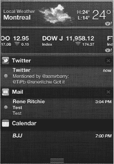

* **天气**小组件显示某个地区的当地天气（如果启用了基于位置的天气），或者显示你在内置**天气**应用中设置为第一个的城市天气（如果基于位置的天气已关闭或不可用）。它还会显示当天的最高、最低和当前温度。点击小组件上的任意位置，你会被带到**天气**应用。
* **股票**小组件显示你关注的股票行情，包括其近期市值以及显示近期涨跌的箭头。行情列表包含你在内置**股票**应用中当前设置的所有股票。点击小组件上的任意位置，你会被带到**股票**应用。

通知中心列表可用于以下应用和服务：

* **日历**
* **提醒事项**
* **电话**（未接来电、语音邮件）
* **信息**（短信/彩信/iMessage）
* **邮件**
* Game Center
* 你安装的、使用通知的任何其他应用或服务（例如 Twitter 等社交网络、**CNN** 等突发新闻应用，以及 OmniFocus 等任务管理器）

通知列表按应用划分，每个应用有一个标题栏。标题栏左侧是*应用图标*，后面跟着*应用名称*。标题栏右侧，你可以看到一个 **X** 图标。点击 **X** 图标可清除该应用的所有通知。例如，点击**邮件**图标右侧的 **X** 将清除所有电子邮件通知；但这不会清除任何其他通知。

在标题栏下方，你会看到该应用的所有当前（未读）通知，包括收到时间、发送者（如适用）以及内容预览。例如，你可能会看到最近的 Facebook 消息或 Game Center 挑战列表。点击列表中任何通知上的任意位置，都会切换到关联应用并显示完整消息。

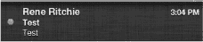

### 配置通知中心

通知中心可通过 `设置` 应用轻松配置：

1.  在主屏幕上点击 `设置` 应用图标。
2.  点击 `通知`。

通知中心可以**按时间**排序通知（小组件在上，然后按最新通知的顺序排列），也可以**手动**排序。请按照以下步骤手动重新整理通知：

1.  在 **排序应用** 下，点击 `手动`。
2.  在屏幕右上角，点击 `编辑` 按钮。
3.  每个应用的右侧会出现三个灰色横条形式的手柄。抓住手柄，将应用向上或向下拖动，按您最喜欢的顺序排列。
4.  当您将所有应用按所需顺序排好后，点击屏幕右上角的蓝色 `完成` 按钮。

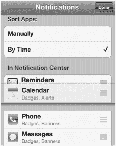

要显示或隐藏 `天气` 或 `股票` 小组件，根据需要点击相应小组件将其切换为 `开` 或 `关`。

要选择通知列表的工作方式，请按照以下步骤操作：

1.  点击您想要编辑的应用（例如 `邮件`）。
2.  将 `通知中心` 开关切换为 `关`，将该应用从通知中心完全移除。将其切换为 `开` 即可恢复。
3.  选择在列表中`显示`您偏好的通知数量。在撰写本文时，可供选择的选项限于 **1 个未读项目**、**5 个未读项目** 和 **10 个未读项目**。
4.  选择您偏好的应用内通知的`提醒样式`。
    -   `无` 表示您永远不会看到提醒。
    -   `横幅` 表示您会在屏幕顶部看到微妙的动画通知，不会打断您。如果您愿意，此选项可让您忽略该通知，这对于大多数通信通知（如电子邮件、短信、Facebook 等）非常有用。
    -   `提醒` 表示您会看到一个无法忽略的弹出框。您要么必须手动关闭它，要么立即对其采取行动。这对于闹钟、约会和其他紧急事项非常有用。

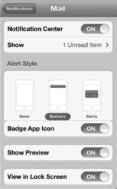

您还可以设置与通知相关的其他几个选项：

-   `标记应用图标`：此选项会在主屏幕图标的右上角添加一个红色小圆圈。这个红色圆圈表示每个应用包含的未读通知数量。例如，`邮件`图标上的数字 10 表示您有 10 封未读邮件在等待您。如果您希望不看到它们，可以将此功能切换为`关`；如果您希望显示它们，则切换为`开`。
-   `声音`：此选项允许您打开或关闭传入通知的音频（和振动）提醒。如果通知很紧急，比如短信，您可能希望将声音保持为`开`。
-   `显示预览`：此选项会添加与通知相关的消息的前几行，以便您一目了然地了解其大意。此功能使您无需滑动并点击进入应用即可查看通知内容，从而阅读整条信息。如果更注重隐私，您可能希望将此功能切换为`关`。
-   `在锁定屏幕中显示`：此选项允许您在`锁定`屏幕上打开或关闭通知。同样，如果涉及隐私问题，您可能希望将此功能切换为`关`。

**注意：** 并非所有应用在通知中心都有相同的选项。例如，有些应用可能提供声音提醒，而其他应用则没有。

当您关闭某个特定应用的通知时，它会被放到`设置`中的*不包含在通知中心内*独立列表里。这可以让您轻松查看哪些应用正在向您发送通知，哪些没有。

### 通知中心的辅助功能选项

Apple 为有特殊视觉或听力需求的人士提供了各种辅助功能选项，包括自定振动和 LED 闪烁以示提醒。

按照以下步骤启用通知的辅助功能选项：

1.  点击 `设置` 图标。
2.  点击 `通用`。
3.  点击页面底部的 `辅助功能`。
4.  将 `自定振动` 切换为 `开`，可为您的联系人分配独特的振动模式（可在`声音偏好设置`中创建模式）。
5.  将 `LED 闪烁以示提醒` 切换为 `开`，以便在有通知进来时让相机闪光灯闪烁。

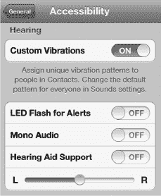

