# 第 2 章

## 键入、拷贝和搜索

在本章中，我们将向您展示一些在 iPhone 上键入的好方法，并在此过程中节省宝贵的时间。同时，我们还将向您展示如何使用`竖屏`（垂直/较小）和`横屏`（水平/较大）键盘。我们还会教您如何选择不同的语言键盘、如何键入符号以及其他技巧。

在本章后面，我们将介绍 Spotlight 搜索以及拷贝和粘贴功能。拷贝和粘贴功能将为您节省大量时间，并在您使用 iPhone 时提高准确性。

### 在 iPhone 上键入

您很快就会在 iPhone 上找到两个屏幕键盘：当您垂直握住 iPhone 时可见的较小`竖屏`键盘，以及当您水平握住 iPhone 时可见的较大`横屏`键盘。好在您可以选择最适合您的键盘。

#### 用两个拇指在屏幕上键入

您会发现，刚开始使用 iPhone 时，最容易的方式是用一根手指（通常是指食指）键入，同时用另一只手握住 iPhone。

过一段时间后，您应该能够尝试用拇指键入（就像您看到许多人在使用其他手机时那样，例如 BlackBerry 智能手机）。一旦稍加练习，用两个拇指代替一个手指键入将大大提高您的速度。请耐心点：要熟练地用两个拇指快速键入确实需要练习。

实际上，过一段时间后您会注意到，键盘的触摸灵敏度会假定您正在用两个拇指键入。这意味着键盘左侧的字母应在其左侧按下，而右侧的键应在其右侧按下。

在许多应用中，只需将 iPhone 横过来，键盘就会切换成更大的`横屏`键盘，使键入更容易。

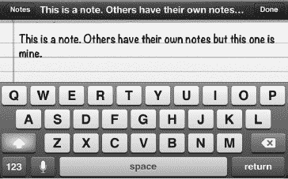

**提示：** 如果您手比较大，觉得在较小的竖屏键盘上键入有挑战性，那么请将 iPhone 侧放，即可获得更大的`横屏`键盘。

#### 使用快捷短语键入常用短语

iPhone 上一个不错的功能是能够为键入常用短语甚至是一些句子（例如去往您家或公司的路线）设置快捷输入。

**提示：** 在 iPhone 上键入常用短语时，使用快捷输入来节省时间。您甚至可以使用快捷输入来键入一些句子，例如如何到达您家，或者您经常键入的内容。

在`设置`应用中访问快捷短语。点击 `设置` 图标，然后点击 `通用`，再点击 `键盘`，然后向下滑动到屏幕底部以查看可用的快捷短语。

Apple 为您提供了一个 `omw` 的示例快捷短语。当您在 iPhone 上键入 `omw` 时，您会看到弹出窗口显示短语“在路上！”。

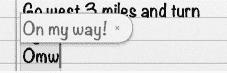

点击 `添加新的快捷短语` 以创建一个新的。

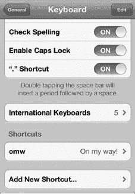

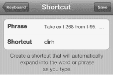

键入将要替换快捷短语的`短语`，然后键入`快捷短语`本身。在这个例子中，我们想要一个快捷短语来键入去往我们家的路线。所以我们设的`快捷短语`是 `dirh`，`短语`是一步一步到达我们家的路线。保存您的新快捷短语并试一下。

### 利用自动纠正功能节省时间

当你输入一段时间后，会开始注意到在某些单词正下方会出现一个小弹出窗口——这就是*自动纠正*功能。你定义的任何`快捷指令`也会以弹出建议的形式出现。

**注意**：如果你从未看到过`自动纠正`弹出窗口，则需要进入`设置`应用`通用``键盘`，然后将`自动纠正`设置为`开启`，以启用该功能。

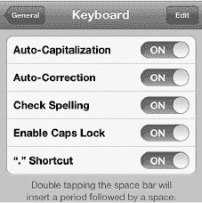

当你看到正确的单词被猜出时，只需按下键盘底部的`空格`键即可节省时间；这样操作便会选中该单词。

在下一个示例中，我们开始输入单词“especially”；当输入到其中的字母“c”时，正确的单词会出现在下方的弹出窗口中。要选中它，我们只需按下键盘底部的`空格`键（请参阅图 2–1）。

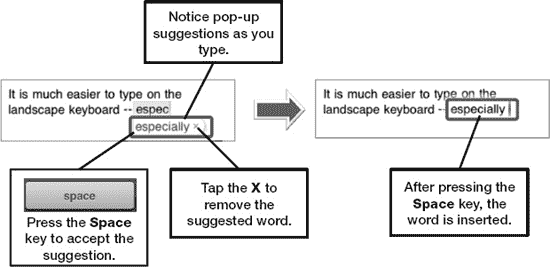

**图 2–1.** *使用自动纠正和建议单词*

你的第一反应可能是点击弹出的单词，但这只会从屏幕上清除该建议单词。实际上，更快捷的方式是继续输入，或者在看到正确的单词弹出时按下`空格`键。在大多数情况下，单词要么是正确的，要么会随着你的继续输入而变正确——从长远来看，这能减少手指的移动量。

**提示：** 自动纠正功能还会检索你的`通讯录`列表以提供建议。例如，如果马丁·特劳奇奥德（Martin Trautschold）在你的`通讯录`中，那么在你输入“Trauts”后，就会看到“Trautschold”作为自动纠正建议出现。

学会使用`空格`键后，你会发现这种弹出猜测功能能大大节省时间。毕竟，你原本在单词末尾也是需要输入一个空格的。

有时你会意外接受一个错误的自动纠正单词；这时，你只需按下`退回`键。这样做会弹出一个窗口，其中包含自动纠正功能更改之前的原始单词。你还会看到其他建议的替换词（请参阅图 2–2）。

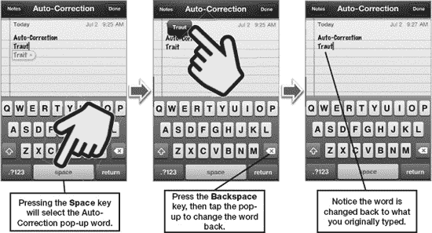

**图 2–2.** *处理错误的自动纠正单词*

**提示：** 使用自动纠正功能，你可以避免在许多常见缩略词（例如“wont”和“cant”）中输入撇号，从而节省时间。自动纠正功能会显示一个弹出窗口，其中包含拼写正确的缩略词；你只需按下`空格`键即可选中高亮显示的纠正结果。

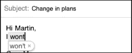

对于某些单词，你需要多输入一个字符，自动纠正功能才能判断你的意图：

*   输入“Weree”得到“We’re”。
*   输入“Welll”得到“We’ll”。

## 语音朗读自动纠正单词

你可以将 iPhone 设置为在自动文本和自动纠正单词出现时朗读它们。这可能有助于你选择正确的单词。请按照以下步骤启用此朗读功能：

1.  点击`设置`图标。
2.  点击`通用`。
3.  点击页面底部的`辅助功能`（需要向下滑动）。
4.  将`朗读自动文本`旁边的开关设置为`开启`。

启用此功能后，你将在输入时听到弹出的自动纠正单词被大声朗读出来。如果你同意听到的单词，请按`空格`键接受；否则，继续输入。这可以节省你从键盘上抬头看的时间。

### 拼写检查

与自动纠正功能协同工作的是 iPhone 内置的拼写检查功能。大多数时候，你拼错的单词会被自动纠正功能发现并自动更正。其他时候，单词可能不会被更正，但仍然是拼写错误的。你会看到 iPhone 认为拼写错误的单词下方会出现红色虚线，如图 2–3 所示。

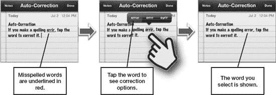

**图 2–3.** *使用内置拼写检查功能*

**提示：** 如果你的拼写检查功能中错误单词太多，你可以通过清除所有自定义单词来让它重新开始。请按照以下步骤操作：

1.  点击`设置`图标。
2.  点击`通用`。
3.  点击底部的`还原`。
4.  点击`还原键盘词典`。
5.  点击`还原词典`进行确认。

执行上述步骤将清除已添加到 iPhone 词典中的所有自定义单词。

### 辅助功能选项

iPhone 上有许多有用的辅助功能。例如，“旁白”选项可以为你朗读屏幕上显示的各种内容。它会告诉你点击了哪些元素、选择了哪些按钮以及所有可用选项。它还能朗读整个屏幕的文本。如果你希望看到更大的内容，还可以开启“缩放”选项，具体操作将在本章后面的“使用缩放功能放大整个屏幕”部分中描述。

## 让 iPhone 为你朗读（旁白）

iPhone 的一个很酷的功能是“旁白”选项。开启此功能后，你的手机将朗读屏幕上显示的任何内容。你甚至可以让它朗读任何电子邮件、文本文档，甚至`iBook`页面中的内容。

**提示：** 在公共场所时，请使用耳机并保持`旁白`选项为`开启`状态；这不仅能让你更清晰地听到朗读内容，还能避免打扰他人。

请按照以下步骤启用“旁白”功能：

1.  点击`设置`图标。
2.  点击`通用`。
3.  点击页面底部的`辅助功能`。
4.  点击`旁白`。
5.  将`旁白`开关设置为`开启`。

**注意：** 如右侧屏幕所示，“旁白”手势与常规手势不同。请点击“练习旁白手势”按钮来熟悉它们。

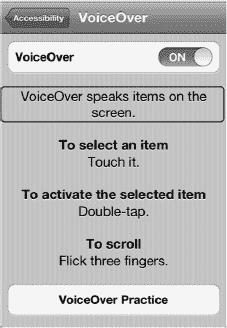

以下是使用“旁白”功能的一些额外提示：

*   向下滚动`旁白`屏幕以查看更多设置。
*   通过更改`朗读提示`选项的设置，来调整是否朗读提示。
*   使用旁白输入时，默认情况下你输入的每个字符都会被朗读出来。你可以通过点击`键入反馈`来更改此设置。在下一个屏幕上，你可以将此选项设置为`字符`、`单词`、`字符和单词`或`无`。
*   通过滑动此选项下方的滑块来调整`朗读速率`。
*   通过设置开关来调整是否使用`语音`和`音高变化`。

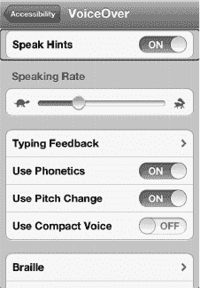

要让`备忘录`或`iBooks`应用为你朗读整个页面，你需要同时点击屏幕上文本块的底部和顶部。如果用一个手指点击文本，则只会朗读单行内容。

## 朗读所选内容与朗读自动文本

`朗读所选内容`功能与`旁白`类似，但它与“拷贝与粘贴”功能关联，会在所选文本的弹出菜单中添加一个`朗读`选项。`朗读自动文本`功能会大声读出拼写字典自动大写或更正的任何文本。

使用`朗读所选内容`功能时，你可以使用与旁白功能类型相同的滑块来调整朗读速率。`朗读自动文本`选项只能`开启`或`关闭`。

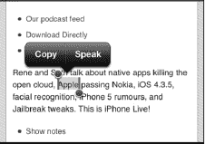

#### 使用辅助触控

如果你在触摸屏幕时有困难，或者使用特殊的配件来辅助触摸屏，那么你会想要开启“辅助触控”。在`设置`中的“辅助功能”部分即可进行设置。

开启后，屏幕右下角会出现一个小白圈。轻点这个小圆点，即可调出`AssistiveTouch`菜单。

辅助触控可让你执行以下操作：

* 轻点`手势`可模拟 2、3、4 或 5 指手势。
* 轻点`个人收藏`可访问你自定义的手势。
* 轻点`设备`可访问常用设备命令，例如屏幕旋转、静音、音量、晃动和锁定屏幕。
* 轻点`主屏幕`图标可模拟实际点击`主屏幕`按钮的操作。

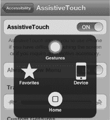

你甚至可以在“个人收藏”菜单中设置自定义手势以便访问。

轻点`创建新手势`，然后在屏幕上移动手指来创建屏幕手势。你会看到白色线条跟随指尖的移动轨迹。

接着，轻点`停止`按钮。

按下`播放`查看手势是否正确，最后轻点顶部的`存储`，并为新手势命名。

之后，你就能在“辅助触控”的`个人收藏`菜单中看到这个新手势。

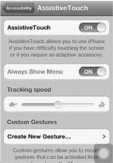

#### 使用缩放功能放大整个屏幕

如果你觉得屏幕上的文本、图标、按钮或其他内容看起来有点吃力，可能需要开启“缩放”功能。开启“缩放”功能后，你可以将整个屏幕放大到正常大小的近两倍——所有内容都更容易阅读。

**注意：** 你无法同时使用“旁白”和“缩放”功能；你需要选择其中一种。除了放大整个屏幕，你还可以使用“更大字体”功能仅增大主要应用的字体大小。我们将在“使用更大字体的文本以方便阅读”部分介绍具体方法。

请按照以下步骤启用`缩放`功能：

1. 轻点`设置`图标。
2. 轻点`通用`。
3. 轻点页面底部的`辅助功能`。
4. 轻点`缩放`。
5. 将`缩放`旁边的开关设置为`开启`。

与“旁白”类似，“缩放”也使用三指手势。在离开此屏幕前，请务必熟悉这些手势。

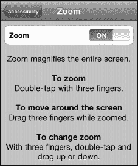

#### 白底黑字

如果屏幕上的对比度和颜色难以辨认，你可能希望将`白底黑字`设置设为`开启`。请按照以下步骤操作：

1. 如前所述，进入`设置`应用中的`辅助功能`屏幕。
2. 将`白底黑字`开关设为`开启`。启用此选项后，屏幕上所有浅色内容将变为黑色，所有深色或黑色内容将变为白色。

##### 使用更大字体的文本以方便阅读

通过使用“更大字体”功能，你可以显著增大`通讯录`、`邮件`、`信息`和`备忘录`应用中的字体大小。请按照以下步骤操作：

1. 轻点`设置`图标。
2. 轻点`通用`。
3. 轻点页面底部的`辅助功能`（需要向下滑动）。
4. 轻点`更大字体`。随后你将看到字体大小选项屏幕：`关闭`、`20 磅文本`、`24 磅文本`、`32 磅文本`、`40 磅文本`、`48 磅文本`和`56 磅文本`。轻点你希望使用的大小。右侧显示的图像使用的是 48 磅字体。
5. 轻点左上角的`辅助功能`按钮返回上一屏幕，然后轻点`主屏幕`按钮退出`设置`。

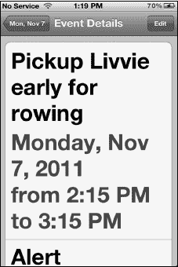

#### 连按三次主屏幕按钮选项

你可以设置连按三次`主屏幕`按钮来执行与辅助功能相关的各种操作。请按照以下步骤调整这些选项：

1. 如前所述，进入`设置`应用中的`辅助功能`屏幕。
2. 轻点页面底部附近的`连按三次主屏幕按钮`。
3. 从`关闭`、`切换旁白`、`切换白底黑字`或`询问`中选择。

### 使用放大镜编辑文本或放置光标

你是否曾多次在打字时，想要将光标精确地放置在两个字或两个字母之间？

在掌握放大镜技巧之前，这可能很难做到。操作方法是：长按你希望放置光标的位置（参见图 2-4）。一两秒后，你会看到`放大镜`图标出现。然后，手指按住屏幕并滑动以定位光标。松开手指后，你会看到`拷贝和粘贴`弹出菜单，但你可以忽略它。

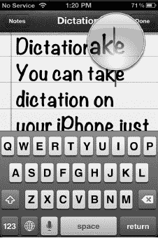

**图 2-4.** *长按屏幕可看到`放大镜`图标并放置光标。*

### 输入数字和符号

如何使用 iPhone 屏幕键盘输入数字或符号？打字时，轻点左下角的`123`键可查看数字和常用符号，例如`$ ! ~ & = # . _ - +`。如果需要更多符号，在“数字”键盘上轻点左下角`ABC`键上方的`#+=`键（参见图 2-5）。

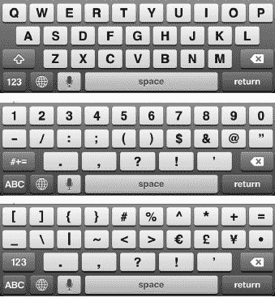

**图 2-5.** *在`字母`、`数字`和`符号`键盘之间切换*

**提示：** 输入数字或符号后，请注意`数字`键盘会保持激活状态，直到你按下`空格`键或按下切换到其他键盘的按键，例如切换到`字母`键盘的`ABC`键。

#### 触摸并滑动技巧

一种可以在许多地方应用的酷炫技巧是触摸并滑动。在接下来的几节中，我们将介绍它的用法以及如何利用它。

##### 输入大写字母

输入大写字母时，通常的做法是先按`Shift`键，然后再按所需的字母。

更快地输入单个大写字母和需要按`Shift`键的符号的方法是：按住`Shift`键，手指保持在键盘上，滑动到你想要的按键上，然后松开。

例如，要输入大写字母“D”，先按住右侧的`Shift`键，然后滑动到`D`键上再松开。

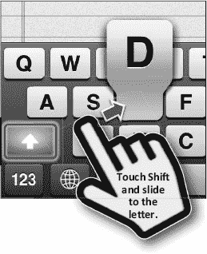

##### 快速输入单个数字

如果只需要输入一个数字，可以按住`123`键，然后将手指向上滑动到该数字上。但是，如果要连续输入多个数字，最好先按下`123`键，松开手指，然后再依次按下每个数字。

### 长按键盘快捷键输入符号等更多内容

你可能想知道如何输入键盘上未显示的符号。

**提示：** 你可以输入比屏幕上显示的更多的符号。

你只需长按与你想要的符号相关的字母、数字或符号即可。

例如，如果你想输入日元符号 (¥)，长按 `$` 键直到看到其他选项。接着，向上滑动手指以高亮选中日元符号，然后松开手指。

这个技巧在 `Safari` 网络浏览器中的 `.com` 键以及输入电子邮件地址时长按`句号`（`.`）键也同样有效。你可以通过长按 `.com` 或`句号`键来获取其他网站后缀。

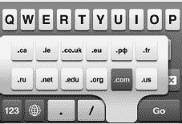

上图显示了 `.co`、`uk`、`.ie`、`.de`、`.ca` 和 `.eu` 键。这些键在标准美式键盘上并不会显示，但在此例中它们存在，是因为我们安装了额外的国际键盘。你将在本章稍后的“用其他语言输入——国际键盘”部分学习如何启用国际键盘。

**提示：更多实用但隐藏的符号**

在`符号`键盘上，`退格键`正上方有一个很好的项目符号字符。你也可以通过长按`零`键（`0`）获得角度符号。此外，你可以长按 `?` 和 `!` 键来获取它们在西班牙语中的倒置版本。

## 大写锁定

双击`Shift`键可开启大写锁定功能。当`Shift`键变为蓝色时，即表示已开启。

要关闭大写锁定，只需再次按下`Shift`键即可。

## 快速选择、删除或更改文本

你可能需要快速更改或删除正在输入的文本。请按以下步骤操作：

1.  双击选中你想要更改或删除的部分文本。

    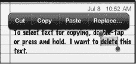

2.  拖动蓝色控制柄调整选区。

    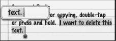

3.  要删除选中的文本，按下`退格键`。

    

4.  要替换文本，直接开始输入即可。文本将立即被你输入的字母替换。

## 键盘选项与设置

有一些键盘选项可以让你的 iPhone 输入更轻松。这些键盘选项位于`设置`应用的`通用`选项卡中。请按以下步骤访问：

1.  点击`设置`图标。
2.  点击`通用`。
3.  向上滑动，然后点击页面底部的`键盘`。

### 开启或关闭自动修正

如本章前面所述，自动修正功能将使用 iPhone 的内置词典自动更改常见拼写错误的单词。如果你希望此功能生效，需要确保它处于`开启`状态。（这是默认设置。）

### 自动大写

当你开始一个新句子时，如果`自动大写`选项设置为`开启`，单词将自动大写。

此功能还会正确大写常见的专有名词。例如，如果你输入“New york”，系统会提示你将其更改为“New York”——同样，只需按下`空格键`即可执行修正。如果你用退格键删除一个大写字母，iPhone 会假定你新输入的字母也应大写。此功能默认也设为`开启`。

### 启用大写锁定

有时你可能只想输入大写字母；为此，只需双击`大写`键即可。

此功能默认设为`关闭`。

### “.”快捷键

如果你双击`空格键`，它会在句子末尾自动添加一个句号；此功能默认设为`开启`。

## 用其他语言输入——国际键盘

在撰写本文时，iPhone 支持你用十几种不同的语言输入，包括从荷兰语到西班牙语的所有语言。某些亚洲语言，如日语和中文，提供了两种或三种键盘用于不同的输入法。

### 添加新的国际键盘

请按以下步骤启用各种语言键盘：

1.  点击`设置`图标。
2.  点击`通用`。
3.  点击页面底部的`键盘`。
4.  点击`国际键盘`。
5.  点击`添加新键盘`。
6.  点击列出的任何键盘或语言以添加它。现在你将看到该键盘出现在可用键盘列表中。
7.  在`符号`键盘上，`退格键`正上方有一个很好的项目符号字符。你也可以通过长按`零`键（`0`）获得角度符号。此外，你可以长按 `?` 和 `!` 键来获取它们在西班牙语中的倒置版本。

**提示：** iOS 5 包含内置的 Emoji 键盘。Emoji 是大量日本符号的集合，包括各种笑脸和哭脸、节日图像、建筑物和车辆等等。虽然这些符号在日本有更具体的含义，但世界各地的人们已经开始在短信、Twitter 和其他在线消息服务中使用它们。

Emoji 键盘可以像任何其他键盘一样在“设置”中添加。

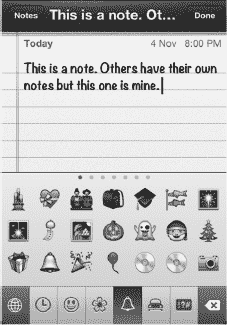

### 编辑、重新排序或删除键盘

你可能想要调整某个键盘的选项、重新排序键盘在列表中的显示顺序，或者干脆删除不再使用的键盘。请按以下步骤操作：

1.  按照本章前面“添加新的国际键盘”部分中的步骤 1-4 操作；这将让你查看国际键盘列表。
2.  要调整特定键盘的选项，在键盘列表中点击它。在我们的示例中，我们点击了`加拿大法语`。
3.  点击相应部分中的选项更改`软件键盘布局`。
4.  点击相应部分中的选项调整`硬件键盘布局`。
5.  点击左上角的`键盘`按钮保存你的选择并返回键盘列表。

    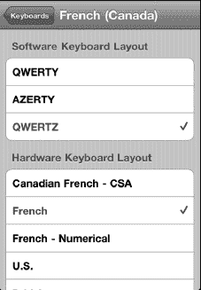

6.  要重新排序或删除键盘，点击右上角的`编辑`按钮。
7.  要更改键盘顺序，触摸并拖动带有三条灰色横线的键盘右侧边缘向上或向下。
8.  要删除键盘，点击`红色减号`使其摆动到垂直位置，然后点击`删除`。
9.  要完成键盘编辑，点击右上角的`完成`按钮。

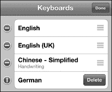

当你至少安装了一个国际键盘后，你会注意到出现了一个小小的`地球`键。按下`地球`键可在所有语言之间循环切换。

**提示：** 你可以长按`地球`键来查看可用键盘列表。这将使你能够快速选择你想要使用的键盘。

日语、中文和一些其他语言提供了多种键盘选项，以满足你的输入偏好。

在某些语言（如日语）中，你会看到输入的字母变成字符，或者你可以自己手写绘制字符。你还可能在键盘上方看到一行其他字符组合。当你看到想要的组合时，点击它。

### 复制与粘贴

“复制与粘贴”功能非常实用，既能节省时间，又能提高打字准确度。你可以利用此功能将邮件中的文本（例如会议详情）复制并粘贴到日历中。或者，你也许只是想将表单某处的电子邮件地址复制到另一处，省去重新输入的麻烦。（我们将在第 4 章：“其他同步方式”的“设置 Exchange/Google 账户”部分为你演示这一技巧。）复制与粘贴的用途十分广泛；你用得越熟练，就越会频繁使用它。你甚至可以从你的 `Safari` 网页浏览器中复制文本或图片，然后粘贴到 `Notes` 或 `Mail` 信息中。

#### 通过双击选择文本

如果你正在阅读或输入文本，可以双击它以开始选择要复制的部分文本。这在 `Mail`、`Messages` 和 `Notes` 应用中效果很好。

你会看到一个带有蓝色圆点（操作柄）的方框，位于对角处。

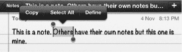

只需拖动这些操作柄，即可选中你想要高亮并复制的文本。

**提示：** 如果你想选择所有文本，请点击光标，或在文本上方或下方双击屏幕。这将弹出一个窗口，显示 `Select` 和 `Select All` 选项。点击 `Select` 选择一个单词，或点击 `Select All` 高亮所有文本。

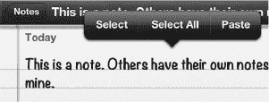

#### 通过双指触摸选择文本

另一种选择文本的方式是同时用两根手指触碰屏幕。如果你用一只手握住 iPhone，用另一只手的拇指和食指触碰屏幕，这种方法效果最佳。你也可以将 iPhone 放在桌子上，用双手各一根手指触碰屏幕。请按照以下步骤使用此方法：

1.  在你要选择的文本的起始处和结束处同时触碰屏幕。如果第一次触摸时没能精确选中，不必担心。
2.  双指触摸后，使用蓝色操作柄将选区的起始和结束位置拖拽到正确位置。

#### 通过长按选择网站或其他不可编辑文本

在 `Safari` 网页浏览器以及其他你无法编辑文本的地方，用手指按住某段文本，该段落将被高亮，并在每个角上显示操作柄。

接下来，如果你想选择更多文本，就拖动这些操作柄。

**注意：** 如果拖动范围小于一个段落，选择器将切换为精细文本模式，并在选区两端提供蓝色操作柄，以便你精确选择所需的字符或单词。如果拖动手指超过一个段落，则会启用粗略文本选择器，你可以向上或向下拖动，以选择整段整段的文本和图形。

#### 剪切或复制文本

一旦突出显示了你要复制的文本，只需触摸屏幕顶部的`Copy`选项卡。该选项卡会变为蓝色，表示文本已存入剪贴板。

**注意：** 如果你之前已经剪切或复制过文本，那么你还会看到 `Paste` 选项，如右图所示。

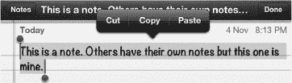

#### 应用切换与多任务处理

复制文本后，你可能想将其粘贴到另一个应用中。例如，你可能想从 Safari 复制一些文本，然后粘贴到 Notes 或 Mail 信息中。在应用之间跳转的最简单方法是使用 `App Switcher` 应用。请按照以下步骤将一个应用中的文本粘贴到另一个应用中：

1.  复制或剪切你的文本。
2.  双击 `Home` 按钮，调出屏幕底部的 `App Switcher` 应用。
3.  如果你刚刚让一个应用在后台运行，你可以在 `App Switcher` 栏中找到它。
4.  向左或向右滑动，找到你想要的应用并点击它。
5.  如果你在 `App Switcher` 栏中没有看到想要的应用，则点击 `Home` 按钮，然后从 `Home` 屏幕启动它。
6.  现在，长按屏幕，然后从弹出窗口中选择 `Paste` 来粘贴文本。
7.  再次双击 `Home` 按钮，点击你刚才离开的应用，即可跳转回去。

#### 粘贴文本

在同一个应用中粘贴文本很简单。例如，只需按照以下步骤将文本粘贴到同一个 `Notes` 或 `Mail` 信息中：

1.  用手指将光标移动到你想粘贴文本的位置。记住我们本章前面展示的`放大镜`技巧；这可以帮助你定位光标。
2.  松开屏幕后，你应该会看到一个弹出窗口，询问你是要 `Select`、`Select All` 还是 `Paste`。
3.  如果你没有看到这个弹出窗口，请双击屏幕。
4.  选择 `Paste` 以粘贴你的选择内容。

#### 摇动以撤销

iPhone 的一大特色功能是能够撤销输入、复制和粘贴，甚至是你刚刚完成的 Siri 听写。

你只需在粘贴后摇动 iPhone。一个新的弹出窗口将会出现，让你可以选择撤销刚才的操作。

点击`撤销输入`或`撤销粘贴`来纠正错误。

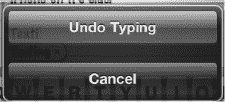

**提示：快速删除文本**

如果你曾想只点击一两下就快速删除几行文本、一个段落、甚至是你刚刚输入的所有文本，那么这个技巧就是为你准备的。首先，使用前面描述的方法选中你想要删除的文本。接下来，只需按下键盘左下角的 `Delete` 键 ，即可删除所有选中的文本。

### 使用聚焦搜索查找内容

聚焦搜索是 iPhone 上一个很棒的功能，可以帮助你查找信息。这是苹果公司专有的搜索方法，用于在你的 iPhone 上执行全局搜索。你可以使用此功能搜索姓名、事件或主题。

其概念很简单。假设你在寻找与“Martin”相关的内容。你不记得它是电子邮件、`Notes` 中的文档，还是日历事件；但你确定它与 Martin 有关。

这时就是使用聚焦搜索功能来查找 iPhone 上所有与 Martin 相关内容的最佳时机。

#### 激活聚焦搜索

首先，你需要调出位于 `Home` 屏幕第一页左侧的 `Spotlight Search` 页面。

在第一个圆点（指示 `Home` 屏幕第一页）的左侧，你可以看到一个非常小的`放大镜`图标。

在第一页图标上用手指从左向右滑动，即可看到 `Spotlight Search` 页面。你也可以从第一屏图标按下 `Home` 按钮，以看到相同的搜索页面。

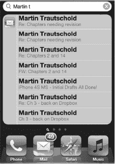

请按照以下步骤使用此功能进行搜索：

1.  在 `Spotlight Search` 页面，输入一个或多个单词作为搜索参数。
2.  点击右下角的 `Search` 按钮执行搜索。

    **提示：** 如果你在寻找某个人，请输入他的全名，以便更准确地找到仅与那个人相关的项目（例如，“Martin Trautschold”）。这将排除你 iPhone 上可能存在的其他名叫 Martin 的人，使你能够只找到与 Martin Trautschold 相关的项目。

3.  在搜索结果中，你会看到搜索找到的所有电子邮件、约会、会议邀请和联系人信息。向下滑动查看更多结果。
4.  点击列表中的某个结果以查看其内容。

你的搜索结果会一直保留，直到你将其清除。这意味着你可以仅仅通过从 `Home` 屏幕向右滑动，就能返回到 `Spotlight Search` 页面查看你之前的搜索结果。

要清除 `Search` 字段，只需触摸搜索栏中的 `X` 即可。要退出 `Spotlight Search` 页面，只需按下 `Home` 键或向左滑动。

#### 搜索网页或维基百科

执行聚焦搜索后，你会看到结果下方有两个选项：**搜索网页**和**搜索维基百科**。

点击任一选项即可在网页或维基百科中执行搜索。

#### 自定义聚焦搜索

你可以通过移除搜索中的特定应用或数据类型来自定义聚焦搜索。你甚至可以更改每种数据类型的搜索顺序。如果你只想搜索**通讯录**和**邮件**中的信息——不搜索其他内容，这个功能会很有用。或者，如果你知道自己总是想先搜索**邮件**，然后是**日历**，接着是**音乐**——你可以按正确顺序设置这些项目。请按照以下步骤操作：

1.  点击**设置**图标。
2.  点击**通用**。
3.  点击**聚焦搜索**。
4.  若要更改搜索项目的顺序，请触摸并拖拽带有三条灰色横线的项目右侧边缘，向上或向下移动。
5.  若要从搜索中移除特定项目，点击该项目以移除其旁边的**勾号**图标。未勾选的项目将不会被聚焦搜索搜索到。
6.  点击左上角的**通用**按钮，返回**设置**应用。

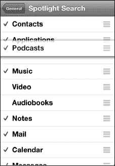

