# 第 3 章

## 与 iCloud、iTunes 等同步

在本章中，我们将向你展示如何设置或调整你的存储空间，并将你的信息推送至 Apple 的新 iCloud 服务，以及如何使用 iTunes 在你的 iPhone 与 Windows 或 Mac 电脑之间同步信息。

借助 iCloud，你可以无线同步你的邮件、通讯录、日历、提醒事项、书签、备忘录、照片以及文稿与数据，还可以通过无线方式 (空中下载技术 OTA) 备份你的 iPhone。借助 iTunes，你可以同步或传输通讯录、日历、备忘录、应用、音乐、视频、iBooks、文稿以及图片库，还可以备份你的 iPhone。

并且，因为没有任何东西能始终完美运行，我们还将向你展示一些简单的故障排除技巧。最后，我们将向你展示如何检查更新并为你的 iPhone 安装更新的操作系统软件。

### iCloud

iCloud 是免费的，易于设置且易于使用。在大多数情况下，它是同步你的个人信息、音乐、电视节目（仅限美国）和应用的最佳方式。它也是处理备份和恢复手机的最佳方式。除非你有非常具体的原因不这样做，否则我们强烈推荐你使用 iCloud 来处理大多数同步需求，但对于 iCloud 尚未处理的内容（如电影），则使用**iTunes**应用。

iCloud 还允许你重新下载之前从 iTunes、iBookstore 和 App Store 购买的项目，但你的 iCloud ID 也可用于 iMessage、FaceTime 和其他免费的 Apple 服务。

**注：** Apple 在提及 iCloud 时非常小心地避免使用*同步*这个词。取而代之的是*存储*和*推送*。这种差异很大程度上是技术性的，与 Apple 如何移动你的数据有关。

需要记住的重要一点是，当你更改 iPhone 上的某些内容时，Apple 会将该更改复制到其服务器，然后将副本推送回你所有其他启用了 iCloud 的 iOS 设备，以及你的 Windows 或 Mac 电脑。

### 设置 iCloud

在第 1 章：“开始使用”中，我们向你展示了在设置新 iPhone 或从之前的 iCloud 备份恢复时如何启用 iCloud。一旦启用了 iCloud，你就可以轻松地打开或关闭各种服务。

首先启动**设置**应用，向下滚动到 iCloud。

**邮件**、**通讯录**、**日历**、**提醒事项**、**书签**、**备忘录**和**查找我的 iPhone** 可以直接在此屏幕上轻松切换为**打开**或**关闭**。

对于**照片流选项**，你需要先点击该标签页才能进入**打开**/**关闭**切换开关。

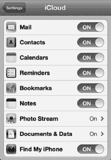

**注：** 在编写本文时，照片流是一项全有或全无的服务。如果照片流已开启，Apple 会将其服务器上你最近的 1000 张照片保留最多 30 天，并将它们复制到你的 iPad、Apple TV、Mac 或 Windows 电脑。任何登录 iCloud 的设备都会获得你照片流的副本。如果你拍摄了敏感或私人的照片，你可能希望将**照片流**选项设置为**关闭**。

同样，你可以点击**文稿与数据**来将此选项切换为**打开**或**关闭**。你还可以选择将**使用蜂窝网络选项**设置为**打开**。这将确保即使你外出并连接到 3G 数据网络时，你的文稿也能保持最新。

**注：** 如果你的数据套餐有限，或者在旅行时处于漫游状态，你可能需要关闭此功能以避免产生高昂的超额费用。

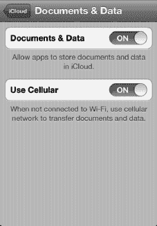

### 管理 iCloud 储存空间与备份

iCloud 提供 5GB 的免费储存空间。来自 iTunes 的音乐、应用、iBooks 以及你的照片流不计入你的 5GB 额度，因此大多数人仍有足够的空间用于应用数据、文稿和备份。

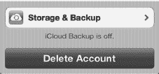

要查看你的 iCloud 储存空间，请向下滚动到底部，然后点击**储存空间与备份**。

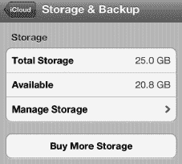

**储存空间**部分会显示**总储存空间**，即你 iCloud 账户的总容量；**可用储存空间**则显示你剩余的总存储容量。

在屏幕底部，你可以将**iCloud 备份**切换为**打开**或**关闭**。

**注：** 对于大多数用户来说，在绝大多数情况下，我们强烈建议将**iCloud 备份**选项切换为**打开**并保持该状态。

如果你需要立即备份你的 iPhone，可以点击**立即备份**按钮。你可能在以下情况执行此操作：想重新安装你的 iPhone、更换为一部备用或新的 iPhone、或者计划出行并希望在出发前确保你的手机已备份。

要查看你的 iCloud 储存空间使用情况，请点击**管理储存空间**。

在**管理储存空间**屏幕的顶部，你会看到当前备份到 iCloud 的设备列表。这包括你的 iPhone 以及你可能拥有的任何其他 iOS 设备，例如 iPad 或 iPod touch。

点击你想要查看的设备，你会进入**信息**屏幕，该屏幕显示**最新备份**的时间以及**备份大小**。

**备份选项**部分允许你单独打开或关闭不同类型的备份，包括**相机胶卷**以及你可能已安装的、将其设置或数据与 iCloud 同步的任何应用。此部分还会告诉你每个应用使用了多少储存空间。

最初，你只会看到几个应用。点击**查看所有应用**以查看完整列表。将某个应用设置为**关闭**意味着你将节省储存空间，但你的数据将不再在你的 iOS 设备之间同步，并且如果你重新安装设备或该应用，数据也不会被恢复。

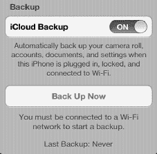

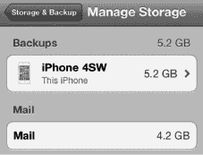

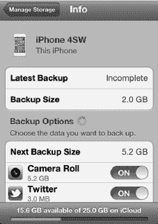

**提示：** 你的 iPhone 配备的 800 万像素、1080p 摄像头意味着备份**相机胶卷**会很快消耗大量储存空间，尤其是当你只有免费的 5GB 套餐时。照片流功能已经备份了你的照片；如果你不担心备份视频，那么你可以将**相机胶卷**备份切换为**关闭**以节省空间。

### 购买更多 iCloud 储存空间

你可能会发现自己经常用尽 iCloud 储存空间、决定开始备份更多照片和视频，或者发现需要备份多个 iOS 设备。如果是这样，你可以从 Apple 购买更多 iCloud 储存空间。

只需点击遍布 iCloud **设置**屏幕中的任意一个**购买更多储存空间**按钮即可。在编写本文时，额外的 iCloud 储存空间费用如下：

* 10GB：20 美元/年
* 20GB：40 美元/年
* 50GB：100 美元/年

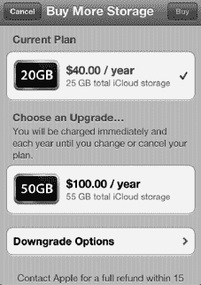

### 云端 iTunes

iCloud 还包含*云端 iTunes*功能，允许你重新下载之前购买的应用。在部分国家或地区，你甚至能重新下载 iBooks、音乐甚至电视节目。这意味着你可以随时将内容下载到 iPhone，不再需要时删除，想再次使用时可重新下载。

要了解更多从 iTunes 重新下载文件的信息，请参阅第 22 章：“您的设备上的 iTunes”、第 23 章：“神奇的应用商店”和第 13 章：“iBooks 与电子书”。

你还可以设置 iPhone，使其自动下载通过你 iTunes 账户关联的任何设备或电脑所购买的新应用、iBooks、报刊杂志订阅、音乐和电视节目。如果你在 PC 上购买了一首新歌，或在 iPod touch 上购买了一个新应用，该歌曲或应用也会立即下载并出现在你的 iPhone 上。

请按照以下步骤开启自动下载：

1.  启动 `设置`。
2.  轻点 `商店`。
3.  将`音乐`、`应用`和`图书`开关切换至`开启`。
4.  若要在 3G 网络下也启用自动下载，则将`使用蜂窝数据`开关切换至`开启`。
5.  若要启用报刊杂志订阅的自动下载，则将相关报纸或杂志名称旁的开关切换至`开启`。

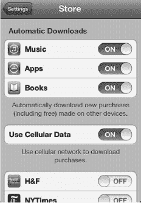

**注意：** 在撰写本文时，Apple 对 3G 网络设置的 20MB 下载限制同样适用于`云端 iTunes`功能。这意味着，如果你不在 Wi-Fi 环境下，则无法自动下载或重新下载任何超过 20MB 的应用或文件，直到你重新连接 Wi-Fi。此限制适用于 iBooks、音乐、电视节目等。

### 电脑上的 iCloud

iCloud 不仅能在你的 iPhone 与 Apple 服务器之间或你的 iOS 设备之间同步信息，还能在你的 iPhone 与 Windows 或 Mac PC 之间同步信息。

如果你使用的是 Windows 系统，可以在`Windows 版 iCloud 控制面板`中开启或关闭多个应用和服务的同步功能（请参见图 3–1）。可与之同步的应用和服务包括`邮件`、`通讯录`、`日历与任务`和`提醒事项`等。

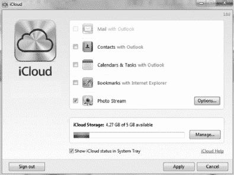

**图 3–1.** *Windows 版 iCloud 控制面板*

如果你使用的是 Mac OS X 系统，可以在 OS X 7.2 `Lion iCloud 系统设置`面板中开启或关闭这些选项（请参见图 3–2）。

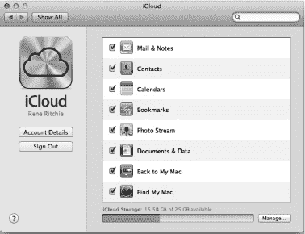

**图 3–2.** *Mac 的`Lion iCloud 系统设置`面板 (OS X 7.2)*

应用、图书、音乐及其他内容的自动下载，可在`iTunes`应用的`商店偏好设置`屏幕中开启或关闭（请参见图 3–3）。

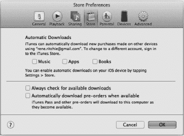

**图 3–3.** *`iTunes`的`商店偏好设置`屏幕*

### 与 iTunes 同步

在开始使用`iTunes`进行同步之前，你需要准备一些事项。在接下来的章节中，我们将介绍前提条件，并回答一些关于使用`iTunes`原因的常见问题。我们还将帮助你了解，如果你拥有其他 Apple 设备（如 iPad 或 iPod）并与 iPhone 开始同步，会发生什么。

#### 前提条件

在将 iPhone 与`iTunes`同步之前，你只需完成以下几项操作：

**提示：** 如果你已按照第 1 章：“入门指南”中的所有步骤操作，那么很可能已完成下方列出的步骤并已将通讯录、日历、书签、备忘录和电子邮件账户初始同步到 iPhone。如果已完成，你可以跳到本章稍后的“应用：同步与管理”部分。

1.  确保你的电脑上已安装 10.5 或更高版本的`iTunes`应用。如需安装或更新`iTunes`的帮助，请参阅第 22 章：“您的设备上的 iTunes”。
2.  确保手边备有你的 iTunes 账户 ID。即用于从 iTunes 购买音乐、应用和其他内容的电子邮件地址和密码。
3.  找到随 iPhone 附带的白色同步线缆。线缆一端插入 iPhone 底部靠近`主屏幕`按钮的接口，另一端插入电脑的 USB 端口。

#### 将 iTunes 与 iPod 或 iPad 以及*你的*iPhone 同步？

你可能想知道是否可以同步`iTunes`与多个设备，例如你的 iPod 或 iPad 以及 iPhone。是的，可以！只要你是同步到同一台电脑，就可以将多个 Apple 设备（Apple 官方称最多五个，但我们听闻有人同步了更多设备）同步到一台电脑上的同一个 iTunes 账户。

**警告：** 你不能将同一部 iPhone、iPad 或 iPod 同步到两台不同的电脑。如果尝试这样做，你会看到类似这样的信息：“是否要抹掉此设备（iPhone、iPad、iPod）并重新同步新资料库？”如果你回答`是`，设备上的所有音乐和视频都将被抹掉。

#### 还有其他同步方法——应该使用`iTunes`吗？

iCloud 既免费又便捷，是让 iPhone 与其他设备保持同步的最简单方式；而`iTunes`则能帮助你处理 iCloud 尚不支持的大文件、影片及其他内容。你也可以使用其他方法来同步特定数据，例如个人信息和电子邮件（包括 Exchange/Google）。但请记住，即使你选择了其他方法，仍需要使用 iCloud 和/或`iTunes`来完成以下操作：

*   备份和恢复 iPhone 上的文件与数据
*   更新 iPhone 操作系统软件
*   同步和管理你的应用程序（应用）
*   同步你的音乐资料库和播放列表
*   同步影片、电视节目、播客和 iTunes U 内容
*   同步图书
*   同步照片

表 3–1 总结了你的同步选项。选择何种同步方法，应取决于你当前存储邮件、通讯录和日历的位置、你的使用环境，以及你是否希望进行无线同步。

**注意：** 某些环境允许你将通讯录和日历通过无线方式同步到 iPhone。

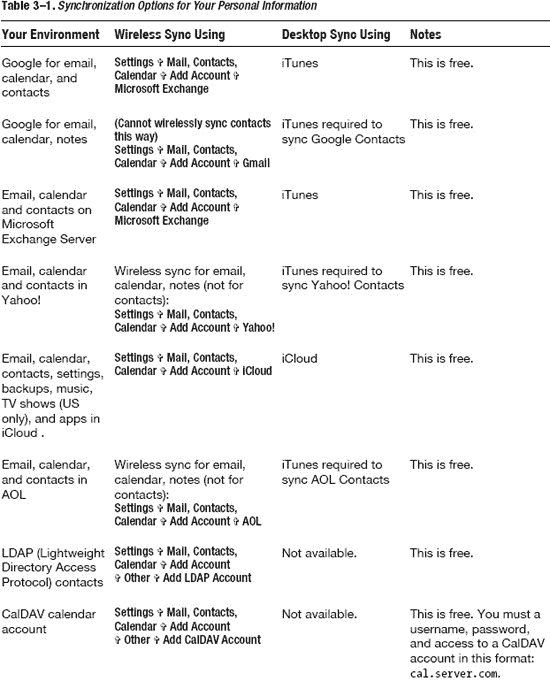

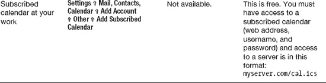

### 设置你的 iTunes 同步

接下来，我们将展示使用`iTunes`应用对 iPhone 执行自动同步和手动传输信息的所有步骤。

### iPhone 摘要屏幕

在 `iTunes` 中，iPhone 的 `摘要` 选项卡是您查看和更新 iPhone 操作系统软件版本的地方。它还包含一个与同步音乐、视频及其他内容相关的重要开关。您也可以在此选项卡中选择在连接 iPhone 到电脑时是否自动打开 `iTunes`（以进行同步）。

一旦将 iPhone 连接到电脑，您就能看到重要信息，例如 iPhone 的内存容量、已安装的软件版本和序列号（参见图 3–4）。您还可以检查软件版本更新、将数据恢复到 iPhone，并从该屏幕上的多个可用选项中进行选择。

特别是，您可以通过选中此屏幕底部的复选框来决定是否要`手动管理音乐和视频`。

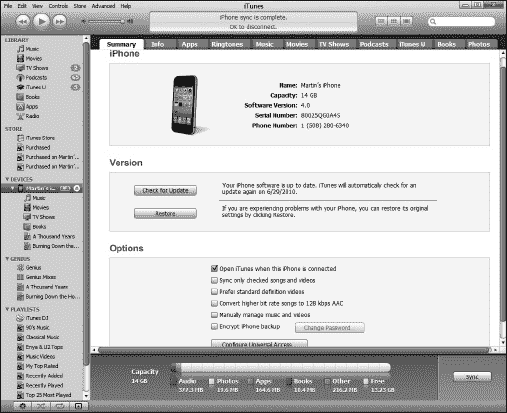

**图 3–4.** *`iTunes` 中的 iPhone `摘要` 屏幕*

请按照以下步骤查看`摘要`屏幕：

1.  在电脑上启动 `iTunes` 软件。
2.  使用设备附带的白色 USB 数据线将 iPhone 连接到电脑。将数据线的一端插入靠近 `Home` 按钮的 iPhone 底部，另一端插入电脑的 USB 端口。
3.  如果 iPhone 已成功连接，您应该会在左侧导航栏的 `设备` 下看到您的 iPhone 被列出。
4.  单击左侧导航栏中的 iPhone，然后单击主窗口左上边缘的 `摘要` 选项卡。
5.  如果您希望能够通过拖放方式将音乐和视频添加到 iPhone，请勾选`手动管理音乐和视频`旁边的复选框。
6.  如果您希望在连接 iPhone 到电脑时让 `iTunes` 自动打开并同步，请勾选`连接此 iPhone 时打开 iTunes` 旁边的复选框。

**提示：**请注意，`iTunes` 软件可能并未安装在您主要（用于同步的）电脑上。例如，它可能安装在您用于给 iPhone 充电的第二台电脑上。如果是这种情况，您应该勾选`手动管理音乐和视频`旁边的复选框，并取消勾选`连接此 iPhone 时打开 iTunes` 旁边的复选框。

### 进入同步设置屏幕（信息选项卡）

假设您想进入 `信息` 选项卡，即用于同步通讯录、日历、电子邮件等的设置屏幕。为此，您需要按照之前进入`摘要`屏幕的相同步骤操作，只是现在您需要单击顶部的 `信息` 选项卡，以便在主 `iTunes` 窗口中查看通讯录（及其他同步设置）（参见图 3–5）。

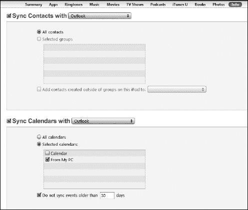

**图 3–5.** *`iTunes` 的 `信息` 选项卡，您可以在此设置通讯录、日历、书签等*

**注意：如果您已设置好使用 iCloud 同步信息，您将看到此警告且无法使用 iTunes，因为 iCloud 已在同步您的信息。如果看到此警告，则可以跳过使用 iTunes 同步邮件、通讯录和日历。**

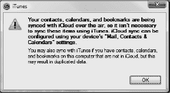

### 同步通讯录

让我们从设置同步通讯录开始。第一步是选择一个要进行同步的服务。为此，请勾选`同步通讯录自`旁边的复选框，并调整下拉菜单以选择存储您通讯录的软件或服务。在本书出版时，在 Windows 电脑上有几种同步选项：Outlook、Google 通讯录、Windows 通讯录和 Yahoo! 通讯录。

**警告：** 无论何时在这些同步设置屏幕中切换软件或服务（称为*同步提供者*），都会影响连接到您 iTunes 账户的每一个移动设备。例如，如果您将通讯录同步到 iPad 或 iPod touch，这些更改也会影响 MobileMe。您将会改变连接到 iTunes 账户的其他任何设备的通讯录同步方式。

.

## 与 Google 通讯录同步

如果您选择`Google 通讯录`，系统将提示您输入您的 Google ID 和密码。

若要更改您的 Google ID 或密码，请单击本节顶部看到的`同步通讯录自`选项旁边的`配置`按钮。

## 与 Yahoo! 通讯录同步

如果您选择`Yahoo! 通讯录`，系统将提示您输入您的 Yahoo! ID 和密码。

若要更改您的 Yahoo! ID 或密码，请单击本节顶部看到的`同步通讯录自`选项旁边的`配置`按钮。

**注意：** 您在此处以及`信息`选项卡中其他下拉框中看到的选项会略有不同，具体取决于您电脑上安装的软件。例如，在 Mac 上，通讯录同步没有下拉列表；而是将其他服务（如 Google 通讯录和 Yahoo!）显示为单独的复选框。

一旦选择了要同步的服务或应用，您就可以进行通讯录的同步操作了：

1.  从以下两个选项中选择您要同步的通讯录：
    1.  `所有通讯录`：同步通讯录中的所有联系人（此为默认设置）。
    2.  `所选群组`：仅同步您在下方窗口中勾选的特定群组中的联系人。
2.  您会看到一个复选框，显示`添加在此 iPhone 上创建的、不在群组中的联系人到`（从下拉列表中选择一个群组）。此选项允许您为在 iPhone 上添加的任何未明确分配到群组的新联系人指定一个新群组。
3.  向下滚动页面，继续设置您的日历、电子邮件等。
4.  如果您不想设置其他任何内容的同步，请单击 `iTunes` 屏幕右下角的`应用`按钮开始同步。

**注意：** 根据您拥有联系人的数量，首次同步可能需要超过 10 分钟，甚至可能需要 30 分钟或更长时间。因此，您可能希望在可以让 iPhone 随意放置所需时间（例如，午餐时间或晚餐后）的情况下执行此同步。

### 同步日历

同步日历与同步通讯录类似。请按照以下步骤进行操作：

1.  在同一个`信息`选项卡中，向下滚动以查看日历同步设置。
2.  勾选`同步日历自`旁边的复选框，并调整下拉菜单以选择存储您日历的软件或服务。这可能是 Windows 电脑上的 `Outlook` 或其他应用程序，以及 Mac 上的 `iCal`。
3.  选择以下选项之一：
    1.  `所有日历`：同步所有日历（此为默认设置）。
    2.  `所选日历`：仅同步您在下方窗口中勾选的日历。
4.  如果您想节省 iPhone 上的空间，请勾选`不同步超过 30 天的日历事件`旁边的复选框。您可以根据需要向上或向下调整天数。
5.  向下滚动页面，继续设置电子邮件账户、书签等。
6.  如果您不想设置其他任何内容的同步，请单击 `iTunes` 屏幕右下角的`应用`按钮开始同步。

**注意：** 如果您是使用 `Microsoft Entourage` 的 Mac 用户，您需要启用 `Entourage` 与 `iCal` 同步。为此，请进入 `Entourage` 的 `偏好设置`，然后进入 `同步服务`，并勾选同步 `iCal` 和`通讯录`的复选框。

**注意：** 在本书撰写时，`Entourage` 与 `iCal` 不同，它无法处理多个日历。

### 同步电子邮件账户

向下滚动页面以同步电子邮件账户设置。

**注意：** 将电子邮件账户设置同步到 iPhone 后，你仍需在 `设置`  `邮件、通讯录、日历` 中为每个电子邮件账户输入密码。每个账户只需在 iPhone 上执行此操作一次。

请按照以下步骤操作：

1.  在 `iTunes` 的同一 `摘要` 选项卡上，向下滚动至 `日历` 设置下方，即可看到 `邮件` 账户设置。
2.  勾选 `同步邮件账户来自` 旁边的复选框，并调整下拉菜单，选择存储你电子邮件的软件或服务（请参阅 图 3–6）。在 Windows 电脑上，这可能是指 `Outlook`；在 Mac 上，则可能是 `Entourage` 或 `邮件`。

    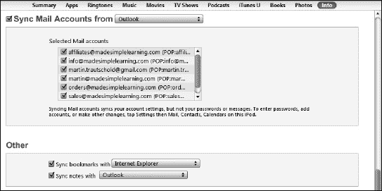

    **图 3–6.** *设置要同步的电子邮件账户*

3.  向下滚动页面，继续设置书签、备忘录等。
4.  如果你不想再同步其他内容，请点击 `iTunes` 屏幕右下角的 `应用` 按钮以开始同步。

### 同步书签和备忘录

iTunes 同步的一个出色功能是，你可以将电脑上的浏览器书签同步到 iPhone。这样，你可以立即在 iPhone 上浏览所有你喜爱的网站。你还可以将电脑上的备忘录同步到 iPhone，并使用 `iTunes` 在两处保持更新。

**注意：** 在撰写本文时，`iTunes` 仅支持两种浏览器进行同步：`Microsoft Internet Explorer` 和 `Apple Safari`。如果你使用 `Mozilla Firefox` 或 `Google Chrome`，你仍然可以同步书签，但需要安装免费的书签同步软件（例如来自 [`www.xmarks.com`](http://www.xmarks.com) 的 `xmarks`），以便将书签从 `Firefox` 或 `Chrome` 同步到 `Safari` 或 `Explorer`。安装此软件后，你就可以通过简单的两步过程同步浏览器书签。对于 `Firefox` 用户来说，`Firefox` 的 `Home` 应用是同步书签的一个不错选择（访问 [`http://itunes.apple.com/ca/app/firefox-home/id380366933?mt=8`](http://itunes.apple.com/ca/app/firefox-home/id380366933?mt=8) `了解更多信息`）。

### 将 iPhone 与 iTunes 同步

当你将 iPhone 连接到电脑的 USB 端口时，同步过程通常是自动进行的。唯一的例外是，如果你已禁用了自动同步功能。

## 在 iTunes 中同步应用

请按照以下步骤通过 `iTunes` 应用同步和管理应用：

1.  如同之前设置同步一样，将 iPhone 连接到电脑，启动 `iTunes`，然后在左侧导航栏中点击你的 iPhone。
2.  点击主窗口顶部的 `应用` 选项卡。
3.  勾选 `同步应用` 旁边的复选框，即可查看存储在 iPhone 上的所有应用以及你的 `主屏幕`，如图 3–7 所示。

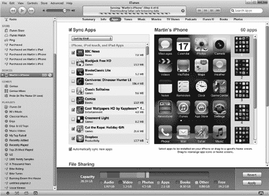

**图 3–7.** *`iTunes` 中的 `同步应用` 屏幕*

## 移动应用、使用文件夹或删除应用图标

在 `iTunes` 的 `同步应用` 屏幕中（再次参见 图 3–7），移动和整理你的应用图标非常容易。尝试以下操作以完成各种任务：

*   **在屏幕内移动应用：** 点击它并在屏幕内拖动。如果你想一次选择多个应用，可以按住 `Ctrl` 键（Windows）或 `Command` 键（Mac）并点击选择。
*   **在主屏幕页面间移动应用：** 点击并将其拖动到右侧列中的新页面。该新页面将在主屏幕中展开，将图标拖放到主屏幕即可。
*   **将应用固定到底部 Dock：** 点击并将其向下拖放到底部 Dock 上。如果底部 Dock 上已有四个图标，你需要先拖出一个图标为新图标腾出空间。Dock 上最多只允许放置四个图标。
*   **创建新文件夹：** 将一个图标拖放到另一个图标上。
*   **将应用移入现有文件夹：** 将图标拖放到 `文件夹` 图标上。
*   **将应用移出文件夹：** 点击文件夹将其打开，然后将图标拖放到该文件夹之外。
*   **查看另一个主屏幕页面：** 点击右侧列中的该页面。
*   **删除应用：** 点击它，然后点击左上角的 `x` 符号。你只能删除自己安装的应用。在预装应用（如 `iTunes`）上，你不会看到 `x` 符号。
*   **删除文件夹：** 从该文件夹中移除所有应用（将其拖出），文件夹将会消失。

## 移除或重新安装应用

要从你的 iPhone 上移除应用，只需取消勾选它旁边的复选框并确认你的选择。

**提示：** 即使你从 iPhone 上删除了某个应用，只要你已选择同步应用，可以通过重新勾选它旁边的复选框来重新安装该应用。该应用将在下一次同步时重新加载到你的 iPhone 上。

### 同步媒体及其他内容

现在，让我们看看如何设置音乐、影片、iBooks、iTunes U 内容等的自动同步。

**注意：** 请确保你在笔记本电脑上和 iPhone 上登录的是同一个 iTunes 账户，以便处理受数字版权管理 (DRM) 保护的内容（例如音乐、视频等）。如果两个账户不匹配，你的内容将无法同步。如有必要，你可以在桌面电脑和 iPhone 上注销并重新登录 iTunes 服务，以确保登录正确的账户。

## 同步铃声

当你点击 `铃声` 选项卡时，你可以选择同步整个铃声库或特定项目：

1.  将 iPhone 连接到电脑，启动 `iTunes`，然后在左侧导航栏中点击你的 iPhone。
2.  点击主窗口顶部的 `铃声` 选项卡。
3.  勾选 `同步铃声` 旁边的复选框，如右图所示。
4.  默认设置是同步 `所有铃声`。若要仅同步特定铃声，请点击 `所选铃声` 旁边的单选按钮。
5.  完成选择后，点击 `应用` 按钮开始铃声同步。

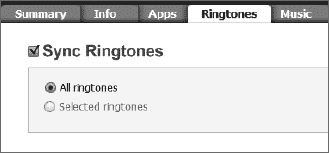

**提示：** 了解如何在第 9 章：“使用电话”中为联系人分配铃声、购买自定义铃声以及从你的音乐中创建自己的铃声。

## 同步音乐

当你点击 `音乐` 选项卡时，你可以选择同步整个音乐资料库或特定项目。

**注意：** 如果你已经手动将一些音乐、音乐视频或语音备忘录传输到 iPhone，你会收到一条警告信息，提示 iPhone 上的所有现有内容将被移除，并替换为你从电脑中选择的音乐资料库。

要将音乐从电脑同步到 iPhone，请按照以下步骤操作：

1.  将 iPhone 连接到电脑，启动 `iTunes`，然后在左侧导航栏中点击你的 `iPhone`。
2.  点击主窗口顶部的 `音乐` 选项卡。
3.  勾选 `同步音乐` 旁边的复选框。
4.  只有当你确信你的音乐资料库不会太大以至于 iPhone 无法容纳时，才点击 `整个音乐资料库` 旁边的按钮。
5.  如果你不确定音乐资料库是否过大，或者只想同步特定的播放列表或表演者，请点击 `所选播放列表、表演者和流派` 旁边的按钮：
    1.  你可以通过勾选相应的复选框来选择是否包含音乐视频和语音备忘录。
    2.  你还可以选择自动用歌曲填满剩余空间。

        **注意：** 我们不建议勾选此选项，因为它会占满 iPhone 的所有空间，导致没有空间安装那些酷炫的应用！

    3.  现在，勾选屏幕底部两列中的任何播放列表或表演者。你甚至可以使用 `表演者` 列顶部的 `搜索` 框来搜索特定的表演者。
6.  完成选择后，点击 `应用` 按钮开始音乐同步。

### 同步影片

点击`影片`标签页，您可选择同步特定、近期或未观看的影片，也可选择同步所有影片。

要将影片从电脑同步到 iPhone，请按以下步骤操作：

1. 将 iPhone 连接到电脑，启动`iTunes`，然后在左侧导航栏中点击您的 iPhone。
2. 点击主窗口顶部的`影片`标签页。
3. 勾选`同步影片`旁的复选框（参见图 3–8）。
4. 如果您想同步近期或未观看的影片，请勾选`自动包含`旁的复选框，然后使用下拉菜单选择`所有`、`最近 1 个`、`所有未观看`、`最近 5 个未观看`等选项。

   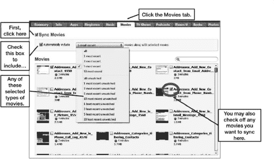

   **图 3–8.** *配置`影片`标签页以自动同步所选内容*

5. 如果您选择了除`所有`以外的任何选项，则可以选择将特定影片或视频同步到 iPhone。只需勾选您想包含在同步中的影片旁的复选框即可。
6. 完成影片选择后，点击`应用`按钮保存设置并开始同步。

### 同步电视节目

点击`电视节目`标签页，您可选择同步特定、近期或未观看的电视节目，也可选择同步所有节目。

要将电视节目从电脑同步到 iPhone，请按以下步骤操作：

1. 将 iPhone 连接到电脑，启动`iTunes`，然后在左侧导航栏中点击您的 iPhone。
2. 点击主窗口顶部的`电视节目`标签页。
3. 勾选`同步电视节目`旁的复选框。
4. 如果您想同步近期或未观看的电视节目，请勾选`自动包含`旁的复选框，然后使用下拉菜单选择`所有`、`最新 1 个`、`所有未观看`、`最旧 5 个未观看`、`最新 10 个未观看`等选项。
5. 在`的剧集`旁选择`所有节目`或`所选节目`。
6. 如果您选择了`所选节目`，则可在屏幕中间的两个版块中选择特定的节目甚至特定的剧集。
7. 如果您有电视节目播放列表，可以通过勾选屏幕底部版块中的复选框来选择包含这些列表。
8. 完成特定电视节目的选择后，点击`应用`按钮保存设置并开始同步。

### 同步播客

点击`播客`标签页，您可选择同步特定、近期或未播放的播客，也可选择同步所有播客。

**提示：** 播客是音频或视频节目，通常定期发布（例如每日、每周或每月）。在 iTunes Store 中，大多数播客均可免费订阅。当您订阅并按照本节所述设置自动同步后，您喜爱的所有播客都会传输到您的 iPhone 上。

许多您喜爱的广播节目都会被录制并以播客形式播出。我们建议您浏览 iTunes Store 的`播客`版块，查看可能感兴趣的节目。您会发现包括影评、新闻节目、法学院考试复习、游戏节目、老式广播节目、教育内容等在内的多种播客。

要将播客从电脑同步到 iPhone，请按以下步骤操作：

1. 将 iPhone 连接到电脑，启动`iTunes`，然后在左侧导航栏中点击您的`iPhone`。
2. 点击主窗口顶部的`播客`标签页。
3. 勾选`同步播客`旁的复选框。
4. 如果您想同步近期或未播放的播客，请勾选`自动包含`旁的复选框，然后使用下拉菜单选择`所有`、`最新 1 个`、`所有未播放`、`最新 5 个`、`最近 10 个未播放`等选项。
5. 在`的剧集`旁选择`所有播客`或`所选播客`。
6. 如果您选择了`所选播客`，则可在屏幕中间的两个版块中选择特定的播客甚至特定的单集。
7. 如果您有播客播放列表，可以通过勾选屏幕底部版块中的复选框来选择包含这些列表。
8. 完成播客选择后，点击`应用`按钮保存设置并开始同步。

**提示：** 同步这些播客后，您可以通过导航到设备上`音乐`应用中的`播客`版块进行收听。

### 同步 iBooks 和有声书

点击`图书`标签页，您可选择同步所有或选定的图书和有声书。

**提示：** iPhone 上的图书是其纸质版本的电子版。它们采用一种名为`ePub`的特定电子格式。您可以在 iPhone 上的 iBookstore 购买图书，或从其他来源获取图书，并使用此处描述的步骤将其同步到 iPhone。从其他地方获取的图书必须是无保护或“无 DRM（数字版权管理）”的，才能同步到您的 iPhone。您可以在 iPhone 上的`iBooks`应用或其他图书阅读应用中阅读这些书。请参阅第 13 章“iBooks 与电子书”了解更多信息。

要在电脑和 iPhone 之间同步图书或有声书，请按以下步骤操作：

1. 将 iPhone 连接到电脑，启动`iTunes`，然后在左侧导航栏中点击您的`iPhone`。
2. 点击主窗口顶部的`图书`标签页。
3. 勾选`同步图书`和`同步有声书`旁的复选框。
4. 如果您想同步所有图书，请保持默认的`所有图书`选项不变。
5. 否则，请选择`所选图书`，然后通过勾选窗口中的特定图书进行选择。

   **提示：** 为了将 iBooks、PDF 文件及其他类似文档同步到您的 iPhone，您需要先将文件从电脑拖放到您的 iTunes 资料库中。从电脑的任意文件夹中抓取文件，直接拖放到`iTunes`左上角栏目的资料库中即可。

6. 如果您想同步所有有声书，请保持默认的`所有有声书`选项不变。
7. 否则，请选择`所选有声书`，然后通过勾选此选项下方窗口中的特定有声书进行选择。
8. 完成特定图书和有声书的选择后，点击`应用`按钮保存设置并开始同步。

**提示：** 同步这些图书后，您可以在设备上的`iBooks`应用中阅读。您可以在`音乐`应用中收听有声书，其左侧有`有声书`标签页。

**注意：** 来自 Audible 的有声书，需要您先使用您的 Audible 帐户授权您的电脑，然后才能将其从电脑同步到您的 iPhone。

### 同步照片

点击**照片**标签页时，你可以选择同步所有文件夹或选定文件夹中的照片，甚至可以包含视频。

**提示：** 你可以创建一个精美的电子相框，并在 iPhone 惊艳的屏幕上分享你的照片（参见第 20 章：“处理照片”）。你甚至可以用照片来设置背景墙纸和锁屏墙纸——详见第 8 章：“个性化与安全”。

要将照片从电脑同步到 iPhone，请按以下步骤操作：

1. 将 iPhone 连接到电脑，启动 **iTunes**，然后在左侧导航栏中点击你的 iPhone。

   **提示：** Mac 用户还可以在 **iPhoto** 中使用多种条件同步照片，包括“事件”（按时间同步）、“面孔”（按人物同步）和“地点”（按位置同步）。

2. 点击主窗口顶部的**照片**标签页。
3. 勾选**同步照片来源**旁边的复选框。
4. 点击**同步照片来源**旁边的下拉菜单，从电脑中选择存储照片的文件夹。如果你想同步所有照片，请选择最高层级文件夹（例如 Windows 电脑上的 **C:** 或 Apple Mac 上的硬盘根目录“**/**”）。
5. 如果要同步电脑上选定文件夹中的所有照片，请选择**所有文件夹**。

   **警告：** 由于电脑上的照片库可能过大而无法全部放入 iPhone，勾选**所有文件夹**时请务必谨慎。

6. 否则，请选择**选定文件夹**，然后在下方的窗口中勾选特定文件夹进行选择。
7. 你还可以勾选**包括视频**旁的复选框，以包含文件夹中的任何视频。
8. 完成要同步的照片选择后，点击**应用**按钮以保存设置并开始同步。
9. 同步开始时，你将在 **iTunes** 中上方的状态窗口看到进度。

## iTunes 与同步的故障排除

有时 **iTunes** 的表现可能不如预期，因此这里提供几个简单的故障排除技巧。

### 查看 Apple 知识库以获取有用文章

遇到问题时，第一步是查看 Apple 的支持页面，那里有大量有用信息。在 iPhone 或电脑的网页浏览器中访问以下网址：

`www.apple.com/support/iPhone/`

接着，点击左侧导航栏中显示的主题。

### iTunes 锁定且无响应（Windows 电脑）

有时 **iTunes** 会锁定并完全无响应。如果在 Windows 电脑上发生这种情况，请按以下步骤操作：

1. 同时按下键盘上的 **Ctrl** + **Alt** + **Del** 键，调出 **Windows 任务管理器**。**任务管理器**应类似图 3–9 所示。

   

   **图 3–9.** *在 **Windows 任务管理器**中找到 `iTunes.exe`，以便结束其进程*

2. 要结束进程，请在弹出的窗口中点击**结束进程**。
3. 现在，**iTunes** 应被强制关闭。
4. 尝试重新启动 **iTunes**。
5. 如果 **iTunes** 无法启动或再次锁定，请重启电脑后再试。

### iTunes 锁定且无响应（Mac 电脑）

如果你使用的是 Mac，在 **iTunes** 应用锁定且完全无响应时，请按以下步骤操作：

**提示：** 按下 **Command** + **Option** + **Escape** 是调出**强制退出应用程序**窗口的快捷键（参见图 3–10）。

1. 点击顶部的 **iTunes** 菜单。
2. 点击**退出 iTunes**。
3. 如果无效，请切换到其他程序，点击 Mac 左上角的**Apple**小标志。
4. 点击**强制退出**，会显示正在运行的程序列表。
5. 选中 **iTunes**，然后点击**强制退出**按钮。
6. 如果仍然无效，请尝试重启 Mac。

**图 3–10.** *Mac 电脑上的**强制退出应用程序**窗口*

## 更新 iPhone 操作系统

通过 iOS5，你现在可以在设备上直接更新 iPhone 操作系统。有更快、更高效的更新方法，我们建议你尽可能使用它们。但如果需要重新安装整个操作系统，或者想通过 **iTunes** 进行升级，本部分将说明如何操作。

**注：** 请在你愿意让 iPhone 离开身边 30 分钟或更长时间时进行此更新，具体时长取决于 iPhone 上的数据量以及电脑和网络连接的速度。

通常，**iTunes** 会按照设定计划自动检查更新，大约每两周一次。如果未找到更新，**iTunes** 会告知你下次检查更新的时间。请按以下步骤使用 **iTunes** 手动更新 iPhone：

1. 启动 **iTunes**。
2. 将 iPhone 连接到电脑。
3. 在左侧导航栏的**设备**下点击你的 iPhone。
4. 点击顶部导航栏中的**摘要**标签页。
5. 在屏幕中央的**版本**区域，点击**检查更新**按钮。
6. 如果你的 iPhone 已是最新版本，会弹出一个窗口，显示类似“当前 iPhone 软件版本 (5.0) 即为最新版本”的信息。点击**确定**关闭窗口。更新过程完成。
7. 如果你的 **iTunes** 不是最新版本，窗口会提示有新版本可用，并询问是否要更新。点击**是**或**更新**进行更新。
8. **iTunes** 会引导你通过几个屏幕，描述更新内容并要求你同意软件许可。如果同意，请依次点击**下一步**和**同意**，从 Apple 下载最新的 iOS 软件。此过程大约需要五到十分钟。

   **提示：** 我们将在第 26 章：“故障排除”的“重新安装 iPhone 操作系统”部分，展示此更新过程中你可能看到的所有屏幕。

9. 接下来，**iTunes** 会备份你的 iPhone，如果 iPhone 存有大量数据，此过程可能耗时十分钟或更久。
10. 然后新的 iOS 将被安装，你的 iPhone 数据会被清除。
11. 最后，你会看到一个屏幕，要求你执行以下操作之一：

    1. **设置为新的 iPhone：** 如果希望在更新过程后清除所有数据，请选择此项。
    2. **从以下备份恢复：** 请确保选择正确的备份文件（通常是最新的那个）。

    此时，你的 iPhone 将按照你的选择进行恢复或设置。

12. 如果你已锁定 SIM 卡，则需要输入四位解锁 PIN 码。

    **警告：** 如果你已锁定 SIM 卡，则在更新安装完成后需要输入四位解锁码。如果忘记了 SIM 解锁码，可以使用 PUK 码解锁 SIM 卡（需从无线运营商处获取）。更多信息请参见第 9 章：“使用电话”中的“设置 SIM 卡安全”部分。

13. 你的 iPhone 操作系统更新完成。

## 其他同步方法

你可以在 iPhone 的**设置**应用中导航至**邮件**、**通讯录**、**日历**应用，以设置并使用 Exchange。下一部分将说明如何操作。

#### 在设备上设置您的 Google 或 Exchange 帐户

请按照以下步骤为您的 Exchange 帐户或 Google 联系人和日历设置无线同步：

1.  轻触**设置**图标。
2.  轻触**邮件、通讯录、日历**。
3.  您会看到您的电子邮件帐户列表，其下方是**添加帐户**选项。

    如果您尚未设置任何帐户，则只会看到**添加帐户**。无论哪种情况，都请轻点**添加帐户**。

    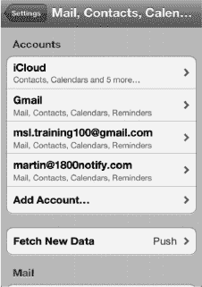

4.  在下一个屏幕上，选择**Microsoft Exchange**。

    **注意：** 如果您希望与 Google 通讯录和日历进行无线同步，则应选择**Microsoft Exchange**。如果您选择**Gmail**，将无法与 Google 通讯录进行无线同步。

    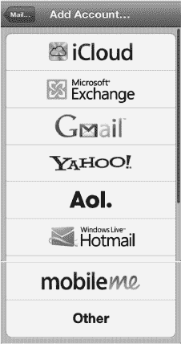

5.  输入您的电子邮件地址。

    **提示：** 要输入电子邮件地址中的 `.com`（或 `.net`、`.edu`、`.org` 等），请长按**句号**（**.**）键，直到看到其上方出现 `.com` 键。滑动手指并按下 `.com`。

    

    **提示：** 由于您的电子邮件地址通常也是您的用户名，因此通过复制粘贴可以节省时间。

    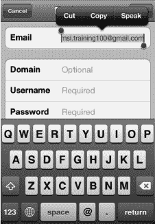

    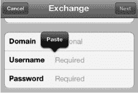

6.  将您的电子邮件地址复制并粘贴到**用户名**字段（当您的用户名与电子邮件地址相同，或者与电子邮件地址中 `@` 符号之前的部分相同时，此方法非常有效）：
    1.  长按**电子邮件**字段，然后松开手指，即可看到其上方出现黑色弹出菜单。
    2.  轻点**全选**。
    3.  轻点**拷贝**。
    4.  长按**用户名**字段，然后松开手指，即可看到弹出菜单。轻点**粘贴**。
7.  将**域**字段留空。输入您的**密码**。如果需要，您可以调整帐户的**描述**，该描述默认为您的电子邮件地址。
8.  轻点右上角的**下一步**按钮。
9.  您可能会看到**无法验证证书**对话框。如果看到，请点击**接受**以继续。

    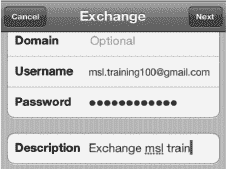

    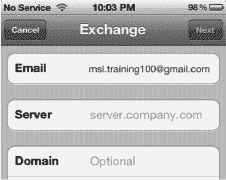

    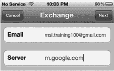

10.  在**服务器**字段中，输入 `m.google.com` 以同步到 Google。否则，如果您正在设置 Exchange Server 帐户，请输入该服务器地址。
11.  点击右上角的**下一步**。
12.  在此屏幕上，您可以选择将**邮件**、**通讯录**和**日历**的无线同步设置为**开**或**关**。对于您想要开启的每个同步，请轻点开关将其切换为**开**。

    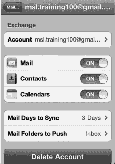

**注意：** 如果您的 iPhone 上已有通讯录或日历项，您可能会看到一些警告出现。您的选择是**保留在我的 iPhone 上**或**删除**。如果您选择**取消**，您的 iPhone 将停止设置您的 Exchange 帐户。选择**保留在我的 iPhone 上**以保留 iPhone 上所有现有的通讯录和日历事件。这些项目不会出现在您的 Exchange 帐户中——它们将保留在您的 iPhone 上。

