# 第 4 章

## 连接到网络

我们生活在一个互联的世界。无线互联网（Wi-Fi）接入已成为常态，而非例外——而且您很可能已经在家里或办公室使用 Wi-Fi。您可以使用它将 iPhone 连接到互联网。此外，由于您的 iPhone 还配备了 3G 蜂窝无线电，您也可以在拥有蜂窝数据覆盖的任何地方连接到互联网——其覆盖范围比 Wi-Fi 网络广泛得多。

在本章中，我们将讨论 iPhone 的两种连接类型之间的区别：Wi-Fi（无线局域网）和 3G（蜂窝服务——您的手机使用的广域数据网络）。我们将向您展示连接或断开这两种网络的所有方法。例如，有时您会希望禁用或关闭 3G 连接，仅使用 Wi-Fi 以节省数据连接费用。

我们还将向您展示如何为携带 iPhone 出国旅行做好准备——您在旅行前、旅行中和旅行后需要做什么，以免回家后收到一张高额话费账单而大吃一惊。

我们还将向您展示如何使用*互联网共享*功能，该功能可以让您的 iPhone 成为笔记本电脑（无论是 PC 还是 Mac）的互联网中枢。当您没有其他方式将笔记本电脑连接到互联网时，这是一个很棒的功能。

最后，如果您在拥有 VPN（*虚拟专用网络*）的组织工作，我们将向您展示如何连接到该网络。

### 连接到 Wi-Fi 或 3G 网络后我可以做什么？

以下是连接到 Wi-Fi 或 3G 网络后可以执行的一些操作：

*   从 App Store 访问和下载应用程序（程序）。
*   通过 iPhone 上的 **iTunes** 应用访问和下载音乐、视频、播客等。
*   使用 **Safari** 浏览网页。
*   发送和接收电子邮件。
*   使用需要互联网连接的社交网站，如 Facebook、Twitter 等。
*   玩需要使用实时互联网连接的游戏。
*   执行任何其他需要互联网连接的操作。

### Wi-Fi 连接

每部 iPhone 都内置了 Wi-Fi 功能，因此让我们来看看如何连接到 Wi-Fi 网络。有关 Wi-Fi 连接需要考虑的事项包括：

*   网络接入和数据下载没有额外费用（如果您在家庭、办公室或免费的 Wi-Fi 热点使用您的 iPhone）。
*   Wi-Fi 通常比蜂窝数据 3G 连接更快。
*   包括某些飞机在内的越来越多的地方提供 Wi-Fi 接入，但您可能需要支付一次性或月度服务费。

**注意**：iPhone 支持速度更快、范围更广的 802.11n 标准。但是，它仅在较为拥挤的 2.4 MHz 频段上支持 802.11n，而不支持不那么拥挤的 5 MHz 频段。如果您希望将 iPhone 与您的 802.11n Wi-Fi 路由器配合使用，请确保它是双频路由器，或者将路由器设置为 2.4 MHz。

#### 连接到 Wi-Fi 网络

要设置您的 Wi-Fi 连接，请按照以下步骤操作：

1.  轻点**设置**图标。
2.  轻点靠近顶部的 **Wi-Fi**。
3.  确保 **Wi-Fi** 开关设置为**开**。如果当前为**关**，请轻点将其打开为**开**。
4.  一旦 Wi-Fi **开启**，iPhone 将自动开始搜索无线网络。
5.  可访问的网络列表显示在**选取网络...** 选项下方。此屏幕截图显示我们有一个可用网络。
6.  要连接到列出的任何网络，只需轻触网络名称。如果该网络不受保护（没有**锁定**图标），您将自动连接。

    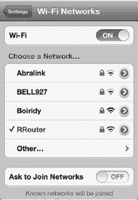

#### 在需要通过网页登录的公共 Wi-Fi 热点进行连接

在某些提供免费 Wi-Fi 网络的场所，例如咖啡店、酒店或餐厅；一旦您的 iPhone 与该网络接触，就会弹出一个窗口。在这些情况下，只需轻点网络名称即可。您可能会进入 **Safari** 浏览器屏幕以完成网络登录：

1.  如果您看到类似所示窗口，请轻点您想要加入的网络名称。在右侧的案例中，我们轻点 **Panera** 网络。

    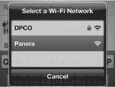

2.  在某些情况下，您可能会看到一个 **Safari** 窗口弹出，这可能会让人感到困惑，因为它在您的 iPhone 屏幕上显得非常小。您需要使用双击或捏合张开手势（请参阅快速入门指南获取帮助）来放大网页。您需要寻找一个写着**登录**、**同意**或类似文字的按钮。点击该按钮以完成连接。

    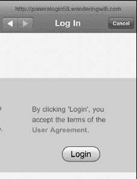

**注意**：某些地方，如咖啡店，使用基于网页的登录方式，而不是用户名/密码屏幕。在这些情况下，当您点击网络（或尝试使用 **Safari**）时，您的 iPhone 将打开一个浏览器屏幕，您会看到网页以及您的登录选项。

### 保护 Wi-Fi 网络——输入密码

部分 Wi-Fi 网络需要输入密码才能连接。网络管理员在创建无线网络时会设置这一密码。你需要知道确切的密码，包括是否区分大小写。

如果网络确实需要密码，你将进入**输入密码**屏幕。请严格按照提供给您的密码输入，然后按下屏幕键盘上的**回车**键（此时该键标记为**加入**）。

在**网络**屏幕上，您会看到一个**对勾**图标，表明您已连接到该网络。

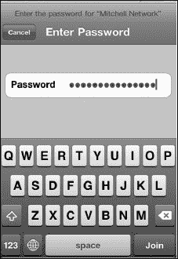

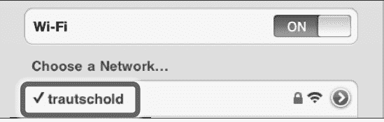

**提示**：您可以在密码对话框中进行粘贴；因此对于较长、随机的密码，您可以将其传输到您的 iPhone 上（例如通过电子邮件），然后直接复制粘贴。请记得之后立即删除该邮件，以确保信息安全。在邮件中长按并选中密码，然后点击**拷贝**。在 Wi-Fi 网络的**密码**字段中，点击并选择**粘贴**。

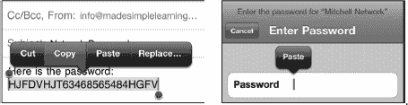

## 切换到不同的 Wi-Fi 网络

有时您可能想要切换当前正在使用的 Wi-Fi 网络。这种情况可能发生在酒店、公寓或其他场所，当 iPhone 自动选择的网络并非信号最强的，或者您希望使用安全网络而非不安全的网络时。

要从当前选中的 Wi-Fi 网络切换，请点击**设置**图标，轻触**Wi-Fi**，然后轻触您想要加入的 Wi-Fi 网络名称。如果该网络需要密码，您需要输入密码才能加入。

一旦您输入了正确的密码（或者您轻触了一个开放网络），您的 iPhone 就会加入该网络。

## 验证您的 Wi-Fi 连接

通过查看主**设置**屏幕中**Wi-Fi**选项旁边的信息，很容易判断您是否已连接到网络（以及连接的是哪个网络）。请按照以下步骤检查您的 Wi-Fi 连接状态：

1.  点击您的**设置**图标。
2.  查看顶部**Wi-Fi**选项旁边的信息：
    *   如果看到**未连接**，则表示您没有活跃的 Wi-Fi 连接。
    *   如果看到其他名称，例如**Panera**，则表示您已连接到该 Wi-Fi 网络。

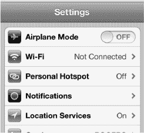

## 高级 Wi-Fi 选项（隐藏或不可发现的网络）

有时您可能看不到要加入的网络，因为网络管理员隐藏了其名称（即未广播 SSID）。接下来，您将学习如何在 iPhone 上加入此类网络。一旦您加入过此类网络，下次再进入其覆盖范围时，iPhone 会自动连接，而不会发出任何提示。您也可以让 iPhone 每次加入网络时都询问您；我们也将向您演示如何做到这一点。有时您可能想要删除或忽略某个网络。例如，您可能参加了一次性会议，想要移除相关的网络——您也将学到如何操作。

### 为什么我看不到要加入的 Wi-Fi 网络？

有时，出于安全考虑，人们不会让他们的网络可被发现（他们隐藏了网络名称，即 SSID），您必须手动输入名称和安全选项才能连接。

**正如您所见，可用网络列表中包含“其他”。**

1.  点击**其他**按钮，您可以手动输入要加入的网络名称。

    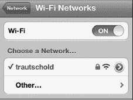

2.  输入 Wi-Fi 网络的**名称**。
3.  点击**安全性**标签。

    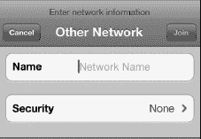

4.  选择该网络使用的安全类型。如果不确定，您需要向网络管理员咨询。

    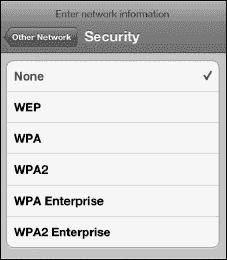

当您获得所需信息后，将其连同正确的密码一起输入，这个新网络将被保存到您的网络列表中，以便将来访问。

### 重新连接到之前加入过的 Wi-Fi 网络

iPhone 的妙处在于，当您回到曾连接过 Wi-Fi 网络（无论是开放网络还是需要密码的安全网络）的区域时，您的 iPhone 会自动重新连接该网络，而不会事先询问您。但是，您可以关闭此自动连接功能，如下一节所述。

#### “询问是否加入网络”主开关

有一个**询问是否加入网络**主开关，默认设置为**打开**。已知网络会自动连接，但此设置仅当没有已知网络可用时才生效。当此开关设为**打开**时，系统会询问您是否加入可见的 Wi-Fi 网络。如果有您未知的网络可用，连接前会征询您的意见。

如果该开关设为**关闭**，您需要手动加入未知网络。

为什么要关闭此功能？

例如，如果您不希望孩子能在您不知情的情况下通过 iPhone 加入无线网络，这样做可以成为一种良好的安全措施。

同样，当您身处不想加入 Wi-Fi 的区域（例如经过许多热点的地方）时，iPhone 持续弹出**加入网络**连接屏幕也会令人烦恼。

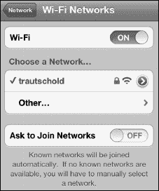

#### 每个网络上的“询问是否加入”和“询问是否登录”开关

有时，您可能会发现某个特定 Wi-Fi 网络有额外的开关，可以覆盖主**询问是否加入网络**开关。点击网络名称旁边的小蓝色**箭头**图标，可以查看此 Wi-Fi 网络的详细信息。**自动加入**和**自动登录**默认设置为**打开**。

要禁用**自动加入**或**自动登录**，请点击每个开关将其设为**关闭**。

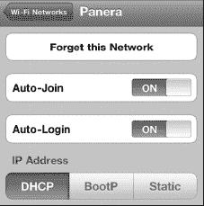

#### 忽略（或删除）一个网络

如果您发现不再需要连接到列表中的某个网络，您可以将其**忽略**——即将其从您的网络列表中移除。请按照以下步骤操作：

1.  点击**设置**图标。
2.  点击**Wi-Fi**，查看您的网络列表。
3.  点击您要忽略的网络旁边的小蓝色**箭头**，以查看如下所示的屏幕。
4.  点击屏幕顶部的**忽略此网络**。

    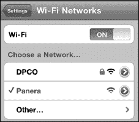

    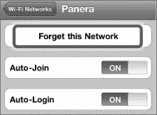

5.  系统会弹出一个警告提示。只需轻触**忽略**，该网络将不再显示在您的列表中。

    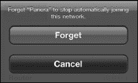

## 蜂窝数据连接

您的 iPhone 也可以连接到蜂窝数据网络——也就是其他手机连接的同一网络。关于蜂窝数据连接，需要考虑以下几点：

*   它们比 Wi-Fi 连接的可用范围更广——您可以在汽车里或远离城市的地方连接 3G 网络，而这些地点通常没有 Wi-Fi 信号。
*   访问蜂窝数据网络需要支付额外的月服务费。

**注意**：请向您当地的无线运营商咨询您所在国家的 iPhone 数据套餐价格。

### 选择并监控你的蜂窝数据用量

当你购买 iPhone 时，必须从运营商处选择一个蜂窝数据套餐。在美国，目前 iPhone 用户可以从 AT&T、Verizon 和 Sprint 中选择。如果你已选择了一个套餐，现在想尝试其他套餐，请联系你的运营商——你或许可以更换数据套餐。

**提示：节省数据费用的技巧**

你可以通过以下方式节省蜂窝数据套餐的费用：

- 尽量使用 Wi-Fi。
- 从低成本的蜂窝数据套餐开始（例如，截至出版时，AT&T 的 200MB 套餐售价 15 美元）。
- 整月持续监控你的蜂窝数据用量，确保不会超出低成本数据套餐的限额。

你会发现，如果大部分数据需求都使用 Wi-Fi，低成本的套餐也足够使用。

按照以下步骤检查当前的蜂窝数据用量：

1.  轻点`设置`图标。
2.  轻点`通用`。
3.  轻点`用量`。
4.  向下滚动并轻点`蜂窝网络用量`。
5.  你的总数据用量将是`发送`和`接收`数值的总和。如果要清空统计数据，请轻点屏幕底部的`还原统计数据`按钮。

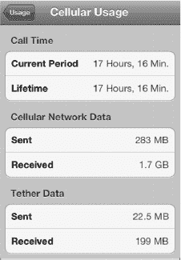

**注意**：当你的月度数据套餐剩余 20%、10%和 0%时，iPhone 会发出通知。如果有适用的选项，它还会让你选择续订当前套餐或升级到更高数据量的套餐。

### 国际旅行：出发前要做的事

根据你要前往的国家以及当前的 iPhone 语音和数据套餐，你可能已经为国际旅行做好了充分准备。然而，你的 iPhone 基本数据和电话套餐很可能无法使用，或导致你在数据和语音漫游费用上花费更多。

我们始终建议你在旅行前尽早致电你的电话服务提供商，询问是否有可以在旅行时为 iPhone 开通的国际功能。

#### 避免收到巨额账单

旅行时你要避免的一件事是回家后收到异常高昂的语音或数据漫游话费账单。例如，我们曾听说有人在国外旅行回家后发现，仅一个月的数据和语音漫游费合计就达到了 1000 美元甚至更多。在接下来的几节中，我们将向你展示如何在旅行前、旅行中和旅行后采取措施，帮助避免意外收费。

这些简单的步骤可以帮助你确保 iPhone 能够成功且经济地连接到当地网络——无论你身在世界的哪个角落。

#### 第 1 步：致电你的电话公司

你应该在离家前联系为你提供 iPhone 的电话公司。打电话时，你应该核实以下事项：

-   了解旅行中可能产生的任何语音和数据漫游费用。要具体到你要访问的每个国家。
-   查看出发前是否可以激活任何临时的国际费率套餐。有时，这些特殊套餐需要预付额外的 10 或 20 美元，但可以为你节省数百美元的额外费用。
-   如果你使用电子邮件、SMS 短信、彩信或图片信息、网页浏览以及任何其他数据服务，你还需要专门询问这些服务在国外旅行时是否单独收费。通常，短信和图片信息会产生额外费用。

你可能可以在电话公司的网站上找到一些信息，但通常需要给他们打电话。

#### 第 2 步：检查是否能使用国际 SIM 卡

在某些情况下，你的 iPhone 无线公司可能不会提供国际数据漫游套餐的优惠——或者其费率不合理地高。在这种情况下，你可能希望要求你的电话公司解锁 iPhone，以便你可以插入在旅行国购买的 SIM 卡。

**注意**：苹果公司在许多国家/地区出售无锁版、无 SIM 卡的 iPhone，包括美国、加拿大和英国。如果你经常旅行，官方无锁版 iPhone 可能是一个值得考虑的选择。

插入本地 SIM 卡将消除或大幅降低数据和语音漫游费用。但是，你应该仔细检查使用该 SIM 卡拨打和接听国际电话的费用。

使用国际 SIM 卡可能为你节省数百美元，但在确定采用这种方法之前，最好先在网络上做一些研究，或试着咨询最近去过同一国家的人以获取建议。

**提示：** 如果你要去一个没有优惠费率计划的国家，而你的运营商又不愿解锁 iPhone，你可以考虑租用或购买一部当地手机。租用一部手机的费用约为每周 30 美元，语音通话费率会低得多。有许多手机租赁公司，例如 Travel Cell、Mobal 和 Cellular Abroad。（在网上搜索“International Cell Phone Rental”以获取更多信息。）

你也可以在网上搜索“带着你的 iPhone 去 X、Y、Z 国旅行”的相关信息。

**提示**：在你的行李中放一个回形针——如果你遗失了无锁版 iPhone 附带的 SIM 卡弹出工具，你将需要它来取出和更换 iPhone 中的 SIM 卡。

#### 第 3 步：出发前完成所有高数据量操作

如果可能，你应该在离开本国前完成所有高数据量的活动。如果你有许多应用需要更新，请在出发前完成。同时，在旅行前查找并添加你可能需要的任何应用。你还应该在出发前下载任何大文件，例如电影、视频或音乐。

### 乘坐飞机：飞行模式

乘坐飞机时，机组人员通常会要求你在起飞和降落时关闭所有便携式电子设备。然后，当飞机达到一定高度时，机组人员会说“所有经批准的电子设备”可以重新开启。

如果你需要完全关闭 iPhone，请按住右上角的`电源`按钮，然后用手指`滑动来关机`。

要启用`飞行模式`，请按照以下步骤操作：

1.  轻点`设置`图标。
2.  将左侧栏顶部的`飞行模式`旁边的开关设置为`开启`。
3.  注意，Wi-Fi 会自动`关闭`，并且你的电话将无法使用。

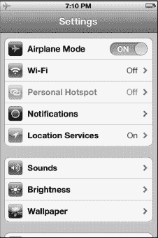

**提示**：一些航空公司提供机上 Wi-Fi 网络。在那些航班上，你可能希望在适当的时候将 Wi-Fi 重新`开启`。

你可以通过以下步骤打开或关闭 Wi-Fi 连接：

1.  轻点`设置`图标。
2.  轻点屏幕顶部的`Wi-Fi`。
3.  要启用 Wi-Fi 连接，将页面顶部的`Wi-Fi`旁边的开关设置为`开启`。

   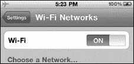

4.  要禁用 Wi-Fi，将同一开关设置为`关闭`。
5.  选择 Wi-Fi 网络，并按照乘务员给出的步骤进行连接。

### 国际旅行：抵达后

完成上述为旅行准备的步骤后，抵达目的地时还需要处理一些额外问题。接下来的部分将解释你抵达目的地后需要记住的事项。

#### 第 1 步：确保时区正确

抵达后，你需要确保 iPhone 显示的是正确的当地时间。通常情况下，iPhone 到达新目的地时会自动更新时间区。如果没有更新，你可以手动调整时区（参见第 1 章：“入门”中的“设置日期和时间”部分）。

好的，作为一名高级文档工程师和翻译员，我将严格遵循您提供的注意事项和示例，将以下英文文本翻译成中文。

#### 第 2 步：购买并插入国际 SIM 卡

**注意：** 此步骤仅在您访问国家的运营商支持 iPhone，且您的 iPhone 已解锁的情况下有效。目前，美国运营商 AT&T 不解锁 iPhone 设备。您的备用方案，特别是当您需要拨打大量本地电话时，是租用或购买一部便宜的预付费手机，并将您的 iPhone 仅用于 Wi-Fi 连接。

如果您确定可以使用国际 SIM 卡，那么您应该在抵达后购买并插入它。我们在第 1 章中向您展示了如何取出 SIM 卡托。您需要使用 Apple 的 SIM 卡弹出工具或回形针来取出此卡。

**警告：** iPhone 使用的是 MicroSIM，而许多其他手机使用的是 MiniSIM。这意味着您很可能需要找到一个也在其网络上提供 iPhone 的国际运营商。

#### 第 3 步：抵达后重置您的数据用量

您一落地，就应该在 iPhone 上重置您的数据用量。这将使您能够密切跟踪您在海外使用的无线数据量。例如，如果您购买了 20 MB 的套餐，您需要确保不会超出该用量。在车上使用`地图`约 1 分钟的简短测试就产生了近 1 MB 的数据用量。因此，请务必小心，并尽量在漫游时避免使用诸如`地图`之类极其消耗数据的应用程序。

我们在本章前面的“选择和监控您的蜂窝数据用量”部分中，已经详细解释了如何重置您的用量。

**提示：** 重置用量后，您需要时常返回此屏幕查看当前用量。您必须将`已发送`和`已接收`的值相加，才能得到总用量。如果您的数据总用量为 417 MB——在没有国际数据套餐的情况下，按 $20/MB 的费率计算，这需要花费 $8,340！

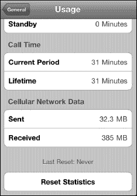

#### 第 4 步：如果费用过高，请关闭数据漫游

如果您无法找到国际 SIM 卡——或者无法从您的本地电话公司查询到数据漫游的费用——那么您可能希望完全关闭数据漫游。

这不会阻止您使用 Wi-Fi；但是，它可以确保您在旅途中不会因查收电子邮件或意外启动消耗数据的应用程序而收到令人不悦的账单。

**注意：数据漫游**通常默认为`关闭`状态，但在您出发前仔细检查一下总是明智的——以防万一。

请按照以下步骤将`数据漫游`设置为`关闭`：

1.  轻点`设置`图标。
2.  轻点`通用`。
3.  轻点`网络`。
4.  将`数据漫游`旁边的开关设置为`关闭`。

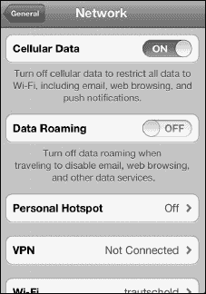

将`数据漫游`的值设置为`关闭`有助于避免任何潜在的高额数据漫游费用。（您仍然需要担心语音漫游费用，但至少可以通过控制通话时长来管理这部分费用。）

将`蜂窝数据`设置为`开启`，同时将`数据漫游`设置为`关闭`的好处在于，您可以在离开本国之前和返回本国之后立即享受所有数据服务，而无需进行任何其他更改。当然，您也可以随时使用 Wi-Fi 网络连接。

#### 第 5 步：尽可能使用 Wi-Fi

节省蜂窝数据套餐费用的一种好方法是尽可能使用本地 Wi-Fi 网络，尤其是在您准备浏览网页或下载大量电子邮件或大型应用程序时。

**提示：** 您可能可以在网吧、普通咖啡店、公共图书馆、一些酒店大堂以及 Apple 零售店找到免费 Wi-Fi 网络。

### 国际旅行：返回家中

就像您在抵达旅行目的地时所做的那样，一旦您返回家中，需要对 iPhone 的设置进行一些更改，设备才能正常工作。

#### 第 1 步：确保时区正确

当您返回本国时，需要确认您的 iPhone 显示的是正确的当地时间。通常，您的 iPhone 会在您返回家中时自动更新时间。但是，如果没有自动更新，您可以手动调整时区（请参阅第 1 章：“开始使用”中的“设置日期和时间”部分）。

#### 第 2 步：关闭您的特殊国际费率套餐

最后一步是可选的。如果您已与 iPhone 无线运营商激活了某种特殊的国际漫游费率套餐，并且不再需要它，那么请联系运营商将其关闭以节省费用。

使用我们在您旅行前、旅行中和旅行后描述的所有步骤，应该能帮助您在出国旅行时成功且经济地使用您的 iPhone。

### 个人热点

您的 iPhone 上有一个不错的功能，就是可以用它来将您的笔记本电脑（PC 或 Mac）连接到互联网。此功能称为`个人热点`，当您恰好在远离 Wi-Fi 网络，但您的 iPhone 仍在无线蜂窝数据覆盖范围内时，它会非常有用。这极大地扩展了您可以用笔记本电脑连接互联网的地点。

#### 个人热点 vs. 网络共享

通过您的 iPhone 数据套餐将笔记本电脑或其他设备连接到互联网，过去称为`网络共享`，并且它只能通过蓝牙或插入 USB Dock 连接线来工作。

`个人热点`与网络共享类似；但它不是使用蓝牙或 USB，而是将您的 iPhone 变成一个便携式小型 Wi-Fi 路由器，可以将多个设备连接到互联网。例如，您可以连接您的笔记本电脑、朋友的笔记本电脑和您的 iPad。（可以通过`个人热点`连接的设备确切数量取决于您的运营商，但通常是四到五个。）

**提示：** 如果出于某种原因您不想使用`个人热点`功能，传统的通过蓝牙和 USB Dock 连接线的网络共享方式仍然可用。

#### 第 1 步：联系您的电话公司

互联网网络共享可能需要从您的电话公司购买并激活一个单独的套餐。请致电您的电话公司或在其网站上检查，以开启`移动热点`或`网络共享`套餐。

**提示：** 当您不再需要`个人热点`或`网络共享`套餐时，将其关闭可以节省一些费用。请向您的电话公司咨询，在日后关闭`网络共享`套餐是否会有任何罚金或隐藏费用。

#### 第 2 步：在 iPhone 上启用个人热点

在您从电话公司购买或激活了`个人热点`或`移动热点`套餐后，您就可以在 iPhone 上进行设置了：

1.  轻点`设置`图标。
2.  轻点`通用`。
3.  轻点`网络`。
4.  向下滚动并轻点`设置个人热点`。（如果您已设置过，或者已为您设置好，那么您将看到`个人热点`。）

   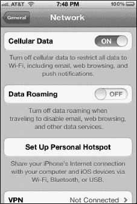

5.  如果您尚未设置套餐——或者您购买的套餐尚未在 iPhone 上激活——您将看到一个类似于此的弹出消息。如果您确实购买了套餐，那么您可能需要稍等片刻等待套餐激活。

   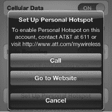

6.  如果您的套餐已激活，您应该会在主`设置`屏幕上看到`个人热点`选项。轻点它。

   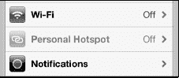

7.  轻点`个人热点`旁边的开关，将其设置为`开启`。

   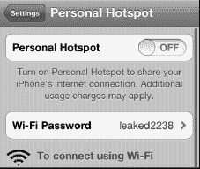

8.  您的 iPhone 会自动为您生成一个`Wi-Fi 密码`。如果您对该密码满意，请跳到下一节。

   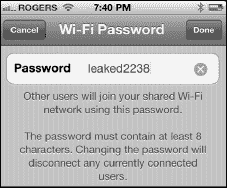

9.  如果您想更改密码，请轻点`Wi-Fi 密码`。
10. 输入您的新`密码`。确保其至少包含八个字符。最好使用数字、大小写字母和标点符号的组合。

### 第 3 步：连接到你的 iPhone 个人热点

现在你的 iPhone 就变成了一个小型移动 Wi-Fi 路由器；你可以将 Mac 或 Windows 电脑、iPad 或其他任何支持 Wi-Fi 的设备连接到你的 iPhone，就像连接到家庭、公司或学校的 Wi-Fi 网络一样。按照以下步骤操作：

1. 在你的设备上检查可用的 Wi-Fi 网络。
2. 点击你 iPhone 的名称。
3. 输入 Wi-Fi 密码。

如果一切正常，你会在 iPhone 屏幕顶部看到一条蓝色横条，并显示已连接的设备数量。

### 第 4 步：在你的电脑上设置网络连接

将 iPhone 连接到电脑后，Windows 或 Mac 电脑应将你的 iPhone 识别为新的互联网连接，并自动帮你完成设置。如果电脑没有立即识别出 iPhone，请进入电脑的**网络**设置，查找名为 iPhone 的可用连接类型。

## VPN：虚拟专用网络

你的组织机构可能拥有一种称为 VPN 或*虚拟专用网络*的设施。VPN 允许你将 iPhone、笔记本电脑或其他设备安全地连接到公司网络。

### 开始连接

为了建立连接，你需要从组织机构的帮助台或网络管理员处了解 VPN 的类型和具体的登录说明。然后，你需要在 iPhone 的**设置**应用中的 **VPN** 区域输入这些登录详细信息。

**提示**：如果你已经将电脑设置为连接到 VPN，那么你可能无需致电帮助台，直接跳过第 1 步。因为你的 iPhone 很可能使用与电脑相同的 VPN 登录凭据。

此外，某些运营商可能要求使用企业账户才能在其 3G 网络上使用 VPN。如果所有设置看起来都正确，但 VPN 仍无法正常工作，请咨询你的运营商。

#### 第 1 步：联系组织机构的帮助台

你需要向帮助台或 VPN 管理员询问登录 VPN 的详细信息。你的 iPhone 目前可以连接以下类型的 VPN：**L2TP**、**PPTP** 和 **IPSec**（Cisco）。你还需要了解你的 VPN 是否使用**代理**，以及配置是手动的还是自动的。

#### 第 2 步：在 iPhone 上设置 VPN 连接

有了登录说明和 VPN 连接类型后，你就可以用 iPhone 进行连接了：

1. 轻点**设置**图标。
2. 轻点**通用**。
3. 轻点**网络**。
4. 向下滚动到屏幕底部，然后轻点 **VPN**。

   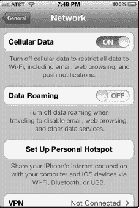

5. 在 **VPN** 屏幕上，轻点 **VPN** 选项旁边的开关，将其设置为**开启**。随后你应该会进入**添加配置**屏幕。如果没有，请轻点底部的**添加 VPN 配置**来设置新的 VPN 连接。

   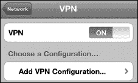

6. **添加配置**屏幕用于设置你的 VPN 登录详细信息，请使用从帮助台或 VPN 管理员处获取的信息。
7. 如果你的 VPN 是 **L2TP** 类型，则使用此处显示的屏幕。向下滚动到底部，根据需要输入**代理**信息。

   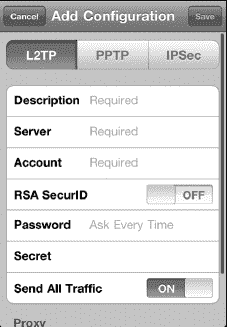

8. 如果你的 VPN 是 **PPTP** 类型，则轻点顶部的 **PPTP**，然后使用此处显示的屏幕。向下滚动到底部，根据需要输入**代理**信息。

   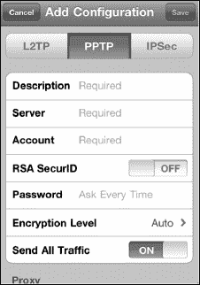

9. 如果你的 VPN 是 **IPSec**（Cisco）类型，则轻点 **IPSec**，然后使用此处显示的屏幕。向下滚动到底部，根据需要输入**代理**信息。
10. 设置完成后，轻点右上角的**存储**按钮。
11. 如果登录遇到问题，请确保你处于信号良好的无线网络覆盖区域，并确认你已正确输入所有登录凭据。输入时密码会消失，这可能会带来困难。在致电帮助台之前，不妨尝试重新输入密码和服务器信息。

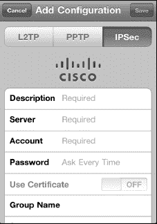

### 了解何时连接到 VPN 网络

你会在网络连接状态显示区的右侧看到一个小 **VPN** 图标 。*只有*当你看到此图标时，才表示你已安全连接到 VPN 网络。

### 切换 VPN 网络

你可能需要连接到多个 VPN 网络。你可以按照以下步骤在 iPhone 上选择不同的 VPN 配置：

1. 轻点**设置**图标。
2. 轻点**通用**。
3. 轻点**网络**。
4. 向下滚动到屏幕底部，然后轻点 **VPN**。
5. 在 VPN 屏幕上，轻点另一个 **VPN 配置**以连接到该网络。除非你想更改该网络的登录设置，否则不要轻点带有 `>` 符号的蓝色**圆圈**图标。

