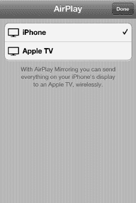
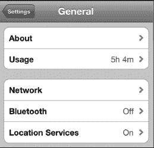
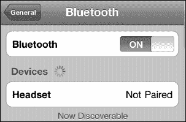
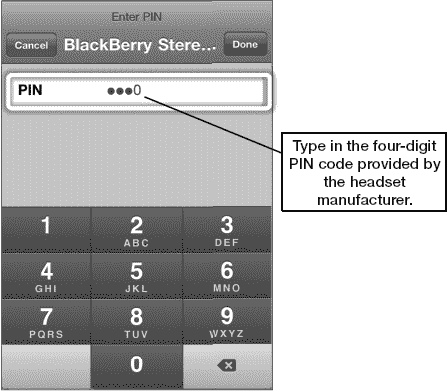
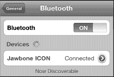
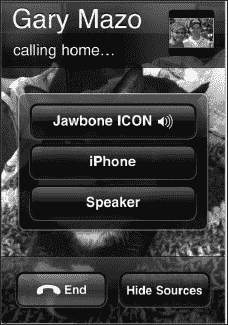
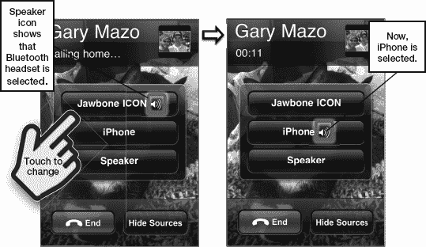
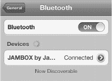
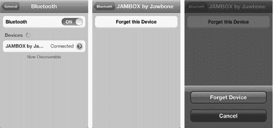

# 第 5 章

## AirPlay 与蓝牙

在本章中，我们将向你展示如何将 iPhone 连接到任何兼容 AirPlay 或蓝牙的设备，无论是 Apple TV、立体声音箱还是无线耳机。

### 了解 AirPlay

*AirPlay* 是苹果专有的视频和音频流媒体协议。AirPlay 通过你本地家庭、学校或办公室的 Wi-Fi 网络工作。在使用 iPhone 的 AirPlay 之前，你必须确保所有设备都连接到同一个 Wi-Fi 网络。

#### 可与 iPhone 配合使用的 AirPlay 设备

在撰写本书时，只有 2010 款的 Apple TV 支持 AirPlay 视频流播放。借助它，你可以将内容直接从 iPhone 流式传输到大屏幕电视上，与同事、朋友和家人分享。

苹果的 AirPort Express Wi-Fi 路由器带有一个音频输出接口，可以连接音箱用于 AirPlay 音频播放。各种第三方配件制造商也在推出兼容 AirPlay 的音箱。通过 AirPlay，你可以直接在 iPhone 上远程控制播放和音量。

### 设置和使用 AirPlay

AirPlay 内置于 iPhone 中。只要所有设备都连接到同一个 Wi-Fi 网络，就无需额外设置。

几款内置的 iPhone 应用支持 AirPlay，包括**视频**、**音乐**和 **YouTube**。一些使用苹果默认媒体播放器的 App Store 应用（例如 **Air Video**）也支持 AirPlay。按照以下步骤，在支持该功能的应用中使用 AirPlay：

1. 轻点屏幕右下角的蓝色 **AirPlay** 图标。
2. 从可用设备列表中选择用于流式播放音乐的设备。
3. 要将视频或音乐切换回 iPhone，只需再次轻点 **AirPlay** 图标，然后从列表中选择 **iPhone**。

**注意**：**AirPlay** 图标会弹出同时列出了蓝牙和 Wi-Fi 连接设备的菜单。有关蓝牙的更多信息，请参阅下一节。

你可以通过轻点来选择 **Apple TV**。现在，你的音乐或视频将开始从选定的 AirPlay 设备播放。你可以再次触摸屏幕上的 **AirPlay** 图标来确认。你会在新的 AirPlay 立体声蓝牙设备旁边看到一个**对勾**图标，并且应该能听到音乐从该音源发出。

**提示**：为了节省 iPhone 的电量，在通过 AirPlay 向其他设备流式传输内容时，按下**锁定**按钮关闭屏幕。你的音乐或视频会继续播放，但不会因为屏幕亮着而浪费电量。

#### AirPlay 镜像

当前的 iPhone 不仅能让你将 iPhone 上的视频或音乐流传输到 Apple TV；它还能让你共享任何应用的屏幕——从工作中的商务演示，到与家人的棋盘游戏，再到与远方亲戚的视频通话。能够将 `Keynote`、`Infinity Blade` 或 `FaceTime` 从小小的 iPhone 屏幕转移到巨大的电视屏幕上，确实将原本私密的个人体验转变成了有趣的社交活动。

请按照以下步骤使用 AirPlay 镜像功能：

1.  点击你想要镜像的应用。在此示例中，我们使用 `Infinity Blade`。
2.  应用启动后，双击主屏幕按钮以调出快速应用切换器。
3.  从左向右滑动以进入音频/视频控制界面。（它们在最末端，所以请继续滑动直到无法再滑动为止。）
4.  点击 `AirPlay 按钮` 以调出你 Wi-Fi 网络上支持 AirPlay 的设备列表。
5.  选择 `Apple TV`。
6.  将 `AirPlay 镜像` 开关切换到 `开启`。
7.  再次点击 `主屏幕` 按钮以返回你的应用。
8.  现在你应该能在电视大屏幕上看到 `Infinity Blade` 了。让他们见识一下吧！

要停止 AirPlay 镜像，重复相同的步骤，并从设备列表中选择 `iPhone`。

### 了解蓝牙

Apple 最新的 iPhone 支持蓝牙 4.0，它包含了传统的蓝牙功能，以及更先进的高速和低功耗能力。这意味着你可以用比以往更高的质量和更长的时间通话或听音乐。

随着许多州通过法律要求驾车者使用免提方式通话，使用蓝牙现在比以往任何时候都更有必要。得益于名为 `A2DP` 的技术，你还可以将音乐流传输到支持蓝牙的立体声设备，包括许多新型车载音响和车载套件。

**注意**：你必须拥有第三方支持蓝牙的适配器或支持蓝牙的立体声设备，才能通过蓝牙技术流传输音乐。

### 了解蓝牙

蓝牙允许你的 iPhone 以无线方式与其他设备通信。蓝牙是一个从每个设备发射信号的小型无线电。在使用外围设备与 iPhone 配合之前，你必须将该设备与你的 iPhone 配对。许多蓝牙设备可以在距离 iPhone 最远 30 英尺（约 9 米）的范围内使用。

#### 可与 iPhone 配合使用的蓝牙设备

除其他功能外，iPhone 可与蓝牙耳机、蓝牙立体声系统和适配器、蓝牙键盘、蓝牙车载音响系统、蓝牙耳麦和免提设备配合使用。iPhone 支持 `A2DP`（即立体声蓝牙）和 `AVRCP`（允许你远程控制播放和音量）。

### 配对蓝牙设备

你使用蓝牙的主要用途可能是蓝牙耳机、蓝牙立体声适配器或蓝牙耳麦。任何蓝牙耳机都应能与你的 iPhone 良好配合。要开始使用任何蓝牙设备，你首先需要将其与你的 iPhone 配对（连接）。

#### 开启蓝牙

使用蓝牙的第一步是开启蓝牙无线电。请按以下步骤操作：

1.  点击你的 `设置` 应用。
2.  然后点击 `通用`。
3.  点击 `蓝牙`。默认情况下，iPhone 上的蓝牙初始设置为 `关闭`。点击开关将其切换到 `开启` 位置。

**提示**：蓝牙会额外消耗电池电量。如果你计划在一段时间内不使用蓝牙，请考虑将开关调回 `关闭`。

#### 配对耳麦或任何蓝牙设备

一开启蓝牙，iPhone 就会开始搜索附近的任何蓝牙设备，例如蓝牙耳麦或立体声适配器（请参见图 5–1）。要让 iPhone 找到你的蓝牙耳麦，你需要将该设备置于*配对模式*。请仔细阅读耳麦附带的说明——通常需要按下某个按钮组合来实现。

**提示**：有些耳麦要求你按住一个按钮五秒钟，直到你看到一系列闪烁的蓝色或红/蓝色灯光。某些配件，如 Apple 无线蓝牙键盘，会自动以配对模式启动。

一旦 iPhone 检测到蓝牙设备，它将尝试自动与之配对。如果自动配对成功，你无需再做任何操作。

**图 5–1.** *已发现但尚未配对的蓝牙设备*

**注意**：某些蓝牙设备（例如耳麦）可能会要求你在键盘上输入一串数字（一个*密码*）（请参见图 5–2）。

**图 5–2.** *在配对过程中出现提示时，输入四位数的密码。*

较新的耳麦——例如这里使用的 Aliph Jawbone ICON——会自动与你的 iPhone 配对。只需将耳麦置于配对模式，并将 iPhone 的 `蓝牙` 选项设置为 `开启`——你需要做的就是这些！

配对将自动完成，你以后应该无需再重新配对耳麦。

#### 使用蓝牙耳麦

如果你的耳麦已正确配对并开启，所有来电都应路由到你的耳麦。通常，你只需按下耳麦上的主按钮即可接听电话，或使用 iPhone 上的“滑动来接听”功能。

如果你将手机从脸旁移开（在 iPhone 拨号时），你应该会看到一个指示器，显示蓝牙耳麦正在使用中。在右侧的图片中，你可以看到 `Jawbone ICON` 蓝牙耳麦旁边有 `扬声器` 图标。

你还会看到将通话发送到你的 iPhone 听筒或免提电话（`扬声器`）的选项。你可以在通话期间的任何时候更改此设置。

触摸 `隐藏来源`，你将看到 iPhone 的正常通话屏幕。

##### 通话中的选项

一旦通话接通并与联系人交谈，你仍然可以将通话重新路由到 iPhone 或免提电话。

将通话从脸旁移开（如果它在你的脸旁），你会看到 `音频来源`  作为可供触摸的选项之一。触摸该图标，你将看到所有重新路由通话的选项，如上所示。

只需选择将通话发送到显示的任意选项，你就会看到小的 `扬声器` 图标移动到当前用于通话的来源上（请参见图 5–3）。

**图 5–3.** *在通话中从蓝牙耳麦切换回 iPhone*

## 蓝牙立体声 (A2DP)

当今先进蓝牙技术的一大特色是能够通过蓝牙以无线方式流传输你的音乐。这项技术的花哨名称是 `A2DP`，但它更简单地被称为*立体声蓝牙*。

#### 连接立体声蓝牙设备

使用立体声蓝牙的第一步是连接一台支持立体声蓝牙的设备。这可以是内置该技术的汽车音响、一副蓝牙耳机或蓝牙音箱，甚至是 Jawbone Jambox 这类较新的耳机。

首先，按照制造商的说明将蓝牙设备置于配对模式，然后从`设置`图标进入蓝牙设置页面，如本章前面所示。

连接成功后，你会看到新的立体声蓝牙设备列在你的蓝牙设备列表中。有时你会看到设备名称或名称的一部分；其他时候你只会看到`耳机`。点击设备右侧的`箭头`图标，你将在下一个屏幕的`蓝牙`选项卡旁边看到设备的实际名称，如下图所示。

接下来，打开你的`音乐`应用，开始播放任意歌曲、播放列表、播客或视频音乐库。

按照以下步骤选择你的音频输出设备：

1. 点击屏幕右下角的蓝色`AirPlay`图标。
2. 从可用设备列表中选择用于流媒体播放音乐的设备。
3. 要将音乐播放切回你的 iPhone，只需再次点击`AirPlay`图标，然后从列表中选择`iPhone`。

**注意**：点击`AirPlay`图标会弹出一个列表，其中包含通过蓝牙和 Wi-Fi 连接的音频设备，例如 Apple TV 或 AirPort Express 连接的音箱。你可以从中任选其一。

我们通过点击选择了 Jawbone JAMBOX。现在，你的音乐将从选定的蓝牙设备开始播放。你可以再次触摸屏幕上的`AirPlay`图标来验证这一点。你会在新的立体声蓝牙设备旁边看到一个`勾选`图标，同时你也会听到音乐从该音源播放出来。

### 断开或忽略蓝牙设备

有时，你可能想断开 iPhone 与蓝牙设备的连接。这很容易操作。像本章前面所做的那样进入蓝牙设置。接着，触摸你想断开的设备，进入下一个屏幕，点击`忽略此设备`按钮，然后确认你的选择。

这将从 iPhone 中删除该蓝牙配置文件（见图 5–5）。

**注意**：蓝牙的有效范围只有大约 30 英尺（约 9 米）。如果你不在蓝牙设备附近，则应关闭蓝牙。当你准备好使用时，随时可以重新打开它。

**图 5–5.** *忽略或断开蓝牙设备*

