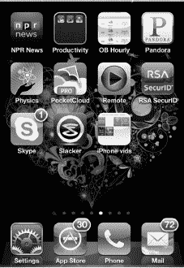
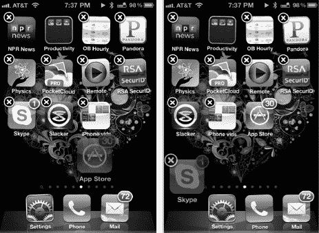
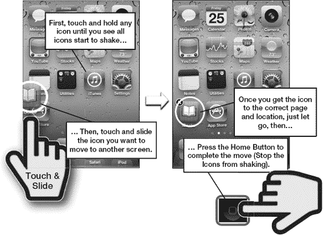
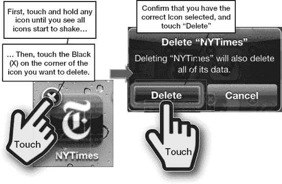
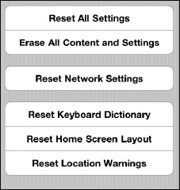
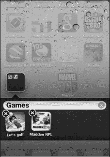
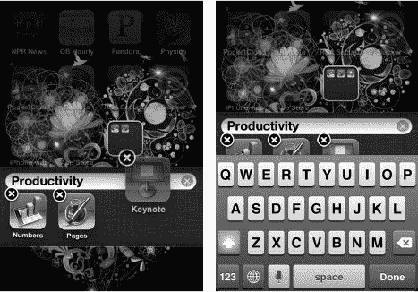

# 第 6 章

## 图标与文件夹

你的新 iPhone 非常个性化。在本章中，我们将向你展示如何移动图标，并将你最喜欢的图标放在你想要的位置。你最多可以有 11 页图标可供使用，并且你可以调整这些页面的外观，使其反映你的品味。

与 Mac 电脑或 iPad 一样，iPhone 有一个*底部程序坞*，你可以将最喜欢应用的图标放在里面。iPhone 出厂时底部程序坞中有四个标准图标。你可以用最喜欢应用的图标替换这些默认图标，这样它们就始终位于屏幕底部。你甚至可以将整个应用文件夹移动到底部程序坞。

**提示**：你也可以使用电脑上的`iTunes`应用来移动或删除图标。请参阅第 22 章：`设备上的 iTunes`以获取更多信息。

### 将图标移至底部程序坞

当你打开 iPhone 时，会注意到底部程序坞中锁定着四个图标。

假设你决定要用自己更常用的应用来替换其中的一个或多个图标。幸运的是，将图标移入或移出底部程序坞非常简单。

#### 开始移动

按下`主屏幕`按钮进入你的`主屏幕`。然后触摸并按住`主屏幕`上的任意图标几秒钟。你会注意到所有图标都开始晃动。

先试着移动几个图标。你会看到，当你将一个图标向下移动时，该行中的其他图标会移动为其腾出空间。

一旦你掌握了图标移动的方法，就可以准备替换底部程序坞中的一个图标了。在图标晃动时，将你想从底部程序坞替换的图标向上移动到一个被其他图标覆盖的区域。（如果你将其移动到一个空白区域，它只会直接跳回底部程序坞）。

**注意**：底部程序坞中最多可以放置四个图标；所以，如果那里已经有四个图标，你必须移除一个才能用新图标替换它。

例如，假设你想用`Skype`图标替换我们例子中的`App Store`图标，因为你希望随时方便地用`Skype`与在外上大学的孩子通话。首先要做的是从底部程序坞中移除`App Store`图标，以便腾出空间，如图 6–1 所示。

**图 6–1.** *在底部程序坞中交换图标*

接下来，找到你的`Skype`图标并将其向下移动到底部程序坞。你会看到，在你实际将其放置到位之前，该图标会变成半透明状态。

当你确定图标已经放到了你想要的位置后，只需按一次`主屏幕`按钮，图标就会锁定到位。此时，底部程序坞中就有了`Skype`图标，你可以轻松地开始与上大学的孩子们进行视频通话。

### 将图标移动到不同的图标页面

iPhone 每页可以容纳 16 个图标（不包括程序坞）。你可以通过在`主屏幕`上滑动（从右向左）来浏览这些页面。有了这么多炫酷的应用，拥有五页、六页甚至更多页图标是很常见的。如果你有冒险精神，最多可以装满 11 页图标！

**注意**：你也可以通过在任何屏幕（`主屏幕`除外）上从左向右滑动来导航到新页面。在`主屏幕`上，从左向右滑动会进入`聚焦搜索`；请参阅第 2 章：`键入、复制与搜索`以获取更多信息。

你可能在第一页有一个很少使用的图标，想把它移到最后面的一页。或者你可能想将一个常用图标从最后一页移到第一页。这两项任务都非常简单；实际上，这与将图标移到底部程序坞非常相似：

1. 触摸并按住任意图标以启动移动过程。
2. 触摸并按住你要移动的图标。例如，假设我们要将`iBooks`图标移动到第一页（见图 6–2）。

    

    **图 6–2.** *将图标从一页移动到另一页*

3. 现在将图标拖放到另一个页面。为此，触摸并按住`iBooks`图标并将其向左拖动。你会看到你的所有图标页面依次滑过。当你到达第一页时，只需松开图标，它现在就被放置在开头位置。
4. 按下`主屏幕`按钮以完成移动并停止图标晃动。

### 删除图标

请注意——删除图标和移动图标一样简单。当你删除 iPhone 上的图标时，实际上是在删除它所代表的程序。这意味着除非重新安装或重新下载，否则你将无法再次使用该程序。

根据你在`iTunes`应用中的“应用同步”设置，该程序可能仍会保留在 iTunes 的“应用”文件夹中。在这种情况下，你只需在 iTunes 的同步应用列表中勾选该应用，即可重新安装被删除的应用。

如图 6-3 所示，删除图标的过程与移动图标类似。长按任意图标即可启动删除流程。和之前一样，长按会使图标抖动，并允许你移动或删除它们。

**注意**：你只能删除已下载到 iPhone 上的程序；预装的图标及其关联程序无法删除。你可以通过查看图标左上角是否有黑色小`x`来判断哪些程序可以删除。

只需点击你想要删除的图标上的`x`。系统会提示你选择`删除`图标或`取消`删除请求。如果你点击`删除`，该图标及其关联应用将从 iPhone 上移除。

**注意**：如果你删除一个游戏等记录了进度的图标，删除该游戏时你的进度也会被清除。

**图 6-3.** *删除图标及其关联程序*

### 重置所有图标位置（恢复出厂默认设置）

有时，你可能会想恢复到原始的出厂默认图标设置。比如当你将太多新图标移到第一页，又想重新看到所有基础图标时。

操作方法是：点击`设置`图标。接着点击`通用`，最后滚动到底部点击`还原`。

**注意**：内置应用将恢复到苹果出厂时 iPhone 上的排列顺序。

在`还原`界面中，点击靠近底部的`还原主屏幕布局`。现在所有图标将恢复到原始设置。

**警告**：请注意不要误触其他`还原`选项，因为按错按钮可能会意外擦除整个 iPhone。如果发生这种情况，你将需要从 iTunes 备份中恢复数据。

### 使用文件夹

你的 iPhone 允许你将应用整理到文件夹中。当你下载新应用时，它们会占据`主屏幕`上的一个位置。一旦下载了大量应用，查找应用和保持其有序就会变得困难。

使用文件夹可以将你的游戏、办公应用以及其他功能相似的应用归类存放。每个文件夹最多可容纳 12 个应用——这能极大地帮助你整理 iPhone！

#### 创建文件夹

创建文件夹直观又有趣：

1.  按住某个应用，直到所有应用开始抖动（与之前在“移动图标”部分中的操作相同）。
2.  将一个应用拖拽到另一个功能相似的应用上。例如，将一个办公应用拖到另一个类似的应用上。iPhone 会先为文件夹创建一个名称。
3.  在本例中，我们将三个苹果办公应用（`Numbers`、`Keynote`和`Pages`）互相拖拽叠加，iPhone 创建了一个名为“Productivity”的文件夹。
4.  你可以通过点击`名称`字段并输入新名称来编辑文件夹名称（参见图 6-4）。
5.  按下`主屏幕`按钮以设置新的文件夹名称。
6.  再次按下`主屏幕`按钮返回`主屏幕`界面。此时，你将看到带有新名称的新文件夹。

**注意**：每个文件夹最多可放置 12 个应用图标。如果你尝试放入更多图标，会看到新图标不断被“挤出”文件夹。这种动画效果表示文件夹已满。

**图 6-4.** *移动图标以创建文件夹并重命名*

#### 移动文件夹

与应用一样，文件夹也可以从一个`主屏幕`页面移动到另一个页面：

1.  长按一个文件夹，直到`主屏幕`上的文件夹和图标开始抖动。
2.  按住文件夹并将其拖拽到你想要的位置（或另一个`主屏幕`页面），然后松开手指。
3.  当文件夹位于所需位置后，只需按下`主屏幕`按钮即可完成移动。

**提示**：如果你愿意，甚至可以将文件夹移动到底部程序坞。这是一种非常方便的方式，可以让你轻松访问大量应用（参见图 6-5）。

**图 6-5.** *将文件夹移动到底部程序坞*

