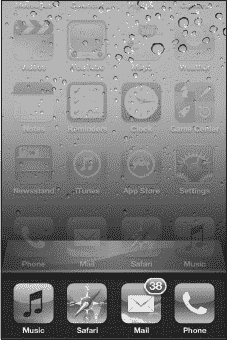
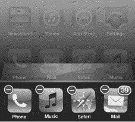
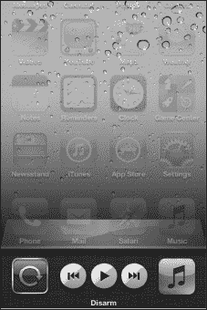
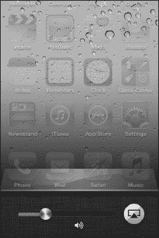
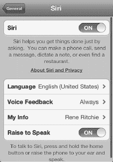
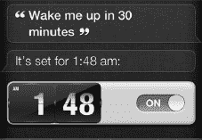
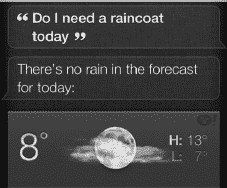
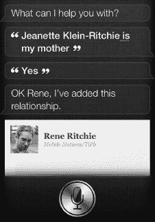
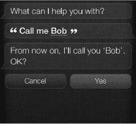
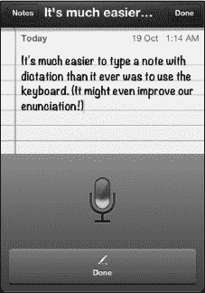

# 第 7 章

## 多任务处理与 Siri

在本章中，我们将介绍如何在 iPhone 上进行多任务处理以及在应用间快速切换。多任务处理意味着你可以在做其他事情的同时，让某个应用在后台运行，例如播放网络广播、收听逐向导航，或接听 Skype 电话。

我们还将向你介绍苹果革命性的 Siri 服务，这是一个人工智能“助手”，它可以听取你的语音指令，发送信息、预约日程，并在你需要时搜索相关信息。

### 快速应用切换

*快速应用切换器*允许你让多个应用在后台运行。它还能让你在不停止当前应用的情况下，切换到另一个应用。

你可能想知道何时适合使用快速应用切换器。以下是你可能需要在 iPhone 上使用多任务处理的几个场景：

*   从一个应用（`邮件`）复制粘贴内容到另一个应用（`日历`）。
*   在玩游戏时接听电话或回复`短信`，然后无缝跳回游戏。
*   在检查电子邮件或浏览网页的同时，继续收听网络广播（如`Pandora`或`Slacker`）。
*   无需等待照片上传到 Facebook 或 Flickr；照片可以在后台上传，而你则在 iPhone 上做其他事情。
*   使用`Skype`拨打电话——现在可以让它在后台运行以接听来电（此前无法实现）。

#### 在应用间切换

要进行多任务处理，你需要调出屏幕底部的快速应用切换器栏。

1.  从任何应用甚至主屏幕，双击主屏幕按钮，调出屏幕底部的快速应用切换器栏。

    

2.  所有打开的应用都会显示在快速应用切换器栏上。
3.  向右或向左滑动找到你想要的应用，然后轻点它。
4.  如果你在快速应用切换器栏上看不到想要的应用，请按下主屏幕按钮并从主屏幕启动它。
5.  再次双击`主屏幕`按钮，然后轻点你刚刚离开的应用即可跳回。

### 从快速应用切换栏中关闭应用

iPhone 会自动管理内存，让正在执行有用操作（如播放流媒体音乐）的应用保持开启，并将闲置的应用置于“休眠”状态，从而避免它们占用内存或处理器资源。但有时，某个异常进程可能导致应用无法正常关闭；另一些时候，你可能希望确保 GPS 或 VoIP 应用提前关闭以节省电量。在这些情况下，你可以使用快速应用切换栏手动关闭应用。

内置应用如 `Mail` 和 `Phone` 会立即重新启动，因此你不会错过任何重要信息。从 App Store 下载的应用和游戏则会保持关闭状态，直到你再次点击它们的图标启动。请按照以下步骤从 `快速应用切换栏` 中关闭应用：

1.  双击 `Home` 按钮，调出`快速应用切换栏`。
2.  长按 `快速应用切换栏` 中的任意图标，直到所有图标开始晃动。你会注意到每个应用图标的左上角会出现一个带减号的红色`圆形`图标。
3.  点击红色`圆形`图标  以完全关闭应用。
4.  继续点击红色`圆形`图标，关闭任意多个你想要关闭的应用。

### 媒体控制与竖屏方向锁定

在 `快速应用切换栏`上从左向右滑动，将会调出媒体控制和`竖屏方向锁定`图标。请按照以下步骤访问这些控制选项并使用竖屏方向锁定功能：

1.  在任何应用中，甚至在`主屏幕`上，双击`Home`按钮，调出屏幕底部的`快速应用切换栏`。
2.  从左向右滑动，即可看到媒体控制和`竖屏方向锁定`图标。
3.  点击`竖屏方向锁定`图标，将屏幕锁定为竖屏（即垂直）方向。即使你将 iPhone 侧放，它也会保持此方向。当你在按钮内部看到一个`锁定`图标，并且在顶部状态栏中也看到一个`锁定`图标时，即表示手机已锁定。 
4.  当前正在播放的媒体名称会显示在屏幕底部。

    

5.  你也可以使用中间的`上一曲`、`播放/暂停`和`下一曲`按钮。如果长按`上一曲`或`下一曲`按钮，它们会分别变为`快退`或`快进`按钮。
6.  或者，你可以点击`应用`图标，跳转到你 iPhone 上最后播放音乐的应用。

### 音量控制与 AirPlay

如果在 `快速应用切换栏`上尽可能向左滑动，你会找到音量控制和 `AirPlay` 按钮。请按照以下步骤操作这些控制选项：

1.  在任何应用中，甚至在`主屏幕`上，双击`Home`按钮，调出屏幕底部的`快速应用切换栏`。
2.  从左向右滑动，经过媒体控制，直到你看到音量控制和 `AirPlay` 按钮。
3.  点击 `AirPlay` 按钮，可以将 iPhone 的音频传输到兼容 `AirPlay` 的扬声器，将视频传输到 Apple TV，或在 Apple TV 上镜像你的应用。
4.  向左滑动`音量`控制滑块可降低音量；向右滑动可提高音量。

### Siri：你的虚拟助理

Siri 是一个具备情境和关系感知能力的人工智能虚拟个人助理。这意味着你可以向 Siri 提问，它不仅能回答你的问题，还能为你做各种事情，比如告诉你妻子你会迟到，15 分钟后叫醒小憩的你，建议你出门带雨衣，帮你找喝咖啡的地方，或者告诉你最喜欢的电影主演是谁。Siri 既不是魔法也不是科幻，但苹果赋予了它个性，因此它常常让人觉得两者兼而有之。

**注意：** 在撰写本文时，Siri 仍处于测试版阶段。苹果仅支持英语（美国、英国和澳大利亚）、法语和德语。你可以在其他地区开启它，但效果可能有所不同。此外，像定位服务（搜索地图和查找地点的功能）在美国境外尚无法使用。

最后，Siri 在不同地区有不同的语音。例如，在美国，Siri 使用女声。在英国，Siri 使用男声。

### 启用与配置 Siri

在开始使用 Siri 之前，你需要先开启这项服务。请按照以下步骤操作：

1.  启动`设置`应用。
2.  向下滚动并点击`通用`。
3.  点击`Siri`。
4.  将 `Siri` 开关切换到`开启`状态。

要更改语言，点击语言并从列表中选择一种语言。

截至发布时，仅支持澳大利亚、英国和美国的英语、法语以及德语。

你可以选择 Siri 是在`始终`回应你，还是仅在`免提`时回应。如果你不喜欢手机大声说话，请将此选项设置为仅 `免提`。如果你希望以更互动的方式体验 Siri，请将其保持为`始终`。

为了让 Siri 知道你是谁，以便它能够称呼你的名字，请将`我的信息`设置为你自己的联系人名片。

将`抬起唤醒`选项设置为`开启`后，每当你将 iPhone 从睡眠中唤醒（通过按下顶部的`睡眠/唤醒`按钮或正面的`Home`按钮）并将其举到耳边时，Siri 就会被激活并询问你的需求。

### 使用 Siri

要使用 Siri，请长按 `Home` 按钮。（或者，如果你的 iPhone 已开启并且你按照上一节所述在`设置`应用中启用了`抬起唤醒`选项，那么你只需将手机举到耳边即可。）

你的`主屏幕`会向上滑动，露出一个银色的`麦克风`图标。等待 Siri 发出提示音后再开始说话；然后用清晰的声音、适中的语速说话，就像你在跟另一个人说话一样。说完话后，等待 Siri 再次发出提示音。此时，所有乐趣便开始了。

#### 你可以向 Siri 询问什么

苹果建议你像与真人交谈一样与 Siri 对话。不必刻意记住一组固定的指令或查询——它们的种类和变体实在太多，难以全部记住。相反，只需直接告诉 Siri 你想要什么。以下是 Siri 能为你做的一些示例：

*   设置提醒、日历 appointments*、时钟闹钟和计时器。
*   发送短信**、信息和电子邮件。
*   播放音乐。
*   搜索基于位置的信息，例如餐厅和商家列表。你也可以搜索前往某个位置的路线。
*   搜索 `Yelp`（美国地区）、`Wolfram Alpha` 和 `Google` 以获取信息。
*   询问天气和股票信息。
*   朗读你的 `SMS`/`iMessage` 信息。
*   在任何应用中听写文字。
*   问些傻问题——苹果实际上为其中许多问题预设了有趣的回答。

更令人印象深刻的是，Siri 可以组合许多这些功能来完成复杂的交互。例如，Siri 可以读取一条约会晚餐的请求信息，搜索餐厅，获取路线，发送确认信息，然后添加晚餐的日程——所有这些都作为交互式确认的一部分。

以下只是你可以询问的一些内容，以及一些提问方式：

*   “Siri，提醒我离开家时给上班的妈妈打电话。”

    这将使 Siri 创建一个提醒，将出发地点设置为你的家庭地址，并在你离开时弹出一个包含你妈妈工作电话的提醒，方便你直接拨号。

*   “Siri，告诉我的老板我马上到。”

    Siri 会找到被定义为“老板”的联系人，获取手机号码，并向她发送一条内容为“我马上到”的 `SMS`/`iMessage`。

*   “Siri，读一下我的消息。”

    Siri 会朗读所有新收到的 `SMS` 或 `iMessage`。

*   “Siri，30 分钟后叫醒我。”

    Siri 会设置一个时钟计时器，将在 30 分钟后响铃（希望那时你的小憩已经结束）。

    

*   “Siri，我今天需要穿雨衣吗？”

    Siri 会查看天气，判断是否可能下雨，并告知你是否需要担心被淋湿。

    

*   “Siri，给我讲个笑话。”

    Siri 可能会开始讲那个关于两部 iPhone 走进一家酒吧的笑话……

    

*   “Siri，我午餐去哪里能吃到意大利菜？”

    Siri 会搜索附近的餐厅，并在地图上显示出来。在美国地区，它还可以按 `Yelp` 排名进行排序。

*   “Siri，电影 *《冲出宁静号》* 的主演是谁？”

    Siri 会搜索 `Wolfram Alpha`，并给出该电影的演员表。

*   “Siri，你最喜欢的颜色是什么？”

    Siri 会给出几种可能的回答之一，也许会说你的语言缺乏足够的维度来恰当地描述那种正确的绿色色调。

Siri 返回的结果有时会以小部件的形式呈现，如果你弄错了，可以对其进行调整或禁用。例如，你可以快速关闭一个`闹钟`小部件，将一个`提醒`小部件标记为已完成，点击一个`联系人`小部件中的电子邮件地址，等等。

请注意，Siri 目前并不完美。例如，有时它会误解你的意思。其他时候，服务器可能会过度繁忙。因此，Siri 有时会犯错或做错事。但随着时间的推移，随着它越来越了解你，你也越来越懂得如何组织你的问题和指令，它会变得更好。

起初最好只是玩玩它。尽可能多地试验，感受一下怎样做才能获得最佳效果。

#### 更改名称和设置关系

你可能在前面的例子中注意到，我们使用了诸如*妈妈*和*老板*这样的词，而 Siri 明白我们在谈论谁。然而，在 Siri 能做到这一点之前，你需要先设置好这些人。操作方法如下：

1.  按住 `主屏幕` 按钮启动 Siri。
2.  告诉 Siri 你要为谁设置关系，以及是什么关系。例如，你可以说：“简·史密斯是我的妈妈。”
3.  Siri 会询问你是否要记住“简·史密斯”是你的妈妈。
4.  听到提示音后，说“是”。（或者，只需轻点`是`按钮。）
5.  Siri 会用以下语句确认：“好的，我已添加此关系。”接着，你将看到更新后的联系人卡片。

**注意：** 关系一旦创建，Siri 就无法移除。如果你犯了错误或以后想更改关系，则必须前往`通讯录`应用，轻点`编辑`，然后手动`删除`该关系。

如果你希望 Siri 用昵称呼叫你——比如，用*鲍勃*而不是*罗伯特*，甚至用像*主人*这样有点傻的称呼——你可以轻松地做出更改：

1.  按住 `主屏幕` 按钮启动 Siri。
2.  告诉 Siri 你想被称呼的新名字，说一些像“叫我鲍勃”这样的话。
3.  Siri 会询问你是否要记住*鲍勃*作为你的新名字。
4.  听到提示音后，说“是”。（或者，你可以直接轻点`是`按钮。）

    

5.  Siri 会用这样的语句确认操作：“好的，我已添加此名字。”然后，你会在联系人卡片上看到更新后的昵称。

#### 使用听写功能

iPhone 4S 的键盘引入了一项新功能：在`空格`键正左侧有一个小麦克风按钮。

轻点它，你的屏幕会向上滑动，显示出一个发光的紫色麦克风。像对 Siri 说话那样对它说话；说完后，轻点`完成`按钮。你所说的所有内容都会被转写并作为文本输入。

没有哪个文本转语音引擎是完美的，但 Siri 在转写你所说内容方面做得相当不错。如果它出了什么错，你可以像编辑用键盘输入的文本那样编辑这些文字。

除了基本的词语和名字，Siri 还能理解广泛的符号和标点。例如，你可以说“句号”、“感叹号”，甚至“左括号”或“右方括号”。你也可以说“换行”或“新段落”。实际上，你可以用 Siri 输入几乎任何你知道正确名称的字符。

#### Siri 不能做什么

Siri 开箱就能做很多事情，以至于很难记住它不能做什么。话虽如此，Siri 是一项在线服务，苹果能够也将会随着时间的推移不断增加新功能。仅仅因为 Siri 今天不能做某事，并不意味着它明天也不能做。在撰写本文时，以下是 Siri 尚不能做的一些事情：

*   Siri 无法切换设置。你不能告诉它打开或关闭 Wi-Fi，或进入飞行模式。
*   Siri 无法启动应用。你不能告诉它启动`Facebook`或你最喜欢的游戏。

Siri 无法阅读电子邮件、Twitter 回复或信息之外的任何内容。如果你需要这项功能，必须使用像 `Tweet Speaker` 这样的第三方应用。

