# 第 8 章

## 个性化与安全

在本章中，你将学习几种个性化设置 iPhone 的简单方法。你还将学习如何使用密码保护来确保 iPhone 的安全。我们将向你展示在哪里可以下载免费壁纸来改变`锁定`和`主屏幕`的外观。我们还将向你展示如何通过调整各种活动的时间和声音来个性化 iPhone 发出的声音。iPhone 的许多方面都可以根据你的需求和品味进行微调，因此你可以赋予 iPhone 更具个性化的外观和感觉。

### 更改锁定屏幕与主屏幕壁纸

实际上，你的 iPhone 上可以个性定制的屏幕有两个，通过更改壁纸来实现。

当你首次开启 iPhone 或将其唤醒时，看到的是`锁定`屏幕。此屏幕的壁纸显示在`滑动来解锁`滑块条的后方。

`主`屏幕则展示了你所有的应用图标。你可以在图标后方看到壁纸。你可以使用 iPhone 自带的壁纸图片，也可以使用自己的图片。

**提示：** 你可能希望`锁定`屏幕的壁纸比`主`屏幕壁纸更少个人色彩。例如，你可以选择在`锁定`屏幕放一张普通的风景图，而在`主`屏幕放一张亲人的照片。此外，你可能更愿意选择一张不那么花哨的`主`屏幕壁纸，以免与应用图标产生冲突。

#### 通过“设置”应用更改壁纸

在 iPhone 上更改壁纸的方法有好几种。第一种方法非常直接：只需通过“设置”应用来调整你的壁纸：

1.  轻点“设置”图标。
2.  轻点“墙纸”。

    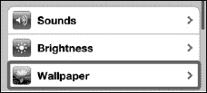

3.  轻点当前所选壁纸的图像。左侧显示的是`锁定`屏幕，右侧是`主`屏幕。

    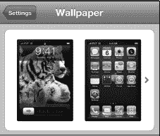

4.  选择一个相簿：

    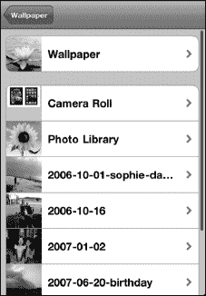

    *   轻点“墙纸”以选择预装的壁纸。
    *   轻点“相机胶卷”（如果在 iCloud 中启用了“我的照片流”，则轻点“我的照片流”），以从你用 iPhone 拍摄的照片、从网页保存的图片、屏幕截图（通过同时按住`主屏幕`按钮和`电源/睡眠`键截取）甚至壁纸应用中进行选择。
    *   轻点任何其他相簿以查看你已同步的图片。
5.  轻点某个相簿后，你将看到该相簿中的所有图片。向上或向下滑动可查看所有图片。你最近添加的图片会位于列表的最底部。
6.  轻点任意图片以将其选中并全屏查看。
7.  现在你可以移动和缩放图片：

    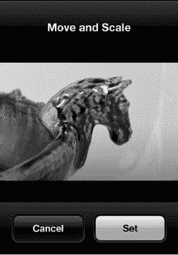

    *   通过触摸并拖动手指来移动图片。
    *   通过张开或捏合手指来放大或缩小。
    *   如果不喜欢该图片，轻点“取消”按钮可返回相簿。
8.  轻点“设定”按钮以将该图片设为你的壁纸。
9.  选择你想要壁纸应用的位置：

    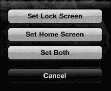

    *   轻点“设定锁定屏幕”按钮，将图片仅设为你的`锁定`屏幕壁纸。
    *   轻点“设定主屏幕”按钮，将图片仅设为你的`主`屏幕壁纸。
    *   轻点“同时设定”按钮，将图片同时设为`锁定`屏幕和`主`屏幕的壁纸。
10. 轻点`主屏幕`按钮以退出“设置”应用，并查看你的新壁纸，如图 8–1 所示。

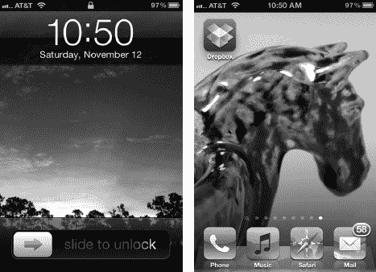

**图 8–1.** *查看你的`锁定`屏幕和`主`屏幕壁纸*

#### 使用任意照片作为壁纸

更改壁纸的第二种方法是：查看“照片”图库中的任意图片，并将其选为壁纸。请按照以下步骤操作：

1.  轻点“照片”图标开始操作。要了解更多关于处理照片的信息，请参见第 20 章：“使用照片”。
2.  轻点你想要浏览以寻找壁纸的照片相簿。
3.  当你找到一张想用的照片时，轻点它，它将在屏幕上打开。
4.  你轻点的缩略图将填满屏幕。如果这是你想要使用的图片，请轻点屏幕左下角的“设定为”图标 。
5.  轻点“用作墙纸”。

    

6.  要移动、缩放图片并将其设为`主`屏幕或`锁定`屏幕壁纸，请按照前一节的步骤 7-9 操作。如果你决定改用另一张图片，请选择“取消”并挑选另一张。

### 从免费应用下载精美的壁纸

前往 App Store 并搜索“backgrounds”或“wallpapers”（参见第 23 章：“神奇的 App Store”以获取更多信息）。你会找到许多专门为你的 iPhone 设计的免费或低成本应用。在本节中，我们将重点介绍这类应用中的一款，即 Apalon 出品的 `Pimp Your Screen`。这款应用有数百张精美的背景图片可供你的 iPhone 下载，且在本书出版时售价仅为 0.99 美元。

**注意：** 使用 `Pimp Your Screen` 时，与大多数壁纸应用一样，你需要保持有效的互联网连接——无论是 Wi-Fi 还是 3G。由于图片文件通常很大，建议你尽量使用 Wi-Fi，除非你的 3G 蜂窝数据网络套餐是无限流量的。

#### 使用壁纸应用

安装 `Pimp Your Screen` 后，你就可以开始使用了：

1.  轻点 `Pimp Your Screen` 图标以启动应用。

    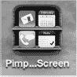

2.  应用的主屏幕提供了多个类别供你选择：`App Shelves`（放置应用的架子——有点像 iBooks 或报摊）、`Neon Combos`（霓虹背景）、`Home Screens`（漂亮的主屏幕）、`Icon Skins`（创建背景以突出显示你的图标）。然后你可以使用底部的两个选项——`Lock Screen Maker` 和 `Home Screen Maker`——来创建你自己个性化的锁定屏幕和主屏幕，如图 8–2 所示。

    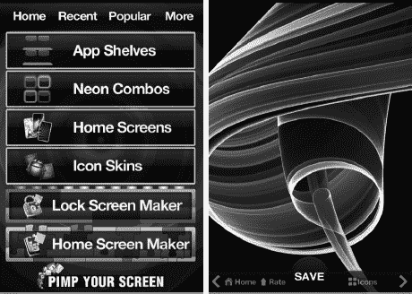

    **图 8–2.** *使用 Pimp Your Screen 应用。*

3.  轻点任一类别后，你可以向左或向右滑动以查看更多壁纸图片选项。要将壁纸保存到你的`相机胶卷`相簿中，请轻点图片底部中央的“保存”按钮。
4.  如果你不喜欢该图片，请轻点左下角的`主屏幕`按钮返回到主屏幕菜单。

#### 使用你新保存的壁纸

一旦你选好壁纸图片并保存到 iPhone，你需要按照本章前面“通过‘设置’应用更改壁纸”部分描述的步骤来选中它。

请记住，下载的壁纸会存放在`相机胶卷`相簿中。在你轻点`相机胶卷`将其打开后，你需要一直滚动到底部才能看到最近添加的内容。

### 在 iPhone 上调整声音

你可以精细调整 iPhone，使其在特定事件（如来电、新邮件或日历提醒）发生时发出或不发出声音。你还可以自定义发送邮件或键盘打字时的效果。

请按照以下步骤调整 iPhone 上播放的声音：

1.  轻点`设置`图标。
2.  轻点`声音`。

    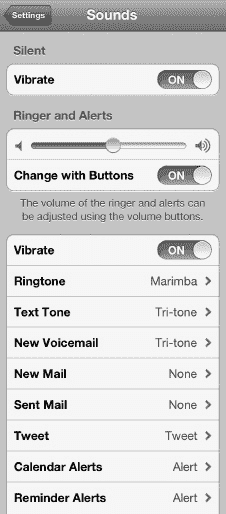

3.  你可以调整 iPhone 在`静音`和`铃声`模式下是否振动。将`振动`旁边的开关设置为`打开`或`关闭`。
4.  要调整铃声和其他提醒的音量，请移动`铃声`上方的滑块。
5.  要更改手机铃声或短信铃声；接收新邮件、推文、日历提醒或提醒事项时播放的声音；或已发送邮件完成时播放的声音——请轻点你想要更改的项目。
6.  此屏幕允许你选择新的铃声。轻点任一铃声即可播放并选中它。（你可以通过名称旁边的复选标记来判断铃声是否被选中。右侧图片中已选中`钟楼`。）

    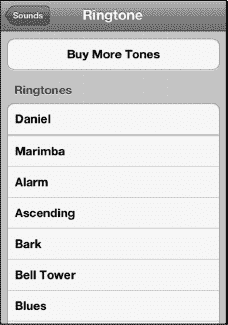

7.  如果没有你喜欢的铃声，可以轻点`购买更多铃声`，进入 iTunes 铃声商店，在那里你可以购买一些喜爱的歌曲作为铃声。
8.  完成后，轻点左上角的`声音`按钮。
9.  使用相同的步骤更改短信铃声、新邮件、推文等的声音。

    **提示：** 请参阅第 9 章：“使用电话”了解自定义铃声。

10.  在除`铃声`之外的所有声音类别中，你可以通过选择列表顶部的`无`来关闭播放的声音。

    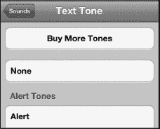

11.  `锁定声`和`键盘点击声`可通过轻点开关将其设置为`打开`或`关闭`来调整。完成后，按下`主屏幕`按钮退出。

    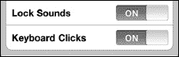

**提示：** 另外，你可以锁定`音乐`应用的最大可播放音量。方法是进入`设置`  `音乐`  `音量限制`  `锁定音量限制`。我们在第 12 章：“播放音乐”中展示了如何操作。

## 键盘选项

你可以通过选择多种语言以及更改`自动纠正`和`自动大写`等设置来精细调整键盘。你甚至可以让 iPhone 在你打字时读出自动纠正建议。请参阅第 2 章：“输入、复制和搜索”，了解各种键盘选项及其使用方法。

### 使用密码保护 iPhone

你的 iPhone 可以存储大量有价值的信息。如果你用它来保存家庭成员的社会安全号码和出生日期等信息，情况尤其如此。确保任何拿起你 iPhone 的人都无法访问所有这些信息，这是个好主意。此外，如果你的孩子像我们的孩子一样，他们可能会拿起你酷炫的 iPhone 开始上网或玩游戏。你可能希望启用一些安全限制来保护他们。

#### 设置简单的四位数字密码

在你的 iPhone 上，你可以选择设置一个四位数字密码，以防止未经授权访问你的 iPhone 和信息。然而，如果输入了错误的密码，即使是你也无法访问你的信息，因此最好使用一个你容易记住的密码。

请按照以下步骤设置密码来锁定你的 iPhone：

1.  轻点`设置`图标。

    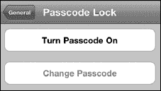

2.  轻点`通用`。
3.  向下滚动并轻点`密码锁定`。
4.  轻点`开启密码`以设置密码。
5.  默认密码是一个简单的四位数字密码。使用键盘输入一个四位数字代码。系统会提示你再次输入代码。

    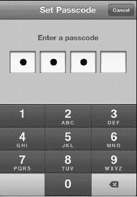

#### 设置更复杂的密码

如果你希望使用比四位数字更复杂的密码，可以通过将`密码锁定`屏幕上的`简单密码`选项设置为`关闭`来实现。

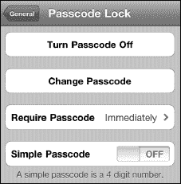

然后你将能够输入包含字母、数字甚至符号的新密码。

**警告：** 请小心！如果你忘记密码，将无法解锁你的 iPhone。

#### 调整你的密码选项

设置好密码后，你将看到以下几个选项：

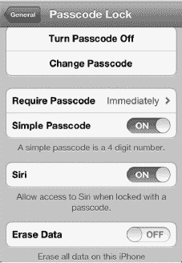

*   `关闭密码`
*   `更改密码`
*   `需要密码`（`立即`、`1 分钟后`、`5 分钟后`、`15 分钟后`、`1 小时后`）
*   `简单密码`（`打开` = 四位数字；`关闭` = 任意字母、数字或符号）
*   `Siri`（`打开` = 允许无需输入密码即可使用 Siri；`关闭` = 阻止使用 Siri，直到输入密码）
*   `抹掉数据`（`打开` = 在十次错误密码尝试后抹掉所有数据；`关闭` = 不抹掉数据）

**警告：** 如果你有年幼的孩子喜欢在 iPhone 从`睡眠`模式唤醒后猛敲安全键盘试图解锁，你可能希望将`抹掉数据`设置为`关闭`。否则，你的 iPhone 可能会被抹掉。

**注意：** 为`需要密码`设置较短时间更安全。将时间设置为`立即`（默认值）是最安全的。然而，使用`1 分钟`的设置可以避免你意外锁定 iPhone 时重新输入密码的麻烦。

### 设置限制

你可能决定不希望孩子在你的 iPhone 上听包含露骨歌词的音乐。你可能还想阻止他们访问 YouTube 或任何其他网站。在你的 iPhone 上设置此类限制相当容易。

#### 限制应用

请按照以下步骤限制对 iPhone 内容的访问：

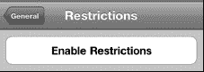

1.  在`设置`应用中轻点`通用`。
2.  向下滚动页面并轻点`访问限制`。
3.  轻点`启用访问限制`按钮。
4.  系统将提示你输入一个访问限制密码——只需选择一个你记得住的四位数字代码即可。

**注意：** 此访问限制密码与你的主 iPhone 密码是分开的。你可以将其设置为相同，这样更容易记住。然而，如果你让家人知道主密码，但又不想让他们调整限制，这可能会造成问题。稍后你需要输入此访问限制密码才能关闭限制。

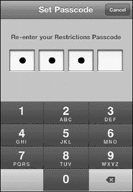

请注意，你可以调整是否允许某些应用或功能运行。例如，右侧的屏幕截图允许你调整以下应用的访问限制：`Safari`、`YouTube`、`相机`、`FaceTime`、`iTunes` 和 `Ping`。此屏幕还允许你限制访问`安装应用`或`删除应用以及 Siri 和 Siri 中的露骨语言`。最后，你可以限制对`定位`和`账户`进行更改的能力。

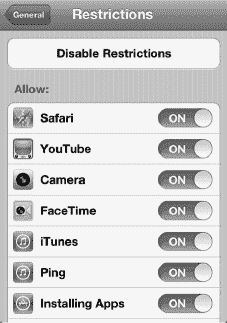

在所有情况下，`关闭` = 已限制。

你可能会认为`打开`表示某些内容被限制，但事实恰恰相反。要禁用或限制某内容，你需要触摸其旁边的滑块并将其更改为`关闭`。如果你注意到所有选项上方都有`允许`字样，那么这就说得通了。

**注意：** 你限制的任何应用的图标都会消失。因此，如果你限制了对`YouTube`、`App Store` 和 `FaceTime` 应用的访问，那么`YouTube` 和 `App Store` 图标将从`主屏幕`消失，并且你的 iPhone 的 `FaceTime` 图标也将被移除。

### 允许更改

有时你并不想完全关闭某个应用的访问权限，只是希望阻止任何人进行意外更改。例如，**定位**选项涉及诸多隐私问题，因此你可能希望对哪些应用和功能有权访问它进行更精细的控制。请按照以下步骤调整**定位**选项的限制：

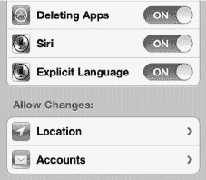

1. 按照上一节所述，前往**限制**屏幕。
2. 向下滚动到底部，查看所有**允许更改**设置。
3. 轻点**定位**。
4. 轻点**允许更改**，对**定位设置**进行更改。
5. 将**定位服务**开关切换为**关闭**，彻底阻止你的 iPhone 使用你的位置。（请注意，这可能会大大降低**谷歌地图**等应用的便利性，并导致逐向导航应用完全无法工作。）
6. 将你不想让其追踪位置的应用逐一开关切换为**关闭**。（例如，将**相机**应用的**定位服务**设置为**关闭**，以避免你打算在互联网上公开分享的照片中包含 GPS 坐标。）
7. 轻点**系统服务**，更改内置进程的**定位**权限。
8. 如果有任何你不想让其使用位置数据的系统服务，请将其开关切换为**关闭**。选项包括**蜂窝网络搜索**、**指南针校准**、**诊断与用量**、**基于位置的 iAd**、**设定时区**和**交通状况**。

   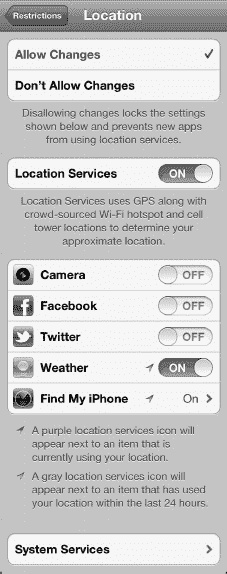

9. 完成后，轻点左上角的**定位**返回。
10. 如果你想阻止将来对**定位服务**进行任何更改，请轻点**不允许更改**。
11. 完成后，轻点**限制**返回。
12. 轻点**账户**，然后轻点**不允许更改**，以防止将来对你的**邮件**、**日历**和**通讯录**账户进行任何更改。
13. 完成后，轻点**限制**返回。

### 限制内容

除了对应用设置限制外，你还可以对能在 iPhone 上下载和查看的内容设置限制。如果你打算将 iPhone 交给孩子，并且不希望她能够下载带有露骨歌词的音乐或观看含有成人内容的电影，请按照以下步骤操作：

1. 按照上一节所述，前往**限制**屏幕。

   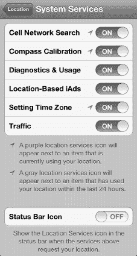

2. 向下滚动到底部，查看所有**允许内容**设置。
3. 要限制在应用内购买的内容，请将**应用内购买**设置为**关闭**。这将包括从**iTunes**应用购买的音乐和视频。
4. 如果你有年幼的孩子，并且担心他们在你下载新应用后进行昂贵的应用内购买（例如，你不希望他们在**蓝精灵**应用中购买**蓝莓**），请轻点**需要密码**，并将该设置更改为**始终**。
5. 轻点**评级地区**，根据你所在的国家/地区调整评级。目前支持一个广泛的国家/地区列表，包括澳大利亚、奥地利、加拿大、法国、德国、爱尔兰、日本、新西兰、英国和美国。
6. 轻点**音乐与播客**，限制访问包含露骨内容的歌词。确保将**露骨**选项设置为**关闭**，如右侧的图所示。

   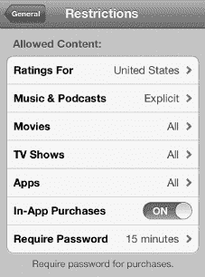

7. 轻点左上角的**限制**按钮，返回选项列表。
8. 你也可以通过轻点每个项目，设置**影片**、**电视节目**和**应用**的评级上限。

   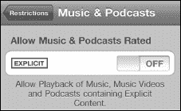

9. 当你轻点**影片**等项目时，会看到一个允许的评级列表。轻点你想要允许的最高评级级别。在此图中，我们轻点了**PG-13**。所有高于此评级的电影（**R** 和 **NC-17**）均不允许。红色文字和复选标记的缺失提供了哪些选项被阻止的视觉提示。
10. 轻点**电视节目**设置这些限制。同样，轻点你想要允许的最高评级。复选标记表示允许的评级；红色文字表示不允许的评级。在此示例中，**TV-Y**、**TV-Y7** 和 **TV-G** 被允许，但更高的评级不被允许（即 **TV-PG**、**TV-14** 和 **TV-MA**）。

    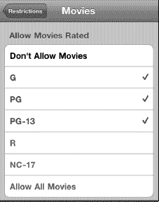

11. 轻点**应用**设置各种应用的限制。

    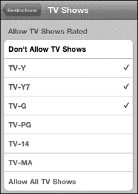

12. 在此屏幕中，我们允许播放评级为 **4+**、**9+** 和 **12+** 的应用。评级为 **17+** 的应用无法播放或下载。
13. 轻点左上角的**限制**按钮，返回选项列表。
14. 最后，轻点**主屏幕**按钮以保存你的设置。

### 限制 Game Center

Game Center 是享受社交游戏的绝佳方式，包括配对、挑战、排行榜等。然而，如果你是有年幼孩子的家长，你可能会不放心让他们在没有你监督的情况下玩多人游戏或接受好友请求。请按照以下步骤限制 Game Center 的访问：

1. 按照上一节所述，前往**限制**屏幕。

   

2. 向下滚动到**Game Center**。
3. 将**多人游戏**和/或**添加好友**选项切换为**关闭**。

