# 第 9 章

## 使用你的电话

iPhone 能干太多酷事了，以至于很容易让人忘记它同时也是一部功能强大的电话。在本章中，我们将介绍你在高端智能手机上期待找到的众多功能。我们将从基础开始，向你展示如何按姓名拨号、通过使用最近通话记录节省时间、语音拨号以及使用语音信箱。

接下来，我们将探索 iPhone 电话功能的更高级能力。例如，我们将向你展示如何处理多个通话者以及设置电话会议。最后，我们将向你展示如何从你的音乐库创建新的自定义铃声，以及为不同的联系人设置不同的铃声。

### 电话功能入门

iPhone 最初会将**电话**图标放在底部程序坞上。你可以使用第 6 章：“图标与文件夹”中描述的步骤，移动它或将其从程序坞上移除。

#### 查找你的电话号码

也许你刚拿到你的新 iPhone，还不知道自己的电话号码。别担心；你可以在**设置**应用中找到你的号码。轻点**设置**图标，然后向下滚动并轻点**电话**。你的号码会列在顶部。

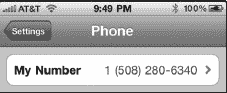

#### 使用 iPhone 耳机

如果你所在的国家或省份在法律上不允许在驾驶汽车时手持 iPhone，那么你将需要使用耳机或蓝牙车载音响连接来进行免提通话。

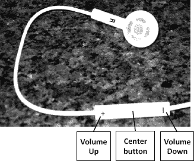

随 iPhone 附带的耳机非常适合通话。耳机线上内置了麦克风，还有音量控制键和一个**中央**按钮，让你可以接听或挂断电话。当你戴好耳机时，电话会在耳机中响铃。按一下耳机上的**中央**按钮接听，再按一下即可挂断。

#### 连接蓝牙耳机或车载音响

你也可以连接到蓝牙耳机或蓝牙车载音响系统来拨打和接听电话。我们在第 5 章：“AirPlay 和蓝牙”中为你展示了详细步骤。

### 从键盘拨号

使用手机最简单的方法就是通过键盘拨号。屏幕上的数字很大，因此很容易拨号。请按照以下步骤拨号：

1.  点击**电话**图标（参见图 9-1）。
2.  如果没有看到拨号键盘，点击底部的**键盘**图标。
3.  现在，只需点击数字键即可开始拨号。
4.  如果输错，按**退格**键。
5.  如果需要输入国际号码的**加号**（`+`），请长按**零**（`0`）键。
6.  拨号完成后，按**呼叫**键。

    **提示：在电话号码中插入暂停**

    有时您需要在电话号码中插入一个暂停，然后输入另一个号码，例如分机号或密码。您可以通过长按**星号**键（`*`）来拨入一个暂停，直到在电话号码旁边出现一个逗号。这会导致两秒钟的暂停。

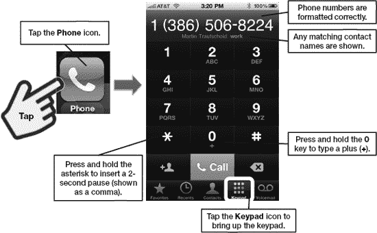

**图 9-1.** *使用 iPhone 键盘拨打电话号码*

## 不同的电话视图

我们刚刚使用了**键盘**软键。您可以在**电话**屏幕底部看到几个图标，分别是**个人收藏**、**最近通话**、**通讯录**、**键盘**和**语音信箱**，如图图 9-2 所示。

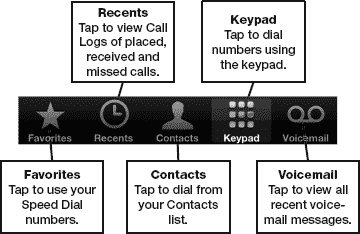

**图 9-2.** *使用软键查看不同的**电话**屏幕*

## 使用个人收藏（快速拨号）

您的**个人收藏**是您经常呼叫的联系人。您可以将**个人收藏**视为您的快速拨号列表。

**注意：** 您也可以将**FaceTime**联系人添加到**个人收藏**中。

### 添加新的个人收藏

从**通讯录**列表中向个人收藏列表添加新联系人很容易。请按照以下步骤操作：

**提示：** 您也可以从**最近通话**记录中添加**个人收藏**。在**最近通话**中，点击蓝色的**箭头**图标，然后在下一个屏幕上，滚动到**信息**页面底部，点击**添加到个人收藏**。

1.  如果不在**电话**屏幕，请点击**电话**图标启动它。
2.  触摸底部一行软键中的**个人收藏**图标。
3.  首次启动**个人收藏**时，您将看到一个空白屏幕。

    

4.  点击右上角的**加号**按钮以添加新条目。您的通讯录将打开。
5.  向上或向下滑动以查找联系人。点击任何联系人以选择它。

    **提示：** 要按名称搜索联系人，请点击屏幕最顶部（时间下方）。这将调出**搜索**窗口，您可以在其中输入几个字母来查找联系人。请记住，您可以通过点击左上角的**群组**按钮来查看不同的联系人群组。

    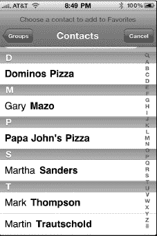

6.  如果一个条目有多个电话号码，您需要选择其中一个作为个人收藏条目。

    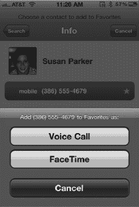

7.  点击一个号码后，系统会询问您是否要将该号码设置为**语音呼叫**或**FaceTime**中的**个人收藏**。
8.  您将返回到**个人收藏**列表，在那里您会看到刚刚添加的新联系人。**FaceTime**中的**个人收藏**会在联系人姓名右侧显示一个小**视频**图标。

    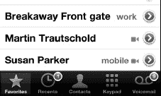

    

9.  重复步骤 4-7 以添加更多联系人到**个人收藏**。每个新条目都列在列表底部前一个条目之下。

### 整理您的个人收藏

与 iPhone 上的其他列表一样，您可以重新排列**个人收藏**列表并删除条目：

1.  像之前一样查看您的**个人收藏**列表。
2.  点击左上角的**编辑**按钮。
3.  要重新排列条目，请触摸并拖动右侧边缘带三条灰色横条的区域，在列表中上下移动。

    

4.  要删除条目，请点击条目左侧的红色**圆形**图标，使其变为竖立状态。
5.  点击**删除**按钮。
6.  完成重新排列和删除条目后，点击左上角的**完成**按钮。

    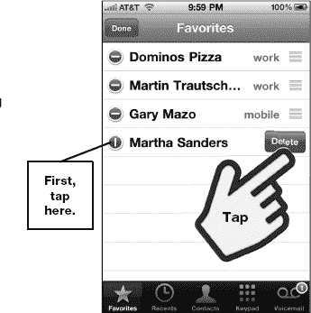

### 呼叫个人收藏联系人

要呼叫**个人收藏**列表中的任何人，只需触摸该人的姓名。没有提示或确认。一旦您触摸他的名字，手机就会拨打他的号码（参见图 9-3）。

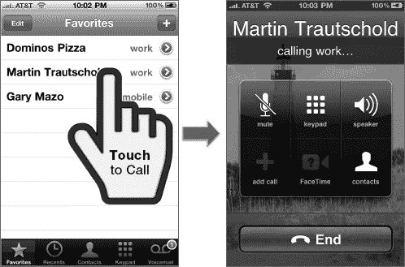

**图 9-3.** *通过点击来拨叫您的**个人收藏**之一*

## 使用最近通话（通话记录）

使用**最近通话**类似于在其他智能手机上查看通话记录。

当您触摸**最近通话**图标时，将显示所有最近通话的列表。您可以点击顶部的**全部**或**未接**按钮来缩小列表范围（参见图 9-4）。

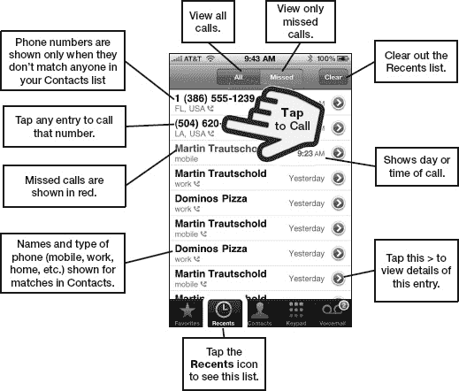

**图 9-4.** *使用**最近通话**屏幕*

### 从最近通话拨打电话

从**最近通话**屏幕拨打电话很容易；只需触摸所需的姓名或电话号码，您的 iPhone 就会立即向该联系人发起通话。

### 清除所有最近通话

要清除或删除所有最近通话记录条目，请按右上角的**清除**按钮。

### 通话详情或联系人信息

点击**最近通话**列表中姓名旁边的蓝色**箭头**图标，您将看到该电话号码的信息，或者如果该联系人在您的**通讯录**中，则会看到其完整的联系人信息。如果有多个通话，您将看到每个通话的历史记录。

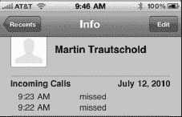

滚动到联系人**信息**屏幕底部以查看更多选项。您可以发送**短信**、发起**FaceTime**视频通话，或通过电子邮件或彩信发送联系人信息来**共享联系人**。

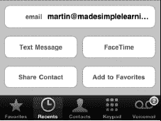

点击**添加到个人收藏**以将此联系人添加到您的**个人收藏**列表。

### 从最近通话将电话号码添加到通讯录

如果**最近通话**条目是一个尚未关联到**通讯录**中联系人的电话号码，那么您将在**信息**屏幕上看到两个不同的按钮：**创建新联系人**和**添加到现有联系人**。

点击**创建新联系人**以从此电话号码创建新联系人。

点击**添加到现有联系人**以将此电话号码添加到您现有的某个联系人中。

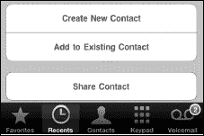

## 从通讯录拨打电话

将所有的联系人信息保存在手机中的一大好处是，从**通讯录**列表拨打电话非常容易。请按照以下步骤操作：

1.  如果不在**电话**屏幕，请点击**电话**图标启动它（参见图 9-5）。
2.  触摸底部一行软键中的**通讯录**图标。
3.  使用以下方法之一查找要呼叫的联系人：
    *   在列表中向上或向下滑动。
    *   将手指放在屏幕右侧的字母上，向上或向下滚动。
    *   点击顶部显示时间的状态栏以跳转到列表顶部。点击**搜索**窗口，输入联系人的名字、姓氏或公司名称的若干字母来查找他。
4.  找到所需的联系人条目后，点击其姓名。
5.  触摸您想要呼叫的电话号码。

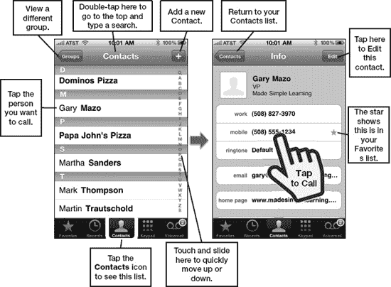

**图 9-5.** *从**通讯录**列表拨打电话*

### 拨打任意带下划线的电话号码

你会注意到，iPhone 几乎会在屏幕上所有它识别出的电话号码下方添加下划线。

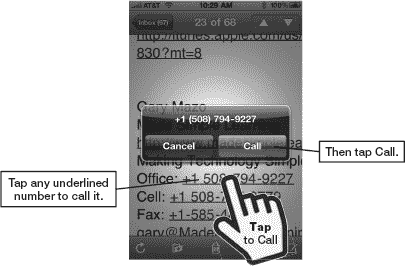

这种情况会出现在电子邮件（电子邮件签名）、短信与 iMessage、备忘录、网站等页面中。

要拨打任意带下划线的电话号码，只需轻点该号码，然后轻点显示出的`呼叫`按钮即可。

**提示：** 与带下划线的电话号码类似，你的 iPhone 还能识别屏幕上的其他信息，并允许你通过轻点来执行相关操作。此功能称为“数据检测器”。你会看到带下划线的地址（轻点即可在`地图`中显示该地址）、带下划线的日期，例如`明天上午 9 点`（轻点即可新建一个`日历`事件），以及快递单号，例如联邦快递或 UPS 的追踪编号（轻点即可在`Safari 浏览器`中显示追踪信息）。

## 从带下划线的电话号码创建新联系人

如果你长按任意带下划线的电话号码几秒钟，屏幕底部会弹出一系列按钮。轻点`创建新联系人`即可从该号码创建新联系人，或轻点`添加到现有联系人`，将该号码添加到你的`通讯录`列表中已有的联系人。

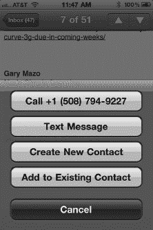

## 使用 Siri 进行语音拨号

你可以使用语音通过 Siri 拨打通讯录中的号码。有关具体步骤，请参见第 7 章：“多任务处理与 Siri”中的“Siri”部分。

## 通话中的功能

在你的 iPhone 拨号期间，甚至在你接通对方后，都可以执行许多操作。

所有可用的电话功能都清晰地显示在`电话`屏幕的图标和按钮上。

你可以执行以下所有操作：

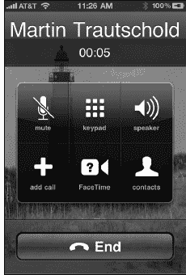

*   使自己静音。
*   使用`拨号键盘`拨出其他号码。
*   轻点`扬声器`以开启手机的免提功能。
*   轻点`添加通话`以发起电话会议。
*   通过`FaceTime 通话`开始视频通话（前提是对方也拥有支持`FaceTime 通话`的 iPhone、iPod touch、iPad 或 Mac）。
*   查看你的`通讯录`列表。

**注意**：为什么你把手机贴近耳朵时屏幕会变黑？当你对着 iPhone 说话（将手机靠近脸部）时，屏幕会感应到并自动变黑，以防止你不小心用脸碰到按钮。一旦你将 iPhone 从脸旁移开，你就会看到可用的选项。

### 使用拨号键盘

也许你拨打的号码需要你输入分机号。又或者，你正在拨打一个需要根据提示输入数字进行选择的自动应答服务。

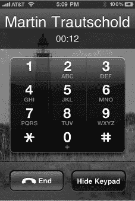

在这些情况下，只需轻点`拨号键盘`图标，键盘就会显示出来。然后你可以根据提示输入数字。

最后，操作完成后，按下底部的`隐藏拨号键盘`按钮即可。

### 静音通话

在拨号过程中，你会在左上角看到将通话静音的选项。只需轻点`静音`按钮就可以让自己静音。再次轻点即可取消静音。

**提示：** 当你启用了`FaceTime 通话`时，你不会看到`保留`按钮。请使用`静音`图标来保持通话。

### 使用免提

如果你更愿意使用 iPhone 内置的扬声器免提，请轻点`扬声器`图标。

再次轻点同一个图标即可关闭免提。

### 保持通话

将来电方置于保持状态很简单。只需轻点`保留`图标即可将来电方保持。

**注意：** 只有当你的`FaceTime 通话`应用处于停用状态时，你才会看到`保留`图标（前往`设置`  `电话`，然后将`FaceTime 通话`设置为`关闭`）。如前所述，如果你没有看到`保留`图标，只需轻点`静音`图标——它能实现相同的效果。

取消保持也同样简单——再次轻点`保留`按钮即可取消保持。

**注意：** 在编写本书时，Verizon 的 CDMA 网络并未正式支持保持通话功能。

### 浏览通讯录

假设你在通话过程中需要浏览你的`通讯录`列表。例如，你可能需要查找某人的电子邮件、电话号码或地址，以便与通话对方分享。轻点`通讯录`按钮，然后滚动或搜索联系人。

要返回通话，请轻点顶部绿色的`轻触返回通话`栏。

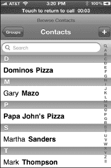

**注意：** 在此过程中，最好使用免提或蓝牙耳机（参见第 5 章：“AirPlay 与蓝牙”）；这样你就可以在搜索联系人的同时继续通话。

### FaceTime 视频通话

如果你正在通话的对方也拥有较新款的 iPhone、iPod touch、iPad 或 Mac，并且对方已连接 Wi-Fi，那么你可以轻点`FaceTime 通话`图标来开始视频通话。（未来你可能可以通过 3G 蜂窝网络连接使用`FaceTime 通话`；但目前此功能需要 Wi-Fi 连接。）你会在窗口左上角看到自己的画面，而对方则会显示在主窗口中。你还会注意到底部有三个按钮：`静音`、`结束通话`和`切换摄像头`，用于在前后摄像头之间切换。

关于使用`FaceTime 通话`的更多信息，请参见第 11 章：“视频消息与 Skype”。

**注意：** 只有当你的`FaceTime 通话`应用处于启用状态时，你才会看到这个`FaceTime 通话`图标（你可以在`设置`  `电话`中将其启用，然后将`FaceTime 通话`设置为`开启`）。

## 设置和使用语音信箱

你的 iPhone 配备了一个增强型语音信箱系统，称为**可视语音信箱**。此功能让你能快速查看所有语音留言，并按任意顺序播放。要收听任何留言，只需轻点它。在右侧的图片中，红色`圆形`图标内的数字`3`表示有三条未听的语音留言。

**注意：** 如果你在美国以外地区，你的运营商可能尚未提供可视语音信箱服务。如果未提供，那么你需要像使用其他任何手机一样，按下`语音信箱`软按键，拨号接入来收取留言。

### 设置语音信箱

如果你以前从未设置过语音信箱，那么在新 iPhone 上进行设置很简单；只需按照以下步骤操作：

1.  轻点`电话`图标。
2.  轻点底部软按键行中的`语音信箱`图标 。
3.  轻点图 9–7 中显示的`立即设置`按钮。
4.  选择一个四位数的密码，然后重新输入密码。

    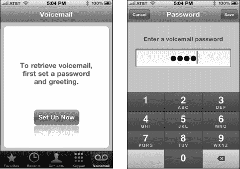

    **图 9–7.** 设置你的语音信箱

5.  接下来，你可以选择`默认`问候语或`自定`问候语。`默认`问候语会以电子语音读出你的电话号码；同时还会提示你无法接听。

    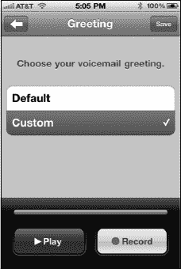

6.  如果你选择`自定`问候语，则需要轻点`录制`按钮进行录制。录制完成后，轻点`停止`按钮，该按钮与`录制`按钮位于同一位置。
7.  录制完成后，你可以轻点`播放`按钮，听听看是否喜欢你的`自定`问候语。

**提示：** 如果你将 iPhone 拿得太靠近嘴巴，你的声音可能会听起来有些失真——请务必保持正常距离。

### 更改语音信箱密码

你可能想要更改密码。请按照以下步骤操作：

1.  找到并轻点`设置`图标。
2.  向下滚动并轻点`电话`。
3.  向下滚动并轻点`更改语音信箱密码`。
4.  输入你的当前密码，然后两次输入新密码。

#### 播放语音留言

可视化语音信箱系统的妙处在于，你无需拨号收听留言。所有语音留言都会保存在你的手机上，你可以保存、浏览或删除它们。

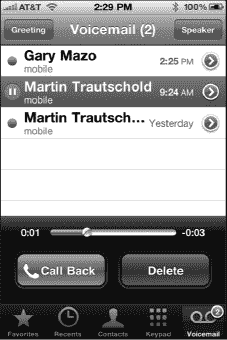

通过`Voicemail`图标右上角红色**圆形**图标中的小数字，你可以知道有多少条未收听留言。

未收听项目（就像收件箱中未读的电子邮件）会用一个小蓝点标记。

`Voicemail`图标会显示信箱中的留言数量。轻点留言旁边的`播放`按钮，留言将通过听筒播放。

**提示：** 如果你无法查看屏幕，仍可通过按住手机上的`1`键拨入，免提收听语音留言。

##### 通过扬声器收听语音留言

如果你想通过 iPhone 的扬声器（而非听筒）收听语音留言，只需轻点右上角的`扬声器`按钮。

##### 调整问候语

轻点`问候语`按钮来调整你的语音信箱问候语。你可以重新收听当前的问候语、录制新的`自定义`问候语，或恢复为`默认`问候语。

##### 回拨留言者

如果有人给你留下语音留言，你可以轻点`回拨`按钮回电给她；这将立即回拨。

#### 删除语音留言

如果你打算日后重听，你的 iPhone 会保存所有语音留言。但留言太多时，管理起来会有些不便。选中一条留言并轻点红色的`删除`按钮，即可将其从 iPhone 中移除（参见图 9–7）。

**注：** 你可以选择保存“已删除”的留言。你的`Voicemail`屏幕会在独立的`已删除`标签页中显示已删除的留言。如果你在此标签页中轻点某条留言，可以轻点`还原`按钮将其恢复。

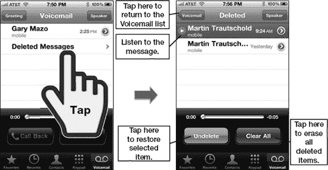

**图 9–7.** *处理已删除的语音留言项目*

如果你想永久删除所有语音留言，请轻点`全部清除`。

### 电话会议

在如今繁忙的世界中，同时与多位通话方沟通已成为我们对手机的一项基本需求。幸运的是，iPhone 上的电话会议功能非常直观。

**注：** AT&T/GSM 版 iPhone 最多支持五方电话会议，但 Verizon 的 CDMA 网络技术限制使 Verizon 版 iPhone 仅支持三方电话会议。

##### 发起第一通电话

如本章前面所示，你可以拨打`最近通话`中的任何号码、新号码、联系人、`个人收藏`列表中的联系人等。

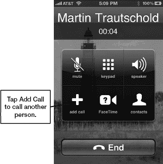

你甚至不必主动发起呼叫来创建电话会议。例如，你可以接听第一位通话者的来电，然后再将第二个人加入会议。

将 iPhone 从脸前移开，即可查看可用的通话功能。本章前面已介绍了其中的大部分功能。

##### 添加第二位通话者

轻点`添加通话`按钮开始添加第二位通话者。这将立即将第一位通话者置于保持状态。

轻点`添加通话`按钮后，系统会跳转到你的`通讯录`列表。只需滚动或双击顶部即可搜索你要添加到此通话中的联系人。

你也可以从`个人收藏`或`最近通话`中选择添加新的通话者，或者轻点底部的`拨号键盘`软键后直接拨打其电话号码。

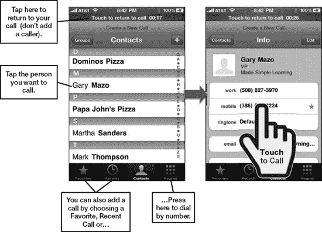

**图 9–8.** *添加第二位通话者*

如果该联系人有多个电话号码，请轻点你要呼叫的号码，通话将会发起。

#### 合并通话

一旦与第二位通话者的呼叫发起，你会注意到`添加通话`按钮已变为`合并通话`按钮。轻点此按钮即可将两通电话合并为三方通话（参见图 9–9）。

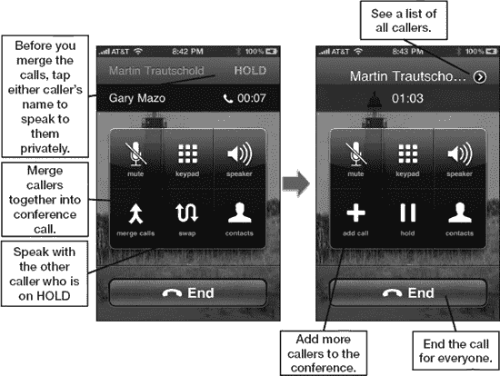

**图 9–9.** *在通话者之间切换并将其合并为电话会议*

屏幕顶部现在会滚动显示电话会议中所有通话者的列表。

#### 与个别通话者私密通话或断开连接

若要在电话会议中单独或私密地与某位通话者交谈，请执行以下步骤：

1.  轻点`电话`屏幕顶部姓名旁边的小型黑色`箭头`图标 （参见图 9–10）。
2.  现在你会看到所有通话者的列表。轻点某人姓名旁边的`私密`按钮  即可与该人私密通话。其他所有人将被置于保持状态。
3.  若要挂断任何通话者，请轻点其姓名左侧的红色`电话`图标 。

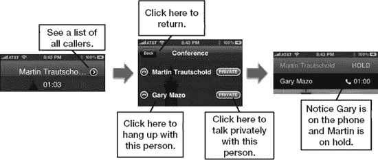

**图 9–10.** *与个别通话者私密通话或将其挂断*

### 电话选项与设置

你可以通过进入`设置`应用自定义手机中的许多功能：

1.  轻点`设置`图标。

    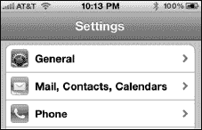

2.  向下滚动并轻点`电话`。

以下部分描述了此处找到的所有电话设置。

#### 呼叫转移

有时你可能需要将呼叫转接到另一个号码。例如，你正在拜访一位住在偏远地区、手机信号极差的朋友家。在这种情况下，你可以将呼叫转接到该朋友的固定电话。请按以下步骤操作：

1.  在`电话`设置屏幕中，轻点`呼叫转移`。

    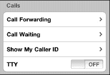

2.  将`呼叫转移`开关设置为`开启`。

    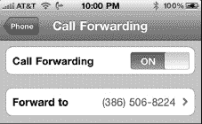

3.  轻点`转接到`行以输入转接号码。

    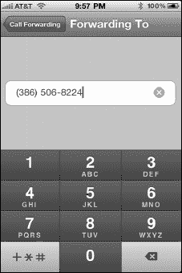

4.  输入后，号码将被保存以供将来使用。所有来电将从你的常规 iPhone 号码转接到此号码，直到你将`呼叫转移`设为`关闭`。

    **注意：** 呼叫转移并非总是免费的。请致电你的电话公司，确认启用呼叫转移是否会产生费用。

#### 呼叫等待

另一个`电话`设置是`呼叫等待`。此选项可在你通话时提醒你又有另一通来电。

然后你可以选择接听新来电、挂断第一通电话或设置电话会议（如前所述）。

启用呼叫等待非常简单，只需确保`呼叫等待`开关处于`开启`位置即可（这是默认设置）。

#### 显示或拦截（隐藏）你的来电显示

在某些情况下，你可能希望自己的电话号码不显示在对方手机上。

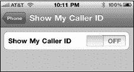

幸运的是，你的 iPhone 提供了拦截来电显示号码的选项。为此，请将`显示我的来电显示`开关设置为`关闭`。

#### 在 SIM 卡上设置安全性

作为额外的安全措施，你可以启用 PIN 码来访问存储在 SIM 卡上的信息。如果你的 iPhone 不慎丢失或被盗，这将防止他人访问你 SIM 卡上存储的姓名和号码。

**警告：** 设置此 SIM 卡 PIN 码可能会锁定你的手机，使其无法使用，直到你输入 PUK（*个人解锁密钥*）。你可以从你的无线运营商处获取这个八位数的 PUK 码。对于 AT&T，请登录 AT&T 网站，点击页面顶部的 **我的服务**，然后点击中间的 **我的手机/设备**。接下来，选择你的 iPhone 并点击 `解锁 SIM 卡` 链接。如果你不是 AT&T 用户，请查看你运营商的网站或致电其客服帮助台。

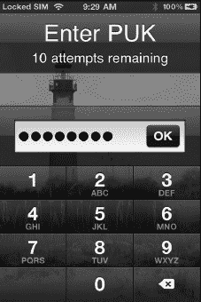

请按照以下步骤操作：

1.  如前所述，进入**电话**设置菜单。
2.  向下滚动并轻点 **SIM 卡 PIN 码**。
3.  这将带你进入 **SIM 卡 PIN 码** 屏幕。如果你在此处尝试将 **SIM 卡 PIN 码** 选项设置为**开启**，并看到类似右侧的错误信息，则表明你的 iPhone 已被锁定。你只能通过输入 PUK 码来解锁它。有关更多详细信息，请参阅前面的警告。

    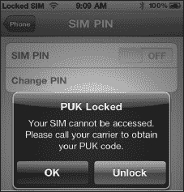

4.  如果你将 **SIM 卡 PIN 码** 旁边的开关设置为**开启**后没有看到错误信息，那么你可以轻点**更改 PIN 码**来输入你的新 PIN 码。

**注意：** Verizon 的 CDMA 网络不使用 SIM 卡，因此 Verizon 版 iPhone 不提供 SIM 卡 PIN 码锁定功能。

#### 供听障人士使用的 TTY

TTY 代表*文本电话设备*。此类设备允许听障人士通过电话线发送打字的文本信息。你的 iPhone 可以与另一台配备了 TTY 设备的电话进行通信——只需将 **TTY** 开关设置为**开启**即可。

#### 切换无线运营商

在某些国家，尤其是在无锁版 iPhone 更受欢迎的地区，你可能会在**设置**中看到一个**运营商**标签

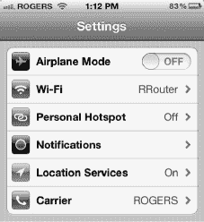

轻点**运营商**即可看到可以为你的 iPhone 切换运营商的屏幕。

将其设置为**自动**，让 iPhone 为你选择最佳网络。

如果你想让 iPhone 强制连接到特定网络，例如 **ROGERS**，请轻点该网络名称

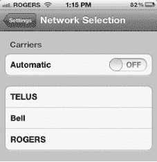

#### 运营商服务

按下**运营商服务**按钮将列出你的无线运营商或电话公司的名称。

例如，如果你在美国的运营商是 AT&T，请轻点**电话**设置屏幕底部的 **AT&T 服务**，即可查看与 AT&T 相关的特殊号码。如果你使用其他运营商，此屏幕将显示你的运营商的特殊接入号码。

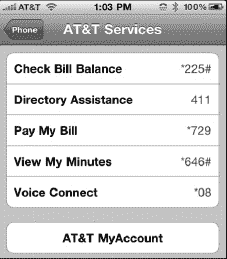

**注意：** 并非所有运营商都支持此功能；如果你没有看到这些选项，请访问运营商的网站了解账户详情。

轻点此屏幕上的任意条目即可执行相应的请求。例如，如果你轻点**查看我的剩余分钟数**，你将收到一条短信回复，显示当前计费周期内剩余的分钟数详情。

轻点**查看**按钮可以查看更多详情。

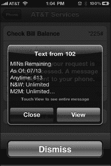

### 铃声、声音与振动

你的 iPhone 可以使用独特的声音或振动来提醒你有来电、新语音邮件以及其他事件。这些设置可以通过**设置**应用轻松调整。

第 8 章：“个性化与安全”中的“在 iPhone 上调整声音”部分向你展示了如何更改铃声、为**静音**和**响铃**模式添加振动，以及开启或关闭语音邮件提示音。

### 为联系人分配专属铃声

有时，为通讯录中的某个联系人设置专属铃声既有趣又实用。这样，你不用看手机就知道是谁在打电话。

你可以使用 iPhone 上已有的铃声，也可以通过以下方式之一获取新铃声：

*   在 iPhone 上使用 **iTunes** 应用购买铃声。
*   在电脑上的 iTunes 中使用你的音乐创建并购买铃声。
*   在电脑上的 iTunes 中使用你的音乐免费创建铃声。

例如，作者之一（加里）为他儿子丹尼尔设置的铃声是埃尔顿·约翰的《丹尼尔》。在本章稍后部分，我们将向你展示如何用你的 iTunes 音乐制作铃声。

#### 为联系人设置专属铃声

你需要编辑**通讯录**中某人的信息来更改其铃声。请按照以下步骤为联系人设置专属铃声：

1.  轻点**通讯录**图标。
2.  轻点你想要更改的联系人（此处为**丹尼尔**）。
3.  轻点**编辑**。
4.  轻点**铃声**按钮即可看到**铃声**屏幕。
5.  从列表中轻点任意铃声。在此例中，我们选择了新的自定义铃声**丹尼尔**。

### 从 iTunes 应用购买铃声

在本节中，我们将向你展示如何购买铃声（大多数价格为 1.29 美元）。之后，你可以按照以下步骤，直接在 iPhone 的 **iTunes** 应用中将其分配给某个联系人，或将其设置为**默认铃声**：

1.  在 iPhone 上启动 **iTunes** 应用。
2.  如果你在底部看到**铃声**软键，请轻点它。否则，请轻点**更多**，然后轻点**铃声**。接下来，滚动浏览铃声。或者，你也可以轻点底部的**搜索**软键来搜索铃声。

    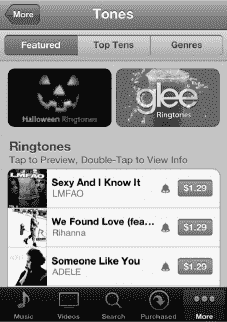

3.  你还可以使用顶部的按钮浏览铃声：**精选**、**热门排行榜**和**类型**。
4.  我们选择了**热门排行榜**，然后选择了**另类**，即可看到右侧的图片。

    

5.  轻点任意名称或专辑封面来预览铃声。如果你喜欢，请轻点价格进行购买，然后轻点**立即购买**。
6.  选择要购买的铃声后，**iTunes** 应用会提示你**设置为默认铃声**（你的主要电话铃声）或**分配给联系人**。

    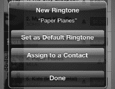

7.  如果你选择**分配给联系人**，你的**通讯录**列表将会打开。接下来，滚动浏览或搜索该联系人。此后每当此联系人来电时，你都会听到新的铃声。

### 创建自定义铃声

你的 iTunes 资料库中装满了你喜爱的歌曲。如果能把自己的歌曲变成 iPhone 铃声，那该多好啊？好消息是，你可以将大部分音乐制作成铃声。有两种方法：一种简单的方法，每个铃声大约花费 1 美元；另一种更具挑战性但免费的方法。我们将向你展示这两种方法。

#### 免费但更具挑战性的铃声制作方法

我们先来了解这种免费但较为复杂的方法。此方法适用于 iTunes 中所有不受 DRM（数字版权管理）保护的音乐。较早从 iTunes 购买的音乐可能包含 DRM 保护。而从 CD 或其他非 DRM 音乐（包括 iTunes 中较新的非 DRM 音乐）导入 iTunes 的任何音乐均可使用。

##### 定位歌曲

请按照以下步骤在 iTunes 中高亮并选择一首歌曲，作为自定义铃声的基础：

1. 在**iTunes**菜单中，选择**文件**  **显示简介**。您也可以右键点击歌曲，然后选择**显示简介**。
2. 点击**选项**选项卡，勾选**起始时间：**和**停止时间：**复选框。

   

   **注意：**确保总时长小于 40 秒；否则铃声文件会过大。

3. 点击**好**关闭**显示简介**对话框。

   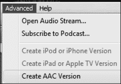

4. 在**iTunes**中，点击**高级**菜单，选择**创建 AAC 版本**。
5. 此时您应能在 iTunes 列表中看到一个仅有几秒钟长的歌曲新版本。例如，**丹尼尔**的新版本只有 30 秒长。

   

6. 获得新的 30 秒版本后，务必返回原始歌曲，通过**显示简介**  **选项**取消勾选**起始时间：**和**停止时间：**复选框。

   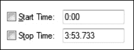

7. 创建好新的较短铃声 AAC 版本后，只需将其从**iTunes**拖拽至桌面，或复制粘贴到桌面上即可。

   

8. 您需要将文件的扩展名从`m4a`改为`m4r`，这样才能被识别为铃声。您可以点击文件高亮其名称来修改，也可以右键点击文件，选择**显示简介**，然后更改扩展名。

   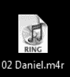

9. 系统会显示警告信息，提示该文件可能无法使用；只需接受更改即可。
10. 现在必须删除仍在 iTunes 中的 30 秒版本。

    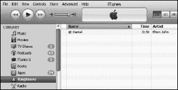

11. 将带有新扩展名`m4r`的文件拖回 iTunes 资料库并放入其中。
12. 如果一切顺利，当您点击左侧栏中的**铃声**时，应该就能看到您的铃声了。

#### 将铃声同步到 iPhone

请参阅第 3 章：“与 iCloud、iTunes 及其他服务同步”中的“同步铃声”部分，了解如何将新铃声传输到您的 iPhone 上。

#### 使用您的新自定义铃声

如果您想将铃声与**通讯录**列表中的特定联系人关联，则需要编辑该联系人。请按照本章“为联系人设置专属铃声”部分中的步骤进行操作。如果您想将新铃声用作手机主铃声，请按照第 8 章：“个性化与安全”中“声音”部分的步骤操作。

