# 第 10 章

## 短信、彩信和 iMessage

`SMS`代表*短信服务*，但通常也被称为*文本信息*。短信是快速与他人取得联系的好方法，而无需通过语音通话打扰对方。有时，在无法或难以进行语音通话时，您可以发送短信并收到回复。

`MMS`是*多媒体信息服务*的缩写，它提供了一种快速、标准的方式，用于发送图片、视频、语音备忘录、地图位置和名片。

`iMessage`是苹果公司的新服务，其功能与`SMS`和`MMS`完全相同，但通过您的数据套餐运行，且仅适用于其他 iOS 5 设备。

所有这些服务都可以在您 iPhone 的**信息**应用程序中找到。在本章中，您将学习如何使用这些服务，从**通讯录**应用程序发送文本信息，以及从**照片**应用程序发送图片信息。

### 短信/彩信与 iMessage 的对比

在 iOS 5 中，苹果将`iMessage`服务直接整合到了始终处理`SMS`和`MMS`信息的同一款**信息**应用程序中。

`iMessage`的优势在于它使用您现有的数据套餐，因此无需额外购买可能价格不菲的短信套餐。如果您没有短信套餐，或在没有漫游套餐的情况下旅行，`iMessage`也不会让您承担高昂的按条计费。

`iMessage`的缺点在于它仅适用于其他 iOS 5 设备，因此您无法与使用黑莓等非苹果智能手机或普通功能手机的朋友或家人使用该服务。

`SMS`、`MMS`和`iMessage`都集成在同一个**信息**应用程序中，因此设置完成后，您无需担心必须使用哪一种。您的 iPhone 会尽可能自动使用`iMessage`，但在`iMessage`不可用时（例如，当您与不在 iOS 5 设备上的联系人发信息时），则会回退到使用`SMS`和`MMS`。

### iMessage 算作短信还是数据流量？

`iMessages`通过运营商的移动数据网络发送，而非其`SMS`通道，因此这些信息不计入您的`SMS/MMS`套餐（如果您有有限套餐）。相反，它们会消耗您的数据套餐额度（如果您有有限数据套餐）。

如果您向未使用运行 iOS 5 的 iPhone、iPod touch 或 iPad 的联系人发送信息，则该信息会通过`SMS/MMS`发送，并计入您的短信套餐。

### 信息将如何发送？

您可能拥有有限的短信条数，希望尽可能使用`iMessage`服务。或者，您可能拥有有限的数据流量，希望尽可能使用`SMS/MMS`。无论哪种情况，苹果都让您轻松辨别将使用哪个系统：

- 如果`iMessage`可用，从联系人姓名的背景到包含信息的气泡都将显示为**蓝色**，文本输入框会显示“iMessage”。
- 如果`iMessage`关闭或不可用，从联系人姓名的背景到包含信息的气泡都将显示为**绿色**，文本输入框会显示“文本信息”。

### 启用 iMessage 并调整设置

设置`iMessage`服务与设置**FaceTime**类似：

1. **启动设置。**

   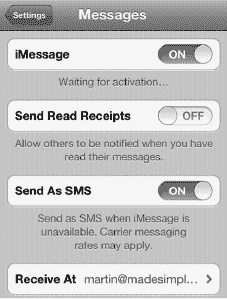

2. **轻点“信息”。**
3. **将 iMessage 开关滑到“打开”**
4. 随后系统可能会要求您输入`iMessage`密码——这实际上就是您的苹果 iTunes 密码。

**提示：**如果您卡在如所示的**正在等待激活**信息界面，请尝试按照第 26 章：故障排除中的方法重启您的设备。

一旦您启用了`iMessages`选项，您的 iPhone 手机号码**和电子邮件地址**将在`iMessage`服务中注册，从其他 iOS 5 设备发送到您手机的任何信息都将通过`iMessage`发送。

如果您轻点`iMessage`设置屏幕底部的**接收方式**，您将看到一个类似这样的屏幕。

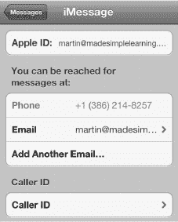

在此屏幕上，您可以调整与您的`iMessage`关联的电子邮件地址，添加新的电子邮件地址，并更改`iMessage`的“来电显示”中显示的内容。

### 在 iPhone 上发送短信

短信已成为当今手机上最常用的服务之一。尽管它在欧洲和亚洲的使用更为广泛，但在北美也越来越受欢迎。

其概念非常简单：无需拨打电话，而是向对方的手机发送一条简短信息。发送短信比打电话的干扰要小得多；不过，你的朋友、同事或同学中可能有人没有 iPhone，因此电子邮件可能并非总是可行之选。

本书的一位作者经常用短信与他的孩子们交流——这正是他这一代人的沟通方式。“今晚回家吃饭吗？”“嗯。”就这样——与一个十八岁的年轻人完成了一次有意义的对话——简短、即时、轻松。

#### 编写短信

编写短信与发送电子邮件十分相似。短信的妙处在于它几乎可以发送到任何手机上，并且回复起来也非常简单。

#### 从“信息”App 编写短信

有几种方法可以启动你的“`信息`”应用。最简单的方法就是轻点“`主屏幕`”上的“`信息`”图标。

当你首次启动“`信息`”应用时，很可能还没有任何信息，因此屏幕会是空白的。一旦你开始使用短信服务，屏幕将显示信息列表以及与你联系人当前的“进行中”对话。请按照以下步骤发送短信：

1.  轻点屏幕右上角的`编写`图标。

    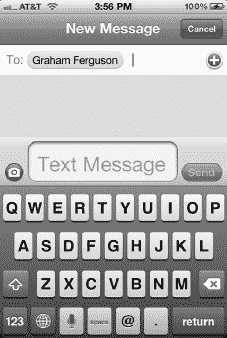

2.  光标会立即跳转到“`收件人：`”栏。你可以开始输入联系人的姓名，也可以直接轻点“`加号`”（`+`）按钮来搜索或滚动浏览你的联系人列表。
3.  如果你只想直接输入某人的手机号码，可以按下`123`按钮并拨号。

    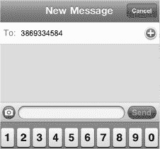

    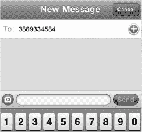

4.  当找到你想要使用的联系人时，轻点此人的姓名，它就会出现在“`收件人：`”栏中。
5.  当你准备好输入短信内容时，请轻点屏幕中间输入框（位于`发送`按钮旁边）的任意位置。

    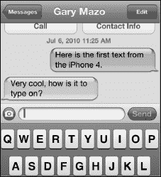

6.  键盘将会显示出来。输入你的信息，完成后轻点`发送`。

    **注意**：如果你已在“`设置`”>“`信息`”中启用了字符计数器，它会显示出来。

**提示**：如果你喜欢，也可以使用横屏模式下更大的键盘来发送短信。使用更大的按键输入会更方便，尤其是当你的手指比较大，或者难以看清较小的按键时。

#### 发送短信后的选项

发送短信后，窗口会变为你与联系人之间的一个“*串连*”对话窗口。如果你使用的是短信，发送的信息会显示在屏幕右侧的绿色气泡中。如果你使用 iMessage，则你发送的信息会出现在蓝色气泡中。当你的联系人回复时，他的信息会显示在屏幕另一侧的灰色气泡中。

若要离开`编写`屏幕，请轻点左上角的“`信息`”，或按下`主屏幕`按钮返回你的“`主屏幕`”。

**注意：**如果信息发送失败，你会看到其旁边有一个感叹号。你还会在“`信息`”应用图标的右上角看到一个`红色感叹号`图标。

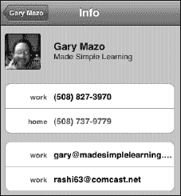

如果发生这种情况，你可以像之前一样再发送一条信息。或者，你可以呼叫该联系人，或查看他的联系人信息。

若要给正在与之发短信的联系人打电话，请轻点`呼叫`按钮。若要查看他的联系人信息，请轻点`联系人信息`按钮。

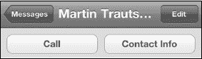

**提示：**虽然短信技术上限是 160 个字符，但许多 GSM 运营商（包括 AT&T）会将较长的文本拆分成多条短信，并在收到后重新组合成一条信息。像 Verizon 这样的 CDMA 网络有时在重新组合超过 160 个字符的短信时会遇到问题；其他时候，它们可能会乱序送达。如果你遇到这个问题，可以尝试自己将短信拆分成几条较短的信息发送，而不是发送一条长信息。

#### 从“通讯录”编写短信

你还可以启动“`短信`”应用，向 iPhone 通讯录中的任何联系人编写并发送一条短信。请按照以下步骤操作：

1.  通过搜索或浏览“`通讯录`”找到你想要发短信的联系人。

    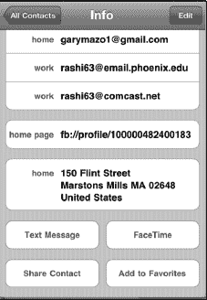

2.  在联系人信息的底部，你会看到一个标有“`短信`”的框。轻点该框，系统会提示你选择要使用的号码（如果你为该联系人列了多个号码）。
3.  选择首选号码，然后按照前面列出的步骤操作。

**注意：**请记住，你只能向手机号码发送短信。

#### 回复短信

当收到一条短信时，你的 iPhone 会根据你的设置播放提示音、振动，或两者皆有。此外，屏幕顶部的“`通知中心`”会显示一个提示，让你可以选择立即回复。

当你看到和/或听到提示时，只需轻点该通知即可跳转到“`信息`”应用并输入你的回复，如前所示。

如果你错过了通知或想稍后回复，只需从屏幕顶部下拉“`通知中心`”列表，然后轻点你想要回复的信息。

**注意**：如果你的屏幕已锁定，你将看到信息以弹出窗口或“`锁定屏幕`”列表的一部分形式出现。只需滑动“`信息`”图标即可解锁，然后你将进入该信息。

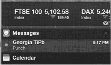

#### 查看已存储的信息

一旦你开始进行一些串连对话，它们就会被存储在“`信息`”应用中。轻点“`信息`”图标，你就可以滚动浏览你的信息线程。

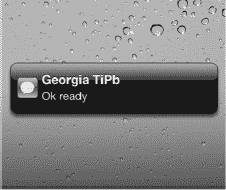

想要继续与某人对话，只需轻点所需的线程，它就会打开，向你展示所有过往信息的往来记录。轻点文本框，输入你的信息，然后轻点`发送`按钮即可继续对话。

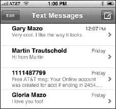

#### 短信铃声与声音选项

你的 iPhone 允许你设定收到信息时的反应方式。请按照以下步骤选择你偏好的提醒方式：

1.  启动“`设置`”应用，滚动至“`声音`”，然后轻点“`声音`”标签。

    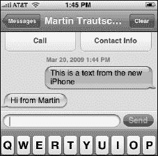

2.  如果你在“`声音`”菜单中将`振动`功能设置为`开启`（当手机响铃时，请参阅第 10 章：“将你的 iPhone 用作电话”），那么收到短信时也会伴随振动。
3.  再向下滚动一点，你会看到一个标有“`短信铃声`”的标签。轻点此标签，你就可以选择短信的铃声。你可以选择提供的选项（通常有六个），或者选择“`无`”。

    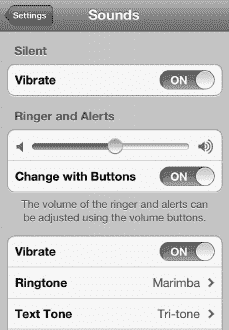

4.  为短信通知选择你喜欢的声音，然后轻点左上角的“`声音`”按钮以确认你的选择。

    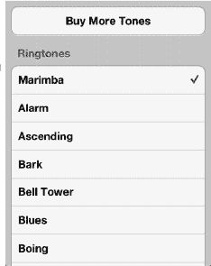

### MMS——多媒体信息服务

“`信息`”应用为 iPhone 用户提供了发送和接收 MMS 信息（包括图片信息、视频信息以及多媒体 iMessage）所需的工具。MMS 信息会像你的短信一样，直接显示在信息窗口中。

**注意**：你可以在“`信息`”应用中发送图像、视频、位置（来自地图）、音频（来自“`语音备忘录`”应用）以及电子名片 vCard（来自“`通讯录`”应用）文件。

#### 使用“信息”发送图片或视频

要发送彩信或多媒体 iMessage，你需要使用我们在发送短信时介绍过的同款“信息”应用。按以下步骤操作：

1.  轻点“信息”图标开始发信息——就像发短信一样。

    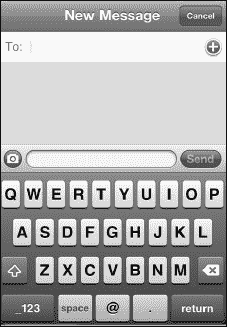

2.  你会注意到文本输入框旁边有一个小小的“相机”图标。轻点此图标，系统会提示你“拍照或录像”或“选取现有内容”。

    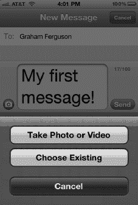

3.  若要拍照，请按照第 20 章：“使用照片”中的说明操作。如果选择“选取现有内容”选项，只需浏览你的照片/视频，找到要添加到信息中的项目即可。

    

4.  轻点右下角的蓝色“选取”按钮，你会看到图片加载到小窗口中。

    

5.  选择收件人（如前所示），如果需要，可以输入一条简短留言。接着，轻点蓝色的“发送”按钮。

    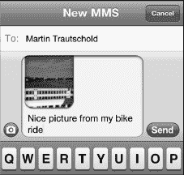

如果你已与该特定联系人有过会话讨论，那么他的图片会出现在该会话讨论中。

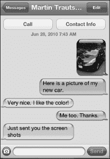

**注意**：你可以在会话讨论过程中继续交换图片和文字。而且你随时可以滚动查看整个讨论内容——包括图片和所有内容！

#### 从“照片”中选择图片并通过“信息”发送

发送图片或视频信息的第二种方法是直接进入“照片”应用并选择一张图片。按以下步骤操作：

1.  启动“照片”应用，按照第 21 章：“使用照片”中的说明浏览你的照片。

    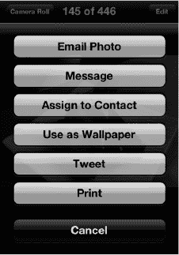

2.  若要只发送一张图片，轻点你想要发送的图片，然后轻点左下角的“发送”图标。
3.  现在你会看到“信息”作为第二个选项。选择“信息”，图片就会像之前在“信息”应用中那样加载到气泡中。

#### 发送多张图片

按以下步骤发送多张图片：

1.  启动“照片”应用，就像你在上一节中所做的那样。

    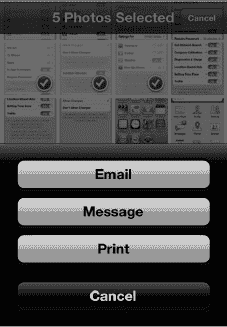

2.  不要轻点单张图片，而是轻点左下角的“操作”按钮。
3.  现在，只需轻点最多数量的图片。你会看到它们的颜色变浅，并且方框中会出现一个红色勾选标记图标。
4.  一旦你选择了最大数量的图片（可能是 5 张、9 张或其他数量，具体取决于你的无线运营商），请轻点左下角的“共享”按钮。
5.  选择“信息”，图片就会出现在信息气泡中。

