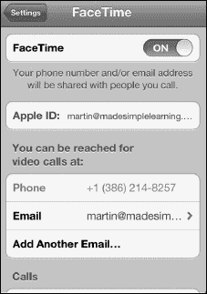
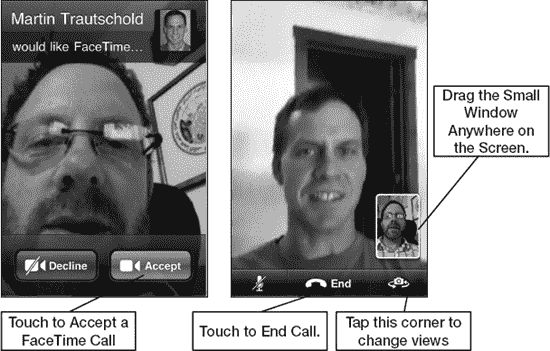
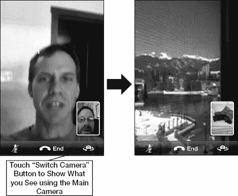
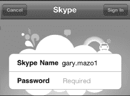
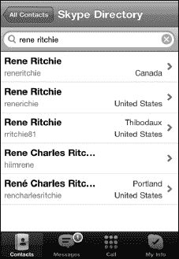
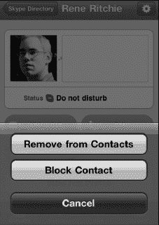
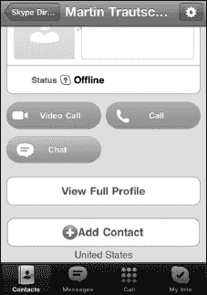
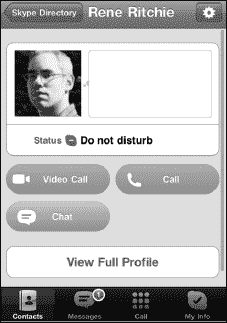
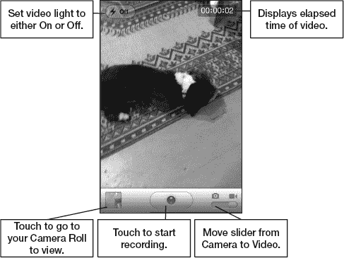
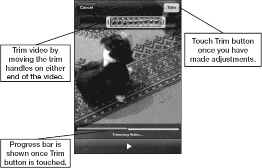

# 第 11 章

## 视频通话与 Skype

你的 iPhone 为你的生活带来了许多新功能，其中一些在几年前还像是科幻小说中的情节。例如，视频通话如今不仅成为可能，而且借助全新的“FaceTime”功能变得极其易用。只要你和通话对象都使用 iPhone，并且都连接在 Wi-Fi 网络上，就可以进行无限制的视频通话。在本章中，我们将向你展示如何启用和使用“FaceTime”，以及如何开始享受这一绝佳新功能带来的乐趣。

通过 Wi-Fi 甚至 3G 网络进行通话，也可以通过“skype”实现——这是许多人电脑上使用的流行视频通话和聊天程序。我们还将向你展示如何使用“skype”应用。

说到视频，你的 iPhone 是一款功能强大的视频录像机。你可以录制并导出高达 1080p 分辨率、每秒 30 帧的高清视频。然后，你可以直接将视频发布到 YouTube 或 iCloud，甚至通过电子邮件发送给收件人。我们还将向你展示如何拍摄并快速“修剪”你的视频，以及如何上传它们。

### 视频通话

多年来，我们在电视剧和电影中看到过像这样的未来技术首次亮相。例如，许多剧集和电影中展示了人们使用小巧便携的手机进行视频对话的场景。甚至 20 世纪 70 年代的《摩登原始人》卡通片也将其视为一个未来概念。

iPhone 让这种未来构想今天变成了现实。有几款应用可以让你使用 iPhone 的前置摄像头进行视频通话。目前，只有一款应用允许你同时使用前置摄像头和后置摄像头：“FaceTime”。

#### 使用 FaceTime 进行视频通话

“FaceTime”是苹果公司在许多 iPhone 广告中重点宣传的专属应用。本质上，“FaceTime”是一种免费 Wi-Fi 通话，让你可以通过手机的前置摄像头看到通话另一端的对方。

**注意：** 目前，“FaceTime”仅适用于近期 iOS 设备（如 iPhone 4、iPhone 4S、iPad 2 和 iPod touch 4）以及 Mac 电脑之间的视频通话。同时，它仅支持通过 Wi-Fi 网络使用。苹果表示正在探索扩展这项服务，因此不久的将来它也能在标准的 3G 网络上运行。不过，运营商也需要参与其中，你才能在特定网络上看到这项功能。

##### 在你的 iPhone 上启用 FaceTime 通话

当你首次使用设备时，“FaceTime”可能尚未启用。要启用 iPhone 接收和拨打“FaceTime”通话，请按以下步骤操作：

1.  启动“设置”应用。

    

2.  轻点“FaceTime”。
3.  将“FaceTime”开关切换至“打开”位置。

系统可能会要求你使用 Apple ID 登录。

**提示：** 你也可以滚动到底部并轻点“来电显示”，以调整你的电话号码或电子邮件地址是否显示为你的“FaceTime”来电显示。

##### 使用 FaceTime

一旦“FaceTime”启用，你会在每次从 iPhone 拨打电话时看到它作为一个选项。“FaceTime”图标将出现在所有电话的选项显示中。然而，只有当通话另一方使用的是支持“FaceTime”的 iOS 设备或 Mac 时，“FaceTime”才会起作用。

要发起“FaceTime”通话，请按以下步骤操作：

1.  像在 iPhone 上正常拨打电话一样。
2.  轻点“FaceTime”按钮（通常位于“保留”按钮的位置），应用会询问通话另一端的对方是否“接受”“FaceTime”通话。
3.  或者，你也可以直接“接受”来自另一方的“FaceTime”通话（参见图 11–1）。

**图 11–1.** *接受“FaceTime”通话*

一旦“FaceTime”通话发起，请按以下步骤进行视频会议：

1.  将手机稍微拿远一些。
2.  确保你在窗口中的位置*构图*得当。
3.  你可以将包含自己小图像的画面拖动到屏幕上的方便位置。
4.  轻点“切换摄像头”按钮，向“FaceTime”通话对象展示你正在观看的内容。“切换摄像头”按钮现在将使用 iPhone 背面的标准摄像头。在图 11–2 中，我看到了 Martin 度假时科罗拉多州的美景，而他则看到了我的狗在沙发上！
5.  轻点“结束”按钮以结束“FaceTime”通话。
6.  轻点“静音”按钮以暂时将通话静音。

**图 11–2.** *在“FaceTime”通话中切换摄像头视图*

### 使用 Skype 拨打电话及更多功能

社交网络的核心在于与朋友、同事和家人保持联系。通过像 [`www.facebook.com`](http://www.facebook.com) 和 `Google+` 这样的网站进行被动沟通固然不错，但有时没有什么能替代听到对方声音的体验。

令人惊叹的是，你可以使用任何 iPhone 上的 `skype` 应用拨打语音和视频电话。拨打给全球其他 Skype 用户的电话是免费的。Skype 服务的一个优点是它可以在电脑和许多移动设备上运行，包括 iPhone 4S、旧款 iPhone、iPad、iPod touch、部分黑莓智能手机以及其他移动设备。拨打给手机和固定电话会收费，但价格合理。

**注意**：与 `FaceTime` 不同，`skype` 应用可以通过 3G 网络发起视频通话。它还可以在后台运行，因此你可以随时接听来电的 Skype 电话（注意，这通常会导致电池消耗更快）。

## 将 Skype 下载到你的 iPhone

你可以从 App Store 搜索“Skype”并安装来下载免费的 `skype` 应用。如果在此过程中需要帮助，请查看第 23 章：“神奇的 App Store”。

## 创建你的 Skype 账号

如果你需要设置 Skype 账号，并且尚未通过电脑完成（请参阅本章后面的“在电脑上使用 Skype”部分）。

## 登录 Skype 应用

创建账号后，你就可以在 iPhone 上登录 `skype` 了。请按照以下步骤操作：

1.  如果你尚未进入 `skype`，请从 `Home` 屏幕点击 `skype` 图标。

    

2.  输入你的 Skype 用户名和密码。
3.  点击右上角的 `sign In` 按钮。
4.  你无需再次输入此登录信息；它已保存在 `skype` 中。下次点击 `skype` 时，它将自动为你登录。

## 查找并添加 Skype 联系人

登录 `skype` 应用后，你将希望开始与人沟通。为此，你需要找到他们并将其添加到你的 `skype` 联系人列表中：

1.  如果你尚未进入 `skype` 应用，请从 `Home` 屏幕点击 `skype` 图标，并在系统提示时登录。
2.  点击底部的 `Contacts` 软键。
3.  点击顶部的 `search` 窗口，然后输入某人的姓名或 `skype` 用户名。点击 `search` 找到此人。

    

4.  看到你想添加的人后，点击其姓名。
5.  如果不确定此人是否正确，请点击 `View Full Profile` 按钮。

    

6.  点击底部的 `Add Contact`。
7.  适当调整邀请消息。

    

8.  点击 `send` 按钮，向此人发送成为你 `skype` 联系人的邀请。
9.  重复此步骤以添加更多联系人。
10. 完成后，点击底部的 `Contacts` 软键。
11. 从 `Groups` 屏幕点击 `All Contacts`，查看你添加的所有新联系人。
12. 一旦此人接受你为联系人，你将看到其出现在 `All Contacts` 屏幕的联系人列表中。

**提示：** 有时你想删除某个 Skype 联系人。你可以通过从联系人列表中点击其姓名来移除或阻止联系人。点击 `settings` 图标（右上角），然后选择 `Remove from Contacts` 或 `Block`。

## 在 iPhone 上使用 Skype 拨打电话

到目前为止，你已经创建了账号并添加了联系人。现在，你终于可以在 iPhone 上使用 `skype` 拨出第一通电话了：

1.  点击底部的 `Contacts` 软键。

    

2.  点击 `All Contacts` 查看你的联系人。
3.  点击你想拨打的联系人姓名。
4.  点击 `Call` 按钮进行语音通话，或点击 `Video Call` 按钮进行视频通话。
5.  你可能会看到一个 Skype 按钮和一个移动电话或其他电话按钮。按下 Skype 按钮即可免费通话。拨打任何其他电话都需要使用 Skype 点数付费。

**注意：** 你可以在 iPhone 上使用 `skype Out` 免费拨打免费电话号码。以下说明来自 Skype 网站 [`www.skype.com`](http://www.skype.com)：

“支持以下国家和号码范围，对所有用户免费。我们正在努力覆盖世界其他地区。法国：+33 800、+33 805、+33 809 波兰：+48 800 英国：+44 500、+44 800、+44 808 美国：+1 800、+1 866、+1 877、+1 888 台湾：+886 80”

## 在 iPhone 上使用 Skype 接听电话

iPhone 原生支持后台 VoIP 通话。借助新版 `skype`，你可以让 `skype` 在后台运行，并在有来电时接听 `skype` 电话。理论上，你甚至可以在进行语音通话时再接听你的 `skype` 电话！

**提示：** 如果你不想让 `skype` 在后台运行，但仍想给某个你知道也在 iPhone 上使用 `skype` 的人打电话，只需给她发一封简短的电子邮件或快速打个电话，提醒她你想用 `skype` 应用与她通话。

### 购买 Skype 点数或月度订阅

Skype 用户之间的通话是免费的。但是，如果你想通过 `skype` 应用拨打固定电话或手机，则需要购买 Skype 点数或购买月度订阅套餐。如果你尝试在 `skype` 应用内购买点数或订阅，它会将你带到 Skype 网站。因此，我们建议使用 iPhone 上的 `safari` 或电脑的网页浏览器来购买这些点数。

**提示：** 在注册订阅套餐之前，你可能想先购买少量 Skype 点数试用该服务。如果你打算经常使用 Skype 与非 Skype 用户（例如，普通固定电话和手机）通话，订阅套餐是更好的选择。

按照以下步骤使用 `safari` 购买 Skype 点数：

1.  点击 `safari` 图标。
2.  在顶部的地址栏中输入 [`www.skype.com`](http://www.skype.com)，然后点击 `Go`。
3.  点击页面顶部的 `sign In` 链接。
4.  输入你的 Skype 用户名和密码，然后点击 `sign me in`。
5.  如果你尚未进入 `Account` 屏幕，请点击顶部导航栏右侧的 `Account` 标签。
6.  此时，你可以选择购买点数或订阅：
    *   点击 `Buy pre-pay credit` 按钮，购买固定金额的点数。
    *   点击 `Get a subscription` 按钮，购买月度订阅账户。
7.  最后，根据购买类型完成支付说明。

## 使用 Skype 聊天

除了拨打电话，你还可以通过 iPhone 与其他 `skype` 用户进行文字聊天。开始聊天与开始通话非常相似；请按照以下步骤操作：

1.  如果你尚未进入 `skype`，请点击 `skype` 图标。
2.  点击底部的 `Contacts` 软键。

    

3.  点击 `All Contacts` 查看所有联系人。
4.  点击你想聊天的联系人姓名。
5.  点击 `Chat` 按钮。
6.  输入你的聊天文字，然后按下 `send` 按钮。你的聊天内容将显示在屏幕顶部。

    

#### 将 Skype 添加到你的电脑

你也可以在电脑上使用 `skype` 应用。接下来我们将向你展示具体操作方法。如果你的电脑连接了网络摄像头，你还可以使用 `skype` 进行视频通话。

**注意：**当你从电脑呼叫 iPhone 时，将无法进行视频通话。

要创建 Skype 账户并下载适用于电脑的 `skype` 软件，请按照以下步骤操作：

1. 在电脑上打开一个网页浏览器。
2. 访问：[www.skype.com](http://www.skype.com)。
3. 点击页面顶部的 **加入** 链接。
4. 填写所有必填信息并点击 **继续** 按钮来创建你的账户。请注意，你只需要在带星号（*）标记的必填字段中输入信息。例如，你无需填写性别、出生日期或手机号码。
5. 到此，账户设置过程就完成了。接下来，你会看到购买 Skype 点数的选项；不过，对于免费的 Skype 对 Skype 通话、视频通话或聊天来说，这并非必需。

   **提示：**只有当你想给未使用 `skype` 的人打电话时才需要付费。例如，拨打固定电话或手机（未使用 `skype`）会收取费用。撰写本文时，即付即用费率约为 2.1 美分；不同通话套餐的月订阅费用从大约 3 美元到 14 美元不等。

6. 接下来，点击网站顶部导航栏中的 `Get Skype` 链接，将 `skype` 下载到你的电脑。
7. 点击 **获取 Windows 版 Skype** 按钮或 **获取 Mac 版 Skype** 按钮。
8. 按照说明安装该软件。
9. 软件安装完成后，启动它并使用你的 Skype 账户登录。
10. 现在，你可以开始与任何其他使用 `skype` 的人（包括你所有在 iPhone 上装有 `skype` 的朋友）发起（或接听）电话、视频通话和聊天。

### 视频录制

除了让你进行视频通话和聊天之外，iPhone 还允许你使用内置录像机录制功能完整的视频。你可以用 iPhone 拍摄 1080p 高清视频，然后将此视频上传到 Facebook、YouTube 或 iCloud。你也可以通过彩信或电子邮件发送你的视频。

**注意：**分享视频时，视频会被压缩，因此画质将不再是 1080p。

接下来，我们将展示如何直接在 iPhone 上录制视频和修剪视频。你还将学习如何直接在 iPhone 上制作高质量的高清视频。

#### 启动录像机

录像机的软件实际上是 **相机** 应用的一部分（参见 图 11–3）。按照以下步骤使用内置录像机：

1. 启动 **相机** 应用。将右下角的滑块从 **相机** 图标移动到 **录像机** 图标。
2. 点击右上角的 **切换摄像头** 按钮，在后置摄像头和前置摄像头之间切换。
3. 录制场景时尽量保持 iPhone 稳定。
4. 录制完成后，点击 **停止** 按钮。

**图 11–3.** *录像机的布局与控件*

##### 调整视频焦点

iPhone 可以根据拍摄对象自动调整视频的焦点。按照以下步骤利用此功能：

1. 若要对视频前景中的某个物体进行对焦，请点击屏幕前景区域。此时会显示一个小方框，指示对焦区域。
2. 若要将焦点切换到背景中的某个对象，请点击屏幕的另一部分。对焦框会临时显示新的对焦区域。

##### 修剪视频

iPhone 允许你直接在手机上对视频进行编辑。视频录制完毕并点击 **停止** 按钮后，视频会立即存入你的 **相机胶卷**。

点击左下角的视频缩略图即可调出该视频。在屏幕顶部，你会看到一个时间线，显示你视频的所有帧（参见 图 11–4）。按照以下步骤编辑你刚刚录制的视频：

1. 拖动时间线的任一端，你会看到视频进入修剪模式。
2. 拖动视频两端的边缘，直至达到你想要的长度。
3. 当视频长度合适时，点击右上角的 **修剪** 按钮。
4. 接下来，选择 **修剪原片** 或 **存储为新剪辑**。后一个选项会保存一个经过修剪的新视频版本。

**图 11–4.** *修剪视频*

##### 发送视频

与照片一样，你也有多种方式可以通过 iPhone 将录制的视频发送给他人。按照以下步骤从你的 iPhone 发送视频：

1. 点击左下角的 **发送** 图标 。
2. 选择你偏好的视频发送方式：**电子邮件**、**信息** 或 **发送到 YouTube**。
3. 你接下来看到的屏幕取决于你在第 2 步中所做的选择。如果你选择了 **电子邮件**，你的 **邮件** 应用将会启动。如果你选择了 **信息**，你的 **信息** 应用将会启动，以此类推。

   **注意：**要将视频上传到 YouTube，你需要拥有该网站的账户。

