# 第 12 章

### 播放音乐

在本章中，我们将向你展示如何将你的 iPhone 变成一台绝佳的音乐播放器。由于 iPhone 出自苹果公司——正是它让如今家喻户晓的 iPod 电子音乐播放器得以普及——因此，你完全可以期待它具备一些出色的功能，而事实也确实如此。我们将为你介绍如何播放和管理从 iTunes 购买或从电脑同步的音乐，如何以多种方式查看播放列表，以及如何快速找到歌曲。你将学会如何使用 Genius 功能，让 iPhone 在你的音乐库中定位并归类相似的歌曲——有点像只播放你喜欢音乐的电台。

**提示：**在第 22 章“你设备上的 iTunes”中，你将学习如何直接在 iPhone 上购买音乐以及使用 Ping（音乐爱好者的社交网络）。

你还将了解如何使用一款名为 Pandora 的应用来流播音乐。使用 Pandora，你可以从众多网络电台中进行选择，也可以通过输入你最喜欢的艺术家姓名来创建自己的电台，而且这一切都是免费的。

### 将你的 iPhone 用作音乐播放器

你的 iPhone 可能是当今市场上最好的音乐播放器之一。触控屏使得与音乐、播放列表、专辑封面以及音乐库的组织进行交互和管理变得轻而易举。你甚至可以通过蓝牙将 iPhone 连接到家庭音响或车载音响，从而通过 iPhone 聆听美妙的立体声音乐！

**提示：**请参阅第 5 章“AirPlay 与蓝牙”，了解如何将你的 iPhone 连接到蓝牙立体声音箱或车载音响。

无论你是使用内置的 **音乐** 应用，还是像 **Pandora** 这样的网络电台应用，你都会发现在 iPhone 上对音乐的控制达到了前所未有的程度。

### 音乐应用

大部分音乐通过**音乐**应用来管理——其图标位于**主屏幕**上，通常在最底部的图标栏中，它是右边最后一个图标。

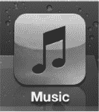

**注意：** 对于所有熟悉 iOS 5 之前 iPhone 的读者来说，是的，音乐播放应用曾被称为 **iPod** 应用。现在它被简称为**音乐**应用。

轻点 `Music` 图标，如图 12–1 所示，你会看到底部有五个软按键：

*   **播放列表** 可让你查看从电脑同步的播放列表，以及在 iPhone 上创建的播放列表。
*   **艺人** 可让你查看按字母顺序排列的艺人列表（像通讯录一样可以搜索）。
*   **歌曲** 可让你查看按字母顺序排列的歌曲列表（同样可以搜索）。
*   **专辑** 可让你按专辑标题浏览音乐。
*   **更多** 可让你查看有声书、选集、作曲家、流派、iTunes U 和播客。

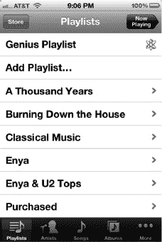

**图 12–1.** *底部带有软按键的音乐应用*

## 编辑软按键

iPhone 上一个非常酷的功能是，你可以编辑**音乐**应用底部的软按键，真正地对其自定义以满足你的需求和品味。要执行此操作，首先轻点**更多**按钮。

然后轻点屏幕左上角的**编辑**按钮。

屏幕会切换，显示可以拖拽到底部栏的各种图标。

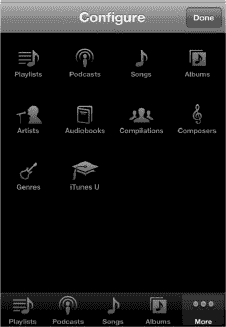

**图 12–2.** *更改**音乐应用**中的软按键。*

假设你想用**有声书**图标替换**专辑**图标。只需长按**有声书**图标，并将其拖拽到底部栏中**专辑**图标的位置。到达后，松开图标，**有声书**图标就会取代原来**专辑**图标的位置。你可以在此**配置**屏幕上对任意图标进行此操作。完成后，轻点屏幕右上角的**完成**按钮。

**提示：** 你也可以通过沿软按键行来回拖放图标来重新排列底部图标的顺序。

## 播放列表视图

**注意：** 播放列表是你创建的一个歌曲列表，可以包含任何你感兴趣的流派、艺人、录制年份或歌曲合集。

许多人会将特定流派的音乐归类在一起，比如古典或摇滚。其他人可能会创建快节奏音乐的播放列表，并称之为锻炼或跑步音乐。你可以利用播放列表以几乎任何你想要的方式来组织你的音乐。

你可以在电脑上的 iTunes 中创建播放列表，然后同步到你的 iPhone（请参阅 iTunes 指南），或者直接在你的 iPhone 上创建播放列表，我们将在下一节中描述。

一旦你将播放列表同步到 iPhone 或在其上创建了播放列表，它就会显示在**音乐**屏幕左侧的**资料库**下。

如果左侧列出了多个播放列表，只需轻点你想要收听的那个名称。

**注意：** 你可以在 iPhone 上编辑某些播放列表的内容。但是，你无法在 iPhone 本身上编辑 Genius 播放列表。

## 在 iPhone 上创建播放列表

iPhone 允许你创建独特的播放列表，这些列表可以与你的电脑编辑和同步。假设你想向 iPhone 播放列表中添加一些新的音乐选择。只需按照我们下面展示的方式创建播放列表并添加歌曲。你可以随时更改播放列表，移除旧歌曲并添加新歌曲——再简单不过了！

要在 iPhone 上创建新播放列表，轻点 **Genius 播放列表** 下方的**添加播放列表**标签。

为你的播放列表起一个独特的名称（我们将其命名为“骑行音乐”），然后轻点**存储**。

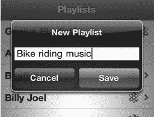

现在你会看到**歌曲**屏幕。轻点你想添加到新播放列表中的任何歌曲名称。

当歌曲变灰时，表明它已被选中，将被添加到播放列表中。

**注意：** 不要因为试图移除或取消选择你误点的歌曲而感到挫败。你无法在此屏幕上移除或取消选择歌曲；你必须点击**完成**，然后在下一个屏幕上移除它们，正如我们所描述的那样。

选择右上角的**完成**，播放列表的内容将会显示出来。

## 搜索音乐

来自**音乐**应用的几乎所有视图（**播放列表**、**艺人**、**歌曲**等）在屏幕顶部都有一个搜索窗口。

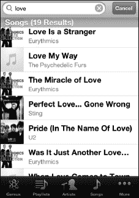

如果你看不到搜索窗口，轻点顶部的（时间）即可立即使其可见。

在搜索窗口中轻点一次，然后输入艺人、专辑、播放列表或歌曲名称的几个字母，即可立即看到所有匹配项目的列表。这是在 iPhone 上快速找到想要收听或观看的内容的最佳方式。

### 在音乐应用中更改视图

**音乐**应用在显示和分类音乐的方式上非常灵活。有时，你可能希望按艺人查看列出的歌曲。其他时候，你可能更想查看特定的专辑或歌曲。iPhone 允许你轻松更改视图，以帮助管理和播放你在特定时刻想要的音乐。

在你的**音乐**应用中，你可以使用以下视图：

*   **艺人视图** - 显示所有按艺人排列的音乐列表。
*   **歌曲视图** - 显示所有按每首歌曲名称排列的音乐。
*   **专辑视图** - 显示所有按专辑名称排列的音乐。
*   **流派视图** - 显示所有按类型或流派排列的音乐。
*   **作曲家视图** - 显示按作曲家姓名排列的音乐。
*   **有声书** - 显示你所有的有声书。
*   **选集** - 显示所有选集。
*   **iTunes U** - 显示所有 iTunes U 内容。
*   **播客** - 显示你所有的播客。

### 查看专辑中的歌曲

当你在**专辑**视图中时，只需轻点一张专辑封面或名称，屏幕会滑动，显示该专辑中的歌曲（参见图 12–3）。

**提示：** 当你开始播放一张专辑时，专辑封面可能会放大以填满屏幕。轻点屏幕一次可调出（或隐藏）顶部和底部的控制项。你可以使用这些控制项来管理歌曲和屏幕，如下所述。

要查看正在播放的专辑中的歌曲，请轻点**列表**按钮，专辑封面会翻转，显示该专辑中的所有歌曲。正在播放的歌曲旁边会有一个蓝色小箭头。

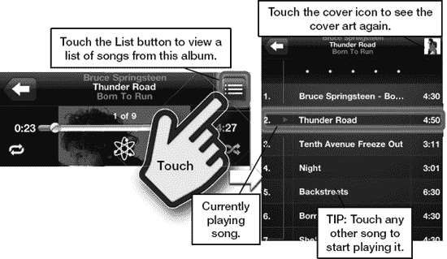

**图 12–3.** *轻点**列表**按钮查看特定专辑中的歌曲。*

轻点歌曲列表上方的标题栏可返回专辑封面视图。

## 使用 Cover Flow 导航

Cover Flow 是一种专有的、非常酷的通过专辑封面浏览音乐的方式。如果你在**音乐**应用中播放一首歌曲，然后将 iPhone 横向旋转至横屏模式，你的 iPhone 会自动切换到 **Cover Flow**。

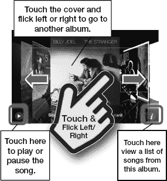

### 在 Cover Flow 中查看歌曲

只需轻点一张专辑封面，封面就会翻转，显示该专辑中的所有歌曲。

要查看当前正在播放的歌曲（在 Cover Flow 视图中），轻点专辑封面，它会翻转过来，显示该专辑中的歌曲（图 12–4）。当前正在播放的歌曲旁边会有一个蓝色小箭头。

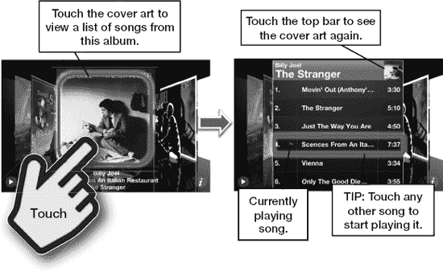

**图 12–4.** *你可以使用 **Cover Flow** 查看专辑的内容。*

轻点（歌曲列表上方的）标题栏，专辑封面将再次显示。然后，你可以继续滑动浏览你的音乐，直到找到你正在寻找的内容。

**注意：** 你也可以轻点右下角的小“i”图标，专辑封面会翻转，显示歌曲，效果和你轻点封面一样。

### 播放音乐

既然你已经知道如何查找音乐，那么现在就来播放它吧！通过上述任意方法找到一首歌或浏览到一个播放列表。只需轻点歌曲名称，它便会开始播放。

此屏幕会显示所选歌曲所属专辑的封面图片，顶部则是歌曲名称。

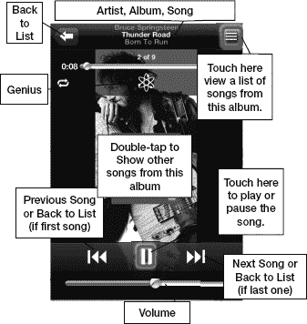

在屏幕底部，你可以找到`音量`滑块，以及`上一首`、`播放/暂停`和`下一首`按钮。

若要查看专辑中的其他歌曲，只需双击专辑封面，屏幕便会翻转，显示所有其他歌曲。

你也可以点击右上角的`列表`按钮，查看专辑中的歌曲列表。

#### 暂停与播放

点击暂停符号（如果歌曲正在播放）或播放箭头（如果音乐已暂停），即可停止或恢复播放歌曲。

#### 播放上一首或下一首歌曲

若你正在播放列表中，点击`下一首`箭头（位于`播放/暂停`按钮右侧）将跳转到列表中的下一首歌。若你正按专辑浏览音乐，点击`下一首`则会跳转到专辑中的下一首歌。点击`上一首`按钮则执行相反操作。

**注意：** 如果歌曲正处于开头位置，`上一首`将跳转到前一首歌。如果歌曲正在播放，`上一首`会回到当前歌曲的开头（再次点击则会跳转到前一首歌）。

#### 调节音量

在 iPhone 上有两种调节音量的方法：使用设备外部的`音量`按钮，或使用屏幕上的`音量滑块`控制。

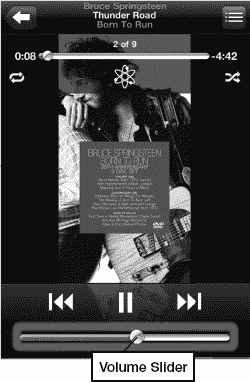

设备外部的`音量`按钮位于机身左上角。按下`音量加`键（上方按钮）或`音量减`键可提高或降低音量。调节音量时，你会看到`音量滑块`随之移动。你也可以直接长按并拖动`音量滑块`来调节音量。

**提示：** 若要快速静音，请长按`音量减`键，音量会逐渐降至最低。

#### 双击主屏幕按钮呼出媒体控制

你可以在 iPhone 上处理其他事务（如阅读和回复邮件、浏览网页或玩游戏）的同时播放音乐。借助 iPhone 的全新多任务功能，快速双击底部的`主屏幕`按钮，然后向右滑动，即可在多任务窗口中调出“正在播放”媒体控制。这些控制选项允许你跳转到上一首、暂停或播放当前歌曲、跳转到下一首，或直接跳转到播放歌曲的应用。

**注意：** 小组件会显示上次播放音频或视频的应用。因此，如果上次使用的是`Pandora`，你会看到`Pandora`而非`音乐`，并且小组件将控制`Pandora`，`视频`、`YouTube`等应用同理。

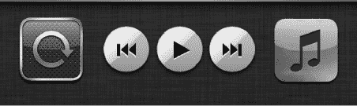

**提示**：按住`上一首`控制，歌曲将会快退；按住`下一首`控制，歌曲将会快进。

#### 重复播放、随机播放及在歌曲内跳转

在播放模式下，点击专辑封面上的任意位置，即可激活额外的控制选项。此时，你会在顶部看到一个额外的滑块（进度条），以及`重复`、`随机播放`和`Genius`符号。

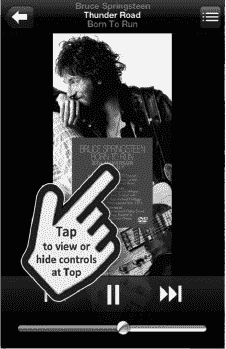

#### 跳转到歌曲的特定部分

向右拖动进度条，你会看到歌曲的已播放时间（显示在最右侧）随之变化。若要寻找歌曲的特定段落，请拖动滑块，然后松手并试听，确认是否定位到正确位置。

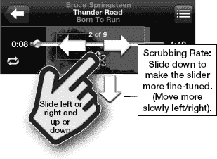

#### 重复播放单首歌曲或所有歌曲

若要重复播放当前收听的歌曲，请双击顶部控制左侧的`重复`符号，直至其变为蓝色并显示数字 1。

若要重复播放播放列表、歌曲列表或专辑中的所有歌曲，请点击`重复`图标，直至其变为蓝色（且不显示数字 1）。

若要关闭`重复`功能，请再次点击该图标，直至其变回白色。

#### 随机播放

如果你正在收听播放列表、专辑或任何其他类别或列表的音乐，你可能会不想按顺序收听。你可以点击`随机播放`符号，音乐便会以随机顺序播放。当图标为蓝色时，表示`随机播放`已开启；为白色时，则表示关闭。

##### 摇动以随机播放

`摇动以随机播放`功能是在上一代 iPhone 中引入的。因此，要开启`随机播放`模式，你只需摇动一下 iPhone 即可切换歌曲，然后再摇动一下。每次摇动 iPhone，你都会跳转到列表中随机选择的下一首歌曲。

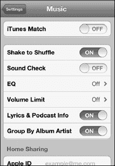

**提示**：如果你打算手持 iPhone 跳舞，请关闭`摇动以随机播放`！

你可以在`设置`菜单中开启`摇动以随机播放`。

1.  点击`设置`图标。
2.  向下滚动并点击`音乐`图标。
3.  将`摇动以随机播放`开关拨至`开启`或`关闭`。

#### 正在播放

有时，你在浏览播放列表或专辑时过于投入，以至于深陷菜单之中，然后只想回到当前收听的歌曲。幸运的是，这总是非常简单——大多数音乐屏幕的右上角都有一个`正在播放`图标，点击它即可。

#### 查看专辑中的其他歌曲

你可能会决定收听同一专辑中的另一首歌曲，而不是播放列表或流派列表中的下一首。

在`正在播放`屏幕的右上角，你会看到一个小按钮，上面有三条横线。

点击该按钮，视图会切换为一张小尺寸的专辑封面图像。此时，屏幕会显示该专辑中的所有歌曲。

点击列表中的另一首歌曲，该歌曲便会开始播放。

**注意：** 如果你正处在播放列表或`Genius 播放列表`中，跳转到专辑中的另一首歌曲后，将不会自动返回原播放列表。若要返回该播放列表，你需要返回到播放列表库，或点击`Genius`创建新的`Genius 播放列表`。

#### 调整音乐设置

你可以调整多项设置，以优化 iPhone 上的音乐播放体验。在`设置`菜单中可以找到这些选项。只需点击`主屏幕`上的`设置`图标即可。

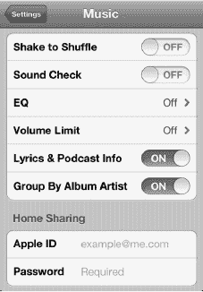

在`设置`屏幕中间，点击`音乐`选项卡，进入`音乐`设置屏幕。你可以在此屏幕上调整六项设置：`摇动以随机播放`、`音量平衡`、`均衡器`、`音量限制`、`歌词与播客信息`以及`按专辑演出者分组`。

你还会找到`家庭共享`的登录区域，这让你可以从 Windows 或 Mac 电脑上的 iTunes 流播放音乐。

#### 使用音量平衡（自动音量调节）

由于歌曲的录制音量不同，有时在播放过程中，某首歌曲听起来可能比另一首响亮得多。`音量平衡`可以消除这种差异。如果将`音量平衡`设置为`开启`，所有歌曲将以大致相同的音量播放。

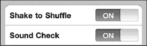

### EQ（声音均衡器设置）

声音均衡是非常个人化和主观的。有些人喜欢在音乐中听到更多低音，有些人喜欢更多高音，还有些人喜欢更夸张的中音。无论你的音乐口味如何，总有一款`EQ`设置适合你。

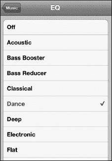

**注意：**使用`EQ`设置会在一定程度上降低电池续航能力。

只需轻触`EQ`标签，然后选择你最常听的音乐类型，或者选择一个特定选项来增强高音或低音。尝试、享受乐趣，找到最适合你的设置。

### 音量限制（以合理水平安全听音乐）

这是家长控制孩子 iPhone 音量的好方法。这也是确保你不会通过耳机听得太大声而损伤耳朵的好方法。你只需将滑块移动到音量限制位置，然后锁定该限制即可。

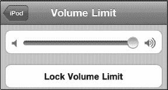

要锁定音量限制，请轻触`Lock Volume Limit`按钮并输入一个 4 位密码。系统会提示你再次输入密码，之后音量限制将被锁定。

### 使用家庭共享

如果你和我们一样，你大电脑硬盘上的音乐可能远多于 iPhone 能容纳的。有了 iPhone 和家庭共享，这都不是问题。

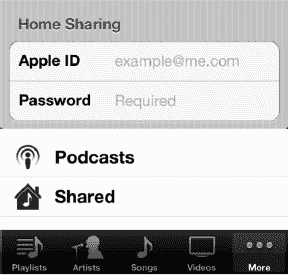

只要你和电脑在同一个 Wi-Fi 网络上，你就可以将桌面 iTunes 资料库中的任何内容直接流式传输到你的 iPhone 上。

要启用家庭共享，请确保你的电脑已使用你的 iTunes 电子邮件地址和密码登录到家庭共享，然后在你的 iPhone 上使用同一个账户登录家庭共享。

登录后，你可以在本地（iPhone）和远程（桌面 iTunes）资料库之间进行选择。操作方法如下：

1.  启动`Music`应用

    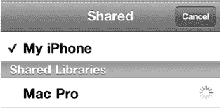

2.  轻触右下角的`More`标签
3.  轻触列表底部的`shared`标签。（如果你没有看到`shared`标签，请仔细检查你的 iPhone 和电脑是否都使用同一个 iTunes 账户登录了家庭共享）
4.  从`shared`列表中选择你桌面电脑的名称，在此示例中是`MacPro`。（你可以共享多个 iTunes 资料库，因此可能会有几个选项供你选择。）

你的 iPhone 资料库将消失，取而代之的是桌面 iTunes 资料库。它的外观与你的 iPhone 资料库完全相同，只是内容不同。

要切换回你的 iPhone 资料库，只需重复相同的过程，但从`shared`列表中选择`iPhone`即可。

### 在 iPhone 锁定时显示媒体控制

你可能希望在 iPhone 锁定时也能访问媒体控制。操作方法如下：双击`Home`按钮，用于调节音频的控制项就会出现在锁定屏幕的顶部。无需解锁屏幕再进入`Music`程序来寻找这些控制。

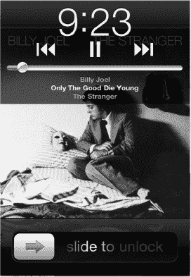

在右侧的图像中，请注意屏幕仍然处于锁定状态——但音乐控制项现在沿顶部可见。你无需实际解锁 iPhone 即可暂停、跳过、转到上一首歌曲或调节音量。

**注意：**只有当有音频播放时，你才会看到这些控制。

### 收听免费网络电台（Pandora）

虽然你的 iPhone 能让你对个人音乐资料库拥有前所未有的控制，但有时你可能想要“换换口味”，听一些其他音乐。

**提示：**一个基础的`Pandora`账户是免费的，与从 iTunes 购买大量新歌相比，可以为你节省不少钱。

`Pandora`源于“音乐基因组计划”。这是一项浩大的工程。一个由音乐分析师组成的大型团队研究了几乎每一首有史以来录制的歌曲，然后开发了一个复杂的属性算法来与每首歌关联。

**注意：**现在有越来越多不断增长的“网络电台”或订阅式音乐应用，包括流行的`slacker Personal Radio`、`spotify`、`Rdio, Last.fm`等。另请注意，Pandora 仅限美国使用，Slacker 仅在美国和加拿大可用。Spotify 在美国和欧洲可用，且许多其他应用也按地区有所不同。希望未来能为国际用户提供更多选择。

## 开始使用 Pandora

使用 Pandora，你可以围绕你喜欢的艺术家设计自己独特的电台。最棒的是，它完全免费！

首先从 App Store 下载`Pandora`应用。只需进入 App Store 并搜索 Pandora 即可。

现在只需轻触 Pandora 图标即可启动。

第一次启动 Pandora 时，系统会要求你创建一个账户，或者如果你已有账户则登录。只需填写适当信息——需要一个电子邮件地址和密码——你就可以开始设计自己的音乐收听体验了。

Pandora 也可用于你的 Windows 或 Mac 电脑以及大多数智能手机平台。如果你已有 Pandora 账户，只需登录即可。

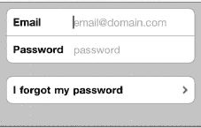

**提示：**记住你可以将应用移入文件夹。正如你在图 12–7 中看到的，我们将三个音乐应用（包括`Pandora`）放入了一个名为“Music”的文件夹中。有关使用文件夹的更多信息，请参见第 6 章：“图标和文件夹”。

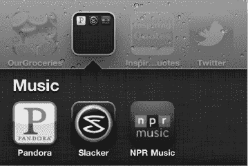

**图 12–7.** *将类似的音乐应用（如 Pandora）放入一个文件夹以便快速检索。*

## Pandora 的主屏幕

你的电台列表显示在屏幕上，其中`QuickMix`位于顶部。轻触任意电台，它就会开始播放。通常，第一首歌来自你选择的艺术家本人，接下来的歌曲则来自相似的艺术家。

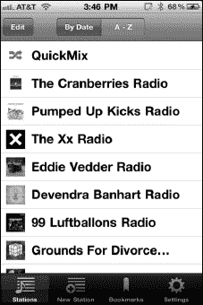

一旦你选择了电台，音乐就开始播放。你会看到当前歌曲显示，以及专辑封面——就像你使用`Music`应用播放歌曲时一样。

你还会在右上角看到一个小型的`Now Playing`图标——与`Music`应用中的`Now Playing`图标非常相似。

轻触右上角的`Detail`视图图标（就像你在`Music`应用中看到的那样），你会看到艺术家的一段精彩简介，该简介会随着每首新歌而变化。（参见图 12–8）

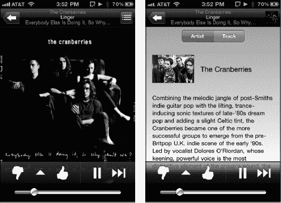

**图 12–8.** *Pandora 的专辑封面视图和详情视图。*

## Pandora 中的“赞”或“踩”

如果你喜欢某首特定歌曲，请轻触大拇指图标，之后你会听到更多来自该艺术家的音乐。

相反，如果你不喜欢该电台的某位艺术家，请轻触大拇指朝下的图标，之后你将不会再听到那位艺术家的音乐。

如果你愿意，你可以暂停一首歌稍后再回来听，或跳过当前电台的下一个曲目。

**注意：**使用免费的 Pandora 账户，你每小时可以跳过的次数是有限的。此外，你偶尔会听到广告。要摆脱这些烦恼，你可以升级到付费的“Pandora One”账户，如下所示。

## Pandora 的菜单

在两个大拇指图标之间是一个`Menu`按钮，看起来像一个三角形。轻触它，你可以收藏艺术家或歌曲，前往 iTunes 购买该艺术家的音乐，或通过电子邮件将电台发送给`Contacts`中的某个人。

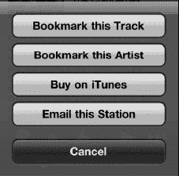

#### 在 Pandora 中创建新电台

创建新电台再简单不过了。

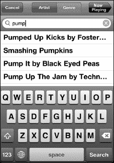

如果你正在收听某个电台，请按下左上角的**返回箭头**返回 Pandora 主屏幕。然后点击底部一行的**新电台**按钮。输入一位艺术家、一首歌曲或一位作曲家的名称。

找到你想找的内容后，点击该选项，Pandora 便会立即开始围绕你的选择构建一个电台。

你也可以点击**流派**，围绕一种特定的音乐流派构建电台。

随后你会看到新电台与你的其他电台一起列出。

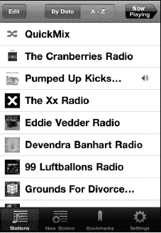

你可以在 Pandora 中创建多达 100 个电台。

**提示：**你可以通过点击屏幕顶部的**按日期**或**按字母表**按钮来整理你的电台。

#### 调整 Pandora 的设置——你的账户、升级等

你可以通过点击屏幕右下角的设置图标退出你的 Pandora 账户、调整音质，甚至升级到 Pandora One（可去除广告）。（请参见图 12–9。）

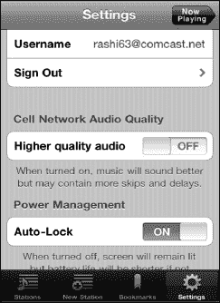

**图 12–9.** *Pandora 中的设置选项*

要退出登录，请点击**退出**按钮。

要调整音质，请将**蜂窝网络音频质量**下方的开关移至**开启**或**关闭**。当你在蜂窝网络环境下时，将此设置为关闭可能更好，否则你可能会在播放中听到更多跳转和暂停。

当你处于稳定的 Wi-Fi 连接时，可以将其设置为**开启**以获得更好的音质。请参阅我们的第 4 章：“连接网络”一章，了解更多关于各种连接的信息。

为了节省电池电量，你应将**自动锁定**设置为**开启**，这是默认设置。如果你希望强制屏幕保持亮起，则将其切换至**关闭**。

要去除所有广告，请点击**升级到 Pandora One**按钮。一个网页浏览器窗口将打开，你将被引导至 Pandora 网站输入你的信用卡信息。在本书出版时，年度账户费用为 36.00 美元，但当你读到本书时，价格可能已有所不同。

## iBooks 与电子书

在本章中，我们将向你展示如何将你的 iPhone 用于获得良好的阅读体验——如果你能接受稍小的屏幕。例如，我们将介绍 iBooks，包括如何购买和下载它们，以及如何找到一些优质的免费经典书籍。我们还将向你展示其他使用 iPhone 上的第三方**Kindle** 和 **Kobo**（原名 **shortcovers**）阅读器的电子书阅读选项。

iPhone 可以使用苹果公司专有的电子书阅读器 **iBooks**。在本章中，我们将向你展示如何下载 **iBooks** 应用，如何在 iBooksStore 中选购书籍，以及如何阅读 PDF 文件（Adobe PDF 格式）和 iBooks，并充分利用所有 **iBooks** 功能。

借助 **iBooks**，你可以以前所未有的方式与书籍和 PDF 文件互动。翻页如同真实书籍；你可以调整字体大小、在内置词典中查词，以及搜索文本。

在 App Store 中，你还可以找到亚马逊 **Kindle** 阅读器、**Barnes and Noble** 阅读器、**stanza** 阅读器和 **Kobo** 阅读器的应用。**Kindle** 和 **Kobo** 阅读器在 iPhone 上均能提供出色的阅读体验。

### 下载 iBooks

在 App Store 中搜索“iBooks”或“Apple”。你会在所列选项中看到 **iBooks** 应用。

**注意：**在一部全新的 iPhone 上，你应该会收到一条通知询问：“你想立即下载 iBooks 吗？”

如果你没有立即看到这条通知，请点击 **App Store** 应用，该通知应该会弹出。

选择 **iBooks** 应用，然后点击**免费**按钮进行下载。

选择**安装**，**iBooks** 将被下载并安装在 iPhone 上。

### iBooks 商店

在你开始享受阅读体验之前，你需要用图书充实你的 iBooks 书库。幸运的是，许多书籍可以在 iBooks 商店免费找到，包括几乎完整的古腾堡经典及公共领域作品集。

**注意：**付费的 iBooks 内容并非在所有国家/地区都可用。然而，免费内容在各地都可获取，包括古腾堡计划的经典公共领域文学作品。

只需点击你书架右上角的**商店**按钮，你将被带到 iBooks 商店。

iBooksStore 的布局与 App Store 非常相似。左上方有一个**类别**按钮，与**书库**按钮相对。点击它可查看所有可用类别，你可以从中选择书籍。

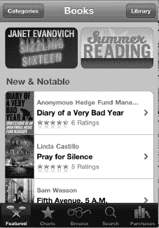

精选图书在商店主页上突出显示，并配有**新书**和**值得关注**的标题供浏览。

商店底部有五个软键：**精选**、**排行榜**、**浏览**、**搜索**和**已购项目**。

点击**排行榜**按钮  可查看所有顶级排行榜和《纽约时报》畅销书。点击**已购项目**按钮可查看你已购买或下载到书库中的所有书籍。

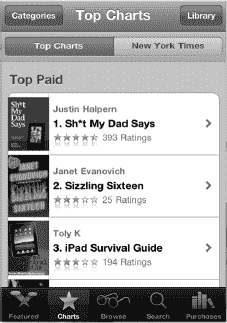

购买一本书与购买一款应用非常相似。点击你感兴趣的图书标题，浏览其描述和读者评论。当你准备购买该图书时，点击**价格**按钮。

**注意：**许多图书提供试读下载。如果你不确定是否要购买该书，查看试读内容是个好主意。如果你下载了试读内容，你随时可以从该试读中购买完整图书。

一旦你决定下载试读内容或购买一个图书，**iBooks** 会切换到**书架**视图，你可以看到该书被放入你的书架。现在你的书就可以阅读了。

#### 使用搜索按钮

与 iTunes 和 App Store 一样，iBooksStore 为你提供了一个**搜索**窗口，你可以在其中输入几乎任何短语。你可以搜索作者、书名或系列。只需点击屏幕底部的**搜索**，屏幕键盘便会弹出。输入作者、书名、系列或图书类别，然后按**搜索**按钮。

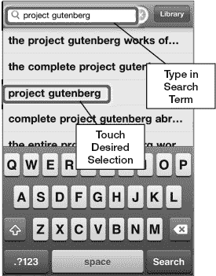

你会看到与你搜索相匹配的建议弹出；只需点击相应的建议即可跳转到该图书。

**提示：**搜索“古腾堡计划”（Project Gutenberg）可查看数千本免费的公共领域图书。

### 切换合集（图书、PDF 等）

你的 iBooks 应用包含多个图书或 PDF 文件（Adobe PDF 格式阅读器）的合集。

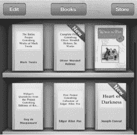

你可以通过点击书库顶部中央的合集按钮，轻松在这两个合集之间切换，并添加新合集。

此按钮会显示当前可见的合集。在此图中，**图书**是当前合集。点击“图书”按钮可查看可用的合集。

在此屏幕上，你可以点击任意合集来查看它。

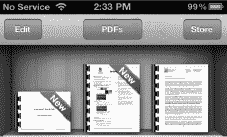

请注意，你还可以使用底部的按钮创建**新**合集和**编辑**你已创建的合集。

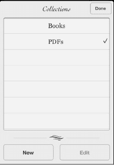

### 阅读 PDF

如上所示，切换合集以查看你的 PDF 合集。

点击任意书本将其打开并开始阅读。所有在“阅读 iBooks”部分中描述的导航功能同样适用。

一个不同之处在于，你会在页面底部看到 PDF 文件的页面缩略图。点击任意缩略图即可跳转到该页。沿着缩略图前后拖动手指可跳转到特定页面。

### 阅读 iBooks

轻触资料库中的任意标题即可打开阅读。书籍会从第一页打开，通常这一页是扉页或其他称为*前辅文*的内容。

在左上角，紧邻`资料库`按钮旁，你可以看到一个`目录`按钮。要跳转到目录，可以轻触`目录`按钮，或者直接翻页到目录处。

你可以通过三种方式翻页。首先，轻触页面的右侧可以翻到下一页。其次，可以缓慢地长按页面右边缘，在持续触摸屏幕的同时，轻柔缓慢地将手指向左滑动。

**提示**：如果你非常缓慢地移动手指，就能在“翻动”页面时看到背面的文字——这是一种非常酷的视觉效果。

#### 自定义阅读体验：亮度、字体和字号

在书籍上方中央区域，有三个可用图标：`亮度`、`字号`和`搜索`。这些选项有助于让你的阅读体验更加沉浸。

轻触`亮度`图标，你可以调节书籍的亮度。

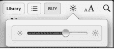

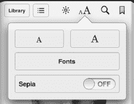

如果你在一个非常昏暗的房间里躺在床上阅读，你可能希望将`亮度`滑块向左滑到底来调暗屏幕。如果你在阳光下阅读，则可能需要将滑块向右滑到底。但请记住，高屏幕亮度比大多数其他功能更耗电，因此在不需要屏幕那么亮时，请将此功能调回较低亮度。

**注意**：上述提示仅调节`iBooks`内的亮度。要调节 iPhone 的全局亮度，请使用`设置`应用（前往`设置`图标 > `亮度与墙纸`）。

`字号与字体`图标让你可以根据偏好调整字体数值。

**增大字号**的操作方法：
多次轻触大写的`A`图标。

**减小字号**的操作方法：
多次轻触小写的`a`图标。

在本书撰写时，共有六种可用字体样式——但当你阅读此书时，可能会有更多字体可供选择。

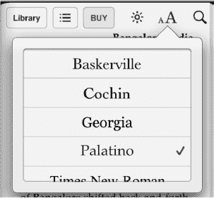

试试看，体验不同的字体。默认选择是 Palatino 字体，但所有字体看起来都很棒，更大字号对某些人来说会有所不同。目标是调整字号，使文本尽可能舒适易读。

#### 使用内置词典扩充词汇量

`iBooks`包含一个非常强大的内置词典，当你遇到生僻或不熟悉的单词时，它会非常有用。

**注意**：首次尝试使用词典时，你的 iPhone 需要下载它。请按照屏幕上的提示下载词典。

访问词典再简单不过了。只需长按书中的任意单词。一个弹出窗口会出现，提供多种选项，让你可以高亮单词、创建笔记或搜索该单词的其他出现位置。

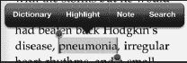

轻触`词典`，该单词的发音和释义就会显示出来。轻触`完成`即可退出词典并返回书籍。

#### 设置页内书签

有时你可能想设置一个文本内的书签以便日后参考。

右上角显示了一个`书签`图标。轻触`书签`图标，该页面上的图标会变为红色书签。

要查看书签，只需轻触屏幕左上角的`目录`图标（紧邻`资料库`图标），然后轻触`书签`。轻触高亮显示的书签，你就会跳转到书中的相应部分。

**提示**：你无需在每次离开`iBooks`时都设置书签。该应用会自动记住你在某本书中停止阅读的位置。无论你打开并阅读了多少本书，这一点都适用，因此你总是能准确地返回到某本书中停止阅读的地方。`iBooks`应用还会与 iPad 上的`iBooks`版本同步，这样你可以在不同设备间切换，并保持在某本书中的阅读位置。

#### 使用高亮和笔记

`iBooks`应用中有一些非常棒的“附加功能”。例如，有时你可能想高亮某个特定单词以便日后回顾。还有时候，你可能想在页边给自己留个笔记。

在`iBooks`中，这两件事都非常容易做到。

##### 高亮文本

按照以下步骤在`iBooks`应用中高亮文本：

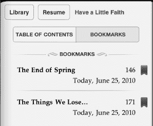

1.  长按任意单词以调出菜单选项。
2.  从菜单中选择`高亮`。
3.  要移除高亮，轻触该单词，然后选择`移除高亮`。

更改高亮颜色只需按照以下步骤操作：

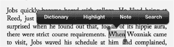

1.  轻触高亮显示的单词。
2.  从菜单中选择`颜色`。
3.  选择一种新颜色。

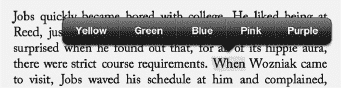

##### 添加笔记

在`iBooks`的页边添加笔记同样简单：

1.  像之前一样，长按任意单词。
2.  从菜单中选择`笔记`。
3.  输入你的笔记，然后轻触`完成`。笔记现在会出现在页边（参见图 13-1）。

**提示**：你的笔记也会出现在标题页的书签下方。只需轻触`标题页`按钮，然后轻触`书签`。你可以在页面底部找到你写的笔记。

你可以像更改高亮颜色一样更改笔记的颜色！

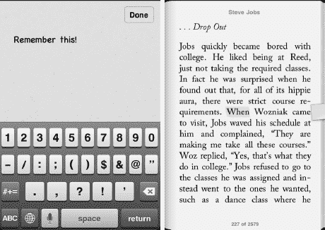

**图 13-1.** *在`iBooks`中使用笔记功能*

#### 使用搜索

`iBooks`内置了强大的搜索功能。只需轻触`搜索`图标，内置键盘就会弹出（与 iPhone 上的其他程序一样）。输入你要搜索的单词或短语，你会看到包含该单词的章节列表。

只需轻触所选内容，你就会跳转到书中的相应部分。你还可以通过轻触`搜索`窗口底部的相应按钮，直接跳转到 Google 或维基百科进行搜索。

**注意**：使用维基百科或 Google 搜索会使你离开`iBooks`并启动`safari`。

### 移动和删除书籍

从 iBooks 资料库中删除书籍与从 iPhone 上删除应用非常相似。你可以通过轻触`资料库`视图中的`编辑`按钮来删除或移动 iBooks。

左上角。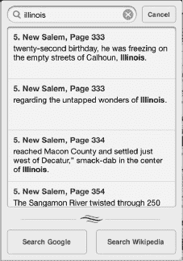

一旦你轻触`编辑`按钮，你会注意到每本书的左上角出现了一个小的黑色“**x**”。

只需轻触“**x**”，系统就会提示你删除这本书。一旦你轻触`删除`，该书就会从书架上消失。

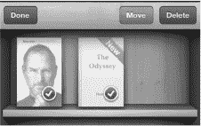

### 其他电子书阅读器：Kindle 和 Kobo

正如我们所指出的，`iBooks` 应用提供了无与伦比的电子书阅读体验。不过，iPhone 上还有其他值得一试的电子书阅读器应用。

许多用户已经拥有 Kindle 并投资建立了自己的 Kindle 书库。另一些用户则使用 `Kobo` 电子阅读器软件（原名为 `shortcovers`），并为其平台购买了书籍。

幸运的是，这两个电子书平台在 iPhone 的 App Store 中都有对应的应用。下载并安装任一程序后，您就可以登录并在 iPhone 上阅读该平台上的完整书库。

**注意**：无论您选择这些其他电子阅读器中的哪一个，您都可以直接“登录”，查看您的完整书库，并从上次阅读的书籍中断处继续阅读——即使您是在其他设备上开始阅读的。

## 下载电子阅读器应用

下载其他电子阅读器应用非常简单。只需前往 App Store，点击`类别`，然后点击`图书`。在此版块中，您会找到`Kindle`和`Kobo`应用。这两款应用都是免费的，只需点击`免费`按钮即可开始下载其中一款。

**提示**：如果您知道自己要找哪个应用，通常按名称搜索会更快。

安装好所需的电子阅读器软件后，点击该应用的图标即可启动它。

## Kindle 阅读器

亚马逊的 Kindle 阅读器是世界上最受欢迎的电子阅读器。数百万人拥有 Kindle 书籍，而`Kindle`应用让您可以在 iPhone 上阅读这些书籍。

iPhone 和 iPad 版本的`Kindle`应用刚刚进行了更新，支持音频和视频，这使得这些版本甚至比 Kindle 硬件本身的功能更加强大。

**提示**：如果您使用 Kindle 设备，不必担心从 iPhone 登录的问题。您可以将多个设备关联到同一个账户。您可以在 iPhone 的`Kindle`应用上尽情享受为 Kindle 购买的所有书籍。

要在 iPhone 上使用`Kindle`应用，只需点击其图标，然后登录您的 Kindle 账户，或使用用户名和密码创建一个新账户。

登录后，您会在`主页`上看到您的 Kindle 书籍。点击一本书即可开始阅读。

**注意**：若要购买或下载新书，您需要前往`safari`网页浏览器中的`www.amazon.com`。一旦您为新账户购买或下载了新书，它就会出现在`Kindle`应用中。

要阅读 Kindle 书籍，请点击其封面，书就会打开。

要查看阅读选项，只需轻触屏幕，选项便会显示在底部的一行图标中。

您可以通过点击`加号`（`+`）按钮添加书签。书签设置好后，`加号`（`+`）按钮会变成`减号`（`-`）按钮。

您可以通过点击`书籍`按钮，跳转到封面、目录或书籍开头（或指定书中的任何其他位置）。

字体以及页面颜色都可以调整。一个非常有趣的功能是能够将页面更改为`黑色`——这在夜间阅读时非常棒。

要向前翻页，可以从右向左滑动，或点击页面的右侧。要向后翻页，可以从左向右滑动，或点击页面的左侧。

轻点屏幕，底部会出现一个滑块；您可以移动它跳转到书中的任何一页。

要返回您的书籍列表，只需点击`主页`按钮。

## Kobo 阅读器

与`Kindle`阅读器类似，`Kobo`阅读器首先要求您登录现有的 Kobo Books 账户。之后，您所有的现有 Kobo Books 都可以阅读了。

Kobo 的`书架`视图使用了一种类似书架的隐喻，与`iBooks`使用的相似。点击您想要打开的书籍封面。

或者，您可以点击`列表`选项卡，以`列表`视图查看整理好的书籍。

打开任意一本书，您会在 Kobo 阅读器的顶部看到两个按钮：`我正在阅读`和`设置`。

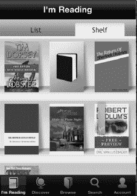

点击`我正在阅读`按钮会在您上次阅读中断处放置一个书签，并将屏幕返回到您的`书架`视图。

点击`设置`按钮会在屏幕底部显示一系列按钮，用于查看书签、查看书籍信息，以及调整页面过渡样式和字体。在这些按钮下方是四个图标：`字体`、`亮度`、`屏幕锁定`和`夜间阅读`。点击其中任一按钮即可调整您的阅读设置。

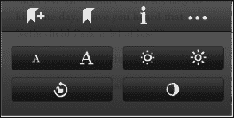

在`Kobo`阅读器中，点击页面右侧可以向前翻页。点击页面左侧则能向后翻页。您也可以使用底部的滑块来翻页。

