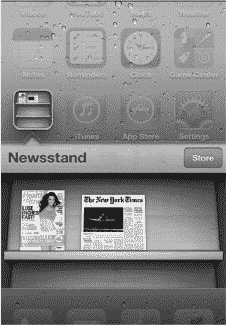
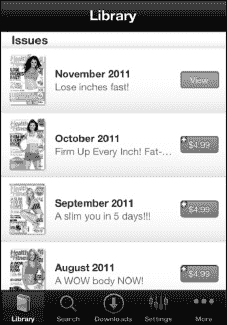
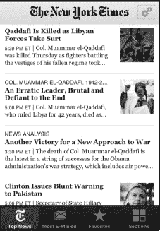
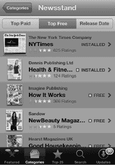
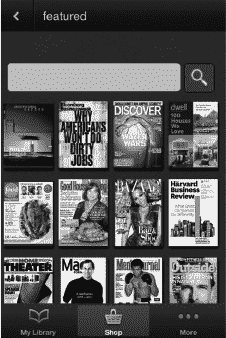
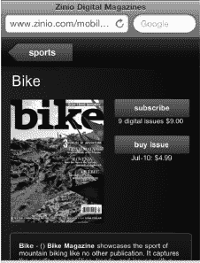
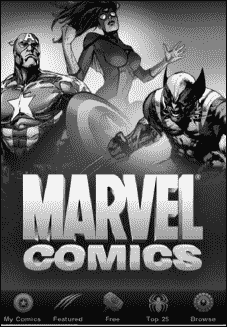
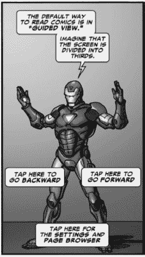
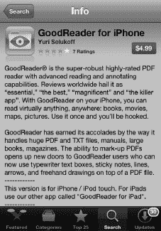
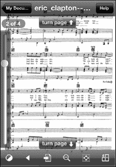

# 第 14 章

## 书报摊及其他

在上一章中，我们讨论了 iPhone 如何通过 iBooks 彻底改变了阅读世界。iPhone 不仅无与伦比地适合阅读电子书，其“书报摊”文件夹在处理在线报纸和杂志等新媒体方面也无可匹敌。此外，App Store 让您能轻松找到漫画书阅读器、PDF 阅读器等应用。iPhone 甚至准备通过外观精美且交互性极佳的漫画书来振兴漫画产业。

在本章中，我们将探讨如何利用 iPhone 鲜艳的屏幕和出色的触控界面来享受新媒体。

### 书报摊

“书报摊”是您 iPhone 主屏幕上的一个特殊文件夹，外观像一个书架，用于收集和整理您所有的杂志和报纸应用。这个文件夹的行为与普通的 iPhone 文件夹不同。如果某个杂志或报纸应用支持书报摊，那么它会在书架上显示该期刊的最新封面或头版，而不是书报摊文件夹图标（您在快速应用切换器中也会看到这个封面或头版）。

如果该杂志或报纸应用提供订阅服务，而您是订阅者，那么书报摊应用还可以在夜间自动下载最新期刊，这样您早上打开时就有新的内容可以阅读。

书报摊文件夹还有一个`商店`按钮，点击后会进入 App Store 的一个特殊版块。该版块列出了所有当前支持书报摊的杂志和报纸应用。

除了特殊的展示方式和自动下载新期刊的功能外，书报摊应用的其他功能与任何其他应用无异。

**注意**：是否添加书报摊支持取决于每个杂志和报纸应用。在撰写本文时，许多（但并非全部）杂志应用已添加书报摊支持。如果某个应用不支持书报摊，它将会下载到`主屏幕`上，行为与任何普通的、非书报摊应用一样。

此外，杂志和报纸的选择可能因国家/地区而异。使用书报摊中的`商店`按钮可以查看您所在地区的最新选择。

#### 购买与订阅报刊

`书报摊`中的报纸和杂志应用通常是免费的，但通常内置内容极少甚至完全没有。要获取内容，你需要购买单期或订阅多期。

购买单期的方式与其他应用内购买类似。通常，你会看到最近各期杂志的列表，左侧是封面图，右侧是内容简介和价格。点击价格后，系统会要求输入 iTunes 密码以确认购买。确认购买后，该期内容将开始下载。

订阅报纸和杂志则是一种特殊的应用内购买，它会在指定时间内持续有效。例如，你通常可以以固定价格购买一年的报纸。有些报纸和杂志提供不同的订阅时长选项，如三年、半年等。有些还提供包含印刷版和数字版的套餐。请务必仔细阅读你的选项，找出对你来说价值最高的那一款。

你可能会想，如果你已经购买了订阅或单期内容，但需要重新安装显示内容的应用程序，该怎么办。如果发生这种情况，你只需重新安装应用程序，然后恢复你的订阅或重新下载之前购买过的任何单期即可。换句话说，在`书报摊`应用中恢复内容的过程，与恢复其他应用内购买内容的过程完全相同。

### 报纸

还记得报纸被送到家里的日子吗？人行道上只要有一个水坑，报纸必定落在那里！你从塑料袋里取出报纸，抖掉水珠，然后努力辨认被浸湿的那一版上写了什么。

好吧，那样的日子可能一去不复返了。现在，你有了与新闻互动的新机会，甚至每天都能收到报纸——不过是送到你的 iPhone 上，而不是家门口的车道上。

许多报纸和新闻网站正在为 iPhone 开发应用程序，似乎每天都有新的应用出现。其中一些应用提供一定程度的免费内容，但要求你创建账户或订阅才能获取更多内容。其他应用则只提供付费订阅内容。

**注意：** 如果你已经订阅了本地报纸的印刷版，你可能可以享受打折甚至免费使用其 iPhone 应用的特权。请务必仔细阅读任何注册或订阅优惠条款，以确认你是否符合条件。

许多报纸也有专门的网站。有些针对 iPhone 和 `Safari` 进行了优化，而另一些则提供完整的网页体验。有些网站需要注册或付费订阅才能查看报纸的全部内容。

让我们快速浏览一下美国最大的报纸之一 `纽约时报`，看看这家报纸是如何革新在 iPhone 上阅读新闻的体验的。

#### 纽约时报应用

`纽约时报` 提供各种免费和付费的应用程序，让您在 iPhone 上获取新闻。

`纽约时报` 在其免费的 iPhone 应用中提供了报纸的精简版本。

页面底部有四个软键：`头条新闻`、`最多电邮`、`收藏` 和 `板块`。每个板块都收录了当天报纸中该板块的部分报道。

点击 `板块` 会显示 `纽约时报` 所有板块的标签页。

浏览 `纽约时报》应用非常简单，只需点击一篇文章并滚动阅读即可。阅读文章时，只需点击屏幕中央，顶部和底部的软键就会显示出来。

要返回`主页`，请点击左上角的`最新新闻`按钮。

**注意：** 如果你在另一个板块——比如 `科技`——那么左上角的按钮会显示为 `科技`。

如需通过电子邮件发送一篇文章，只需点击左下角的`分享`图标。此按钮仅在阅读文章时可用，在`主页`上不可用。

点击该图标，你可以通过电子邮件发送文章、复制链接或通过 Twitter 分享。

#### 浏览与享受内容

当你试用不同的报纸应用时，你会逐渐意识到，浏览报纸内容并没有真正的标准。这意味着你需要熟悉每个应用自身的文章导航方式，以及如何返回主屏幕。以下是浏览这类应用的一般性简短指南：

- **显示或隐藏控制按钮或说明：** 通常，点击一次屏幕会显示隐藏的控制按钮或图片说明。你可以再次点击屏幕重新隐藏这些元素。
- **查看文章详情：** 通常，你像浏览网页一样进行滚动。
- **观看视频：** 通常，只需点击视频即可开始播放。请参阅第 15 章：“观看视频”，了解如何在 iPhone 上浏览视频。
- **放大视频或图片：** 你可以尝试在视频或图片上使用双指张开手势，然后双击。你也可以寻找`展开`按钮，或者尝试旋转到横屏模式。
- **缩小视频或图片：** 你可以尝试在视频或图片上使用双指捏合手势来缩小视频尺寸。你也可以寻找`关闭`或`最小化`按钮，或者尝试旋转回竖屏模式。
- **分享文章：** 通过电子邮件发送文章链接——或通过 Twitter、Facebook 或 LinkedIn 等社交网络分享——是一项常见功能。请寻找`操作`或`分享`按钮。
- **调整字体大小：** 许多报纸应用都有按钮或设置选项，用于增大或减小默认字体大小，使内容更易于阅读。

### 杂志

过去几年，报纸和杂志的读者数量都在下降，这已不是什么秘密。iPhone 提供了一种全新的杂志阅读方式，这或许正是该行业所需的推动力。

在 iPhone 上阅读杂志，图片异常清晰亮丽。导航通常很方便，故事仿佛活灵活现，远比印刷版生动。再加上视频和音频的无缝集成，你能真切地感受到 iPhone 如何提升了杂志阅读体验。

一些杂志，如 `时代周刊`，包含指向实时或频繁更新内容的链接。这些链接可能被称为 `新闻推送`、`直播版` 或 `更新`。在你购买的任何杂志中请留意它们——这些链接将帮助你获取最新信息。

**提示：** 在购买杂志或其他应用之前，务必查看其用户评价。这样做可能会为你省下一些钱或免去烦恼！

App Store 中有几种不同类型的杂志应用。首先，有些应用让你可以购买单本杂志或免费阅读某一杂志的有限内容。其次，还有一些杂志阅读器，提供多种杂志的样本；你可以通过这些应用订阅某本杂志的每周或每月递送。

如果你在 `App Store` 中通过 `类别` > `书报摊` 浏览，然后点击顶部的`热门免费`，就可以查看所有免费的杂志和报纸。

#### Zinio 杂志应用——初体验

`Zinio` 应用采取了独特的方式。这款应用在 App Store 中是免费的，它让你能够订阅数百种杂志。在 `Zinio` 中阅读杂志只需几个简单步骤：

1. 登录 `Zinio` 应用（你可以创建一个免费账户）。
2. 在`我的资料库`板块查看并下载免费样本，或点击底部的`购物`按钮购买杂志。
3. 有些杂志可能会提供完整的免费期号。只需查看`我的资料库`板块，看看有哪些可用的内容。

有很多热门杂志供你选择。其分类涵盖了从艺术到体育等方方面面。价格各有不同，但通常你可以选择购买单期或订阅全年。

例如，最新一期的`大众机械`在`Zinio`上售价为 1.99 美元，而全年订阅价格为 7.99 美元。

有些订阅非常划算。在撰写本文时，一期`单车杂志`的单期售价为 4.99 美元，而全年订阅仅需 9.00 美元。

进一步查看后发现，在撰写本文时，你可以订阅超过 16 种自行车杂志。

### 漫画书

随着 iPhone 的出现，一种有望复兴的"新媒体"类型是漫画书。iPhone 凭借其高清屏幕和强大的处理器，让漫画书的页面栩栩如生。

目前已有几款漫画书应用可供使用，其中包括来自著名的漫威漫画公司的应用。DC 漫画公司也刚刚推出了自己的应用。这款应用与制作漫威应用的是同一批人。

要在 App Store 中找到`漫威漫画`应用，请前往`分类`，然后选择`图书`。这款应用是免费的，你可以从应用内部购买漫画书。

在`主页`屏幕的底部，你会看到五个按钮：`我的漫画`、`精选`、`免费`、`前 25 名`和`浏览`。你购买的内容将出现在`我的漫画`标题下。

App Store 让你有机会下载免费的漫画以及正在出售的单期漫画。大多数单期售价为每期 1.99 美元。

每个选项卡都会带你进入一个新的漫画列表进行浏览，这与 iTunes 商店非常相似。

触摸`浏览`按钮，即可按`系列`、`创作者`、`类型`、`评级`、`故事线/情节弧`或`发布日期`进行浏览。或者你也可以输入搜索词来查找特定的漫画。

你可以通过两种方式阅读漫画书。第一种，你可以滑动翻页，一页一页地阅读。第二种，你可以双击一个画面格以`放大`，然后点击屏幕前进到连环漫画中的下一个画面格。之后，你只需从右向左滑动即可前进到下一帧；或者，如果你想后退，就从左向右滑动。

要返回`主页`屏幕或查看屏幕上的选项，只需点击屏幕中央。你会在左上角看到一个`设置`按钮。点击它，你可以`跳转到首页`、`浏览到特定页面`或进入`设置`菜单。

**注意：** 这款应用的开发商 `ComiXology` 也制作了包含漫威漫画的应用，以及其他许多应用，包括 DC、阿奇、映像和 Top Cow 的漫画。

### 将 iPhone 用作 PDF 阅读器

有几款程序可以将 iPhone 变成一个非常强大的 PDF 浏览程序。例如，你也可以在 `iBooks` 应用中阅读 PDF 文件。然而，另一款出色的 PDF 阅读器叫做 `GoodReader for iPhone`。

**注意：** 第 17 章："使用电子邮件通信"向你展示了如何打开附件，包括 PDF 文件。`GoodReader` 应用的一大优点是它允许你使用 Wi-Fi 传输大型 PDF 文件。

你可以在 App Store 的`效率`分类中找到 `GoodReader for iPhone` 应用。在撰写本文时，这款应用售价为 4.99 美元。

**注意：** `iBooks` 也可以阅读作为邮件附件发送的 PDF 文件。如果已安装 `iBooks`，只需在打开 PDF 时选择`在 iBooks 中打开`。

#### 将文件传输到你的 iPhone

`GoodReader for iPhone` 应用的一大优点是，你可以使用它将大型文件从 Mac 或 PC 无线传输到 iPhone，以便在 `GoodReader` 应用中查看。你也可以使用 `GoodReader` 在 iTunes 中进行文档共享，如第 3 章："与 iCloud、iTunes 等同步"中所述。请按照以下步骤使用 `GoodReader` 传输文件：

1. 触摸屏幕左下角的小`Wi-Fi`图标， 将弹出`Wi-Fi 传输工具`。系统会提示你在浏览器中输入一个 IP 地址，如果你使用 `Bonjour` 服务，则输入一个 Bonjour 地址。
2. 将 `GoodReader` 窗口中显示的地址输入到你电脑的网络浏览器中。现在你可以让你的电脑充当服务器。你会看到你的电脑和 iPhone 现已连接。你可以在浏览器中为此页面添加书签，但请注意，如果你重启无线网络路由器并且你的 iPhone 获取到不同的无线网络地址，该地址可能会发生变化。
3. 点击电脑网络浏览器中的`选择文件`按钮，找到要上传到 iPhone 的文件。
4. 选择文件后，点击`上传所选文件`，该文件将自动传输到你的 iPhone。

这有什么用处呢？例如，对于其中一位作者（Gary）来说，iPhone 已经成为了一个存储超过 100 份钢琴乐谱的仓库。这意味着不再需要下载 PDF 文件、打印出来、装进活页夹，然后试图记住哪首曲子放在哪个活页夹里了。现在，他所有的音乐都编录在 iPhone 上。他只需把 iPhone 放在钢琴上，就能在一个地方访问他所有的音乐。

**注意：** `Good Reader` 甚至可以解压你作为邮件附件收到的文件。

浏览 `GoodReader` PDF 阅读器非常容易。这款应用比其他应用更灵敏，因此快速点击屏幕中央即可调出屏幕控制选项。然后你可以前往你的资料库，或触摸`翻页`图标来翻页。

在页面间移动最简单的方法是触摸屏幕右下角前进一页，或触摸屏幕左上角后退一页。用不了多久，这就会变得非常自然。

你也可以向上或向下轻扫来翻页。

要转到另一个 PDF 文件或另一份乐谱，只需快速点击 iPhone 屏幕中央，然后点击左上角的`我的文档`按钮。

#### 使用 GoodReader 连接到 Google Docs 和其他服务器

你也可以使用 `GoodReader` 连接到 `Google Docs` 和其他服务器。请按照以下步骤操作：

1. 在`网页下载`选项卡中，选择`连接到服务器`。
2. 选择 `Google Docs`。（你可以选择多种不同的服务器：邮件服务器、MobileMe iDisk、公共 iDisk、Dropbox、box.net、FilesAnywhere.com、MyDisk.se、WebDAV 服务器和 FTP 服务器。）
3. 输入你的 `Google Docs` 用户名和密码进行登录。
4. 连接成功后，一个新的`Google Docs 服务器`图标将出现在页面右侧的`连接到服务器`选项卡下方。
5. 点击新的`Google`选项卡以连接到服务器（需要网络连接）。
6. 现在你将看到你存储在 `Google Docs` 上的所有文档列表。点击任一文档并选择文件类型进行下载。通常，PDF 格式在此操作中效果很好。（Google Docs 可以执行`另存为…`操作，而且 PDF 文件更易于处理。）

文件下载完成后，它将出现在 `GoodReader` 的左侧；只需触摸它即可打开。

