# 第 15 章

## 观看视频

iPhone 为你提供了一个绝佳的平台来欣赏视频、电视节目和电影。这一点在众多可用的视频观看应用中表现得淋漓尽致。

在本章中，我们将向你展示如何在 iPhone 上观看电影、电视节目、播客和音乐视频。

你可以从 iTunes Store 或 iTunes U 免费购买或下载许多视频。你也可以将你的 iPhone 关联到你的 Netflix 账户（并且很快可能关联其他视频租赁服务），从而能够观看流媒体电视节目和电影。

借助你的 iPhone，你还可以在 `Safari` 浏览器中，以及通过 App Store 中的各种应用，观看 YouTube 视频和网页视频。

**注意：** 在本书出版时，`Netflix` 应用仅在美国和加拿大可用。我们希望类似的应用能够进入更广泛的国际市场。

### 将 iPhone 用作视频播放器

iPhone 不仅仅是一款出色的音乐播放器；它还是一个绝佳的视频播放系统。其宽屏设计、高速处理器、令人惊叹的像素密度以及出色的操作系统，使得观看从音乐视频到电视剧和全长度电影的各类内容都成为一种真正的享受。iPhone 的尺寸非常适合你靠在椅子上观看，或在飞机上使用。对于长途汽车旅行中后排座位上的孩子来说，它也很棒。近 10 小时的电池续航意味着你甚至可以乘坐跨大陆航班而不用担心电量耗尽！你还可以为你的汽车购买一个“电源逆变器”，让 iPhone 的充电时间更长（请参阅第 1 章的“为 iPhone 充电及电池使用提示”部分：“入门指南”）。

#### 将视频加载到 iPhone 上

你可以像加载音乐一样，通过电脑上的 `iTunes` 应用或直接在 iPhone 上的 `iTunes` 应用中将视频加载到 iPhone 上。

如果你在电脑上从 `iTunes` 购买或租借了视频，那么你可以手动或自动将这些视频同步到你的 iPhone 上。

#### 在 iPhone 上观看视频

要观看视频，只需轻点你的 `Videos` 应用。

**注意：** 你也可以从 `YouTube` 应用、`Safari` 应用以及从 App Store 加载的其他视频相关应用中观看视频。

#### 视频类别

在 `iPod` 应用中的 `Video` 标签页下，`Videos` 应用的每个部分都由水平条分隔，水平条内包含一个或多个可能的类别名称：`Movies`、`TV Shows`、`Podcasts` 和 `Music Videos`。第一个类别是 `Movies` 部分；如果你已将电影加载到 iPhone 上，这些电影将会显示。

根据你加载到 iPhone 上的视频类型，你可能会看到更多或更少的类别。如果你只有 `Movies` 和 `iTunes U` 视频，那么你只会看到这两个类别按钮。只需向上或向下滚动，即可显示该类别中对应的视频。

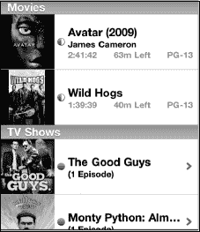

#### 搜索视频

如果你的 iPhone 上加载了大量视频和其他内容，并且想要查找某个特定视频，你可以按照以下步骤操作：

1.  轻点屏幕最顶部的时间，即可跳转到搜索框。

    

2.  输入视频标题的几个字母或一两个词。
3.  在此示例中，我们输入了“email”来查找与在 iPhone 上使用电子邮件相关的视频。随即弹出了一个视频教程，演示如何处理来自作者某个网站的电子邮件附件：[www.MadeSimpleLearining.com](http://www.MadeSimpleLearining.com)。
4.  轻点搜索结果显示的任何视频即可开始播放。

    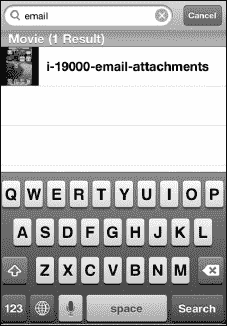

## 播放电影

只需轻点你想观看的电影，它便会开始播放。大多数视频会利用 iPhone 相对较大的屏幕空间，以宽屏（即横向）模式播放。只需将 iPhone 侧放即可观看。

视频会自动开始播放。刚开始播放时，屏幕上除了视频外，没有任何菜单、控件或其他内容。

你可以轻点屏幕任意位置，使控制栏和其他选项显示出来。`Videos` 应用中的大多数选项与 `Music` 应用中的非常相似。轻点 `Play/Pause` 按钮，视频将暂停。再次轻点 `Play`/`Pause` 按钮，视频将恢复播放。

### 快进或快退视频

在 `Play/Pause` 按钮的两侧，是常规的 `Fast-Forward` 和 `Rewind` 按钮。要跳转到视频中特定的下一章节部分，只需按住 `Fast-Forward` 按钮（位于 `Play/Pause` 右侧）。当到达所需位置时，松开按钮，视频将正常开始播放。

按下 `Pause` 暂停视频后，你可以按住 `Fast-Forward` 或 `Rewind` 按钮进行慢速快进或快退。有趣的是，你也能听到音频随之变慢。

要快退到视频的开头，轻点 `Rewind` 按钮。要快退到特定部分或位置，则像快进视频时那样按住按钮。

**注意：** 如果这是一部包含多个章节的全长度电影，轻点 `Reverse` 或 `Fast-Forward` 将向前或向后移动一个章节。

### 使用时间进度条

视频屏幕顶部有一个滑块，可以让你*滑动*浏览视频的已播放时间。如果你确切知道（或大致知道）想观看的视频进度点，只需按住滑块并将其拖到该位置。有些人认为这比按住 `Fast-Forward` 或 `Rewind` 按钮更精确一些。

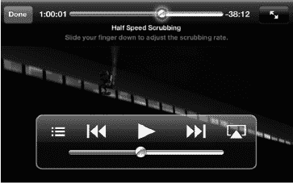

**提示：** 向下拖动手指可以更慢地移动滑块控件。

### 更改视频大小（宽屏与全屏）

你的大部分视频将以宽屏格式播放。但是，如果你的视频未针对 iPhone 进行转换，或者未针对你的屏幕分辨率进行优化，你可以轻点位于顶部状态栏右侧的 `Expand` 按钮。

你会注意到按钮上有两个箭头。如果你处于全屏模式，箭头指向内侧，相互朝向。如果你处于宽屏模式，箭头指向外侧。

如果宽屏电影没有占满 iPhone 的全部屏幕，轻点此按钮会稍微放大。再次轻点则会缩小回原尺寸。

**注意：** 你也可以直接双击屏幕来放大并填满屏幕。请注意，就像在你的宽屏电视上一样，试图强制非宽屏视频进入宽屏模式有时可能会导致部分画面丢失。

### 使用 AirPlay

Apple 的 AirPlay 镜像功能可以让你将视频投射到 Apple TV，从而在大屏幕电视上欣赏。只需轻点右下角的 AirPlay 按钮，然后选择 Apple TV 作为输出目标。片刻之后，你的 iPhone 屏幕会变暗，视频将在大屏幕电视上从你离开的位置开始播放。

要将视频恢复到 iPhone 上，再次轻点 AirPlay，然后选择 iPhone 作为目标。

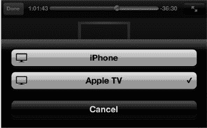

**提示：** 如果你没有或不想要 Apple TV，你还有其他几种方式观看电影。例如，你可以购买 VGA 或 HDMI 适配器，将 iPhone 连接到 VGA 电脑显示器或高清电视上。

VGA 仅支持视频，需要应用支持此功能，并且通常与 DRM 不兼容。HDMI 支持视频和音频，也需要应用支持该功能。不过，它符合 HDCP 标准，因此可以兼容 iTunes 视频等受 DRM 保护的内容。

Apple 还提供符合 DRM 要求且适用于大多数电视的色差分量视频线缆。

更多信息，请参阅《快速入门指南》中的“配件”部分。

#### 使用章节功能

从 iTunes 商店购买的大多数全长电影（以及部分专为 iPhone 转换的电影）都会提供**章节**功能。在 iPhone 上观看这类影片，与在家用电视上观看 DVD 的操作非常相似。

只需轻点屏幕调出视频控制界面，然后选择**章节**。

这会带你返回电影的主页面。

轻点右上角的**章节**按钮，然后滚动浏览，找到并点击你想观看的章节。

#### 查看章节

你可以通过滚动或快速滑动来定位想看的场景或章节。

你还会注意到，每个章节的最右侧会显示该章节开始的确切时间（相对于电影开头）。

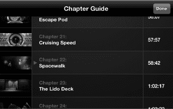

除了前面提到的章节菜单，你还可以通过轻点**快退**或**快进**按钮，快速跳转到电影的上一个或下一个章节。每次轻点都会向前或向后移动一个章节。

**注意：** 章节功能通常仅适用于从 iTunes 商店购买的电影。经过转换并加载到 iPhone 上的电影通常不包含章节。

### 观看电视节目

iPhone 非常适合观看你喜欢的电视节目。你可以从 iTunes 商店购买电视节目，也可以从某些 iPhone 应用（如 **Hulu Plus** 应用）下载样片。

只需向下滚动到**电视节目**分类分隔线，即可查看已下载到 iPhone 上的节目。在可用节目列表中滚动，然后轻点**播放**。视频控件的操作方式与观看电影时相同。

**注意：** 在撰写本文时，iTunes 云服务允许美国用户将以前购买的电视节目直接重新下载到 iPhone 上（更多信息请参阅第 22 章：“设备上的 iTunes”）。

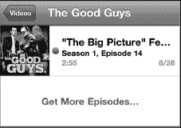

### 观看播客

我们通常认为播客是可以通过 iTunes 下载的纯音频广播。如今视频播客也非常普遍，可以在众多网站上找到，包括许多公共广播网站。它们也可以在 iTunes 的 **iTunes U** 板块中找到；该板块列出了大学播客及其他相关信息。

以下是来自 Gary Mazo 的一个有趣的 iTunes U 故事：

> “最近，我和刚被加州理工学院录取的儿子一起在 iPhone 的 **iTunes** 应用里浏览 **iTunes U** 板块。我们想知道住宿情况，瞧，还真找到了一个展示加州理工学院宿舍参观之旅的视频播客。我们下载了它，这个播客直接存入了**播客**目录，方便以后观看。无需从东海岸飞过去，我们就完成了一次完整的虚拟宿舍参观。”

### 观看音乐视频

你可以从多个来源获取供 iPhone 观看的音乐视频。通常，如果你从 iTunes 购买了一张“豪华版”专辑，其中会包含一两首音乐视频。你也可以从 iTunes 商店购买音乐视频，许多唱片公司和艺人也会在其网站上免费提供音乐视频。

音乐视频会自动归类到 **视频** 应用的 **音乐视频** 分区中。

**音乐视频** 通常位于 **视频** 列表中的 **电视节目** 下方。其控制方式与所有其他视频应用相同。

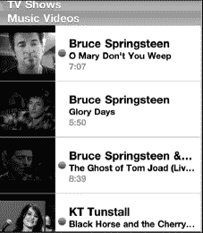

### 视频选项

与你的音乐播放器一样，视频播放器也有一些可调节的选项。这些选项可以通过**主屏幕**上的**设置**图标进行访问。

轻点**设置**图标，向下滚动并轻点**视频**以查看可用选项。

在这里，你还可以设置“家庭共享”设置，以便直接从 iPhone 上观看存储在电脑 iTunes 资料库中的视频。

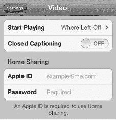

#### 开始播放选项

有时，你可能不得不中断观看某个视频。此选项让你决定下次想观看该视频时的操作。你可以选择从头开始观看，或者从上次中断的地方继续观看。只需选择你偏好的选项，此后 iPhone 便会按此操作执行。

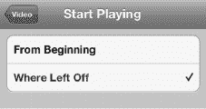

#### 隐藏式字幕

如果你的视频支持隐藏式字幕，将**隐藏式字幕**开关设为**开启**，即可在屏幕上看到隐藏式字幕。

### 删除视频

要删除视频（以节省 iPhone 空间），只需上下滚动并选择要删除的视频。

**注意：** 如果你正通过 iTunes 同步视频，请确保也在 iTunes 中取消勾选你要删除的视频；否则，下次同步时，iTunes 可能会将其重新同步回你的 iPhone！

只需在要删除的视频上向左滑动。如同删除邮件一样，左上角会出现一个红色的**删除**按钮。轻点**删除**按钮，系统会提示你确认删除。

最后，轻点**删除**按钮，该视频便会从系统中删除。

**注意：** 此操作仅从 iPhone 上删除视频——如果你在购买视频后曾与电脑同步过，那么 iTunes 视频资料库中仍会保留一份副本。如果你之后想再次观看，可以将其重新加载到 iPhone 上。但是，如果你从 iPhone 上删除了一部租借的电影，它将永久删除！

### iPhone 上的 YouTube

如今，在电脑上观看 YouTube 视频无疑是人们最常做的事情之一。而现在，YouTube 就在你的 iPhone 上，触手可及。

你可以在主屏幕上看到 YouTube 图标。只需轻点该图标，即可进入 YouTube 应用。

#### 搜索 YouTube 视频

首次启动 **YouTube** 时，你通常会看到当天的**精选**视频。

像在其他应用中一样，滚动浏览视频选择项即可。

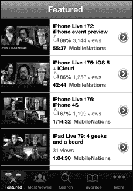

#### 使用底部图标

在 **YouTube** 应用的底部，有五个图标：**精选**、**最多观看**、**搜索**、**收藏**和**更多**。每个选项的含义都相当一目了然。

要查看 YouTube 当天推荐的精选视频，请轻点**精选**图标。要查看在线观看次数最多的视频，请轻点**最多观看**图标。

观看完某个视频后，你可以在 **YouTube** 上将其设为最爱，以便日后轻松找到。如果已设置书签，轻点**收藏**图标时它们便会显示出来。

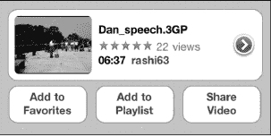

你还可以搜索庞大的 YouTube 视频库。轻点**搜索**框（就像之前讨论的其他应用一样），键盘会弹出。输入短语、主题，甚至是视频的名称。

在此示例中，我正在查找最新的 Made Simple Learning 视频教程——所以我只需输入“Made Simple Learning”，即可看到此类视频的列表。

当我找到想看的视频后，可以轻点它以查看更多信息。我甚至可以在播放过程中轻点视频并选择评分来为它评分。

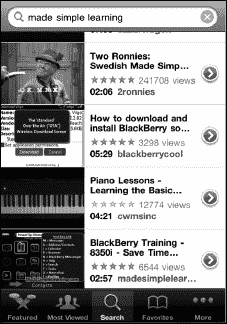

#### 播放视频

做出选择后，轻点你想观看的视频。你的 iPhone 会以竖屏或横屏模式开始播放 YouTube 视频。要强制竖屏显示，只需旋转 iPhone，使屏幕方向保持垂直。

### 视频控制

视频开始播放后，屏幕上的控制按钮会消失，因此你只能看到视频画面。在视频播放过程中，如需停止、暂停或激活其他选项，只需轻点屏幕即可。

屏幕上的选项与你观看其他视频时看到的基本相同。

（横屏模式下）要快进视频，请长按`快进`箭头。要快速后退，请长按`后退`箭头。要播放在 YouTube 列表中的下一个视频，请轻点`快进`/`下一个`箭头。要观看列表中的上一个视频，请轻点`后退`/`上一个`箭头。

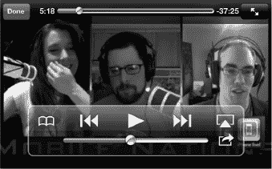

要将视频设为收藏，请轻点最左侧的图标：`收藏夹`。 

要将视频投射到 Apple TV 上，请轻点`AirPlay`按钮。 

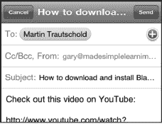

要添加至收藏夹、通过电子邮件发送或发布推文分享该视频，请轻点`共享`图标，即可进行这些操作。

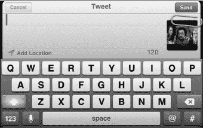

### 查看和清除历史记录

轻触`更多`，然后轻触`历史记录`，你最近观看的视频便会显示出来。

如果你想清除历史记录，只需轻触右上角的`清除`按钮，然后点击底部的按钮确认即可。

要观看历史记录中的视频，只需轻触该视频，它便会开始播放。

**注意：** `Netflix`应用会消耗大量数据，因此，如果你是通过 Wi-Fi 流播放视频，请确保 Wi-Fi 信号强。如果通过 3G 蜂窝网络使用该应用，请确保你的数据套餐足够。

