# 第 16 章

## Safari 网页浏览器

现在，我们将带你了解 iPhone 上最有趣的体验之一：上网冲浪。你可能听说过，在 iPhone 上浏览网页比以往任何时候都更贴近个人体验——我们同意这一点！我们将向你展示如何通过 iPhone 上的 `Safari`，以前所未有的方式进行触摸、缩放以及与网页互动。你将学习如何设置和使用书签、通过搜索引擎快速查找内容、打开并切换多个浏览器窗口，甚至能够轻松地从网页中复制文本和图像。

### 在 iPhone 上浏览网页

你可以通过 Wi-Fi 或 iPhone 的 3G 连接随心所欲地浏览网页。与其更大的同类产品 iPad 一样，你的 iPhone 拥有许多人认为目前最强大的移动浏览体验。网页看起来与你在电脑上看到的非常相似。借助 iPhone 的缩放功能，你甚至无需担心较小的屏幕尺寸会影响你的网页浏览体验。简而言之，在 iPhone 上浏览网页是一种更令人满意的体验。

你可以根据自己的偏好选择竖屏或横屏模式浏览。通过双击或双指捏合放大的手势快速放大视频——这些操作与你放大文本和图像时的动作相同。

**为什么有些视频和网站无法显示？（需要 Flash Player）**

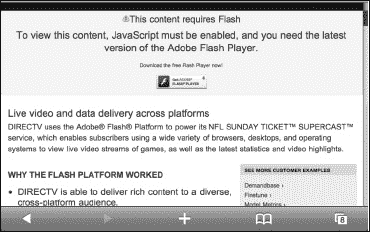

Apple 在 iOS 上不支持 Flash，并且 Adobe 近期已决定停止开发 Flash Player Mobile。如果你轻点一个视频但无法播放，或者看到类似“需要 Flash 插件”、“下载最新 Flash 插件以观看此视频”或“需要 Adobe Flash 才能查看此站点”的提示，那么你将无法观看该视频或访问该网页。幸运的是，越来越多的网站开始使用 HTML5 视频替代 `Flash`，包括 YouTube、Vimeo、TED、《*纽约时报*》和《*时代*杂志》，这些内容都可以在你的 iPhone 上播放。

解决此限制的一种方法：App Store 上的一些替代浏览器（例如 `Skyfire`）会在其自有服务器上渲染 `Flash` 视频，并将 HTML5 视频发送到 iPhone。

#### 需要网络连接

你的 iPhone 需要处于有效的互联网连接状态（Wi-Fi 或 3G）才能浏览网页（详见第 4 章：“连接到网络”）。

#### 启动网页浏览器

你应该在你的`主屏幕`上找到 `Safari`（网页浏览器）应用。通常，`Safari`图标位于底部 Dock 栏中。

轻触 `Safari` 图标，你将进入浏览器的`首页`。这很可能是 Apple 的 iPhone 页面。

只需将 iPhone 侧转，即可在更宽的横屏模式下看到同一个页面。当你找到喜欢的网站时，可以设置书签以便轻松跳转到这些网站。我们将在本章后面介绍如何操作。

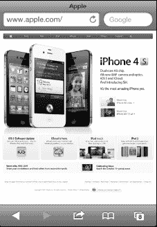

#### Safari 网页浏览器屏幕布局

观察你的屏幕，注意地址栏位于屏幕左上方。此栏显示当前网页地址。

如果你正在查看包含合适文本内容的网页，你会注意到地址栏中会出现“阅读器”按钮。轻触`阅读器`，即可以一种易于阅读的格式查看网页内容。更多相关信息，请参见本章的“Safari 阅读器”部分。

`搜索`窗口位于地址栏的右侧。默认设置为 Google 搜索，但如果你愿意，可以将其更改为其他搜索引擎。

屏幕底部有五个图标：返回、前进、操作、书签和页面视图。

#### 输入网址

你想学习的首要操作是如何访问你最喜欢的网页。就像在电脑上一样，你需要在浏览器中输入网址（URL）。按照以下步骤在 `Safari` 中输入网址：

1.  首先，轻点浏览器顶部的`地址`栏。你会看到键盘出现，并且`地址`栏的窗口会展开。
2.  如果窗口中已有地址并且你想删除它，请按地址栏右侧的 。
3.  开始输入你的网址（你不需要输入“`www.`”）。
4.  开始输入时，你可能会看到`地址`栏下方出现建议；只需轻触任一建议即可前往该页面。这些建议非常完整，因为它们来自你的浏览历史记录、书签、网址（URL）和网页标题。
5.  记住页面底部的 `.com` 键。如果你长按它，会看到 `.edu`、`.org` 和其他常见的域名后缀。
6.  输入完毕后，轻点`前往`键即可访问该页面。

**提示：** 不要输入“`www.`”，因为这不是必需的。记得使用底部的`冒号`、`斜杠`、`下划线`、`点`和 `.com` 键以节省时间。

**提示：** 长按 `.com` 键可查看所有选项：`.org`、`.edu`、`.net`、`.de` 等。

#### 在已打开的网页中向前或向后移动

既然你已经知道如何输入网址，你可能会跳转到不同的网站。屏幕底部的`前进`和`后退`箭头  让你可以非常轻松地向前或向后浏览最近访问过的页面。如果`后退`箭头是灰色的，本章“使用打开页面按钮”部分可以帮助你找出原因。

假设你正在查看《*纽约时报*》网站上的新闻，然后你跳转到 ESPN 查看体育比分。要返回《*纽约时报*》的页面，只需轻触`后退`箭头。要再次返回 ESPN 网站，轻触`前进`箭头。

### 使用“打开页面”按钮

有时，当你点击一个链接时，你正在查看的网页会移至后台，并弹出一个包含新内容（例如另一个网页或视频）的新窗口。你会看到先前的页面移至后台，同时打开一个新页面。在这种情况下，新浏览器窗口中的“返回”箭头将不起作用。

相反，你需要点击右下角的“打开页面”图标  来查看已打开网页的列表，然后点击你想要的那个页面。在所示的示例中，我们点击了一个链接，该链接打开了新浏览器窗口。回到旧窗口的唯一方法是点击“打开页面”图标，并选择所需的页面。

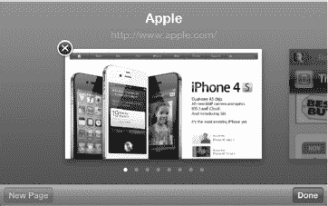

### 在网页中放大和缩小

在 iPhone 上放大和缩小网页非常容易。主要有两种缩放方式：双击和捏合。

#### 双击

如果你双击网页中的某一栏，页面将放大至该特定栏。这让你能够精确定位到网页上的正确位置，对于未针对移动屏幕优化的页面非常有用。

要缩小，只需再双击一次（你可以在本书开头的“快速入门指南”中看到它的效果）。

## 捏合

此技巧可让你放大页面的特定部分。这需要稍加练习，但很快就会变得得心应手。查看“快速入门指南”了解具体效果。

将你的拇指和食指并拢放在你想要放大的网页部分。慢慢地向外捏合，分开你的手指。你会看到网页放大。网页需要几秒钟来聚焦，但很快它就会放大并变得非常清晰。

要缩小到之前的状态，只需将手指分开，然后慢慢靠拢；页面将会缩小到原始大小。

### 激活网页中的链接

上网浏览时，你经常会遇到能带你前往另一个网站的链接。由于 `Safari` 是一个功能齐全的浏览器，你只需点击链接即可跳转到新页面。

### 使用 Safari 书签

一旦你开始在 iPhone 上进行一些浏览，你自然会希望快速访问你最喜爱的网站。一个很好的方法就是添加书签，以实现一键访问网站。

**提示：** 你可以通过 iCloud 无线方式，或使用电脑上的 `iTunes` 应用，从电脑的浏览器（仅限 `Safari` 或 `Internet Explorer`）同步你的书签。更多详情，请查看第 3 章：“与 iCloud、iTunes 等进行同步”。

## 添加新书签

在 iPhone 上添加新书签只需轻点几下：

1.  要为当前查看的网页添加新书签，请轻点屏幕底部的“操作”按钮 。
2.  选择“添加书签”。

    

3.  我们建议你将书签名称编辑得简短且易于识别。
4.  如果你想更改存储书签的文件夹，请轻点“书签”。
5.  完成后，轻点“存储”按钮。

    

## 使用书签和历史记录

一旦你设置了一些书签，查看和使用它们就非常容易了。在同一个区域，你还可以查看和使用你的网页浏览历史记录。iPhone 上一个非常有用的工具是能够像在电脑上一样通过“历史记录”浏览网页。请按照以下步骤操作：

1.  轻点页面底部的“书签”图标 。
2.  向上或向下滑动查看所有书签。
3.  轻点任何书签，即可跳转到该网页。

    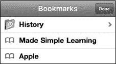

4.  轻点“历史记录”文件夹，查看最近访问过的网页历史记录。
5.  请注意，在列表底部，你会看到“今天早些时候”和之前日期的其他文件夹。
6.  轻点任一历史记录条目，即可前往该网页。

**提示：** 要清除历史记录，请轻点左下角的“清除”按钮。你也可以在“设置”应用中清除历史记录、Cookie 和缓存。轻点“设置”；轻点“Safari”；滚动到底部；然后轻点“清除历史记录”、“清除 Cookie”或“清除缓存”。

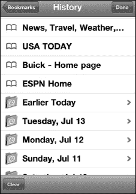

## 管理你的书签

因为设置书签非常容易，所以很容易积累大量的书签。但是，你可能会发现不再需要某个特定书签，或者你可能想通过添加新文件夹来整理它们。

如果你已经整理过“电话收藏”列表，你就已经知道如何整理书签了；操作步骤相同。

就像 iPhone 上的其他列表一样，你可以重新排列“书签”列表并删除条目。请按照以下步骤操作：

1.  像之前一样查看你的“书签”列表。
2.  轻点左下角的“编辑”按钮。
3.  要重新排列条目，请触摸并拖动带有三条灰色横线的右侧边缘，在列表中向上或向下移动。在此示例中，我们将指向亚马逊网站“iPad Made Simple”图书页面的书签拖到顶部。
4.  要为书签创建新文件夹，请轻点右下角的“新建文件夹”按钮。
5.  要删除书签，请轻点条目左侧的红色“圆圈”图标使其变为垂直。
6.  轻点“删除”按钮。
7.  完成重新排列和删除条目后，轻点左上角的“完成”按钮。
8.  要编辑书签的名称、文件夹或网址，请轻点书签名称本身。

    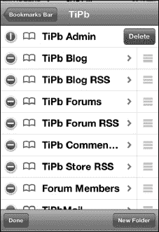

9.  现在你可以对名称、网址或文件夹进行任何调整。
10. 要更改书签的存储文件夹，请轻点网址下方的按钮。在此图中，它显示为“书签”；但在你的 iPhone 上，可能有所不同。此书签指向亚马逊网站上的“iPad Made Simple”页面。
11. 完成后轻点“完成”。

    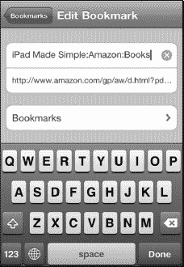

### 阅读列表

`阅读列表` 是一种特殊类型的书签，可让你快速保存一篇网络文章，以便闲暇时阅读。`阅读列表` 功能可以通过 iCloud 同步，因此这是在家庭或工作用的 Mac 或 Windows PC 上的 `Safari` 中快速标记文章，以便在旅途中通过 iPhone 或 iPad 阅读的绝佳方式。你也可以使用此功能在 iPhone 上保存书签，以便回到 iPad 或 PC 后更舒适地阅读。

请按照以下步骤使用 `阅读列表` 功能：

1.  前往你想要在 `Safari` 中保存的文章。
2.  轻点页面底部中间的“操作”按钮 。
3.  轻点“添加到阅读列表”。

稍后按照以下步骤查看 `阅读列表` 中的文章：

1.  轻点页面右下角的“书签”按钮 。
2.  轻点“阅读列表”选项的“眼镜”图标。（如果你没有看到“眼镜”图标，你可能位于“书签”文件夹内。只需轻点左上角的“箭头”图标退出你所在的文件夹，直到“箭头”消失，你就能看到“眼镜”图标。）

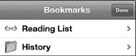

1.  要查看你的 `阅读列表` 中的所有内容，请轻点左上角的“全部”标签。要仅查看尚未阅读的文章，请轻点右上角的“未读”标签。
2.  轻点你想阅读的文章。

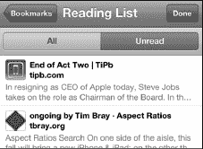

最后，按照以下步骤从 `阅读列表` 中删除一篇文章：

1.  在你想要从 `阅读列表` 中移除的文章上从左向右滑动。
2.  轻点红色的“删除”按钮。

    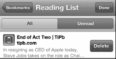

### Safari 阅读器

**Safari** 的阅读器功能让您能够以干净、清晰的页面形式欣赏网页文章，文字大小适中，免去繁杂布局或广告的干扰。

**注意：** 尽管 Safari 能够出色地检测大多数网页文章，但由于内容和格式的多样性，有时可能会遗漏。如果您没有看到阅读器按钮，说明 Safari 无法检测到该文章。

1. 按照以下步骤激活此功能：

   

2. 前往您想阅读的文章。
3. 点击 URL 字段右侧的阅读器按钮，见图 16–1。
4. 点击字体大小按钮以放大或缩小文字。

   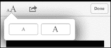

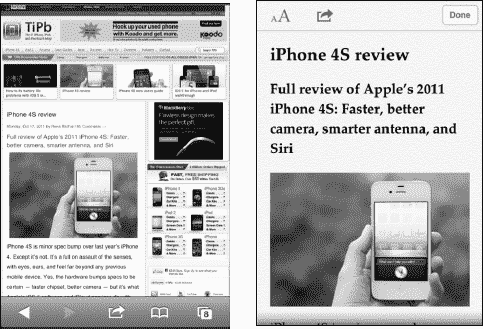

**图 16–1.** *标准视图（左）与阅读器视图（右）中的同一网页。*

**提示：** 如果您希望同时拥有“阅读列表”和“阅读器”的功能，以及浏览器访问、社交分享等其他特性，请查看 App Store 中的 **Instapaper** 等应用。

### Safari 浏览技巧与提示

在您掌握了基本浏览方法后，我们将介绍一些实用技巧，帮助您在 iPhone 上更愉快、更高效地浏览网页。

#### 跳转到网页顶部

有时网页内容很长，手动滚动回顶部会比较费力。一个简单的技巧是点击网页的灰色标题栏，即可自动跳转到顶部。

#### 通过电子邮件或 Twitter 分享网页

浏览时，如果您发现一个非常想分享给朋友或同事的页面，请点击底部栏中间的 **操作** 按钮 ，然后选择 **将此页面的链接通过邮件发送** 创建一封包含链接的邮件并发送。选择 **发送推文** 则创建一条包含分享链接的新 Twitter 消息，如图 16–2 所示。

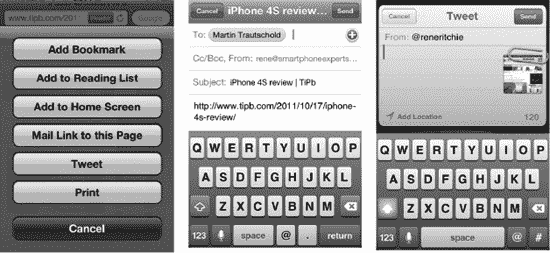

**图 16–2.** *使用操作按钮执行 Safari 网页的各种功能。*

#### 打印网页

使用 iPhone，您可以通过本地 Wi-Fi 网络轻松地将任何网页打印到兼容 **AirPrint** 的打印机。点击 **操作** 按钮 ，然后选择 **打印**。

#### 在 Safari 中观看视频

您经常会在网站上看到视频。您可以播放其中许多视频，但并非全部。例如，采用 **Adobe Flash** 格式的视频无法在 iPhone 上播放（请参阅本章开头的说明）。

点击 **播放** 按钮后，您将离开 **Safari** 并进入 **iPod** 视频播放器。

您可以横置 iPhone，以横向或宽屏模式观看视频。

如果播放控制消失，点击屏幕即可重新显示。

观看完视频并想返回网页时，请点击左上角的 **完成** 按钮。

**提示：** 请参阅第 15 章“观看视频”中的视频播放器技巧与提示。

#### 保存或复制文本与图形

有时您可能想从网站复制文本或图形。本节将简要介绍操作方法；如需了解更深入的步骤，包括如何使用剪切和粘贴功能，请参阅第 2 章“键入、复制和搜索”中的“复制和粘贴”部分。以下是从网页复制文本或图形的快速摘要：

*   **复制单个单词：** 长按该单词，直到它被高亮显示且出现 **复制** 按钮。然后点击 **复制**。
*   **复制几个单词或整个段落：** 长按一个单词直到它被高亮显示。然后向左或向右拖动蓝色圆点以选择更多文本。您可以向上或向下滑动以选择整个段落。最后点击 **复制**。

    **提示：** 选定单个单词会使复制功能进入单词选择模式，在此模式下您可以拖动以增加或减少选中的单词数量。如果选择超过一个段落，通常会切换到元素选择模式，此时您会看到可拖动的边缘，用于选择多个段落、图像等。

*   **保存或复制图形：** 长按图片或图像，直到弹出窗口询问您是否要保存或复制该图像。

#### 使用自动填充节省时间

自动填充功能是节省输入个人信息（包括网站用户名和密码）的好方法。自动填充工具可以记住并自动填写网页表单所需的信息。启用自动填充可以节省大量时间。

请参阅本章后面的“启用自动填充”部分，了解如何在 iPhone 上设置自动填充。

启用 **自动填充** 选项后，只需前往任何需要填写字段的网页。一旦您触摸该字段，键盘就会在屏幕底部弹出。在键盘顶部，您会看到一个写着 **自动填充** 的小按钮。点击它，网页表单就会自动填写完毕。

**注意：** 自动输入您的姓名和密码意味着任何拿起您 iPhone 的人都能访问您的个人网站和信息。您可能希望按照第 8 章“个性化与安全”中的说明启用密码安全功能。

##### 输入用户名和密码

当您首次访问一个需要输入用户名和密码的网站时，输入它们后点击 **提交** 或 **回车**。此时，自动填充会询问是否希望您的 iPhone 记住它们。

如果希望被记住并在下次访问时自动输入，请点击 **是**。

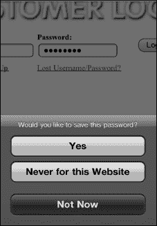

下次访问此登录页面时，您的用户名和密码将自动填写。

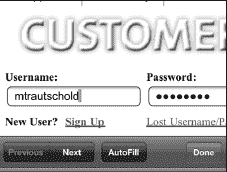

##### 用于个人信息

在网上，您经常需要输入姓名、电子邮件地址、家庭住址等信息。通过将自动填充设置并与 iPhone 上的联系人记录关联，只需轻触一下即可填写这些表单。

您会访问许多需要填写网页表单的网站。例如，查看 [`www.madesimplelearning.com`](http://www.madesimplelearning.com) 上关于免费 iPhone 技巧的网页表单示例。手动输入电子邮件地址、名字和姓氏会花费一些时间。

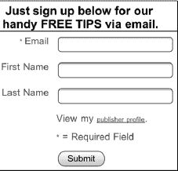

一旦您点击第一个字段（此处为 **电子邮件**），您就会看到 **自动填充** 栏出现在键盘上方。

点击 **自动填充** 按钮，您的电子邮件地址和姓名便会立即根据联系人记录填写完毕。

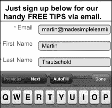

#### 将网页图标添加到主屏幕

如果您喜欢某个网站或页面，可以轻松地将其作为图标添加到 **主屏幕**。这样，您无需通过 **Safari** 的书签选择过程即可直接访问该网页。将图标放在 **主屏幕** 上可以节省许多步骤。这对于快速启动 Web 应用（例如 Google 的 Gmail 或基于 Web 的游戏）尤其有用。

**按照以下步骤添加 Web 应用图标：**

1.  点击浏览器底部的 **操作** 按钮 。
2.  点击 **添加到主屏幕**。
3.  调整名称，将其缩短至十个或更少字符；因为主屏幕上图标名称的空间有限，建议这样做。
4.  点击右上角的 **添加** 按钮。

   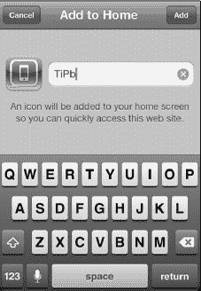

### 调整 Safari 浏览器设置

与我们之前调整的其他设置一样，`Safari` 的设置也位于 `设置` 应用中。

1.  要访问 `Safari` 的设置，请轻点 `设置` 图标。
2.  轻点 `Safari`。

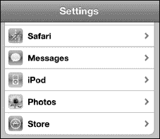

#### 更改搜索引擎

默认情况下，`Safari` 浏览器的搜索引擎是 `Google`。要将其更改为 `Yahoo` 或 `Bing`，请轻触 `搜索引擎` 按钮，然后选择新的搜索引擎。

**提示：** 如果你不想更改默认搜索引擎，你也可以使用 `Siri` 来偶尔搜索 `Yahoo!` 或 `Bing`。只需激活 `Siri` 并说“用 Yahoo! 搜索...”或“用 Bing 搜索...”，`Siri` 就会为你返回结果。

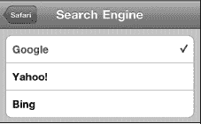

#### 启用自动填充

正如我们在本章前面所示，`自动填充` 是一种便捷的方式，可以让 `Safari` 自动填写要求你输入姓名、地址、电话号码，甚至用户名和密码的网页表单。它可以为你节省大量反复输入姓名和其他信息的时间。

要启用 `自动填充` 选项，请按照以下步骤操作：

1.  从 `设置` 应用中的 `Safari` 菜单，轻点 `自动填充`。

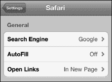

2.  将 `姓名与密码` 旁边的开关设置为 `开启`。
3.  将 `使用联络信息` 旁边的开关设置为 `开启`。

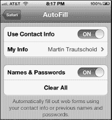

4.  将 `使用联络信息` 设置为 `开启` 后，系统会带你进入 `通讯录` 列表，以选择一个联系人使用。
5.  上下滑动以找到某人，或双击显示 `通讯录` 的顶部栏以调出 `搜索` 窗口。
6.  找到要使用的联系人后，轻点该联系人即可返回 `Safari` 的 `设置` 屏幕。

#### 调整隐私选项

开启 `无痕浏览` 选项意味着你访问网站时不会存储任何信息、历史记录或 Cookie。如果你担心他人知道你访问了哪些网站，或担心你访问的网站对你进行跟踪，那么你应该将 `无痕浏览` 切换到 `开启` 位置。

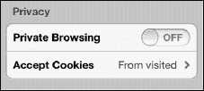

你也可以使用 `清除历史记录` 和 `清除 Cookie 与数据` 选项。

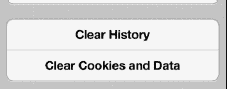

**提示：** 如果你发现网页浏览速度变慢或变得卡顿——或者 `Safari` 频繁崩溃——请尝试分别轻点 `历史记录` 和 `Cookie 与数据` 并确认你的选择来清除它们。

#### 调整安全选项

在 `安全性` 标题下，`欺诈警告`、`JavaScript` 和 `拦截弹出式窗口` 选项默认应为 `开启` 状态。你可以通过将任意开关滑动到 `关闭` 来修改这些设置。

**注意：** 许多像 `Facebook` 这样的流行网站要求 `JavaScript` 处于 `开启` 状态。

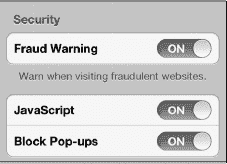

轻点 `接受 Cookie` 按钮，将浏览器接受 Cookie 的能力调整为 `始终`、`永不` 或 `来自访问过的网站`。我们建议将其保留为 `来自访问过的网站`。如果设置为 `永不`，某些网站将无法正常工作。

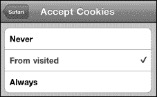

