# 第 17 章

## 使用邮件进行沟通

在本章中，我们将探索 iPhone 上 `邮件` 应用中的电子邮件世界。你将学习如何设置多个电子邮件账户，查看各种阅读选项，打开附件，以及清理收件箱。

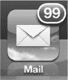

并且，当你的电子邮件无法正常工作时，你将学习一些好的故障排查技巧，帮助你重新恢复正常运行。

### 邮件入门

在 iPhone 上设置电子邮件相当简单。让电子邮件运行起来最快的方法可能是在手机上直接设置你的账户。在本节中，我们将向你展示如何使用 `邮件、通讯录、日历` 账户设置屏幕。你也可以使用电脑上 `iTunes` 应用中的一个屏幕来复制这些账户设置。要让电子邮件运行起来，你需要一个网络连接。

#### 需要网络连接

移动电子邮件在当今无疑十分流行。即使没有网络连接，你也可以查看、阅读和编写已同步到 iPhone 上的电子邮件的回复；但是，你需要网络连接（无论是 Wi-Fi 还是 3G/蜂窝网络）才能从 iPhone 发送和/或接收电子邮件。请查看第 4 章：“连接到网络”了解更多信息。同时，请参阅第 1 部分快速入门指南中的“阅读顶部连接状态图标”部分。

**提示：** 如果你正在旅行，请在登机前简单下载所有电子邮件；这可以让你在离线状态下阅读、回复和编写邮件。所有电子邮件将在你着陆并重新建立互联网连接后发送。

### 在 iPhone 上设置电子邮件

正如刚才提到的，你可以在 iPhone 上用两种选项来设置你的电子邮件账户：

1.  在 iPhone 上直接设置你的电子邮件账户。
2.  使用 `iTunes` 同步电子邮件账户设置。

第一个选项，即在 iPhone 上直接设置你的电子邮件账户，如果你希望在 iPhone 上进行特殊设置，例如通过 `Exchange` 使用 `Gmail`，那么它是最佳选择。如果你在 Windows 或 Mac 电脑上不使用电子邮件程序，这也是一个好方法。

如果你已经在 Windows 或 Mac 电脑上设置了大量 POP3 或 IMAP 账户，你也可以选择通过 USB 底座连接线，借助 `iTunes` 将它们同步过来。

#### 输入电子邮件账户密码

在第 3 章中，我们向你展示了如何将你的电子邮件账户设置同步到 iPhone。同步完成后，你应该能够通过打开 `设置` 应用来查看 iPhone 上的所有电子邮件账户。你只需要输入每个账户的密码。

要为每个同步的电子邮件账户输入密码，请按照以下步骤操作：

1.  轻点 `设置` 图标。
2.  轻点 `邮件、通讯录、日历` 选项。
3.  在 `账户` 下，你应该会看到所有已同步的电子邮件账户列表。
4.  轻点任意列出的电子邮件账户，输入其密码，然后点击 `完成`。
5.  如果所有信息输入正确，将会出现复选标记，并且你的账户将被启用。
6.  对所有列出的电子邮件账户重复上述操作。

#### 在 iPhone 上添加新电子邮件账户

要在 iPhone 上添加新电子邮件账户，请按照以下步骤操作：

1.  轻点 `设置` 图标。
2.  轻点 `邮件、通讯录、日历` 选项。
3.  轻点你电子邮件账户下方的 `添加账户`。

   如果你没有设置任何账户，你将只会看到 `添加账户` 选项。

   **提示：** 要编辑任何电子邮件账户，只需轻触该账户。

   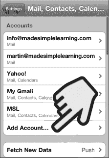

4.  在此屏幕上选择要添加的电子邮件账户类型：
   - 如果你使用 iCloud 服务，请选择 `iCloud`。
   - 如果你使用 Microsoft Exchange 电子邮件服务器，请选择 `Microsoft Exchange`。
   - 如果你使用 `Google 日历` 和 `Google 通讯录` 来存储个人信息，并且希望将它们无线同步到 iPhone，你也应该选择 `Microsoft Exchange`。

     **注意：** 我们在第 3 章：“与 iCloud、iTunes 等同步”中向你展示了如何设置 Google/Microsoft Exchange 和 iCloud。

   - 如果你使用 Google 电子邮件，但*不*（或*不想*）将电子邮件与你的 `Google 通讯录` 进行无线同步，请选择 `Gmail`。

     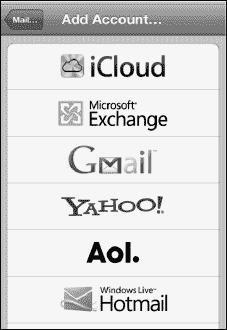

   - 如果你使用 `Yahoo!`、`AOL` 或 `Windows Live Hotmail` 服务，请选择它们。
   - 如果以上都不适用，并且你想要同步一个标准的 POP 或 IMAP 电子邮件账户，请选择 `其他`。最后，在下一个屏幕中选择 `添加邮件账户`。

5.  在 `名称` 字段中，输入你希望收件人在收到你的邮件时看到的姓名。
6.  接下来，在 `地址`、`密码` 和 `描述` 字段中输入相应的信息。
7.  轻点右上角的 `下一步` 按钮。

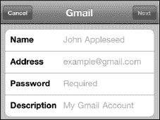

### 指定接收和发送服务器

有时，iPhone 可能无法自动设置你的电子邮件账户。在这种情况下，你需要手动输入更多设置才能启用你的电子邮件账户。

**提示：** 你可以通过在网上搜索你的电子邮件提供商名称和电子邮件设置来找到相应的设置。

如果 iPhone 仅凭你的电子邮件地址和密码无法登录你的服务器，那么你将看到一个类似于此的屏幕。

在**接收邮件服务器**下，在**主机名**、**用户名**和**密码**字段中键入相应的信息。通常，你的接收邮件服务器类似于 `mail.*你的网络服务商名称*.com`。

要调整你的发送服务器名称，请轻点**发送邮件服务器**。你可以在接下来的屏幕上调整发送邮件服务器。这些服务器名称通常看起来像 `smtp.*你的网络服务商名称*.com` 或 `mail.*你的网络服务商名称*.com`。

你可以尝试将**服务器名称**和**密码**字段留空。如果这不起作用，你随时可以返回并更改它们。

系统可能会询问你是否要使用 SSL（安全套接层），这是一种发送邮件的安全措施，你的电子邮件提供商可能会要求使用。如果你不确定是否需要 SSL，请与你的电子邮件提供商核对邮件设置。

**提示：** 作者建议你尽可能使用 SSL 安全协议。如果你不使用 SSL，你的登录凭据、邮件以及任何私人信息都将以明文形式发送（未加密），这会让他们容易受到窥探。

### 验证你的账户是否已设置完成

输入所有信息后，iPhone 将尝试配置你的电子邮件账户。你可能会收到一条错误消息；如果发生这种情况，你需要检查你输入的信息。

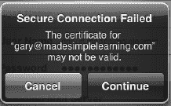

如果你进入了显示所有电子邮件账户的屏幕，请查找新账户的名称。

如果你看到了它，说明你的账户已设置成功。

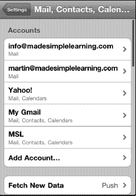

### 修复无法获取邮件错误

如果你轻点**邮件**图标，并收到一条显示“无法获取邮件——未提供 *(你的账户)* 的密码”的错误，则需要输入你的密码。

有关此问题的帮助，请参阅本章的“为从 iTunes 同步的电子邮件账户输入密码”部分。

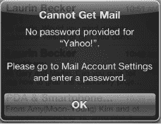

## 邮箱屏幕——收件箱和账户

顶层屏幕是你的**邮箱**屏幕。你总是可以通过轻点左上角的按钮进入该屏幕。继续轻点这个左上角的按钮，直到看不到更多按钮。当这种情况发生时，你就处在**邮箱**屏幕中。

从**邮箱**屏幕，你可以访问以下项目：

*   **统一收件箱：** 通过轻点**所有收件箱**来访问。
*   **每个单独账户的收件箱：** 通过轻点**收件箱**部分中该电子邮件账户的名称来访问。

    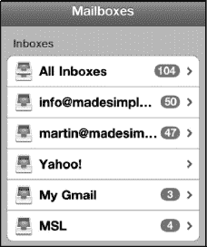

*   **账户部分中每个电子邮件账户的文件夹：** 通过轻点账户名称来查看所有文件夹以访问这些文件夹。

    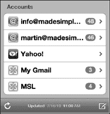

## 添加或编辑电子邮件文件夹或邮箱

借助 iOS 5，如果你使用的是 iCloud 同步邮件账户，或者你的邮件服务器支持此功能，你现在可以直接在 iPhone 上添加或编辑电子邮件文件夹。例如，你可能想要更改邮件文件夹名称或添加新邮件文件夹，以便更好地组织你的邮件收件箱。一个例子是创建一个名为“需要关注”的新文件夹，并将所有你当前无法处理，但需要确保稍后回到办公桌前处理的电子邮件放入其中。要在你的设备上添加或编辑邮箱，请按照以下步骤操作：

1.  在**邮箱**屏幕上，向下滚动并轻点“账户”下列出的任意电子邮件账户。

    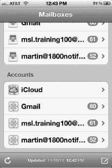

2.  在此示例中，我们将编辑 iCloud 账户邮箱。在此屏幕上，轻点右上角的**编辑**。

    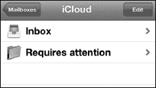

3.  然后，你可以执行以下操作：

    *   轻点底部的**新建邮箱**以创建一个新邮箱。
    *   轻点任意邮箱文件夹以编辑其名称或将其删除。

    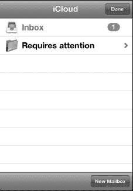

## 收件箱中的已标记邮件和主题相关邮件

你会注意到，所有未读邮件在邮件左侧都会有一个蓝色圆点  作为标记。

你还会注意到，某些邮件在右侧会显示一个数字和一个指向右方的箭头 (>)，如下所示：。这表示该邮件具有三条相关的邮件（回复和转发）。

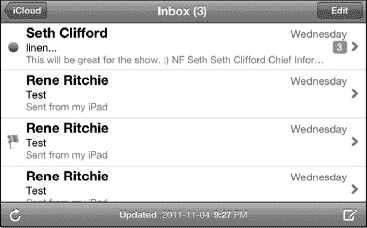

已标记的邮件在其左侧会有一个小旗帜，如下所示：

轻点任意邮件即可将其打开。只有当存在相关邮件时，它才会无法直接打开。在这种情况下，你首先会看到一个包含所有相关邮件的屏幕。轻点其中任意邮件即可打开并查看。

要离开**收件箱**视图，请轻点左上角的按钮。

你可以通过查看左上角的按钮来判断你在查看哪个电子邮件账户：

*   如果按钮显示**邮箱**，则表明你正在查看所有收件箱的汇总。
*   如果按钮显示一个账户名称，例如**iCloud** 或 **Exchange**，则表明你仅查看该账户的收件箱。

### 移动、删除或标记（标记）多条邮件

如果你想一次移动或删除多条邮件，可以从收件箱屏幕进行操作。按照以下步骤一次删除多条邮件：

1.  在查看收件箱屏幕时，轻点右上角的**编辑**按钮。
2.  轻点以选择所需的邮件；邮件旁边的红色**勾选标记**图标表示它已被选中。
3.  要删除邮件，请轻点底部的**删除**按钮。
4.  要将邮件移动到其他文件夹，请轻点**移动**按钮并选择文件夹。
5.  要标记邮件为已标记或未读，请轻点**标记**按钮。“未读”将在邮件旁边重新放回蓝色圆点。如果你标记了一封邮件，你会看到其旁边出现一个小旗帜，如下所示：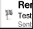

    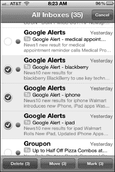

## 查看单条邮件

当你从**收件箱**屏幕轻点一封邮件时，你会看到**主要**邮件视图。你可以在竖屏和横屏模式下查看邮件，请参见图 17-1。竖屏模式通常会显示更多文本。横屏模式通常会让你享受更大的文字和图片。

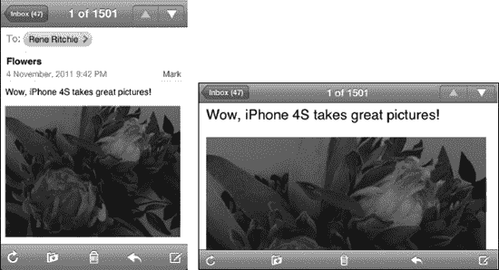

**图 17-1.** *在竖屏和横屏模式下查看电子邮件。*

**提示：** 如果你将 iPhone 放在桌子上或放在膝盖上拿着使用，你可能希望使用**竖屏锁定**图标将视图锁定在竖屏模式。这将防止图像不必要地翻转。要锁定视图，请按照以下步骤操作：

1.  双击**主屏幕**按钮并向左向右滑动。
2.  轻点**竖屏锁定**按钮以将屏幕锁定在竖屏模式。

### 编写和发送电子邮件

要启动电子邮件程序，请轻点**主屏幕**上的**邮件**图标。

**提示：** 如果你在查看某封特定邮件、文件夹列表或某个账户时退出了**邮件**应用，那么当你返回**邮件**应用时，将直接返回到同一位置。

如果你是第一次进入电子邮件，你可能会看到空的收件箱。轻点窗口左下角的**刷新**按钮  以检索最新电子邮件。iPhone 将开始检查新邮件，然后显示每个账户的新邮件数量。

### 撰写新邮件

启动`Mail`程序后，首先看到的是`账户`界面。在屏幕右下角，您会看到`撰写`图标。点击`撰写`图标即可开始创建新邮件。

## 填写收件人——选择收件人

您有几种选择收件人的方式，具体取决于该联系人是否在您 iPhone 的`通讯录`中：

**选项 1**：输入某人名字的前几个字母；按下`空格`键，然后输入该人姓氏的前几个字母。该人的姓名应出现在列表中；点击该姓名即可选择该联系人。

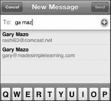

**选项 2**：输入电子邮件地址。请注意屏幕底部的`@`和`句号`(`.`)键，它们可以帮助您输入。

**提示：** 长按`句号`键可查看 `.com`、`.edu`、`.org` 及其他电子邮件域名后缀。

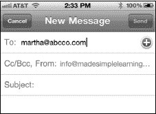

**选项 3**：点击`加号` (`+`)  查看整个`通讯录`列表，并从中搜索或选择一个姓名。

如果您想使用不同的联系人分组，请点击左上角的`群组`按钮。

双击屏幕顶部的`通讯录`可查看`搜索`窗口。接着，输入几个字母来搜索您的联系人。

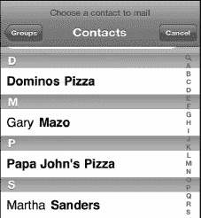

### 删除收件人

如果需要从收件人列表（`收件人:`、`抄送:` 或 `密送:`）中删除某个姓名，请点击该姓名以选中它 ，然后按下`退格`键。

**提示：** 如果您想删除最后输入的收件人（且光标位于该姓名旁），先按一次`删除`键高亮该姓名，再按一次即可将其删除。

### 添加抄送或密送收件人

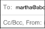 要添加抄送 (`Cc:`) 或密送 (`Bcc:`) 收件人，需点击邮件顶部`收件人:`字段正下方的`抄送:`或`密送:`字段。点击后，该字段将会展开。

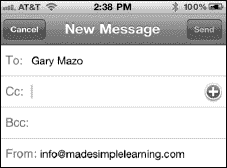

### 移动收件人

如果您最初将某收件人添加到`收件人:`字段，但改变主意，希望将其移至`抄送:`或`密送:`字段（反之亦然），只需长按该收件人姓名，然后将其拖拽到目标字段即可。

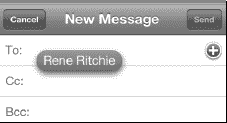

## 更换发送邮件的账户

如果您设置了多个电子邮件账户，iPhone 将使用设置为默认账户的账户发信（此项设置在`设置` > `邮件、通讯录、日历` > `默认账户`，位于`邮件`部分底部）。

按以下步骤更换发送邮件的账户：

1.  点击邮件的`发件人:`字段以将其高亮。
2.  再次点击`发件人:`字段，屏幕底部会以滚轮形式显示您的账户列表。
3.  上下滚动，然后点击选择一个新的电子邮件账户。
4.  点击`主题`字段，完成发件地址的更改。

    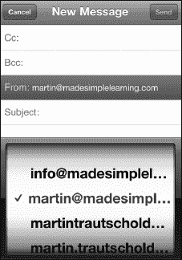

## 输入主题

现在您需要为邮件输入主题。请按以下步骤操作：

1.  点击`主题:`行，并为邮件的`主题:`字段输入文本。
2.  按下`回车`键，或点击邮件的`正文`区域，将光标移至`正文`部分。

    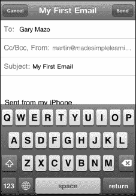

## 输入邮件内容

现在光标位于邮件的`正文`部分（主题行下方），您可以开始输入邮件内容了。

**注意：** 您的 iPhone 上只有一个邮件签名，它会自动应用到您从 iPhone 发出的每一封邮件——即使您设置了多个电子邮件账户。因此，如果您同时经营两家不同的企业，或不希望您的个人邮件签名发送给所有商务联系人，请务必谨慎。最好将邮件签名设置得较为通用。

### 格式化文字、定义词语、引用文本等

您可以点击任意文本以将其选中，并使用蓝色手柄扩大选择范围。然后通过选中文本上方弹出的菜单，执行以下任何操作：

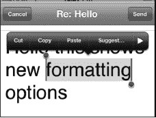

-   点击`剪切`、`复制`或`粘贴`执行相应功能。
-   如果单词带有下划线且您想修正拼写，请点击`建议`。
-   点击右侧边缘的三角形可查看更多选项。
-   点击`B / U`可将格式调整为`粗体`、`斜体`或`下划线`。

    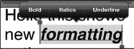

-   点击`定义`可在字典中查询所选单词。
-   点击`朗读`可听取该单词的发音。
-   点击`引用级别`可增加或减少所选文本的引用级别。

    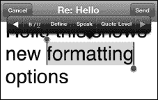

### 邮件签名

默认的邮件签名如右图所示：`发自 iPhone`。

**提示：** 您可以将此签名更改为您想要的任何内容；请参阅本章后面“更改您的电子邮件签名”部分，了解如何更改您的电子邮件签名。

## 键盘选项

输入时，请记住您有两种键盘选项：较小的`竖屏`（纵向）键盘和较大的`横屏`（横向）键盘，请参阅图 17–2。

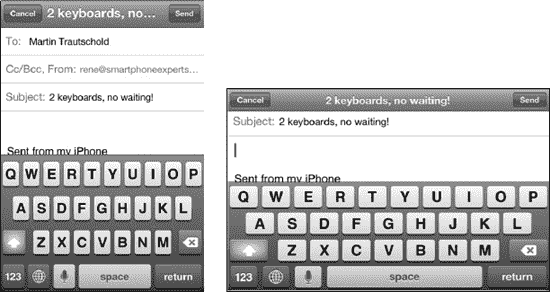

**图 17–2.** *将设备侧向旋转，即可使用更大的横屏键盘。*

**提示：** 如果您手比较大，使用更大的键盘输入可能会更轻松。一旦您习惯用双手在大键盘上输入，就会发现它比单指输入快得多。更多输入技巧，请参阅第 2 章：“输入、拷贝与搜索”。

## 自动更正与自动大写

输入时，您会注意到有些单词会自动大写并被自动更正。拼写检查器会将带有红色下划线的单词标记为拼写错误。请参阅第 2 章：“输入、拷贝与搜索”了解所有这些功能的工作方式；本章还提供了一些额外的输入技巧。

## 发送邮件

输入完邮件后，点击右上角的蓝色`发送`按钮。

您的邮件将会被发送，并且您应该会听到 iPhone 的邮件发送提示音，这确认您的邮件已发送。您可以在第 9 章：“个性化与安全”中的“调整 iPhone 声音”部分了解如何启用或禁用此声音。

### 保存为草稿以便稍后发送

如果您尚未准备好发送邮件，但想将其保存为草稿以便稍后发送，请按以下步骤操作：

1.  按照前述方法撰写邮件。
2.  按下左上角的`取消`按钮。
3.  选择屏幕底部的`保存草稿`按钮。

    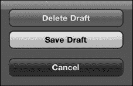

稍后，当您想找到并发送草稿邮件时，请按以下步骤操作：

1.  在您撰写此邮件的电子邮件账户中打开`草稿`文件夹。如需帮助进入`草稿`文件夹，请参阅本章前面的“在邮件文件夹中移动”部分。
2.  点击`草稿`文件夹中的邮件以将其打开。
3.  点击邮件中的任意位置进行编辑。
4.  点击`发送`按钮。

### 检查已发送的邮件

按以下步骤确认邮件是否已正确发送：

1.  点击左上角的**电子邮箱账号名称**按钮，查看您刚刚用来发送邮件的账号下的邮件文件夹。
2.  点击`已发送`文件夹。
3.  确认您在列表中看到的第一封邮件就是您刚刚撰写并发送的那一封。

    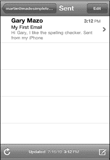

**注：** 只有当您在 iPhone 上确实从该账号发送或删除了邮件后，才会看到`已发送`和`废纸篓`文件夹。如果您的邮箱账号是 IMAP 账号，您可能会看到比本章所述更多的文件夹。

### 阅读与回复邮件

按以下步骤阅读您的邮件：

1.  使用本章前面描述的步骤，导航至您要查看的邮箱账号的收件箱。
2.  要阅读任意邮件，只需在收件箱中点击它。
3.  新的、未读的邮件会在邮件左侧显示一个小蓝点。
4.  在收件箱中向上或向下滑动手指，可以滚动浏览您的邮件。
5.  阅读邮件时，向上或向下滑动即可滚动查看。

    

#### 将邮件标记为未读或加注旗标

如果您阅读了一封邮件但希望确保稍后能快速找到它，您可以选择将其标记为`未读`或加注`旗标`，以便日后引起您的注意。

按以下步骤`标记`一封邮件：

1.  点击位于时间和日期右侧的`标记`字样。
2.  从弹出的菜单中选择`旗标`或`标记为未读`。

    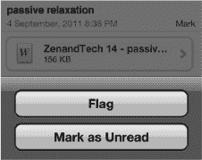

被`标记`旗标的邮件会在`标记`文字的左侧显示一个红色小`旗标`图标。被`标记为未读`的邮件会在`标记`文字的右侧显示一个小蓝点。

要`取消标记`一封邮件：

1.  点击位于时间和日期右侧的`标记`字样。
2.  从弹出的菜单中选择`取消旗标`或`标记为已读`。

    

#### 放大或缩小

与浏览网页时一样，您可以放大以查看更大字体的邮件。您也可以像在网页上那样双击；还可以使用`双指捏合`来放大或缩小（有关这些功能的更多信息，请参阅本书第 1 部分快速入门指南中的“缩放”章节）。

### 电子邮件附件

某些电子邮件附件会被 iPhone 自动打开，因此您甚至可能没有注意到它们是附件。例如，Adobe 的可移植文档格式（PDF）文件（由`Adobe Acrobat`和`Adobe Reader`等应用使用）以及某些类型的图像、视频和音频文件。您也可能会收到文档附件，例如 Apple 的`Pages`、`Numbers`和`Keynote`文件；或 Microsoft 的`Word`、`Excel`和`PowerPoint`文件。这些文件需要您手动打开。

#### 识别何时有附件

任何带有附件的电子邮件都会在发件人姓名旁边显示一个`回形针`图标，如右图所示。当您看到该图标时，即表示有附件。

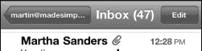

#### 接收自动打开的附件

某些类型的电子邮件附件，如图片、Quicktime 影片和单页 PDF 文件，通常会直接在邮件正文中为您打开并显示。

（但是，如果您使用 3G 数据连接，则需要点击它们才能下载并显示。）

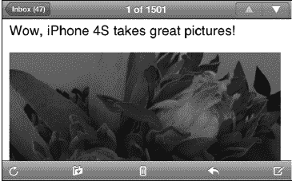

**提示：** 如果您想保存或复制自动打开的附件，只需长按它，直到出现弹出窗口。此时，您可以选择`拷贝`或`存储图像`。当您存储图像后，它会被放入`照片`应用的`相机胶卷`相簿中。

#### 手动打开电子邮件附件

与我们刚才描述的会自动在邮件正文中打开的附件不同，其他类型的附件（如电子表格、文字处理文档和演示文稿文件）需要您手动打开。

##### 轻点以进入快速查看模式

按以下步骤在快速查看模式下打开附件：

1.  打开带有附件的邮件，如图 17-3 所示。
2.  快速轻点附件，即可立即在快速查看模式中打开它。
3.  您可以在文档中导航。请记住，您可以放大或缩小，以及向上或向下滑动。
4.  如果您打开了一个包含多个工作表或表格的电子表格，您会在顶部看到工作表标签。点击另一个标签即可打开该工作表。
5.  查看完附件后，轻点文档一次以调出控制项，然后点击左上角的`完成`。
6.  如果您安装了可以打开当前查看附件类型（本例中为电子表格）的应用，您会在右上角看到一个`在...中打开`按钮。点击`在...中打开`按钮可在其他应用中打开此文件。

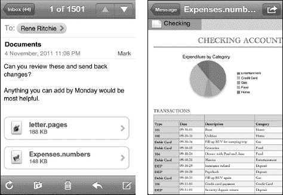

**图 17-3.** *在快速查看模式下查看电子邮件附件。*

##### 在其他应用中打开文档

您可能希望在其他应用中打开附件。例如，您可能想在`Numbers`中打开电子表格，在`iBooks`、`Stanza`或`GoodReader`中打开 PDF 文件。按以下步骤操作：

1.  打开邮件。
2.  长按附件，直到出现弹出窗口。
3.  选择`在...中打开`或`在"Numbers"中打开`选项。当附件格式与您设备上的应用匹配时，您可能会在`在...中打开`后面看到列出的特定应用，如本例中的`Numbers`。

    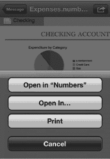

4.  从列表中选择您要使用的应用程序。
5.  最后，您可以编辑文档、保存它，并通过邮件将其回复给发件人。

    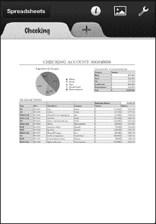

##### 查看视频附件

您可能会收到带有视频附件的电子邮件。某些类型的视频可以在您的 iPhone 上查看（有关支持格式的列表，请参阅本章后面的“支持的电子邮件附件类型”章节）。按以下步骤打开视频附件：

1.  点击视频附件以在视频播放器中打开并观看它。
2.  观看完视频后，轻点屏幕以调出播放器控制项。
3.  点击左上角的`完成`按钮以返回邮件。

    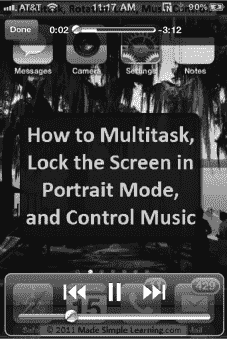

**注：** 这是一张来自本书作者之一 Martin Trautschold 的视频教程的图片，该教程向您展示如何使用 iPhone。请在 Martin 的网站 [`www.madesimplelearning.com`](http://www.madesimplelearning.com) 上查看一些免费的示例教程。

### 打开和查看压缩的 .zip 文件

除非您安装诸如 `GoodReader` 之类的应用，否则您的 iPhone 将无法打开和查看 `.zip` 格式的压缩文件。在撰写本文时，`GoodReader` 仍是一款免费应用，非常值得安装。

**提示：** 了解如何在第 14 章：“书报亭和更多”中安装和使用 `GoodReader`。

请按照以下步骤在程序中打开 `.zip` 文件：

1. 从 App Store 安装免费的 `GoodReader` 应用。
2. 打开带有 `.zip` 文件附件的电子邮件。
3. 长按 `.zip` 附件，直到底部出现一个弹出窗口，其中包含一个显示为 `在“GoodReader”中打开` 的按钮。点击该按钮即可在 `GoodReader` 中打开 `.zip` 文件。

   

4. 现在应打开 `GoodReader`，您的 `.zip` 文件应位于文件列表顶部。要打开或解压缩 `.zip` 文件，请点击它并选择 `解压` 按钮。

   

5. 现在您应该看到解压后的文件——本例中是一个 Adobe `.pdf` 文件，位于 `.zip` 文件上方的文件列表中。
6. 点击该解压后的文件即可查看它。

   

7. 阅读完附件后，双击您的 `主屏幕` 按钮并点击 `邮件` 图标即可返回到阅读邮件。

## 支持的电子邮件附件类型

您的 iPhone 支持以下文件类型作为附件：

*   `.doc` 和 `.docx`（`Microsoft Word` 文档）
*   `.htm` 和 `.html`（网页）
*   `.key`（`Keynote` 演示文稿文档）
*   `.numbers`（`Apple Numbers` 电子表格文档）
*   `.pages`（`Apple Pages` 文档）
*   `.pdf`（Adobe 的便携式文档格式，用于 `Adobe Acrobat` 和 `Adobe Reader` 等程序）
*   `.ppt` 和 `.pptx`（`Microsoft PowerPoint` 演示文稿文档）
*   `.txt`（文本文件）
*   `.vcf`（联系人文件）
*   `.xls` 和 `.xlsx`（`Microsoft Excel` 电子表格文档）
*   `.mp3` 和 `.mov`（音频和视频格式）
*   `.zip`（压缩文件）：只有安装了可以读取它们的应用（例如 `GoodReader`）才能读取——请参阅本章前面的“打开和查看压缩的 .zip 文件”部分。

### 回复、转发或删除邮件

在您的电子邮件阅读窗格底部有一个工具栏。

通过此工具栏，您可以将邮件移动到不同邮箱或文件夹；删除它；或进行回复、全部回复或转发。

点击小的 `箭头` 图标  即可看到这些选项按钮出现：`回复`、`全部回复` 和 `转发`。

**注意：** 仅当电子邮件有多个收件人时，才会显示 `全部回复` 按钮。

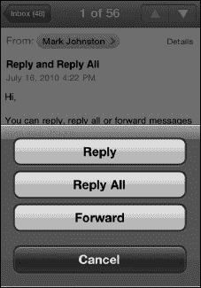

## 回复电子邮件

您可能最常使用 `回复` 命令。请按照以下步骤在您的 iPhone 上回复电子邮件：

1. 点击 `回复` 按钮。

   您会看到原始发件人现在被列为电子邮件 `收件人：` 行中的收件人。主题将自动显示为：“回复：(原始主题行)”。

2. 输入您的回复。
3. 完成后，只需点击屏幕右上角的蓝色 `发送` 按钮。

   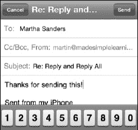

## 使用全部回复

使用 `全部回复` 选项与使用 `回复` 功能类似，不同之处在于原始邮件的所有收件人和原始发件人都被填入地址行。原始发件人将位于 `收件人：` 行，而原始邮件的所有其他收件人将列在 `抄送：` 行。只有当原始邮件有多个收件人时，您才会看到 `全部回复` 选项。

**警告：** 使用 `全部回复` 时要小心。如果某些收件人因为超出屏幕边缘而未显示在原始邮件中，这可能会很危险。如果您确实使用了 `全部回复`，请务必检查 `收件人：` 和 `抄送：` 列表，以确保所有人都应接收您的回复。

## 使用转发按钮

有时，您会收到想要发送给其他人的电子邮件。`转发` 命令可让您实现此操作（更多关于处理附件的内容，请参阅本章的“电子邮件附件”部分）。

**注意：** 您需要转发附件才能将它们发送给其他人。如果您想将收到的电子邮件中的附件发送给某人，则必须选择 `转发` 选项。（请注意，选择 `回复` 和 `全部回复` 选项不会在您外发的邮件中包含原始电子邮件附件。）

当您点击 `转发` 按钮时，可能会提示您选择是否 `包含或不包含` 原始邮件中的附件。

此时，您按照之前描述的相同步骤输入您的消息、添加收件人并发送。

### 清理和整理您的收件箱

当您越来越习惯将 iPhone 作为电子邮件设备使用时，您会发现自己越来越多地使用 `邮件` 程序。最终，偶尔进行一些电子邮件清理工作将变得必要。您可以轻松地在 iPhone 上删除或移动电子邮件。

## 删除单封邮件

要从收件箱中删除单封邮件，请按以下步骤操作：

1. 在收件箱中向左或向右滑动一封邮件，调出 `删除` 按钮。
2. 点击 `删除` 即可移除该邮件。

   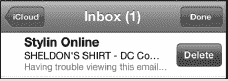

## 删除、移动或标记多封邮件

我们之前在本章的“移动、删除或标记（旗帜）多封邮件”部分向您展示了如何完成此操作。

## 从邮件查看屏幕删除

`邮件` 查看屏幕提供了另一种删除邮件的方式。打开任意邮件进行阅读，然后点击屏幕底部中央的 `垃圾桶` 图标 。您会看到邮件缩小并飞入 `垃圾桶` 中，从而被删除。

**提示：** 您可以使用 `设置` 应用让您的 iPhone 在删除邮件前询问您。为此，请点击 `邮件、通讯录、日历`，然后将 `删除前询问` 旁边的开关设置为 `打开`。

您可以通过将邮件移动到其他文件夹来整理邮件。可以将电子邮件从收件箱移出以便存储或稍后阅读。

**注意：** 如果您使用的是 iCloud 或其他受支持的电子邮件服务器，您可以直接在设备上创建、重命名或删除邮件文件夹，请参阅本章前面的“添加或编辑电子邮件文件夹或邮箱”部分。如果这对您无效，那么您需要在您的主电子邮件帐户中设置它们，并将其同步到您的 iPhone。我们将在本章的“微调您的电子邮件设置”部分向您展示如何执行此操作。

## 在查看邮件时将其移至文件夹

有时，您可能希望整理电子邮件以便日后轻松检索。例如，您可能会收到一封有关即将到来的旅行的电子邮件，并希望将其移动到“旅行”文件夹。有时您会收到需要稍后处理的电子邮件，在这种情况下，您可以将它们移动到“需要关注”文件夹。这可以帮助您记住稍后处理此类邮件。

请按照以下步骤移动电子邮件：

1. 打开该电子邮件。
2. 点击右上角的 `移动` 图标。
3. 选择一个新文件夹，该邮件将从当前收件箱中移出。

   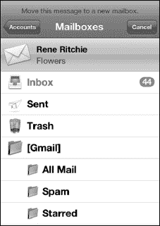

### 从电子邮件中复制粘贴

以下是从电子邮件中选择文本或图片并复制的一些技巧：

- 双击文本选中一个单词，然后上下拖动蓝色手柄调整选择范围。接着选择 `Copy`。

  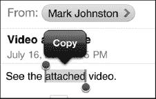

- 长按文本，然后选择 `Select` 或 `Select All`。

  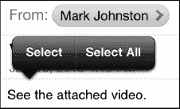

- 长按图片，然后选择 `Save Image` 或 `Copy`。

  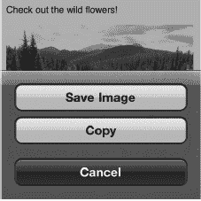

如需更完整的说明，请查阅第 2 章：“打字、复制与搜索”中的“复制和粘贴”部分。

### 搜索电子邮件

iPhone 内置了强大的搜索功能，可以帮助您查找电子邮件。您可以按 `From:`、`To:`、`Subject` 或 `All` 字段搜索收件箱。这有助于筛选收件箱，从而精确找到您想要的内容。

#### 激活电子邮件搜索

启动电子邮件搜索非常简单。首先，导航至您要搜索的账户的 `inbox`。如果向上滚动到顶部，您会在 `inbox` 顶部看到熟悉的 `Search` 栏。

如果您的电子邮件账户支持此功能，您还可以在服务器上搜索电子邮件。在撰写本文时，支持搜索的电子邮件账户类型包括 `Exchange`、iCloud（原名 `Mobile Me`）和 `Gmail IMAP`。请按照以下步骤在服务器上搜索电子邮件：

1.  `Tap`（轻点）`Search` 栏，在 `Search` 栏下方会显示一个新的软键菜单。
2.  输入您要搜索的文本。
3.  `Tap one of the tabs`（轻点搜索窗口下的其中一个标签）：

    - `From`：仅搜索发件人的电子邮件地址。
    - `To`：仅搜索收件人的电子邮件地址。
    - `Subject`：仅搜索邮件`Subject`（主题）字段。
    - `All`：搜索邮件的所有部分。

    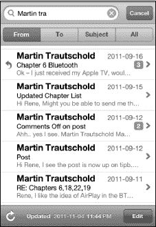

例如，假设我们想在收件箱中搜索来自“Martin”的电子邮件。我们可以在 `Search` 框中输入 Martin 的名字，然后轻点 `From`。收件箱将被筛选，只显示来自 Martin 的电子邮件。

### 精细调整电子邮件设置

您可以通过`设置`应用中的众多选项来精细调整 iPhone 上的电子邮件账户。请按照以下步骤更改这些设置：轻点`设置`图标，然后轻点`邮件、通讯录、日历`。后续部分将解释您可以进行的调整。

#### 自动检索电子邮件（获取新数据）

除了`高级`选项外，您还可以使用`邮件`设置来配置电子邮件获取或拉取到 iPhone 的频率。默认情况下，当服务器“推送”时，您的 iPhone 会自动接收邮件或其他联系人或日历更新。

您可以通过以下步骤调整此设置：

1.  轻点`设置`应用。
2.  轻点`邮件、通讯录、日历`。
3.  在列出的电子邮件账户下轻点`获取新数据`。

    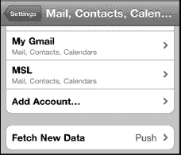

4.  将`推送`设为`开启`（默认）以自动让服务器推送数据。将其设为`关闭`以节省电池电量。
5.  调整从服务器拉取数据的时间计划。这决定了应用从服务器拉取新数据的频率。

    **注意：** 如果将此选项设置为`每 15 分钟`，您将更频繁地收到更新；然而，与设置为`每小时`或`手动`相比，此选项会牺牲电池续航。

    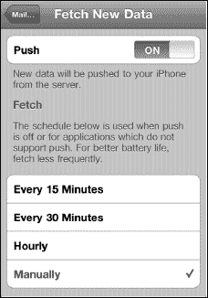

如果您只想打开 iPhone 就能看到有新消息，自动检索功能非常方便；否则，您需要记得手动检查。

##### 高级推送选项

在`获取新数据`屏幕底部，`每小时`和`手动`设置下方，您可以轻点`高级`按钮，查看列出了所有电子邮件账户的新屏幕。

轻点任意电子邮件账户以调整其设置。

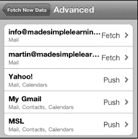

大多数账户可以按您设置的时间表进行`获取`或设置为`手动`。`手动`选项要求您使用`更新`按钮来检索数据。此屏幕让您能够为已设置的每个账户调整`获取`、`手动`甚至`推送`设置。

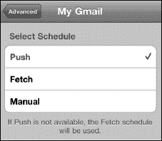

#### 调整邮件设置

在`账户`部分下方，您可以在`邮件`下看到所有电子邮件设置。`默认`设置可能对您来说效果不错；但如果您需要调整其中任何一项，可以按照以下步骤操作：

**显示**：这设定了从服务器拉取的邮件数量。您可以指定 50 到 1,000 条消息（默认值为 50 条最近消息）。

**预览**：此选项让您设置在收件箱`预览`中除了`主题`之外显示的文本行数。您可以将此值从`无`调整为`5 行`（默认值为`2 行`）。

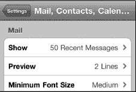

**最小字体大小**：这是首次打开邮件时显示的默认字体大小。这也是在查看邮件时允许缩放到的最小字体大小。您的选项有`小`、`中`、`大`、`特大`和`巨大`（默认值为`中`）。

**提示：** 您可以在设置的“辅助功能”区域进一步放大字体大小。更多详情请查看第 2 章：“打字、复制与搜索”。

**显示收件人/抄送标签**：开启此选项后，您会在收件箱中的主题前看到一个小`收件人`或`抄送`标签。此标签显示您的地址位于哪个字段（此选项的默认状态为`关闭`）。

**删除前询问**：开启此选项后，每次尝试删除邮件时都会询问您（默认值为`关闭`）。

**载入远程图像**：此选项允许您的 iPhone 加载某些电子邮件中包含的所有图形（远程图像）（此选项的默认值为`开启`）。

**按主题整理**：此选项将相关电子邮件分组在一起。它只显示一条消息，并在旁边显示一个数字。该数字表示存在多少封相关邮件。此功能让您能够将所有讨论集中在一个地方（此选项的默认值为`开启`）。

**始终密送给自己**：此选项会将您从 iPhone 发送的每封电子邮件以密件抄送（`Bcc:`）方式发送到您的电子邮件账户（此选项的默认值为`关闭`）。

#### 更改电子邮件签名

默认情况下，您发送的电子邮件会显示“发送自我的 iPhone”。请按照以下步骤更改电子邮件的`签名`行：

1.  轻点`签名`标签，然后在从 iPhone 发送的邮件底部输入您想要的新电子邮件签名。
2.  编辑完`签名`字段后，轻点左上角的`邮件、通讯录…`按钮。这将返回到`邮件`设置界面。

    

#### 更改默认邮件账户（发件账户）

如果您在 iPhone 上设置了多个电子邮件账户，您应将其中的一个——通常是您最常用的那个——设置为`默认账户`。当您从`邮件`界面选择`写邮件`时，默认账户总是被选中。请按照以下步骤更改默认发送邮件的电子邮件账户：

1.  轻点`默认账户`选项，您将看到所有电子邮件账户的列表。
2.  轻点您想用作`默认账户`的电子邮件账户。
3.  操作完成后，轻点`邮件、通讯录…`按钮返回到`邮件`设置菜单。

    

### 切换收发邮件的声音

每次收发邮件时，您可能会注意到一点音效。您听到的是 iPhone 上的默认设置。

如果您想关闭或更改此设置，可在 `设置` 程序中进行操作：

1. 点击 `设置` 图标。
2. 点击 `声音`。
3. 您会看到多个用于开启或关闭声音效果的开关。点击 `新邮件` 和 `发送邮件` 来选取您的邮件铃声选项。

## 高级邮件选项

**注意：** 设置为 `Exchange`、`IMAP` 或 `iCloud` 的电子邮件账户不会显示此 `高级` 邮件设置屏幕。此设置仅适用于 POP3 电子邮件账户。

要进入每个电子邮件账户的 `高级` 选项，请按照以下步骤操作：

1. 点击 `设置` 图标。
2. 点击 `邮件、通讯录、日历`。
3. 点击 `账户` 下列出的一个电子邮件地址。
4. 在邮件设置弹出窗口的底部，点击 `高级` 按钮以调出 `高级` 对话框。

### 从 iPhone 上删除邮件后的移除设置

您可以设置在邮件被删除后，完全从 iPhone 上移除的频率。

点击 `移除` 标签，然后选择最适合您的选项；默认设置为 `永不`。

### 使用 SSL 和认证

`SSL` 和 `认证` 功能之前已经讨论过；不过，此屏幕为您提供了另一个位置来为特定电子邮件账户访问这些功能。

### 从服务器删除

您可以配置 iPhone 如何处理从邮件服务器删除邮件。通常，此设置保留为 `永不`，此功能由您的主电脑处理。但是，如果您将 iPhone 作为主邮件设备使用，您可能希望从手机本身处理该功能。请按照以下步骤从 iPhone 上删除服务器上已删除的邮件。

1. 点击 `从服务器删除` 标签，选择最符合您需求的功能：`永不`、`七天后` 或 `从收件箱移除时`。
2. 默认设置为 `永不`。如果您想选择 `七天后`，该选项应为您提供足够的时间在电脑和 iPhone 上检查邮件，然后决定保留和删除哪些邮件。

### 更改收件服务器端口

正如您之前对 `发件服务器端口` 所做的操作一样，如果您在接收邮件时遇到问题，可以更改 `收件服务器端口`。您遇到与收件端口相关问题的可能性非常小；因此，您很少需要更改此数字。如果您的电子邮件服务提供商给您提供了不同的号码，只需点击数字并输入新的端口。`收件服务器端口` 的值通常为 `995`、`993` 或 `110`；不过，端口值也可能是其他数字。

## 邮件问题故障排除

通常，您的邮件在 iPhone 上运行完美。然而，有时您的邮件可能无法像您期望的那样完美运行。这可能是由于服务器问题、网络连接问题或电子邮件服务提供商的要求未得到满足所致。

大多数情况下，只需要调整一个简单的设置或重新输入密码。

如果您尝试了一些后续的故障排除提示，但您的邮件仍然无法正常工作，那么您的邮件服务器可能只是暂时宕机。请与您的电子邮件服务提供商核实，确保您的邮件服务器正常运行；您还可以检查您的提供商是否进行了任何可能影响您设置的最新更改。

**提示：** 如果后续的提示未能解决问题，请查看第 26 章：“故障排除”以获取更多有用的提示和资源。

### 无法接收或发送邮件

如果您无法发送或接收邮件，第一步应该是确认您已连接到互联网。可通过查看 `主屏幕` 左上角的网络连接符号来确认（详见第 4 章：“连接到网络”）。

有时，您需要调整发件端口才能正确发送邮件。请按照以下步骤操作：

1. 点击 `设置`。
2. 点击 `邮件、通讯录和日历`。
3. 在 `账户` 下，点击您在发送邮件时遇到问题的电子邮件账户。
4. 点击 `SMTP` 并确认您的发件服务器设置正确；同时检查其是否设置为 `开`。
5. 点击顶部的 `发件服务器` 并确认所有设置，例如 `主机名`、`用户名`、`密码`、`SSL`、`认证` 和 `服务器端口`。您也可以尝试将 `服务器端口` 值设为 `587`、`995` 或 `110`；有时这会有帮助。
6. 点击 `完成`，然后点击左上角的电子邮件账户名称，返回此账户的 `邮件` 设置屏幕。
7. 向下滚动到底部并点击 `高级`。
8. 在此屏幕上，您也可以尝试为服务器端口设置不同的端口值，例如 `587`、`995` 或 `110`。如果这些值不起作用，请联系您的电子邮件服务提供商以获取不同的端口号并确认您的设置。

