# 第 18 章

## 通讯录和备忘录

您的 iPhone 让您能即时访问所有重要信息。就像您的电脑一样，您的 iPhone 可以存储数千个联系人以便轻松查找。在本章中，我们将向您展示如何添加新联系人、通过添加新字段自定义联系人、用群组整理联系人、快速搜索或滚动浏览联系人，甚至使用 iPhone 的 `地图` 应用查看联系人的位置。我们还将向您展示如何自定义 `通讯录` 视图，使其按您喜欢的方式排序和显示。最后，我们将介绍一些故障排除提示，当您遇到困难时可以节省时间。

我们还将向您概述 `备忘录` 应用，您可以用它来写笔记、制作购物清单、列出您想看的电影或想读的书籍。我们将向您展示如何整理备忘录，以及如何将备忘录通过电子邮件发送给自己或他人。理想情况下，我们希望 `备忘录` 在 iPhone 上能变得如此便捷，以至于您最终可以丢弃大部分（即使不是全部）纸质便签！

同样很棒的是，您可以使用 `iCloud` 来无线同步、共享和备份您的通讯录和备忘录。因此，您再也不用担心丢失重要信息，或担心您的设备或电脑上是否拥有最新信息。

### 将通讯录加载到 iPhone 上

第 3 章：“与 iCloud、iTunes 及更多同步”介绍了如何使用 Mac 或 Windows 电脑上的 `iTunes` 应用将通讯录加载到 iPhone 上。您也可以使用 Google Sync 或 iCloud 服务将通讯录加载到手机。

**提示：** 您可以从收到的电子邮件中添加新的联系人条目。了解具体方法请参见第 17 章：“使用电子邮件通信。”

## 通讯录列表何时最有用？

当满足以下两个条件时，`通讯录` 应用最为有用：

1. 其中存储了大量姓名和地址。
2. 您可以轻松找到所需信息。

#### 优化你的通讯录

我们有一些基本规则，可以帮助你让 iPhone 上的通讯录更有用：

**规则 1：将任何内容都添加到通讯录中。**

> 你永远不知道何时会需要那家不起眼的餐厅名字、水管工的电话号码等等。

**规则 2：添加条目时，务必考虑将来如何找到它们（名字、姓氏、公司）。**

> 我们在本章中提供了许多技巧和方法来帮助你输入姓名，以便你在需要时能立刻找到它们。

**提示**：这里有一个查找餐厅的好方法。每当你在通讯录中添加一家餐厅时，务必在“公司”字段中输入“餐厅”这个词，即使它本身不是店名的一部分。当你输入“餐”这个字时，你就能立刻找到所有你添加的餐厅了！

### 在 iPhone 上添加新联系人

你可以随时直接在 iPhone 上添加联系人。当您不在电脑旁——但带着 iPhone——又需要将某人添加到通讯录时，这非常方便。操作起来很简单；下一节将向你展示具体方法。

#### 启动“通讯录”应用

在主屏幕上，点击**通讯录**图标，你会看到**所有联系人**列表。点击右上角的**加号**按钮（**+**）来添加新联系人，如图 18-1 所示。

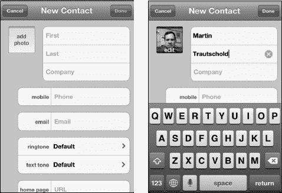

**图 18-1.** *输入新的联系人姓名*

点击每个字段来输入新联系人的名字、姓氏和公司名称。

**提示**：请记住，联系人搜索功能会使用名字、姓氏和公司名称。当你添加或编辑联系人时，在公司名称中添加一个特殊词语可以帮助你日后快速找到特定联系人。例如，在**公司**字段中添加“思思朋友”这个词，就可以利用搜索功能快速找到思思的所有朋友。

在**姓名**按钮下方，有**手机**、**电子邮件**、**铃声**、**短信铃声**、**主页**、**添加新地址**和**添加字段**等字段。再往下，你可以关联联系人。

#### 添加新电话号码

点击**电话**按钮，使用**数字**键盘输入电话号码。

**提示**：不用担心括号、破折号或点号——iPhone 会自动将号码格式化为正确格式。只需输入区号和号码的数字即可。如果你知道国家代码，最好也一并输入。

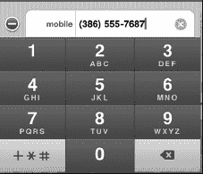

接下来，选择这个电话号码的类型——是手机、住宅、工作还是其他。有九个字段可供选择，如果觉得内置字段都不适用，还有一个**自定**字段。

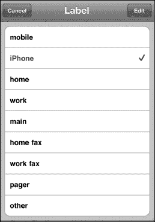

**提示**：有时你需要在电话号码中添加一个暂停——例如，当电话号码属于某个机构的人员，你需要先拨打总机号码，再拨打分机号。在 iPhone 上很容易做到。只需点击**符号**按钮（`+*#`），然后点击**暂停**或**等待**。**暂停**会在总机号码和分机号之间添加一个逗号，像这样：`386-555-7687, 19323`。当你拨打这个号码时（例如，在你的 iPhone 上），你的手机将先拨打总机号码，暂停两秒钟，然后拨打分机号码。如果需要更长的暂停时间，只需添加更多逗号。**等待**会在主号码和分机号（或会议 ID，或其他需要输入的额外数字）之间添加一个分号。一旦第一个号码拨通，屏幕上会出现一个带有额外号码的第二个按钮。点击它即可拨打这些号码。

#### 添加电子邮件地址

点击**电子邮件**标签页，输入联系人的电子邮件地址。你也可以点击电子邮件地址左侧的标签，选择这是住宅、工作还是其他电子邮件地址。

添加一个地址后，你会看到另一个字段出现，以便添加更多电子邮件地址。

#### 自定义铃声或短信铃声

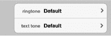

点击**铃声**或**短信铃声**标签页，为这个人来电或发送短信时选择自定义的铃声或短信铃声。

#### 输入网站地址

你还会看到一个**主页**字段，你可以在其中输入联系人网站的地址，甚至可以输入多个网站地址。

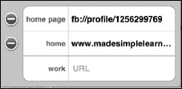

**注意**：如果你使用 iCloud 同步通讯录，iCloud 可能会自动查找 Facebook 主页并将其整合到联系人信息中。

#### 添加街道地址

在**住宅**字段下方是用于添加地址的字段。输入**街道**、**城市**、**州/省**和**邮政编码**。你还可以指定**国家/地区**以及这是住宅还是工作地址。

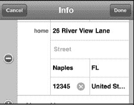

#### 添加新字段

点击**添加字段**标签页，然后选择任意建议的字段，将其添加到该特定联系人中（参见图 18-2）。

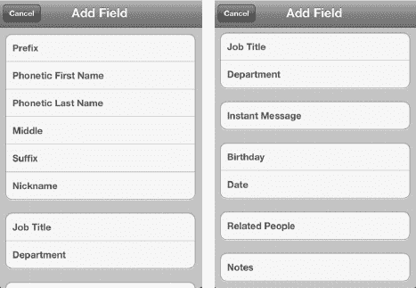

**图 18-2.** *可添加到联系人条目中的新字段*

当你点击**生日**时，会看到一个滚轮。你可以转动滚轮到相应日期，将生日添加到联系人信息中。

完成所有操作后，只需点击**新联系人**表单右上角的**完成**按钮即可。

**提示**：假设你在公交车站遇到了某个人——一个你想记住的人。当然，你应该输入这位新朋友的名字和姓氏（如果你知道的话）；不过，你还应该在**公司名称**字段中输入“公交车站”这几个字。这样，当你输入“公交”或“车站”时，就能立刻找到所有你在公交车站遇到的人，即使你记不住他们的名字！

### 为联系人添加照片

你可能想为联系人关联一张照片。在我们一直使用的**新联系人**屏幕上，只需点击**姓名**标签旁边的**添加照片**按钮即可。

如果你在“编辑联系人”模式下更换照片，你会在现有照片底部看到**编辑**按钮。

点击**添加照片**按钮后，你会看到可以执行以下操作：

*   拍照
*   选取照片

如果已有照片，你还可以执行以下操作：

*   编辑照片
*   删除照片

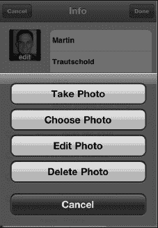

要选取现有照片，请选择照片所在的相册并点击相应的标签。当你看到想要使用的照片时，只需点击它。

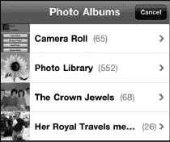

你会注意到照片的顶部和底部会变成灰色，并且你可以通过移动、捏合放大或缩小来调整图片，然后在**图片**窗口中进行排列。

一旦图片放置在所需位置，只需点击右下角的**选取**按钮，该图片就会被设置为该联系人的照片。

**提示**：如果你刚搬到一个新社区，记住每个人的名字可能会让人头疼。因此，一个很好的做法是，为你遇到的每一位邻居在**公司名称**字段中添加“邻居”这个词。要立刻调出所有邻居，只需输入“邻居”这几个字，就能找到你遇到过的所有人了！

### 搜索联系人

假设您需要查找某个特定的电话号码或电子邮件地址。只需像之前一样轻点`通讯录`图标，即可在`所有联系人`列表的顶部看到一个`搜索`框（参见图 18-3）。

**提示：** 如果您当前位于`通讯录`列表的中部或底部，只需轻点 iPhone 屏幕最上方的显示时间，即可快速跳转到`通讯录`屏幕的顶部，并看到这个`搜索`窗口。

**图 18-3.** *通讯录`搜索`框*

要查找某个联系人，请在以下三个可搜索字段中的任意一个中输入前几个字母：

- 名字
- 姓氏
- 昵称
- 公司名称

iPhone 会立即开始过滤，并仅显示与所输入字母匹配的联系人。

**提示**：若要进一步缩小搜索范围，请按`空格`键，然后继续输入几个字母。

当您看到正确的名字时，轻点它，该联系人的详细信息便会显示出来。

#### 通过轻点并滑动字母表快速跳转到特定字母

将手指按住屏幕左侧边缘的字母表，然后向上或向下拖动，即可跳转到相应的字母。

#### 通过轻拂手势搜索

如果您不想手动输入字母，只需移动手指并自下而上轻拂屏幕，您会看到联系人列表在屏幕上快速滚动。继续轻拂或滚动，直到看到您要找的名字。轻点该名字，此人的联系信息便会显示出来。

#### 使用群组搜索

如果您在 PC 或 Mac 上对联系人进行了分组，并通过 iCloud 将 iPhone 与电脑同步或进行无线同步，那么这些群组也会同步到您的 iPhone 上。启动`通讯录`应用后，您会看到顶部的`群组`选项。在`群组`标题下，您会看到`所有联系人`。

选择`所有联系人`可以搜索 iPhone 上所有可用的联系人信息。

如果您同步了多个账户，您会看到每个账户都有一个单独的标签，顶部还有一个`所有联系人`标签。

此示例显示两个群组——一个来自 Microsoft Exchange 账户（即公司电子邮件账户），另一个来自 iCloud 联系人群组。

如果您有一个 Exchange ActiveSync 账户，并且您公司已启用此功能，那么贵公司的 Exchange 全局地址列表也会显示在此处的`群组`下方。您可以在此搜索到公司内的任何人。

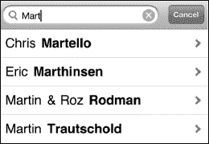

**注意**：您无法在 iPhone 上的`通讯录`应用中创建群组——必须在电脑上创建，或者在向 iPhone 添加联系人账户时进行同步。

### 从电子邮件中添加联系人

您经常会收到一封电子邮件，然后发现发件人并不在您的通讯录中。从电子邮件中添加新联系人非常容易。

打开来自您想添加到`通讯录`列表中的联系人的电子邮件。接着，在邮件的`发件人`字段，轻点`从:`标签旁的发件人姓名。

如果发件人不在您的通讯录中，系统会跳转到一个屏幕，让您选择是将此电子邮件地址添加到现有联系人，还是创建一个新联系人。

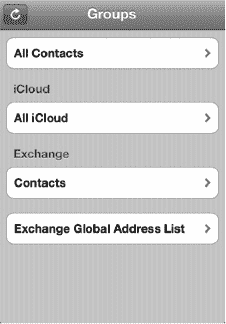

如果您选择`创建新联系人`，系统会跳转到我们之前见过的`新联系人`屏幕（参见图 18-1）。

但假设这是某人的个人电子邮件地址，而您已经有一个包含此人工作电子邮件地址的条目。在这种情况下，您应该选择`添加到现有联系人`，然后选择正确的那个人。接着，您可以为这个电子邮件地址赋予一个新的标签——在此例中，使用*个人*。

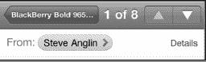

#### 将联系人链接到其他应用

您可能在手机上的另一个应用中存有电子邮件发件人的联系信息。iPhone 让链接这些联系人变得很容易。

例如，假设邮件的发件人 Steve 在您的 LinkedIn 联系人列表中，但由于某种原因，他并不是您 iPhone 上的联系人。以下是您如何将他 iPhone 中的联系信息链接到`LinkedIn`应用中的信息：

1.  按照之前的方法，将他的信息添加到您的通讯录中。
2.  启动`LinkedIn`应用——有关此主题的更多信息，请参见第 25 章：“社交网络”。
3.  在`LinkedIn`应用中找到 Steve 的联系信息，以确认他确实存在。
4.  点击`连接`图标。
5.  选择右上角的`下载全部`。
6.  `LinkedIn`应用会告知您，此操作将添加此联系人关联的照片、当前公司和职位、电子邮件地址以及网站（参见图 18-4）。
7.  这正是您希望在 iPhone 通讯录中拥有的信息，因此选择`下载所有新联系人`。
8.  Steve 的照片和更新后的信息便会导入到他 iPhone 上的联系人信息中。

**图 18-4.** *将电子邮件中的新链接到现有的社交网络联系人*

**提示**：记住学龄儿童朋友的父母名字可能相当有挑战性。不过，在`名字`字段中，您不仅可以添加您孩子朋友的名字，还可以添加孩子父母的名字（例如，`名字：萨曼莎（妈妈：苏珊，爸爸：罗恩）`）。然后，在`公司`字段中，添加您孩子的名字和“同学”字样（例如，`茜茜的童鞋`）。现在，只需在`所有联系人`列表的`搜索`框中输入您孩子的名字，就能立刻找到所有您在学校见过的联系人。这样您就可以毫不迟疑地说：“你好，苏珊，很高兴再次见到你！”*请尽量不动声色地查看名字。*

### 向联系人发送照片

如果您想向联系人发送照片，则需要通过`照片`应用进行操作（请参见第 20 章：“使用照片”）。

### 从通讯录发送电子邮件

许多核心应用（例如`通讯录`、`邮件`和`信息`）都完全集成在一起，因此一个应用可以轻松触发另一个应用。如果您想向某位联系人发送电子邮件，只需打开该联系人并轻点其电子邮件地址即可。`邮件`应用将会启动，您就可以撰写并向此人发送电子邮件了。

轻点`通讯录`图标来启动`通讯录`应用。通过搜索或轻拂滚动联系人列表，直到找到您需要的联系人。

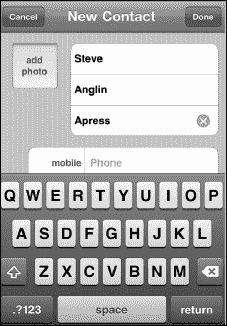

在联系人信息中，轻点您要使用的那个联系人的电子邮件地址。

您会看到`邮件`程序自动启动，并且该联系人的姓名已经填入邮件的`收件人:`字段中。最后，输入邮件内容并发送。

### 在地图上显示联系人的地址

iPhone 的一大亮点是与谷歌地图的集成。这一点在`通讯录`应用中体现得尤为明显。假设你想在地图上查看通讯录中某个联系人的家庭或工作地址。在过去（iPhone 问世前），你不得不使用谷歌地图、MapQuest 或其他程序，然后费力地重新输入或复制粘贴地址信息。这非常耗时——但在 iPhone 上，你无需这样做。

只需像之前那样打开联系人。这一次，点击联系人信息底部的地址。

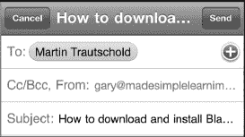

你的`地图`应用（由谷歌地图提供支持）会立即加载，并在联系人的精确位置放置一个`图钉`图标。联系人的姓名将显示在`图钉`上方。

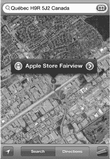

点击`图钉`顶部的标签，进入`信息`屏幕。

现在，你可以选择`路线：到此地`或`路线：从此地出发`。

接着，输入正确的起点或终点地址，然后点击右下角的`路线`按钮。如果你决定不需要路线，只需点击左上角的`清除`按钮。

如果你只是直接在`地图`应用中输入地址，而不是通过联系人列表点击，那该怎么办？在这种情况下，你可以点击`添加到通讯录`来添加此地址。

**提示**：要返回联系人信息，请点击`地图`按钮，退出`地图`，然后启动`通讯录`。你也可以使用多任务功能（参见第 7 章：“多任务与 Siri”），通过双击`主屏幕`按钮并选择`通讯录`应用。

### 更改联系人的排序与显示顺序

与其他设置一样，`通讯录`应用的选项可通过`设置`图标访问。

点击`设置`图标，向下滚动到`邮件、通讯录、日历`，然后点击该标签。

接下来，向下滚动直到看到`通讯录`及其下方的两个选项。要更改排序顺序，请点击`排序顺序`标签，并选择你希望联系人按名字还是姓氏排序。

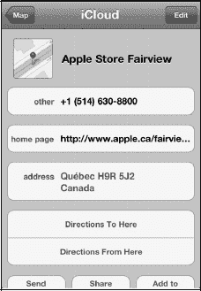

你可能还想更改联系人的显示方式。这正是操作之处；你可以选择`名、姓`或`姓、名`。点击`显示顺序`标签，选择你希望联系人按名字还是姓氏顺序显示。点击左上角的`邮件、通讯录…`按钮以保存设置更改。

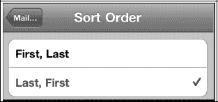

#### 搜索全球通讯录 (GAL) 联系人

如果你配置了 Exchange 帐户，你应该有全局通讯录选项。这样，当你连接到组织的服务器时，就可以访问全局通讯录。

打开你的`通讯录`应用，在 Exchange 下查找名为`Exchange 全局通讯录`的标签。

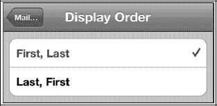

### 通讯录故障排除

有时，你的`通讯录`应用可能无法按预期工作。（如果你没有看到所有联系人，请回顾第 3 章：“与 iCloud、iTunes 等同步”中的步骤，了解如何与你的通讯录应用同步。）确保你在`iTunes`应用的设置中选择了`所有群组`。

**提示**：如果你正在与另一个联系人应用同步，例如 Gmail 中的`通讯录`，那么请确保你选择最接近`所有联系人`的选项，而不是像特定群组这样的子集。

#### 当全局通讯录联系人未显示时（适用于 Microsoft Exchange 用户）

有时全局通讯录中的联系人不会显示在你的 iPhone 上。如果发生这种情况，首先确保你已连接到 Wi-Fi 或 3G 蜂窝数据网络。

接下来，检查你的 Exchange 设置，确认你的服务器和登录信息是否正确。为此，请点击`设置`按钮，然后滚动并点击`邮件、通讯录和日历`。在列表中找到你的 Exchange 帐户，点击它以查看设置。你可能需要联系你组织的技术支持，以确保你的 Exchange 设置正确。

### 备忘录应用

如果你和许多人一样，办公桌上可能贴满了黄色的小便签——记录着各种待办事项。即使有了电脑，我们仍然倾向于留下这些小纸条作为提醒。iPhone 的一大优点是，你可以在熟悉的黄色便签纸上写下笔记，然后整齐有序地整理分类。你甚至可以将其通过电子邮件发送给自己或他人，以确保信息不会被遗忘。你还可以使用 iTunes 备份笔记，并且可以选择将笔记同步到电脑或谷歌等其他网站。

**提示：** iPhone 自带的`备忘录`应用非常基础和实用。如果你需要功能更强大的笔记应用，能够排序、分类、导入项目（PDF、Word 等）、支持文件夹、搜索等，你应该查看 iPhone 上的 App Store。搜索“笔记”，你会找到至少十几个与笔记相关的应用，价格从免费到 0.99 美元及以上不等。

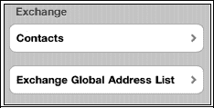

iPhone 上的`备忘录`应用为你提供了一个便捷的地方来保存笔记和简单的“待办事项”列表。你还可以保存简单的列表，例如购物清单，或针对其他商店（如五金店或宠物店）的清单。如果你带着 iPhone，一旦想到要添加的项目，就可以随时添加到这些列表中，并且这些列表可以随时访问和编辑。

#### 同步备忘录

你可以使用我们在第 3 章：“与 iCloud、iTunes 等同步”中介绍的方法，在 iPhone 和 iPad 等 iOS 设备之间，或与你的电脑或其他网站同步备忘录。同步备忘录的好处在于，你可以在电脑上添加一条备忘录，它就会“出现”在你的 iPhone 上。然后，当你外出时，你可以编辑那条备忘录，并将其同步回你的电脑。无需重新输入或记忆事情。你的 iPhone 总是随身携带，因此随时随地记笔记是确保不遗忘任何重要事项的好方法。

#### 备忘录入门

与所有其他应用一样，只需点击`备忘录`图标即可启动它。启动`备忘录`应用后，你会看到一个类似典型黄色记事本的界面。

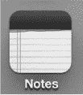

##### 多个备忘录帐户

如果你恰好通过 iCloud、Exchange 或至少一个 IMAP 电子邮件帐户同步，并且通过 iTunes 与电脑同步，那么你会发现来自每个帐户的备忘录都是分开保存的。这很像你的联系人按电子邮件帐户分组，以及你的日历按电子邮件帐户分开的方式。

要查看多个备忘录帐户，你需要在帐户设置屏幕上设置一个开关。

当你设置 IMAP 电子邮件帐户时，在`设置` > `邮件、通讯录、日历`中，你会看到打开或关闭备忘录同步的选项。要查看这些备忘录帐户，你必须将`备忘录`开关设置为`开启`，如下面的 Gmail 帐户所示。

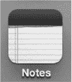

要查看不同的备忘录帐户，请点击`备忘录`应用左上角的`帐户`按钮。

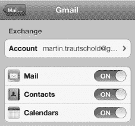

然后，在下一个屏幕上，你可以点击选择查看`所有备忘录`，或每个帐户的备忘录。在此图中，可选择 Gmail 或 MobileMe 帐户。

你添加到单个帐户的备忘录将保留在该帐户中。例如，如果你将备忘录添加到 Gmail，那么它们只会显示在你的 Gmail 帐户中。

### 我的笔记如何排序？

您会看到所有笔记按时间倒序排列，最近编辑的笔记排在最顶部，最早的笔记排在底部。

显示的日期是特定笔记的最后编辑时间，而非首次创建时间。因此您会注意到笔记顺序在屏幕上动态变化。

这种排序方式的好处在于，您最近（或频繁编辑）的笔记会始终排在最顶部。

**提示：** 如果要管理待办事项列表，可以使用 iPhone 自带的“提醒事项”应用。如果需要更强大的功能，不妨在 App Store 中查看 `Things`、`Appigo Todo` 或 `OmniFocus`。

### 添加新笔记

要开始编写新笔记，请点击右上角的加号图标 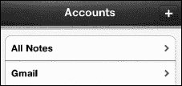。

此时记事本为空白状态，键盘会自动弹出供您输入。

**提示：** 您可以将 iPhone 横屏放置，使用更宽敞的横向键盘。

### 为笔记添加标题

在按下 `Return` 键之前输入的前几个字将成为笔记的标题。因此请先想好标题内容再输入。如图所示，`购物清单` 便成为了该笔记的标题。

每行输入一个新项目，按 `Return` 键换行。

完成后，点击左上角的 `备忘录` 按钮返回主备忘录界面。

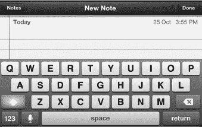

### 查看或编辑笔记

您的笔记会在列表中显示为可点击的标签页。点击要查看或编辑的笔记名称，即可显示该笔记内容。

您可以在“备忘录”中像操作其他程序一样滚动浏览。请注意，右上角会显示笔记的最后编辑日期和时间。

阅读完笔记后，只需点击左上角的 `备忘录` 按钮即可返回主备忘录界面。

要快速浏览多条笔记，请点击屏幕底部的箭头。点击 `前进` 箭头 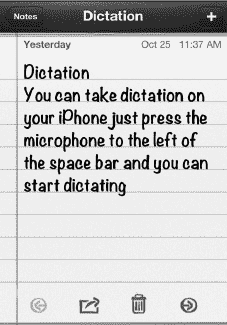 翻页查看下一条笔记；点击 `返回` 箭头  则可后退。

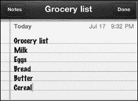

### 使用语音听写功能输入笔记

请记住，iPhone 支持语音听写功能。当您编辑或新建笔记时，轻点空格键左侧的麦克风按钮并开始说话即可。

当您看到底部出现紫色麦克风图标时，说明语音听写功能已启动。紫色区域会随您音量高低上下跳动。

完成后，轻点“完成”即可查看听写效果！

**提示：** 您可以使用语音指令输入标点符号、特殊符号和格式，例如“句号”或“问号”、“左括号”或“右方括号”、“新段落”，甚至“笑脸”。

### 删除笔记

要删除笔记，请在列表中用手指在笔记上从左向右滑动，然后点击 `删除`。或者，如果正在查看该笔记，请点击底部的 `垃圾桶` 图标 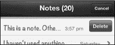。iPhone 会提示您确认删除或取消操作。

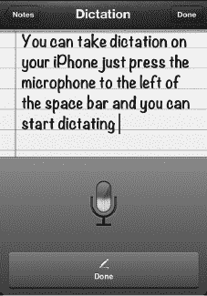

### 通过电子邮件发送或打印笔记

`备忘录` 应用的便捷功能之一，是能够通过电子邮件发送或打印笔记。假设您写了一份购物清单想电邮给配偶，或者列了一份礼品创意清单想分发出去。要电邮或打印笔记，只需点击屏幕底部的 `操作按钮` 图标 。

### 数据检测器 - 带下划线文字的酷炫功能

如果在笔记中输入“明天早上”等词语并保存，下次打开该笔记时，会发现这些词语已添加下划线。长按带有下划线的词语，会看到一个按钮询问是否要“创建事件”。点击该按钮即可为明天早上新建一个日历事件。

**提示：** 每当日期和时间词语出现下划线时，iPhone 会将其识别为潜在的日历事件。此功能适用于“备忘录”、电子邮件以及 iPhone 上的其他位置。iPhone 还具备其他“数据检测器”，例如可以识别电话号码、网址，甚至包裹的追踪编号。

