# 第 19 章

## 日历与提醒事项

iPhone 让曾经贴在冰箱上的老式日历彻底过时。本章将向您展示如何充分利用 iPhone 的`日历`应用。例如，我们将介绍如何安排约会、管理多个日历、切换日历视图，甚至处理会议邀请。

在 iOS 5 中，Apple 新增了`提醒事项`应用，用于轻松管理所有基于时间和地点的任务与待办事项列表！

**注意：** 本章大部分内容将讨论如何将 iPhone 日历与其他日历同步，因为让日历在 iPhone 和其他设备上都能访问非常实用。您也可以选择以*独立*模式使用 iPhone，即不与任何其他日历同步。在后一种情况下，我们描述的所有关于事件、查看和管理的步骤同样适用于您。但务必使用 iCloud 或 iTunes 的自动备份功能保存日历副本，以防 iPhone 发生意外。

### 日历、提醒事项与 Siri

Apple 全新的人工智能个人助理 Siri，可以快速轻松地为您创建日历事件和提醒项目。对于相对简单的操作，Siri 甚至比您通过“老式”点击按钮创建更快捷方便。以下是 Siri 在日历和提醒事项方面的一些功能示例。

*   “显示我明天的日历”。Siri 会显示您所查询日期或日期的所有事件。
*   “安排明天晚上 9 点与老板的会面”。如果存在时间冲突，Siri 还会提醒您。
*   “把我明天晚上 9 点的约会移走”。Siri 会告知您约会是否为重复事件，并提供仅修改当前事件或修改所有未来事件的选项。
*   “显示我的提醒事项”。Siri 会列出您的提醒，您可以快速勾选已完成的项目。
*   “提醒我到公司后给妻子打电话”。Siri 会创建一个基于位置的提醒。
*   “将饼干添加到我的购物清单”。Siri 会创建一个提醒，提示您在名为“购物”的列表中购买饼干。

### 在 iPhone 上管理繁忙生活

`日历`和`提醒事项`应用提供了强大且易用的功能，帮助您管理约会、跟踪待办事项、设置提醒闹钟，甚至创建和回复会议邀请（适用于 Exchange 和 iCloud 用户）。

#### 同步或共享日历与提醒事项

如果你在电脑上维护着日历或任务列表，或者在 iCloud 或 Google 日历等网站上维护着日历，那么你可以通过使用 iTunes 应用和同步线缆，或者设置无线同步（参见第 3 章：“同步 iCloud、iTunes 及其他”，了解同步信息），将数据与你的 iPhone 进行同步或共享。

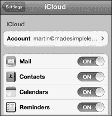

设置好日历和任务同步后，根据你的同步设置，电脑上的所有日历约会和待办事项列表将自动与 iPhone 日历同步（参见图 19–1）。

如果你使用 `iTunes` 与日历同步（例如，Microsoft Outlook 或 Apple 的 `iCal`），每次将 iPhone 连接到电脑时，约会和任务都会被传输或同步。

如果你使用其他方法同步（例如 iCloud、Exchange 或类似服务），此同步是无线的且自动的，在初始设置过程后，你很可能无需任何操作即可完成同步。

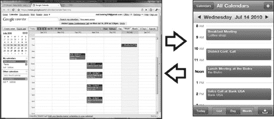

**图 19–1.** *将 PC 或 Mac 日历同步到 iPhone*

#### 日历图标上显示的当天日期

`日历`图标通常就在 iPhone 的`主屏幕`上。你会很快注意到，你的`日历`图标会变化，以显示当天的日期和星期几。右侧的图标显示今天是星期五，也就是本月的第 16^(个) 日。

**提示：** 如果你经常使用 iPhone 的`日历`应用，可以考虑将其固定或移动到底部程序坞；你已在第 6 章：“图标与文件夹”的关于固定图标的部分学习了如何操作。

#### 查看约会并在日历中导航

`日历`应用的默认视图是`日`视图。此视图让你一目了然地看到当天所有即将到来的约会。约会会显示在你的日历中。如果你在电脑上设置了多个日历，例如`工作`和`家庭`，那么不同日历的约会将在 iPhone 日历上以不同颜色显示。

你可以通过多种方式操作日历：

*   **一次移动一天**：如果你轻点顶部当天日期旁边的三角形，可以向前或向后移动一天。

    **提示：** 长按日期旁边的三角形可以快速穿越天数。

*   **更改视图**：轻点底部的`列表`、`日`和`月`按钮来更改视图。
*   **跳转到今天**：轻点左下角的`今天`按钮。

#### 四种日历视图

你的`日历`应用提供四种视图。`日`、`列表`、`周`和`月`视图在竖屏模式下均可使用；你可以通过轻点屏幕底部的视图名称来切换视图。`周`视图仅在横屏模式下可用，你可以通过将 iPhone 侧向旋转来切换到该视图。以下是四种视图的快速概览：

*   **日视图**：启动 iPhone 的`日历`应用时，默认视图通常是`日`视图。这让你可以快速查看当天安排的所有事项。你可以在`日历`应用底部找到更改视图的按钮。

    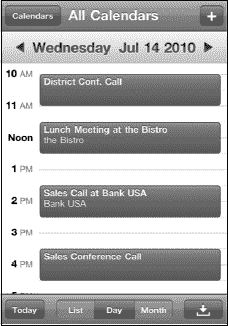

    要移动到下一天，只需从右向左滑动。要回到前一天，则从左向右滑动。

    

*   **列表视图**（也称为**议程**视图）：轻点底部的`列表`按钮，即可查看约会列表。

    根据你安排的事项多少，你可能会看到接下来一天甚至一周的排程事件。

    向上或向下滑动以查看更多事件。

    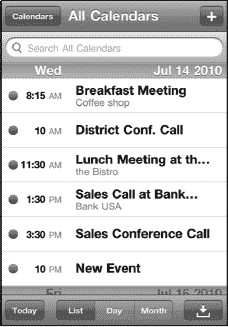

*   **月视图**：轻点底部的`月`按钮，即可查看整个月的布局。有约会的日期会显示一个小圆点。当天的圆点会以蓝色高亮显示。

    **提示：** 要返回`今天`视图，只需轻点左下角的`今天`按钮。

    

    **前往下一个月**：轻点顶部显示的月份右侧的三角形。

    **前往上一个月**：轻点月份左侧的三角形。

    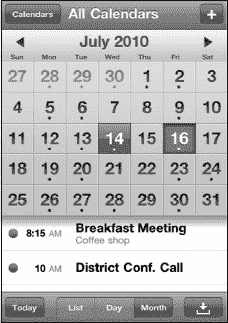

*   **周视图**：将你的 iPhone 侧向旋转至横屏模式，即可访问周视图。

    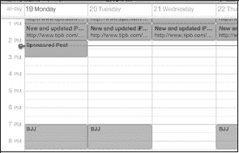

*   向左或向右滑动以查看更多天数。

#### 使用多个日历

`日历`应用允许你查看和使用多个日历。你看到的日历数量取决于你同步的数量。例如，你可能同步了 iCloud 或 Google 日历用于家庭，Exchange 用于工作。

要一次只查看一个日历，请轻点顶部的`日历`按钮，然后仅选择你想查看的日历。

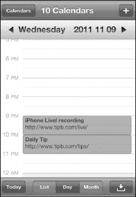

在设置同步参数时，你可以指定要与 iPhone 同步的日历。你可以按照以下说明进一步自定义日历：

*   **更改颜色**：如果你不喜欢 iPhone 上某个日历的颜色，可以轻松更改：
    *   轻点右上角的`日历`按钮。

        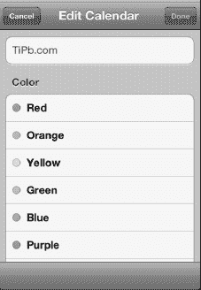

    *   轻点右上角的`编辑`按钮。
    *   轻点要更改的日历。
    *   系统会显示一个颜色选项列表。轻点你需要的颜色，新的颜色便会生效。

*   **添加新日历**：如果你使用 iCloud 同步，则可以在 iPhone 上添加新日历：

    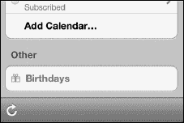

    *   轻点右上角的`日历`。
    *   轻点右上角的`编辑`。
    *   向下滚动并在 iCloud 部分轻点`添加日历…`。
    *   为新日历输入名称并选择颜色，然后大功告成！

### 添加新的日历事件

你可以直接在 iPhone 上轻松添加新事件或约会。这些新事件和约会将在下次同步时同步（或共享）到你的电脑。

#### 添加新约会

你的本能可能是尝试在特定时间点触屏幕来设置约会；在 iOS 5 系统中，你终于可以这样做了！

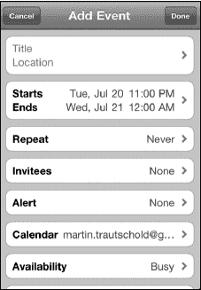

要从任何`日历`视图添加新日历事件，请按以下步骤操作。

1. 在屏幕上你想要安排约会的位置长按手指，直到出现一个新的彩色气泡。（你仍然可以轻点屏幕右上角的 `+` 图标来添加新事件。）
2. 在`添加事件`屏幕上，轻点标有`标题与位置`的框。

    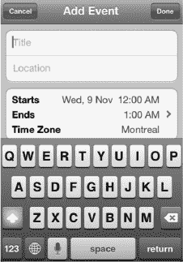

   键入事件的标题和位置（可选）。例如，你可以键入“与马丁会面”作为标题，并将位置输入为“办公室”。或者，你也可以选择键入“与马丁共进午餐”，然后选择一个纽约市非常昂贵的餐厅。

3. 轻点右上角的蓝色`完成`按钮以返回`添加事件`屏幕。
4. 轻点`开始`或`结束`标签以调整事件时间。要更改开始时间，请轻点`开始`字段将其高亮显示为蓝色。接着，移动底部的旋转拨盘以反映正确的日期和约会的开始时间。

    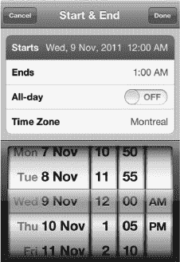

5. 或者，你可以通过轻点`全天`旁边的开关将其设置为`开`来设置全天事件。

**注意：** 只有在你的事件设置于 Exchange/Google 或 iCloud 日历时，你才会在`重复`标签之后看到一个标有`邀请对象`的标签。

### 重复事件

您有些约好的事项每天、每周或每月在同一时间发生。如果您要安排重复事件，请按照以下步骤操作：

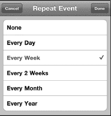

1. 轻触`重复`标签，然后从列表中选择重复事件的时间间隔。
2. 轻触`完成`返回主`事件`界面。
3. 如果您设置了`重复`会议，那么还需要指定重复事件的结束时间。轻点`结束重复`按钮进行设置。

   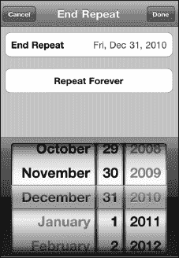

4. 您可以选择`永不结束`或设置一个具体日期。
5. 完成后轻点`完成`。

### 日历提醒

您可以让 iPhone 4 在临近约会时发出声音提醒，即*提示*。提醒功能有助于防止您忘记重要事项。请按照以下步骤创建提醒：

1. 轻触`提醒`标签，然后选择提醒闹钟选项。您可以选择不设置闹钟（`无`），或者设置提醒时间，范围从`事件发生时`一直延伸到`事件前 2 天`，具体取决于您的需求。
2. 轻触`完成`返回主`事件`界面。

## 第二提醒

**注意：** 如果您使用的日历是通过 iTunes 或 iCloud 同步的，您将看到`第二提醒`选项。但如果您的活动绑定的是通过 Exchange 设置同步的 Google 日历，则不会看到第二提醒。

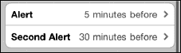

大多数情况下，一旦您设置了第一个`提醒`选项，就会出现`第二提醒`选项的标签。您可以将这个第二提醒设置在第一提醒之前或之后的另一个时间。有些人发现第二提醒对记住关键事件或约会非常有帮助。

**提示：** 这里有一个实用示例，说明您何时可能需要设置两个日历提醒。

如果您的孩子有看医生或牙医的预约，您可能想将第一个提醒设置在预约前一晚。这会提醒您写一张假条交给孩子。

然后您可以将第二个提醒设置在预约时间前 45 分钟。这样您就有足够的时间去学校接孩子并赶到预约地点。

## 选择日历

如果您使用多个日历，请轻点`日历`标签，更改新事件所属的日历。

轻触左上角的`日历`按钮，可以查看所有日历。

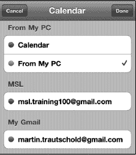

轻点您要用于此特定事件的日历。通常，默认选中的是您上次使用 iPhone 安排事件时选择的日历。

## 忙闲状态

您还可以让他人了解您在已安排事件期间的忙闲状态。您可以从以下选项中选择您的忙闲状态：`忙碌`（默认）、`空闲`、`待定`或`外出`。（`待定`和`外出`仅在您使用 Exchange 设置同步账户时才会显示。）

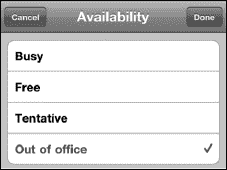

**注意：** 仅当您用于此事件的日历与 iCloud、Exchange 或 Exchange/Google 设置同步时，您才会看到`忙闲状态`或`受邀者`字段，并且它们各自提供的选项略有不同。如果您与 iCloud 同步，还会看到一个`URL`字段，您可以在其中添加一个供稍后使用的网址。

## 向日历事件添加备注

如果您想向日历事件添加一些备注，请按照以下步骤操作：

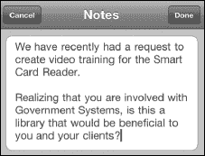

1. 轻点`备注`，然后输入或复制粘贴一些备注内容。
2. 轻点`完成`结束添加备注。
3. 再次轻点`完成`保存您的新日历事件。

**提示：** 如果这是要去一个新地点的会议，您可能需要输入或复制粘贴一些驾车路线。

### 在邮件和日历应用之间使用复制粘贴功能

iPhone 软件的新型快速应用切换器意味着您现在可以轻松地在`邮件`和`日历`程序之间跳转以复制粘贴信息。这些信息可以是任何内容，从会议所需的要点笔记到驾车路线。请按照以下步骤在`邮件`和`日历`程序之间复制粘贴信息：

1. 创建新日历事件或编辑现有事件，如本章前面所述。

   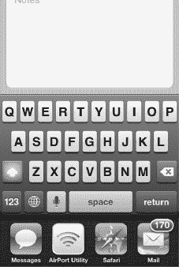

2. 向下滚动到`备注`字段并轻点它以将其打开。
3. 双击`主屏幕`按钮以调出快速应用切换器。
4. 如果您看到`邮件`图标，请轻点它。如果您没有看到`邮件`图标，请向左或向右滑动寻找。找到后，轻点它以打开`邮件`应用。
5. 双击一个单词，然后用手指拖动蓝色手柄选择要复制的文本。

   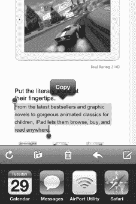

6. 轻点`复制`按钮。
7. 双击`主屏幕`按钮以调出快速应用切换器。
8. 轻点`日历`图标。它应该是左侧的第一个图标，因为您刚刚跳出该应用。

   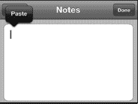

9. 现在在`备注`字段中长按。松开手指时，您应该会看到`粘贴`弹出框。如果看不到，请将手指按住稍久一点，直到看见它为止。

   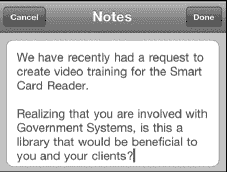

10. 轻点`粘贴`。
11. 现在您应该会看到复制并粘贴到`备注`字段中的文本。

    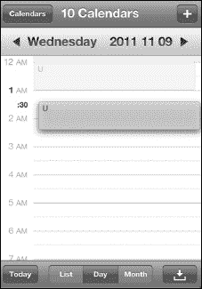

12. 轻点`完成`以保存您的更改。

### 编辑约会

有时，约会的详情可能会发生变化而需要`调整`。幸运的是，在 iPhone 上修改约会很简单。如果您只想更改时间，可以像下面这样在屏幕上直接移动它。

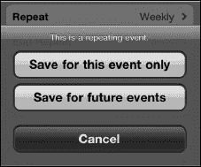

1. 按住您想要更改的约会不放。
2. 将此约会拖到新的时间段。

   如果您需要更改的时间范围超出拖放操作所能达到的幅度，或者需要更改其他字段，也可以使用`编辑`按钮。

3. 轻点您要更改的约会。
4. 轻点右上角的`编辑`按钮，查看显示约会详情的`编辑`屏幕。
5. 轻触需要调整的字段标签，就像创建事件时那样。例如，您可以通过轻触`开始`或`结束`标签，然后调整事件的开始或结束时间来更改此约会的时间。

## 编辑重复事件

编辑重复事件的方式与编辑其他任何事件完全相同。唯一的区别是，完成编辑后会弹出一个问题。您需要回答此问题并轻点`完成`按钮。

如果只想更改此重复事件的当前实例，请轻点`仅对此事件保存`。

如果要更改此重复事件的所有实例，请轻点`对未来事件保存`。

## 将事件切换到其他日历

如果您错误地将事件设置在了错误的日历上，请直接轻点`日历`按钮更改日历。然后，选择您已同步到 iPhone 的其他日历之一。

**注意：** 根据您选择的日历，不同的字段可能会显示或消失。

如果您将事件从使用`iTunes`同步的日历更改为与 Exchange 同步的日历，您会看到`第二提醒`字段消失。同时，使用 Exchange、Google 或 iCloud 日历时，您会看到两个新字段出现：`受邀者`和`忙闲状态`。

## 删除事件

请注意，在`编辑`屏幕的底部，您还可以选择删除此事件。只需轻触屏幕底部的`删除事件`按钮即可。

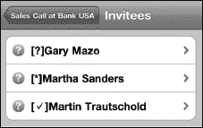

### 会议邀请

对于经常使用 Microsoft Exchange、`Microsoft Outlook` 或 iCloud 的用户来说，会议邀请已成为生活的一部分。你会在电子邮件中收到会议邀请，接受邀请后，该约会便会自动添加到你的日历中。

在你的 iPhone 上，你接受的邀请会立刻添加到日历中。

如果你在日历中点击该会议邀请，就能看到所需的所有详细信息：拨入号码、会议 ID，以及邀请中可能包含的任何其他细节。

### 日历选项

在你的`日历`应用中，只有少数几个选项可供调整。你可以在`设置`应用中找到它们。请按照以下步骤进行调整：

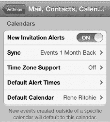

1.  从你的`主屏幕`中轻点`设置`
2.  向下滚动到`邮件、通讯录、日历`并轻点它。
3.  向下滚动到`日历`（它位于最底部！）以查看几个选项。
4.  第一个选项是一个简单的开关，用于通知你`新邀请提醒`。如果你收到任何会议邀请，最好将此选项保持为默认的`开启`状态。
5.  接下来，如果你通过 Exchange 或 iCloud 同步你的`日历`程序，你可能还会看到`同步`选项。你可以调整设置，将事件同步到`往回 2 周`、`往回 1 个月`、`往回 3 个月`、`往回 6 个月`，或显示所有`所有事件`。
6.  接下来，你可以选择你的时区。此设置应反映你设置 iPhone 时的`主屏幕`设置。如果你在旅行中，并希望针对不同时区调整你的约会，你可以将`时区`值更改为任意你偏好的城市。

    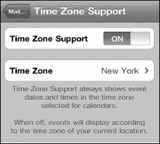

7.  可以为生日、事件和全天事件设置默认提醒时间。事件包含常规选项，而生日和全天事件则允许在事件当天、提前 1 天或提前 2 天（均在上午 9 点），或提前 1 周

## 更改默认日历

我们之前提到过，你可以在 iPhone 上显示多个日历。`默认日历`屏幕允许你选择哪个日历作为你的默认日历。

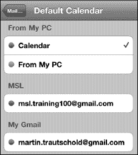

将一个日历指定为默认日历，意味着当你计划安排新的约会时，此日历将默认被选中。

如果你希望使用另一个日历——比如你的`工作`日历——那么你可以在实际设置约会时更改它，正如本章前面所示。

## 提醒事项

`提醒事项`是 iOS 5 中新增的一款应用，它能让你轻松简单地跟踪需要完成的事项、完成它们的日期和时间，甚至是在何处需要完成。你可以将此应用视为苹果对任务或待办事项列表的回应。

## 提醒事项视图

你的`提醒事项`应用有三个主要视图：`列表`、`日期`和`月`。以下是这些视图的快速概述。

`列表`是`提醒事项`的默认视图，可以让你一目了然地查看所有需要完成的任务。

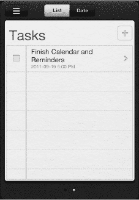

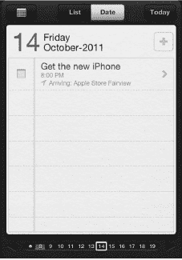

**注：** 对于 iCloud 账户，默认的`列表`视图称为`提醒事项`。对于 Microsoft Exchange 账户，默认的`列表`视图称为`任务`。

如果你有多个列表，可以通过从右向左滑动在它们之间切换，就像在你的 iPhone `主屏幕`上在不同应用页面之间切换一样。

从左向右滑动可以查看你的`已完成`列表

`日期`视图让你在提醒事项到期的当天查看它们。你可以轻松地从一天滑动到下一天；你也可以滚动底部的`日期`滑块。按照以下步骤更改显示的日期：

*   **前往下一天**：从右向左滑动。
*   **前往前一天**：从左向右滑动。
*   **前往已完成任务列表**：从当前天开始，从左向右滑动。

**提示：** 要返回到`今天`视图，只需轻点右上角的`今天`按钮。

要查看`月`视图，轻点位于`日期`视图左上角的`月`按钮 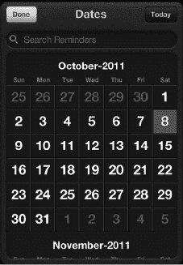。这将显示整个月的布局。有提醒事项到期的日期会显示为红色。

**提示：** 要返回到`今天`视图，只需轻点右上角的`今天`按钮。

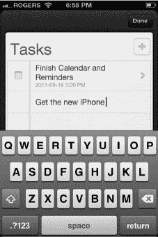

按照以下步骤在月份之间来回切换：

*   **前往下个月**：向下滚动。
*   **前往上个月**：向上滚动。

## 添加新的提醒事项

要从任何`列表`视图中添加新任务，请按照以下步骤操作：

1.  轻点当前列表末尾的第一个空白行。

    

2.  输入你任务的标题。
3.  完成后，轻点右上角的黑色`完成`按钮。

**注：** 你也可以轻点`添加`按钮来创建一个新任务。

## 添加提醒事项详情

要向任务添加*详情*，请轻点任务的标题。`详情`屏幕允许你添加`提醒我`的到期日期或位置、提醒的`优先级`、你希望将其附加到哪个`列表`，以及你可能想要添加的任何`备注`。

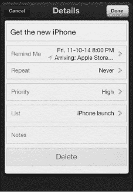

`详情`页面也是你可以删除任务的地方。

**注：** 如果一开始没有看到所有选项，请轻点`显示更多`按钮来展开它们。

## 设置到期日期和位置

`提醒事项`应用包含你可以为提醒设置的标准到期日期。当任务到达到期日期时，你会收到一个弹出通知来提醒你。

`提醒事项`应用还包含强大的地理围栏功能；也就是说，它允许你为提醒设置基于位置的通知。这意味着你可以设置提醒，例如在到达母亲家时更换灯泡，或者在离开办公室时拿牛奶。

**注：** 基于位置的提醒目前仅在你使用 iCloud 并将任务分配到一个与 iCloud 关联的列表时才可用。

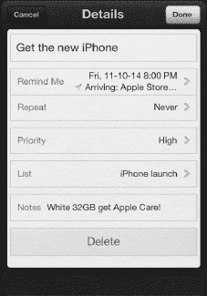

按照以下步骤设置`提醒我`的日期或位置：

1.  轻点`提醒我`。
2.  要设置到期日期，将`在某天`选项切换为`开启`。默认情况下，日期将设置为当天。
3.  要更改日期，轻点它，然后移动底部的旋转拨盘以反映任务的正确日期。
4.  轻点`完成`返回主`详情`屏幕。

    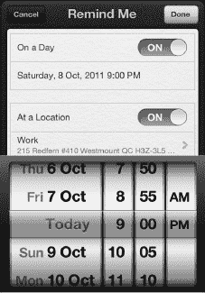

5.  要设置地点，将`在某个位置`切换为`开启`。默认情况下，位置将设置为你当前的位置。
6.  要更改你的位置，轻点`在某个位置`下方的字段，然后轻点`选择地址`。
7.  从你的`通讯录`列表中选择一个地址。
8.  轻点`完成`返回主`详情`屏幕。

**提示：** 在`提醒事项`中使用某个位置之前，该位置必须存在于你的`通讯录`中。要快速将位置添加到你的`通讯录`，请使用`地图`应用（参见第 21 章："地图"）。

1.  如果你希望在离开某个位置时收到提醒，请轻点`当我离开时`。
2.  如果你希望在到达某个位置时收到提醒，请轻点`当我到达时`。
3.  轻点`完成`返回主`详情`屏幕。

**注：** 如果你同时设置了到期日期和位置，`提醒事项`将会在最先发生的那个条件满足时向你发送提醒——即你到达或离开某个位置，或者提醒到达设定的时间。

## 重复提醒事项

你的一些提醒事项需要在每天、每周或每月的同一时间或地点触发。如果你正在安排一个重复或循环的任务，请按照以下步骤操作：

1.  轻点`重复`标签页，然后从列表中选择重复事件的间隔时间。
2.  轻点`完成`返回主`详情`屏幕。

### 更改列表

每个`treminder`事项都属于一个列表。你可以设置工作列表、家庭列表、度假列表、购物列表——任何你喜欢的列表。**详细信息**页面会显示当前与你新建任务关联的列表名称。请按照以下步骤更改当前列表：

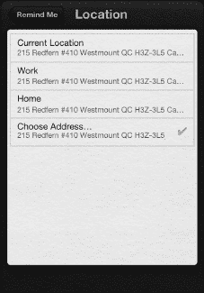
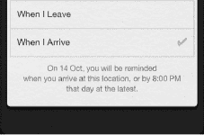

1. 点击当前列表名称。
2. 点击你想要切换到的列表。

## 为任务添加备注

如果你想为任务添加一些备注，请按照以下步骤操作：

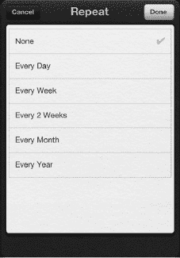

1. 点击**备注**，然后输入或复制粘贴若干备注。

   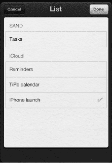

2. 点击**完成**以结束添加备注。

**提示：** 如果是购物清单，你可能想添加一些附加信息，比如服装尺码、食品品牌或其他可能有帮助的内容。

## 完成提醒事项

将提醒事项标记为已完成非常简单。只需点击提醒事项标题左侧的方框，就会出现一个勾选标记图标。这会将该提醒事项从其当前列表移至特殊的“已完成”列表，以便你日后必要时可以返回查看。

如果操作有误，只需再次点击该方框即可移除勾选标记图标，将提醒事项恢复至之前的状态。如果任务已被移至“已完成”列表，则向左滑动直到进入“已完成”列表，然后点击该方框取消勾选，即可将提醒事项移回之前的列表。

## 编辑提醒事项

有时，任务的细节可能会发生变化，需要进行调整。幸运的是，更改任何提醒事项只需遵循以下简单步骤：

1. 点击你要更改的提醒事项。
2. 点击“详细信息”页面上的标签，并调整细节，就像你设置新任务时一样。

### 删除提醒事项

请注意，在**详细信息**屏幕的底部，你还可以选择删除任务。只需点击屏幕底部的**删除**按钮即可。

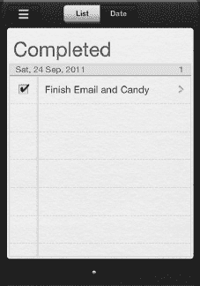

## 添加新列表

**提醒事项**应用允许你拥有多个列表，这对于保持你的任务井然有序非常方便。例如，你可以创建一个新列表来帮助你为即将到来的旅行打包行李，或为即将到来的生日进行购物。

你可以为 iCloud 提醒事项或 Exchange 任务账户，或者 iPhone 上的本地列表创建新列表。请按照以下步骤创建新列表：

1. 点击屏幕左上角的**列表**按钮 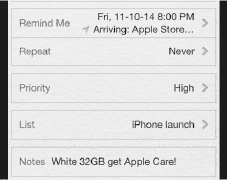。

   

2. 在“列表”页面上，点击右上角的**编辑**按钮。
3. 如果你有多个账户与“提醒事项”同步，请选择你想要添加新列表的账户。
4. 点击**创建新列表……**标签。
5. 输入你的新列表名称。
6. 点击右上角的灰色**完成**按钮。

## 移动和删除列表

在**列表**页面中，你还可以移动和删除列表。

要移动列表，请长按最右侧的**抓手**图标，然后将其拖拽到新位置。

要删除列表，请点击列表名称左侧的红色**圆圈**图标，然后点击**删除**按钮确认你的选择。

## 提醒事项选项

在**提醒事项**应用中，只有两个选项可以调整；你可以在**设置**应用中找到它们：

1. 从你的**主屏幕**点击**设置**图标。
2. 向下滚动到**邮件、通讯录、日历**并点击它。

   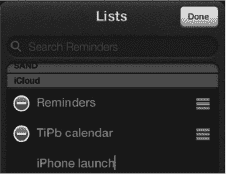

3. 向下滚动到**提醒事项**（它位于最底部！）以查看这两个选项。

   

4. 第一个选项是**同步**。你可以调整此设置，以同步**过去 2 周、过去 1 个月、过去 3 个月、过去 6 个月**，或显示**所有提醒事项**。

### 更改默认列表

我们之前提到过，你可以在 iPhone 上显示多个列表。**默认列表**屏幕允许你选择哪个列表作为默认列表。

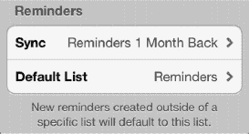

将某个列表指定为默认列表意味着，当你新建一个提醒事项时，它默认会被分配到这个指定的列表。

