# 第 20 章

## 使用照片

虽然之前版本的 iPhone 已包含摄像头，但当前 iPhone 上的摄像头确实令人惊叹。iPhone 4S 配备的不是一个，而是两个摄像头：一个位于背面、拥有`f/`2.4 光圈和 LED 闪光灯的 800 万像素摄像头；以及一个位于正面、用于视频聊天和自拍的 30 万像素 VGA 摄像头。你可以在第 11 章“视频消息与 Skype”中了解有关使用前置摄像头的更多信息。

在 iPhone 上查看和分享照片确实是一种享受，这在很大程度上要归功于其精美的视网膜显示屏。在本章中，我们将讨论将照片导入 iPhone 的多种方法。我们还将向你展示如何使用触摸屏浏览照片，以及如何放大、缩小和操作照片。

**提示：** 你知道吗，你可以同时按下两个按键来截取 iPhone 整个屏幕的画面？这对于向别人展示一款炫酷的应用，或者证明你在**俄罗斯方块**中获得了最高分来说非常棒！

操作方法如下：同时按下**主屏幕**按钮和右上角的**开/关/睡眠**键（你可以先按住一个键，再按下另一个键）。这有点技巧性，需要一些练习。如果操作正确，屏幕会闪烁，并且你会听到相机快门声。你所截取的屏幕快照将保存在**照片**应用中的“相机胶卷”相册里。

### 快速拍照

苹果最近添加了一些出色的快捷方式，帮助你更快速、更方便地拍照。如果你的孩子正处于特别可爱或值得纪念的时刻，如果你在树林里遇到一只珍稀鸟类，或者你需要快速抓拍社区里可疑的东西，那么你可以使用以下其中一种技巧来快速拍照：

* 双击**主屏幕**按钮，即可在**锁定**屏幕上直接调出**相机**图标。点击**相机**图标将直接带你进入**相机**应用，准备拍照。这意味着你不再需要解锁手机、滑动屏幕寻找**相机**应用，然后等待它启动。
* 使用**音量加**硬件按钮拍照。你可以使用更具触感且类似传统相机操控的方式，而不必费劲去按屏幕上的相机软件按钮。
* 拍摄多张照片。苹果称，拍摄第一张照片的时间已缩短至惊人的 1.1 秒；然而，从第二张照片开始——以及此后的每一张照片——现在仅需 0.5 秒。这对于拍摄运动或其他快速移动的场景尤其方便。只需尽可能快地连续按音量加键即可。
* 自动对焦和人脸识别意味着你拍摄的朋友和家人的快照会自动更清晰，曝光也更好。

## 使用相机应用

**相机**应用应该在你的**主屏幕**页面上——通常位于第一个屏幕的顶部。如果你没有看到它，请向左或向右滑动直到找到它。

触摸**相机**图标，相机的快门会以动画效果在你的屏幕上打开。

一旦快门打开，你会看到顶部的控制选项：将**闪光灯**设置为**开**、**关**或**自动**；**选项**用于设置**网格**叠加和**HDR**（高动态范围）为**开**或**关**；以及一个切换前置和后置摄像头的开关。在底部，你会找到一个缩略图，可带你进入“相机胶卷”相册；一个用于拍照的**相机**按钮；以及一个用于在静态照片和视频录制模式之间切换的滑块。

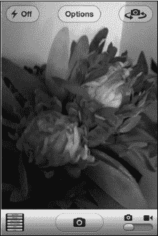

**提示：** 你也可以通过按下**音量加**硬件按钮来拍照或开始视频录制。

### 地理标记

`Geo-tagging` 是一项将你的 GPS（全球定位系统）坐标嵌入到图片文件中的功能。如果你将照片上传至 `Flickr` 等程序，你的朋友就可以利用照片中的坐标来找到你的位置以及照片的拍摄地点。

**注意：** 对于 Mac 用户而言，`iPhoto` 利用地理标记功能将照片归类到 `iPhoto` 的 `地点` 分类中。

如果启用了相机时 `定位服务` 设置为 `开`（参见第 1 章：“开始使用”），系统会询问你是否允许使用当前定位。

要再次确认此设置，请按照以下步骤操作：

1.  打开 `设置` 应用。
2.  进入 `通用`。
3.  点击 `定位服务`。你会看到如下所示的屏幕。
4.  确保 `相机` 旁边的开关已切换至 `开`。

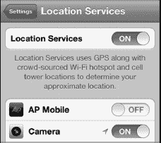

### 拍摄照片

拍照就像对准目标然后按下快门一样简单，但如果你愿意，也可以进行一些调整。

相机开启后，将拍摄对象对准 iPhone 屏幕中央。

当你准备好拍照时，只需点击底部的 `相机` 按钮，或按下 iPhone 侧面的 `调高音量` 硬件按钮（带有 + 标识的按钮）。你会听到快门声，屏幕会显示动画，表示正在拍照。

  

照片拍摄完成后，它会落入左下角的窗口中。点击该缩略图，即可加载 `照片` 应用中的 `相机胶卷` 相簿。

## 使用变焦

iPhone 具备 5 倍数码变焦功能。

**注意：** 数码变焦的清晰度永远比不上光学变焦，因此请注意，使用变焦时画质通常会略微下降。

要使用变焦，只需用两根手指触摸屏幕，然后捏合或张开即可放大或缩小。手指张开越大，缩小的程度也越大。开始变焦后，还会出现一个变焦滑块，帮助你调整变焦倍数。

## 使用闪光灯

你的 iPhone 内置了 LED 闪光灯。默认闪光灯设置为 `自动`，但你也可以手动将其设置为 `开` 或 `关`：

1.  点击左上角的 `闪光灯` 图标。
2.  点击 `开`、`关` 或 `自动`。

**提示：** 我们建议将 `闪光灯` 设置保留为 `自动`；但是，如果你发现照片曝光过度，只需点击 `闪光灯` 图标将闪光灯设置为 `关`。

## 相机选项

为了帮助你拍摄更好的照片，苹果内置了`网格`线和 `HDR`（高动态范围）摄影功能。

`网格`选项会在屏幕上叠加两条水平线和两条垂直线，这有助于你合理构图。它还能帮助你在肖像照中确保面孔和眼睛效果出色，在静物照中确保物品效果良好，并在风景照中确保景色平衡。

`HDR` 不仅拍摄一张常规照片，还会拍摄一张欠曝版本和一张过曝版本，然后将它们合并在一起，使你在阴影区域和明亮区域都能获得更好的细节。

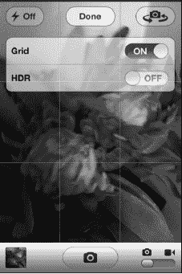

## 切换摄像头

如前所述，iPhone 配备了两个摄像头：一个用于绝大多数摄影的 800 万像素后置摄像头，以及一个用于自拍或 `FaceTime` 视频通话（参见第 11 章：“视频消息与 Skype”）的 VGA（640 x 480）前置摄像头。

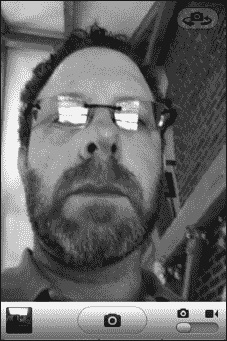  
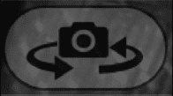

要在摄像头之间切换，请执行以下操作：

1.  在 `相机` 应用中点击 `切换摄像头` 图标。
2.  等待相机切换至前置摄像头并对准拍摄对象。
3.  再次点击 `切换摄像头` 图标切换回标准摄像头。

**提示：** 由于前置摄像头的放置位置，面部可能会看起来有些变形。尝试将你的面部稍微后移并调整相机角度，以获得更好的图像。

### 查看已拍摄的照片

你的 iPhone 会将你拍摄的照片存储在一个名为`相机胶卷`的地方。你可以在`相机`和`照片`应用中访问`相机胶卷`。在`相机`应用中，点击`相机`屏幕左下角的`照片`图标。

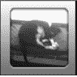

点击一张照片进行查看后，你可以滑动浏览照片，以查看`相机胶卷`中的所有照片。

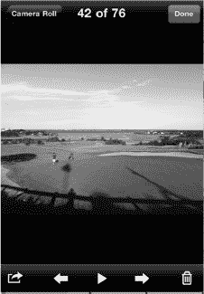  
 要返回`相机胶卷`，请按左上角的`相机胶卷`按钮。

 要拍摄另一张照片，请点击右上角的`完成`按钮。

### 编辑照片

借助 iOS 5，你现在可以直接在 iPhone 上进行基本的照片编辑。你可以旋转照片；增强其曝光度、对比度和色阶；裁剪照片；甚至自动去除亲朋好友照片中的红眼。

请按照以下步骤编辑照片：

1.  浏览到你想要编辑的照片。
2.  点击右上角的`编辑`按钮。

请按照以下步骤旋转照片：

1.  点击左下角的`旋转`箭头  按钮，将照片逆时针（向左）旋转 90 度。
2.  再次点击`旋转`按钮，以 90 度为增量继续旋转。
3.  将图像旋转到所需位置后，点击右上角的黄色`保存`按钮。

同样地，请按照以下步骤自动增强照片：

1.  点击`自动增强`  魔法棒按钮。
2.  如果你对结果满意，点击右上角的黄色`保存`按钮。
3.  如果不喜欢结果，再次点击`自动增强`将其设置为`关闭`。
4.  点击`取消`退出`自动增强`模式。

请按照以下步骤去除照片中的红眼：

1.  点击`红眼`  按钮以激活红眼去除功能。
2.  点击照片中的每个红眼以应用校正（即，去除眼睛中的红色）。
3.  如果你对结果满意，点击左上角的`应用`按钮。
4.  如果不喜欢结果，再次点击每个红眼以移除校正效果。
5.  点击`取消`退出此模式。

最后，请按照以下步骤裁剪照片：

1.  点击右下角的`裁剪` 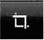 按钮。照片上会出现一个九宫格网格。
2.  触摸网格的边缘或角落并拖动，使裁剪区域变高、变矮、变窄或变宽。
3.  触摸网格内部并拖动，以移动网格背后的照片。
4.  捏合或张开手指进行缩放，使网格内的照片变大或变小。
5.  点击`约束`按钮，从标准宽高比列表中进行选择，包括`原始`、`正方形`；传统照片比例如 `3 x 2`、`4 x 6` 和 `8 x 10`；电视比例如 `SD 4 x 3` 和 `HD 16 x 9`；等等。
6.  如果对裁剪结果满意，点击右上角的黄色`裁剪`按钮应用裁剪。
7.  如果不喜欢裁剪结果，点击左上角的`取消`按钮返回`编辑`屏幕。

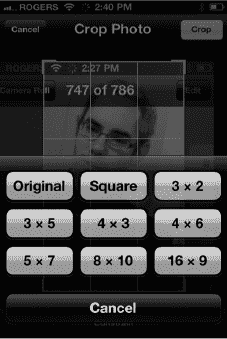

#### 将照片导入 iPhone

你有多种方式可以将照片加载到设备上：

- **使用 iCloud 或 iTunes 同步：** 将照片导入 iPhone 最简单的方法可能是使用 iCloud 或 iTunes 从电脑同步照片（参见图 20–1）。我们在第 3 章：“使用 iCloud、iTunes 等进行同步”中对此进行了详细说明。
- **作为电子邮件附件接收：** 虽然这不适用于大量图片，但对于一张或几张照片来说效果很好。查看第 17 章：“使用电子邮件通信”了解关于如何保存附件的更多详情。（保存后，这些图像会出现在“相机胶卷”相簿中。）
- **从网页保存图像：** 有时你会在网站上看到一张好图片。长按该图片，待弹出菜单出现后，选择**保存图像**。（与其他保存的图像一样，这些图片最终会出现在“相机胶卷”相簿中。）
- **从应用内下载图像：** 一个很好的例子是第 8 章：“个性化与安全性”中显示的壁纸图像。
- **与 iPhoto 同步**（适用于 Mac 用户）：如果你使用 Mac 电脑，你的 iPhone 很可能会自动与 `iPhoto` 同步。以下是让 `iPhoto` 中的同步功能运行起来的几个步骤：
  1. 连接你的 iPhone 并启动 `iTunes` 应用。
  2. 转到同步选项顶部一行的**照片**标签页。
  3. 选择你想要与 iPhone 保持同步的**相簿**、**事件**、**面孔**或**地点**。

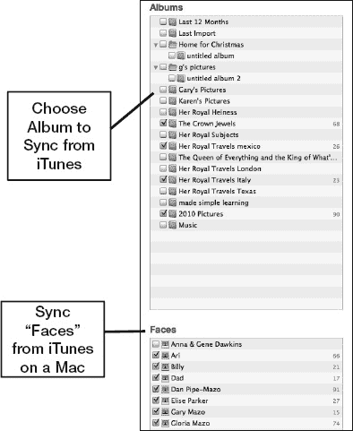

**图 20–1.** *从 `iTunes` 选择要与 iPhone 同步的相簿、面孔或事件*

- **拖放**（适用于 Windows 用户）：将 iPhone 连接到 Windows 电脑后，它会在**Windows 资源管理器**中显示为一个便携设备，如图 20–2 所示。按照以下步骤在 iPhone 和电脑之间拖放照片：
  1. 双击**便携设备**下的 **iPhone** 图标将其打开。
  2. 双击**内部存储**将其打开。
  3. 双击 **DCIM** 将其打开。
  4. 接下来，你可能会看到一些名称怪异的文件夹，例如：`823WGTMA`、`860OKMZO` 和 `965YOKDJ`。尝试双击打开每个文件夹。其中一个会包含你要找的照片或视频。
  5. 你将看到 iPhone 上“已存储的照片”相簿中的所有图像。
  6. 要从 iPhone 复制图像，请选中并将图像从此文件夹拖放到你的电脑上。你不能使用此拖放方法将图像复制到 iPhone。相反，你可以使用 iTunes 或 iCloud。

**图 20–2.** *显示 iPhone 为便携设备的 Windows 资源管理器（通过 USB 线缆连接）*

**提示：在 Windows 中选择多个图像**

在 Windows 中有几种选择图像的方法：你可以在图像周围画一个框，单击单个图像，或按 `Ctrl+A` 全选。你也可以按住 `Ctrl` 键并逐个单击图片进行选择。右键单击其中一个选中的图片，然后选择**剪切**（移动）或**复制**（复制）所有选中的图像。要粘贴图像，请单击任何其他磁盘或文件夹（例如**我的文档**），然后导航到你要移动或复制文件的目标位置。最后，再次右键单击并选择**粘贴**。

#### 查看你的照片

现在照片已存入 iPhone，你有几种很酷的方式来浏览它们并向他人展示。

##### 从照片图标启动

如果你喜欢使用**照片**应用，你可能希望将其图标放置在底座 Dock 中以便快速访问（如果还没有的话），参见第 6 章：“图标与文件夹”。

要开始使用照片，请轻点**照片**图标。

第一个屏幕会显示你的相簿，这些相簿是在你设置 iPhone 并与 iCloud 或 iTunes 同步时创建的。在第 3 章：“使用 iCloud、iTunes 等进行同步”中，我们向你展示了如何选择要与 iPhone 同步的照片。当你对电脑上的资料库进行更改时，它们会自动在 iPhone 上更新。

如果你正在使用 iCloud 的“照片流”功能，这里也是你找到照片流图像的地方。

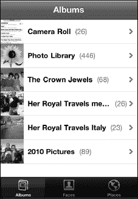

##### 选择资料库

从**相簿**页面，轻点某个资料库按钮以显示该相簿中的照片。在右侧的图片中，我们轻点了一个照片资料库，屏幕立即切换显示该资料库中图片的缩略图。

上下拖动手指以查看资料库中的所有图片。你也可以向上或向下轻扫以快速浏览资料库中的图片。你也可以向上或向下轻扫以快速浏览整个相簿。

##### 管理资料库

iOS 5 引入了直接在 iPhone 上添加新相簿、在相簿间移动照片以及删除相簿的功能。

按照以下步骤添加新相簿：
1. 轻点右上角的**编辑**按钮。
2. 轻点左上角出现的**添加**按钮。
3. 为新相簿输入名称。
4. 轻点右上角的**完成**。

按照以下步骤删除相簿：
1. 轻点右上角的**编辑**按钮。
2. 轻点你想要删除的相簿左侧的红色**圆形**图标。
3. 轻点红色的**删除**按钮进行确认。

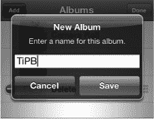

最后，按照以下步骤在相簿之间移动照片：
1. 轻点左下角的**操作**按钮。
2. 轻点你想要移动的图片。
3. 如果你不小心轻点了一张图片，只需再次轻点它即可取消选择。
4. 轻点底部的**添加到**按钮。
5. 如果你已有想要移入图片的相簿，请选择**添加到现有相簿**。或者，如果你现在想创建一个新相簿，可以选择**添加到新相簿**。

### 处理单张图片

找到你想查看的图片后，只需轻点它。图片随后会加载到屏幕上。

**注意：** 如果你的照片是以横向模式拍摄的，它们通常不会填满 iPhone 的整个屏幕。

**提示：** 这里的照片是以横向模式拍摄的；要全屏查看，只需将 iPhone 侧转或双击即可。

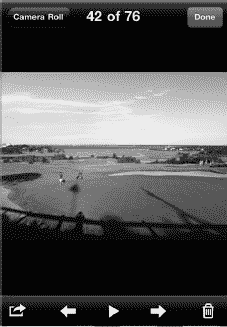

#### 在图片之间切换

使用轻扫手势可以在图片之间切换。只需在屏幕上向左或向右滑动手指，你就可以浏览图片。

**提示：** 缓慢滑动手指可以更平滑地在图片间切换。

当到达相簿末尾时，只需轻点屏幕一次，你会在左上角看到一个标有相簿名称的标签。轻点该标签，你将返回该特定相簿的缩略图页面。

要返回主相簿页面，请轻点左上角标有**相簿**的按钮。

### 放大和缩小图片

如本书“入门”部分所述，在 iPhone 上有两种放大和缩小图片的方法：双击和双指捏合。

#### 双击

顾名思义，双击是指在屏幕上快速轻点两次以放大图片（参见图 20–3）。你会在双击的位置放大。要缩小，只需再次双击一次。

有关双击的更多信息，请参见第 1 章：“入门”。

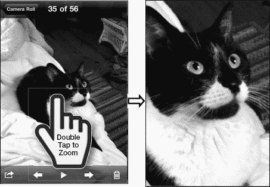

**图 20–3.** *双击图片以放大查看*

## 捏合缩放

正如第 1 章：“入门”中所述，捏合是一种更为精确的放大方式。虽然双击只能将画面放大或缩小到固定级别，但捏合操作却能让您将画面进行小幅或较大幅度的缩放。

要进行捏合缩放，请将拇指和食指并拢放在屏幕上，然后缓慢地（在保持手指触屏的情况下）将它们分开，从而使图像变大。若要缩小，则先将拇指和食指分开放在屏幕上，再将它们并拢。

**注意**：一旦您通过任意一种方式激活了缩放功能，在将照片恢复为标准尺寸之前，您将无法轻松地在照片间滑动浏览。

## 观看幻灯片放映

如果您愿意，可以将相册中的照片以幻灯片形式进行观看。只需轻点屏幕一次，即可调出屏幕软键。在屏幕中央，您会看到一个`播放幻灯片`按钮——轻点它即可开始播放幻灯片。您可以从正在观看的任何一张照片开始播放幻灯片。

在`设置`应用中选取`照片`，可以调整每张照片在屏幕上停留的时间以及其他设置，例如`重复`和`随机播放`（请参见图 20–4）。若要结束幻灯片放映，只需轻点屏幕即可。

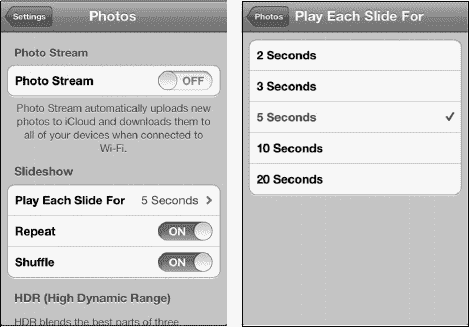

**图 20–4.** *配置幻灯片放映*

## 将照片用作 iPhone 墙纸

我们在第 8 章：“个性化与安全性”中向您展示了如何选取并将一张照片用作 iPhone 墙纸（以及其他墙纸选项）。

**注意：**您可以为`主屏幕`和`锁定屏幕`设置不同的照片，也可以为两者使用同一张照片。

## 通过电子邮件或推特发送照片

只要您拥有有效的网络连接（Wi-Fi 或 3G；请参见第 4 章：“连接到网络”），就可以通过电子邮件发送相册中的任何照片，或将其发布到推特。点击缩略图栏上的`选项`按钮——这是底部一行软键中最左侧的那个按钮。如果您没有看到这些图标，请轻点屏幕一次。

若要邮寄照片，请选择`电子邮件照片`选项，`邮件`应用将自动启动。

像您在第 17 章：“使用电子邮件沟通”中那样轻点`收件人`字段，然后选择要接收照片的联系人。轻点蓝色的`加号` (**`+`**) 按钮以添加联系人。

输入主题和正文，然后轻点右上角的`发送`——仅此而已。

若要发布照片到推特，请选择`推特`选项，一个`推特`表单将自动出现。只需填写您想随照片一同显示的消息，然后点击`发送`按钮。

**注意：**只有在您在`设置`应用中输入了您的推特用户名和密码后，`推特`选项才会出现。

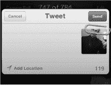

## 一次共享、复制、打印或删除多张照片

如果您有多张照片需要同时进行电子邮件发送、短信发送、复制、打印或删除，可以在缩略图视图中进行操作：

1.  **点击左下角的`操作`按钮。**

2.  点击您想要选择的照片。
3.  如果您不小心点选了某张照片，只需再次点击即可取消选择。
4.  从屏幕底部选择一项操作：`共享`（电子邮件、短信或打印）、`复制`、`添加到`（其他相册）或`删除`。

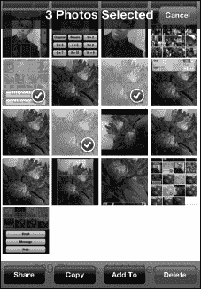

**注意：**`复制`功能允许您将多张照片复制并粘贴到电子邮件或其他应用中。`共享`会将图像重命名为 `photo.png`，而`复制粘贴`则会在 DCIM 文件夹的文件名后添加 `.png`。

在本书出版时，您无法同时共享多个视频，也无法同时共享超过五张照片。这在未来的软件版本中可能会有所改变。

## 将照片分配给联系人

第 18 章：“通讯录与备忘录”向您展示了如何在编辑联系人时添加照片。您也可以找到一张喜欢的照片并将其分配给某个联系人。首先，找到您想要使用的照片。

如同设置墙纸和通过电子邮件发送照片时一样，点击`操作`按钮——这是上方一行软键中最右侧的按钮。如果您没有看到这些图标，请轻点屏幕一次。

当您触摸`操作`按钮时，会看到一个下拉选项列表：`电子邮件照片`、`信息`、`指定给联系人`、`用作墙纸`、`推特`和`打印`。

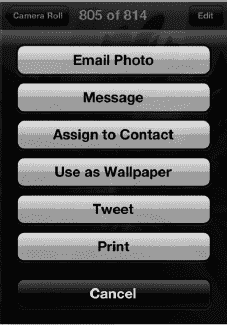

触摸`指定给联系人`按钮。

屏幕上将显示您的通讯录。您可以在顶部的`搜索`栏中进行搜索，或者直接滚动浏览您的联系人。

找到您想要将照片添加为接收者的联系人后，触摸该联系人姓名。

随后您将看到`移动和缩放`屏幕。拖拽照片以移动它；使用捏合手势进行放大或缩小。

当照片调整到您满意的位置和大小后，触摸`设定照片`按钮，即可将照片分配给该联系人。

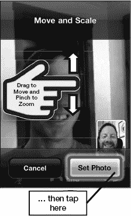

**注意：**您将返回到“照片图库”，而不是通讯录。如果您想再次确认照片已成功分配给联系人，请退出`照片`应用，启动`通讯录`应用，然后搜索该联系人。

## 在 Apple TV 上查看照片

第 5 章：“AirPlay 与蓝牙”向您展示了如何使用 Apple 的 AirPlay 功能，通过本地 Wi-Fi 网络将 iPhone 上的视频串流到 Apple TV。Apple 已将相同的功能内置到了“照片”应用中，因此您可以轻松地将照片投送到您的大屏幕电视上。

请按照以下步骤将照片发送到您的 Apple TV：

1.  点击`AirPlay`按钮。
2.  从来源列表中选择`Apple TV`。

要切换到下一张照片，只需从右向左滑动，就像在 iPhone 上切换照片一样。要回到上一张照片，则从左向右滑动。

要切换回在 iPhone 上查看照片，请再次点击`AirPlay`按钮，并从来源列表中选择`iPhone`。

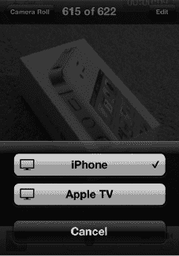

### 删除照片

您可能会好奇为什么无法从 iPhone 上删除某些照片（`垃圾桶`图标不见了）。

例如，您会注意到，任何从 iTunes 同步过来的照片，其`垃圾桶`图标都不可见。您只能从电脑的资料库中删除此类照片。下次同步您的 iPhone 时，它们将被删除。

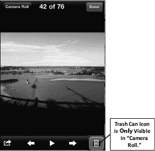

当您浏览“已存储的照片”（此文件夹不与 iTunes 同步，而是由您从电子邮件中存储或从网络下载的照片组成）中的照片时，您会看到底部图标栏中有一个`垃圾桶`图标。当您从“照片图库”或其他同步相册中查看照片时，不会出现此`垃圾桶`图标。

如果您看不到底部一行图标，请轻点照片一次以激活它们，然后点击`垃圾桶`图标。系统将提示您确认删除照片。

触摸`删除照片`，该照片将从您的 iPhone 上删除。

### 从网站下载照片

我们已经向您展示了如何将照片从电脑传输到 iPhone，以及如何从电子邮件中保存照片。您还可以直接从网络上下载并将照片保存到 iPhone 上。

**警告：**我们强烈建议您在从网络上下载和保存图像时尊重图像版权法。除非网站标明图片是免费的，否则在下载和保存任何图片之前，您应征得网站所有者的同意。

### 查找并下载图片

iPhone 可以轻松地从网页上复制和保存图像。当你正在寻找一张新图片用作 iPhone 墙纸时，这个功能会非常方便。

首先，轻点 `Safari` 网页浏览器图标，输入搜索词“iPhone 壁纸”，找到一些可能包含有趣图片的网站。（关于此主题的更多帮助，请参阅第 16 章：“Safari 网页浏览器”。）

一旦找到要下载并保存的图片，请长按它，调出包含 `保存图像`（以及其他选项）的新菜单，如图 21-5 所示。选择此选项即可将图片保存到你的 `已存储的照片` 相簿中。

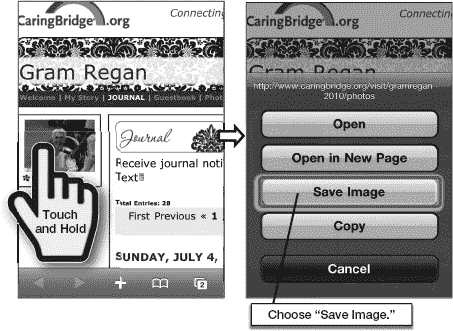

**图 20–5.** *从网页保存图像*

现在，轻点你的`照片`图标，你应该就能在`相机胶卷`相簿中看到这张图片了。

