# 第 21 章

## 地图

在你的 iPhone 上使用地图非常方便，而且相当令人惊叹。在本章探索 `地图` 应用强大功能的过程中，你将了解如何在地图上找到自己的位置，并获取前往几乎任何地方的方向指引。你还会学到如何在`标准`、`卫星`和`混合`视图之间切换。你还会看到，如果需要找到前往某地的最佳路线，你可以通过 `地图` 选项中的`显示交通状况`按钮查看实时路况。如果你想找到离目的地最近的比萨店、高尔夫球场或酒店，这也非常容易。而且，你可以直接从 iPhone 使用谷歌街景来帮助你抵达目的地。你也可以轻松地将已在地图上标注的地址添加到你的联系人中。还有一个好玩的功能——数字指南针。

### 地图入门

iPhone 的美妙之处在于，它的应用程序都是设计成可以协同工作的。你已经看到了你的联系人如何与`地图`应用相关联；只需回顾一下第 18 章：“联系人与备忘录”。

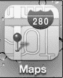

`地图`应用由移动地图技术领导者谷歌地图提供技术支持。`地图`让你能够定位自己的位置、获取路线、搜索附近地点、查看路况等等。

只需轻点`地图`图标即可开始使用。

#### 确定你的位置（蓝点）

当你启动`地图`应用时，可以令其从你当前的位置开始。按照以下步骤将当前位置设置为默认起始位置：

1.  轻点左下角的蓝色小`箭头`图标。

    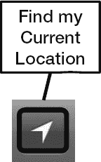

    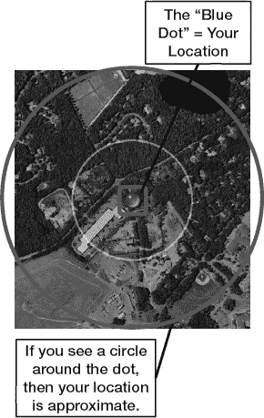

2.  `地图`会请求使用你当前的位置——轻点`允许`或`不允许`。

    我们建议选择`允许`，这将使获取从你当前位置出发或到达你当前位置的路线变得容易得多。

## 更改地图视图

`地图`的默认视图是`标准`视图，这是一种基本地图，显示叠加了街道名称的通用背景。地图还可以显示`卫星`视图，或是`卫星`与`标准`视图的组合，称为`混合`视图。最后，如果你搜索了会提供多个结果的内容（例如当地的咖啡店），`列表`视图会很方便。如果你查询了前往某地的路线，它也同样好用。你可以按照以下步骤在所有视图之间切换：

1.  轻点地图右下角翻起的边缘。
2.  地图的角落会翘起，显示出用于切换视图、交通状况、图钉等功能的按钮。
3.  轻点你想要切换到的视图（参见图 21–1）：

    *   `标准`是带有街道名称的常规地图。
    *   `卫星`是不带街道名称的卫星图片。
    *   `混合`是`卫星`和`标准`视图的结合；即带有街道名称的`卫星`视图。
    *   `列表`仅当你的搜索产生多个结果（例如“星巴克”）或你查询了路线时才可用。

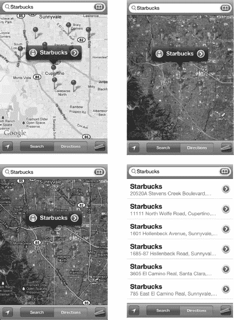

**图 21–1.** *`地图`应用中可用的各种视图：右上起顺时针方向：标准、卫星、混合和列表。*

### 查看交通状况

你的`地图`应用不仅能告诉你如何到达某地，还能沿途查看交通状况。此功能目前仅在美国得到支持。按照以下步骤查看给定路线的交通状况：

1.  轻点地图右下角以查看选项。
2.  轻点`显示交通状况`。

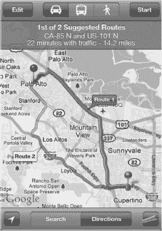

在高速公路上，如果有交通状况，你通常会看到黄色灯光而不是绿色灯光。有时，黄色灯光可能会闪烁，以提醒你注意交通延误。

你甚至可能会看到`施工人员`图标来指示施工区域。

`地图`在主要街道和高速公路上使用颜色来指示交通行驶速度：

*   绿色 = 50 英里/小时或更快
*   黄色 = 25–50 英里/小时
*   红色 = 低于 25 英里/小时
*   灰色（或无色）= 当前无交通数据

## 搜索任何内容

由于`地图`与谷歌地图相连，你可以搜索并找到几乎任何东西：特定的地址、商业类型、城市或其他兴趣点，如图 21–2 所示。按照以下步骤搜索特定地点：

1.  轻点屏幕右上角的`搜索`栏。
2.  输入你想要在 iPhone 上显示地图的地址、兴趣点或城镇和州。

### 谷歌地图搜索技巧

你可以在`搜索`栏中输入几乎任何内容，包括以下内容：

*   名字、姓氏或公司名称（以匹配你的通讯录列表）
*   街道地址（部分或全部，例如“123 Main Street, City”）
*   机场名称（例如“Orlando Airport”，意为寻找奥兰多机场）
*   职业或行业名称（例如 Plumber, painter, or roofer，意为寻找水管工、油漆工或屋顶工）
*   高尔夫球场 + 城市（用于查找当地的高尔夫球场）
*   电影 + 城市或邮政编码（用于查找当地的电影院）
*   比萨 32174（用于搜索邮政编码为 32174 区域的当地比萨店）
*   95014（美国加利福尼亚州苹果公司总部的邮政编码）
*   出版社名称（例如 Apress）

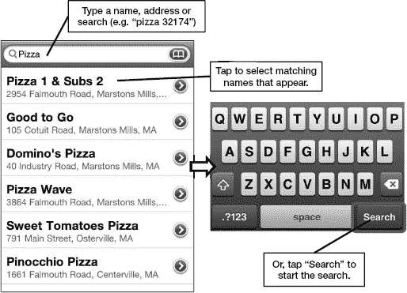

**图 21–2.** *在`地图`应用中搜索*

要输入数字，请轻点键盘上的 `123` 键。要输入字母，请轻点 `ABC` 键切换回字母键盘。

## 地图选项

现在你的地址已显示在`地图`屏幕上，按照以下步骤访问可用选项：

1.  轻点地址旁边的蓝色`箭头`图标  以查看其中一些选项。
2.  如果你已为某位联系人标注了地图，你将看到联系人详情，如图 21–3 所示。`地图`也会为特定搜索提取联系信息。你还可以获取路线、共享位置或添加位置为书签。

**注意：** 你也可以长按地址以调出`拷贝`弹出菜单。

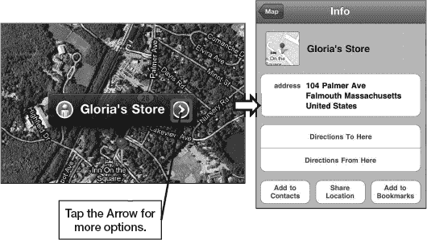

**图 21–3.** *轻点`信息`按钮以查看已标注地图的联系人详情*

### 使用书签

`Maps`中的书签功能与`Safari`中的书签类似。书签只是为你访问或标记过且希望日后记住的地点创建一个记录。查看书签总是比重新执行一次搜索要方便得多。

## 添加新书签

将某个位置添加为书签是简化再次查找该地点的绝佳方法：

1.  在地图上标记一个位置，如图 21-4 所示。
2.  点击地址旁边的蓝色`信息`图标。
3.  点击`添加到书签`。

   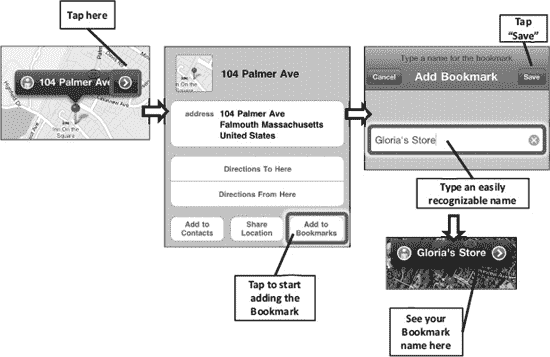

   **图 21-4.** *添加书签*

4.  编辑书签名称，使其简短且易于识别——在此例中，我们将地址编辑为简单的`格洛丽亚的店铺`。
5.  完成后，只需点击右上角的`存储`即可。

**提示**：你可以像在`通讯录`中搜索姓名一样搜索书签名称。

## 访问和编辑书签

要查看你的书签，请按以下步骤操作：

1.  点击顶部行中`搜索`窗口旁边的`书签`图标。
2.  点击任意书签即可立即跳转至该位置。
3.  点击书签顶部的`编辑`按钮来编辑或删除你的书签。
    -   要重新排列书签，请触摸并拖动每个书签的右边缘向上或向下移动。
    -   要编辑书签的名称，请点击它并重新输入名称。编辑完名称后，点击左上角的`书签`按钮返回书签列表。
    -   要删除书签，请在书签上向左或向右滑动，然后点击`删除`按钮。
4.  编辑完书签后，点击`完成`按钮。

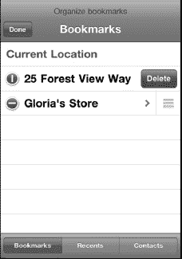

## 将已标记位置添加到通讯录

将你标记过的位置添加到通讯录列表非常简单：

1.  标记一个地址。
2.  点击`箭头`/`信息`图标。
3.  点击`添加到通讯录`。 
4.  点击`创建新联系人`或`添加到现有联系人`。
5.  如果你选择`添加到现有联系人`，则可以滚动或搜索你的联系人并选择一个姓名。该地址将自动添加到该联系人中。

## 搜索附近商家

按照以下步骤搜索你当前位置附近的商家：

1.  在地图上标记一个位置，或使用蓝点表示你的当前位置。
2.  点击`搜索`窗口。假设你想搜索最近的披萨店，于是输入“披萨”。这将会在地图上标记出所有当地的披萨店。
3.  请注意，每个标记的位置左侧可能有一个`街景`图标，右侧有一个`信息`图标。
4.  你可以双击放大，或双指捏合或张开屏幕来缩小或放大。
5.  与任何已标记的位置一样，点击蓝色的`信息`图标会显示所有详细信息，包括披萨店的电话号码、地址和网站，如图 21-5 所示。
6.  如果你需要前往该餐厅的路线，只需点击`路线到这里`，系统会立即计算出一条路线。

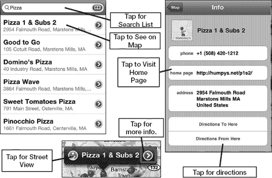

**图 21-5.** *使用信息屏幕对已标记位置进行更多操作。*

**注**：如果你点击`主页`链接，将会退出`地图`应用，并启动`Safari`。完成后，你需要重新启动`地图`应用。

## 放大和缩小

你可以像往常一样通过双击和双指捏合来进行放大和缩小。要使用双击放大，只需像在网页或图片上那样双击屏幕即可。

## 放置图钉

假设你正在查看地图，发现了一些你想将其设为书签或目的地的东西。

在此示例中，我们正在放大并查看大波士顿地区。我们偶然发现了芬威公园，并决定将它添加到书签中会是个好主意，于是我们在其上放置了一个图钉。按照以下步骤在地图上放置图钉：

1.  标记一个位置，或将地图移动到你想要放置图钉的位置。
2.  点击地图的右下角。

   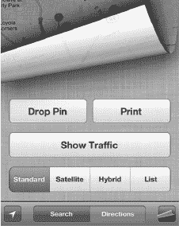

   

3.  点击`放置图钉`。
4.  现在，通过触摸并按住图钉，在地图上拖动它。在我们的示例中，我们将其直接移动到了芬威公园上。

   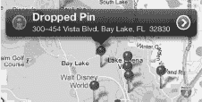

5.  要移除已放置的图钉或执行其他操作，请点击图钉上方弹出窗口旁边的蓝色`箭头`图标。如果弹出窗口消失了，请点击图钉使其重新出现。

   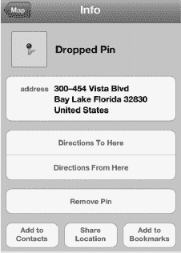

6.  在`信息`屏幕中，你可以获取`路线`、`移除图钉`、`添加到通讯录`、`共享位置`或`添加到书签`。

**提示**：**查找地图上任意位置的街道地址**

当你放置图钉时，谷歌地图会显示实际的街道地址。如果你通过查看`卫星`或`混合`视图找到了某个位置，但需要获取实际的街道地址，这项功能会非常方便。

放置图钉也是追踪你停车位置的好方法，尤其是在不熟悉的地方，这特别有用。

## 使用街景

谷歌街景（参见图 21-6）是 iPhone 上`地图`应用一个非常有趣的功能。谷歌一直在致力于拍摄美国及其他地区几乎每个地址的照片。这些图片随后被输入其数据库，当你想要查看目的地或航点的图片时，显示的就是这些内容。

**注**：谷歌街景目前仅适用于少数国家：北美大部分地区、西欧、澳大利亚以及现在的南非。

如果某个位置有街景可用，你会在地图上该地址或书签的左侧看到一个橙色的`人物`图标。

在这个例子中，我们想要查看位于科德角的加里的妻子格洛丽亚的店铺的街景：

1.  要标记地址，我们点击了通讯录列表中格洛丽亚姓名下的公司地址。我们也可以通过将地址输入`搜索`窗口、搜索某种类型的商家或在`通讯录`应用中点击该地址来标记它。
2.  `街景`图标显示在格洛丽亚名字的左侧。
3.  我们点击该图标，立即切换到该地址的街景视图。非常酷的是，我们可以通过向左、向右、甚至向上或向下滑动来 360 度旋转浏览屏幕，查看我们目的地旁边和街对面的地方。
4.  要返回地图，我们只需点击屏幕右下角。

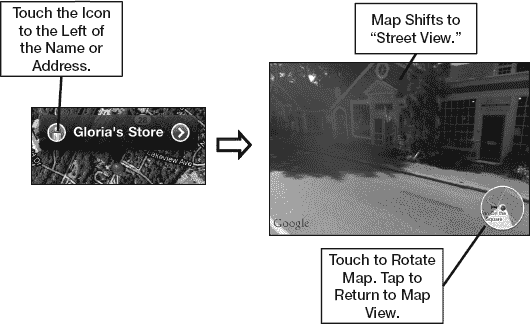

**图 21-6.** *使用谷歌街景*

## 获取路线

`地图`应用最有用的功能之一就是你可以轻松找到前往或离开任何地点的路线。假设我们想获取从当前位置（格洛丽亚的店铺）到波士顿芬威公园的路线。

### 先点击当前位置按钮

要查找前往或离开你当前所在位置的路线，你无需浪费时间输入当前地址——iPhone 会默认你想从当前位置开始规划路线，除非你另行指定。你可能需要点击`位置`按钮几次，直到屏幕上出现蓝点。

现在你可以执行以下任一操作：

-   点击底部的`路线`按钮。
-   像我们之前做的那样，点击蓝色的`箭头`，然后选择`从这里出发的路线`（参见图 21-7）。

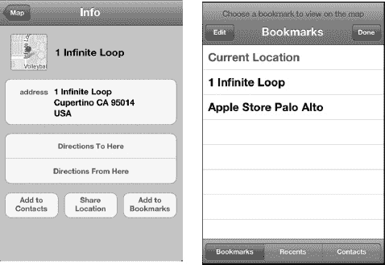

**图 21-7.** *选择`从这里出发的路线`，然后选择`书签`*

### 选择起点或终点

按照以下步骤选择起点或终点，然后挑选一条建议路线：

1.  点击图钉上方的蓝色`箭头`图标。
2.  轻点`路线从这里出发`。
3.  轻点`书签`按钮。
4.  轻点`书签`、`最近访问`或`通讯录`以查找目的地。在本例中，我们轻点了`书签`，然后选择`芬威公园`。

    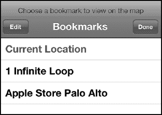

    **注意**：一旦你轻点`路线从这里出发`按钮，最近的搜索记录将自动显示（参见图 21-5）。你也可以点击`目的地`框并输入一个地址。
    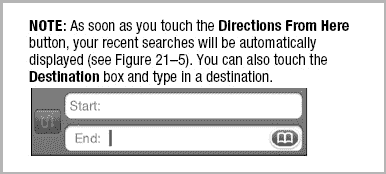

5.  选定目的地后，路线规划界面将带您进入总览屏幕。在我们的示例中，我们看到的是从苹果公司 1 Infinite Loop 总部到帕罗奥图苹果商店的路线规划界面。
6.  起点处会落下一个绿色图钉，终点处（本例中是芬威公园）会落下一个红色图钉。
7.  一条亮蓝色的线条将连接这两个图钉，为您显示路线。如果存在多条路线，其他路线将以浅蓝色显示。
8.  轻点一条灰色路线即可将其选中。选中后，它将会变为亮蓝色，而其他任何路线都将褪为浅蓝色。

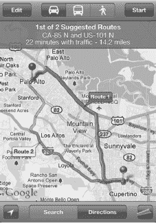

### 查看路线

在开始行程之前，您将在屏幕右上角看到一个`开始`按钮。轻点`开始`按钮，路线指引便会开始。`开始`按钮会变为`箭头`按钮，允许您在行程中的各个步骤之间切换。

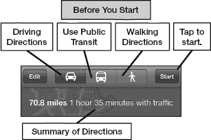

如图 21-8 所示，您可以在地图上以路径形式或列表形式查看路线。

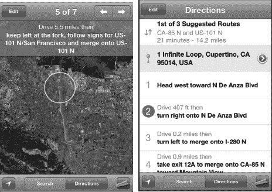

**图 21-8.** *两种查看路线的方式*

您可以用手指滑动屏幕来查看路线，或者只需轻点底部的`箭头`按钮 ，即可分步快照显示路线。

您也可以轻点右下角的`卷页`按钮，然后轻点`列表`  按钮，这将显示详细的分步路线指引。

### 切换路线

如前面示例中的第 6 和第 7 步所述，如果存在多条路线，`地图`应用会以亮蓝色线标记其最佳推荐路线，并将其标识为`路线 1`。如果还有其他可行路线，地图会以浅蓝色线标记它们。轻点一条灰色线会将其变为亮蓝色，并标记其对应的编号——例如`路线 2`。

如果您根据近期经验得知，由于施工或其他原因导致路线 1 不太理想，或者您需要在途中某个不在推荐路线 1 上的地方停靠，那么切换到另一条路线是不错的选择。

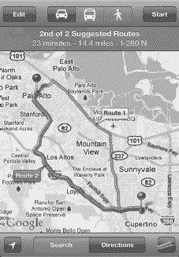

### 切换驾车、公交和步行路线

在开始导航前，您可以通过轻点路线界面顶部蓝色栏左侧的图标来选择您是驾车、使用公共交通还是步行，如图 21-9 所示。

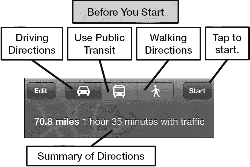

**图 21-9.** *选择出行方式*

### 反转路线

要反转路线，请点击位于顶部`起点`和`终点`字段之间的`反转`  按钮。如果您不擅长自行反转方向，或者您的路线包含大量单行道，此功能将会非常有用。

## 地图选项

目前，唯一会影响`地图`应用的设置是“定位服务”，这对于确定您当前的位置至关重要。请按照以下步骤调整`地图`应用的设置：

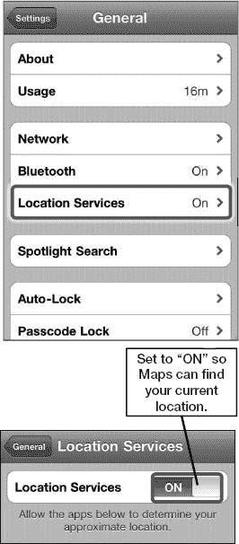

1.  轻点`设置`图标。
2.  轻点`通用`标签页。
3.  现在，找到大约在页面中间的`定位服务`开关。将此开关拨至`打开`位置，以便`地图`可以大致确定您的位置。

**注意：** 保持`定位服务`开关`打开`会略微缩短电池续航时间。如果您从不使用`地图`或不关心您的位置，请将其设为`关闭`以节省电池电量。

## 使用数字指南针

iPhone 内置了非常酷的数字指南针功能。当您需要确定方位并找出哪个方向是北时，这会很有帮助。

### 校准和使用数字指南针

在使用数字指南针之前，您需要先对其进行校准。通常您只需在首次使用时校准一次。请按照以下步骤操作：

1.  像往常一样启动`地图`。
2.  轻点两次当前位置按钮——它会从  变为 。
3.  您会看到屏幕上出现一个`数字指南针`图标，如图 21-10 所示。
4.  首次使用数字指南针功能时，屏幕上会出现`校准`符号。
5.  按照屏幕提示，以“8”字形移动您的 iPhone。

    **注意**：在完成校准过程时，iPhone 可能会要求您远离任何干扰源。

6.  将 iPhone 水平握持，使其与地面平行。如果校准成功，指南针将转动并指向北方。

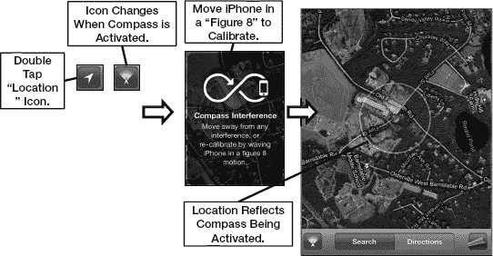

**图 21-10.** *使用数字指南针功能*

