# 第 22 章

## 您设备上的 iTunes

在本章中，您将学习如何直接在 iPhone 上使用`iTunes`应用查找、购买和下载媒体内容。通过`iTunes`，您将能够下载音乐、影片、电视节目、播客和有声读物。您还将了解 iTunes 中`iTunes U`板块提供的来自顶尖大学的免费教育内容，以及如何兑换 iTunes 礼品卡。

我们中的一些人还记得当年新单曲或专辑发行时去唱片店的情景。浏览我们想要的所有音乐——先是黑胶唱片集，然后是磁带，最后是 CD——那是一种令人兴奋的感觉。

随着 iPhone 的出现，那些日子早已一去不复返。音乐、影片、电视节目以及更多内容都可以直接从 iPhone 上获取。

iTunes 是一个音乐、视频、电视节目、播客等内容的商店。您能在 iPhone 上消费的几乎所有类型的媒体都可以从 iTunes 商店中购买或租赁（而且通常可以免费获取）。

### iTunes 入门

在本书的前面部分，我们向您展示了如何将电脑上 iTunes 中的音乐导入 iPhone（参见第 3 章：“与 iCloud、iTunes 及更多服务同步”）。iTunes 的一大优点是，商店让您很容易就能购买或获取音乐、视频、播客和有声读物，然后在几分钟内直接在 iPhone 上使用它们。

iPhone 允许您直接在设备上访问 iTunes 网站（移动版）。在您购买或索取免费项目后，它们将被下载到 iPhone 上的`音乐`或`视频`应用中。如果您有 iCloud 并开启了自动下载，您购买的任何音乐都会自动下载到您的其他 iOS 设备和电脑上的 iTunes。下次您与桌面 iTunes 资料库同步时，影片也会同步过去。

#### 需要网络连接

您需要一个有效的互联网连接（Wi-Fi 或 3G/蜂窝网络）才能访问 iTunes 商店。有关更多信息，请查阅第 4 章：“网络连接”。

#### 启动 iTunes

当你第一次拿到 iPhone 时，`iTunes` 是主屏幕（`Home`）第一页上的图标之一。轻点 `iTunes` 图标，你将会进入 iTunes Store 的移动版页面。

**注意：** `iTunes` 应用程序会频繁更新。由于 `iTunes` 应用本质上是一个网站，因此从我们编写本书到你实际在 iPhone 上查看它之间，它可能会发生一些变化。某些屏幕图像或按钮可能会与本书中显示的略有不同。

此外，`iTunes` 的内容在不同国家/地区之间可能存在显著差异。根据你所在的位置，你可能无法访问电影、电视节目或其他媒体内容。不过，苹果公司正持续将 `iTunes` 内容扩展到越来越多的地区，所以请时不时回来查看一下。

#### 浏览 iTunes

`iTunes` 应用使用的图标与 iPhone 上的其他程序类似，因此操作起来相当简单。顶部有三个按钮，底部有五个软键，可为你提供帮助。你可以自定义这些软键，我们将在下一节中向你展示如何操作。请注意右侧图片中底部的软键。在 `iTunes` 中滚动与其他程序中的滚动方式相同；向上或向下移动手指即可查看可用的选项。

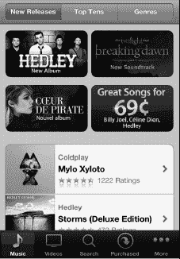

### 自定义 iTunes 软键

自定义 iTunes 屏幕底部显示的软键很简单。轻点左下角的 `More`（更多）软键。然后轻点右上角的 `Edit`（编辑）。

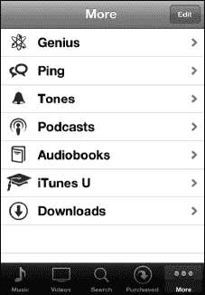

现在，你可以通过将顶部任意图标拖放到底部的软键工具栏上来更改软键。你放置的任何项目都会替换掉原来在那个位置上的图标。

轻点 `Done`（完成）以完成更改并返回到 `iTunes`。

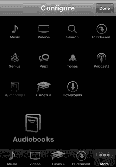

### 使用“最新发布”、“前十榜单”和“类型”查找音乐

在 iTunes 音乐商店屏幕的顶部有三个按钮：`Featured`（精选）、`Top Charts`（排行）和 `Genius`（天才）。默认情况下，当你启动 `iTunes` 时，会显示 `Featured`（精选）选项。

#### 前十榜单：热门内容

如果你想知道某个特定类别里的热门内容，可以浏览 `Top Tens`（前十榜单）下的类别。轻点顶部的 `Top Tens`（前十榜单），然后轻点一个类别或类型，即可查看该类别中的热门内容。

**注意：** `Top Tens`（前十榜单）类别中的项目销量很好，但这并不意味着它们一定会符合你的口味。在付费之前，务必先预览项目并查看其评价。

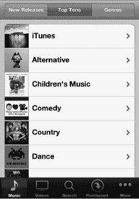

#### 类型：音乐的种类

轻点 `Genres`（类型）按钮，可以按类型浏览音乐。如果你有最喜欢的音乐类型，并且只想浏览该类别，这个功能特别有用。

这里有大量的类型可供浏览；就像在其他 iPhone 应用中一样，向下滚动列表即可。

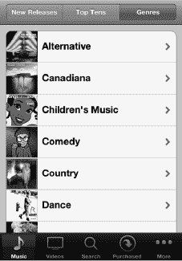

继续浏览音乐，直到你找到想要预览或购买的内容。

#### 浏览视频（电影）

轻点顶部的 `Movies`（电影）、`TV Shows`（电视节目）或 `Movie Videos`（音乐视频）按钮，可以浏览所有与视频相关的项目。

你也可以用手指一直滚动到页面底部，查看那里的链接，特别是以下链接：

*   `Top Tens`（前十榜单）
*   `Genres`（类型）

**提示：** 在大多数页面的最底部，你还可以兑换礼品卡，或者退出你的 Apple ID 并登录另一个 Apple ID 账户。如果有人（可能是你的孩子）更改了 Apple ID，而你想换回你自己的账户时，这个功能就很有用。

轻点任何电影或视频，可以查看更多详细信息或预览该选项。你可以选择租借或购买某些电影和电视节目：

*   `Rentals`（租赁）：某些电影可以按固定天数租借。点击此按钮即可租借一部作品。

    **注意：** 美国的租赁期限是 24 小时，加拿大的租赁期限是 48 小时。其他国家的租赁期限可能略有不同。

*   `Buy`（购买）：点击此按钮，你可以购买并永久拥有该电影或电视节目。

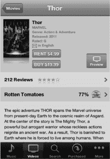

#### 查找电视节目

查看完电影后，轻点顶部的 `TV Shows`（电视节目）按钮，即可查看你最喜欢的节目有哪些可用内容。

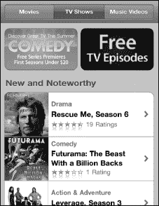

当你轻点一个电视剧集时，你会看到可用的单集。轻点任何一集即可查看 30 秒的预览（更多关于观看视频的内容，请参见第 15 章：“观看视频”）。预览结束后，轻点 `Done`（完成）按钮。

当你准备好后，可以购买单集或整部电视剧集。许多（但并非全部）电视剧集允许你单独购买单集，如图 22–1 所示。

例如，你可能想看一集《摩登家庭》，并补上你错过的首播集。在 iPhone 上可以快速轻松地完成这个操作。

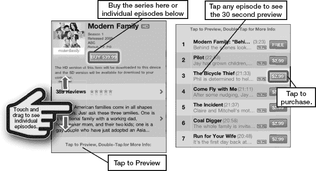

**图 22–1.** *购买电视剧季或单集*

**注意：** 还有一个 `Free TV Episode`（免费电视单集）类别，你可以在其中获取样本和额外内容。

#### iTunes 中的有声读物

有声读物是享受书籍而无需阅读的好方法。一些朗读者非常有趣，听起来几乎就像在看电影。例如，哈利·波特系列的朗读者能够演绎几十种真正令人惊叹的声音。我们推荐你在 iPhone 上试听一本有声读物；有声读物尤其适合在飞机上，当你想要逃离其他乘客但又不想开灯的时候收听。

**提示：** 如果你经常听有声读物，订阅 `Audible.com` 可以让你以更便宜的价格获得相同的内容。

如果你是有声读物的爱好者，一定要查看 iTunes 中的 `Audiobooks`（有声读物）版块。

你可以点击顶部三个按钮之一来浏览 `Audiobooks`（有声读物）中的以下区域：

*   `Featured`（精选）
*   `Top Tens`（前十榜单）
*   `Categories`（类别）

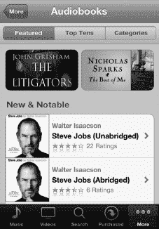

### iTunes U：优质的教育内容

如果你喜欢教育内容，那么可以查看 `iTunes U` 版块。你将能够看到你的大学、学院或学校是否有自己的专区。

我们仅浏览了几分钟就发现了一个很好的例子：一场由三位诺贝尔奖得主经济学家参与的圆桌讨论，由保罗·索尔曼（PBS 新闻小时的财经记者）主持。你可以通过以下菜单导航找到这个播客：`iTunes U`  `Universities & Colleges`（大学与学院）  `Boston University`（波士顿大学）  `BUNIVERSE - Business`（商业）  `Audio`（音频）。和 `iTunes U` 中的许多内容一样，这个播客是免费的！

如果你所在位置有良好的无线信号，你可以轻点音频或视频项目的标题，然后在线流式播放收听或观看。但是，如果你的信号中断，你将丢失在视频中的播放位置。实际下载文件（如果可能）以供稍后观看有很多好处，其中最重要的是你可以对观看视频的体验拥有更多控制权。

### 下载以供离线查看

如果你知道自己将要一段时间没有无线网络覆盖，例如在飞机上或地铁里，你会希望将内容下载下来，以便离线后再观看或收听。点击 `免费` 按钮，它变成 `下载` 按钮，然后再次点击它。接着，你可以通过点击屏幕右下角的 `下载` 按钮来监控下载进度（一些较大的视频文件可能需要十分钟或更长时间才能完成）。下载完成后，该项目会出现在你的“音乐”或“视频”应用中相应的区域。

**注意：** 任何大于 20MB 的文件都无法通过 3G 网络下载；对于较大的文件，你必须使用无线局域网。

### 搜索 iTunes

有时候你很清楚自己想要什么，但不确定它在哪里，或者你不想浏览或翻遍所有菜单。`搜索` 工具就是为你准备的。

在 `iTunes` 应用的右上角（几乎与所有其他 iPhone 应用一样），有一个 `搜索` 窗口。

触摸 `搜索`，`搜索` 窗口和设备键盘会弹出。一旦你开始输入，iPhone 就会开始将你的输入内容与可能的匹配项进行对照。

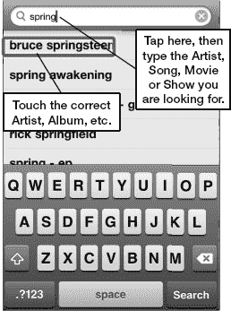

输入你正在搜索的艺术家、歌曲名称、视频名称、播客名称或专辑，iPhone 会显示详细的匹配结果。你可以搜索得泛泛，也可以搜索得非常具体。如果你只是想浏览某位艺术家的所有特定歌曲，请输入艺术家的名字。如果你想要某首特定的歌曲或专辑，请输入歌曲或专辑的全名。

当你找到歌曲或专辑的名称时，只需触摸它，你就会被带到购买页面。

### 购买或租借音乐、视频、播客等

一旦你找到一首歌、视频、电视节目或专辑，你可以点击 `购买` 按钮，或者（如果看到的话）`租借` 按钮。这将使你的媒体开始下载。（如果内容是免费的，那么你会看到 `免费` 按钮，点击后它会变成 `下载` 按钮。）

我们建议你先试听或观看预览，并查看客户评论，除非你十分确定要购买该项目。

**注意：** 你还可以从 iTunes 商店为你的手机购买*铃声*。请务必查看第 9 章：“使用电话”，我们在那里展示了如何免费创建你自己的铃声！

#### 预览音乐

点击歌曲标题或其左侧的音轨序号；这会将专辑封面翻转过来并启动预览窗口。

你将听到一段 90 秒的代表性歌曲片段。

点击 `停止` 按钮，音轨序号将再次显示。

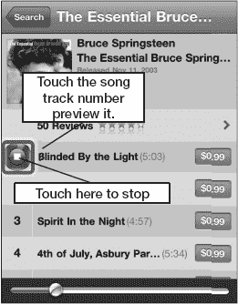

#### 查看客户评论

iTunes 中的许多项目都提供客户评论。评论从最低的一星到最高的五星不等。

**警告：** *请注意，评论中可能包含不文明语言。* 很多评论是干净的；然而，有些确实包含不文明语言，而 iTunes 商店可能不会立即察觉。

阅读评论可以让你很好地了解自己是否喜欢并想购买这个项目。

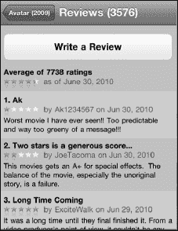

#### 预览视频、电视节目或音乐视频

iTunes 上几乎所有东西都提供预览。有时你会看到一个 `预览` 按钮，例如音乐视频和电影。电视节目则有些不同；你需要点击剧集标题才能看到 30 秒的预览。

我们强烈建议在 iTunes 上购买项目之前，先查看评论并尝试预览。

典型的电影预告片或预告片会超过 30 秒。有些长达两分半钟或更久。

#### 购买歌曲、视频或其他项目

一旦你确定要购买一首歌、视频或其他项目，请按照以下步骤进行购买：

1. 点击歌曲的 `价格` 按钮或 `购买` 按钮。
2. 按钮会改变并变成一个绿色的 `立即购买`、`购买歌曲`、`购买单曲` 或 `购买专辑` 按钮。
3. 点击 `购买` 按钮。

    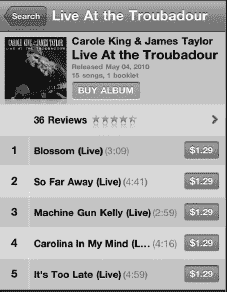

4. 你会看到一个动画图标跳入购物车。输入你的 iTunes 密码，然后点击 `好` 来完成购买。

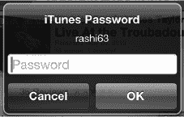

点击 `更多` 按钮，然后点击 `下载` 来查看专辑中每首歌的下载进度。

然后，这首歌或专辑就会成为你音乐库的一部分，并在你下次将 iPhone 连接到电脑上的 iTunes 时与电脑同步。注意：iCloud 会自动完成此同步。

下载完成后，你会在你的“音乐”应用中相应的分类里看到新的歌曲、有声书、播客或 iTunes U 播客。

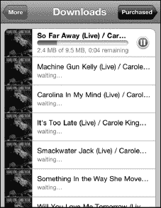

**注意：** 购买的视频和 iTunes U 视频会进入你 iPhone 上的“视频”应用，而播客则会显示在“音乐”应用中。

### iTunes 中的播客

播客通常是一系列音频片段；这些可能会频繁更新（例如国家公共广播电台的每小时新闻播报），或者根本不更新（例如关于特定主题的一次性讲座录音）。

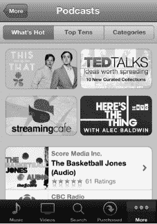

你可以点击顶部三个按钮来浏览 iTunes 中的播客分类：

-   `热门`
-   `十佳`
-   `分类`

#### 下载播客

播客有视频和音频两种形式。当你找到某个播客时，只需点击该播客的标题（参见图 22–2）。幸运的是，大多数播客是免费的。如果是免费的，你会看到一个 `免费` 按钮，而不是通常的 `购买` 按钮。

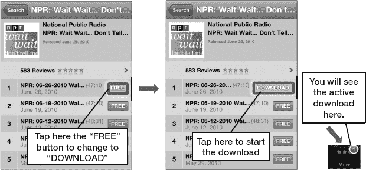

**图 22–2.** *下载一个 NPR 播客*

当你点击该按钮时，它会变成一个绿色的 `下载` 按钮。点击 `下载`，一个动画图标会跳入底部功能键栏中的 `下载` 图标中。一个红色小数字显示正在下载的文件数量。

#### 下载图标：停止和删除下载

当你下载项目时，它们会出现在你的 `下载` 屏幕中。这个行为与你电脑上 `iTunes` 应用的行为类似。

你可以点击 `更多` 功能键，然后点击 `下载` 标签来查看所有下载的进度。

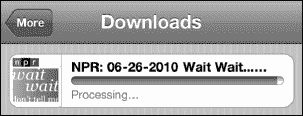

#### 下载的内容去哪里了

你可以通过点击 `更多` 图标，在你的“音乐”或“视频”应用中看到所有下载内容，该图标会按类别显示你的下载内容。换句话说，如果你下载了一个播客，你需要进入你的“音乐”应用，点击 `更多`，然后点击 `播客` 标签来查看已下载的播客。

有时，你决定不想要所有已选择的下载内容。如果你想停止下载并删除它，用手指在下载项上滑动以调出 `删除` 按钮，然后点击 `删除`（参见图 22–3）。

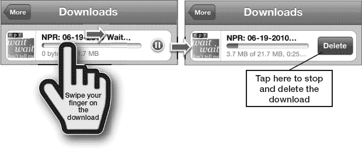

**图 22–3.** *在下载过程中删除文件*

### 兑换 iTunes 礼品卡

你 iPhone 上 `iTunes` 应用的酷炫之处在于，就像你电脑上的 `iTunes` 应用一样，你可以兑换一张礼品卡，从而在 iTunes 账户中收到用于购买的余额。

在 `iTunes` 屏幕的底部，你应该能看到 `兑换` 按钮（参见图 22–4）。

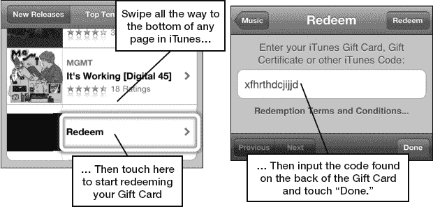

**图 22–4.** *兑换 iTunes 礼品卡*

点击 `兑换` 按钮，开始输入你的 iTunes 礼品卡号码以获取 iTunes 商店余额的流程。

好的，作为一名高级文档工程师和翻译员，我将遵循您提供的注意事项和示例，将给定的英文文本翻译成中文。

### Ping

`Ping` 是 Apple 的音乐社交网络。您可以通过点击标签栏底部中央的 **Ping** 按钮来访问它。

借助 `Ping`，您可以查看您关注的艺人和好友正在购买和评论哪些音乐，而您的关注者也可以看到您购买和评论的音乐。`Ping` 还允许您将您的购买记录发布到推文上。

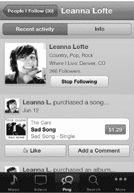

`Ping` 包含三个板块：

- **动态：** 显示您关注的所有人的购买和评论活动。您可以查看 **全部** 动态、仅 **艺人** 动态，或仅 **用户**（非艺人）动态。
- **用户：** 为您提供您 **关注的** 其他 `Ping` 用户的列表；**关注您的** `Ping` 用户列表；以及 `Ping` 认为您可能感兴趣的 **推荐艺人**、**推荐艺术家** 和 **推荐用户** 列表。
- **我的个人资料：** 显示您自己的所有近期活动，并允许您访问 **我的信息**，其中会显示您的个人资料信息以及您喜欢的音乐的专辑封面。

**注意**：在撰写本文时，`Ping` 尚未获得广泛普及。如果您是一位狂热的音乐爱好者，并且您和您的朋友经常从 `iTunes` 购买大量音乐，那么我们当然建议您至少尝试一下。不过，您也可能会发现像 `Twitter` 和 `Facebook` 这样更成熟（即便更通用）的社交网络更符合您的喜好。

